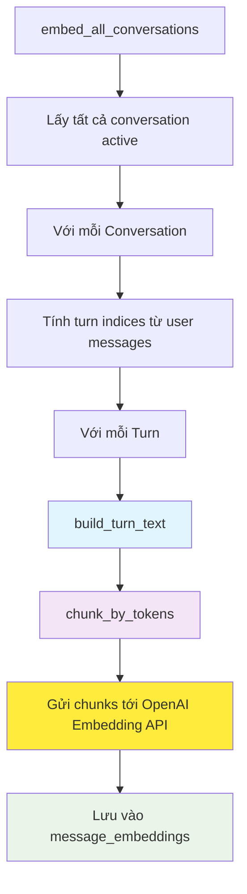
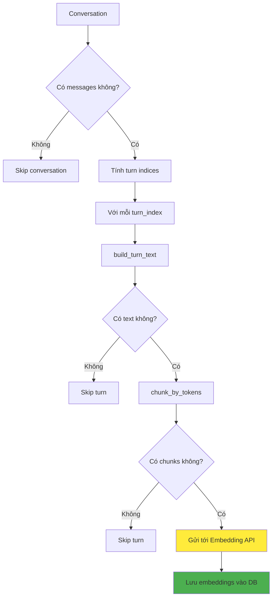
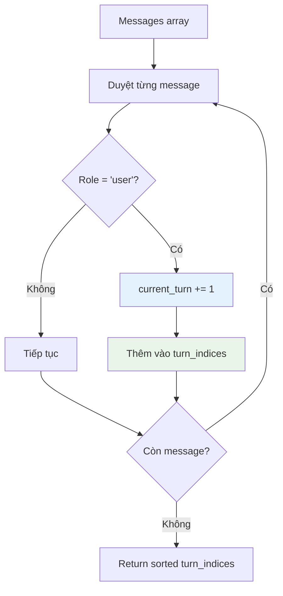

# Embedding Worker - Tài liệu kỹ thuật

## Tổng quan

Embedding Worker là một component quan trọng trong hệ thống Agent API, chịu trách nhiệm tạo vector embeddings cho tất cả các cuộc hội thoại đang hoạt động. Worker này hỗ trợ hệ thống RAG (Retrieval-Augmented Generation) bằng cách chuyển đổi nội dung hội thoại thành vector để có thể tìm kiếm semantic.

> **Lưu ý**: Đây là phiên bản MVP (Minimum Viable Product). Code đủ để chạy và hoạt động ổn định, nhưng chưa được tối ưu hoàn toàn. Sẽ có các cải tiến về performance và tính năng trong tương lai.

## Kiến trúc tổng thể



## Luồng xử lý chi tiết

### 1. Xử lý Conversation



### 2. Turn Index Calculation



## Cấu trúc dữ liệu

### Bảng `conversations`
```sql
CREATE TABLE conversations (
    id             UUID PRIMARY KEY,
    user_id        TEXT NOT NULL,
    title          TEXT,
    messages       JSONB NOT NULL DEFAULT '[]',
    is_active      BOOLEAN NOT NULL DEFAULT TRUE,
    created_at     TIMESTAMPTZ NOT NULL DEFAULT NOW(),
    updated_at     TIMESTAMPTZ NOT NULL DEFAULT NOW()
);
```

### Bảng `message_embeddings`
```sql
CREATE TABLE message_embeddings (
    chunk_id       TEXT PRIMARY KEY,
    conversation_id UUID NOT NULL REFERENCES conversations(id),
    turn_index     INTEGER NOT NULL,
    message_ids    INTEGER[] NOT NULL,
    chunk_text     TEXT NOT NULL,
    embedding      VECTOR(1536) NOT NULL,  -- OpenAI ada-002 dimensions
    user_id        TEXT NOT NULL,
    chunk_seq      INTEGER NOT NULL,
    created_at     TIMESTAMPTZ NOT NULL DEFAULT NOW(),
    updated_at     TIMESTAMPTZ NOT NULL DEFAULT NOW()
);
```

## Các hàm chính

### `embed_all_conversations()`

**Mục đích**: Entry point để tạo embeddings cho tất cả conversation đang active

**Tham số**:
- `db`: Database connection (optional, sẽ tạo mới nếu không có)

**Logic**:
1. Lấy tất cả conversation có `is_active = TRUE`
2. Với mỗi conversation:
   - Parse messages array
   - Tính turn indices từ user messages
   - Với mỗi turn: build text → chunk → embed → save
3. Xử lý lỗi gracefully (không dừng khi một conversation bị lỗi)

**Đặc điểm**:
- ✅ Chỉ xử lý conversation active
- ✅ Batch processing tất cả conversation
- ✅ Upsert embeddings (ON CONFLICT DO UPDATE)
- ❌ **Chưa tối ưu**: Không có incremental processing
- ❌ **Chưa tối ưu**: Không có parallel processing

### Turn Index Calculation

**Logic**:
```python
turn_indices = []
current_turn = 0

for msg in messages:
    if msg.get("role") == "user":
        current_turn += 1
        if current_turn not in turn_indices:
            turn_indices.append(current_turn)
```

**Đặc điểm**:
- ✅ Chỉ đếm user messages
- ✅ Tự động tăng turn index
- ❌ **Chưa tối ưu**: Logic đơn giản, có thể cải tiến

### Embedding Process

**Các bước**:
1. `build_turn_text(messages, turn_index)` → Tạo text từ turn
2. `chunk_by_tokens(turn_text)` → Chia nhỏ text theo token limit
3. `client.embeddings.create()` → Gửi tới OpenAI API
4. Lưu từng chunk với embedding tương ứng

**Đặc điểm**:
- ✅ Sử dụng OpenAI Embedding API
- ✅ Hỗ trợ custom base_url và dimensions
- ✅ Chunk theo token limit để tránh vượt quá API limit
- ❌ **Chưa tối ưu**: Không có retry mechanism
- ❌ **Chưa tối ưu**: Không có rate limiting

## Chunk ID Generation

### Cấu trúc Chunk ID
```python
def chunk_uuid(conv_id: str, turn_index: int, chunk_seq: int) -> str:
    # Format: {conv_id}_{turn_index}_{chunk_seq}
    return f"{conv_id}_{turn_index}_{chunk_seq}"
```

### Ví dụ
| Conversation ID | Turn | Chunk Seq | Chunk ID |
|----------------|------|-----------|----------|
| `abc-123-def` | 1 | 1 | `abc-123-def_1_1` |
| `abc-123-def` | 1 | 2 | `abc-123-def_1_2` |
| `abc-123-def` | 2 | 1 | `abc-123-def_2_1` |

**Đặc điểm**:
- ✅ Unique identifier cho mỗi chunk
- ✅ Dễ debug và trace
- ❌ **Chưa tối ưu**: Không có UUID format validation

## Cách sử dụng

### Chạy manual
```bash
# Embed tất cả conversation
docker exec a20_agent_api python -m src.workers.embedding_worker
```

### Chạy định kỳ (Cron job)
```bash
# Chạy hàng ngày lúc 3:00 AM (sau summary worker)
0 3 * * * docker exec a20_agent_api python -m src.workers.embedding_worker
```

### Chạy trong code
```python
from src.workers.embedding_worker import embed_all_conversations

# Với database connection riêng
await embed_all_conversations()

# Với database connection có sẵn
await embed_all_conversations(db=existing_db)
```

## Configuration

### Environment Variables
```bash
# OpenAI API
OPENAI_API_KEY=sk-...
EMBEDDING_BASE_URL=https://api.openai.com/v1  # Optional
EMBEDDING_MODEL=text-embedding-ada-002
EMBEDDING_DIMENSIONS=1536

# Database
DATABASE_URL=postgresql://...
```

### Settings
```python
class Settings:
    openai_api_key: str
    embedding_base_url: str | None = "https://api.openai.com/v1"
    embedding_model: str = "text-embedding-ada-002"
    embedding_dimensions: int = 1536
    database_url: str
```

## Dependencies

### Từ services/rag.py
- `build_turn_text(messages, turn_index)`: Tạo text từ turn
- `chunk_by_tokens(text)`: Chia text thành chunks
- `chunk_uuid(conv_id, turn_index, chunk_seq)`: Tạo chunk ID
- `vec_literal(embedding)`: Format vector cho PostgreSQL

### External APIs
- **OpenAI Embeddings API**: Tạo vector embeddings
- **PostgreSQL với pgvector**: Lưu trữ vector embeddings

## Performance & Optimization

### Hiện tại (MVP)
- ✅ Batch processing tất cả conversation
- ✅ Upsert để tránh duplicate
- ✅ Graceful error handling

### Chưa tối ưu (sẽ cải tiến sau)
- ❌ **Incremental processing**: Hiện tại re-embed tất cả conversation mỗi lần chạy
- ❌ **Parallel processing**: Xử lý từng conversation tuần tự
- ❌ **Rate limiting**: Không có throttling cho API calls
- ❌ **Retry mechanism**: Không retry khi API call fail
- ❌ **Progress tracking**: Không có progress bar hoặc metrics
- ❌ **Memory optimization**: Load tất cả conversation vào memory
- ❌ **Selective re-embedding**: Không check xem conversation đã thay đổi chưa

## Monitoring & Logging

### Log Messages
```
INFO: Embedding X conversation(s)
INFO: conv {conv_id} turn {turn_index}: {chunk_count} chunk(s) embedded
ERROR: Embedding API failed for conv {conv_id} turn {turn_index}
```

### Metrics cần theo dõi
- Số conversation được embed / lần chạy
- Số chunks được tạo / conversation
- Thời gian xử lý trung bình / conversation
- Tỷ lệ lỗi API calls
- Kích thước embedding storage

## Troubleshooting

### Conversation không được embed
1. Kiểm tra `is_active = TRUE`
2. Kiểm tra messages array không rỗng
3. Kiểm tra có user messages không
4. Kiểm tra OpenAI API key và quota

### API calls fail
1. Kiểm tra OpenAI API key
2. Kiểm tra network connectivity
3. Kiểm tra API quota và rate limits
4. Kiểm tra chunk size không vượt quá token limit

### Database errors
1. Kiểm tra pgvector extension đã install
2. Kiểm tra embedding dimensions match với model
3. Kiểm tra database connection và permissions

### Performance chậm
1. Kiểm tra OpenAI API response time
2. Kiểm tra database write performance
3. Xem xét implement parallel processing
4. Xem xét implement incremental updates

## Tương lai - Cải tiến dự kiến

### 1. Incremental Processing
```python
# Thêm last_embedded_at vào conversations table
# Chỉ embed conversation có updated_at > last_embedded_at
```

### 2. Parallel Processing
```python
# Sử dụng asyncio.gather() để xử lý nhiều conversation đồng thời
# Implement semaphore để control concurrency
```

### 3. Smart Re-embedding
```python
# Hash message content để detect changes
# Chỉ re-embed khi content thay đổi
```

### 4. Progress Tracking
```python
# Thêm progress bar với tqdm
# Log detailed metrics và timing
```

### 5. Error Recovery
```python
# Implement exponential backoff retry
# Queue failed embeddings để retry sau
```

### 6. Memory Optimization
```python
# Stream processing thay vì load all vào memory
# Implement pagination cho large datasets
```

### 7. API Optimization
```python
# Batch multiple chunks trong một API call
# Implement rate limiting và quota management
```

## Tích hợp với các component khác

### RAG System
- **Input**: Embeddings từ worker này
- **Usage**: Semantic search trong conversation history
- **Performance**: Vector similarity search với pgvector

### Summary Worker
- **Relationship**: Chạy sau Summary Worker
- **Dependency**: Cần conversation summaries để embed
- **Scheduling**: Summary (2 AM) → Embedding (3 AM)

### Personalization Service
- **Usage**: Tìm conversation tương tự để cá nhân hóa
- **Input**: User query embeddings
- **Output**: Relevant conversation chunks

## Migration & Schema

### Tạo bảng message_embeddings
```sql
-- Cần pgvector extension
CREATE EXTENSION IF NOT EXISTS vector;

CREATE TABLE message_embeddings (
    chunk_id       TEXT PRIMARY KEY,
    conversation_id UUID NOT NULL REFERENCES conversations(id) ON DELETE CASCADE,
    turn_index     INTEGER NOT NULL,
    message_ids    INTEGER[] NOT NULL,
    chunk_text     TEXT NOT NULL,
    embedding      VECTOR(1536) NOT NULL,
    user_id        TEXT NOT NULL,
    chunk_seq      INTEGER NOT NULL,
    created_at     TIMESTAMPTZ NOT NULL DEFAULT NOW(),
    updated_at     TIMESTAMPTZ NOT NULL DEFAULT NOW()
);

-- Indexes cho performance
CREATE INDEX idx_message_embeddings_conversation_id ON message_embeddings(conversation_id);
CREATE INDEX idx_message_embeddings_user_id ON message_embeddings(user_id);
CREATE INDEX idx_message_embeddings_embedding ON message_embeddings USING ivfflat (embedding vector_cosine_ops);
```

### Cleanup old embeddings
```sql
-- Xóa embeddings của conversation không active
DELETE FROM message_embeddings 
WHERE conversation_id NOT IN (
    SELECT id FROM conversations WHERE is_active = TRUE
);
```

## Kết luận

Embedding Worker là component thiết yếu cho hệ thống RAG, chuyển đổi conversation thành vector để tìm kiếm semantic. Phiên bản hiện tại (MVP) hoạt động ổn định và đáp ứng được nhu cầu cơ bản, nhưng còn nhiều điểm cần tối ưu về performance và tính năng.

Các cải tiến quan trọng nhất cần implement:
1. **Incremental processing** - Chỉ embed conversation mới/thay đổi
2. **Parallel processing** - Tăng tốc độ xử lý
3. **Error recovery** - Retry mechanism cho API calls
4. **Memory optimization** - Giảm memory usage cho large datasets

Worker này tạo nền tảng cho các tính năng AI nâng cao như semantic search, conversation similarity, và personalized recommendations.