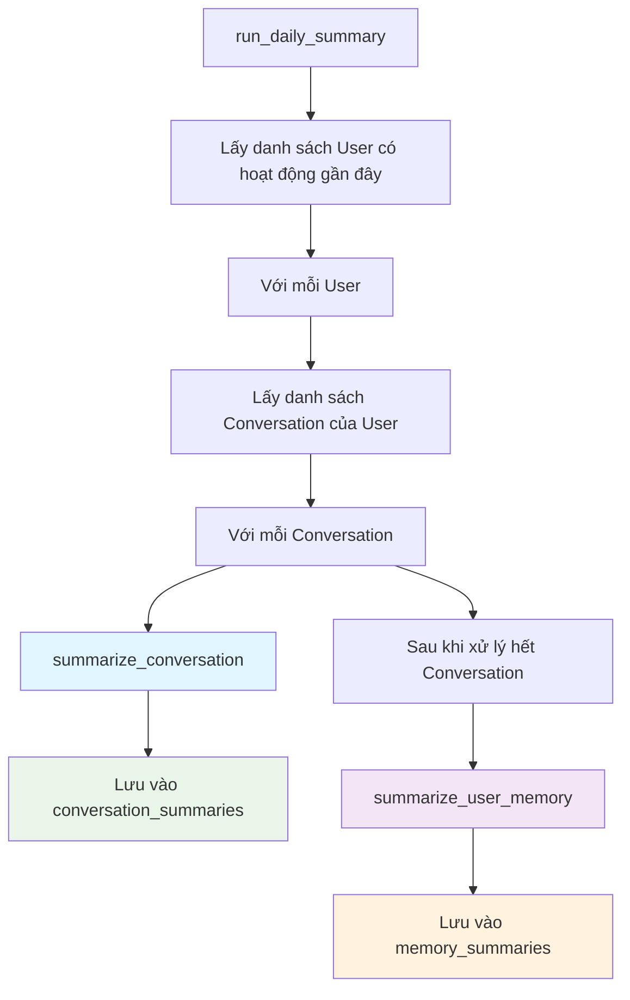
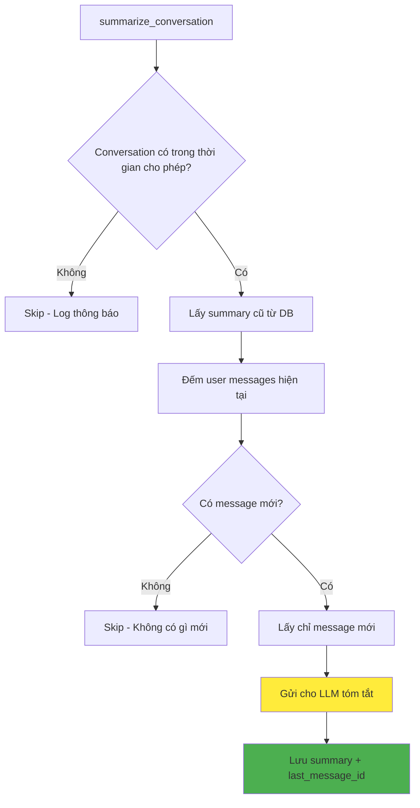
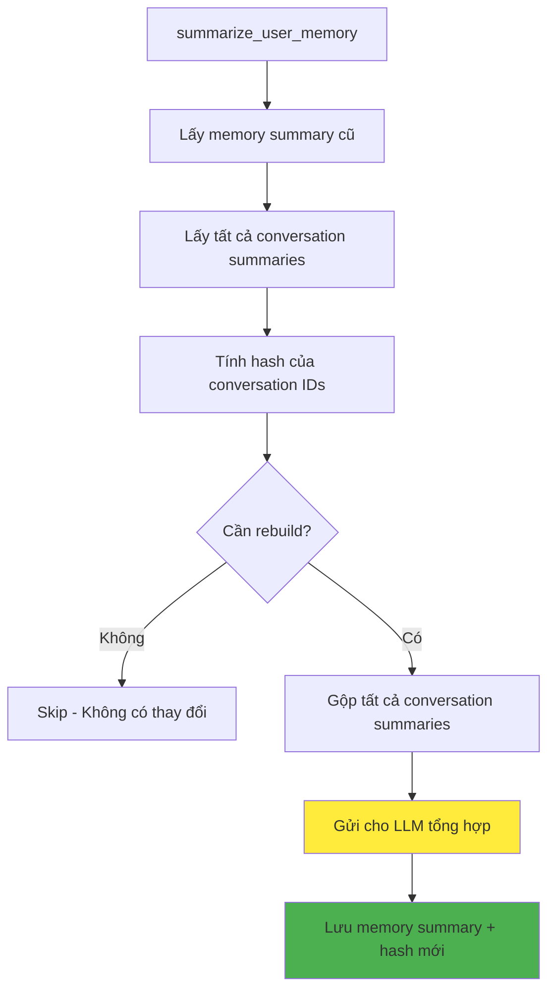

# Summary Worker - Tài liệu kỹ thuật

## Tổng quan

Summary Worker là một component quan trọng trong hệ thống Agent API, chịu trách nhiệm tóm tắt các cuộc hội thoại và tạo bộ nhớ dài hạn cho người dùng. Worker này giúp hệ thống "nhớ" được ngữ cảnh và thông tin quan trọng của user qua nhiều cuộc hội thoại mà không cần load toàn bộ lịch sử chat.

## Kiến trúc tổng thể



## Luồng xử lý chi tiết

### 1. Tóm tắt Conversation



### 2. Tóm tắt User Memory



## Cấu trúc dữ liệu

### Bảng `conversations`
```sql
CREATE TABLE conversations (
    id             UUID PRIMARY KEY,
    user_id        TEXT NOT NULL,
    title          TEXT,
    messages       JSONB NOT NULL DEFAULT '[]',
    is_active      BOOLEAN NOT NULL DEFAULT TRUE,
    created_at     TIMESTAMPTZ NOT NULL DEFAULT NOW(),
    updated_at     TIMESTAMPTZ NOT NULL DEFAULT NOW()
);
```

### Bảng `conversation_summaries`
```sql
CREATE TABLE conversation_summaries (
    id             BIGSERIAL PRIMARY KEY,
    conversation_id UUID NOT NULL REFERENCES conversations(id),
    user_id        TEXT NOT NULL,
    summary        TEXT NOT NULL,
    last_message_id BIGINT NOT NULL DEFAULT 0,  -- Index của user message cuối đã tóm tắt
    created_at     TIMESTAMPTZ NOT NULL DEFAULT NOW(),
    updated_at     TIMESTAMPTZ NOT NULL DEFAULT NOW()
);
```

### Bảng `memory_summaries`
```sql
CREATE TABLE memory_summaries (
    id             BIGSERIAL PRIMARY KEY,
    user_id        TEXT NOT NULL UNIQUE,
    summary        TEXT NOT NULL,
    conversation_ids_hash TEXT NOT NULL DEFAULT '',  -- Hash để detect thay đổi danh sách conversation
    created_at     TIMESTAMPTZ NOT NULL DEFAULT NOW(),
    updated_at     TIMESTAMPTZ NOT NULL DEFAULT NOW()
);
```

## Các hàm chính

### `summarize_conversation()`

**Mục đích**: Tóm tắt một cuộc hội thoại cụ thể

**Tham số**:
- `conversation_id`: ID của conversation cần tóm tắt
- `user_id`: ID của user
- `days`: Số ngày để lọc conversation (mặc định: 180)

**Logic**:
1. Kiểm tra conversation có trong khoảng thời gian cho phép
2. Lấy thông tin summary cũ (nếu có)
3. Đếm số user messages hiện tại
4. So sánh với `last_message_id` để tìm message mới
5. Chỉ tóm tắt message mới (incremental processing)
6. Gửi cho LLM: `summary cũ + message mới`
7. Lưu summary mới và cập nhật `last_message_id`

**Đặc điểm**:
- ✅ Chỉ xử lý user messages (bỏ qua assistant/tool messages)
- ✅ Incremental: Chỉ tóm tắt phần mới
- ✅ Skip nếu không có message mới

### `summarize_user_memory()`

**Mục đích**: Tạo bộ nhớ tổng hợp từ tất cả conversation summaries của user

**Logic**:
1. Lấy memory summary cũ
2. Lấy tất cả conversation summaries đang active
3. Tính hash của danh sách conversation IDs
4. Kiểm tra cần rebuild:
   - Chưa có memory summary
   - Hash thay đổi (conversation bị thêm/xóa)
   - Có conversation summary mới hơn
5. Gộp tất cả conversation summaries
6. Gửi cho LLM tổng hợp thành user profile
7. Lưu memory summary mới + hash mới

**Đặc điểm**:
- ✅ Detect conversation bị xóa qua hash comparison
- ✅ Chỉ rebuild khi cần thiết
- ✅ Tạo user profile dài hạn

### `run_daily_summary()`

**Mục đích**: Entry point để chạy batch tóm tắt cho tất cả user

**Tham số**:
- `days`: Số ngày để lọc user có hoạt động (mặc định: 180)

**Logic**:
1. Tìm tất cả user có conversation active trong X ngày gần đây
2. Với mỗi user:
   - Tóm tắt từng conversation của họ
   - Tóm tắt user memory tổng thể
3. Xử lý lỗi gracefully (không dừng khi một conversation/user bị lỗi)

## Hash-based Change Detection

### Vấn đề
Trước đây, hệ thống không phát hiện được khi conversation bị xóa, dẫn đến memory summary chứa thông tin từ conversation đã không còn tồn tại.

### Giải pháp
Sử dụng MD5 hash của danh sách conversation IDs để detect mọi thay đổi:

```python
def calculate_conversation_hash(conversation_ids: list[str]) -> str:
    """Tính MD5 hash của danh sách conversation IDs đã sắp xếp."""
    if not conversation_ids:
        return ""
    sorted_ids = sorted(conversation_ids)
    ids_string = ",".join(sorted_ids)
    return hashlib.md5(ids_string.encode()).hexdigest()
```

### Ví dụ hoạt động

| Trạng thái | Conversation IDs | Hash | Hành động |
|------------|------------------|------|-----------|
| Ban đầu | `[uuid1, uuid2, uuid3]` | `abc123` | Tạo memory summary |
| Thêm conversation | `[uuid1, uuid2, uuid3, uuid4]` | `def456` | **Rebuild** (hash khác) |
| Xóa conversation | `[uuid1, uuid3, uuid4]` | `ghi789` | **Rebuild** (hash khác) |
| Không thay đổi | `[uuid1, uuid3, uuid4]` | `ghi789` | **Skip** (hash giống) |

## Cách sử dụng

### Chạy manual
```bash
# Mặc định 180 ngày
docker exec a20_agent_api python -m src.workers.summary_worker

# Tùy chỉnh số ngày
docker exec a20_agent_api python -m src.workers.summary_worker 30

# Tóm tắt tất cả conversation (không giới hạn thời gian)
docker exec a20_agent_api python -m src.workers.summary_worker 9999
```

### Chạy định kỳ (Cron job)
```bash
# Chạy hàng ngày lúc 2:00 AM
0 2 * * * docker exec a20_agent_api python -m src.workers.summary_worker
```

## Prompt Templates

### Conversation Summary
```
Bạn là hệ thống tóm tắt hội thoại bằng tiếng Việt.
Hãy viết lại một conversation summary tổng thể, trung thực và ngắn gọn.

Yêu cầu:
- Phản ánh tổng thể conversation, không chỉ một phần nhỏ.
- Nêu rõ chủ đề chính, diễn biến quan trọng, quyết định, kết luận, trạng thái hiện tại và việc còn dang dở nếu có.
- Không suy diễn thêm sở thích, mục tiêu hoặc hồ sơ người dùng nếu dữ liệu không nói rõ.
- Không lặp lại ý nguyên văn; viết thành văn bản mạch lạc.

Summary cũ của conversation:
{existing_summary}

Các user query mới cần được hợp nhất vào summary:
{new_messages}
```

### User Memory Summary
```
Bạn đang tạo user memory summary bằng tiếng Việt từ nhiều conversation summary.

Mục tiêu:
- Tổng hợp các thông tin có thể tái sử dụng ở các conversation sau.
- Ưu tiên các bối cảnh, nhu cầu, chủ đề hoặc thông tin nền xuất hiện lặp lại.
- Chỉ đưa vào các đặc điểm như sở thích, mục tiêu, thói quen, điểm mạnh/yếu nếu chúng xuất hiện rõ ràng trong dữ liệu.
- Loại bỏ các chi tiết ngắn hạn nếu không còn giá trị sử dụng.
- Viết một đoạn tổng hợp mạch lạc, trung thực, không bịa thêm.

Danh sách conversation summary hiện tại:
{conversation_summaries}
```

## Performance & Optimization

### Incremental Processing
- Chỉ tóm tắt message mới, không re-process toàn bộ conversation
- Sử dụng `last_message_id` để track vị trí đã tóm tắt

### Hash-based Change Detection
- So sánh hash thay vì so sánh từng conversation ID
- Performance tốt hơn với danh sách conversation lớn

### Time-based Filtering
- Chỉ xử lý conversation/user có hoạt động gần đây
- Tránh tốn tài nguyên cho conversation "dead"

### Error Handling
- Graceful error handling: không dừng toàn bộ process khi một conversation bị lỗi
- Log chi tiết để debug

## Monitoring & Logging

### Log Messages
```
INFO: Daily summary started for X user(s)
INFO: Processing daily summary for user {user_id}
INFO: Updated conversation summary for conversation {id} user {user_id}
INFO: Updated memory summary for user {user_id}: hash {old_hash} -> {new_hash}
INFO: Skipping conversation {id} for user {user_id}: not found, inactive, or older than X days
INFO: Skipping memory summary for user {user_id}: no changes detected
WARNING: Conversation summary is empty for conversation {id}; skipping update
WARNING: Memory summary is empty for user {user_id}; skipping update
```

### Metrics cần theo dõi
- Số conversation được tóm tắt / ngày
- Số user memory được cập nhật / ngày
- Thời gian xử lý trung bình
- Tỷ lệ lỗi
- Kích thước summary trung bình

## Troubleshooting

### Conversation không được tóm tắt
1. Kiểm tra `updated_at` có trong khoảng thời gian cho phép không
2. Kiểm tra `is_active = TRUE`
3. Kiểm tra có user messages không (chỉ đếm role="user")

### Memory summary không được cập nhật
1. Kiểm tra có conversation summaries không
2. Kiểm tra hash có thay đổi không
3. Kiểm tra có conversation summary mới hơn memory summary không

### Performance chậm
1. Tăng filter thời gian (giảm số ngày)
2. Kiểm tra index database
3. Monitor LLM response time

## Migration

### Xóa cột version và conversation_ids, thêm conversation_ids_hash
```sql
-- Migration: 006_simplify_summary_tables.sql
-- Xóa cột version từ cả 2 bảng
ALTER TABLE conversation_summaries DROP COLUMN IF EXISTS version;
ALTER TABLE memory_summaries DROP COLUMN IF EXISTS version;

-- Xóa cột conversation_ids và thêm conversation_ids_hash
ALTER TABLE memory_summaries DROP COLUMN IF EXISTS conversation_ids;
ALTER TABLE memory_summaries ADD COLUMN IF NOT EXISTS conversation_ids_hash TEXT NOT NULL DEFAULT '';

-- Rollback: 006_simplify_summary_tables_rollback.sql
ALTER TABLE conversation_summaries ADD COLUMN IF NOT EXISTS version INT NOT NULL DEFAULT 1;
ALTER TABLE memory_summaries ADD COLUMN IF NOT EXISTS version INT NOT NULL DEFAULT 1;
ALTER TABLE memory_summaries DROP COLUMN IF EXISTS conversation_ids_hash;
ALTER TABLE memory_summaries ADD COLUMN IF NOT EXISTS conversation_ids UUID[] NOT NULL DEFAULT '{}';
```

## Tương lai

### Cải tiến có thể
1. **Parallel processing**: Xử lý nhiều user đồng thời
2. **Smart scheduling**: Ưu tiên user có hoạt động cao
3. **Summary quality metrics**: Đánh giá chất lượng tóm tắt
4. **Compression**: Nén summary cũ khi quá dài
5. **Real-time updates**: Tóm tắt ngay khi có message mới thay vì batch

### Tích hợp với các component khác
- **RAG System**: Sử dụng summary cho retrieval
- **Personalization**: Dùng memory summary để cá nhân hóa response
- **Analytics**: Phân tích xu hướng từ conversation summaries