# SAD — System Architecture Document
## LMS Chatbot Có Trí Nhớ (AI20K-015)

**Phiên bản:** 3.0  
**Ngày:** 2026-04-29
**Nhóm:** Team 100  
**Trạng thái:** Approved
**Phạm vi:** Hệ thống LMS dành cho Sinh viên, Giảng viên, Quản trị viên hệ thống, Khoa/Bộ môn/Phòng đào tạo, Cố vấn học tập  
**Mục tiêu tài liệu:** Mô tả kiến trúc tổng thể, thành phần hệ thống, luồng giao tiếp, mô hình triển khai, bảo mật, dữ liệu, tích hợp và các quyết định kỹ thuật phục vụ phát triển hệ thống LMS.

---

## 1. Tổng quan tài liệu

### 1.1. Mục đích

Tài liệu SAD mô tả kiến trúc hệ thống LMS ở mức tổng quan và chi tiết để các nhóm sau có thể sử dụng thống nhất:

- Product Owner / Business Analyst
- UI/UX Designer
- Frontend Developer
- Backend Developer
- Database Engineer
- DevOps Engineer
- QA / Tester
- Security Engineer
- Giảng viên, khoa/phòng đào tạo, cố vấn học tập trong vai trò stakeholder

Tài liệu này trả lời các câu hỏi chính:

- Hệ thống gồm những thành phần nào?
- Frontend giao tiếp Backend như thế nào?
- Backend tổ chức module/domain ra sao?
- Database, Redis, file storage, email, notification, video, online meeting được dùng thế nào?
- 5 nhóm người dùng truy cập các chức năng qua kiến trúc nào?
- Cơ chế xác thực, phân quyền, bảo mật, audit log, backup, deployment hoạt động ra sao?
- Hệ thống có thể mở rộng, bảo trì và tích hợp với hệ thống khác như thế nào?

---

## 2. Phạm vi hệ thống

### 2.1. Đối tượng sử dụng

Hệ thống LMS phục vụ 5 nhóm người dùng chính:

| STT | Đối tượng | Vai trò chính |
|---|---|---|
| 1 | Sinh viên | Học tập, xem học liệu, nộp bài, làm quiz/thi, xem điểm, điểm danh, trao đổi, nhận cảnh báo |
| 2 | Giảng viên | Quản lý lớp học phần, bài giảng, bài tập, quiz, điểm, điểm danh, forum, báo cáo lớp |
| 3 | Quản trị viên hệ thống | Quản trị người dùng, role, permission, tổ chức, học kỳ, môn học, cấu hình, bảo mật, backup, báo cáo toàn hệ thống |
| 4 | Khoa / Bộ môn / Phòng đào tạo | Quản lý chương trình đào tạo, môn học, lớp học phần, phân công giảng viên, duyệt điểm, khảo thí, báo cáo đào tạo |
| 5 | Cố vấn học tập | Theo dõi sinh viên phụ trách, cảnh báo học vụ, tư vấn, hỗ trợ, báo cáo sinh viên rủi ro |

### 2.2. Các nhóm chức năng lớn

| Nhóm module | Mô tả |
|---|---|
| Identity & Access Management | Đăng nhập, đăng xuất, JWT, refresh token, 2FA, RBAC, permission |
| User & Organization Management | Người dùng, khoa, bộ môn, ngành, lớp hành chính, niên khóa |
| Academic Structure | Năm học, học kỳ, môn học, chương trình đào tạo, lớp học phần |
| Course Learning | Bài giảng, học liệu, video, tài liệu, SCORM/xAPI nếu có |
| Assignment | Giao bài, nộp bài, chấm bài, rubric, phản hồi |
| Quiz & Exam | Ngân hàng câu hỏi, đề thi, quiz, random câu hỏi, log làm bài |
| Gradebook | Cột điểm, trọng số, tính điểm tổng kết, khóa điểm, phúc khảo |
| Attendance | Điểm danh thủ công, QR, mã lớp, online attendance |
| Communication | Thông báo, email, forum, bình luận, tin nhắn, khảo sát |
| Calendar | Lịch học, lịch thi, deadline, lịch tư vấn |
| Advising & Early Warning | Theo dõi rủi ro, cảnh báo học vụ, lịch tư vấn, ghi chú tư vấn |
| Reports & Analytics | Dashboard, báo cáo tiến độ, điểm, chuyên cần, hoạt động |
| File & Media | Upload/download tài liệu, video, avatar, file bài nộp |
| Integration | Email SMTP, SSO, Zoom/Meet/Teams, SIS, Turnitin, storage cloud |
| Administration & Operations | Audit log, system config, backup, restore, monitoring |

---

## 3. Mục tiêu kiến trúc

### 3.1. Mục tiêu nghiệp vụ

- Hỗ trợ đầy đủ quy trình đào tạo đại học từ mở lớp học phần đến học tập, kiểm tra, chấm điểm, cảnh báo và báo cáo.
- Đảm bảo mỗi vai trò chỉ nhìn thấy và thao tác đúng phạm vi dữ liệu được phân quyền.
- Giảm tải công việc thủ công cho giảng viên, khoa/phòng đào tạo và cố vấn học tập.
- Cung cấp dữ liệu học tập chính xác, có khả năng kiểm tra lịch sử thao tác.
- Hỗ trợ mở rộng sau này: mobile app, AI assistant, học liệu chuẩn SCORM/xAPI, tích hợp SIS.

### 3.2. Mục tiêu kỹ thuật

- Kiến trúc rõ ràng, module hóa, dễ phát triển theo team.
- API chuẩn REST, dễ tích hợp với frontend React/Vite và hệ thống bên ngoài.
- Database quan hệ có ràng buộc rõ ràng, đảm bảo toàn vẹn dữ liệu.
- Có cache cho dữ liệu truy cập nhiều.
- Có queue/background jobs cho tác vụ nặng như gửi email, tạo báo cáo, xử lý video.
- Có audit log cho các thao tác quan trọng.
- Dễ triển khai bằng Docker/Docker Compose và có thể nâng cấp lên Kubernetes.

---

## 4. Công nghệ đề xuất

> Phần này bám theo mong muốn dùng stack hiện đại trong ảnh, bỏ qua phần agent.

### 4.1. Frontend

| Thành phần | Công nghệ đề xuất | Mục đích |
|---|---|---|
| Web app | React + Vite | Xây dựng SPA tốc độ cao |
| Ngôn ngữ | TypeScript | Tăng an toàn kiểu dữ liệu |
| UI | Tailwind CSS / shadcn/ui | Xây dựng giao diện nhất quán |
| State management | Zustand / Redux Toolkit | Quản lý state người dùng, khóa học, bài thi |
| Data fetching | TanStack Query | Cache API, refetch, optimistic update |
| Form | React Hook Form + Zod | Validate form phía client |
| Routing | React Router | Điều hướng theo role |
| Realtime | WebSocket/SSE client | Notification, exam monitoring, chat |

### 4.2. Backend

| Thành phần | Công nghệ đề xuất | Mục đích |
|---|---|---|
| Backend API | Node.js + NestJS hoặc Spring Boot / ASP.NET Core | Xử lý nghiệp vụ LMS |
| API style | RESTful API | Giao tiếp FE-BE |
| Auth | JWT + Refresh Token | Xác thực phiên đăng nhập |
| RBAC | Role + Permission + Policy | Phân quyền chi tiết |
| Validation | DTO + class-validator/Zod | Validate request |
| Background jobs | BullMQ / Hangfire / Quartz | Email, report, processing |
| Realtime | WebSocket Gateway | Notification/chat/exam log |

### 4.3. Database & Storage

| Thành phần | Công nghệ đề xuất | Mục đích |
|---|---|---|
| Database chính | PostgreSQL | Lưu dữ liệu nghiệp vụ LMS |
| Cache | Redis | Cache session, permission, dashboard |
| Search | PostgreSQL full-text / Elasticsearch tùy quy mô | Tìm kiếm khóa học, tài liệu, forum |
| File storage | MinIO/S3 compatible storage | Lưu tài liệu, video, bài nộp |
| Backup storage | Object storage / NAS | Sao lưu database và file |

### 4.4. DevOps & Deployment

| Thành phần | Công nghệ đề xuất | Mục đích |
|---|---|---|
| Container | Docker | Đóng gói ứng dụng |
| Local orchestration | Docker Compose | Chạy local/staging nhỏ |
| Reverse proxy | Nginx | Route, SSL termination |
| CI/CD | GitHub Actions / GitLab CI | Test, build, deploy |
| Monitoring | Prometheus + Grafana | Theo dõi hệ thống |
| Logging | Loki/ELK | Tập trung log |
| Error tracking | Sentry | Theo dõi lỗi runtime |

---

## 5. Kiến trúc tổng thể

### 5.1. Sơ đồ tổng quan

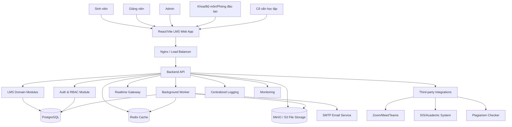
```mermaid
flowchart TB
    U1[Sinh viên]
    U2[Giảng viên]
    U3[Admin]
    U4[Khoa/Bộ môn/Phòng đào tạo]
    U5[Cố vấn học tập]

    U1 --> WEB[React/Vite LMS Web App]
    U2 --> WEB
    U3 --> WEB
    U4 --> WEB
    U5 --> WEB

    WEB --> NGINX[Nginx / Load Balancer]
    NGINX --> API[Backend API]
    API --> AUTH[Auth & RBAC Module]
    API --> LMS[LMS Domain Modules]
    API --> JOB[Background Worker]
    API --> WS[Realtime Gateway]

    LMS --> DB[(PostgreSQL)]
    AUTH --> DB
    JOB --> DB
    API --> REDIS[(Redis Cache)]
    JOB --> REDIS
    API --> STORAGE[(MinIO / S3 File Storage)]
    JOB --> STORAGE

    JOB --> SMTP[SMTP Email Service]
    API --> THIRD[Third-party Integrations]
    THIRD --> MEET[Zoom/Meet/Teams]
    THIRD --> SIS[SIS/Academic System]
    THIRD --> TURNITIN[Plagiarism Checker]

    API --> LOG[Centralized Logging]
    API --> MONITOR[Monitoring]
```

### 5.2. Mô tả thành phần

| Thành phần | Trách nhiệm |
|---|---|
| React/Vite Web App | Giao diện người dùng cho 5 vai trò, gọi API, render dashboard, form, bảng dữ liệu |
| Nginx/Load Balancer | Reverse proxy, HTTPS, route request, giới hạn dung lượng upload |
| Backend API | Xử lý nghiệp vụ, xác thực, phân quyền, cung cấp REST API |
| Auth & RBAC Module | Login, token, role, permission, policy, scope dữ liệu |
| LMS Domain Modules | Course, assignment, quiz, gradebook, attendance, advising, reports |
| PostgreSQL | Lưu dữ liệu quan hệ cốt lõi |
| Redis | Cache token/session, permission matrix, dashboard, rate limiting |
| Background Worker | Gửi email, tạo báo cáo, xử lý file/video, nhắc deadline |
| Realtime Gateway | Notification realtime, chat, trạng thái bài thi, điểm danh realtime |
| Object Storage | Lưu file upload, tài liệu, video, bài nộp, avatar |
| SMTP Service | Gửi email thông báo, reset password, deadline reminder |
| Third-party Integrations | Kết nối SIS, meeting, plagiarism checker, cloud storage |
| Monitoring/Logging | Theo dõi lỗi, hiệu năng, audit, cảnh báo vận hành |

---

## 6. Kiến trúc phân lớp backend

### 6.1. Layered Architecture

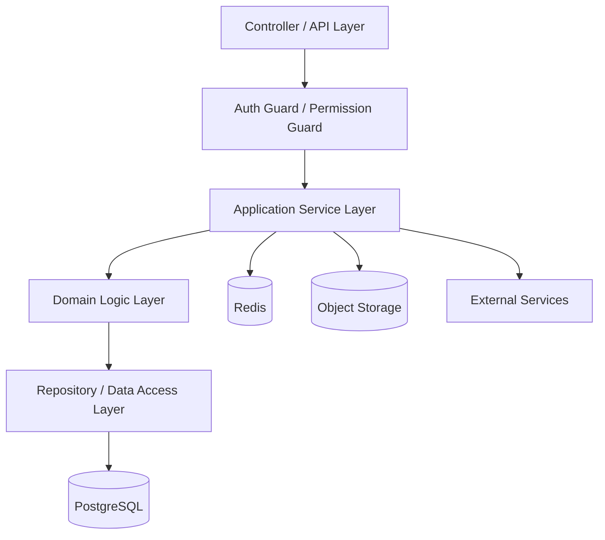
```mermaid
flowchart TB
    Controller[Controller / API Layer]
    Guard[Auth Guard / Permission Guard]
    Service[Application Service Layer]
    Domain[Domain Logic Layer]
    Repo[Repository / Data Access Layer]
    DB[(PostgreSQL)]
    Cache[(Redis)]
    Storage[(Object Storage)]
    External[External Services]

    Controller --> Guard
    Guard --> Service
    Service --> Domain
    Domain --> Repo
    Repo --> DB
    Service --> Cache
    Service --> Storage
    Service --> External
```

### 6.2. Vai trò từng layer

| Layer | Trách nhiệm |
|---|---|
| Controller/API | Nhận request, validate DTO, trả response chuẩn |
| Guard/Middleware | Kiểm tra authentication, authorization, rate limit, tenant/scope |
| Application Service | Điều phối nghiệp vụ, transaction, gọi repository, gọi service ngoài |
| Domain Logic | Quy tắc nghiệp vụ như tính điểm, kiểm tra deadline, điều kiện hoàn thành |
| Repository | Truy vấn database, mapping entity |
| Infrastructure | File storage, email, cache, queue, third-party API |

---

## 7. Module kiến trúc chi tiết

## 7.1. Identity & Access Management Module

### 7.1.1. Chức năng

- Đăng nhập/đăng xuất
- Refresh token
- Quên mật khẩu/reset mật khẩu
- Đổi mật khẩu
- Xác thực 2 lớp
- Quản lý session
- Quản lý role
- Quản lý permission
- RBAC theo chức năng
- Scope dữ liệu theo khoa/lớp/học kỳ/sinh viên phụ trách
- Audit thay đổi quyền

### 7.1.2. Thành phần

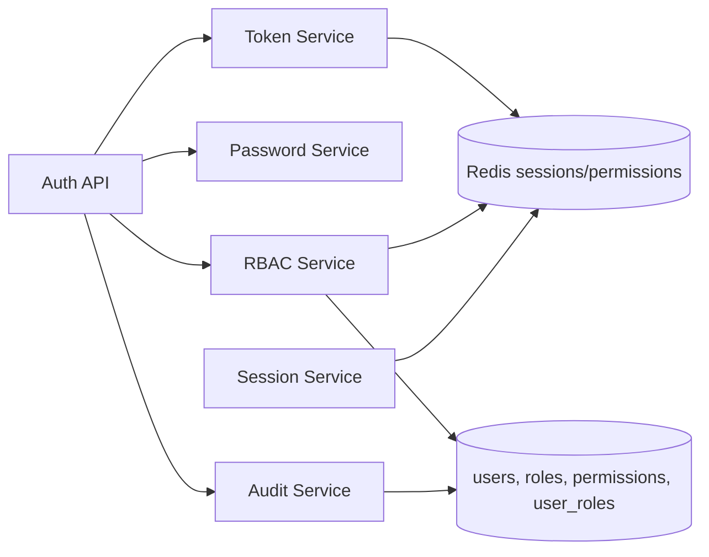
```mermaid
flowchart LR
    LoginAPI[Auth API]
    TokenSvc[Token Service]
    PasswordSvc[Password Service]
    RbacSvc[RBAC Service]
    SessionSvc[Session Service]
    AuditSvc[Audit Service]
    DB[(users, roles, permissions, user_roles)]
    Redis[(Redis sessions/permissions)]

    LoginAPI --> TokenSvc
    LoginAPI --> PasswordSvc
    LoginAPI --> RbacSvc
    TokenSvc --> Redis
    RbacSvc --> DB
    RbacSvc --> Redis
    SessionSvc --> Redis
    LoginAPI --> AuditSvc
    AuditSvc --> DB
```

### 7.1.3. Quy tắc phân quyền

| Loại quyền | Ví dụ |
|---|---|
| Module permission | `course.view`, `course.create`, `grade.update` |
| Role permission | Student, Lecturer, Admin, AcademicStaff, Advisor |
| Data scope | Giảng viên chỉ xem lớp được phân công; cố vấn chỉ xem sinh viên phụ trách |
| Action scope | Sinh viên chỉ nộp bài của chính mình; giảng viên chỉ chấm lớp mình |
| Time-bound permission | Mở bài thi trong khoảng thời gian cho phép |

---

## 7.2. User & Organization Module

### 7.2.1. Chức năng

- Quản lý người dùng
- Quản lý hồ sơ sinh viên/giảng viên/cố vấn/nhân sự đào tạo
- Import/export người dùng
- Quản lý khoa, bộ môn, phòng ban
- Quản lý ngành, chuyên ngành, lớp hành chính, niên khóa
- Gán người dùng vào tổ chức

### 7.2.2. Các bảng chính

- users
- user_profiles
- student_profiles
- lecturer_profiles
- advisor_profiles
- departments
- faculties
- majors
- administrative_classes
- academic_years

### 7.2.3. Kiến trúc module

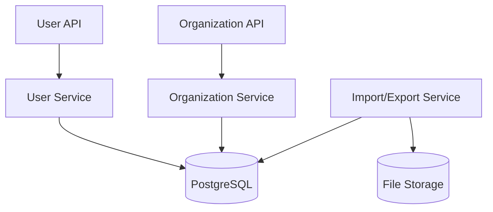
```mermaid
flowchart TB
    UserAPI[User API]
    OrgAPI[Organization API]
    UserService[User Service]
    OrgService[Organization Service]
    ImportService[Import/Export Service]
    DB[(PostgreSQL)]
    Storage[(File Storage)]

    UserAPI --> UserService
    OrgAPI --> OrgService
    UserService --> DB
    OrgService --> DB
    ImportService --> DB
    ImportService --> Storage
```

---

## 7.3. Academic Structure Module

### 7.3.1. Chức năng

- Quản lý năm học, học kỳ
- Quản lý môn học
- Quản lý chương trình đào tạo
- Quản lý môn tiên quyết
- Quản lý chuẩn đầu ra CLO/PLO
- Quản lý lớp học phần
- Gán giảng viên/trợ giảng
- Ghi danh sinh viên

### 7.3.2. Các bảng chính

- academic_years
- semesters
- courses
- course_prerequisites
- curricula
- curriculum_courses
- learning_outcomes
- course_learning_outcomes
- course_sections
- section_lecturers
- enrollments

### 7.3.3. Luồng dữ liệu chính

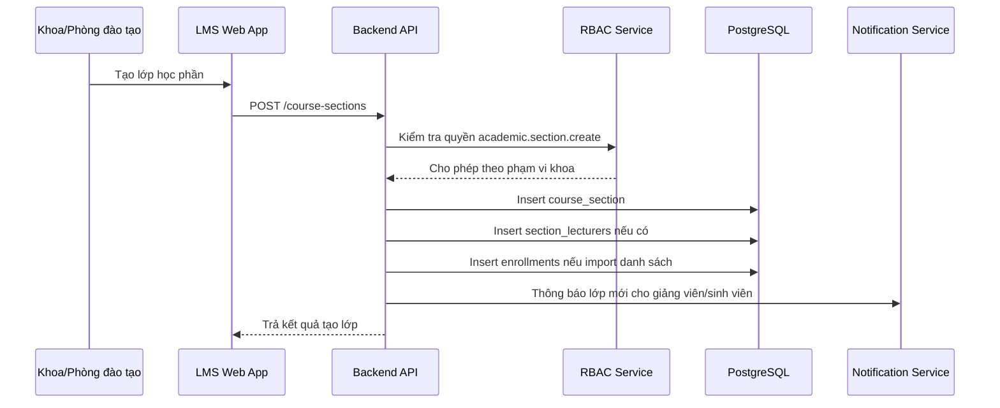
```mermaid
sequenceDiagram
    participant Staff as Khoa/Phòng đào tạo
    participant FE as LMS Web App
    participant API as Backend API
    participant RBAC as RBAC Service
    participant DB as PostgreSQL
    participant Notify as Notification Service

    Staff->>FE: Tạo lớp học phần
    FE->>API: POST /course-sections
    API->>RBAC: Kiểm tra quyền academic.section.create
    RBAC-->>API: Cho phép theo phạm vi khoa
    API->>DB: Insert course_section
    API->>DB: Insert section_lecturers nếu có
    API->>DB: Insert enrollments nếu import danh sách
    API->>Notify: Thông báo lớp mới cho giảng viên/sinh viên
    API-->>FE: Trả kết quả tạo lớp
```

---

## 7.4. Course Learning Module

### 7.4.1. Chức năng

- Tạo chương/chủ đề
- Tạo bài học
- Upload tài liệu
- Upload/nhúng video
- Hẹn giờ công bố học liệu
- Mở khóa theo điều kiện
- Theo dõi tiến độ học tập
- Bookmark, ghi chú cá nhân
- Lịch sử xem học liệu

### 7.4.2. Các bảng chính

- course_modules
- lessons
- lesson_resources
- lesson_progress
- lesson_notes
- lesson_bookmarks
- resource_views

### 7.4.3. Kiến trúc nội dung

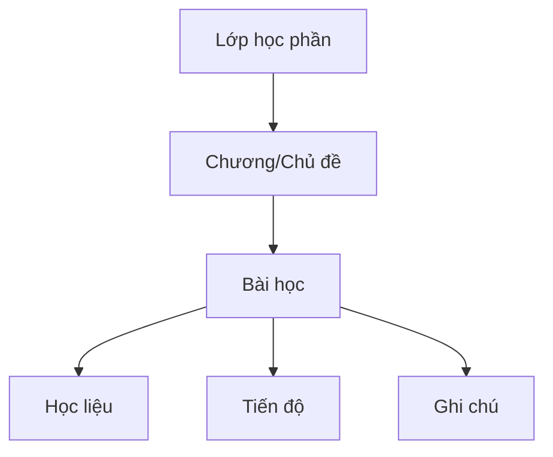
```mermaid
flowchart TB
    Section[Lớp học phần]
    Module[Chương/Chủ đề]
    Lesson[Bài học]
    Resource[Học liệu]
    Progress[Tiến độ]
    Note[Ghi chú]

    Section --> Module
    Module --> Lesson
    Lesson --> Resource
    Lesson --> Progress
    Lesson --> Note
```

---

## 7.5. Assignment Module

### 7.5.1. Chức năng

- Giảng viên tạo bài tập
- Thiết lập deadline, điểm tối đa, loại nộp bài
- Tạo rubric
- Sinh viên nộp bài file/text/link
- Nộp bài nhóm
- Sửa bài nộp nếu cho phép
- Chấm bài
- Feedback text/file
- Kiểm tra đạo văn
- Thống kê nộp bài

### 7.5.2. Các bảng chính

- assignments
- assignment_settings
- assignment_rubrics
- rubric_criteria
- assignment_submissions
- submission_files
- submission_grades
- plagiarism_reports

### 7.5.3. Luồng chấm bài

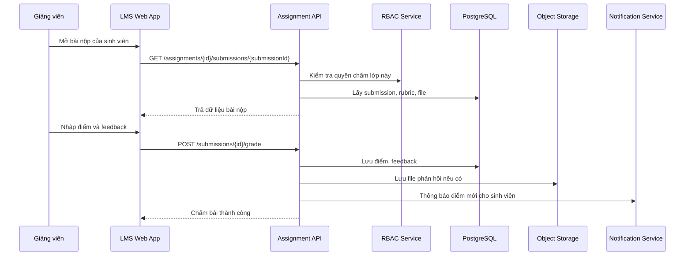
```mermaid
sequenceDiagram
    participant Lecturer as Giảng viên
    participant FE as LMS Web App
    participant API as Assignment API
    participant RBAC as RBAC Service
    participant DB as PostgreSQL
    participant Storage as Object Storage
    participant Notify as Notification Service

    Lecturer->>FE: Mở bài nộp của sinh viên
    FE->>API: GET /assignments/{id}/submissions/{submissionId}
    API->>RBAC: Kiểm tra quyền chấm lớp này
    API->>DB: Lấy submission, rubric, file
    API-->>FE: Trả dữ liệu bài nộp
    Lecturer->>FE: Nhập điểm và feedback
    FE->>API: POST /submissions/{id}/grade
    API->>DB: Lưu điểm, feedback
    API->>Storage: Lưu file phản hồi nếu có
    API->>Notify: Thông báo điểm mới cho sinh viên
    API-->>FE: Chấm bài thành công
```

---

## 7.6. Quiz & Exam Module

### 7.6.1. Chức năng

- Tạo ngân hàng câu hỏi
- Import/export câu hỏi
- Tạo quiz/bài thi
- Random câu hỏi
- Trộn đáp án
- Giới hạn thời gian
- Giới hạn số lần làm
- Auto-submit
- Auto-grade câu khách quan
- Chấm tự luận
- Log IP, thiết bị, tab switching
- Xử lý sự cố bài thi
- Phân tích câu hỏi

### 7.6.2. Các bảng chính

- question_banks
- questions
- question_options
- quizzes
- quiz_questions
- quiz_attempts
- quiz_answers
- quiz_logs
- proctoring_events

### 7.6.3. Luồng làm bài thi

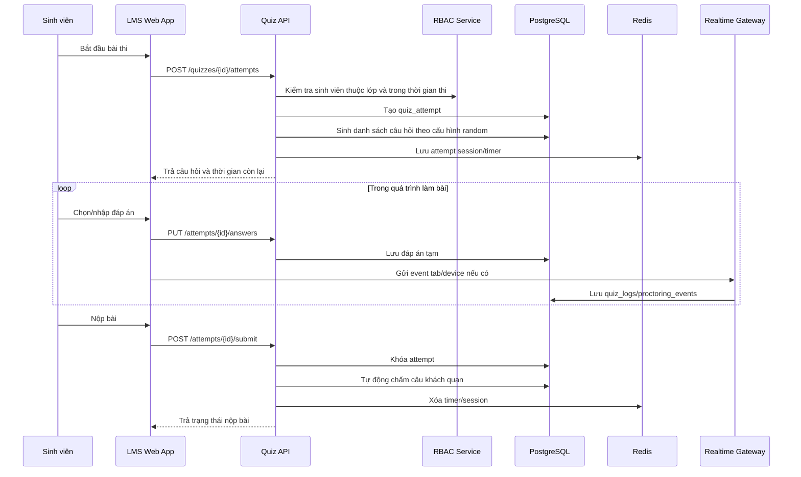
```mermaid
sequenceDiagram
    participant Student as Sinh viên
    participant FE as LMS Web App
    participant API as Quiz API
    participant RBAC as RBAC Service
    participant DB as PostgreSQL
    participant Redis as Redis
    participant WS as Realtime Gateway

    Student->>FE: Bắt đầu bài thi
    FE->>API: POST /quizzes/{id}/attempts
    API->>RBAC: Kiểm tra sinh viên thuộc lớp và trong thời gian thi
    API->>DB: Tạo quiz_attempt
    API->>DB: Sinh danh sách câu hỏi theo cấu hình random
    API->>Redis: Lưu attempt session/timer
    API-->>FE: Trả câu hỏi và thời gian còn lại

    loop Trong quá trình làm bài
        Student->>FE: Chọn/nhập đáp án
        FE->>API: PUT /attempts/{id}/answers
        API->>DB: Lưu đáp án tạm
        FE->>WS: Gửi event tab/device nếu có
        WS->>DB: Lưu quiz_logs/proctoring_events
    end

    Student->>FE: Nộp bài
    FE->>API: POST /attempts/{id}/submit
    API->>DB: Khóa attempt
    API->>DB: Tự động chấm câu khách quan
    API->>Redis: Xóa timer/session
    API-->>FE: Trả trạng thái nộp bài
```

---

## 7.7. Gradebook Module

### 7.7.1. Chức năng

- Tạo cột điểm
- Thiết lập trọng số
- Nhập/import điểm
- Tính điểm tổng kết
- Làm tròn điểm
- Công bố/ẩn điểm
- Khóa/mở khóa bảng điểm
- Phúc khảo điểm
- Audit lịch sử sửa điểm
- Đồng bộ điểm sang SIS

### 7.7.2. Các bảng chính

- grade_items
- grades
- grade_weights
- grade_formulas
- final_grades
- grade_change_logs
- grade_appeals

### 7.7.3. Luồng tính điểm tổng kết

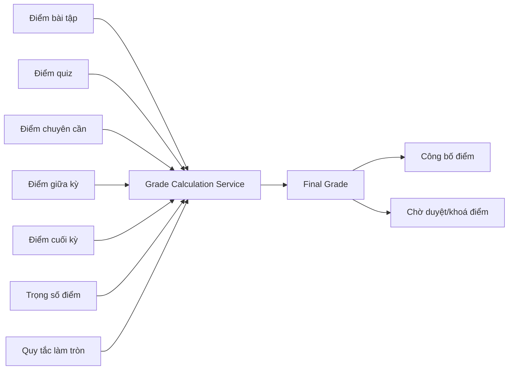
```mermaid
flowchart LR
    A[Điểm bài tập] --> F[Grade Calculation Service]
    B[Điểm quiz] --> F
    C[Điểm chuyên cần] --> F
    D[Điểm giữa kỳ] --> F
    E[Điểm cuối kỳ] --> F
    W[Trọng số điểm] --> F
    R[Quy tắc làm tròn] --> F
    F --> G[Final Grade]
    G --> H[Công bố điểm]
    G --> I[Chờ duyệt/khoá điểm]
```

---

## 7.8. Attendance Module

### 7.8.1. Chức năng

- Tạo buổi điểm danh
- Điểm danh thủ công
- Điểm danh QR
- Điểm danh bằng mã lớp
- Điểm danh online
- Sửa điểm danh
- Ghi lý do vắng
- Cảnh báo vắng nhiều
- Báo cáo chuyên cần

### 7.8.2. Các bảng chính

- attendance_sessions
- attendance_records
- attendance_qr_tokens
- attendance_excuses
- attendance_rules

### 7.8.3. Luồng QR attendance

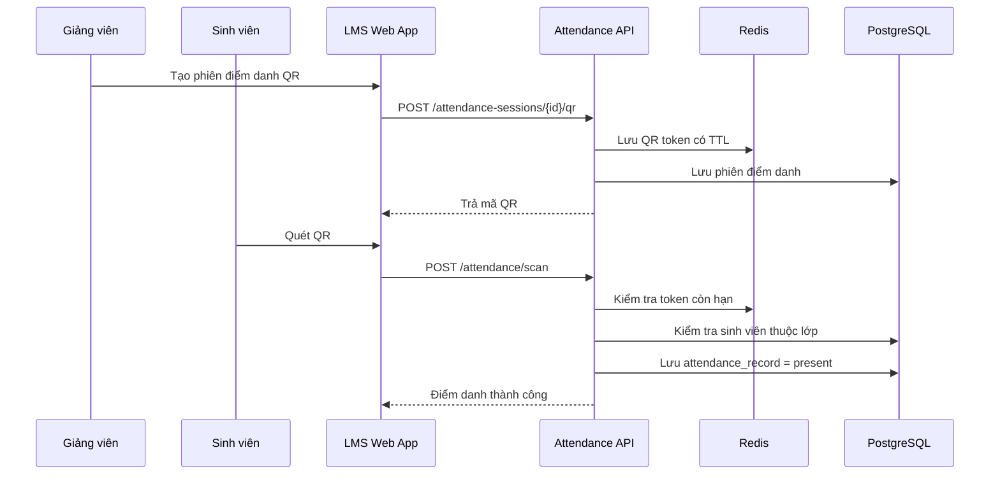
```mermaid
sequenceDiagram
    participant Lecturer as Giảng viên
    participant Student as Sinh viên
    participant FE as LMS Web App
    participant API as Attendance API
    participant Redis as Redis
    participant DB as PostgreSQL

    Lecturer->>FE: Tạo phiên điểm danh QR
    FE->>API: POST /attendance-sessions/{id}/qr
    API->>Redis: Lưu QR token có TTL
    API->>DB: Lưu phiên điểm danh
    API-->>FE: Trả mã QR

    Student->>FE: Quét QR
    FE->>API: POST /attendance/scan
    API->>Redis: Kiểm tra token còn hạn
    API->>DB: Kiểm tra sinh viên thuộc lớp
    API->>DB: Lưu attendance_record = present
    API-->>FE: Điểm danh thành công
```

---

## 7.9. Communication Module

### 7.9.1. Chức năng

- Thông báo hệ thống
- Thông báo lớp học
- Email notification
- Push/web notification
- Forum môn học
- Bình luận
- Tin nhắn
- Khảo sát/poll
- Report nội dung vi phạm

### 7.9.2. Các bảng chính

- notifications
- notification_recipients
- announcements
- forums
- forum_topics
- forum_posts
- messages
- surveys
- survey_questions
- survey_responses

### 7.9.3. Kiến trúc notification

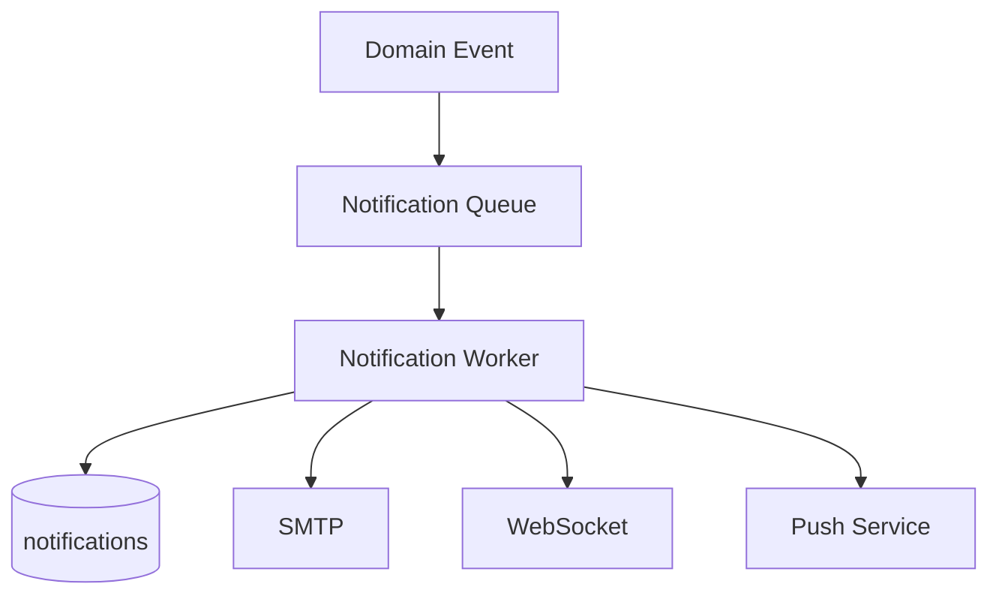
```mermaid
flowchart TB
    Event[Domain Event]
    Queue[Notification Queue]
    Worker[Notification Worker]
    DB[(notifications)]
    Email[SMTP]
    WS[WebSocket]
    Push[Push Service]

    Event --> Queue
    Queue --> Worker
    Worker --> DB
    Worker --> Email
    Worker --> WS
    Worker --> Push
```

---

## 7.10. Calendar Module

### 7.10.1. Chức năng

- Lịch học
- Lịch thi
- Deadline bài tập
- Lịch online meeting
- Lịch tư vấn
- Nhắc lịch
- Đồng bộ Google/Outlook nếu có

### 7.10.2. Các bảng chính

- calendar_events
- event_participants
- event_reminders
- academic_schedules

---

## 7.11. Advising & Early Warning Module

### 7.11.1. Chức năng

- Cố vấn xem sinh viên phụ trách
- Theo dõi tiến độ học tập
- Theo dõi chuyên cần
- Theo dõi điểm thấp/nợ môn
- Sinh cảnh báo tự động
- Tạo lịch tư vấn
- Ghi chú tư vấn
- Tạo kế hoạch cải thiện
- Chuyển tuyến hỗ trợ
- Báo cáo sau can thiệp

### 7.11.2. Các bảng chính

- advisor_assignments
- academic_warnings
- advising_sessions
- advising_notes
- intervention_plans
- student_support_tickets

### 7.11.3. Luồng cảnh báo học vụ

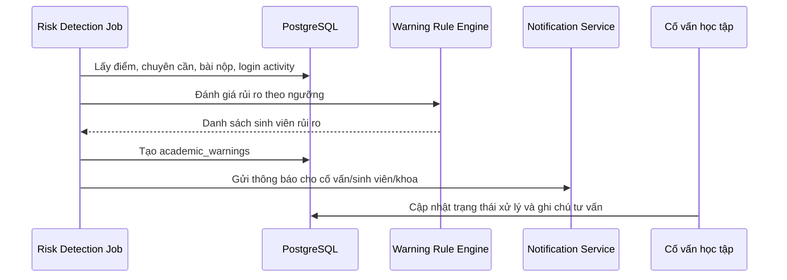
```mermaid
sequenceDiagram
    participant Job as Risk Detection Job
    participant DB as PostgreSQL
    participant Rule as Warning Rule Engine
    participant Notify as Notification Service
    participant Advisor as Cố vấn học tập

    Job->>DB: Lấy điểm, chuyên cần, bài nộp, login activity
    Job->>Rule: Đánh giá rủi ro theo ngưỡng
    Rule-->>Job: Danh sách sinh viên rủi ro
    Job->>DB: Tạo academic_warnings
    Job->>Notify: Gửi thông báo cho cố vấn/sinh viên/khoa
    Advisor->>DB: Cập nhật trạng thái xử lý và ghi chú tư vấn
```

---

## 7.12. Reports & Analytics Module

### 7.12.1. Chức năng

- Dashboard sinh viên
- Dashboard giảng viên
- Dashboard admin
- Dashboard khoa/phòng đào tạo
- Dashboard cố vấn
- Báo cáo điểm
- Báo cáo tiến độ
- Báo cáo chuyên cần
- Báo cáo bài tập/quiz
- Báo cáo sinh viên rủi ro
- Export Excel/PDF/CSV

### 7.12.2. Kiến trúc báo cáo

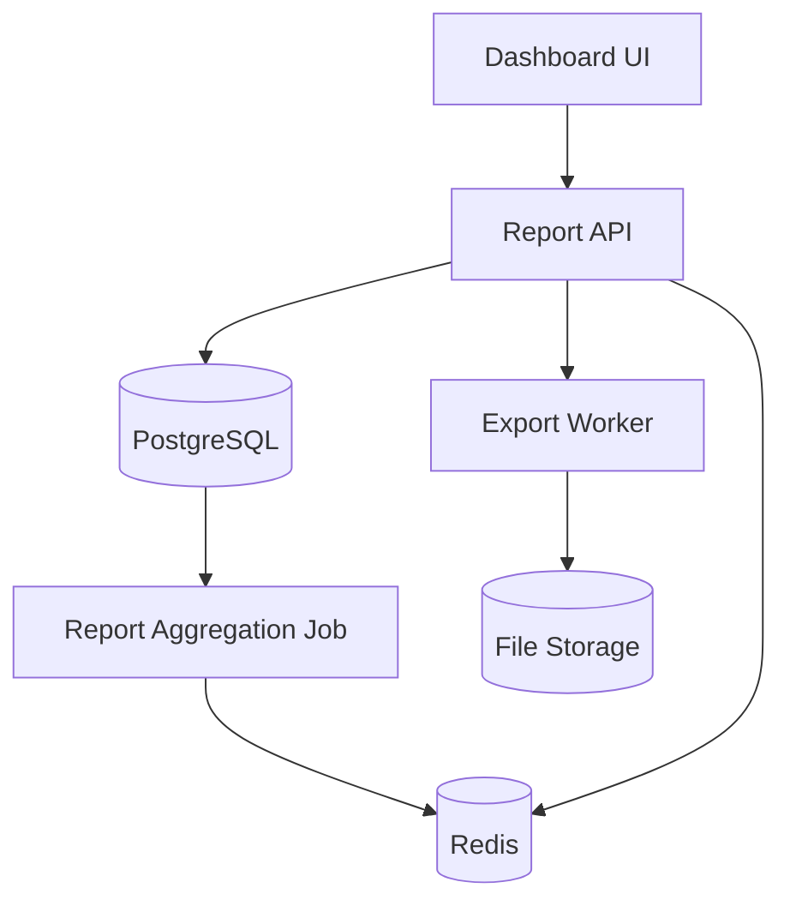
```mermaid
flowchart TB
    DB[(PostgreSQL)]
    ETL[Report Aggregation Job]
    Cache[(Redis)]
    ReportAPI[Report API]
    ExportWorker[Export Worker]
    Storage[(File Storage)]
    FE[Dashboard UI]

    DB --> ETL
    ETL --> Cache
    FE --> ReportAPI
    ReportAPI --> Cache
    ReportAPI --> DB
    ReportAPI --> ExportWorker
    ExportWorker --> Storage
```

---

## 8. Kiến trúc theo 5 đối tượng sử dụng

## 8.1. Sinh viên

### 8.1.1. Module sinh viên sử dụng

| Module | Chức năng chính |
|---|---|
| Auth | Đăng nhập, đổi mật khẩu, quản lý profile |
| Course Learning | Xem học phần, học liệu, video, tiến độ |
| Assignment | Xem/nộp/sửa bài, xem feedback |
| Quiz & Exam | Làm quiz/thi, xem kết quả |
| Gradebook | Xem điểm, gửi phúc khảo |
| Attendance | Điểm danh, xem chuyên cần |
| Calendar | Lịch học, deadline, lịch thi |
| Communication | Forum, message, notification |
| Support | Ticket, yêu cầu hỗ trợ |
| Survey | Đánh giá môn học/giảng viên |

### 8.1.2. Dữ liệu được phép truy cập

- Hồ sơ cá nhân của chính mình
- Các lớp học phần đã ghi danh
- Học liệu được công bố trong lớp mình
- Bài tập/quiz/điểm/chuyên cần của chính mình
- Forum trong lớp mình
- Ticket/yêu cầu của chính mình

---

## 8.2. Giảng viên

### 8.2.1. Module giảng viên sử dụng

| Module | Chức năng chính |
|---|---|
| Course Section | Quản lý lớp được phân công |
| Learning Content | Tạo chương, bài học, tài liệu, video |
| Assignment | Giao bài, rubric, chấm bài |
| Quiz & Exam | Ngân hàng câu hỏi, quiz, thi, chấm tự luận |
| Gradebook | Cột điểm, nhập điểm, tính điểm |
| Attendance | Điểm danh thủ công/QR/online |
| Communication | Thông báo, forum, email lớp |
| Reports | Báo cáo lớp, sinh viên rủi ro |

### 8.2.2. Dữ liệu được phép truy cập

- Lớp học phần được phân công
- Danh sách sinh viên trong lớp được phân công
- Bài nộp, điểm, điểm danh của lớp mình
- Forum, học liệu, quiz trong lớp mình

---

## 8.3. Admin

### 8.3.1. Module admin sử dụng

| Module | Chức năng chính |
|---|---|
| User Management | Toàn quyền người dùng |
| RBAC | Toàn quyền vai trò/phân quyền |
| Organization | Toàn quyền khoa, ngành, lớp |
| Academic Structure | Năm học, học kỳ, môn, lớp học phần |
| LMS Content | Kiểm duyệt, quản lý toàn hệ thống |
| Exam/Grade/Attendance | Cấu hình, giám sát, báo cáo |
| System Config | SMTP, SSO, storage, integration |
| Security | 2FA, session, IP, audit |
| Operations | Backup, restore, monitoring |
| Reports | Toàn hệ thống |

### 8.3.2. Dữ liệu được phép truy cập

- Toàn bộ dữ liệu hệ thống, theo chính sách bảo mật nội bộ
- Các dữ liệu nhạy cảm cần audit khi truy cập/sửa

---

## 8.4. Khoa / Bộ môn / Phòng đào tạo

### 8.4.1. Module sử dụng

| Module | Chức năng chính |
|---|---|
| Academic Program | Chương trình đào tạo, chuẩn đầu ra |
| Course Management | Môn học trong phạm vi khoa/bộ môn |
| Course Section | Mở lớp, phân công GV, quản lý sĩ số |
| Student Monitoring | Theo dõi SV trong khoa/ngành |
| Lecturer Monitoring | Theo dõi tiến độ giảng viên |
| Exam Management | Lịch thi, duyệt đề, khảo thí |
| Grade Approval | Duyệt/chốt điểm |
| Reports | Báo cáo đào tạo, chất lượng |

### 8.4.2. Dữ liệu được phép truy cập

- Dữ liệu trong phạm vi khoa/bộ môn/phòng đào tạo được phân quyền
- Lớp, môn, giảng viên, sinh viên thuộc phạm vi quản lý

---

## 8.5. Cố vấn học tập

### 8.5.1. Module sử dụng

| Module | Chức năng chính |
|---|---|
| Student Profile | Xem hồ sơ sinh viên phụ trách |
| Progress Monitoring | Theo dõi tiến độ, điểm, chuyên cần |
| Early Warning | Xử lý cảnh báo học vụ |
| Advising | Lịch tư vấn, ghi chú, kế hoạch cải thiện |
| Communication | Nhắn tin, email, thông báo nhóm |
| Support Ticket | Chuyển tuyến hỗ trợ |
| Reports | Báo cáo sinh viên rủi ro, báo cáo tư vấn |

### 8.5.2. Dữ liệu được phép truy cập

- Sinh viên được phân công phụ trách
- Điểm, chuyên cần, tiến độ ở mức phục vụ tư vấn
- Không được sửa điểm, sửa bài nộp, sửa học liệu

---

## 9. Kiến trúc dữ liệu

### 9.1. Nguyên tắc thiết kế database

- Dùng PostgreSQL làm database quan hệ chính.
- Mọi bảng nghiệp vụ có khóa chính dạng UUID hoặc BIGSERIAL tùy quyết định triển khai.
- Các bảng quan trọng có `created_at`, `updated_at`, `created_by`, `updated_by`, `deleted_at` nếu dùng soft delete.
- Dùng foreign key cho quan hệ cốt lõi.
- Dùng index cho các cột truy vấn nhiều: `user_id`, `course_section_id`, `semester_id`, `department_id`, `status`, `created_at`.
- Các thao tác nhạy cảm như sửa điểm, phân quyền, xóa dữ liệu phải có audit log.
- Không xóa cứng dữ liệu học tập quan trọng nếu chưa có quy trình lưu trữ.

### 9.2. Nhóm bảng dữ liệu

| Nhóm bảng | Ví dụ bảng |
|---|---|
| Identity | users, roles, permissions, user_roles, role_permissions, sessions |
| Organization | faculties, departments, majors, administrative_classes |
| Academic | academic_years, semesters, courses, curricula, course_sections, enrollments |
| Learning | course_modules, lessons, lesson_resources, lesson_progress |
| Assignment | assignments, submissions, rubric_criteria, submission_grades |
| Quiz | question_banks, questions, quizzes, quiz_attempts, quiz_answers |
| Gradebook | grade_items, grades, final_grades, grade_appeals |
| Attendance | attendance_sessions, attendance_records, attendance_excuses |
| Communication | notifications, forums, messages, surveys |
| Advising | advisor_assignments, academic_warnings, advising_sessions |
| Operations | audit_logs, system_settings, backup_jobs, integration_logs |

---

## 10. API Architecture

### 10.1. API style

- RESTful API
- JSON request/response
- JWT Bearer Authentication
- Versioning bằng `/api/v1`
- Pagination chuẩn cho danh sách
- Error response thống nhất

### 10.2. Chuẩn endpoint

```text
GET    /api/v1/resources
GET    /api/v1/resources/{id}
POST   /api/v1/resources
PUT    /api/v1/resources/{id}
PATCH  /api/v1/resources/{id}
DELETE /api/v1/resources/{id}
```

### 10.3. Response thành công chuẩn

```json
{
  "success": true,
  "message": "OK",
  "data": {},
  "meta": {
    "requestId": "req_abc123",
    "timestamp": "2026-04-29T10:55:00+07:00"
  }
}
```

### 10.4. Response lỗi chuẩn

```json
{
  "success": false,
  "error": {
    "code": "FORBIDDEN",
    "message": "Bạn không có quyền thực hiện thao tác này",
    "details": []
  },
  "meta": {
    "requestId": "req_abc123",
    "timestamp": "2026-04-29T10:55:00+07:00"
  }
}
```

### 10.5. Nhóm API chính

| Nhóm API | Prefix |
|---|---|
| Auth | `/api/v1/auth` |
| Users | `/api/v1/users` |
| Roles/Permissions | `/api/v1/roles`, `/api/v1/permissions` |
| Organization | `/api/v1/faculties`, `/api/v1/departments`, `/api/v1/majors` |
| Courses | `/api/v1/courses` |
| Course Sections | `/api/v1/course-sections` |
| Lessons | `/api/v1/lessons` |
| Assignments | `/api/v1/assignments` |
| Quizzes | `/api/v1/quizzes` |
| Grades | `/api/v1/grades` |
| Attendance | `/api/v1/attendance` |
| Notifications | `/api/v1/notifications` |
| Forums | `/api/v1/forums` |
| Advising | `/api/v1/advising` |
| Reports | `/api/v1/reports` |
| Files | `/api/v1/files` |
| System | `/api/v1/system` |

---

## 11. Authentication & Authorization Architecture

### 11.1. Login flow

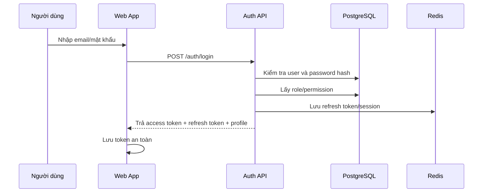
```mermaid
sequenceDiagram
    participant User as Người dùng
    participant FE as Web App
    participant API as Auth API
    participant DB as PostgreSQL
    participant Redis as Redis

    User->>FE: Nhập email/mật khẩu
    FE->>API: POST /auth/login
    API->>DB: Kiểm tra user và password hash
    API->>DB: Lấy role/permission
    API->>Redis: Lưu refresh token/session
    API-->>FE: Trả access token + refresh token + profile
    FE->>FE: Lưu token an toàn
```

### 11.2. Authorization flow

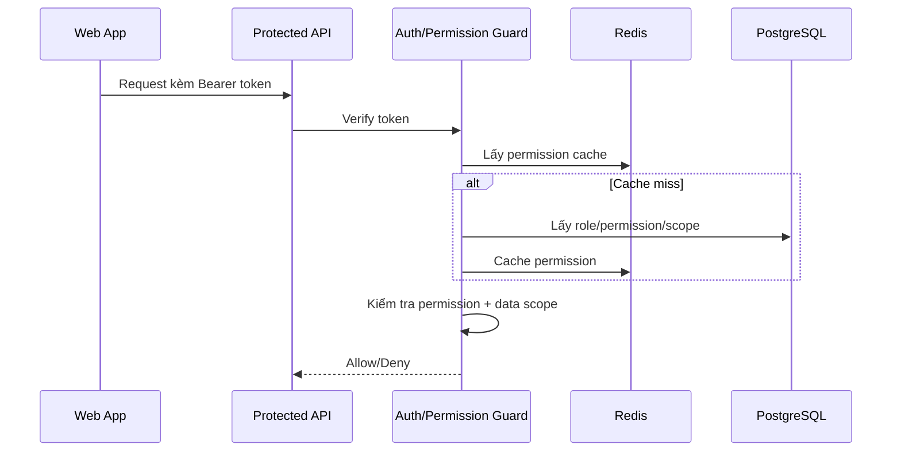
```mermaid
sequenceDiagram
    participant FE as Web App
    participant API as Protected API
    participant Guard as Auth/Permission Guard
    participant Redis as Redis
    participant DB as PostgreSQL

    FE->>API: Request kèm Bearer token
    API->>Guard: Verify token
    Guard->>Redis: Lấy permission cache
    alt Cache miss
        Guard->>DB: Lấy role/permission/scope
        Guard->>Redis: Cache permission
    end
    Guard->>Guard: Kiểm tra permission + data scope
    Guard-->>API: Allow/Deny
```

### 11.3. Permission examples

| Permission | Ý nghĩa |
|---|---|
| `student.course.view` | Sinh viên xem lớp đã ghi danh |
| `lecturer.assignment.grade` | Giảng viên chấm bài lớp mình |
| `admin.user.manage` | Admin quản lý người dùng |
| `academic.grade.approve` | Khoa/phòng đào tạo duyệt điểm |
| `advisor.warning.resolve` | Cố vấn xử lý cảnh báo học vụ |

---

## 12. File & Media Architecture

### 12.1. Loại file

| Loại file | Nơi sử dụng |
|---|---|
| Avatar | Hồ sơ người dùng |
| Tài liệu bài giảng | Lesson resources |
| Video bài giảng | Lesson video |
| File bài tập | Assignment description |
| File bài nộp | Student submissions |
| File feedback | Lecturer feedback |
| File import/export | Excel/CSV/PDF report |

### 12.2. Luồng upload file

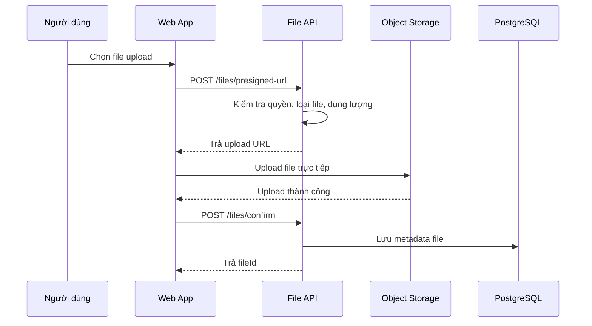
```mermaid
sequenceDiagram
    participant User as Người dùng
    participant FE as Web App
    participant API as File API
    participant Storage as Object Storage
    participant DB as PostgreSQL

    User->>FE: Chọn file upload
    FE->>API: POST /files/presigned-url
    API->>API: Kiểm tra quyền, loại file, dung lượng
    API-->>FE: Trả upload URL
    FE->>Storage: Upload file trực tiếp
    Storage-->>FE: Upload thành công
    FE->>API: POST /files/confirm
    API->>DB: Lưu metadata file
    API-->>FE: Trả fileId
```

### 12.3. Chính sách file

- Giới hạn dung lượng theo role và loại file.
- Quét virus nếu triển khai production.
- File bài nộp không cho sửa sau deadline nếu không được phép.
- Link tải file cần kiểm tra quyền truy cập.
- File nhạy cảm dùng signed URL có thời hạn.

---

## 13. Realtime Architecture

### 13.1. Tình huống cần realtime

- Thông báo mới
- Chat/tin nhắn
- Forum có phản hồi mới
- Trạng thái bài thi
- Log rời tab trong bài thi
- Điểm danh realtime
- Dashboard hoạt động lớp

### 13.2. Kiến trúc realtime

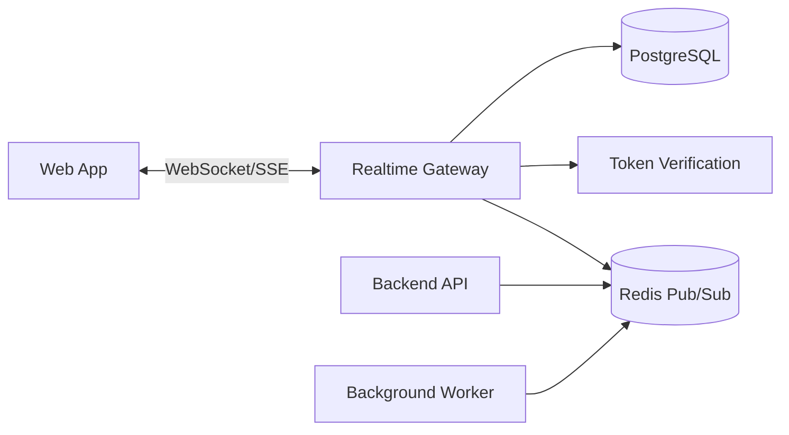
```mermaid
flowchart LR
    FE[Web App] <-- WebSocket/SSE --> WS[Realtime Gateway]
    WS --> Auth[Token Verification]
    WS --> Redis[(Redis Pub/Sub)]
    WS --> DB[(PostgreSQL)]
    API[Backend API] --> Redis
    Worker[Background Worker] --> Redis
```

---

## 14. Background Job Architecture

### 14.1. Các job chính

| Job | Mô tả |
|---|---|
| SendNotificationJob | Gửi thông báo web/email/push |
| DeadlineReminderJob | Nhắc deadline bài tập/quiz |
| GradeCalculationJob | Tính lại điểm tổng kết |
| RiskDetectionJob | Phát hiện sinh viên rủi ro |
| ReportExportJob | Xuất báo cáo Excel/PDF |
| FileCleanupJob | Dọn file tạm/file orphan |
| BackupJob | Sao lưu DB/file |
| VideoProcessingJob | Xử lý video nếu cần |
| SyncSISJob | Đồng bộ SIS |
| PlagiarismCheckJob | Gửi bài nộp sang hệ thống kiểm tra đạo văn |

### 14.2. Sơ đồ job queue

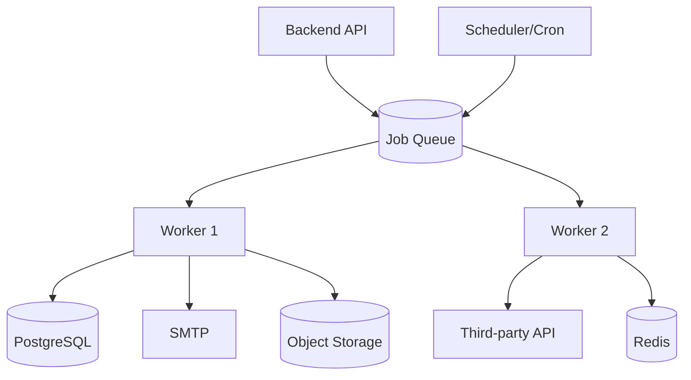
```mermaid
flowchart TB
    API[Backend API] --> Queue[(Job Queue)]
    Scheduler[Scheduler/Cron] --> Queue
    Queue --> Worker1[Worker 1]
    Queue --> Worker2[Worker 2]
    Worker1 --> DB[(PostgreSQL)]
    Worker1 --> Email[SMTP]
    Worker1 --> Storage[(Object Storage)]
    Worker2 --> External[Third-party API]
    Worker2 --> Redis[(Redis)]
```

---

## 15. Integration Architecture

### 15.1. Các hệ thống tích hợp

| Hệ thống | Mục đích | Chiều dữ liệu |
|---|---|---|
| SSO Google/Microsoft/LDAP | Đăng nhập bằng tài khoản trường | External -> LMS |
| SIS/Academic System | Đồng bộ sinh viên, lớp, điểm | 2 chiều |
| SMTP | Gửi email | LMS -> External |
| Zoom/Meet/Teams | Tạo lớp học online | 2 chiều nếu có attendance |
| Turnitin/Plagiarism Checker | Kiểm tra đạo văn | LMS -> External -> LMS |
| Cloud Storage | Lưu/truy xuất file | 2 chiều |
| Google/Outlook Calendar | Đồng bộ lịch | 2 chiều tùy cấu hình |

### 15.2. Nguyên tắc tích hợp

- Mọi tích hợp phải có retry và integration log.
- Không để API bên ngoài làm block request chính quá lâu; dùng background job nếu xử lý lâu.
- Dữ liệu đồng bộ phải có mapping ID giữa LMS và external system.
- Token/API key phải lưu trong secret manager hoặc biến môi trường bảo mật.

---

## 16. Security Architecture

### 16.1. Các lớp bảo mật

| Lớp | Biện pháp |
|---|---|
| Transport | HTTPS/TLS |
| Authentication | JWT, refresh token rotation, 2FA |
| Authorization | RBAC + data scope + policy guard |
| Input validation | DTO validation, sanitize HTML |
| File security | File type whitelist, size limit, signed URL |
| API security | Rate limit, CORS, CSRF nếu dùng cookie |
| Password | Hash bằng bcrypt/argon2 |
| Audit | Ghi log thao tác nhạy cảm |
| Database | Least privilege, backup encryption |
| Monitoring | Alert đăng nhập bất thường, lỗi 5xx |

### 16.2. Audit log bắt buộc

| Hành động | Cần audit |
|---|---|
| Login thất bại nhiều lần | Có |
| Reset mật khẩu | Có |
| Gán/thu hồi quyền | Có |
| Sửa điểm | Có |
| Khóa/mở bảng điểm | Có |
| Mở lại bài thi | Có |
| Xóa học liệu/file | Có |
| Import/export dữ liệu lớn | Có |
| Truy cập dữ liệu nhạy cảm | Nên có |
| Cấu hình hệ thống | Có |

---

## 17. Performance & Scalability

### 17.1. Chiến lược hiệu năng

| Vấn đề | Giải pháp |
|---|---|
| Danh sách lớn | Pagination, filtering, indexing |
| Dashboard nặng | Cache Redis, pre-aggregation |
| Báo cáo lớn | Background export job |
| File lớn | Upload trực tiếp Object Storage qua signed URL |
| Video | Stream từ object storage/CDN |
| Quiz đồng thời | Redis timer/session, tối ưu insert answers |
| Notification nhiều | Queue worker |
| Search forum/tài liệu | Full-text search hoặc Elasticsearch |

### 17.2. Index database đề xuất

| Bảng | Index |
|---|---|
| users | email, code, status |
| enrollments | student_id, course_section_id, semester_id |
| lessons | course_section_id, module_id, publish_at |
| assignments | course_section_id, deadline, status |
| submissions | assignment_id, student_id, submitted_at |
| quiz_attempts | quiz_id, student_id, status |
| grades | student_id, grade_item_id |
| attendance_records | session_id, student_id, status |
| notifications | recipient_id, is_read, created_at |
| audit_logs | actor_id, action, created_at |

---

## 18. Deployment Architecture

### 18.1. Local environment

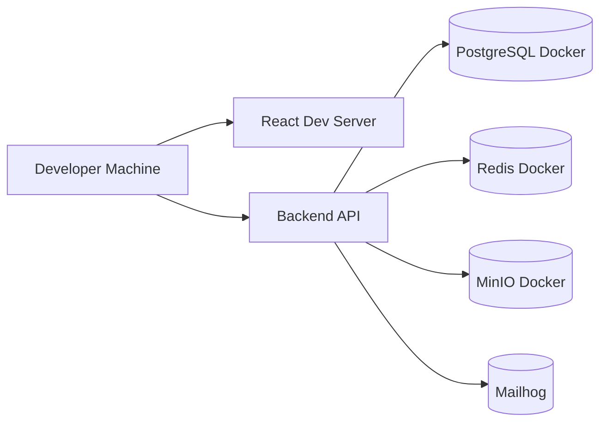
```mermaid
flowchart LR
    Dev[Developer Machine]
    Dev --> FE[React Dev Server]
    Dev --> API[Backend API]
    API --> DB[(PostgreSQL Docker)]
    API --> Redis[(Redis Docker)]
    API --> MinIO[(MinIO Docker)]
    API --> Mailhog[(Mailhog)]
```

### 18.2. Staging/Production

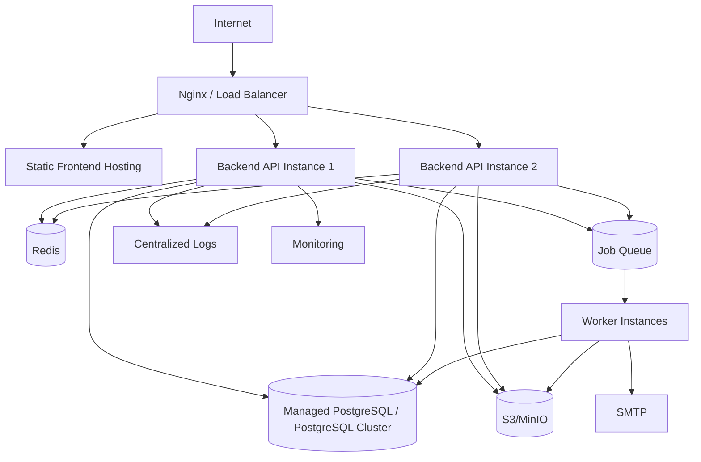
```mermaid
flowchart TB
    Internet[Internet]
    Internet --> LB[Nginx / Load Balancer]
    LB --> FE[Static Frontend Hosting]
    LB --> API1[Backend API Instance 1]
    LB --> API2[Backend API Instance 2]
    API1 --> DB[(Managed PostgreSQL / PostgreSQL Cluster)]
    API2 --> DB
    API1 --> Redis[(Redis)]
    API2 --> Redis
    API1 --> Storage[(S3/MinIO)]
    API2 --> Storage
    API1 --> Queue[(Job Queue)]
    API2 --> Queue
    Queue --> Worker[Worker Instances]
    Worker --> DB
    Worker --> Storage
    Worker --> SMTP[SMTP]
    API1 --> Logs[Centralized Logs]
    API2 --> Logs
    API1 --> Metrics[Monitoring]
```

### 18.3. Môi trường

| Môi trường | Mục đích |
|---|---|
| Local | Developer chạy máy cá nhân |
| Development | Tích hợp tính năng sớm |
| Staging | Test gần giống production |
| Production | Người dùng thật |

---

## 19. Reliability, Backup & Recovery

### 19.1. Backup

| Thành phần | Tần suất đề xuất |
|---|---|
| PostgreSQL full backup | Hàng ngày |
| PostgreSQL incremental/WAL | 15-30 phút nếu production |
| Object storage | Hàng ngày hoặc versioning |
| Redis | Không bắt buộc cho cache, nhưng cần nếu dùng session quan trọng |
| Config/secrets | Backup an toàn theo quy trình DevOps |

### 19.2. Recovery

| Tình huống | Phương án |
|---|---|
| Mất database | Restore từ backup gần nhất |
| Xóa nhầm file | Restore từ object storage versioning/backup |
| Deploy lỗi | Rollback image/container version |
| Queue bị treo | Restart worker, retry failed jobs |
| Email lỗi | Retry queue, log lỗi SMTP |

---

## 20. Observability

### 20.1. Logging

Log cần có:

- Request log
- Error log
- Audit log
- Integration log
- Job log
- Security log

### 20.2. Metrics

| Metric | Ý nghĩa |
|---|---|
| API latency | Độ trễ request |
| Error rate | Tỷ lệ lỗi 4xx/5xx |
| DB query time | Hiệu năng database |
| Redis hit ratio | Hiệu quả cache |
| Queue length | Số job đang chờ |
| Storage usage | Dung lượng file/video |
| Active users | Người dùng đang hoạt động |
| Quiz concurrent attempts | Số sinh viên thi đồng thời |

### 20.3. Alerts

- API 5xx tăng cao
- Database CPU/RAM/disk cao
- Queue tồn đọng lớn
- Storage gần đầy
- Backup thất bại
- Login thất bại bất thường
- Lỗi tích hợp SIS/SMTP/meeting nhiều lần

---

## 21. Non-functional Requirements

| Nhóm | Yêu cầu đề xuất |
|---|---|
| Availability | 99.5% cho đồ án/prototype, 99.9% nếu production |
| Performance | API thông thường < 500ms, dashboard < 2s nếu cache |
| Scalability | Scale ngang API và worker |
| Security | RBAC, audit, encryption, secure file access |
| Maintainability | Module hóa, coding convention, test coverage |
| Usability | UI rõ ràng theo từng role, responsive |
| Compatibility | Chrome, Edge, Firefox, Safari phiên bản mới |
| Data integrity | Transaction cho điểm, bài nộp, quiz attempt |
| Compliance | Bảo vệ dữ liệu cá nhân sinh viên/giảng viên |

---

## 22. Kiến trúc chức năng theo module và vai trò

| Module | Sinh viên | Giảng viên | Admin | Khoa/Đào tạo | Cố vấn |
|---|---|---|---|---|---|
| Auth/Profile | Cá nhân | Cá nhân | Toàn quyền | Cá nhân | Cá nhân |
| User Management | Không | Xem SV lớp mình | Toàn quyền | Phạm vi khoa | SV phụ trách |
| Course Section | Xem/tham gia | Quản lý lớp mình | Toàn quyền | Quản lý phạm vi | Xem |
| Lessons | Xem/học | Tạo/sửa | Kiểm duyệt | Theo dõi | Xem tiến độ |
| Assignments | Nộp bài | Tạo/chấm | Giám sát | Theo dõi | Theo dõi |
| Quiz/Exam | Làm bài | Tạo/chấm | Giám sát | Duyệt/theo dõi | Theo dõi |
| Grades | Xem cá nhân | Nhập/chấm | Toàn quyền | Duyệt | Xem tư vấn |
| Attendance | Điểm danh | Quản lý | Cấu hình | Theo dõi | Theo dõi |
| Communication | Tham gia | Quản lý lớp | Kiểm duyệt | Gửi thông báo | Gửi tư vấn |
| Reports | Cá nhân | Lớp mình | Toàn hệ thống | Phạm vi khoa | SV phụ trách |
| System Config | Không | Không | Toàn quyền | Hạn chế | Không |

---

## 23. Rủi ro kiến trúc và phương án giảm thiểu

| Rủi ro | Ảnh hưởng | Giảm thiểu |
|---|---|---|
| Phân quyền phức tạp | Lộ dữ liệu hoặc chặn nhầm quyền | RBAC + data scope rõ ràng, test permission matrix |
| Quiz đồng thời cao | Lag khi thi | Cache Redis, scale API, tối ưu DB writes |
| File/video dung lượng lớn | Đầy storage, chậm tải | Object storage, quota, CDN/streaming |
| Sửa điểm sai quy trình | Mất tin cậy dữ liệu | Audit log, khóa điểm, workflow duyệt |
| Import dữ liệu lỗi | Sai danh sách lớp/SV | Validate import, preview trước khi commit |
| Tích hợp SIS lỗi | Dữ liệu không đồng bộ | Retry, integration logs, manual reconciliation |
| Notification quá nhiều | Người dùng bị spam | Preference, batching, template, rate limit |
| Báo cáo chậm | Trải nghiệm kém | Pre-aggregation, background export |

---

## 24. Lộ trình triển khai kiến trúc đề xuất

### 24.1. Giai đoạn 1 — Core LMS

- Auth, RBAC cơ bản
- User/role/profile
- Khoa, ngành, lớp, học kỳ
- Môn học, lớp học phần, ghi danh
- Bài giảng/học liệu
- Bài tập/nộp bài/chấm bài
- Quiz cơ bản
- Gradebook cơ bản

### 24.2. Giai đoạn 2 — Academic Management

- Phân công giảng viên
- Duyệt điểm
- Điểm danh QR/thủ công
- Forum/thông báo/email
- Báo cáo lớp/khoa
- Cảnh báo học vụ cơ bản
- Cố vấn học tập

### 24.3. Giai đoạn 3 — Advanced LMS

- Thi online nâng cao
- Random đề, log gian lận
- Plagiarism checker
- Online meeting integration
- Dashboard analytics nâng cao
- Export báo cáo lớn
- SSO/SIS integration

### 24.4. Giai đoạn 4 — Production Hardening

- Monitoring/logging đầy đủ
- Backup/restore tự động
- Security hardening
- Load testing
- CI/CD staging/production
- Data retention policy

---

## 25. Phụ lục: Mermaid tổng quan module nghiệp vụ

```mermaid
flowchart TB
    Auth[Identity & RBAC]
    User[User & Organization]
    Academic[Academic Structure]
    Course[Course Learning]
    Assignment[Assignment]
    Quiz[Quiz & Exam]
    Grade[Gradebook]
    Attendance[Attendance]
    Communication[Communication]
    Calendar[Calendar]
    Advising[Advising & Warning]
    Reports[Reports & Analytics]
    Files[File & Media]
    Ops[Admin & Operations]

    Auth --> User
    User --> Academic
    Academic --> Course
    Academic --> Assignment
    Academic --> Quiz
    Course --> Reports
    Assignment --> Grade
    Quiz --> Grade
    Attendance --> Grade
    Grade --> Advising
    Attendance --> Advising
    Course --> Advising
    Communication --> Advising
    Calendar --> Communication
    Files --> Course
    Files --> Assignment
    Reports --> Ops
    Ops --> Auth
```

---

## 26. Kết luận

Kiến trúc hệ thống LMS được đề xuất theo hướng **modular monolith có phân lớp rõ ràng** ở giai đoạn đầu, dễ triển khai cho đồ án hoặc MVP. Khi hệ thống lớn hơn, có thể tách dần các module nặng như Notification, Report, File/Media, Quiz/Exam thành service riêng.

Kiến trúc này đáp ứng đầy đủ 5 đối tượng sử dụng:

- Sinh viên: học tập, nộp bài, thi, xem điểm, trao đổi.
- Giảng viên: quản lý lớp, nội dung, bài tập, quiz, điểm, điểm danh.
- Admin: quản trị toàn hệ thống, bảo mật, cấu hình, vận hành.
- Khoa/Bộ môn/Phòng đào tạo: quản lý đào tạo, duyệt điểm, khảo thí, báo cáo chất lượng.
- Cố vấn học tập: theo dõi, cảnh báo, tư vấn và hỗ trợ sinh viên.

Tài liệu này có thể dùng làm nền tảng cho các tài liệu tiếp theo: API_SPEC.md, ERD.md, SEQUENCE_DIAGRAMS.md, DEPLOYMENT.md, TEST_PLAN.md và UI/UX specification.

---

*Tài liệu này là nguồn sự thật cho kiến trúc. Mọi thay đổi kiến trúc lớn phải có ADR mới và được team review trước khi implement.*
