# Sequence Diagrams & Data Flow
## LMS Chatbot Có Trí Nhớ (AI20K-015)

**Phiên bản:** 2.0  
**Ngày:** 2026-04-27  
**Render Mermaid:** mermaid.live hoặc VS Code Markdown Preview Enhanced

---

## 1. Authentication Flows

### 1.1 Đăng ký Tài khoản

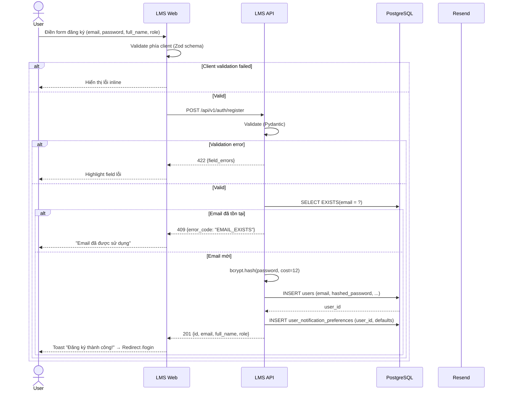
```mermaid
sequenceDiagram
    actor User
    participant FE as LMS Web
    participant API as LMS API
    participant DB as PostgreSQL
    participant Email as Resend

    User->>FE: Điền form đăng ký (email, password, full_name, role)
    FE->>FE: Validate phía client (Zod schema)
    
    alt Client validation failed
        FE-->>User: Hiển thị lỗi inline
    else Valid
        FE->>API: POST /api/v1/auth/register
        
        API->>API: Validate (Pydantic)
        
        alt Validation error
            API-->>FE: 422 {field_errors}
            FE-->>User: Highlight field lỗi
        else Valid
            API->>DB: SELECT EXISTS(email = ?)
            
            alt Email đã tồn tại
                API-->>FE: 409 {error_code: "EMAIL_EXISTS"}
                FE-->>User: "Email đã được sử dụng"
            else Email mới
                API->>API: bcrypt.hash(password, cost=12)
                API->>DB: INSERT users (email, hashed_password, ...)
                DB-->>API: user_id
                API->>DB: INSERT user_notification_preferences (user_id, defaults)
                API-->>FE: 201 {id, email, full_name, role}
                FE-->>User: Toast "Đăng ký thành công!" → Redirect /login
            end
        end
    end
```

---

### 1.2 Đăng nhập và Token Management

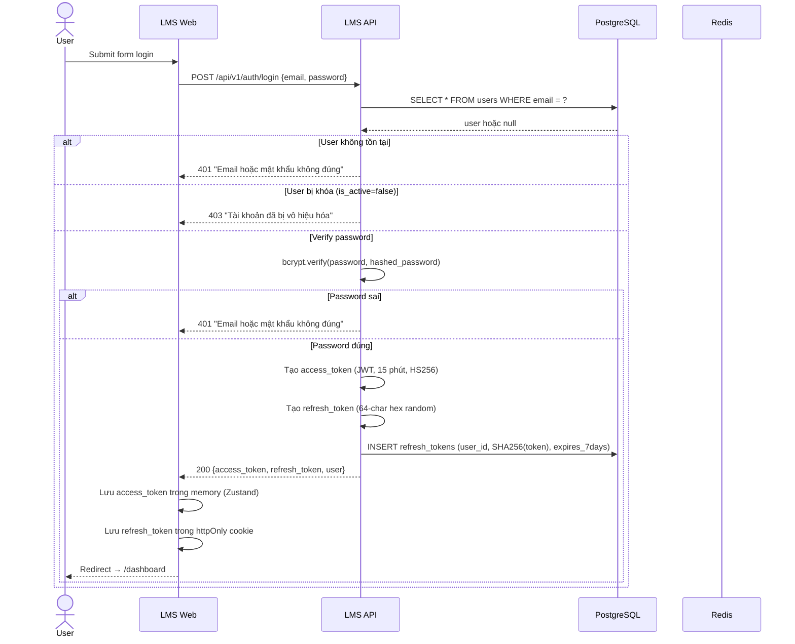
```mermaid
sequenceDiagram
    actor User
    participant FE as LMS Web
    participant API as LMS API
    participant DB as PostgreSQL
    participant Redis

    User->>FE: Submit form login
    FE->>API: POST /api/v1/auth/login {email, password}
    
    API->>DB: SELECT * FROM users WHERE email = ?
    DB-->>API: user hoặc null
    
    alt User không tồn tại
        API-->>FE: 401 "Email hoặc mật khẩu không đúng"
    else User bị khóa (is_active=false)
        API-->>FE: 403 "Tài khoản đã bị vô hiệu hóa"
    else Verify password
        API->>API: bcrypt.verify(password, hashed_password)
        
        alt Password sai
            API-->>FE: 401 "Email hoặc mật khẩu không đúng"
        else Password đúng
            API->>API: Tạo access_token (JWT, 15 phút, HS256)
            API->>API: Tạo refresh_token (64-char hex random)
            API->>DB: INSERT refresh_tokens (user_id, SHA256(token), expires_7days)
            API-->>FE: 200 {access_token, refresh_token, user}
            FE->>FE: Lưu access_token trong memory (Zustand)
            FE->>FE: Lưu refresh_token trong httpOnly cookie
            FE-->>User: Redirect → /dashboard
        end
    end
```

---

### 1.3 Auto Refresh Token (Transparent to User)

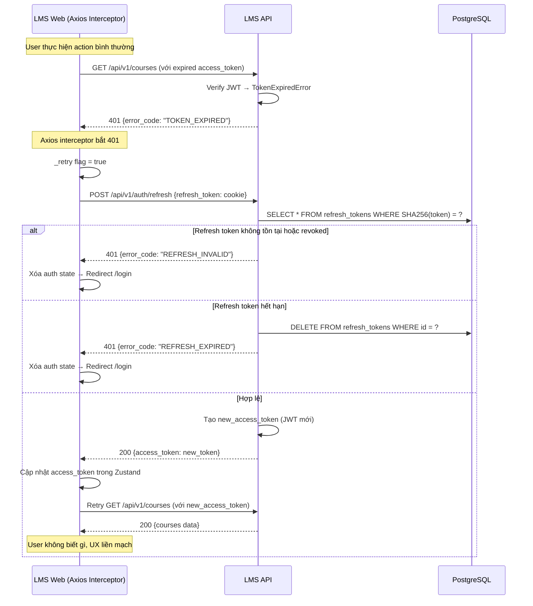
```mermaid
sequenceDiagram
    participant FE as LMS Web (Axios Interceptor)
    participant API as LMS API
    participant DB as PostgreSQL

    Note over FE: User thực hiện action bình thường
    FE->>API: GET /api/v1/courses (với expired access_token)
    API->>API: Verify JWT → TokenExpiredError
    API-->>FE: 401 {error_code: "TOKEN_EXPIRED"}
    
    Note over FE: Axios interceptor bắt 401
    FE->>FE: _retry flag = true
    FE->>API: POST /api/v1/auth/refresh {refresh_token: cookie}
    
    API->>DB: SELECT * FROM refresh_tokens WHERE SHA256(token) = ?
    
    alt Refresh token không tồn tại hoặc revoked
        API-->>FE: 401 {error_code: "REFRESH_INVALID"}
        FE->>FE: Xóa auth state → Redirect /login
    else Refresh token hết hạn
        API->>DB: DELETE FROM refresh_tokens WHERE id = ?
        API-->>FE: 401 {error_code: "REFRESH_EXPIRED"}
        FE->>FE: Xóa auth state → Redirect /login
    else Hợp lệ
        API->>API: Tạo new_access_token (JWT mới)
        API-->>FE: 200 {access_token: new_token}
        FE->>FE: Cập nhật access_token trong Zustand
        FE->>API: Retry GET /api/v1/courses (với new_access_token)
        API-->>FE: 200 {courses data}
        Note over FE: User không biết gì, UX liền mạch
    end
```

---

## 2. Course Management Flows

### 2.1 Giảng viên Tạo Khóa học và Upload Tài liệu

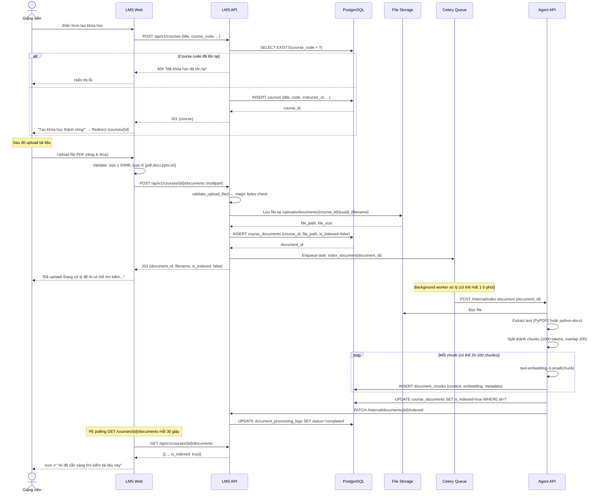
```mermaid
sequenceDiagram
    actor GV as Giảng viên
    participant FE as LMS Web
    participant API as LMS API
    participant DB as PostgreSQL
    participant Storage as File Storage
    participant Queue as Celery Queue
    participant AgentAPI as Agent API

    GV->>FE: Điền form tạo khóa học
    FE->>API: POST /api/v1/courses {title, course_code, ...}
    
    API->>DB: SELECT EXISTS(course_code = ?)
    alt Course code đã tồn tại
        API-->>FE: 409 "Mã khóa học đã tồn tại"
        FE-->>GV: Hiển thị lỗi
    else
        API->>DB: INSERT courses (title, code, instructor_id, ...)
        DB-->>API: course_id
        API-->>FE: 201 {course}
        FE-->>GV: "Tạo khóa học thành công!" → Redirect /courses/{id}
    end

    Note over GV: Sau đó upload tài liệu
    GV->>FE: Upload file PDF (drag & drop)
    FE->>FE: Validate: size ≤ 50MB, type ∈ [pdf,docx,pptx,txt]
    FE->>API: POST /api/v1/courses/{id}/documents (multipart)
    
    API->>API: validate_upload_file() ← magic bytes check
    API->>Storage: Lưu file tại /uploads/documents/{course_id}/{uuid}_{filename}
    Storage-->>API: file_path, file_size
    API->>DB: INSERT course_documents (course_id, file_path, is_indexed=false)
    DB-->>API: document_id
    
    API->>Queue: Enqueue task: index_document(document_id)
    API-->>FE: 201 {document_id, filename, is_indexed: false}
    FE-->>GV: "Đã upload! Đang xử lý để AI có thể tìm kiếm..."

    Note over Queue: Background worker xử lý (có thể mất 1-5 phút)
    Queue->>AgentAPI: POST /internal/index-document {document_id}
    AgentAPI->>Storage: Đọc file
    AgentAPI->>AgentAPI: Extract text (PyPDF2 hoặc python-docx)
    AgentAPI->>AgentAPI: Split thành chunks (1000 tokens, overlap 200)
    
    loop Mỗi chunk (có thể 20-100 chunks)
        AgentAPI->>AgentAPI: text-embedding-3-small(chunk)
        AgentAPI->>DB: INSERT document_chunks (content, embedding, metadata)
    end
    
    AgentAPI->>DB: UPDATE course_documents SET is_indexed=true WHERE id=?
    AgentAPI->>API: PATCH /internal/documents/{id}/indexed
    API->>DB: UPDATE document_processing_logs SET status='completed'
    
    Note over FE: FE polling GET /courses/{id}/documents mỗi 30 giây
    FE->>API: GET /api/v1/courses/{id}/documents
    API-->>FE: [{..., is_indexed: true}]
    FE-->>GV: Icon ✅ "AI đã sẵn sàng tìm kiếm tài liệu này"
```

---

### 2.2 Sinh viên Enroll Khóa học

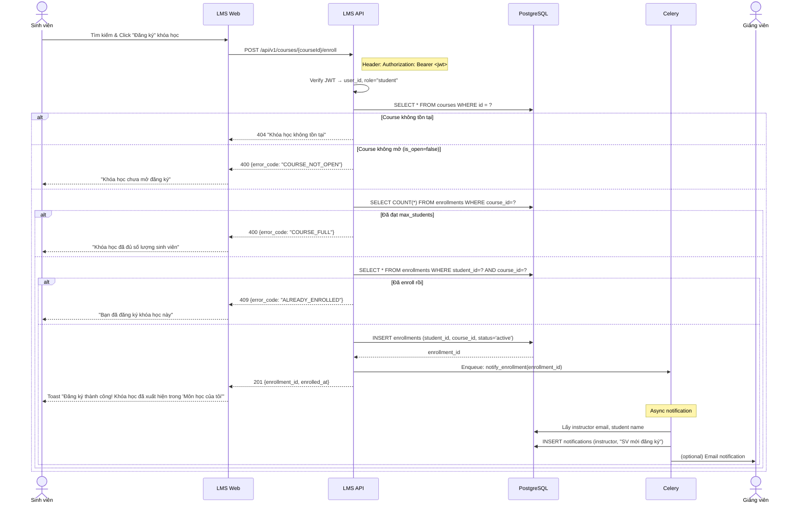
```mermaid
sequenceDiagram
    actor SV as Sinh viên
    participant FE as LMS Web
    participant API as LMS API
    participant DB as PostgreSQL
    participant Queue as Celery
    actor GV as Giảng viên

    SV->>FE: Tìm kiếm & Click "Đăng ký" khóa học
    FE->>API: POST /api/v1/courses/{courseId}/enroll
    Note right of API: Header: Authorization: Bearer <jwt>
    
    API->>API: Verify JWT → user_id, role="student"
    
    API->>DB: SELECT * FROM courses WHERE id = ?
    
    alt Course không tồn tại
        API-->>FE: 404 "Khóa học không tồn tại"
    else Course không mở (is_open=false)
        API-->>FE: 400 {error_code: "COURSE_NOT_OPEN"}
        FE-->>SV: "Khóa học chưa mở đăng ký"
    else
        API->>DB: SELECT COUNT(*) FROM enrollments WHERE course_id=?
        
        alt Đã đạt max_students
            API-->>FE: 400 {error_code: "COURSE_FULL"}
            FE-->>SV: "Khóa học đã đủ số lượng sinh viên"
        else
            API->>DB: SELECT * FROM enrollments WHERE student_id=? AND course_id=?
            
            alt Đã enroll rồi
                API-->>FE: 409 {error_code: "ALREADY_ENROLLED"}
                FE-->>SV: "Bạn đã đăng ký khóa học này"
            else
                API->>DB: INSERT enrollments (student_id, course_id, status='active')
                DB-->>API: enrollment_id
                
                API->>Queue: Enqueue: notify_enrollment(enrollment_id)
                API-->>FE: 201 {enrollment_id, enrolled_at}
                FE-->>SV: Toast "Đăng ký thành công! Khóa học đã xuất hiện trong 'Môn học của tôi'"
                
                Note over Queue: Async notification
                Queue->>DB: Lấy instructor email, student name
                Queue->>DB: INSERT notifications (instructor, "SV mới đăng ký")
                Queue->>GV: (optional) Email notification
            end
        end
    end
```

---

## 3. Assignment & Submission Flows

### 3.1 Giảng viên Tạo Bài tập

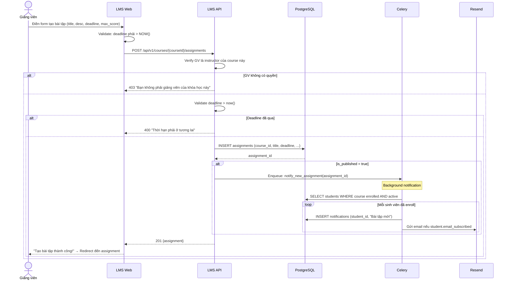
```mermaid
sequenceDiagram
    actor GV as Giảng viên
    participant FE as LMS Web
    participant API as LMS API
    participant DB as PostgreSQL
    participant Queue as Celery
    participant Email as Resend

    GV->>FE: Điền form tạo bài tập (title, desc, deadline, max_score)
    FE->>FE: Validate: deadline phải > NOW()
    FE->>API: POST /api/v1/courses/{courseId}/assignments
    
    API->>API: Verify GV là instructor của course này
    
    alt GV không có quyền
        API-->>FE: 403 "Bạn không phải giảng viên của khóa học này"
    else
        API->>API: Validate deadline > now()
        
        alt Deadline đã qua
            API-->>FE: 400 "Thời hạn phải ở tương lai"
        else
            API->>DB: INSERT assignments (course_id, title, deadline, ...)
            DB-->>API: assignment_id
            
            alt is_published = true
                API->>Queue: Enqueue: notify_new_assignment(assignment_id)
                
                Note over Queue: Background notification
                Queue->>DB: SELECT students WHERE course enrolled AND active
                
                loop Mỗi sinh viên đã enroll
                    Queue->>DB: INSERT notifications (student_id, "Bài tập mới")
                    Queue->>Email: Gửi email nếu student.email_subscribed
                end
            end
            
            API-->>FE: 201 {assignment}
            FE-->>GV: "Tạo bài tập thành công!" → Redirect đến assignment
        end
    end
```

---

### 3.2 Sinh viên Nộp Bài (File Upload)

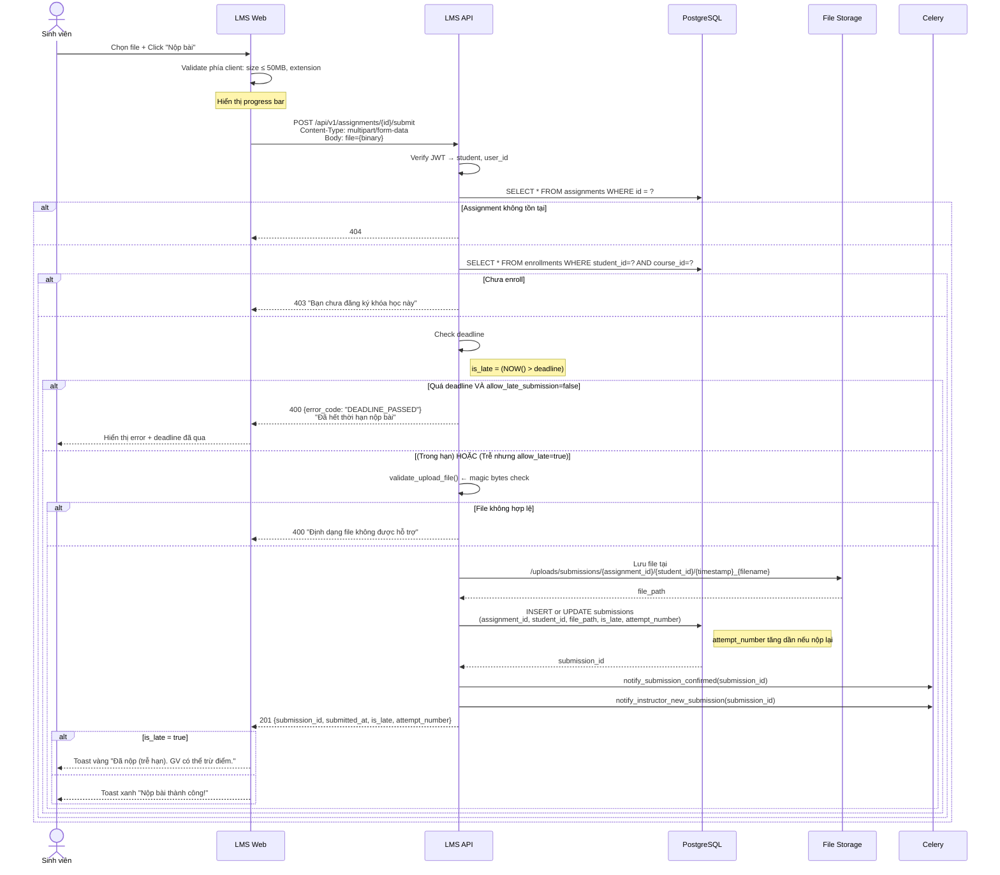
```mermaid
sequenceDiagram
    actor SV as Sinh viên
    participant FE as LMS Web
    participant API as LMS API
    participant DB as PostgreSQL
    participant Storage as File Storage
    participant Queue as Celery

    SV->>FE: Chọn file + Click "Nộp bài"
    FE->>FE: Validate phía client: size ≤ 50MB, extension
    
    Note over FE: Hiển thị progress bar
    FE->>API: POST /api/v1/assignments/{id}/submit<br/>Content-Type: multipart/form-data<br/>Body: file={binary}
    
    API->>API: Verify JWT → student, user_id
    API->>DB: SELECT * FROM assignments WHERE id = ?
    
    alt Assignment không tồn tại
        API-->>FE: 404
    else
        API->>DB: SELECT * FROM enrollments WHERE student_id=? AND course_id=?
        
        alt Chưa enroll
            API-->>FE: 403 "Bạn chưa đăng ký khóa học này"
        else
            API->>API: Check deadline
            Note right of API: is_late = (NOW() > deadline)
            
            alt Quá deadline VÀ allow_late_submission=false
                API-->>FE: 400 {error_code: "DEADLINE_PASSED"}<br/>"Đã hết thời hạn nộp bài"
                FE-->>SV: Hiển thị error + deadline đã qua
            else (Trong hạn) HOẶC (Trễ nhưng allow_late=true)
                API->>API: validate_upload_file() ← magic bytes check
                
                alt File không hợp lệ
                    API-->>FE: 400 "Định dạng file không được hỗ trợ"
                else
                    API->>Storage: Lưu file tại<br/>/uploads/submissions/{assignment_id}/{student_id}/{timestamp}_{filename}
                    Storage-->>API: file_path
                    
                    API->>DB: INSERT or UPDATE submissions<br/>(assignment_id, student_id, file_path, is_late, attempt_number)
                    Note right of DB: attempt_number tăng dần nếu nộp lại
                    DB-->>API: submission_id
                    
                    API->>Queue: notify_submission_confirmed(submission_id)
                    API->>Queue: notify_instructor_new_submission(submission_id)
                    
                    API-->>FE: 201 {submission_id, submitted_at, is_late, attempt_number}
                    
                    alt is_late = true
                        FE-->>SV: Toast vàng "Đã nộp (trễ hạn). GV có thể trừ điểm."
                    else
                        FE-->>SV: Toast xanh "Nộp bài thành công!"
                    end
                end
            end
        end
    end
```

---

### 3.3 Giảng viên Chấm điểm

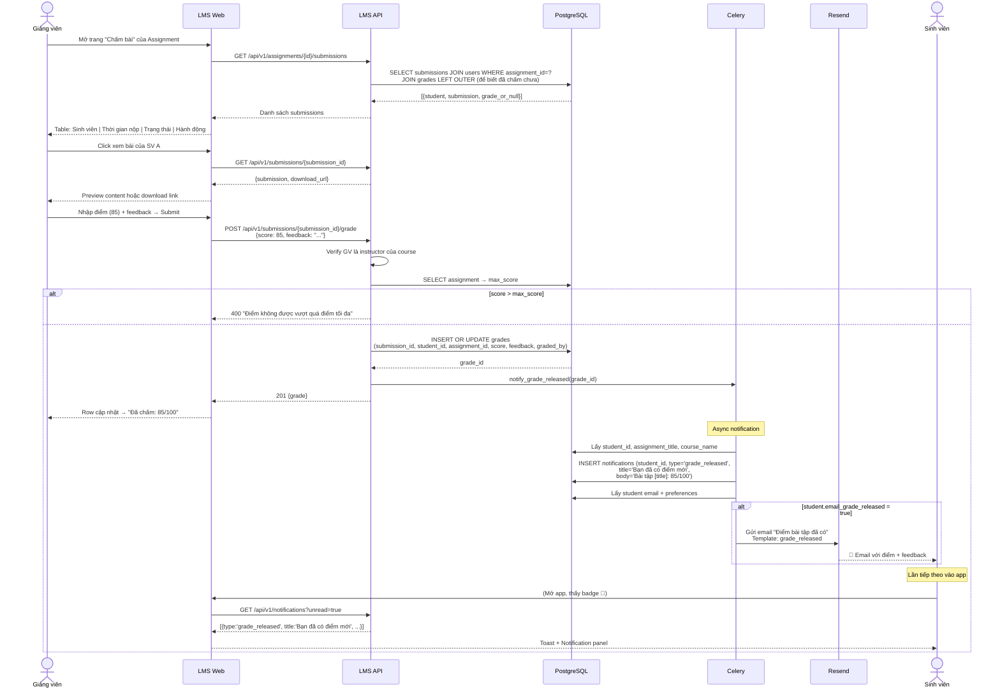
```mermaid
sequenceDiagram
    actor GV as Giảng viên
    participant FE as LMS Web
    participant API as LMS API
    participant DB as PostgreSQL
    participant Queue as Celery
    participant Email as Resend
    actor SV as Sinh viên

    GV->>FE: Mở trang "Chấm bài" của Assignment
    FE->>API: GET /api/v1/assignments/{id}/submissions
    API->>DB: SELECT submissions JOIN users WHERE assignment_id=?<br/>JOIN grades LEFT OUTER (để biết đã chấm chưa)
    DB-->>API: [{student, submission, grade_or_null}]
    API-->>FE: Danh sách submissions
    FE-->>GV: Table: Sinh viên | Thời gian nộp | Trạng thái | Hành động

    GV->>FE: Click xem bài của SV A
    FE->>API: GET /api/v1/submissions/{submission_id}
    API-->>FE: {submission, download_url}
    FE-->>GV: Preview content hoặc download link

    GV->>FE: Nhập điểm (85) + feedback → Submit
    FE->>API: POST /api/v1/submissions/{submission_id}/grade<br/>{score: 85, feedback: "..."}
    
    API->>API: Verify GV là instructor của course
    API->>DB: SELECT assignment → max_score
    
    alt score > max_score
        API-->>FE: 400 "Điểm không được vượt quá điểm tối đa"
    else
        API->>DB: INSERT OR UPDATE grades<br/>(submission_id, student_id, assignment_id, score, feedback, graded_by)
        DB-->>API: grade_id
        
        API->>Queue: notify_grade_released(grade_id)
        API-->>FE: 201 {grade}
        FE-->>GV: Row cập nhật → "Đã chấm: 85/100"
        
        Note over Queue: Async notification
        Queue->>DB: Lấy student_id, assignment_title, course_name
        Queue->>DB: INSERT notifications (student_id, type='grade_released',<br/>title='Bạn đã có điểm mới',<br/>body='Bài tập [title]: 85/100')
        Queue->>DB: Lấy student email + preferences
        
        alt student.email_grade_released = true
            Queue->>Email: Gửi email "Điểm bài tập đã có"<br/>Template: grade_released
            Email-->>SV: 📧 Email với điểm + feedback
        end
        
        Note over SV: Lần tiếp theo vào app
        SV->>FE: (Mở app, thấy badge 🔔)
        FE->>API: GET /api/v1/notifications?unread=true
        API-->>FE: [{type:'grade_released', title:'Bạn đã có điểm mới', ...}]
        FE-->>SV: Toast + Notification panel
    end
```

---

## 4. AI Agent Flows

### 4.1 Chat với AI Agent (Streaming SSE)

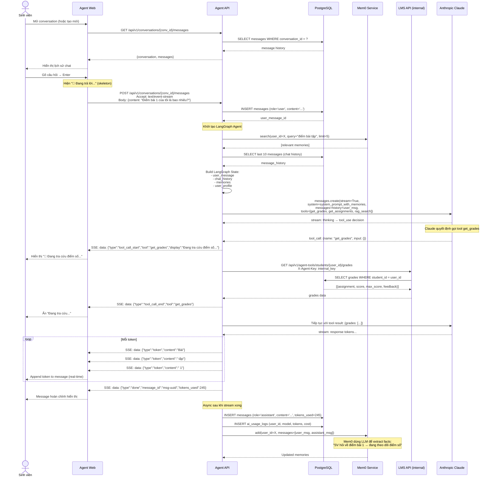
```mermaid
sequenceDiagram
    actor SV as Sinh viên
    participant FE as Agent Web
    participant AgentAPI as Agent API
    participant DB as PostgreSQL
    participant Mem0 as Mem0 Service
    participant LMS as LMS API (internal)
    participant LLM as Anthropic Claude

    SV->>FE: Mở conversation (hoặc tạo mới)
    FE->>AgentAPI: GET /api/v1/conversations/{conv_id}/messages
    AgentAPI->>DB: SELECT messages WHERE conversation_id = ?
    DB-->>AgentAPI: message history
    AgentAPI-->>FE: {conversation, messages}
    FE-->>SV: Hiển thị lịch sử chat

    SV->>FE: Gõ câu hỏi → Enter
    Note over FE: Hiện "🤖 Đang trả lời..." (skeleton)
    
    FE->>AgentAPI: POST /api/v1/conversations/{conv_id}/messages<br/>Accept: text/event-stream<br/>Body: {content: "Điểm bài 1 của tôi là bao nhiêu?"}
    
    AgentAPI->>DB: INSERT messages (role='user', content='...')
    DB-->>AgentAPI: user_message_id
    
    Note over AgentAPI: Khởi tạo LangGraph Agent
    
    AgentAPI->>Mem0: search(user_id=X, query="điểm bài tập", limit=5)
    Mem0-->>AgentAPI: [relevant memories]
    
    AgentAPI->>DB: SELECT last 10 messages (chat history)
    DB-->>AgentAPI: message_history
    
    AgentAPI->>AgentAPI: Build LangGraph State:<br/>- user_message<br/>- chat_history<br/>- memories<br/>- user_profile
    
    AgentAPI->>LLM: messages.create(stream=True,<br/>system=system_prompt_with_memories,<br/>messages=history+user_msg,<br/>tools=[get_grades, get_assignments, rag_search])
    
    LLM-->>AgentAPI: stream: thinking → tool_use decision
    
    Note over LLM: Claude quyết định gọi tool get_grades
    LLM-->>AgentAPI: tool_call: {name: "get_grades", input: {}}
    
    AgentAPI-->>FE: SSE: data: {"type":"tool_call_start","tool":"get_grades","display":"Đang tra cứu điểm số..."}
    FE-->>SV: Hiển thị "🔧 Đang tra cứu điểm số..."
    
    AgentAPI->>LMS: GET /api/v1/agent-tools/students/{user_id}/grades<br/>X-Agent-Key: internal_key
    LMS->>DB: SELECT grades WHERE student_id = user_id
    DB-->>LMS: [{assignment, score, max_score, feedback}]
    LMS-->>AgentAPI: grades data
    
    AgentAPI-->>FE: SSE: data: {"type":"tool_call_end","tool":"get_grades"}
    FE-->>SV: Ẩn "Đang tra cứu..."
    
    AgentAPI->>LLM: Tiếp tục với tool result: {grades: [...]}
    
    LLM-->>AgentAPI: stream: response tokens...
    
    loop Mỗi token
        AgentAPI-->>FE: SSE: data: {"type":"token","content":"Bài"}
        AgentAPI-->>FE: SSE: data: {"type":"token","content":" tập"}
        AgentAPI-->>FE: SSE: data: {"type":"token","content":" 1"}
        FE-->>SV: Append token to message (real-time)
    end
    
    AgentAPI-->>FE: SSE: data: {"type":"done","message_id":"msg-uuid","tokens_used":245}
    FE-->>SV: Message hoàn chỉnh hiển thị
    
    Note over AgentAPI: Async sau khi stream xong
    AgentAPI->>DB: INSERT messages (role='assistant', content='...', tokens_used=245)
    AgentAPI->>DB: INSERT ai_usage_logs (user_id, model, tokens, cost)
    
    AgentAPI->>Mem0: add(user_id=X, messages=[user_msg, assistant_msg])
    Note over Mem0: Mem0 dùng LLM để extract facts:<br/>"SV hỏi về điểm bài 1 → đang theo dõi điểm số"
    Mem0-->>AgentAPI: Updated memories
```

---

### 4.2 RAG — Sinh viên hỏi về Nội dung Tài liệu

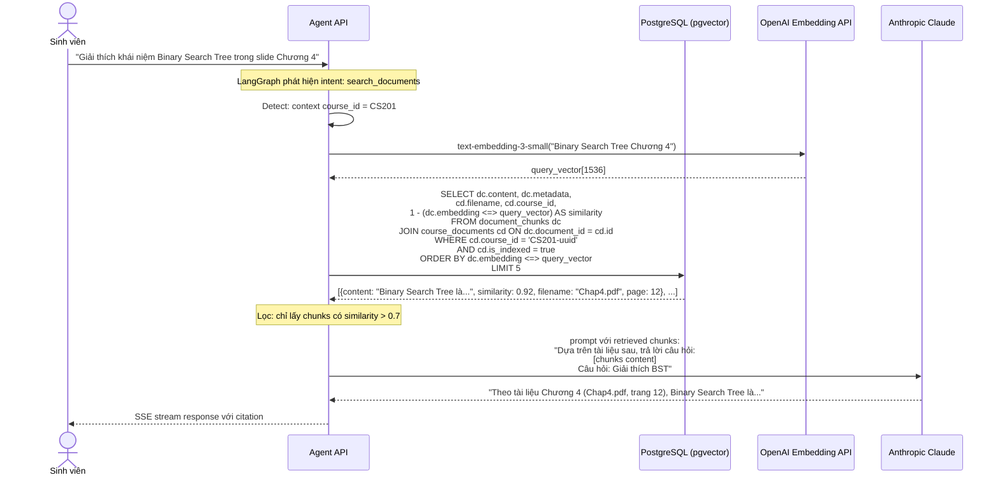
```mermaid
sequenceDiagram
    actor SV as Sinh viên
    participant AgentAPI as Agent API
    participant VDB as PostgreSQL (pgvector)
    participant Embed as OpenAI Embedding API
    participant LLM as Anthropic Claude

    SV->>AgentAPI: "Giải thích khái niệm Binary Search Tree trong slide Chương 4"
    
    Note over AgentAPI: LangGraph phát hiện intent: search_documents
    AgentAPI->>AgentAPI: Detect: context course_id = CS201
    
    AgentAPI->>Embed: text-embedding-3-small("Binary Search Tree Chương 4")
    Embed-->>AgentAPI: query_vector[1536]
    
    AgentAPI->>VDB: SELECT dc.content, dc.metadata,<br/>cd.filename, cd.course_id,<br/>1 - (dc.embedding <=> query_vector) AS similarity<br/>FROM document_chunks dc<br/>JOIN course_documents cd ON dc.document_id = cd.id<br/>WHERE cd.course_id = 'CS201-uuid'<br/>AND cd.is_indexed = true<br/>ORDER BY dc.embedding <=> query_vector<br/>LIMIT 5
    
    VDB-->>AgentAPI: [{content: "Binary Search Tree là...", similarity: 0.92, filename: "Chap4.pdf", page: 12}, ...]
    
    Note over AgentAPI: Lọc: chỉ lấy chunks có similarity > 0.7
    
    AgentAPI->>LLM: prompt với retrieved chunks:<br/>"Dựa trên tài liệu sau, trả lời câu hỏi:<br/>[chunks content]<br/>Câu hỏi: Giải thích BST"
    
    LLM-->>AgentAPI: "Theo tài liệu Chương 4 (Chap4.pdf, trang 12), Binary Search Tree là..."
    
    AgentAPI-->>SV: SSE stream response với citation
```

---

### 4.3 Memory System — Trích xuất và Cập nhật Memory

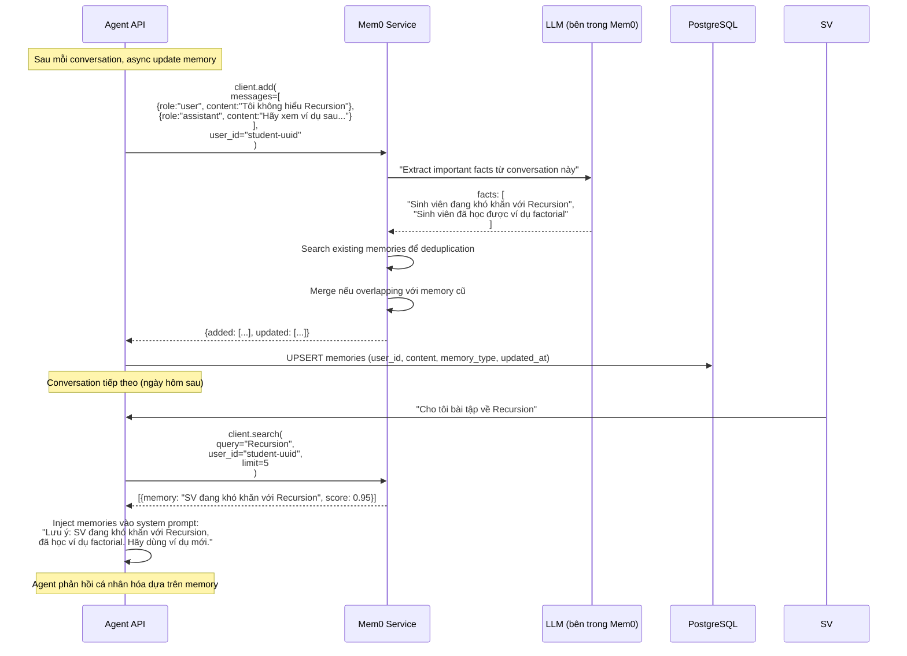
```mermaid
sequenceDiagram
    participant AgentAPI as Agent API
    participant Mem0 as Mem0 Service
    participant Mem0LLM as LLM (bên trong Mem0)
    participant DB as PostgreSQL

    Note over AgentAPI: Sau mỗi conversation, async update memory

    AgentAPI->>Mem0: client.add(<br/>  messages=[<br/>    {role:"user", content:"Tôi không hiểu Recursion"},<br/>    {role:"assistant", content:"Hãy xem ví dụ sau..."}<br/>  ],<br/>  user_id="student-uuid"<br/>)
    
    Mem0->>Mem0LLM: "Extract important facts từ conversation này"
    Mem0LLM-->>Mem0: facts: [<br/>  "Sinh viên đang khó khăn với Recursion",<br/>  "Sinh viên đã học được ví dụ factorial"<br/>]
    
    Mem0->>Mem0: Search existing memories để deduplication
    Mem0->>Mem0: Merge nếu overlapping với memory cũ
    Mem0-->>AgentAPI: {added: [...], updated: [...]}
    
    AgentAPI->>DB: UPSERT memories (user_id, content, memory_type, updated_at)
    
    Note over AgentAPI: Conversation tiếp theo (ngày hôm sau)
    
    SV->>AgentAPI: "Cho tôi bài tập về Recursion"
    AgentAPI->>Mem0: client.search(<br/>  query="Recursion",<br/>  user_id="student-uuid",<br/>  limit=5<br/>)
    Mem0-->>AgentAPI: [{memory: "SV đang khó khăn với Recursion", score: 0.95}]
    
    AgentAPI->>AgentAPI: Inject memories vào system prompt:<br/>"Lưu ý: SV đang khó khăn với Recursion,<br/>đã học ví dụ factorial. Hãy dùng ví dụ mới."
    
    Note over AgentAPI: Agent phản hồi cá nhân hóa dựa trên memory
```

---

### 4.4 Tạo Conversation Mới và Context Selection

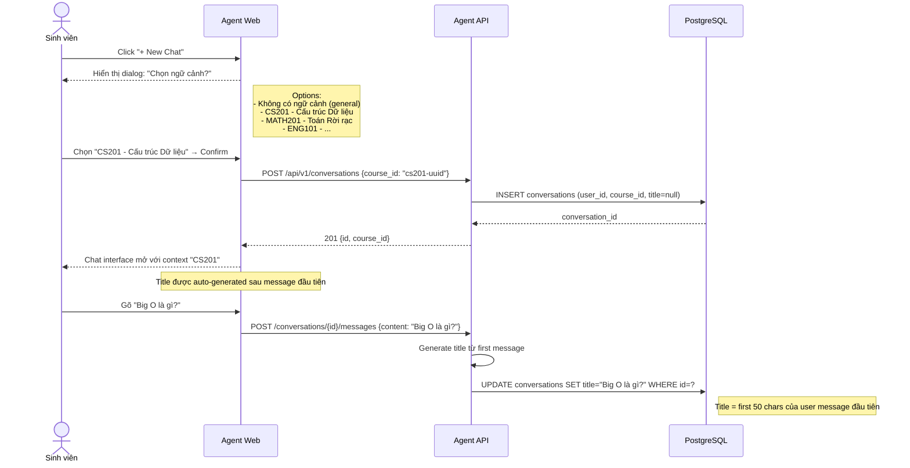
```mermaid
sequenceDiagram
    actor SV as Sinh viên
    participant FE as Agent Web
    participant AgentAPI as Agent API
    participant DB as PostgreSQL

    SV->>FE: Click "+ New Chat"
    FE-->>SV: Hiển thị dialog: "Chọn ngữ cảnh?"
    Note right of FE: Options:<br/>- Không có ngữ cảnh (general)<br/>- CS201 - Cấu trúc Dữ liệu<br/>- MATH201 - Toán Rời rạc<br/>- ENG101 - ...
    
    SV->>FE: Chọn "CS201 - Cấu trúc Dữ liệu" → Confirm
    
    FE->>AgentAPI: POST /api/v1/conversations {course_id: "cs201-uuid"}
    AgentAPI->>DB: INSERT conversations (user_id, course_id, title=null)
    DB-->>AgentAPI: conversation_id
    AgentAPI-->>FE: 201 {id, course_id}
    FE-->>SV: Chat interface mở với context "CS201"
    
    Note over FE: Title được auto-generated sau message đầu tiên
    SV->>FE: Gõ "Big O là gì?"
    FE->>AgentAPI: POST /conversations/{id}/messages {content: "Big O là gì?"}
    AgentAPI->>AgentAPI: Generate title từ first message
    AgentAPI->>DB: UPDATE conversations SET title="Big O là gì?" WHERE id=?
    Note right of DB: Title = first 50 chars của user message đầu tiên
```

---

## 5. Notification System Flow

### 5.1 Deadline Reminder (Scheduled)

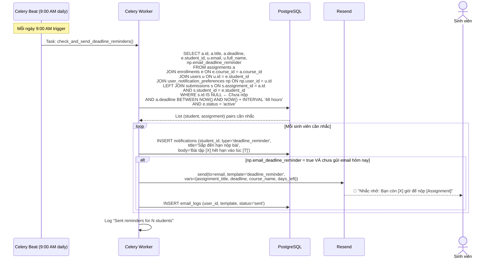
```mermaid
sequenceDiagram
    participant Beat as Celery Beat (9:00 AM daily)
    participant Worker as Celery Worker
    participant DB as PostgreSQL
    participant Email as Resend
    actor SV as Sinh viên

    Note over Beat: Mỗi ngày 9:00 AM trigger

    Beat->>Worker: Task: check_and_send_deadline_reminders()
    
    Worker->>DB: SELECT a.id, a.title, a.deadline,<br/>e.student_id, u.email, u.full_name,<br/>np.email_deadline_reminder<br/>FROM assignments a<br/>JOIN enrollments e ON e.course_id = a.course_id<br/>JOIN users u ON u.id = e.student_id<br/>JOIN user_notification_preferences np ON np.user_id = u.id<br/>LEFT JOIN submissions s ON s.assignment_id = a.id<br/>  AND s.student_id = e.student_id<br/>WHERE s.id IS NULL  ← Chưa nộp<br/>AND a.deadline BETWEEN NOW() AND NOW() + INTERVAL '48 hours'<br/>AND e.status = 'active'
    
    DB-->>Worker: List (student, assignment) pairs cần nhắc

    loop Mỗi sinh viên cần nhắc
        Worker->>DB: INSERT notifications (student_id, type='deadline_reminder',<br/>title='Sắp đến hạn nộp bài',<br/>body='Bài tập [X] hết hạn vào lúc [T]')
        
        alt np.email_deadline_reminder = true VÀ chưa gửi email hôm nay
            Worker->>Email: send(to=email, template='deadline_reminder',<br/>vars={assignment_title, deadline, course_name, days_left})
            Email-->>SV: 📧 "Nhắc nhở: Bạn còn [X] giờ để nộp [Assignment]"
            Worker->>DB: INSERT email_logs (user_id, template, status='sent')
        end
    end
    
    Worker->>Worker: Log "Sent reminders for N students"
```

---

### 5.2 Weekly Digest Email

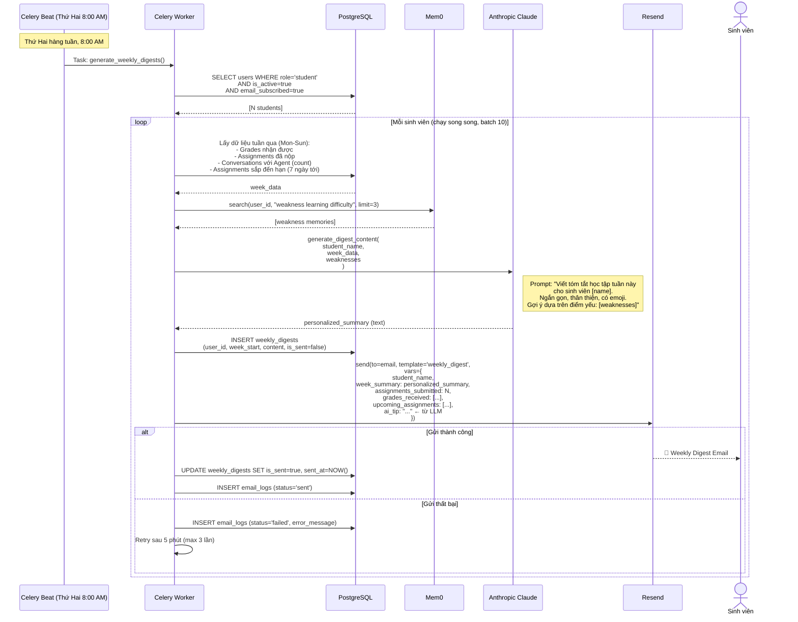
```mermaid
sequenceDiagram
    participant Beat as Celery Beat (Thứ Hai 8:00 AM)
    participant Worker as Celery Worker
    participant DB as PostgreSQL
    participant Mem0 as Mem0
    participant LLM as Anthropic Claude
    participant Email as Resend
    actor SV as Sinh viên

    Note over Beat: Thứ Hai hàng tuần, 8:00 AM

    Beat->>Worker: Task: generate_weekly_digests()
    Worker->>DB: SELECT users WHERE role='student'<br/>AND is_active=true<br/>AND email_subscribed=true
    DB-->>Worker: [N students]

    loop Mỗi sinh viên (chạy song song, batch 10)
        Worker->>DB: Lấy dữ liệu tuần qua (Mon-Sun):<br/>- Grades nhận được<br/>- Assignments đã nộp<br/>- Conversations với Agent (count)<br/>- Assignments sắp đến hạn (7 ngày tới)
        DB-->>Worker: week_data
        
        Worker->>Mem0: search(user_id, "weakness learning difficulty", limit=3)
        Mem0-->>Worker: [weakness memories]
        
        Worker->>LLM: generate_digest_content(<br/>  student_name,<br/>  week_data,<br/>  weaknesses<br/>)
        Note right of LLM: Prompt: "Viết tóm tắt học tập tuần này<br/>cho sinh viên [name].<br/>Ngắn gọn, thân thiện, có emoji.<br/>Gợi ý dựa trên điểm yếu: [weaknesses]"
        LLM-->>Worker: personalized_summary (text)
        
        Worker->>DB: INSERT weekly_digests<br/>(user_id, week_start, content, is_sent=false)
        
        Worker->>Email: send(to=email, template='weekly_digest',<br/>vars={<br/>  student_name,<br/>  week_summary: personalized_summary,<br/>  assignments_submitted: N,<br/>  grades_received: [...],<br/>  upcoming_assignments: [...],<br/>  ai_tip: "..." ← từ LLM<br/>})
        
        alt Gửi thành công
            Email-->>SV: 📧 Weekly Digest Email
            Worker->>DB: UPDATE weekly_digests SET is_sent=true, sent_at=NOW()
            Worker->>DB: INSERT email_logs (status='sent')
        else Gửi thất bại
            Worker->>DB: INSERT email_logs (status='failed', error_message)
            Worker->>Worker: Retry sau 5 phút (max 3 lần)
        end
    end
```

---

## 6. Admin Flows

### 6.1 Admin Quản lý User

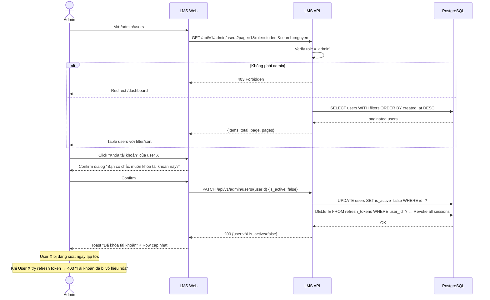
```mermaid
sequenceDiagram
    actor Admin
    participant FE as LMS Web
    participant API as LMS API
    participant DB as PostgreSQL

    Admin->>FE: Mở /admin/users
    FE->>API: GET /api/v1/admin/users?page=1&role=student&search=nguyen
    
    API->>API: Verify role = 'admin'
    alt Không phải admin
        API-->>FE: 403 Forbidden
        FE-->>Admin: Redirect /dashboard
    else
        API->>DB: SELECT users WITH filters ORDER BY created_at DESC
        DB-->>API: paginated users
        API-->>FE: {items, total, page, pages}
        FE-->>Admin: Table users với filter/sort
    end

    Admin->>FE: Click "Khóa tài khoản" của user X
    FE-->>Admin: Confirm dialog "Bạn có chắc muốn khóa tài khoản này?"
    Admin->>FE: Confirm
    
    FE->>API: PATCH /api/v1/admin/users/{userId} {is_active: false}
    API->>DB: UPDATE users SET is_active=false WHERE id=?
    API->>DB: DELETE FROM refresh_tokens WHERE user_id=? ← Revoke all sessions
    DB-->>API: OK
    API-->>FE: 200 {user với is_active=false}
    FE-->>Admin: Toast "Đã khóa tài khoản" + Row cập nhật
    
    Note over Admin: User X bị đăng xuất ngay lập tức
    Note over Admin: Khi User X try refresh token → 403 "Tài khoản đã bị vô hiệu hóa"
```

---

## 7. File Download Flow

### 7.1 Download Submission File

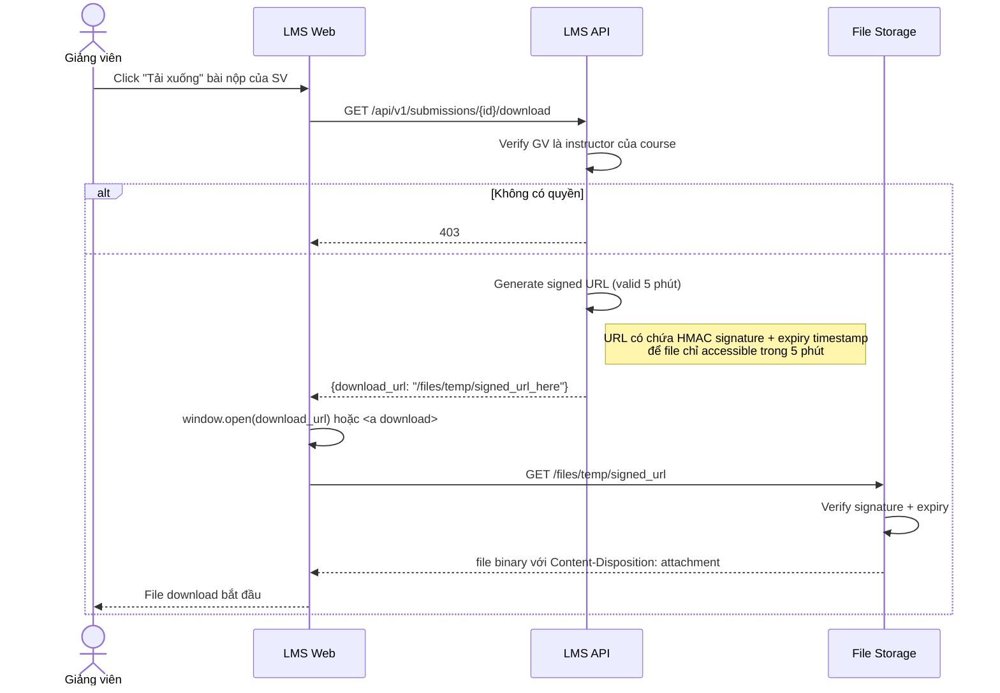
```mermaid
sequenceDiagram
    actor GV as Giảng viên
    participant FE as LMS Web
    participant API as LMS API
    participant Storage as File Storage

    GV->>FE: Click "Tải xuống" bài nộp của SV
    FE->>API: GET /api/v1/submissions/{id}/download
    
    API->>API: Verify GV là instructor của course
    alt Không có quyền
        API-->>FE: 403
    else
        API->>API: Generate signed URL (valid 5 phút)
        Note right of API: URL có chứa HMAC signature + expiry timestamp<br/>để file chỉ accessible trong 5 phút
        API-->>FE: {download_url: "/files/temp/signed_url_here"}
        FE->>FE: window.open(download_url) hoặc <a download>
        FE->>Storage: GET /files/temp/signed_url
        Storage->>Storage: Verify signature + expiry
        Storage-->>FE: file binary với Content-Disposition: attachment
        FE-->>GV: File download bắt đầu
    end
```

---

## 8. Error Handling Flow

### 8.1 AI API Failure Fallback

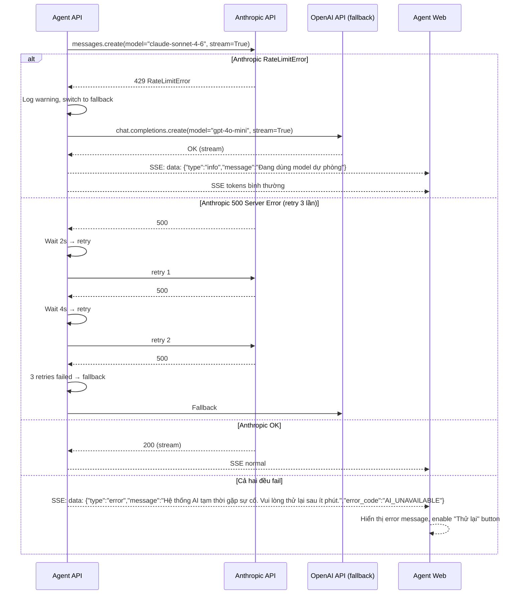
```mermaid
sequenceDiagram
    participant AgentAPI as Agent API
    participant Anthropic as Anthropic API
    participant OpenAI as OpenAI API (fallback)
    participant FE as Agent Web

    AgentAPI->>Anthropic: messages.create(model="claude-sonnet-4-6", stream=True)
    
    alt Anthropic RateLimitError
        Anthropic-->>AgentAPI: 429 RateLimitError
        AgentAPI->>AgentAPI: Log warning, switch to fallback
        AgentAPI->>OpenAI: chat.completions.create(model="gpt-4o-mini", stream=True)
        OpenAI-->>AgentAPI: OK (stream)
        AgentAPI-->>FE: SSE: data: {"type":"info","message":"Đang dùng model dự phòng"}
        AgentAPI-->>FE: SSE tokens bình thường
    else Anthropic 500 Server Error (retry 3 lần)
        Anthropic-->>AgentAPI: 500
        AgentAPI->>AgentAPI: Wait 2s → retry
        AgentAPI->>Anthropic: retry 1
        Anthropic-->>AgentAPI: 500
        AgentAPI->>AgentAPI: Wait 4s → retry
        AgentAPI->>Anthropic: retry 2
        Anthropic-->>AgentAPI: 500
        AgentAPI->>AgentAPI: 3 retries failed → fallback
        AgentAPI->>OpenAI: Fallback
    else Anthropic OK
        Anthropic-->>AgentAPI: 200 (stream)
        AgentAPI-->>FE: SSE normal
    else Cả hai đều fail
        AgentAPI-->>FE: SSE: data: {"type":"error","message":"Hệ thống AI tạm thời gặp sự cố. Vui lòng thử lại sau ít phút.","error_code":"AI_UNAVAILABLE"}
        FE-->>FE: Hiển thị error message, enable "Thử lại" button
    end
```

---

## 9. Data Flow Diagram — Tổng thể

```
                    ┌────────────────────────────────────────────────┐
                    │                                                │
                    │              USER REQUEST                      │
                    │              (Browser → HTTPS)                 │
                    │                                                │
                    └───────────────────┬────────────────────────────┘
                                        │
                                        ▼
                    ┌────────────────────────────────────────────────┐
                    │              CADDY PROXY                       │
                    │   Route by domain → correct service            │
                    └───────────────────┬────────────────────────────┘
                                        │
                    ┌───────────────────┼────────────────────────────┐
                    │                   │                            │
                    ▼                   ▼                            ▼
              LMS Web              Agent Web                  LMS API / Agent API
              (Next.js)            (Next.js)                  (FastAPI)
                    │                   │                            │
                    │                   │     ┌──────────────────────┤
                    │                   │     │                      │
                    └───────────────────┴────▶│    BUSINESS LOGIC    │
                                              │    LAYER             │
                                              │    (Services/Repos)  │
                                              └──────┬───────────────┘
                                                     │
                              ┌──────────────────────┼──────────────────────┐
                              │                      │                      │
                              ▼                      ▼                      ▼
                       PostgreSQL                  Redis               File Storage
                       (Primary DB)         (Cache/Queue/RL)          (/uploads)
                              │
                              │ (Async via Celery)
                              ▼
                       Celery Workers
                              │
                    ┌─────────┴─────────┐
                    │                   │
                    ▼                   ▼
              Resend Email          Agent API
              (Notifications)      (Document indexing)
                                        │
                              ┌─────────┴─────────┐
                              │                   │
                              ▼                   ▼
                        OpenAI API           Mem0 API
                        (Embeddings)         (Memory)
                              │
                              ▼
                        pgvector DB
                        (Vector search)
```

---

*Các diagram Mermaid trong tài liệu này được render bởi mermaid.live hoặc plugin "Markdown Preview Enhanced" trong VS Code.*
