# 01_SEQUENCE_DIAGRAMS_STUDENT_FUNCTION_LEVEL.md — Sequence Diagram cấp từng chức năng cho Sinh viên

**Phiên bản bổ sung:** 3.0  
**Ngày:** 2026-04-29  
**Mục đích:** Bổ sung Mermaid Sequence Diagram riêng cho từng chức năng đã liệt kê trong bộ tài liệu Sequence Diagrams hiện tại.

## 0. Quy ước

- Mỗi chức năng có một sơ đồ `mermaid sequenceDiagram` riêng.
- Sơ đồ dùng chung kiến trúc: Frontend Web/App → Auth Service → Backend API Gateway → RBAC/Permission Service → Validation Service → PostgreSQL/Redis/File Storage/Notification/Audit.
- Các bước có thể được tinh chỉnh khi triển khai API thực tế, nhưng đã bao phủ đầy đủ luồng xử lý nghiệp vụ chính cho từng chức năng.

## 1. Bảng bao phủ

Tổng số chức năng có Sequence Diagram riêng: **148**.

| STT | Nhóm chức năng | Chức năng |
|---:|---|---|
| 1 | 1.1. Tài khoản & hồ sơ cá nhân | Đăng nhập |
| 2 | 1.1. Tài khoản & hồ sơ cá nhân | Đăng xuất |
| 3 | 1.1. Tài khoản & hồ sơ cá nhân | Quên mật khẩu |
| 4 | 1.1. Tài khoản & hồ sơ cá nhân | Đổi mật khẩu |
| 5 | 1.1. Tài khoản & hồ sơ cá nhân | Xác thực 2 lớp |
| 6 | 1.1. Tài khoản & hồ sơ cá nhân | Xem hồ sơ cá nhân |
| 7 | 1.1. Tài khoản & hồ sơ cá nhân | Cập nhật hồ sơ |
| 8 | 1.1. Tài khoản & hồ sơ cá nhân | Xem lịch sử đăng nhập |
| 9 | 1.1. Tài khoản & hồ sơ cá nhân | Quản lý thông báo cá nhân |
| 10 | 1.1. Tài khoản & hồ sơ cá nhân | Cấu hình ngôn ngữ |
| 11 | 1.1. Tài khoản & hồ sơ cá nhân | Cấu hình giao diện |
| 12 | 1.2. Khóa học / học phần | Xem danh sách học phần |
| 13 | 1.2. Khóa học / học phần | Tìm kiếm học phần |
| 14 | 1.2. Khóa học / học phần | Tham gia lớp học phần |
| 15 | 1.2. Khóa học / học phần | Xem thông tin học phần |
| 16 | 1.2. Khóa học / học phần | Xem giảng viên phụ trách |
| 17 | 1.2. Khóa học / học phần | Xem danh sách bạn học |
| 18 | 1.2. Khóa học / học phần | Xem tiến độ môn học |
| 19 | 1.2. Khóa học / học phần | Xem điều kiện hoàn thành |
| 20 | 1.2. Khóa học / học phần | Xem môn học tiên quyết |
| 21 | 1.2. Khóa học / học phần | Xem trạng thái học phần |
| 22 | 1.3. Học liệu & bài giảng | Xem chương/buổi học |
| 23 | 1.3. Học liệu & bài giảng | Xem bài giảng dạng text |
| 24 | 1.3. Học liệu & bài giảng | Xem slide |
| 25 | 1.3. Học liệu & bài giảng | Xem video bài giảng |
| 26 | 1.3. Học liệu & bài giảng | Tải tài liệu |
| 27 | 1.3. Học liệu & bài giảng | Xem tài liệu tham khảo |
| 28 | 1.3. Học liệu & bài giảng | Đánh dấu đã học |
| 29 | 1.3. Học liệu & bài giảng | Bookmark bài học |
| 30 | 1.3. Học liệu & bài giảng | Ghi chú cá nhân |
| 31 | 1.3. Học liệu & bài giảng | Tìm kiếm trong khóa học |
| 32 | 1.3. Học liệu & bài giảng | Học theo điều kiện |
| 33 | 1.3. Học liệu & bài giảng | Xem lịch sử học tập |
| 34 | 1.3. Học liệu & bài giảng | Tiếp tục học |
| 35 | 1.3. Học liệu & bài giảng | Đánh giá bài học |
| 36 | 1.4. Bài tập | Xem danh sách bài tập |
| 37 | 1.4. Bài tập | Xem chi tiết bài tập |
| 38 | 1.4. Bài tập | Tải đề bài |
| 39 | 1.4. Bài tập | Nộp bài dạng file |
| 40 | 1.4. Bài tập | Nộp bài dạng text |
| 41 | 1.4. Bài tập | Nộp bài dạng link |
| 42 | 1.4. Bài tập | Nộp bài nhóm |
| 43 | 1.4. Bài tập | Sửa bài đã nộp |
| 44 | 1.4. Bài tập | Xóa bài nộp |
| 45 | 1.4. Bài tập | Xem trạng thái bài nộp |
| 46 | 1.4. Bài tập | Xem thời gian nộp |
| 47 | 1.4. Bài tập | Xem bài nộp muộn |
| 48 | 1.4. Bài tập | Xem điểm bài tập |
| 49 | 1.4. Bài tập | Xem nhận xét |
| 50 | 1.4. Bài tập | Xem rubric chấm điểm |
| 51 | 1.4. Bài tập | Xem file phản hồi |
| 52 | 1.4. Bài tập | Khiếu nại điểm bài tập |
| 53 | 1.5. Kiểm tra / thi / quiz | Xem danh sách bài kiểm tra |
| 54 | 1.5. Kiểm tra / thi / quiz | Xem lịch thi |
| 55 | 1.5. Kiểm tra / thi / quiz | Làm bài trắc nghiệm |
| 56 | 1.5. Kiểm tra / thi / quiz | Làm câu đúng/sai |
| 57 | 1.5. Kiểm tra / thi / quiz | Làm câu điền khuyết |
| 58 | 1.5. Kiểm tra / thi / quiz | Làm câu ghép đôi |
| 59 | 1.5. Kiểm tra / thi / quiz | Làm câu sắp xếp |
| 60 | 1.5. Kiểm tra / thi / quiz | Làm câu tự luận |
| 61 | 1.5. Kiểm tra / thi / quiz | Làm câu tính toán |
| 62 | 1.5. Kiểm tra / thi / quiz | Lưu bài tạm thời |
| 63 | 1.5. Kiểm tra / thi / quiz | Tự động nộp khi hết giờ |
| 64 | 1.5. Kiểm tra / thi / quiz | Xem đồng hồ đếm ngược |
| 65 | 1.5. Kiểm tra / thi / quiz | Làm lại bài |
| 66 | 1.5. Kiểm tra / thi / quiz | Xem lịch sử làm bài |
| 67 | 1.5. Kiểm tra / thi / quiz | Xem kết quả |
| 68 | 1.5. Kiểm tra / thi / quiz | Xem đáp án đúng |
| 69 | 1.5. Kiểm tra / thi / quiz | Thi có giám sát |
| 70 | 1.5. Kiểm tra / thi / quiz | Nhận cảnh báo gian lận |
| 71 | 1.5. Kiểm tra / thi / quiz | Gửi yêu cầu xử lý sự cố |
| 72 | 1.6. Điểm số & kết quả học tập | Xem bảng điểm môn học |
| 73 | 1.6. Điểm số & kết quả học tập | Xem điểm thành phần |
| 74 | 1.6. Điểm số & kết quả học tập | Xem trọng số điểm |
| 75 | 1.6. Điểm số & kết quả học tập | Xem điểm tổng kết |
| 76 | 1.6. Điểm số & kết quả học tập | Xem trạng thái đạt/rớt |
| 77 | 1.6. Điểm số & kết quả học tập | Xem nhận xét học tập |
| 78 | 1.6. Điểm số & kết quả học tập | Xem tiến độ hoàn thành |
| 79 | 1.6. Điểm số & kết quả học tập | Xem GPA/CPA |
| 80 | 1.6. Điểm số & kết quả học tập | Tải bảng điểm |
| 81 | 1.6. Điểm số & kết quả học tập | Gửi phúc khảo |
| 82 | 1.6. Điểm số & kết quả học tập | Theo dõi trạng thái phúc khảo |
| 83 | 1.7. Điểm danh & chuyên cần | Xem lịch điểm danh |
| 84 | 1.7. Điểm danh & chuyên cần | Điểm danh QR |
| 85 | 1.7. Điểm danh & chuyên cần | Điểm danh bằng mã lớp |
| 86 | 1.7. Điểm danh & chuyên cần | Điểm danh online |
| 87 | 1.7. Điểm danh & chuyên cần | Xem trạng thái điểm danh |
| 88 | 1.7. Điểm danh & chuyên cần | Xem tỷ lệ chuyên cần |
| 89 | 1.7. Điểm danh & chuyên cần | Gửi lý do vắng |
| 90 | 1.7. Điểm danh & chuyên cần | Xem cảnh báo chuyên cần |
| 91 | 1.8. Lịch học & deadline | Xem lịch học cá nhân |
| 92 | 1.8. Lịch học & deadline | Xem lịch thi |
| 93 | 1.8. Lịch học & deadline | Xem deadline bài tập |
| 94 | 1.8. Lịch học & deadline | Xem sự kiện học tập |
| 95 | 1.8. Lịch học & deadline | Nhắc lịch học |
| 96 | 1.8. Lịch học & deadline | Nhắc hạn nộp bài |
| 97 | 1.8. Lịch học & deadline | Đồng bộ lịch |
| 98 | 1.8. Lịch học & deadline | Lọc lịch theo môn |
| 99 | 1.9. Lớp học trực tuyến | Xem lịch học online |
| 100 | 1.9. Lớp học trực tuyến | Tham gia lớp online |
| 101 | 1.9. Lớp học trực tuyến | Xem link phòng học |
| 102 | 1.9. Lớp học trực tuyến | Xem bản ghi buổi học |
| 103 | 1.9. Lớp học trực tuyến | Tải tài liệu buổi học |
| 104 | 1.9. Lớp học trực tuyến | Chat trong lớp |
| 105 | 1.9. Lớp học trực tuyến | Xem thời lượng tham gia |
| 106 | 1.9. Lớp học trực tuyến | Điểm danh tự động |
| 107 | 1.10. Diễn đàn, hỏi đáp, giao tiếp | Xem diễn đàn môn học |
| 108 | 1.10. Diễn đàn, hỏi đáp, giao tiếp | Tạo chủ đề thảo luận |
| 109 | 1.10. Diễn đàn, hỏi đáp, giao tiếp | Bình luận bài viết |
| 110 | 1.10. Diễn đàn, hỏi đáp, giao tiếp | Like/đánh dấu hữu ích |
| 111 | 1.10. Diễn đàn, hỏi đáp, giao tiếp | Gắn thẻ chủ đề |
| 112 | 1.10. Diễn đàn, hỏi đáp, giao tiếp | Tìm kiếm thảo luận |
| 113 | 1.10. Diễn đàn, hỏi đáp, giao tiếp | Báo cáo vi phạm |
| 114 | 1.10. Diễn đàn, hỏi đáp, giao tiếp | Nhắn tin giảng viên |
| 115 | 1.10. Diễn đàn, hỏi đáp, giao tiếp | Nhắn tin trợ giảng |
| 116 | 1.10. Diễn đàn, hỏi đáp, giao tiếp | Nhắn tin bạn học |
| 117 | 1.10. Diễn đàn, hỏi đáp, giao tiếp | Nhận thông báo phản hồi |
| 118 | 1.11. Nhóm học tập | Xem nhóm của mình |
| 119 | 1.11. Nhóm học tập | Tham gia nhóm |
| 120 | 1.11. Nhóm học tập | Xem thành viên nhóm |
| 121 | 1.11. Nhóm học tập | Trao đổi nhóm |
| 122 | 1.11. Nhóm học tập | Phân công công việc |
| 123 | 1.11. Nhóm học tập | Nộp bài nhóm |
| 124 | 1.11. Nhóm học tập | Xem điểm nhóm |
| 125 | 1.11. Nhóm học tập | Đánh giá thành viên |
| 126 | 1.11. Nhóm học tập | Xem đóng góp cá nhân |
| 127 | 1.12. Thông báo | Nhận thông báo hệ thống |
| 128 | 1.12. Thông báo | Nhận thông báo môn học |
| 129 | 1.12. Thông báo | Nhận thông báo điểm mới |
| 130 | 1.12. Thông báo | Nhận thông báo deadline |
| 131 | 1.12. Thông báo | Nhận thông báo lịch học |
| 132 | 1.12. Thông báo | Nhận thông báo phúc khảo |
| 133 | 1.12. Thông báo | Đánh dấu đã đọc |
| 134 | 1.12. Thông báo | Lọc thông báo |
| 135 | 1.12. Thông báo | Cấu hình kênh nhận |
| 136 | 1.13. Khảo sát & phản hồi | Làm khảo sát môn học |
| 137 | 1.13. Khảo sát & phản hồi | Đánh giá giảng viên |
| 138 | 1.13. Khảo sát & phản hồi | Gửi phản hồi LMS |
| 139 | 1.13. Khảo sát & phản hồi | Làm poll nhanh |
| 140 | 1.13. Khảo sát & phản hồi | Xem khảo sát đã làm |
| 141 | 1.13. Khảo sát & phản hồi | Gửi phản hồi ẩn danh |
| 142 | 1.14. Hỗ trợ & yêu cầu | Gửi ticket hỗ trợ |
| 143 | 1.14. Hỗ trợ & yêu cầu | Theo dõi ticket |
| 144 | 1.14. Hỗ trợ & yêu cầu | Gửi yêu cầu phúc khảo |
| 145 | 1.14. Hỗ trợ & yêu cầu | Gửi yêu cầu mở lại bài thi |
| 146 | 1.14. Hỗ trợ & yêu cầu | Liên hệ cố vấn học tập |
| 147 | 1.14. Hỗ trợ & yêu cầu | Liên hệ phòng đào tạo |
| 148 | 1.14. Hỗ trợ & yêu cầu | Xem FAQ |

---

## 1.1. Tài khoản & hồ sơ cá nhân

### 1. Đăng nhập

**Mục tiêu:** Mô tả luồng xử lý chi tiết cho chức năng **Đăng nhập** của đối tượng **Sinh viên**.


### 2. Đăng xuất

**Mục tiêu:** Mô tả luồng xử lý chi tiết cho chức năng **Đăng xuất** của đối tượng **Sinh viên**.

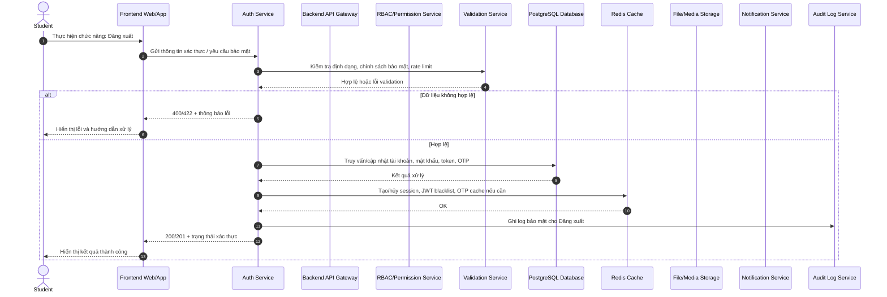

### 3. Quên mật khẩu

**Mục tiêu:** Mô tả luồng xử lý chi tiết cho chức năng **Quên mật khẩu** của đối tượng **Sinh viên**.

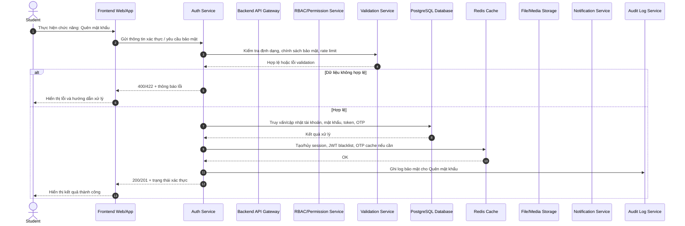

### 4. Đổi mật khẩu

**Mục tiêu:** Mô tả luồng xử lý chi tiết cho chức năng **Đổi mật khẩu** của đối tượng **Sinh viên**.

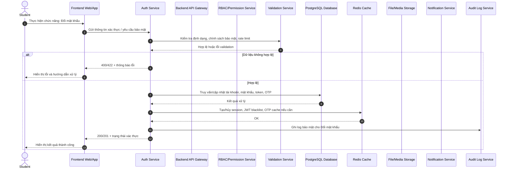

### 5. Xác thực 2 lớp

**Mục tiêu:** Mô tả luồng xử lý chi tiết cho chức năng **Xác thực 2 lớp** của đối tượng **Sinh viên**.


### 6. Xem hồ sơ cá nhân

**Mục tiêu:** Mô tả luồng xử lý chi tiết cho chức năng **Xem hồ sơ cá nhân** của đối tượng **Sinh viên**.


### 7. Cập nhật hồ sơ

**Mục tiêu:** Mô tả luồng xử lý chi tiết cho chức năng **Cập nhật hồ sơ** của đối tượng **Sinh viên**.

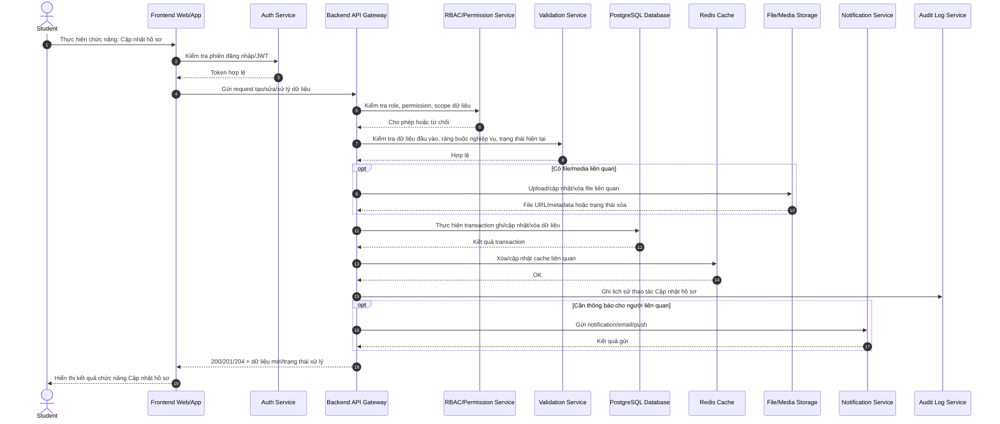

### 8. Xem lịch sử đăng nhập

**Mục tiêu:** Mô tả luồng xử lý chi tiết cho chức năng **Xem lịch sử đăng nhập** của đối tượng **Sinh viên**.

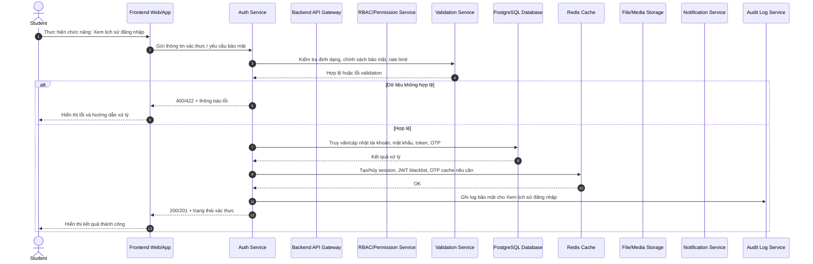

### 9. Quản lý thông báo cá nhân

**Mục tiêu:** Mô tả luồng xử lý chi tiết cho chức năng **Quản lý thông báo cá nhân** của đối tượng **Sinh viên**.

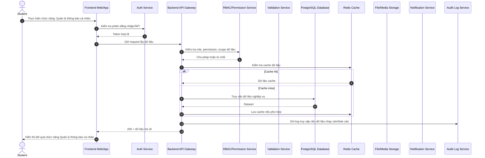

### 10. Cấu hình ngôn ngữ

**Mục tiêu:** Mô tả luồng xử lý chi tiết cho chức năng **Cấu hình ngôn ngữ** của đối tượng **Sinh viên**.

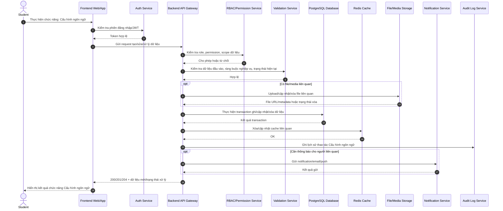

### 11. Cấu hình giao diện

**Mục tiêu:** Mô tả luồng xử lý chi tiết cho chức năng **Cấu hình giao diện** của đối tượng **Sinh viên**.


## 1.2. Khóa học / học phần

### 12. Xem danh sách học phần

**Mục tiêu:** Mô tả luồng xử lý chi tiết cho chức năng **Xem danh sách học phần** của đối tượng **Sinh viên**.

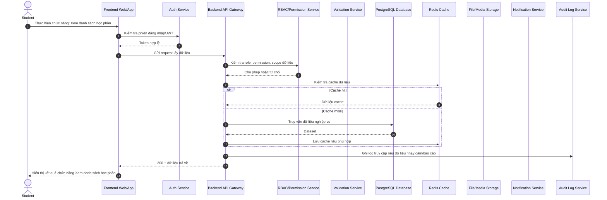

### 13. Tìm kiếm học phần

**Mục tiêu:** Mô tả luồng xử lý chi tiết cho chức năng **Tìm kiếm học phần** của đối tượng **Sinh viên**.

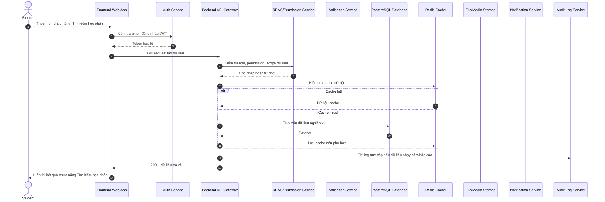

### 14. Tham gia lớp học phần

**Mục tiêu:** Mô tả luồng xử lý chi tiết cho chức năng **Tham gia lớp học phần** của đối tượng **Sinh viên**.


### 15. Xem thông tin học phần

**Mục tiêu:** Mô tả luồng xử lý chi tiết cho chức năng **Xem thông tin học phần** của đối tượng **Sinh viên**.

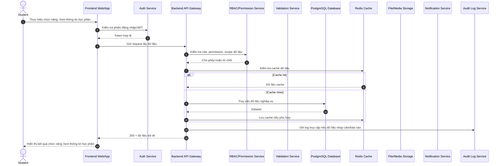

### 16. Xem giảng viên phụ trách

**Mục tiêu:** Mô tả luồng xử lý chi tiết cho chức năng **Xem giảng viên phụ trách** của đối tượng **Sinh viên**.


### 17. Xem danh sách bạn học

**Mục tiêu:** Mô tả luồng xử lý chi tiết cho chức năng **Xem danh sách bạn học** của đối tượng **Sinh viên**.

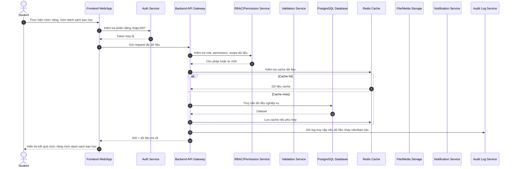

### 18. Xem tiến độ môn học

**Mục tiêu:** Mô tả luồng xử lý chi tiết cho chức năng **Xem tiến độ môn học** của đối tượng **Sinh viên**.

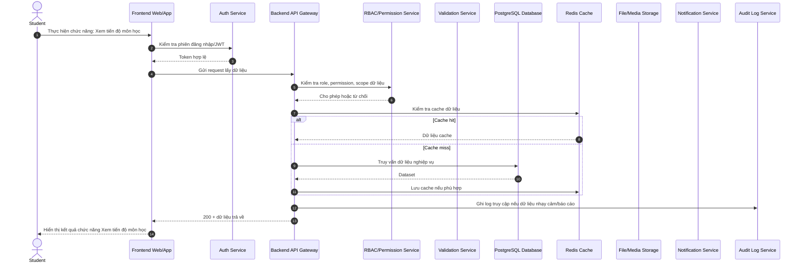

### 19. Xem điều kiện hoàn thành

**Mục tiêu:** Mô tả luồng xử lý chi tiết cho chức năng **Xem điều kiện hoàn thành** của đối tượng **Sinh viên**.

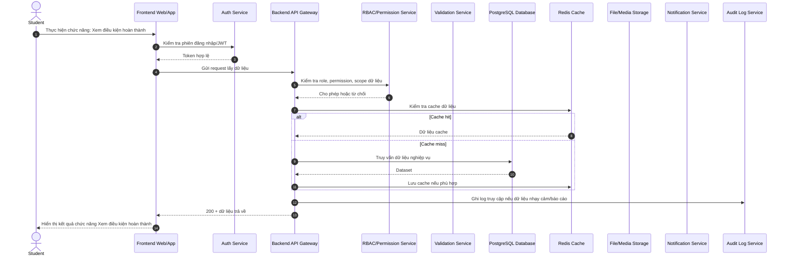

### 20. Xem môn học tiên quyết

**Mục tiêu:** Mô tả luồng xử lý chi tiết cho chức năng **Xem môn học tiên quyết** của đối tượng **Sinh viên**.

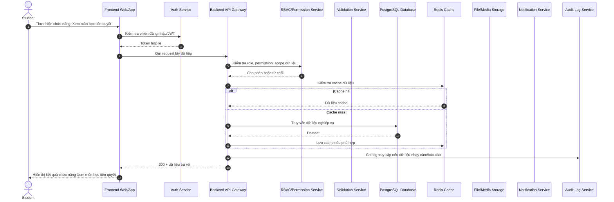

### 21. Xem trạng thái học phần

**Mục tiêu:** Mô tả luồng xử lý chi tiết cho chức năng **Xem trạng thái học phần** của đối tượng **Sinh viên**.

```mermaid
sequenceDiagram
    autonumber
    actor U as Student
    participant FE as Frontend Web/App
    participant Auth as Auth Service
    participant API as Backend API Gateway
    participant RBAC as RBAC/Permission Service
    participant Val as Validation Service
    participant DB as PostgreSQL Database
    participant Cache as Redis Cache
    participant File as File/Media Storage
    participant Notify as Notification Service
    participant Audit as Audit Log Service
    U->>FE: Thực hiện chức năng: Xem trạng thái học phần
    FE->>Auth: Kiểm tra phiên đăng nhập/JWT
    Auth-->>FE: Token hợp lệ
    FE->>API: Gửi request lấy dữ liệu
    API->>RBAC: Kiểm tra role, permission, scope dữ liệu
    RBAC-->>API: Cho phép hoặc từ chối
    API->>Cache: Kiểm tra cache dữ liệu
    alt Cache hit
        Cache-->>API: Dữ liệu cache
    else Cache miss
        API->>DB: Truy vấn dữ liệu nghiệp vụ
        DB-->>API: Dataset
        API->>Cache: Lưu cache nếu phù hợp
    end
    API->>Audit: Ghi log truy cập nếu dữ liệu nhạy cảm/báo cáo
    API-->>FE: 200 + dữ liệu trả về
    FE-->>U: Hiển thị kết quả chức năng Xem trạng thái học phần
```

## 1.3. Học liệu & bài giảng

### 22. Xem chương/buổi học

**Mục tiêu:** Mô tả luồng xử lý chi tiết cho chức năng **Xem chương/buổi học** của đối tượng **Sinh viên**.

```mermaid
sequenceDiagram
    autonumber
    actor U as Student
    participant FE as Frontend Web/App
    participant Auth as Auth Service
    participant API as Backend API Gateway
    participant RBAC as RBAC/Permission Service
    participant Val as Validation Service
    participant DB as PostgreSQL Database
    participant Cache as Redis Cache
    participant File as File/Media Storage
    participant Notify as Notification Service
    participant Audit as Audit Log Service
    U->>FE: Thực hiện chức năng: Xem chương/buổi học
    FE->>Auth: Kiểm tra phiên đăng nhập/JWT
    Auth-->>FE: Token hợp lệ
    FE->>API: Gửi request lấy dữ liệu
    API->>RBAC: Kiểm tra role, permission, scope dữ liệu
    RBAC-->>API: Cho phép hoặc từ chối
    API->>Cache: Kiểm tra cache dữ liệu
    alt Cache hit
        Cache-->>API: Dữ liệu cache
    else Cache miss
        API->>DB: Truy vấn dữ liệu nghiệp vụ
        DB-->>API: Dataset
        API->>Cache: Lưu cache nếu phù hợp
    end
    API->>Audit: Ghi log truy cập nếu dữ liệu nhạy cảm/báo cáo
    API-->>FE: 200 + dữ liệu trả về
    FE-->>U: Hiển thị kết quả chức năng Xem chương/buổi học
```

### 23. Xem bài giảng dạng text

**Mục tiêu:** Mô tả luồng xử lý chi tiết cho chức năng **Xem bài giảng dạng text** của đối tượng **Sinh viên**.

```mermaid
sequenceDiagram
    autonumber
    actor U as Student
    participant FE as Frontend Web/App
    participant Auth as Auth Service
    participant API as Backend API Gateway
    participant RBAC as RBAC/Permission Service
    participant Val as Validation Service
    participant DB as PostgreSQL Database
    participant Cache as Redis Cache
    participant File as File/Media Storage
    participant Notify as Notification Service
    participant Audit as Audit Log Service
    U->>FE: Thực hiện chức năng: Xem bài giảng dạng text
    FE->>Auth: Kiểm tra phiên đăng nhập/JWT
    Auth-->>FE: Token hợp lệ
    FE->>API: Gửi request lấy dữ liệu
    API->>RBAC: Kiểm tra role, permission, scope dữ liệu
    RBAC-->>API: Cho phép hoặc từ chối
    API->>Cache: Kiểm tra cache dữ liệu
    alt Cache hit
        Cache-->>API: Dữ liệu cache
    else Cache miss
        API->>DB: Truy vấn dữ liệu nghiệp vụ
        DB-->>API: Dataset
        API->>Cache: Lưu cache nếu phù hợp
    end
    API->>Audit: Ghi log truy cập nếu dữ liệu nhạy cảm/báo cáo
    API-->>FE: 200 + dữ liệu trả về
    FE-->>U: Hiển thị kết quả chức năng Xem bài giảng dạng text
```

### 24. Xem slide

**Mục tiêu:** Mô tả luồng xử lý chi tiết cho chức năng **Xem slide** của đối tượng **Sinh viên**.

```mermaid
sequenceDiagram
    autonumber
    actor U as Student
    participant FE as Frontend Web/App
    participant Auth as Auth Service
    participant API as Backend API Gateway
    participant RBAC as RBAC/Permission Service
    participant Val as Validation Service
    participant DB as PostgreSQL Database
    participant Cache as Redis Cache
    participant File as File/Media Storage
    participant Notify as Notification Service
    participant Audit as Audit Log Service
    U->>FE: Thực hiện chức năng: Xem slide
    FE->>Auth: Kiểm tra phiên đăng nhập/JWT
    Auth-->>FE: Token hợp lệ
    FE->>API: Gửi request lấy dữ liệu
    API->>RBAC: Kiểm tra role, permission, scope dữ liệu
    RBAC-->>API: Cho phép hoặc từ chối
    API->>Cache: Kiểm tra cache dữ liệu
    alt Cache hit
        Cache-->>API: Dữ liệu cache
    else Cache miss
        API->>DB: Truy vấn dữ liệu nghiệp vụ
        DB-->>API: Dataset
        API->>Cache: Lưu cache nếu phù hợp
    end
    API->>Audit: Ghi log truy cập nếu dữ liệu nhạy cảm/báo cáo
    API-->>FE: 200 + dữ liệu trả về
    FE-->>U: Hiển thị kết quả chức năng Xem slide
```

### 25. Xem video bài giảng

**Mục tiêu:** Mô tả luồng xử lý chi tiết cho chức năng **Xem video bài giảng** của đối tượng **Sinh viên**.

```mermaid
sequenceDiagram
    autonumber
    actor U as Student
    participant FE as Frontend Web/App
    participant Auth as Auth Service
    participant API as Backend API Gateway
    participant RBAC as RBAC/Permission Service
    participant Val as Validation Service
    participant DB as PostgreSQL Database
    participant Cache as Redis Cache
    participant File as File/Media Storage
    participant Notify as Notification Service
    participant Audit as Audit Log Service
    U->>FE: Thực hiện chức năng: Xem video bài giảng
    FE->>Auth: Kiểm tra phiên đăng nhập/JWT
    Auth-->>FE: Token hợp lệ
    FE->>API: Gửi request lấy dữ liệu
    API->>RBAC: Kiểm tra role, permission, scope dữ liệu
    RBAC-->>API: Cho phép hoặc từ chối
    API->>Cache: Kiểm tra cache dữ liệu
    alt Cache hit
        Cache-->>API: Dữ liệu cache
    else Cache miss
        API->>DB: Truy vấn dữ liệu nghiệp vụ
        DB-->>API: Dataset
        API->>Cache: Lưu cache nếu phù hợp
    end
    API->>Audit: Ghi log truy cập nếu dữ liệu nhạy cảm/báo cáo
    API-->>FE: 200 + dữ liệu trả về
    FE-->>U: Hiển thị kết quả chức năng Xem video bài giảng
```

### 26. Tải tài liệu

**Mục tiêu:** Mô tả luồng xử lý chi tiết cho chức năng **Tải tài liệu** của đối tượng **Sinh viên**.

```mermaid
sequenceDiagram
    autonumber
    actor U as Student
    participant FE as Frontend Web/App
    participant Auth as Auth Service
    participant API as Backend API Gateway
    participant RBAC as RBAC/Permission Service
    participant Val as Validation Service
    participant DB as PostgreSQL Database
    participant Cache as Redis Cache
    participant File as File/Media Storage
    participant Notify as Notification Service
    participant Audit as Audit Log Service
    U->>FE: Thực hiện chức năng: Tải tài liệu
    FE->>Auth: Kiểm tra phiên đăng nhập/JWT
    Auth-->>FE: Token hợp lệ
    FE->>API: Gửi request xuất/tải dữ liệu
    API->>RBAC: Kiểm tra quyền xem/tải/xuất dữ liệu theo phạm vi
    RBAC-->>API: Cho phép hoặc từ chối
    API->>Val: Kiểm tra bộ lọc, định dạng xuất, giới hạn dữ liệu
    Val-->>API: Hợp lệ
    API->>DB: Truy vấn dữ liệu cần xuất/tải
    DB-->>API: Dataset/metadata
    API->>File: Tạo file PDF/Excel/CSV hoặc lấy file từ storage
    File-->>API: Download URL/file stream
    API->>Audit: Ghi log tải/xuất dữ liệu
    API-->>FE: 200 + file/download URL
    FE-->>U: Tải file hoặc hiển thị dữ liệu
```

### 27. Xem tài liệu tham khảo

**Mục tiêu:** Mô tả luồng xử lý chi tiết cho chức năng **Xem tài liệu tham khảo** của đối tượng **Sinh viên**.

```mermaid
sequenceDiagram
    autonumber
    actor U as Student
    participant FE as Frontend Web/App
    participant Auth as Auth Service
    participant API as Backend API Gateway
    participant RBAC as RBAC/Permission Service
    participant Val as Validation Service
    participant DB as PostgreSQL Database
    participant Cache as Redis Cache
    participant File as File/Media Storage
    participant Notify as Notification Service
    participant Audit as Audit Log Service
    U->>FE: Thực hiện chức năng: Xem tài liệu tham khảo
    FE->>Auth: Kiểm tra phiên đăng nhập/JWT
    Auth-->>FE: Token hợp lệ
    FE->>API: Gửi request lấy dữ liệu
    API->>RBAC: Kiểm tra role, permission, scope dữ liệu
    RBAC-->>API: Cho phép hoặc từ chối
    API->>Cache: Kiểm tra cache dữ liệu
    alt Cache hit
        Cache-->>API: Dữ liệu cache
    else Cache miss
        API->>DB: Truy vấn dữ liệu nghiệp vụ
        DB-->>API: Dataset
        API->>Cache: Lưu cache nếu phù hợp
    end
    API->>Audit: Ghi log truy cập nếu dữ liệu nhạy cảm/báo cáo
    API-->>FE: 200 + dữ liệu trả về
    FE-->>U: Hiển thị kết quả chức năng Xem tài liệu tham khảo
```

### 28. Đánh dấu đã học

**Mục tiêu:** Mô tả luồng xử lý chi tiết cho chức năng **Đánh dấu đã học** của đối tượng **Sinh viên**.

```mermaid
sequenceDiagram
    autonumber
    actor U as Student
    participant FE as Frontend Web/App
    participant Auth as Auth Service
    participant API as Backend API Gateway
    participant RBAC as RBAC/Permission Service
    participant Val as Validation Service
    participant DB as PostgreSQL Database
    participant Cache as Redis Cache
    participant File as File/Media Storage
    participant Notify as Notification Service
    participant Audit as Audit Log Service
    U->>FE: Thực hiện chức năng: Đánh dấu đã học
    FE->>Auth: Kiểm tra phiên đăng nhập/JWT
    Auth-->>FE: Token hợp lệ
    FE->>API: Gửi request tạo/sửa/xử lý dữ liệu
    API->>RBAC: Kiểm tra role, permission, scope dữ liệu
    RBAC-->>API: Cho phép hoặc từ chối
    API->>Val: Kiểm tra dữ liệu đầu vào, ràng buộc nghiệp vụ, trạng thái hiện tại
    Val-->>API: Hợp lệ
    opt Có file/media liên quan
        API->>File: Upload/cập nhật/xóa file liên quan
        File-->>API: File URL/metadata hoặc trạng thái xóa
    end
    API->>DB: Thực hiện transaction ghi/cập nhật/xóa dữ liệu
    DB-->>API: Kết quả transaction
    API->>Cache: Xóa/cập nhật cache liên quan
    Cache-->>API: OK
    API->>Audit: Ghi lịch sử thao tác Đánh dấu đã học
    opt Cần thông báo cho người liên quan
        API->>Notify: Gửi notification/email/push
        Notify-->>API: Kết quả gửi
    end
    API-->>FE: 200/201/204 + dữ liệu mới/trạng thái xử lý
    FE-->>U: Hiển thị kết quả chức năng Đánh dấu đã học
```

### 29. Bookmark bài học

**Mục tiêu:** Mô tả luồng xử lý chi tiết cho chức năng **Bookmark bài học** của đối tượng **Sinh viên**.

```mermaid
sequenceDiagram
    autonumber
    actor U as Student
    participant FE as Frontend Web/App
    participant Auth as Auth Service
    participant API as Backend API Gateway
    participant RBAC as RBAC/Permission Service
    participant Val as Validation Service
    participant DB as PostgreSQL Database
    participant Cache as Redis Cache
    participant File as File/Media Storage
    participant Notify as Notification Service
    participant Audit as Audit Log Service
    U->>FE: Thực hiện chức năng: Bookmark bài học
    FE->>Auth: Kiểm tra phiên đăng nhập/JWT
    Auth-->>FE: Token hợp lệ
    FE->>API: Gửi request tạo/sửa/xử lý dữ liệu
    API->>RBAC: Kiểm tra role, permission, scope dữ liệu
    RBAC-->>API: Cho phép hoặc từ chối
    API->>Val: Kiểm tra dữ liệu đầu vào, ràng buộc nghiệp vụ, trạng thái hiện tại
    Val-->>API: Hợp lệ
    opt Có file/media liên quan
        API->>File: Upload/cập nhật/xóa file liên quan
        File-->>API: File URL/metadata hoặc trạng thái xóa
    end
    API->>DB: Thực hiện transaction ghi/cập nhật/xóa dữ liệu
    DB-->>API: Kết quả transaction
    API->>Cache: Xóa/cập nhật cache liên quan
    Cache-->>API: OK
    API->>Audit: Ghi lịch sử thao tác Bookmark bài học
    opt Cần thông báo cho người liên quan
        API->>Notify: Gửi notification/email/push
        Notify-->>API: Kết quả gửi
    end
    API-->>FE: 200/201/204 + dữ liệu mới/trạng thái xử lý
    FE-->>U: Hiển thị kết quả chức năng Bookmark bài học
```

### 30. Ghi chú cá nhân

**Mục tiêu:** Mô tả luồng xử lý chi tiết cho chức năng **Ghi chú cá nhân** của đối tượng **Sinh viên**.

```mermaid
sequenceDiagram
    autonumber
    actor U as Student
    participant FE as Frontend Web/App
    participant Auth as Auth Service
    participant API as Backend API Gateway
    participant RBAC as RBAC/Permission Service
    participant Val as Validation Service
    participant DB as PostgreSQL Database
    participant Cache as Redis Cache
    participant File as File/Media Storage
    participant Notify as Notification Service
    participant Audit as Audit Log Service
    U->>FE: Thực hiện chức năng: Ghi chú cá nhân
    FE->>Auth: Kiểm tra phiên đăng nhập/JWT
    Auth-->>FE: Token hợp lệ
    FE->>API: Gửi request tạo/sửa/xử lý dữ liệu
    API->>RBAC: Kiểm tra role, permission, scope dữ liệu
    RBAC-->>API: Cho phép hoặc từ chối
    API->>Val: Kiểm tra dữ liệu đầu vào, ràng buộc nghiệp vụ, trạng thái hiện tại
    Val-->>API: Hợp lệ
    opt Có file/media liên quan
        API->>File: Upload/cập nhật/xóa file liên quan
        File-->>API: File URL/metadata hoặc trạng thái xóa
    end
    API->>DB: Thực hiện transaction ghi/cập nhật/xóa dữ liệu
    DB-->>API: Kết quả transaction
    API->>Cache: Xóa/cập nhật cache liên quan
    Cache-->>API: OK
    API->>Audit: Ghi lịch sử thao tác Ghi chú cá nhân
    opt Cần thông báo cho người liên quan
        API->>Notify: Gửi notification/email/push
        Notify-->>API: Kết quả gửi
    end
    API-->>FE: 200/201/204 + dữ liệu mới/trạng thái xử lý
    FE-->>U: Hiển thị kết quả chức năng Ghi chú cá nhân
```

### 31. Tìm kiếm trong khóa học

**Mục tiêu:** Mô tả luồng xử lý chi tiết cho chức năng **Tìm kiếm trong khóa học** của đối tượng **Sinh viên**.

```mermaid
sequenceDiagram
    autonumber
    actor U as Student
    participant FE as Frontend Web/App
    participant Auth as Auth Service
    participant API as Backend API Gateway
    participant RBAC as RBAC/Permission Service
    participant Val as Validation Service
    participant DB as PostgreSQL Database
    participant Cache as Redis Cache
    participant File as File/Media Storage
    participant Notify as Notification Service
    participant Audit as Audit Log Service
    U->>FE: Thực hiện chức năng: Tìm kiếm trong khóa học
    FE->>Auth: Kiểm tra phiên đăng nhập/JWT
    Auth-->>FE: Token hợp lệ
    FE->>API: Gửi request tạo/sửa/xử lý dữ liệu
    API->>RBAC: Kiểm tra role, permission, scope dữ liệu
    RBAC-->>API: Cho phép hoặc từ chối
    API->>Val: Kiểm tra dữ liệu đầu vào, ràng buộc nghiệp vụ, trạng thái hiện tại
    Val-->>API: Hợp lệ
    opt Có file/media liên quan
        API->>File: Upload/cập nhật/xóa file liên quan
        File-->>API: File URL/metadata hoặc trạng thái xóa
    end
    API->>DB: Thực hiện transaction ghi/cập nhật/xóa dữ liệu
    DB-->>API: Kết quả transaction
    API->>Cache: Xóa/cập nhật cache liên quan
    Cache-->>API: OK
    API->>Audit: Ghi lịch sử thao tác Tìm kiếm trong khóa học
    opt Cần thông báo cho người liên quan
        API->>Notify: Gửi notification/email/push
        Notify-->>API: Kết quả gửi
    end
    API-->>FE: 200/201/204 + dữ liệu mới/trạng thái xử lý
    FE-->>U: Hiển thị kết quả chức năng Tìm kiếm trong khóa học
```

### 32. Học theo điều kiện

**Mục tiêu:** Mô tả luồng xử lý chi tiết cho chức năng **Học theo điều kiện** của đối tượng **Sinh viên**.

```mermaid
sequenceDiagram
    autonumber
    actor U as Student
    participant FE as Frontend Web/App
    participant Auth as Auth Service
    participant API as Backend API Gateway
    participant RBAC as RBAC/Permission Service
    participant Val as Validation Service
    participant DB as PostgreSQL Database
    participant Cache as Redis Cache
    participant File as File/Media Storage
    participant Notify as Notification Service
    participant Audit as Audit Log Service
    U->>FE: Thực hiện chức năng: Học theo điều kiện
    FE->>Auth: Kiểm tra phiên đăng nhập/JWT
    Auth-->>FE: Token hợp lệ
    FE->>API: Gửi request lấy dữ liệu
    API->>RBAC: Kiểm tra role, permission, scope dữ liệu
    RBAC-->>API: Cho phép hoặc từ chối
    API->>Cache: Kiểm tra cache dữ liệu
    alt Cache hit
        Cache-->>API: Dữ liệu cache
    else Cache miss
        API->>DB: Truy vấn dữ liệu nghiệp vụ
        DB-->>API: Dataset
        API->>Cache: Lưu cache nếu phù hợp
    end
    API->>Audit: Ghi log truy cập nếu dữ liệu nhạy cảm/báo cáo
    API-->>FE: 200 + dữ liệu trả về
    FE-->>U: Hiển thị kết quả chức năng Học theo điều kiện
```

### 33. Xem lịch sử học tập

**Mục tiêu:** Mô tả luồng xử lý chi tiết cho chức năng **Xem lịch sử học tập** của đối tượng **Sinh viên**.

```mermaid
sequenceDiagram
    autonumber
    actor U as Student
    participant FE as Frontend Web/App
    participant Auth as Auth Service
    participant API as Backend API Gateway
    participant RBAC as RBAC/Permission Service
    participant Val as Validation Service
    participant DB as PostgreSQL Database
    participant Cache as Redis Cache
    participant File as File/Media Storage
    participant Notify as Notification Service
    participant Audit as Audit Log Service
    U->>FE: Thực hiện chức năng: Xem lịch sử học tập
    FE->>Auth: Kiểm tra phiên đăng nhập/JWT
    Auth-->>FE: Token hợp lệ
    FE->>API: Gửi request lấy dữ liệu
    API->>RBAC: Kiểm tra role, permission, scope dữ liệu
    RBAC-->>API: Cho phép hoặc từ chối
    API->>Cache: Kiểm tra cache dữ liệu
    alt Cache hit
        Cache-->>API: Dữ liệu cache
    else Cache miss
        API->>DB: Truy vấn dữ liệu nghiệp vụ
        DB-->>API: Dataset
        API->>Cache: Lưu cache nếu phù hợp
    end
    API->>Audit: Ghi log truy cập nếu dữ liệu nhạy cảm/báo cáo
    API-->>FE: 200 + dữ liệu trả về
    FE-->>U: Hiển thị kết quả chức năng Xem lịch sử học tập
```

### 34. Tiếp tục học

**Mục tiêu:** Mô tả luồng xử lý chi tiết cho chức năng **Tiếp tục học** của đối tượng **Sinh viên**.

```mermaid
sequenceDiagram
    autonumber
    actor U as Student
    participant FE as Frontend Web/App
    participant Auth as Auth Service
    participant API as Backend API Gateway
    participant RBAC as RBAC/Permission Service
    participant Val as Validation Service
    participant DB as PostgreSQL Database
    participant Cache as Redis Cache
    participant File as File/Media Storage
    participant Notify as Notification Service
    participant Audit as Audit Log Service
    U->>FE: Thực hiện chức năng: Tiếp tục học
    FE->>Auth: Kiểm tra phiên đăng nhập/JWT
    Auth-->>FE: Token hợp lệ
    FE->>API: Gửi request lấy dữ liệu
    API->>RBAC: Kiểm tra role, permission, scope dữ liệu
    RBAC-->>API: Cho phép hoặc từ chối
    API->>Cache: Kiểm tra cache dữ liệu
    alt Cache hit
        Cache-->>API: Dữ liệu cache
    else Cache miss
        API->>DB: Truy vấn dữ liệu nghiệp vụ
        DB-->>API: Dataset
        API->>Cache: Lưu cache nếu phù hợp
    end
    API->>Audit: Ghi log truy cập nếu dữ liệu nhạy cảm/báo cáo
    API-->>FE: 200 + dữ liệu trả về
    FE-->>U: Hiển thị kết quả chức năng Tiếp tục học
```

### 35. Đánh giá bài học

**Mục tiêu:** Mô tả luồng xử lý chi tiết cho chức năng **Đánh giá bài học** của đối tượng **Sinh viên**.

```mermaid
sequenceDiagram
    autonumber
    actor U as Student
    participant FE as Frontend Web/App
    participant Auth as Auth Service
    participant API as Backend API Gateway
    participant RBAC as RBAC/Permission Service
    participant Val as Validation Service
    participant DB as PostgreSQL Database
    participant Cache as Redis Cache
    participant File as File/Media Storage
    participant Notify as Notification Service
    participant Audit as Audit Log Service
    U->>FE: Thực hiện chức năng: Đánh giá bài học
    FE->>Auth: Kiểm tra phiên đăng nhập/JWT
    Auth-->>FE: Token hợp lệ
    FE->>API: Gửi request lấy dữ liệu
    API->>RBAC: Kiểm tra role, permission, scope dữ liệu
    RBAC-->>API: Cho phép hoặc từ chối
    API->>Cache: Kiểm tra cache dữ liệu
    alt Cache hit
        Cache-->>API: Dữ liệu cache
    else Cache miss
        API->>DB: Truy vấn dữ liệu nghiệp vụ
        DB-->>API: Dataset
        API->>Cache: Lưu cache nếu phù hợp
    end
    API->>Audit: Ghi log truy cập nếu dữ liệu nhạy cảm/báo cáo
    API-->>FE: 200 + dữ liệu trả về
    FE-->>U: Hiển thị kết quả chức năng Đánh giá bài học
```

## 1.4. Bài tập

### 36. Xem danh sách bài tập

**Mục tiêu:** Mô tả luồng xử lý chi tiết cho chức năng **Xem danh sách bài tập** của đối tượng **Sinh viên**.

```mermaid
sequenceDiagram
    autonumber
    actor U as Student
    participant FE as Frontend Web/App
    participant Auth as Auth Service
    participant API as Backend API Gateway
    participant RBAC as RBAC/Permission Service
    participant Val as Validation Service
    participant DB as PostgreSQL Database
    participant Cache as Redis Cache
    participant File as File/Media Storage
    participant Notify as Notification Service
    participant Audit as Audit Log Service
    U->>FE: Thực hiện chức năng: Xem danh sách bài tập
    FE->>Auth: Kiểm tra phiên đăng nhập/JWT
    Auth-->>FE: Token hợp lệ
    FE->>API: Gửi request lấy dữ liệu
    API->>RBAC: Kiểm tra role, permission, scope dữ liệu
    RBAC-->>API: Cho phép hoặc từ chối
    API->>Cache: Kiểm tra cache dữ liệu
    alt Cache hit
        Cache-->>API: Dữ liệu cache
    else Cache miss
        API->>DB: Truy vấn dữ liệu nghiệp vụ
        DB-->>API: Dataset
        API->>Cache: Lưu cache nếu phù hợp
    end
    API->>Audit: Ghi log truy cập nếu dữ liệu nhạy cảm/báo cáo
    API-->>FE: 200 + dữ liệu trả về
    FE-->>U: Hiển thị kết quả chức năng Xem danh sách bài tập
```

### 37. Xem chi tiết bài tập

**Mục tiêu:** Mô tả luồng xử lý chi tiết cho chức năng **Xem chi tiết bài tập** của đối tượng **Sinh viên**.

```mermaid
sequenceDiagram
    autonumber
    actor U as Student
    participant FE as Frontend Web/App
    participant Auth as Auth Service
    participant API as Backend API Gateway
    participant RBAC as RBAC/Permission Service
    participant Val as Validation Service
    participant DB as PostgreSQL Database
    participant Cache as Redis Cache
    participant File as File/Media Storage
    participant Notify as Notification Service
    participant Audit as Audit Log Service
    U->>FE: Thực hiện chức năng: Xem chi tiết bài tập
    FE->>Auth: Kiểm tra phiên đăng nhập/JWT
    Auth-->>FE: Token hợp lệ
    FE->>API: Gửi request lấy dữ liệu
    API->>RBAC: Kiểm tra role, permission, scope dữ liệu
    RBAC-->>API: Cho phép hoặc từ chối
    API->>Cache: Kiểm tra cache dữ liệu
    alt Cache hit
        Cache-->>API: Dữ liệu cache
    else Cache miss
        API->>DB: Truy vấn dữ liệu nghiệp vụ
        DB-->>API: Dataset
        API->>Cache: Lưu cache nếu phù hợp
    end
    API->>Audit: Ghi log truy cập nếu dữ liệu nhạy cảm/báo cáo
    API-->>FE: 200 + dữ liệu trả về
    FE-->>U: Hiển thị kết quả chức năng Xem chi tiết bài tập
```

### 38. Tải đề bài

**Mục tiêu:** Mô tả luồng xử lý chi tiết cho chức năng **Tải đề bài** của đối tượng **Sinh viên**.

```mermaid
sequenceDiagram
    autonumber
    actor U as Student
    participant FE as Frontend Web/App
    participant Auth as Auth Service
    participant API as Backend API Gateway
    participant RBAC as RBAC/Permission Service
    participant Val as Validation Service
    participant DB as PostgreSQL Database
    participant Cache as Redis Cache
    participant File as File/Media Storage
    participant Notify as Notification Service
    participant Audit as Audit Log Service
    U->>FE: Thực hiện chức năng: Tải đề bài
    FE->>Auth: Kiểm tra phiên đăng nhập/JWT
    Auth-->>FE: Token hợp lệ
    FE->>API: Gửi request xuất/tải dữ liệu
    API->>RBAC: Kiểm tra quyền xem/tải/xuất dữ liệu theo phạm vi
    RBAC-->>API: Cho phép hoặc từ chối
    API->>Val: Kiểm tra bộ lọc, định dạng xuất, giới hạn dữ liệu
    Val-->>API: Hợp lệ
    API->>DB: Truy vấn dữ liệu cần xuất/tải
    DB-->>API: Dataset/metadata
    API->>File: Tạo file PDF/Excel/CSV hoặc lấy file từ storage
    File-->>API: Download URL/file stream
    API->>Audit: Ghi log tải/xuất dữ liệu
    API-->>FE: 200 + file/download URL
    FE-->>U: Tải file hoặc hiển thị dữ liệu
```

### 39. Nộp bài dạng file

**Mục tiêu:** Mô tả luồng xử lý chi tiết cho chức năng **Nộp bài dạng file** của đối tượng **Sinh viên**.

```mermaid
sequenceDiagram
    autonumber
    actor U as Student
    participant FE as Frontend Web/App
    participant Auth as Auth Service
    participant API as Backend API Gateway
    participant RBAC as RBAC/Permission Service
    participant Val as Validation Service
    participant DB as PostgreSQL Database
    participant Cache as Redis Cache
    participant File as File/Media Storage
    participant Notify as Notification Service
    participant Audit as Audit Log Service
    U->>FE: Thực hiện chức năng: Nộp bài dạng file
    FE->>Auth: Kiểm tra phiên đăng nhập/JWT
    Auth-->>FE: Token hợp lệ
    FE->>API: Gửi request kèm metadata/file/link/text
    API->>RBAC: Kiểm tra quyền nộp trong lớp học phần/nhóm
    RBAC-->>API: Cho phép hoặc từ chối
    API->>Val: Kiểm tra deadline, định dạng file, dung lượng, số lần nộp
    Val-->>API: Hợp lệ
    opt Có file đính kèm
        API->>File: Upload file lên storage
        File-->>API: File URL, checksum, metadata
    end
    API->>DB: Tạo/cập nhật bản ghi bài nộp, trạng thái, thời gian nộp
    DB-->>API: Submission ID/trạng thái
    API->>Audit: Ghi log nộp bài và metadata quan trọng
    API->>Notify: Thông báo cho giảng viên/sinh viên nếu cần
    API-->>FE: 200/201 + trạng thái bài nộp
    FE-->>U: Hiển thị xác nhận hoàn tất Nộp bài dạng file
```

### 40. Nộp bài dạng text

**Mục tiêu:** Mô tả luồng xử lý chi tiết cho chức năng **Nộp bài dạng text** của đối tượng **Sinh viên**.

```mermaid
sequenceDiagram
    autonumber
    actor U as Student
    participant FE as Frontend Web/App
    participant Auth as Auth Service
    participant API as Backend API Gateway
    participant RBAC as RBAC/Permission Service
    participant Val as Validation Service
    participant DB as PostgreSQL Database
    participant Cache as Redis Cache
    participant File as File/Media Storage
    participant Notify as Notification Service
    participant Audit as Audit Log Service
    U->>FE: Thực hiện chức năng: Nộp bài dạng text
    FE->>Auth: Kiểm tra phiên đăng nhập/JWT
    Auth-->>FE: Token hợp lệ
    FE->>API: Gửi request kèm metadata/file/link/text
    API->>RBAC: Kiểm tra quyền nộp trong lớp học phần/nhóm
    RBAC-->>API: Cho phép hoặc từ chối
    API->>Val: Kiểm tra deadline, định dạng file, dung lượng, số lần nộp
    Val-->>API: Hợp lệ
    opt Có file đính kèm
        API->>File: Upload file lên storage
        File-->>API: File URL, checksum, metadata
    end
    API->>DB: Tạo/cập nhật bản ghi bài nộp, trạng thái, thời gian nộp
    DB-->>API: Submission ID/trạng thái
    API->>Audit: Ghi log nộp bài và metadata quan trọng
    API->>Notify: Thông báo cho giảng viên/sinh viên nếu cần
    API-->>FE: 200/201 + trạng thái bài nộp
    FE-->>U: Hiển thị xác nhận hoàn tất Nộp bài dạng text
```

### 41. Nộp bài dạng link

**Mục tiêu:** Mô tả luồng xử lý chi tiết cho chức năng **Nộp bài dạng link** của đối tượng **Sinh viên**.

```mermaid
sequenceDiagram
    autonumber
    actor U as Student
    participant FE as Frontend Web/App
    participant Auth as Auth Service
    participant API as Backend API Gateway
    participant RBAC as RBAC/Permission Service
    participant Val as Validation Service
    participant DB as PostgreSQL Database
    participant Cache as Redis Cache
    participant File as File/Media Storage
    participant Notify as Notification Service
    participant Audit as Audit Log Service
    U->>FE: Thực hiện chức năng: Nộp bài dạng link
    FE->>Auth: Kiểm tra phiên đăng nhập/JWT
    Auth-->>FE: Token hợp lệ
    FE->>API: Gửi request kèm metadata/file/link/text
    API->>RBAC: Kiểm tra quyền nộp trong lớp học phần/nhóm
    RBAC-->>API: Cho phép hoặc từ chối
    API->>Val: Kiểm tra deadline, định dạng file, dung lượng, số lần nộp
    Val-->>API: Hợp lệ
    opt Có file đính kèm
        API->>File: Upload file lên storage
        File-->>API: File URL, checksum, metadata
    end
    API->>DB: Tạo/cập nhật bản ghi bài nộp, trạng thái, thời gian nộp
    DB-->>API: Submission ID/trạng thái
    API->>Audit: Ghi log nộp bài và metadata quan trọng
    API->>Notify: Thông báo cho giảng viên/sinh viên nếu cần
    API-->>FE: 200/201 + trạng thái bài nộp
    FE-->>U: Hiển thị xác nhận hoàn tất Nộp bài dạng link
```

### 42. Nộp bài nhóm

**Mục tiêu:** Mô tả luồng xử lý chi tiết cho chức năng **Nộp bài nhóm** của đối tượng **Sinh viên**.

```mermaid
sequenceDiagram
    autonumber
    actor U as Student
    participant FE as Frontend Web/App
    participant Auth as Auth Service
    participant API as Backend API Gateway
    participant RBAC as RBAC/Permission Service
    participant Val as Validation Service
    participant DB as PostgreSQL Database
    participant Cache as Redis Cache
    participant File as File/Media Storage
    participant Notify as Notification Service
    participant Audit as Audit Log Service
    U->>FE: Thực hiện chức năng: Nộp bài nhóm
    FE->>Auth: Kiểm tra phiên đăng nhập/JWT
    Auth-->>FE: Token hợp lệ
    FE->>API: Gửi request kèm metadata/file/link/text
    API->>RBAC: Kiểm tra quyền nộp trong lớp học phần/nhóm
    RBAC-->>API: Cho phép hoặc từ chối
    API->>Val: Kiểm tra deadline, định dạng file, dung lượng, số lần nộp
    Val-->>API: Hợp lệ
    opt Có file đính kèm
        API->>File: Upload file lên storage
        File-->>API: File URL, checksum, metadata
    end
    API->>DB: Tạo/cập nhật bản ghi bài nộp, trạng thái, thời gian nộp
    DB-->>API: Submission ID/trạng thái
    API->>Audit: Ghi log nộp bài và metadata quan trọng
    API->>Notify: Thông báo cho giảng viên/sinh viên nếu cần
    API-->>FE: 200/201 + trạng thái bài nộp
    FE-->>U: Hiển thị xác nhận hoàn tất Nộp bài nhóm
```

### 43. Sửa bài đã nộp

**Mục tiêu:** Mô tả luồng xử lý chi tiết cho chức năng **Sửa bài đã nộp** của đối tượng **Sinh viên**.

```mermaid
sequenceDiagram
    autonumber
    actor U as Student
    participant FE as Frontend Web/App
    participant Auth as Auth Service
    participant API as Backend API Gateway
    participant RBAC as RBAC/Permission Service
    participant Val as Validation Service
    participant DB as PostgreSQL Database
    participant Cache as Redis Cache
    participant File as File/Media Storage
    participant Notify as Notification Service
    participant Audit as Audit Log Service
    U->>FE: Thực hiện chức năng: Sửa bài đã nộp
    FE->>Auth: Kiểm tra phiên đăng nhập/JWT
    Auth-->>FE: Token hợp lệ
    FE->>API: Gửi request tạo/sửa/xử lý dữ liệu
    API->>RBAC: Kiểm tra role, permission, scope dữ liệu
    RBAC-->>API: Cho phép hoặc từ chối
    API->>Val: Kiểm tra dữ liệu đầu vào, ràng buộc nghiệp vụ, trạng thái hiện tại
    Val-->>API: Hợp lệ
    opt Có file/media liên quan
        API->>File: Upload/cập nhật/xóa file liên quan
        File-->>API: File URL/metadata hoặc trạng thái xóa
    end
    API->>DB: Thực hiện transaction ghi/cập nhật/xóa dữ liệu
    DB-->>API: Kết quả transaction
    API->>Cache: Xóa/cập nhật cache liên quan
    Cache-->>API: OK
    API->>Audit: Ghi lịch sử thao tác Sửa bài đã nộp
    opt Cần thông báo cho người liên quan
        API->>Notify: Gửi notification/email/push
        Notify-->>API: Kết quả gửi
    end
    API-->>FE: 200/201/204 + dữ liệu mới/trạng thái xử lý
    FE-->>U: Hiển thị kết quả chức năng Sửa bài đã nộp
```

### 44. Xóa bài nộp

**Mục tiêu:** Mô tả luồng xử lý chi tiết cho chức năng **Xóa bài nộp** của đối tượng **Sinh viên**.

```mermaid
sequenceDiagram
    autonumber
    actor U as Student
    participant FE as Frontend Web/App
    participant Auth as Auth Service
    participant API as Backend API Gateway
    participant RBAC as RBAC/Permission Service
    participant Val as Validation Service
    participant DB as PostgreSQL Database
    participant Cache as Redis Cache
    participant File as File/Media Storage
    participant Notify as Notification Service
    participant Audit as Audit Log Service
    U->>FE: Thực hiện chức năng: Xóa bài nộp
    FE->>Auth: Kiểm tra phiên đăng nhập/JWT
    Auth-->>FE: Token hợp lệ
    FE->>API: Gửi request tạo/sửa/xử lý dữ liệu
    API->>RBAC: Kiểm tra role, permission, scope dữ liệu
    RBAC-->>API: Cho phép hoặc từ chối
    API->>Val: Kiểm tra dữ liệu đầu vào, ràng buộc nghiệp vụ, trạng thái hiện tại
    Val-->>API: Hợp lệ
    opt Có file/media liên quan
        API->>File: Upload/cập nhật/xóa file liên quan
        File-->>API: File URL/metadata hoặc trạng thái xóa
    end
    API->>DB: Thực hiện transaction ghi/cập nhật/xóa dữ liệu
    DB-->>API: Kết quả transaction
    API->>Cache: Xóa/cập nhật cache liên quan
    Cache-->>API: OK
    API->>Audit: Ghi lịch sử thao tác Xóa bài nộp
    opt Cần thông báo cho người liên quan
        API->>Notify: Gửi notification/email/push
        Notify-->>API: Kết quả gửi
    end
    API-->>FE: 200/201/204 + dữ liệu mới/trạng thái xử lý
    FE-->>U: Hiển thị kết quả chức năng Xóa bài nộp
```

### 45. Xem trạng thái bài nộp

**Mục tiêu:** Mô tả luồng xử lý chi tiết cho chức năng **Xem trạng thái bài nộp** của đối tượng **Sinh viên**.

```mermaid
sequenceDiagram
    autonumber
    actor U as Student
    participant FE as Frontend Web/App
    participant Auth as Auth Service
    participant API as Backend API Gateway
    participant RBAC as RBAC/Permission Service
    participant Val as Validation Service
    participant DB as PostgreSQL Database
    participant Cache as Redis Cache
    participant File as File/Media Storage
    participant Notify as Notification Service
    participant Audit as Audit Log Service
    U->>FE: Thực hiện chức năng: Xem trạng thái bài nộp
    FE->>Auth: Kiểm tra phiên đăng nhập/JWT
    Auth-->>FE: Token hợp lệ
    FE->>API: Gửi request lấy dữ liệu
    API->>RBAC: Kiểm tra role, permission, scope dữ liệu
    RBAC-->>API: Cho phép hoặc từ chối
    API->>Cache: Kiểm tra cache dữ liệu
    alt Cache hit
        Cache-->>API: Dữ liệu cache
    else Cache miss
        API->>DB: Truy vấn dữ liệu nghiệp vụ
        DB-->>API: Dataset
        API->>Cache: Lưu cache nếu phù hợp
    end
    API->>Audit: Ghi log truy cập nếu dữ liệu nhạy cảm/báo cáo
    API-->>FE: 200 + dữ liệu trả về
    FE-->>U: Hiển thị kết quả chức năng Xem trạng thái bài nộp
```

### 46. Xem thời gian nộp

**Mục tiêu:** Mô tả luồng xử lý chi tiết cho chức năng **Xem thời gian nộp** của đối tượng **Sinh viên**.

```mermaid
sequenceDiagram
    autonumber
    actor U as Student
    participant FE as Frontend Web/App
    participant Auth as Auth Service
    participant API as Backend API Gateway
    participant RBAC as RBAC/Permission Service
    participant Val as Validation Service
    participant DB as PostgreSQL Database
    participant Cache as Redis Cache
    participant File as File/Media Storage
    participant Notify as Notification Service
    participant Audit as Audit Log Service
    U->>FE: Thực hiện chức năng: Xem thời gian nộp
    FE->>Auth: Kiểm tra phiên đăng nhập/JWT
    Auth-->>FE: Token hợp lệ
    FE->>API: Gửi request lấy dữ liệu
    API->>RBAC: Kiểm tra role, permission, scope dữ liệu
    RBAC-->>API: Cho phép hoặc từ chối
    API->>Cache: Kiểm tra cache dữ liệu
    alt Cache hit
        Cache-->>API: Dữ liệu cache
    else Cache miss
        API->>DB: Truy vấn dữ liệu nghiệp vụ
        DB-->>API: Dataset
        API->>Cache: Lưu cache nếu phù hợp
    end
    API->>Audit: Ghi log truy cập nếu dữ liệu nhạy cảm/báo cáo
    API-->>FE: 200 + dữ liệu trả về
    FE-->>U: Hiển thị kết quả chức năng Xem thời gian nộp
```

### 47. Xem bài nộp muộn

**Mục tiêu:** Mô tả luồng xử lý chi tiết cho chức năng **Xem bài nộp muộn** của đối tượng **Sinh viên**.

```mermaid
sequenceDiagram
    autonumber
    actor U as Student
    participant FE as Frontend Web/App
    participant Auth as Auth Service
    participant API as Backend API Gateway
    participant RBAC as RBAC/Permission Service
    participant Val as Validation Service
    participant DB as PostgreSQL Database
    participant Cache as Redis Cache
    participant File as File/Media Storage
    participant Notify as Notification Service
    participant Audit as Audit Log Service
    U->>FE: Thực hiện chức năng: Xem bài nộp muộn
    FE->>Auth: Kiểm tra phiên đăng nhập/JWT
    Auth-->>FE: Token hợp lệ
    FE->>API: Gửi request lấy dữ liệu
    API->>RBAC: Kiểm tra role, permission, scope dữ liệu
    RBAC-->>API: Cho phép hoặc từ chối
    API->>Cache: Kiểm tra cache dữ liệu
    alt Cache hit
        Cache-->>API: Dữ liệu cache
    else Cache miss
        API->>DB: Truy vấn dữ liệu nghiệp vụ
        DB-->>API: Dataset
        API->>Cache: Lưu cache nếu phù hợp
    end
    API->>Audit: Ghi log truy cập nếu dữ liệu nhạy cảm/báo cáo
    API-->>FE: 200 + dữ liệu trả về
    FE-->>U: Hiển thị kết quả chức năng Xem bài nộp muộn
```

### 48. Xem điểm bài tập

**Mục tiêu:** Mô tả luồng xử lý chi tiết cho chức năng **Xem điểm bài tập** của đối tượng **Sinh viên**.

```mermaid
sequenceDiagram
    autonumber
    actor U as Student
    participant FE as Frontend Web/App
    participant Auth as Auth Service
    participant API as Backend API Gateway
    participant RBAC as RBAC/Permission Service
    participant Val as Validation Service
    participant DB as PostgreSQL Database
    participant Cache as Redis Cache
    participant File as File/Media Storage
    participant Notify as Notification Service
    participant Audit as Audit Log Service
    U->>FE: Thực hiện chức năng: Xem điểm bài tập
    FE->>Auth: Kiểm tra phiên đăng nhập/JWT
    Auth-->>FE: Token hợp lệ
    FE->>API: Gửi request lấy dữ liệu
    API->>RBAC: Kiểm tra role, permission, scope dữ liệu
    RBAC-->>API: Cho phép hoặc từ chối
    API->>Cache: Kiểm tra cache dữ liệu
    alt Cache hit
        Cache-->>API: Dữ liệu cache
    else Cache miss
        API->>DB: Truy vấn dữ liệu nghiệp vụ
        DB-->>API: Dataset
        API->>Cache: Lưu cache nếu phù hợp
    end
    API->>Audit: Ghi log truy cập nếu dữ liệu nhạy cảm/báo cáo
    API-->>FE: 200 + dữ liệu trả về
    FE-->>U: Hiển thị kết quả chức năng Xem điểm bài tập
```

### 49. Xem nhận xét

**Mục tiêu:** Mô tả luồng xử lý chi tiết cho chức năng **Xem nhận xét** của đối tượng **Sinh viên**.

```mermaid
sequenceDiagram
    autonumber
    actor U as Student
    participant FE as Frontend Web/App
    participant Auth as Auth Service
    participant API as Backend API Gateway
    participant RBAC as RBAC/Permission Service
    participant Val as Validation Service
    participant DB as PostgreSQL Database
    participant Cache as Redis Cache
    participant File as File/Media Storage
    participant Notify as Notification Service
    participant Audit as Audit Log Service
    U->>FE: Thực hiện chức năng: Xem nhận xét
    FE->>Auth: Kiểm tra phiên đăng nhập/JWT
    Auth-->>FE: Token hợp lệ
    FE->>API: Gửi request lấy dữ liệu
    API->>RBAC: Kiểm tra role, permission, scope dữ liệu
    RBAC-->>API: Cho phép hoặc từ chối
    API->>Cache: Kiểm tra cache dữ liệu
    alt Cache hit
        Cache-->>API: Dữ liệu cache
    else Cache miss
        API->>DB: Truy vấn dữ liệu nghiệp vụ
        DB-->>API: Dataset
        API->>Cache: Lưu cache nếu phù hợp
    end
    API->>Audit: Ghi log truy cập nếu dữ liệu nhạy cảm/báo cáo
    API-->>FE: 200 + dữ liệu trả về
    FE-->>U: Hiển thị kết quả chức năng Xem nhận xét
```

### 50. Xem rubric chấm điểm

**Mục tiêu:** Mô tả luồng xử lý chi tiết cho chức năng **Xem rubric chấm điểm** của đối tượng **Sinh viên**.

```mermaid
sequenceDiagram
    autonumber
    actor U as Student
    participant FE as Frontend Web/App
    participant Auth as Auth Service
    participant API as Backend API Gateway
    participant RBAC as RBAC/Permission Service
    participant Val as Validation Service
    participant DB as PostgreSQL Database
    participant Cache as Redis Cache
    participant File as File/Media Storage
    participant Notify as Notification Service
    participant Audit as Audit Log Service
    U->>FE: Thực hiện chức năng: Xem rubric chấm điểm
    FE->>Auth: Kiểm tra phiên đăng nhập/JWT
    Auth-->>FE: Token hợp lệ
    FE->>API: Gửi request tạo/sửa/xử lý dữ liệu
    API->>RBAC: Kiểm tra role, permission, scope dữ liệu
    RBAC-->>API: Cho phép hoặc từ chối
    API->>Val: Kiểm tra dữ liệu đầu vào, ràng buộc nghiệp vụ, trạng thái hiện tại
    Val-->>API: Hợp lệ
    opt Có file/media liên quan
        API->>File: Upload/cập nhật/xóa file liên quan
        File-->>API: File URL/metadata hoặc trạng thái xóa
    end
    API->>DB: Thực hiện transaction ghi/cập nhật/xóa dữ liệu
    DB-->>API: Kết quả transaction
    API->>Cache: Xóa/cập nhật cache liên quan
    Cache-->>API: OK
    API->>Audit: Ghi lịch sử thao tác Xem rubric chấm điểm
    opt Cần thông báo cho người liên quan
        API->>Notify: Gửi notification/email/push
        Notify-->>API: Kết quả gửi
    end
    API-->>FE: 200/201/204 + dữ liệu mới/trạng thái xử lý
    FE-->>U: Hiển thị kết quả chức năng Xem rubric chấm điểm
```

### 51. Xem file phản hồi

**Mục tiêu:** Mô tả luồng xử lý chi tiết cho chức năng **Xem file phản hồi** của đối tượng **Sinh viên**.

```mermaid
sequenceDiagram
    autonumber
    actor U as Student
    participant FE as Frontend Web/App
    participant Auth as Auth Service
    participant API as Backend API Gateway
    participant RBAC as RBAC/Permission Service
    participant Val as Validation Service
    participant DB as PostgreSQL Database
    participant Cache as Redis Cache
    participant File as File/Media Storage
    participant Notify as Notification Service
    participant Audit as Audit Log Service
    U->>FE: Thực hiện chức năng: Xem file phản hồi
    FE->>Auth: Kiểm tra phiên đăng nhập/JWT
    Auth-->>FE: Token hợp lệ
    FE->>API: Gửi request lấy dữ liệu
    API->>RBAC: Kiểm tra role, permission, scope dữ liệu
    RBAC-->>API: Cho phép hoặc từ chối
    API->>Cache: Kiểm tra cache dữ liệu
    alt Cache hit
        Cache-->>API: Dữ liệu cache
    else Cache miss
        API->>DB: Truy vấn dữ liệu nghiệp vụ
        DB-->>API: Dataset
        API->>Cache: Lưu cache nếu phù hợp
    end
    API->>Audit: Ghi log truy cập nếu dữ liệu nhạy cảm/báo cáo
    API-->>FE: 200 + dữ liệu trả về
    FE-->>U: Hiển thị kết quả chức năng Xem file phản hồi
```

### 52. Khiếu nại điểm bài tập

**Mục tiêu:** Mô tả luồng xử lý chi tiết cho chức năng **Khiếu nại điểm bài tập** của đối tượng **Sinh viên**.

```mermaid
sequenceDiagram
    autonumber
    actor U as Student
    participant FE as Frontend Web/App
    participant Auth as Auth Service
    participant API as Backend API Gateway
    participant RBAC as RBAC/Permission Service
    participant Val as Validation Service
    participant DB as PostgreSQL Database
    participant Cache as Redis Cache
    participant File as File/Media Storage
    participant Notify as Notification Service
    participant Audit as Audit Log Service
    U->>FE: Thực hiện chức năng: Khiếu nại điểm bài tập
    FE->>Auth: Kiểm tra phiên đăng nhập/JWT
    Auth-->>FE: Token hợp lệ
    FE->>API: Gửi request tạo/sửa/xử lý dữ liệu
    API->>RBAC: Kiểm tra role, permission, scope dữ liệu
    RBAC-->>API: Cho phép hoặc từ chối
    API->>Val: Kiểm tra dữ liệu đầu vào, ràng buộc nghiệp vụ, trạng thái hiện tại
    Val-->>API: Hợp lệ
    opt Có file/media liên quan
        API->>File: Upload/cập nhật/xóa file liên quan
        File-->>API: File URL/metadata hoặc trạng thái xóa
    end
    API->>DB: Thực hiện transaction ghi/cập nhật/xóa dữ liệu
    DB-->>API: Kết quả transaction
    API->>Cache: Xóa/cập nhật cache liên quan
    Cache-->>API: OK
    API->>Audit: Ghi lịch sử thao tác Khiếu nại điểm bài tập
    opt Cần thông báo cho người liên quan
        API->>Notify: Gửi notification/email/push
        Notify-->>API: Kết quả gửi
    end
    API-->>FE: 200/201/204 + dữ liệu mới/trạng thái xử lý
    FE-->>U: Hiển thị kết quả chức năng Khiếu nại điểm bài tập
```

## 1.5. Kiểm tra / thi / quiz

### 53. Xem danh sách bài kiểm tra

**Mục tiêu:** Mô tả luồng xử lý chi tiết cho chức năng **Xem danh sách bài kiểm tra** của đối tượng **Sinh viên**.

```mermaid
sequenceDiagram
    autonumber
    actor U as Student
    participant FE as Frontend Web/App
    participant Auth as Auth Service
    participant API as Backend API Gateway
    participant RBAC as RBAC/Permission Service
    participant Val as Validation Service
    participant DB as PostgreSQL Database
    participant Cache as Redis Cache
    participant File as File/Media Storage
    participant Notify as Notification Service
    participant Audit as Audit Log Service
    U->>FE: Thực hiện chức năng: Xem danh sách bài kiểm tra
    FE->>Auth: Kiểm tra phiên đăng nhập/JWT
    Auth-->>FE: Token hợp lệ
    FE->>API: Gửi request lấy dữ liệu
    API->>RBAC: Kiểm tra role, permission, scope dữ liệu
    RBAC-->>API: Cho phép hoặc từ chối
    API->>Cache: Kiểm tra cache dữ liệu
    alt Cache hit
        Cache-->>API: Dữ liệu cache
    else Cache miss
        API->>DB: Truy vấn dữ liệu nghiệp vụ
        DB-->>API: Dataset
        API->>Cache: Lưu cache nếu phù hợp
    end
    API->>Audit: Ghi log truy cập nếu dữ liệu nhạy cảm/báo cáo
    API-->>FE: 200 + dữ liệu trả về
    FE-->>U: Hiển thị kết quả chức năng Xem danh sách bài kiểm tra
```

### 54. Xem lịch thi

**Mục tiêu:** Mô tả luồng xử lý chi tiết cho chức năng **Xem lịch thi** của đối tượng **Sinh viên**.

```mermaid
sequenceDiagram
    autonumber
    actor U as Student
    participant FE as Frontend Web/App
    participant Auth as Auth Service
    participant API as Backend API Gateway
    participant RBAC as RBAC/Permission Service
    participant Val as Validation Service
    participant DB as PostgreSQL Database
    participant Cache as Redis Cache
    participant File as File/Media Storage
    participant Notify as Notification Service
    participant Audit as Audit Log Service
    U->>FE: Thực hiện chức năng: Xem lịch thi
    FE->>Auth: Kiểm tra phiên đăng nhập/JWT
    Auth-->>FE: Token hợp lệ
    FE->>API: Gửi request lấy dữ liệu
    API->>RBAC: Kiểm tra role, permission, scope dữ liệu
    RBAC-->>API: Cho phép hoặc từ chối
    API->>Cache: Kiểm tra cache dữ liệu
    alt Cache hit
        Cache-->>API: Dữ liệu cache
    else Cache miss
        API->>DB: Truy vấn dữ liệu nghiệp vụ
        DB-->>API: Dataset
        API->>Cache: Lưu cache nếu phù hợp
    end
    API->>Audit: Ghi log truy cập nếu dữ liệu nhạy cảm/báo cáo
    API-->>FE: 200 + dữ liệu trả về
    FE-->>U: Hiển thị kết quả chức năng Xem lịch thi
```

### 55. Làm bài trắc nghiệm

**Mục tiêu:** Mô tả luồng xử lý chi tiết cho chức năng **Làm bài trắc nghiệm** của đối tượng **Sinh viên**.

```mermaid
sequenceDiagram
    autonumber
    actor U as Student
    participant FE as Frontend Web/App
    participant Auth as Auth Service
    participant API as Backend API Gateway
    participant RBAC as RBAC/Permission Service
    participant Val as Validation Service
    participant DB as PostgreSQL Database
    participant Cache as Redis Cache
    participant File as File/Media Storage
    participant Notify as Notification Service
    participant Audit as Audit Log Service
    U->>FE: Thực hiện chức năng: Làm bài trắc nghiệm
    FE->>Auth: Kiểm tra phiên đăng nhập/JWT
    Auth-->>FE: Token hợp lệ
    FE->>API: Gửi request bài thi/quiz
    API->>RBAC: Kiểm tra quyền truy cập bài thi, lớp học phần, thời gian mở bài
    RBAC-->>API: Cho phép hoặc từ chối
    API->>Val: Kiểm tra attempt, thời gian, số lần làm, trạng thái bài
    Val-->>API: Hợp lệ
    API->>DB: Lấy/cập nhật attempt, câu hỏi, đáp án, thời gian làm bài
    DB-->>API: Dữ liệu attempt
    API->>Cache: Lưu trạng thái tạm thời/countdown/proctoring event nếu cần
    Cache-->>API: OK
    opt Có file tự luận/minh chứng
        API->>File: Lưu file đính kèm
        File-->>API: File URL/metadata
        API->>DB: Ghi metadata file vào attempt
    end
    API->>Audit: Ghi log làm bài, IP, thiết bị, hành vi quan trọng
    alt Hoàn tất/nộp bài
        API->>DB: Chấm tự động câu khách quan và lưu điểm tạm
        API->>Notify: Gửi thông báo nộp bài/kết quả nếu được phép
    end
    API-->>FE: 200 + dữ liệu/kết quả/trạng thái attempt
    FE-->>U: Hiển thị kết quả chức năng Làm bài trắc nghiệm
```

### 56. Làm câu đúng/sai

**Mục tiêu:** Mô tả luồng xử lý chi tiết cho chức năng **Làm câu đúng/sai** của đối tượng **Sinh viên**.

```mermaid
sequenceDiagram
    autonumber
    actor U as Student
    participant FE as Frontend Web/App
    participant Auth as Auth Service
    participant API as Backend API Gateway
    participant RBAC as RBAC/Permission Service
    participant Val as Validation Service
    participant DB as PostgreSQL Database
    participant Cache as Redis Cache
    participant File as File/Media Storage
    participant Notify as Notification Service
    participant Audit as Audit Log Service
    U->>FE: Thực hiện chức năng: Làm câu đúng/sai
    FE->>Auth: Kiểm tra phiên đăng nhập/JWT
    Auth-->>FE: Token hợp lệ
    FE->>API: Gửi request bài thi/quiz
    API->>RBAC: Kiểm tra quyền truy cập bài thi, lớp học phần, thời gian mở bài
    RBAC-->>API: Cho phép hoặc từ chối
    API->>Val: Kiểm tra attempt, thời gian, số lần làm, trạng thái bài
    Val-->>API: Hợp lệ
    API->>DB: Lấy/cập nhật attempt, câu hỏi, đáp án, thời gian làm bài
    DB-->>API: Dữ liệu attempt
    API->>Cache: Lưu trạng thái tạm thời/countdown/proctoring event nếu cần
    Cache-->>API: OK
    opt Có file tự luận/minh chứng
        API->>File: Lưu file đính kèm
        File-->>API: File URL/metadata
        API->>DB: Ghi metadata file vào attempt
    end
    API->>Audit: Ghi log làm bài, IP, thiết bị, hành vi quan trọng
    alt Hoàn tất/nộp bài
        API->>DB: Chấm tự động câu khách quan và lưu điểm tạm
        API->>Notify: Gửi thông báo nộp bài/kết quả nếu được phép
    end
    API-->>FE: 200 + dữ liệu/kết quả/trạng thái attempt
    FE-->>U: Hiển thị kết quả chức năng Làm câu đúng/sai
```

### 57. Làm câu điền khuyết

**Mục tiêu:** Mô tả luồng xử lý chi tiết cho chức năng **Làm câu điền khuyết** của đối tượng **Sinh viên**.

```mermaid
sequenceDiagram
    autonumber
    actor U as Student
    participant FE as Frontend Web/App
    participant Auth as Auth Service
    participant API as Backend API Gateway
    participant RBAC as RBAC/Permission Service
    participant Val as Validation Service
    participant DB as PostgreSQL Database
    participant Cache as Redis Cache
    participant File as File/Media Storage
    participant Notify as Notification Service
    participant Audit as Audit Log Service
    U->>FE: Thực hiện chức năng: Làm câu điền khuyết
    FE->>Auth: Kiểm tra phiên đăng nhập/JWT
    Auth-->>FE: Token hợp lệ
    FE->>API: Gửi request bài thi/quiz
    API->>RBAC: Kiểm tra quyền truy cập bài thi, lớp học phần, thời gian mở bài
    RBAC-->>API: Cho phép hoặc từ chối
    API->>Val: Kiểm tra attempt, thời gian, số lần làm, trạng thái bài
    Val-->>API: Hợp lệ
    API->>DB: Lấy/cập nhật attempt, câu hỏi, đáp án, thời gian làm bài
    DB-->>API: Dữ liệu attempt
    API->>Cache: Lưu trạng thái tạm thời/countdown/proctoring event nếu cần
    Cache-->>API: OK
    opt Có file tự luận/minh chứng
        API->>File: Lưu file đính kèm
        File-->>API: File URL/metadata
        API->>DB: Ghi metadata file vào attempt
    end
    API->>Audit: Ghi log làm bài, IP, thiết bị, hành vi quan trọng
    alt Hoàn tất/nộp bài
        API->>DB: Chấm tự động câu khách quan và lưu điểm tạm
        API->>Notify: Gửi thông báo nộp bài/kết quả nếu được phép
    end
    API-->>FE: 200 + dữ liệu/kết quả/trạng thái attempt
    FE-->>U: Hiển thị kết quả chức năng Làm câu điền khuyết
```

### 58. Làm câu ghép đôi

**Mục tiêu:** Mô tả luồng xử lý chi tiết cho chức năng **Làm câu ghép đôi** của đối tượng **Sinh viên**.

```mermaid
sequenceDiagram
    autonumber
    actor U as Student
    participant FE as Frontend Web/App
    participant Auth as Auth Service
    participant API as Backend API Gateway
    participant RBAC as RBAC/Permission Service
    participant Val as Validation Service
    participant DB as PostgreSQL Database
    participant Cache as Redis Cache
    participant File as File/Media Storage
    participant Notify as Notification Service
    participant Audit as Audit Log Service
    U->>FE: Thực hiện chức năng: Làm câu ghép đôi
    FE->>Auth: Kiểm tra phiên đăng nhập/JWT
    Auth-->>FE: Token hợp lệ
    FE->>API: Gửi request bài thi/quiz
    API->>RBAC: Kiểm tra quyền truy cập bài thi, lớp học phần, thời gian mở bài
    RBAC-->>API: Cho phép hoặc từ chối
    API->>Val: Kiểm tra attempt, thời gian, số lần làm, trạng thái bài
    Val-->>API: Hợp lệ
    API->>DB: Lấy/cập nhật attempt, câu hỏi, đáp án, thời gian làm bài
    DB-->>API: Dữ liệu attempt
    API->>Cache: Lưu trạng thái tạm thời/countdown/proctoring event nếu cần
    Cache-->>API: OK
    opt Có file tự luận/minh chứng
        API->>File: Lưu file đính kèm
        File-->>API: File URL/metadata
        API->>DB: Ghi metadata file vào attempt
    end
    API->>Audit: Ghi log làm bài, IP, thiết bị, hành vi quan trọng
    alt Hoàn tất/nộp bài
        API->>DB: Chấm tự động câu khách quan và lưu điểm tạm
        API->>Notify: Gửi thông báo nộp bài/kết quả nếu được phép
    end
    API-->>FE: 200 + dữ liệu/kết quả/trạng thái attempt
    FE-->>U: Hiển thị kết quả chức năng Làm câu ghép đôi
```

### 59. Làm câu sắp xếp

**Mục tiêu:** Mô tả luồng xử lý chi tiết cho chức năng **Làm câu sắp xếp** của đối tượng **Sinh viên**.

```mermaid
sequenceDiagram
    autonumber
    actor U as Student
    participant FE as Frontend Web/App
    participant Auth as Auth Service
    participant API as Backend API Gateway
    participant RBAC as RBAC/Permission Service
    participant Val as Validation Service
    participant DB as PostgreSQL Database
    participant Cache as Redis Cache
    participant File as File/Media Storage
    participant Notify as Notification Service
    participant Audit as Audit Log Service
    U->>FE: Thực hiện chức năng: Làm câu sắp xếp
    FE->>Auth: Kiểm tra phiên đăng nhập/JWT
    Auth-->>FE: Token hợp lệ
    FE->>API: Gửi request bài thi/quiz
    API->>RBAC: Kiểm tra quyền truy cập bài thi, lớp học phần, thời gian mở bài
    RBAC-->>API: Cho phép hoặc từ chối
    API->>Val: Kiểm tra attempt, thời gian, số lần làm, trạng thái bài
    Val-->>API: Hợp lệ
    API->>DB: Lấy/cập nhật attempt, câu hỏi, đáp án, thời gian làm bài
    DB-->>API: Dữ liệu attempt
    API->>Cache: Lưu trạng thái tạm thời/countdown/proctoring event nếu cần
    Cache-->>API: OK
    opt Có file tự luận/minh chứng
        API->>File: Lưu file đính kèm
        File-->>API: File URL/metadata
        API->>DB: Ghi metadata file vào attempt
    end
    API->>Audit: Ghi log làm bài, IP, thiết bị, hành vi quan trọng
    alt Hoàn tất/nộp bài
        API->>DB: Chấm tự động câu khách quan và lưu điểm tạm
        API->>Notify: Gửi thông báo nộp bài/kết quả nếu được phép
    end
    API-->>FE: 200 + dữ liệu/kết quả/trạng thái attempt
    FE-->>U: Hiển thị kết quả chức năng Làm câu sắp xếp
```

### 60. Làm câu tự luận

**Mục tiêu:** Mô tả luồng xử lý chi tiết cho chức năng **Làm câu tự luận** của đối tượng **Sinh viên**.

```mermaid
sequenceDiagram
    autonumber
    actor U as Student
    participant FE as Frontend Web/App
    participant Auth as Auth Service
    participant API as Backend API Gateway
    participant RBAC as RBAC/Permission Service
    participant Val as Validation Service
    participant DB as PostgreSQL Database
    participant Cache as Redis Cache
    participant File as File/Media Storage
    participant Notify as Notification Service
    participant Audit as Audit Log Service
    U->>FE: Thực hiện chức năng: Làm câu tự luận
    FE->>Auth: Kiểm tra phiên đăng nhập/JWT
    Auth-->>FE: Token hợp lệ
    FE->>API: Gửi request bài thi/quiz
    API->>RBAC: Kiểm tra quyền truy cập bài thi, lớp học phần, thời gian mở bài
    RBAC-->>API: Cho phép hoặc từ chối
    API->>Val: Kiểm tra attempt, thời gian, số lần làm, trạng thái bài
    Val-->>API: Hợp lệ
    API->>DB: Lấy/cập nhật attempt, câu hỏi, đáp án, thời gian làm bài
    DB-->>API: Dữ liệu attempt
    API->>Cache: Lưu trạng thái tạm thời/countdown/proctoring event nếu cần
    Cache-->>API: OK
    opt Có file tự luận/minh chứng
        API->>File: Lưu file đính kèm
        File-->>API: File URL/metadata
        API->>DB: Ghi metadata file vào attempt
    end
    API->>Audit: Ghi log làm bài, IP, thiết bị, hành vi quan trọng
    alt Hoàn tất/nộp bài
        API->>DB: Chấm tự động câu khách quan và lưu điểm tạm
        API->>Notify: Gửi thông báo nộp bài/kết quả nếu được phép
    end
    API-->>FE: 200 + dữ liệu/kết quả/trạng thái attempt
    FE-->>U: Hiển thị kết quả chức năng Làm câu tự luận
```

### 61. Làm câu tính toán

**Mục tiêu:** Mô tả luồng xử lý chi tiết cho chức năng **Làm câu tính toán** của đối tượng **Sinh viên**.

```mermaid
sequenceDiagram
    autonumber
    actor U as Student
    participant FE as Frontend Web/App
    participant Auth as Auth Service
    participant API as Backend API Gateway
    participant RBAC as RBAC/Permission Service
    participant Val as Validation Service
    participant DB as PostgreSQL Database
    participant Cache as Redis Cache
    participant File as File/Media Storage
    participant Notify as Notification Service
    participant Audit as Audit Log Service
    U->>FE: Thực hiện chức năng: Làm câu tính toán
    FE->>Auth: Kiểm tra phiên đăng nhập/JWT
    Auth-->>FE: Token hợp lệ
    FE->>API: Gửi request bài thi/quiz
    API->>RBAC: Kiểm tra quyền truy cập bài thi, lớp học phần, thời gian mở bài
    RBAC-->>API: Cho phép hoặc từ chối
    API->>Val: Kiểm tra attempt, thời gian, số lần làm, trạng thái bài
    Val-->>API: Hợp lệ
    API->>DB: Lấy/cập nhật attempt, câu hỏi, đáp án, thời gian làm bài
    DB-->>API: Dữ liệu attempt
    API->>Cache: Lưu trạng thái tạm thời/countdown/proctoring event nếu cần
    Cache-->>API: OK
    opt Có file tự luận/minh chứng
        API->>File: Lưu file đính kèm
        File-->>API: File URL/metadata
        API->>DB: Ghi metadata file vào attempt
    end
    API->>Audit: Ghi log làm bài, IP, thiết bị, hành vi quan trọng
    alt Hoàn tất/nộp bài
        API->>DB: Chấm tự động câu khách quan và lưu điểm tạm
        API->>Notify: Gửi thông báo nộp bài/kết quả nếu được phép
    end
    API-->>FE: 200 + dữ liệu/kết quả/trạng thái attempt
    FE-->>U: Hiển thị kết quả chức năng Làm câu tính toán
```

### 62. Lưu bài tạm thời

**Mục tiêu:** Mô tả luồng xử lý chi tiết cho chức năng **Lưu bài tạm thời** của đối tượng **Sinh viên**.

```mermaid
sequenceDiagram
    autonumber
    actor U as Student
    participant FE as Frontend Web/App
    participant Auth as Auth Service
    participant API as Backend API Gateway
    participant RBAC as RBAC/Permission Service
    participant Val as Validation Service
    participant DB as PostgreSQL Database
    participant Cache as Redis Cache
    participant File as File/Media Storage
    participant Notify as Notification Service
    participant Audit as Audit Log Service
    U->>FE: Thực hiện chức năng: Lưu bài tạm thời
    FE->>Auth: Kiểm tra phiên đăng nhập/JWT
    Auth-->>FE: Token hợp lệ
    FE->>API: Gửi request bài thi/quiz
    API->>RBAC: Kiểm tra quyền truy cập bài thi, lớp học phần, thời gian mở bài
    RBAC-->>API: Cho phép hoặc từ chối
    API->>Val: Kiểm tra attempt, thời gian, số lần làm, trạng thái bài
    Val-->>API: Hợp lệ
    API->>DB: Lấy/cập nhật attempt, câu hỏi, đáp án, thời gian làm bài
    DB-->>API: Dữ liệu attempt
    API->>Cache: Lưu trạng thái tạm thời/countdown/proctoring event nếu cần
    Cache-->>API: OK
    opt Có file tự luận/minh chứng
        API->>File: Lưu file đính kèm
        File-->>API: File URL/metadata
        API->>DB: Ghi metadata file vào attempt
    end
    API->>Audit: Ghi log làm bài, IP, thiết bị, hành vi quan trọng
    alt Hoàn tất/nộp bài
        API->>DB: Chấm tự động câu khách quan và lưu điểm tạm
        API->>Notify: Gửi thông báo nộp bài/kết quả nếu được phép
    end
    API-->>FE: 200 + dữ liệu/kết quả/trạng thái attempt
    FE-->>U: Hiển thị kết quả chức năng Lưu bài tạm thời
```

### 63. Tự động nộp khi hết giờ

**Mục tiêu:** Mô tả luồng xử lý chi tiết cho chức năng **Tự động nộp khi hết giờ** của đối tượng **Sinh viên**.

```mermaid
sequenceDiagram
    autonumber
    actor U as Student
    participant FE as Frontend Web/App
    participant Auth as Auth Service
    participant API as Backend API Gateway
    participant RBAC as RBAC/Permission Service
    participant Val as Validation Service
    participant DB as PostgreSQL Database
    participant Cache as Redis Cache
    participant File as File/Media Storage
    participant Notify as Notification Service
    participant Audit as Audit Log Service
    U->>FE: Thực hiện chức năng: Tự động nộp khi hết giờ
    FE->>Auth: Kiểm tra phiên đăng nhập/JWT
    Auth-->>FE: Token hợp lệ
    FE->>API: Gửi request bài thi/quiz
    API->>RBAC: Kiểm tra quyền truy cập bài thi, lớp học phần, thời gian mở bài
    RBAC-->>API: Cho phép hoặc từ chối
    API->>Val: Kiểm tra attempt, thời gian, số lần làm, trạng thái bài
    Val-->>API: Hợp lệ
    API->>DB: Lấy/cập nhật attempt, câu hỏi, đáp án, thời gian làm bài
    DB-->>API: Dữ liệu attempt
    API->>Cache: Lưu trạng thái tạm thời/countdown/proctoring event nếu cần
    Cache-->>API: OK
    opt Có file tự luận/minh chứng
        API->>File: Lưu file đính kèm
        File-->>API: File URL/metadata
        API->>DB: Ghi metadata file vào attempt
    end
    API->>Audit: Ghi log làm bài, IP, thiết bị, hành vi quan trọng
    alt Hoàn tất/nộp bài
        API->>DB: Chấm tự động câu khách quan và lưu điểm tạm
        API->>Notify: Gửi thông báo nộp bài/kết quả nếu được phép
    end
    API-->>FE: 200 + dữ liệu/kết quả/trạng thái attempt
    FE-->>U: Hiển thị kết quả chức năng Tự động nộp khi hết giờ
```

### 64. Xem đồng hồ đếm ngược

**Mục tiêu:** Mô tả luồng xử lý chi tiết cho chức năng **Xem đồng hồ đếm ngược** của đối tượng **Sinh viên**.

```mermaid
sequenceDiagram
    autonumber
    actor U as Student
    participant FE as Frontend Web/App
    participant Auth as Auth Service
    participant API as Backend API Gateway
    participant RBAC as RBAC/Permission Service
    participant Val as Validation Service
    participant DB as PostgreSQL Database
    participant Cache as Redis Cache
    participant File as File/Media Storage
    participant Notify as Notification Service
    participant Audit as Audit Log Service
    U->>FE: Thực hiện chức năng: Xem đồng hồ đếm ngược
    FE->>Auth: Kiểm tra phiên đăng nhập/JWT
    Auth-->>FE: Token hợp lệ
    FE->>API: Gửi request lấy dữ liệu
    API->>RBAC: Kiểm tra role, permission, scope dữ liệu
    RBAC-->>API: Cho phép hoặc từ chối
    API->>Cache: Kiểm tra cache dữ liệu
    alt Cache hit
        Cache-->>API: Dữ liệu cache
    else Cache miss
        API->>DB: Truy vấn dữ liệu nghiệp vụ
        DB-->>API: Dataset
        API->>Cache: Lưu cache nếu phù hợp
    end
    API->>Audit: Ghi log truy cập nếu dữ liệu nhạy cảm/báo cáo
    API-->>FE: 200 + dữ liệu trả về
    FE-->>U: Hiển thị kết quả chức năng Xem đồng hồ đếm ngược
```

### 65. Làm lại bài

**Mục tiêu:** Mô tả luồng xử lý chi tiết cho chức năng **Làm lại bài** của đối tượng **Sinh viên**.

```mermaid
sequenceDiagram
    autonumber
    actor U as Student
    participant FE as Frontend Web/App
    participant Auth as Auth Service
    participant API as Backend API Gateway
    participant RBAC as RBAC/Permission Service
    participant Val as Validation Service
    participant DB as PostgreSQL Database
    participant Cache as Redis Cache
    participant File as File/Media Storage
    participant Notify as Notification Service
    participant Audit as Audit Log Service
    U->>FE: Thực hiện chức năng: Làm lại bài
    FE->>Auth: Kiểm tra phiên đăng nhập/JWT
    Auth-->>FE: Token hợp lệ
    FE->>API: Gửi request bài thi/quiz
    API->>RBAC: Kiểm tra quyền truy cập bài thi, lớp học phần, thời gian mở bài
    RBAC-->>API: Cho phép hoặc từ chối
    API->>Val: Kiểm tra attempt, thời gian, số lần làm, trạng thái bài
    Val-->>API: Hợp lệ
    API->>DB: Lấy/cập nhật attempt, câu hỏi, đáp án, thời gian làm bài
    DB-->>API: Dữ liệu attempt
    API->>Cache: Lưu trạng thái tạm thời/countdown/proctoring event nếu cần
    Cache-->>API: OK
    opt Có file tự luận/minh chứng
        API->>File: Lưu file đính kèm
        File-->>API: File URL/metadata
        API->>DB: Ghi metadata file vào attempt
    end
    API->>Audit: Ghi log làm bài, IP, thiết bị, hành vi quan trọng
    alt Hoàn tất/nộp bài
        API->>DB: Chấm tự động câu khách quan và lưu điểm tạm
        API->>Notify: Gửi thông báo nộp bài/kết quả nếu được phép
    end
    API-->>FE: 200 + dữ liệu/kết quả/trạng thái attempt
    FE-->>U: Hiển thị kết quả chức năng Làm lại bài
```

### 66. Xem lịch sử làm bài

**Mục tiêu:** Mô tả luồng xử lý chi tiết cho chức năng **Xem lịch sử làm bài** của đối tượng **Sinh viên**.

```mermaid
sequenceDiagram
    autonumber
    actor U as Student
    participant FE as Frontend Web/App
    participant Auth as Auth Service
    participant API as Backend API Gateway
    participant RBAC as RBAC/Permission Service
    participant Val as Validation Service
    participant DB as PostgreSQL Database
    participant Cache as Redis Cache
    participant File as File/Media Storage
    participant Notify as Notification Service
    participant Audit as Audit Log Service
    U->>FE: Thực hiện chức năng: Xem lịch sử làm bài
    FE->>Auth: Kiểm tra phiên đăng nhập/JWT
    Auth-->>FE: Token hợp lệ
    FE->>API: Gửi request bài thi/quiz
    API->>RBAC: Kiểm tra quyền truy cập bài thi, lớp học phần, thời gian mở bài
    RBAC-->>API: Cho phép hoặc từ chối
    API->>Val: Kiểm tra attempt, thời gian, số lần làm, trạng thái bài
    Val-->>API: Hợp lệ
    API->>DB: Lấy/cập nhật attempt, câu hỏi, đáp án, thời gian làm bài
    DB-->>API: Dữ liệu attempt
    API->>Cache: Lưu trạng thái tạm thời/countdown/proctoring event nếu cần
    Cache-->>API: OK
    opt Có file tự luận/minh chứng
        API->>File: Lưu file đính kèm
        File-->>API: File URL/metadata
        API->>DB: Ghi metadata file vào attempt
    end
    API->>Audit: Ghi log làm bài, IP, thiết bị, hành vi quan trọng
    alt Hoàn tất/nộp bài
        API->>DB: Chấm tự động câu khách quan và lưu điểm tạm
        API->>Notify: Gửi thông báo nộp bài/kết quả nếu được phép
    end
    API-->>FE: 200 + dữ liệu/kết quả/trạng thái attempt
    FE-->>U: Hiển thị kết quả chức năng Xem lịch sử làm bài
```

### 67. Xem kết quả

**Mục tiêu:** Mô tả luồng xử lý chi tiết cho chức năng **Xem kết quả** của đối tượng **Sinh viên**.

```mermaid
sequenceDiagram
    autonumber
    actor U as Student
    participant FE as Frontend Web/App
    participant Auth as Auth Service
    participant API as Backend API Gateway
    participant RBAC as RBAC/Permission Service
    participant Val as Validation Service
    participant DB as PostgreSQL Database
    participant Cache as Redis Cache
    participant File as File/Media Storage
    participant Notify as Notification Service
    participant Audit as Audit Log Service
    U->>FE: Thực hiện chức năng: Xem kết quả
    FE->>Auth: Kiểm tra phiên đăng nhập/JWT
    Auth-->>FE: Token hợp lệ
    FE->>API: Gửi request lấy dữ liệu
    API->>RBAC: Kiểm tra role, permission, scope dữ liệu
    RBAC-->>API: Cho phép hoặc từ chối
    API->>Cache: Kiểm tra cache dữ liệu
    alt Cache hit
        Cache-->>API: Dữ liệu cache
    else Cache miss
        API->>DB: Truy vấn dữ liệu nghiệp vụ
        DB-->>API: Dataset
        API->>Cache: Lưu cache nếu phù hợp
    end
    API->>Audit: Ghi log truy cập nếu dữ liệu nhạy cảm/báo cáo
    API-->>FE: 200 + dữ liệu trả về
    FE-->>U: Hiển thị kết quả chức năng Xem kết quả
```

### 68. Xem đáp án đúng

**Mục tiêu:** Mô tả luồng xử lý chi tiết cho chức năng **Xem đáp án đúng** của đối tượng **Sinh viên**.

```mermaid
sequenceDiagram
    autonumber
    actor U as Student
    participant FE as Frontend Web/App
    participant Auth as Auth Service
    participant API as Backend API Gateway
    participant RBAC as RBAC/Permission Service
    participant Val as Validation Service
    participant DB as PostgreSQL Database
    participant Cache as Redis Cache
    participant File as File/Media Storage
    participant Notify as Notification Service
    participant Audit as Audit Log Service
    U->>FE: Thực hiện chức năng: Xem đáp án đúng
    FE->>Auth: Kiểm tra phiên đăng nhập/JWT
    Auth-->>FE: Token hợp lệ
    FE->>API: Gửi request lấy dữ liệu
    API->>RBAC: Kiểm tra role, permission, scope dữ liệu
    RBAC-->>API: Cho phép hoặc từ chối
    API->>Cache: Kiểm tra cache dữ liệu
    alt Cache hit
        Cache-->>API: Dữ liệu cache
    else Cache miss
        API->>DB: Truy vấn dữ liệu nghiệp vụ
        DB-->>API: Dataset
        API->>Cache: Lưu cache nếu phù hợp
    end
    API->>Audit: Ghi log truy cập nếu dữ liệu nhạy cảm/báo cáo
    API-->>FE: 200 + dữ liệu trả về
    FE-->>U: Hiển thị kết quả chức năng Xem đáp án đúng
```

### 69. Thi có giám sát

**Mục tiêu:** Mô tả luồng xử lý chi tiết cho chức năng **Thi có giám sát** của đối tượng **Sinh viên**.

```mermaid
sequenceDiagram
    autonumber
    actor U as Student
    participant FE as Frontend Web/App
    participant Auth as Auth Service
    participant API as Backend API Gateway
    participant RBAC as RBAC/Permission Service
    participant Val as Validation Service
    participant DB as PostgreSQL Database
    participant Cache as Redis Cache
    participant File as File/Media Storage
    participant Notify as Notification Service
    participant Audit as Audit Log Service
    U->>FE: Thực hiện chức năng: Thi có giám sát
    FE->>Auth: Kiểm tra phiên đăng nhập/JWT
    Auth-->>FE: Token hợp lệ
    FE->>API: Gửi request lấy dữ liệu
    API->>RBAC: Kiểm tra role, permission, scope dữ liệu
    RBAC-->>API: Cho phép hoặc từ chối
    API->>Cache: Kiểm tra cache dữ liệu
    alt Cache hit
        Cache-->>API: Dữ liệu cache
    else Cache miss
        API->>DB: Truy vấn dữ liệu nghiệp vụ
        DB-->>API: Dataset
        API->>Cache: Lưu cache nếu phù hợp
    end
    API->>Audit: Ghi log truy cập nếu dữ liệu nhạy cảm/báo cáo
    API-->>FE: 200 + dữ liệu trả về
    FE-->>U: Hiển thị kết quả chức năng Thi có giám sát
```

### 70. Nhận cảnh báo gian lận

**Mục tiêu:** Mô tả luồng xử lý chi tiết cho chức năng **Nhận cảnh báo gian lận** của đối tượng **Sinh viên**.

```mermaid
sequenceDiagram
    autonumber
    actor U as Student
    participant FE as Frontend Web/App
    participant Auth as Auth Service
    participant API as Backend API Gateway
    participant RBAC as RBAC/Permission Service
    participant Val as Validation Service
    participant DB as PostgreSQL Database
    participant Cache as Redis Cache
    participant File as File/Media Storage
    participant Notify as Notification Service
    participant Audit as Audit Log Service
    U->>FE: Thực hiện chức năng: Nhận cảnh báo gian lận
    FE->>Auth: Kiểm tra phiên đăng nhập/JWT
    Auth-->>FE: Token hợp lệ
    FE->>API: Gửi request lấy dữ liệu
    API->>RBAC: Kiểm tra role, permission, scope dữ liệu
    RBAC-->>API: Cho phép hoặc từ chối
    API->>Cache: Kiểm tra cache dữ liệu
    alt Cache hit
        Cache-->>API: Dữ liệu cache
    else Cache miss
        API->>DB: Truy vấn dữ liệu nghiệp vụ
        DB-->>API: Dataset
        API->>Cache: Lưu cache nếu phù hợp
    end
    API->>Audit: Ghi log truy cập nếu dữ liệu nhạy cảm/báo cáo
    API-->>FE: 200 + dữ liệu trả về
    FE-->>U: Hiển thị kết quả chức năng Nhận cảnh báo gian lận
```

### 71. Gửi yêu cầu xử lý sự cố

**Mục tiêu:** Mô tả luồng xử lý chi tiết cho chức năng **Gửi yêu cầu xử lý sự cố** của đối tượng **Sinh viên**.

```mermaid
sequenceDiagram
    autonumber
    actor U as Student
    participant FE as Frontend Web/App
    participant Auth as Auth Service
    participant API as Backend API Gateway
    participant RBAC as RBAC/Permission Service
    participant Val as Validation Service
    participant DB as PostgreSQL Database
    participant Cache as Redis Cache
    participant File as File/Media Storage
    participant Notify as Notification Service
    participant Audit as Audit Log Service
    U->>FE: Thực hiện chức năng: Gửi yêu cầu xử lý sự cố
    FE->>Auth: Kiểm tra phiên đăng nhập/JWT
    Auth-->>FE: Token hợp lệ
    FE->>API: Gửi request tạo/sửa/xử lý dữ liệu
    API->>RBAC: Kiểm tra role, permission, scope dữ liệu
    RBAC-->>API: Cho phép hoặc từ chối
    API->>Val: Kiểm tra dữ liệu đầu vào, ràng buộc nghiệp vụ, trạng thái hiện tại
    Val-->>API: Hợp lệ
    opt Có file/media liên quan
        API->>File: Upload/cập nhật/xóa file liên quan
        File-->>API: File URL/metadata hoặc trạng thái xóa
    end
    API->>DB: Thực hiện transaction ghi/cập nhật/xóa dữ liệu
    DB-->>API: Kết quả transaction
    API->>Cache: Xóa/cập nhật cache liên quan
    Cache-->>API: OK
    API->>Audit: Ghi lịch sử thao tác Gửi yêu cầu xử lý sự cố
    opt Cần thông báo cho người liên quan
        API->>Notify: Gửi notification/email/push
        Notify-->>API: Kết quả gửi
    end
    API-->>FE: 200/201/204 + dữ liệu mới/trạng thái xử lý
    FE-->>U: Hiển thị kết quả chức năng Gửi yêu cầu xử lý sự cố
```

## 1.6. Điểm số & kết quả học tập

### 72. Xem bảng điểm môn học

**Mục tiêu:** Mô tả luồng xử lý chi tiết cho chức năng **Xem bảng điểm môn học** của đối tượng **Sinh viên**.

```mermaid
sequenceDiagram
    autonumber
    actor U as Student
    participant FE as Frontend Web/App
    participant Auth as Auth Service
    participant API as Backend API Gateway
    participant RBAC as RBAC/Permission Service
    participant Val as Validation Service
    participant DB as PostgreSQL Database
    participant Cache as Redis Cache
    participant File as File/Media Storage
    participant Notify as Notification Service
    participant Audit as Audit Log Service
    U->>FE: Thực hiện chức năng: Xem bảng điểm môn học
    FE->>Auth: Kiểm tra phiên đăng nhập/JWT
    Auth-->>FE: Token hợp lệ
    FE->>API: Gửi request lấy dữ liệu
    API->>RBAC: Kiểm tra role, permission, scope dữ liệu
    RBAC-->>API: Cho phép hoặc từ chối
    API->>Cache: Kiểm tra cache dữ liệu
    alt Cache hit
        Cache-->>API: Dữ liệu cache
    else Cache miss
        API->>DB: Truy vấn dữ liệu nghiệp vụ
        DB-->>API: Dataset
        API->>Cache: Lưu cache nếu phù hợp
    end
    API->>Audit: Ghi log truy cập nếu dữ liệu nhạy cảm/báo cáo
    API-->>FE: 200 + dữ liệu trả về
    FE-->>U: Hiển thị kết quả chức năng Xem bảng điểm môn học
```

### 73. Xem điểm thành phần

**Mục tiêu:** Mô tả luồng xử lý chi tiết cho chức năng **Xem điểm thành phần** của đối tượng **Sinh viên**.

```mermaid
sequenceDiagram
    autonumber
    actor U as Student
    participant FE as Frontend Web/App
    participant Auth as Auth Service
    participant API as Backend API Gateway
    participant RBAC as RBAC/Permission Service
    participant Val as Validation Service
    participant DB as PostgreSQL Database
    participant Cache as Redis Cache
    participant File as File/Media Storage
    participant Notify as Notification Service
    participant Audit as Audit Log Service
    U->>FE: Thực hiện chức năng: Xem điểm thành phần
    FE->>Auth: Kiểm tra phiên đăng nhập/JWT
    Auth-->>FE: Token hợp lệ
    FE->>API: Gửi request lấy dữ liệu
    API->>RBAC: Kiểm tra role, permission, scope dữ liệu
    RBAC-->>API: Cho phép hoặc từ chối
    API->>Cache: Kiểm tra cache dữ liệu
    alt Cache hit
        Cache-->>API: Dữ liệu cache
    else Cache miss
        API->>DB: Truy vấn dữ liệu nghiệp vụ
        DB-->>API: Dataset
        API->>Cache: Lưu cache nếu phù hợp
    end
    API->>Audit: Ghi log truy cập nếu dữ liệu nhạy cảm/báo cáo
    API-->>FE: 200 + dữ liệu trả về
    FE-->>U: Hiển thị kết quả chức năng Xem điểm thành phần
```

### 74. Xem trọng số điểm

**Mục tiêu:** Mô tả luồng xử lý chi tiết cho chức năng **Xem trọng số điểm** của đối tượng **Sinh viên**.

```mermaid
sequenceDiagram
    autonumber
    actor U as Student
    participant FE as Frontend Web/App
    participant Auth as Auth Service
    participant API as Backend API Gateway
    participant RBAC as RBAC/Permission Service
    participant Val as Validation Service
    participant DB as PostgreSQL Database
    participant Cache as Redis Cache
    participant File as File/Media Storage
    participant Notify as Notification Service
    participant Audit as Audit Log Service
    U->>FE: Thực hiện chức năng: Xem trọng số điểm
    FE->>Auth: Kiểm tra phiên đăng nhập/JWT
    Auth-->>FE: Token hợp lệ
    FE->>API: Gửi request lấy dữ liệu
    API->>RBAC: Kiểm tra role, permission, scope dữ liệu
    RBAC-->>API: Cho phép hoặc từ chối
    API->>Cache: Kiểm tra cache dữ liệu
    alt Cache hit
        Cache-->>API: Dữ liệu cache
    else Cache miss
        API->>DB: Truy vấn dữ liệu nghiệp vụ
        DB-->>API: Dataset
        API->>Cache: Lưu cache nếu phù hợp
    end
    API->>Audit: Ghi log truy cập nếu dữ liệu nhạy cảm/báo cáo
    API-->>FE: 200 + dữ liệu trả về
    FE-->>U: Hiển thị kết quả chức năng Xem trọng số điểm
```

### 75. Xem điểm tổng kết

**Mục tiêu:** Mô tả luồng xử lý chi tiết cho chức năng **Xem điểm tổng kết** của đối tượng **Sinh viên**.

```mermaid
sequenceDiagram
    autonumber
    actor U as Student
    participant FE as Frontend Web/App
    participant Auth as Auth Service
    participant API as Backend API Gateway
    participant RBAC as RBAC/Permission Service
    participant Val as Validation Service
    participant DB as PostgreSQL Database
    participant Cache as Redis Cache
    participant File as File/Media Storage
    participant Notify as Notification Service
    participant Audit as Audit Log Service
    U->>FE: Thực hiện chức năng: Xem điểm tổng kết
    FE->>Auth: Kiểm tra phiên đăng nhập/JWT
    Auth-->>FE: Token hợp lệ
    FE->>API: Gửi request lấy dữ liệu
    API->>RBAC: Kiểm tra role, permission, scope dữ liệu
    RBAC-->>API: Cho phép hoặc từ chối
    API->>Cache: Kiểm tra cache dữ liệu
    alt Cache hit
        Cache-->>API: Dữ liệu cache
    else Cache miss
        API->>DB: Truy vấn dữ liệu nghiệp vụ
        DB-->>API: Dataset
        API->>Cache: Lưu cache nếu phù hợp
    end
    API->>Audit: Ghi log truy cập nếu dữ liệu nhạy cảm/báo cáo
    API-->>FE: 200 + dữ liệu trả về
    FE-->>U: Hiển thị kết quả chức năng Xem điểm tổng kết
```

### 76. Xem trạng thái đạt/rớt

**Mục tiêu:** Mô tả luồng xử lý chi tiết cho chức năng **Xem trạng thái đạt/rớt** của đối tượng **Sinh viên**.

```mermaid
sequenceDiagram
    autonumber
    actor U as Student
    participant FE as Frontend Web/App
    participant Auth as Auth Service
    participant API as Backend API Gateway
    participant RBAC as RBAC/Permission Service
    participant Val as Validation Service
    participant DB as PostgreSQL Database
    participant Cache as Redis Cache
    participant File as File/Media Storage
    participant Notify as Notification Service
    participant Audit as Audit Log Service
    U->>FE: Thực hiện chức năng: Xem trạng thái đạt/rớt
    FE->>Auth: Kiểm tra phiên đăng nhập/JWT
    Auth-->>FE: Token hợp lệ
    FE->>API: Gửi request lấy dữ liệu
    API->>RBAC: Kiểm tra role, permission, scope dữ liệu
    RBAC-->>API: Cho phép hoặc từ chối
    API->>Cache: Kiểm tra cache dữ liệu
    alt Cache hit
        Cache-->>API: Dữ liệu cache
    else Cache miss
        API->>DB: Truy vấn dữ liệu nghiệp vụ
        DB-->>API: Dataset
        API->>Cache: Lưu cache nếu phù hợp
    end
    API->>Audit: Ghi log truy cập nếu dữ liệu nhạy cảm/báo cáo
    API-->>FE: 200 + dữ liệu trả về
    FE-->>U: Hiển thị kết quả chức năng Xem trạng thái đạt/rớt
```

### 77. Xem nhận xét học tập

**Mục tiêu:** Mô tả luồng xử lý chi tiết cho chức năng **Xem nhận xét học tập** của đối tượng **Sinh viên**.

```mermaid
sequenceDiagram
    autonumber
    actor U as Student
    participant FE as Frontend Web/App
    participant Auth as Auth Service
    participant API as Backend API Gateway
    participant RBAC as RBAC/Permission Service
    participant Val as Validation Service
    participant DB as PostgreSQL Database
    participant Cache as Redis Cache
    participant File as File/Media Storage
    participant Notify as Notification Service
    participant Audit as Audit Log Service
    U->>FE: Thực hiện chức năng: Xem nhận xét học tập
    FE->>Auth: Kiểm tra phiên đăng nhập/JWT
    Auth-->>FE: Token hợp lệ
    FE->>API: Gửi request lấy dữ liệu
    API->>RBAC: Kiểm tra role, permission, scope dữ liệu
    RBAC-->>API: Cho phép hoặc từ chối
    API->>Cache: Kiểm tra cache dữ liệu
    alt Cache hit
        Cache-->>API: Dữ liệu cache
    else Cache miss
        API->>DB: Truy vấn dữ liệu nghiệp vụ
        DB-->>API: Dataset
        API->>Cache: Lưu cache nếu phù hợp
    end
    API->>Audit: Ghi log truy cập nếu dữ liệu nhạy cảm/báo cáo
    API-->>FE: 200 + dữ liệu trả về
    FE-->>U: Hiển thị kết quả chức năng Xem nhận xét học tập
```

### 78. Xem tiến độ hoàn thành

**Mục tiêu:** Mô tả luồng xử lý chi tiết cho chức năng **Xem tiến độ hoàn thành** của đối tượng **Sinh viên**.

```mermaid
sequenceDiagram
    autonumber
    actor U as Student
    participant FE as Frontend Web/App
    participant Auth as Auth Service
    participant API as Backend API Gateway
    participant RBAC as RBAC/Permission Service
    participant Val as Validation Service
    participant DB as PostgreSQL Database
    participant Cache as Redis Cache
    participant File as File/Media Storage
    participant Notify as Notification Service
    participant Audit as Audit Log Service
    U->>FE: Thực hiện chức năng: Xem tiến độ hoàn thành
    FE->>Auth: Kiểm tra phiên đăng nhập/JWT
    Auth-->>FE: Token hợp lệ
    FE->>API: Gửi request lấy dữ liệu
    API->>RBAC: Kiểm tra role, permission, scope dữ liệu
    RBAC-->>API: Cho phép hoặc từ chối
    API->>Cache: Kiểm tra cache dữ liệu
    alt Cache hit
        Cache-->>API: Dữ liệu cache
    else Cache miss
        API->>DB: Truy vấn dữ liệu nghiệp vụ
        DB-->>API: Dataset
        API->>Cache: Lưu cache nếu phù hợp
    end
    API->>Audit: Ghi log truy cập nếu dữ liệu nhạy cảm/báo cáo
    API-->>FE: 200 + dữ liệu trả về
    FE-->>U: Hiển thị kết quả chức năng Xem tiến độ hoàn thành
```

### 79. Xem GPA/CPA

**Mục tiêu:** Mô tả luồng xử lý chi tiết cho chức năng **Xem GPA/CPA** của đối tượng **Sinh viên**.

```mermaid
sequenceDiagram
    autonumber
    actor U as Student
    participant FE as Frontend Web/App
    participant Auth as Auth Service
    participant API as Backend API Gateway
    participant RBAC as RBAC/Permission Service
    participant Val as Validation Service
    participant DB as PostgreSQL Database
    participant Cache as Redis Cache
    participant File as File/Media Storage
    participant Notify as Notification Service
    participant Audit as Audit Log Service
    U->>FE: Thực hiện chức năng: Xem GPA/CPA
    FE->>Auth: Kiểm tra phiên đăng nhập/JWT
    Auth-->>FE: Token hợp lệ
    FE->>API: Gửi request lấy dữ liệu
    API->>RBAC: Kiểm tra role, permission, scope dữ liệu
    RBAC-->>API: Cho phép hoặc từ chối
    API->>Cache: Kiểm tra cache dữ liệu
    alt Cache hit
        Cache-->>API: Dữ liệu cache
    else Cache miss
        API->>DB: Truy vấn dữ liệu nghiệp vụ
        DB-->>API: Dataset
        API->>Cache: Lưu cache nếu phù hợp
    end
    API->>Audit: Ghi log truy cập nếu dữ liệu nhạy cảm/báo cáo
    API-->>FE: 200 + dữ liệu trả về
    FE-->>U: Hiển thị kết quả chức năng Xem GPA/CPA
```

### 80. Tải bảng điểm

**Mục tiêu:** Mô tả luồng xử lý chi tiết cho chức năng **Tải bảng điểm** của đối tượng **Sinh viên**.

```mermaid
sequenceDiagram
    autonumber
    actor U as Student
    participant FE as Frontend Web/App
    participant Auth as Auth Service
    participant API as Backend API Gateway
    participant RBAC as RBAC/Permission Service
    participant Val as Validation Service
    participant DB as PostgreSQL Database
    participant Cache as Redis Cache
    participant File as File/Media Storage
    participant Notify as Notification Service
    participant Audit as Audit Log Service
    U->>FE: Thực hiện chức năng: Tải bảng điểm
    FE->>Auth: Kiểm tra phiên đăng nhập/JWT
    Auth-->>FE: Token hợp lệ
    FE->>API: Gửi request xuất/tải dữ liệu
    API->>RBAC: Kiểm tra quyền xem/tải/xuất dữ liệu theo phạm vi
    RBAC-->>API: Cho phép hoặc từ chối
    API->>Val: Kiểm tra bộ lọc, định dạng xuất, giới hạn dữ liệu
    Val-->>API: Hợp lệ
    API->>DB: Truy vấn dữ liệu cần xuất/tải
    DB-->>API: Dataset/metadata
    API->>File: Tạo file PDF/Excel/CSV hoặc lấy file từ storage
    File-->>API: Download URL/file stream
    API->>Audit: Ghi log tải/xuất dữ liệu
    API-->>FE: 200 + file/download URL
    FE-->>U: Tải file hoặc hiển thị dữ liệu
```

### 81. Gửi phúc khảo

**Mục tiêu:** Mô tả luồng xử lý chi tiết cho chức năng **Gửi phúc khảo** của đối tượng **Sinh viên**.

```mermaid
sequenceDiagram
    autonumber
    actor U as Student
    participant FE as Frontend Web/App
    participant Auth as Auth Service
    participant API as Backend API Gateway
    participant RBAC as RBAC/Permission Service
    participant Val as Validation Service
    participant DB as PostgreSQL Database
    participant Cache as Redis Cache
    participant File as File/Media Storage
    participant Notify as Notification Service
    participant Audit as Audit Log Service
    U->>FE: Thực hiện chức năng: Gửi phúc khảo
    FE->>Auth: Kiểm tra phiên đăng nhập/JWT
    Auth-->>FE: Token hợp lệ
    FE->>API: Gửi request tạo/sửa/xử lý dữ liệu
    API->>RBAC: Kiểm tra role, permission, scope dữ liệu
    RBAC-->>API: Cho phép hoặc từ chối
    API->>Val: Kiểm tra dữ liệu đầu vào, ràng buộc nghiệp vụ, trạng thái hiện tại
    Val-->>API: Hợp lệ
    opt Có file/media liên quan
        API->>File: Upload/cập nhật/xóa file liên quan
        File-->>API: File URL/metadata hoặc trạng thái xóa
    end
    API->>DB: Thực hiện transaction ghi/cập nhật/xóa dữ liệu
    DB-->>API: Kết quả transaction
    API->>Cache: Xóa/cập nhật cache liên quan
    Cache-->>API: OK
    API->>Audit: Ghi lịch sử thao tác Gửi phúc khảo
    opt Cần thông báo cho người liên quan
        API->>Notify: Gửi notification/email/push
        Notify-->>API: Kết quả gửi
    end
    API-->>FE: 200/201/204 + dữ liệu mới/trạng thái xử lý
    FE-->>U: Hiển thị kết quả chức năng Gửi phúc khảo
```

### 82. Theo dõi trạng thái phúc khảo

**Mục tiêu:** Mô tả luồng xử lý chi tiết cho chức năng **Theo dõi trạng thái phúc khảo** của đối tượng **Sinh viên**.

```mermaid
sequenceDiagram
    autonumber
    actor U as Student
    participant FE as Frontend Web/App
    participant Auth as Auth Service
    participant API as Backend API Gateway
    participant RBAC as RBAC/Permission Service
    participant Val as Validation Service
    participant DB as PostgreSQL Database
    participant Cache as Redis Cache
    participant File as File/Media Storage
    participant Notify as Notification Service
    participant Audit as Audit Log Service
    U->>FE: Thực hiện chức năng: Theo dõi trạng thái phúc khảo
    FE->>Auth: Kiểm tra phiên đăng nhập/JWT
    Auth-->>FE: Token hợp lệ
    FE->>API: Gửi request tạo/sửa/xử lý dữ liệu
    API->>RBAC: Kiểm tra role, permission, scope dữ liệu
    RBAC-->>API: Cho phép hoặc từ chối
    API->>Val: Kiểm tra dữ liệu đầu vào, ràng buộc nghiệp vụ, trạng thái hiện tại
    Val-->>API: Hợp lệ
    opt Có file/media liên quan
        API->>File: Upload/cập nhật/xóa file liên quan
        File-->>API: File URL/metadata hoặc trạng thái xóa
    end
    API->>DB: Thực hiện transaction ghi/cập nhật/xóa dữ liệu
    DB-->>API: Kết quả transaction
    API->>Cache: Xóa/cập nhật cache liên quan
    Cache-->>API: OK
    API->>Audit: Ghi lịch sử thao tác Theo dõi trạng thái phúc khảo
    opt Cần thông báo cho người liên quan
        API->>Notify: Gửi notification/email/push
        Notify-->>API: Kết quả gửi
    end
    API-->>FE: 200/201/204 + dữ liệu mới/trạng thái xử lý
    FE-->>U: Hiển thị kết quả chức năng Theo dõi trạng thái phúc khảo
```

## 1.7. Điểm danh & chuyên cần

### 83. Xem lịch điểm danh

**Mục tiêu:** Mô tả luồng xử lý chi tiết cho chức năng **Xem lịch điểm danh** của đối tượng **Sinh viên**.

```mermaid
sequenceDiagram
    autonumber
    actor U as Student
    participant FE as Frontend Web/App
    participant Auth as Auth Service
    participant API as Backend API Gateway
    participant RBAC as RBAC/Permission Service
    participant Val as Validation Service
    participant DB as PostgreSQL Database
    participant Cache as Redis Cache
    participant File as File/Media Storage
    participant Notify as Notification Service
    participant Audit as Audit Log Service
    U->>FE: Thực hiện chức năng: Xem lịch điểm danh
    FE->>Auth: Kiểm tra phiên đăng nhập/JWT
    Auth-->>FE: Token hợp lệ
    FE->>API: Gửi request tạo/sửa/xử lý dữ liệu
    API->>RBAC: Kiểm tra role, permission, scope dữ liệu
    RBAC-->>API: Cho phép hoặc từ chối
    API->>Val: Kiểm tra dữ liệu đầu vào, ràng buộc nghiệp vụ, trạng thái hiện tại
    Val-->>API: Hợp lệ
    opt Có file/media liên quan
        API->>File: Upload/cập nhật/xóa file liên quan
        File-->>API: File URL/metadata hoặc trạng thái xóa
    end
    API->>DB: Thực hiện transaction ghi/cập nhật/xóa dữ liệu
    DB-->>API: Kết quả transaction
    API->>Cache: Xóa/cập nhật cache liên quan
    Cache-->>API: OK
    API->>Audit: Ghi lịch sử thao tác Xem lịch điểm danh
    opt Cần thông báo cho người liên quan
        API->>Notify: Gửi notification/email/push
        Notify-->>API: Kết quả gửi
    end
    API-->>FE: 200/201/204 + dữ liệu mới/trạng thái xử lý
    FE-->>U: Hiển thị kết quả chức năng Xem lịch điểm danh
```

### 84. Điểm danh QR

**Mục tiêu:** Mô tả luồng xử lý chi tiết cho chức năng **Điểm danh QR** của đối tượng **Sinh viên**.

```mermaid
sequenceDiagram
    autonumber
    actor U as Student
    participant FE as Frontend Web/App
    participant Auth as Auth Service
    participant API as Backend API Gateway
    participant RBAC as RBAC/Permission Service
    participant Val as Validation Service
    participant DB as PostgreSQL Database
    participant Cache as Redis Cache
    participant File as File/Media Storage
    participant Notify as Notification Service
    participant Audit as Audit Log Service
    U->>FE: Thực hiện chức năng: Điểm danh QR
    FE->>Auth: Kiểm tra phiên đăng nhập/JWT
    Auth-->>FE: Token hợp lệ
    FE->>API: Gửi request tạo/sửa/xử lý dữ liệu
    API->>RBAC: Kiểm tra role, permission, scope dữ liệu
    RBAC-->>API: Cho phép hoặc từ chối
    API->>Val: Kiểm tra dữ liệu đầu vào, ràng buộc nghiệp vụ, trạng thái hiện tại
    Val-->>API: Hợp lệ
    opt Có file/media liên quan
        API->>File: Upload/cập nhật/xóa file liên quan
        File-->>API: File URL/metadata hoặc trạng thái xóa
    end
    API->>DB: Thực hiện transaction ghi/cập nhật/xóa dữ liệu
    DB-->>API: Kết quả transaction
    API->>Cache: Xóa/cập nhật cache liên quan
    Cache-->>API: OK
    API->>Audit: Ghi lịch sử thao tác Điểm danh QR
    opt Cần thông báo cho người liên quan
        API->>Notify: Gửi notification/email/push
        Notify-->>API: Kết quả gửi
    end
    API-->>FE: 200/201/204 + dữ liệu mới/trạng thái xử lý
    FE-->>U: Hiển thị kết quả chức năng Điểm danh QR
```

### 85. Điểm danh bằng mã lớp

**Mục tiêu:** Mô tả luồng xử lý chi tiết cho chức năng **Điểm danh bằng mã lớp** của đối tượng **Sinh viên**.

```mermaid
sequenceDiagram
    autonumber
    actor U as Student
    participant FE as Frontend Web/App
    participant Auth as Auth Service
    participant API as Backend API Gateway
    participant RBAC as RBAC/Permission Service
    participant Val as Validation Service
    participant DB as PostgreSQL Database
    participant Cache as Redis Cache
    participant File as File/Media Storage
    participant Notify as Notification Service
    participant Audit as Audit Log Service
    U->>FE: Thực hiện chức năng: Điểm danh bằng mã lớp
    FE->>Auth: Kiểm tra phiên đăng nhập/JWT
    Auth-->>FE: Token hợp lệ
    FE->>API: Gửi request tạo/sửa/xử lý dữ liệu
    API->>RBAC: Kiểm tra role, permission, scope dữ liệu
    RBAC-->>API: Cho phép hoặc từ chối
    API->>Val: Kiểm tra dữ liệu đầu vào, ràng buộc nghiệp vụ, trạng thái hiện tại
    Val-->>API: Hợp lệ
    opt Có file/media liên quan
        API->>File: Upload/cập nhật/xóa file liên quan
        File-->>API: File URL/metadata hoặc trạng thái xóa
    end
    API->>DB: Thực hiện transaction ghi/cập nhật/xóa dữ liệu
    DB-->>API: Kết quả transaction
    API->>Cache: Xóa/cập nhật cache liên quan
    Cache-->>API: OK
    API->>Audit: Ghi lịch sử thao tác Điểm danh bằng mã lớp
    opt Cần thông báo cho người liên quan
        API->>Notify: Gửi notification/email/push
        Notify-->>API: Kết quả gửi
    end
    API-->>FE: 200/201/204 + dữ liệu mới/trạng thái xử lý
    FE-->>U: Hiển thị kết quả chức năng Điểm danh bằng mã lớp
```

### 86. Điểm danh online

**Mục tiêu:** Mô tả luồng xử lý chi tiết cho chức năng **Điểm danh online** của đối tượng **Sinh viên**.

```mermaid
sequenceDiagram
    autonumber
    actor U as Student
    participant FE as Frontend Web/App
    participant Auth as Auth Service
    participant API as Backend API Gateway
    participant RBAC as RBAC/Permission Service
    participant Val as Validation Service
    participant DB as PostgreSQL Database
    participant Cache as Redis Cache
    participant File as File/Media Storage
    participant Notify as Notification Service
    participant Audit as Audit Log Service
    U->>FE: Thực hiện chức năng: Điểm danh online
    FE->>Auth: Kiểm tra phiên đăng nhập/JWT
    Auth-->>FE: Token hợp lệ
    FE->>API: Gửi request tạo/sửa/xử lý dữ liệu
    API->>RBAC: Kiểm tra role, permission, scope dữ liệu
    RBAC-->>API: Cho phép hoặc từ chối
    API->>Val: Kiểm tra dữ liệu đầu vào, ràng buộc nghiệp vụ, trạng thái hiện tại
    Val-->>API: Hợp lệ
    opt Có file/media liên quan
        API->>File: Upload/cập nhật/xóa file liên quan
        File-->>API: File URL/metadata hoặc trạng thái xóa
    end
    API->>DB: Thực hiện transaction ghi/cập nhật/xóa dữ liệu
    DB-->>API: Kết quả transaction
    API->>Cache: Xóa/cập nhật cache liên quan
    Cache-->>API: OK
    API->>Audit: Ghi lịch sử thao tác Điểm danh online
    opt Cần thông báo cho người liên quan
        API->>Notify: Gửi notification/email/push
        Notify-->>API: Kết quả gửi
    end
    API-->>FE: 200/201/204 + dữ liệu mới/trạng thái xử lý
    FE-->>U: Hiển thị kết quả chức năng Điểm danh online
```

### 87. Xem trạng thái điểm danh

**Mục tiêu:** Mô tả luồng xử lý chi tiết cho chức năng **Xem trạng thái điểm danh** của đối tượng **Sinh viên**.

```mermaid
sequenceDiagram
    autonumber
    actor U as Student
    participant FE as Frontend Web/App
    participant Auth as Auth Service
    participant API as Backend API Gateway
    participant RBAC as RBAC/Permission Service
    participant Val as Validation Service
    participant DB as PostgreSQL Database
    participant Cache as Redis Cache
    participant File as File/Media Storage
    participant Notify as Notification Service
    participant Audit as Audit Log Service
    U->>FE: Thực hiện chức năng: Xem trạng thái điểm danh
    FE->>Auth: Kiểm tra phiên đăng nhập/JWT
    Auth-->>FE: Token hợp lệ
    FE->>API: Gửi request tạo/sửa/xử lý dữ liệu
    API->>RBAC: Kiểm tra role, permission, scope dữ liệu
    RBAC-->>API: Cho phép hoặc từ chối
    API->>Val: Kiểm tra dữ liệu đầu vào, ràng buộc nghiệp vụ, trạng thái hiện tại
    Val-->>API: Hợp lệ
    opt Có file/media liên quan
        API->>File: Upload/cập nhật/xóa file liên quan
        File-->>API: File URL/metadata hoặc trạng thái xóa
    end
    API->>DB: Thực hiện transaction ghi/cập nhật/xóa dữ liệu
    DB-->>API: Kết quả transaction
    API->>Cache: Xóa/cập nhật cache liên quan
    Cache-->>API: OK
    API->>Audit: Ghi lịch sử thao tác Xem trạng thái điểm danh
    opt Cần thông báo cho người liên quan
        API->>Notify: Gửi notification/email/push
        Notify-->>API: Kết quả gửi
    end
    API-->>FE: 200/201/204 + dữ liệu mới/trạng thái xử lý
    FE-->>U: Hiển thị kết quả chức năng Xem trạng thái điểm danh
```

### 88. Xem tỷ lệ chuyên cần

**Mục tiêu:** Mô tả luồng xử lý chi tiết cho chức năng **Xem tỷ lệ chuyên cần** của đối tượng **Sinh viên**.

```mermaid
sequenceDiagram
    autonumber
    actor U as Student
    participant FE as Frontend Web/App
    participant Auth as Auth Service
    participant API as Backend API Gateway
    participant RBAC as RBAC/Permission Service
    participant Val as Validation Service
    participant DB as PostgreSQL Database
    participant Cache as Redis Cache
    participant File as File/Media Storage
    participant Notify as Notification Service
    participant Audit as Audit Log Service
    U->>FE: Thực hiện chức năng: Xem tỷ lệ chuyên cần
    FE->>Auth: Kiểm tra phiên đăng nhập/JWT
    Auth-->>FE: Token hợp lệ
    FE->>API: Gửi request lấy dữ liệu
    API->>RBAC: Kiểm tra role, permission, scope dữ liệu
    RBAC-->>API: Cho phép hoặc từ chối
    API->>Cache: Kiểm tra cache dữ liệu
    alt Cache hit
        Cache-->>API: Dữ liệu cache
    else Cache miss
        API->>DB: Truy vấn dữ liệu nghiệp vụ
        DB-->>API: Dataset
        API->>Cache: Lưu cache nếu phù hợp
    end
    API->>Audit: Ghi log truy cập nếu dữ liệu nhạy cảm/báo cáo
    API-->>FE: 200 + dữ liệu trả về
    FE-->>U: Hiển thị kết quả chức năng Xem tỷ lệ chuyên cần
```

### 89. Gửi lý do vắng

**Mục tiêu:** Mô tả luồng xử lý chi tiết cho chức năng **Gửi lý do vắng** của đối tượng **Sinh viên**.

```mermaid
sequenceDiagram
    autonumber
    actor U as Student
    participant FE as Frontend Web/App
    participant Auth as Auth Service
    participant API as Backend API Gateway
    participant RBAC as RBAC/Permission Service
    participant Val as Validation Service
    participant DB as PostgreSQL Database
    participant Cache as Redis Cache
    participant File as File/Media Storage
    participant Notify as Notification Service
    participant Audit as Audit Log Service
    U->>FE: Thực hiện chức năng: Gửi lý do vắng
    FE->>Auth: Kiểm tra phiên đăng nhập/JWT
    Auth-->>FE: Token hợp lệ
    FE->>API: Gửi request lấy dữ liệu
    API->>RBAC: Kiểm tra role, permission, scope dữ liệu
    RBAC-->>API: Cho phép hoặc từ chối
    API->>Cache: Kiểm tra cache dữ liệu
    alt Cache hit
        Cache-->>API: Dữ liệu cache
    else Cache miss
        API->>DB: Truy vấn dữ liệu nghiệp vụ
        DB-->>API: Dataset
        API->>Cache: Lưu cache nếu phù hợp
    end
    API->>Audit: Ghi log truy cập nếu dữ liệu nhạy cảm/báo cáo
    API-->>FE: 200 + dữ liệu trả về
    FE-->>U: Hiển thị kết quả chức năng Gửi lý do vắng
```

### 90. Xem cảnh báo chuyên cần

**Mục tiêu:** Mô tả luồng xử lý chi tiết cho chức năng **Xem cảnh báo chuyên cần** của đối tượng **Sinh viên**.

```mermaid
sequenceDiagram
    autonumber
    actor U as Student
    participant FE as Frontend Web/App
    participant Auth as Auth Service
    participant API as Backend API Gateway
    participant RBAC as RBAC/Permission Service
    participant Val as Validation Service
    participant DB as PostgreSQL Database
    participant Cache as Redis Cache
    participant File as File/Media Storage
    participant Notify as Notification Service
    participant Audit as Audit Log Service
    U->>FE: Thực hiện chức năng: Xem cảnh báo chuyên cần
    FE->>Auth: Kiểm tra phiên đăng nhập/JWT
    Auth-->>FE: Token hợp lệ
    FE->>API: Gửi request lấy dữ liệu
    API->>RBAC: Kiểm tra role, permission, scope dữ liệu
    RBAC-->>API: Cho phép hoặc từ chối
    API->>Cache: Kiểm tra cache dữ liệu
    alt Cache hit
        Cache-->>API: Dữ liệu cache
    else Cache miss
        API->>DB: Truy vấn dữ liệu nghiệp vụ
        DB-->>API: Dataset
        API->>Cache: Lưu cache nếu phù hợp
    end
    API->>Audit: Ghi log truy cập nếu dữ liệu nhạy cảm/báo cáo
    API-->>FE: 200 + dữ liệu trả về
    FE-->>U: Hiển thị kết quả chức năng Xem cảnh báo chuyên cần
```

## 1.8. Lịch học & deadline

### 91. Xem lịch học cá nhân

**Mục tiêu:** Mô tả luồng xử lý chi tiết cho chức năng **Xem lịch học cá nhân** của đối tượng **Sinh viên**.

```mermaid
sequenceDiagram
    autonumber
    actor U as Student
    participant FE as Frontend Web/App
    participant Auth as Auth Service
    participant API as Backend API Gateway
    participant RBAC as RBAC/Permission Service
    participant Val as Validation Service
    participant DB as PostgreSQL Database
    participant Cache as Redis Cache
    participant File as File/Media Storage
    participant Notify as Notification Service
    participant Audit as Audit Log Service
    U->>FE: Thực hiện chức năng: Xem lịch học cá nhân
    FE->>Auth: Kiểm tra phiên đăng nhập/JWT
    Auth-->>FE: Token hợp lệ
    FE->>API: Gửi request lấy dữ liệu
    API->>RBAC: Kiểm tra role, permission, scope dữ liệu
    RBAC-->>API: Cho phép hoặc từ chối
    API->>Cache: Kiểm tra cache dữ liệu
    alt Cache hit
        Cache-->>API: Dữ liệu cache
    else Cache miss
        API->>DB: Truy vấn dữ liệu nghiệp vụ
        DB-->>API: Dataset
        API->>Cache: Lưu cache nếu phù hợp
    end
    API->>Audit: Ghi log truy cập nếu dữ liệu nhạy cảm/báo cáo
    API-->>FE: 200 + dữ liệu trả về
    FE-->>U: Hiển thị kết quả chức năng Xem lịch học cá nhân
```

### 92. Xem lịch thi

**Mục tiêu:** Mô tả luồng xử lý chi tiết cho chức năng **Xem lịch thi** của đối tượng **Sinh viên**.

```mermaid
sequenceDiagram
    autonumber
    actor U as Student
    participant FE as Frontend Web/App
    participant Auth as Auth Service
    participant API as Backend API Gateway
    participant RBAC as RBAC/Permission Service
    participant Val as Validation Service
    participant DB as PostgreSQL Database
    participant Cache as Redis Cache
    participant File as File/Media Storage
    participant Notify as Notification Service
    participant Audit as Audit Log Service
    U->>FE: Thực hiện chức năng: Xem lịch thi
    FE->>Auth: Kiểm tra phiên đăng nhập/JWT
    Auth-->>FE: Token hợp lệ
    FE->>API: Gửi request lấy dữ liệu
    API->>RBAC: Kiểm tra role, permission, scope dữ liệu
    RBAC-->>API: Cho phép hoặc từ chối
    API->>Cache: Kiểm tra cache dữ liệu
    alt Cache hit
        Cache-->>API: Dữ liệu cache
    else Cache miss
        API->>DB: Truy vấn dữ liệu nghiệp vụ
        DB-->>API: Dataset
        API->>Cache: Lưu cache nếu phù hợp
    end
    API->>Audit: Ghi log truy cập nếu dữ liệu nhạy cảm/báo cáo
    API-->>FE: 200 + dữ liệu trả về
    FE-->>U: Hiển thị kết quả chức năng Xem lịch thi
```

### 93. Xem deadline bài tập

**Mục tiêu:** Mô tả luồng xử lý chi tiết cho chức năng **Xem deadline bài tập** của đối tượng **Sinh viên**.

```mermaid
sequenceDiagram
    autonumber
    actor U as Student
    participant FE as Frontend Web/App
    participant Auth as Auth Service
    participant API as Backend API Gateway
    participant RBAC as RBAC/Permission Service
    participant Val as Validation Service
    participant DB as PostgreSQL Database
    participant Cache as Redis Cache
    participant File as File/Media Storage
    participant Notify as Notification Service
    participant Audit as Audit Log Service
    U->>FE: Thực hiện chức năng: Xem deadline bài tập
    FE->>Auth: Kiểm tra phiên đăng nhập/JWT
    Auth-->>FE: Token hợp lệ
    FE->>API: Gửi request lấy dữ liệu
    API->>RBAC: Kiểm tra role, permission, scope dữ liệu
    RBAC-->>API: Cho phép hoặc từ chối
    API->>Cache: Kiểm tra cache dữ liệu
    alt Cache hit
        Cache-->>API: Dữ liệu cache
    else Cache miss
        API->>DB: Truy vấn dữ liệu nghiệp vụ
        DB-->>API: Dataset
        API->>Cache: Lưu cache nếu phù hợp
    end
    API->>Audit: Ghi log truy cập nếu dữ liệu nhạy cảm/báo cáo
    API-->>FE: 200 + dữ liệu trả về
    FE-->>U: Hiển thị kết quả chức năng Xem deadline bài tập
```

### 94. Xem sự kiện học tập

**Mục tiêu:** Mô tả luồng xử lý chi tiết cho chức năng **Xem sự kiện học tập** của đối tượng **Sinh viên**.

```mermaid
sequenceDiagram
    autonumber
    actor U as Student
    participant FE as Frontend Web/App
    participant Auth as Auth Service
    participant API as Backend API Gateway
    participant RBAC as RBAC/Permission Service
    participant Val as Validation Service
    participant DB as PostgreSQL Database
    participant Cache as Redis Cache
    participant File as File/Media Storage
    participant Notify as Notification Service
    participant Audit as Audit Log Service
    U->>FE: Thực hiện chức năng: Xem sự kiện học tập
    FE->>Auth: Kiểm tra phiên đăng nhập/JWT
    Auth-->>FE: Token hợp lệ
    FE->>API: Gửi request lấy dữ liệu
    API->>RBAC: Kiểm tra role, permission, scope dữ liệu
    RBAC-->>API: Cho phép hoặc từ chối
    API->>Cache: Kiểm tra cache dữ liệu
    alt Cache hit
        Cache-->>API: Dữ liệu cache
    else Cache miss
        API->>DB: Truy vấn dữ liệu nghiệp vụ
        DB-->>API: Dataset
        API->>Cache: Lưu cache nếu phù hợp
    end
    API->>Audit: Ghi log truy cập nếu dữ liệu nhạy cảm/báo cáo
    API-->>FE: 200 + dữ liệu trả về
    FE-->>U: Hiển thị kết quả chức năng Xem sự kiện học tập
```

### 95. Nhắc lịch học

**Mục tiêu:** Mô tả luồng xử lý chi tiết cho chức năng **Nhắc lịch học** của đối tượng **Sinh viên**.

```mermaid
sequenceDiagram
    autonumber
    actor U as Student
    participant FE as Frontend Web/App
    participant Auth as Auth Service
    participant API as Backend API Gateway
    participant RBAC as RBAC/Permission Service
    participant Val as Validation Service
    participant DB as PostgreSQL Database
    participant Cache as Redis Cache
    participant File as File/Media Storage
    participant Notify as Notification Service
    participant Audit as Audit Log Service
    U->>FE: Thực hiện chức năng: Nhắc lịch học
    FE->>Auth: Kiểm tra phiên đăng nhập/JWT
    Auth-->>FE: Token hợp lệ
    FE->>API: Gửi request lấy dữ liệu
    API->>RBAC: Kiểm tra role, permission, scope dữ liệu
    RBAC-->>API: Cho phép hoặc từ chối
    API->>Cache: Kiểm tra cache dữ liệu
    alt Cache hit
        Cache-->>API: Dữ liệu cache
    else Cache miss
        API->>DB: Truy vấn dữ liệu nghiệp vụ
        DB-->>API: Dataset
        API->>Cache: Lưu cache nếu phù hợp
    end
    API->>Audit: Ghi log truy cập nếu dữ liệu nhạy cảm/báo cáo
    API-->>FE: 200 + dữ liệu trả về
    FE-->>U: Hiển thị kết quả chức năng Nhắc lịch học
```

### 96. Nhắc hạn nộp bài

**Mục tiêu:** Mô tả luồng xử lý chi tiết cho chức năng **Nhắc hạn nộp bài** của đối tượng **Sinh viên**.

```mermaid
sequenceDiagram
    autonumber
    actor U as Student
    participant FE as Frontend Web/App
    participant Auth as Auth Service
    participant API as Backend API Gateway
    participant RBAC as RBAC/Permission Service
    participant Val as Validation Service
    participant DB as PostgreSQL Database
    participant Cache as Redis Cache
    participant File as File/Media Storage
    participant Notify as Notification Service
    participant Audit as Audit Log Service
    U->>FE: Thực hiện chức năng: Nhắc hạn nộp bài
    FE->>Auth: Kiểm tra phiên đăng nhập/JWT
    Auth-->>FE: Token hợp lệ
    FE->>API: Gửi request kèm metadata/file/link/text
    API->>RBAC: Kiểm tra quyền nộp trong lớp học phần/nhóm
    RBAC-->>API: Cho phép hoặc từ chối
    API->>Val: Kiểm tra deadline, định dạng file, dung lượng, số lần nộp
    Val-->>API: Hợp lệ
    opt Có file đính kèm
        API->>File: Upload file lên storage
        File-->>API: File URL, checksum, metadata
    end
    API->>DB: Tạo/cập nhật bản ghi bài nộp, trạng thái, thời gian nộp
    DB-->>API: Submission ID/trạng thái
    API->>Audit: Ghi log nộp bài và metadata quan trọng
    API->>Notify: Thông báo cho giảng viên/sinh viên nếu cần
    API-->>FE: 200/201 + trạng thái bài nộp
    FE-->>U: Hiển thị xác nhận hoàn tất Nhắc hạn nộp bài
```

### 97. Đồng bộ lịch

**Mục tiêu:** Mô tả luồng xử lý chi tiết cho chức năng **Đồng bộ lịch** của đối tượng **Sinh viên**.

```mermaid
sequenceDiagram
    autonumber
    actor U as Student
    participant FE as Frontend Web/App
    participant Auth as Auth Service
    participant API as Backend API Gateway
    participant RBAC as RBAC/Permission Service
    participant Val as Validation Service
    participant DB as PostgreSQL Database
    participant Cache as Redis Cache
    participant File as File/Media Storage
    participant Notify as Notification Service
    participant Audit as Audit Log Service
    U->>FE: Thực hiện chức năng: Đồng bộ lịch
    FE->>Auth: Kiểm tra phiên đăng nhập/JWT
    Auth-->>FE: Token hợp lệ
    FE->>API: Gửi request tạo/sửa/xử lý dữ liệu
    API->>RBAC: Kiểm tra role, permission, scope dữ liệu
    RBAC-->>API: Cho phép hoặc từ chối
    API->>Val: Kiểm tra dữ liệu đầu vào, ràng buộc nghiệp vụ, trạng thái hiện tại
    Val-->>API: Hợp lệ
    opt Có file/media liên quan
        API->>File: Upload/cập nhật/xóa file liên quan
        File-->>API: File URL/metadata hoặc trạng thái xóa
    end
    API->>DB: Thực hiện transaction ghi/cập nhật/xóa dữ liệu
    DB-->>API: Kết quả transaction
    API->>Cache: Xóa/cập nhật cache liên quan
    Cache-->>API: OK
    API->>Audit: Ghi lịch sử thao tác Đồng bộ lịch
    opt Cần thông báo cho người liên quan
        API->>Notify: Gửi notification/email/push
        Notify-->>API: Kết quả gửi
    end
    API-->>FE: 200/201/204 + dữ liệu mới/trạng thái xử lý
    FE-->>U: Hiển thị kết quả chức năng Đồng bộ lịch
```

### 98. Lọc lịch theo môn

**Mục tiêu:** Mô tả luồng xử lý chi tiết cho chức năng **Lọc lịch theo môn** của đối tượng **Sinh viên**.

```mermaid
sequenceDiagram
    autonumber
    actor U as Student
    participant FE as Frontend Web/App
    participant Auth as Auth Service
    participant API as Backend API Gateway
    participant RBAC as RBAC/Permission Service
    participant Val as Validation Service
    participant DB as PostgreSQL Database
    participant Cache as Redis Cache
    participant File as File/Media Storage
    participant Notify as Notification Service
    participant Audit as Audit Log Service
    U->>FE: Thực hiện chức năng: Lọc lịch theo môn
    FE->>Auth: Kiểm tra phiên đăng nhập/JWT
    Auth-->>FE: Token hợp lệ
    FE->>API: Gửi request lấy dữ liệu
    API->>RBAC: Kiểm tra role, permission, scope dữ liệu
    RBAC-->>API: Cho phép hoặc từ chối
    API->>Cache: Kiểm tra cache dữ liệu
    alt Cache hit
        Cache-->>API: Dữ liệu cache
    else Cache miss
        API->>DB: Truy vấn dữ liệu nghiệp vụ
        DB-->>API: Dataset
        API->>Cache: Lưu cache nếu phù hợp
    end
    API->>Audit: Ghi log truy cập nếu dữ liệu nhạy cảm/báo cáo
    API-->>FE: 200 + dữ liệu trả về
    FE-->>U: Hiển thị kết quả chức năng Lọc lịch theo môn
```

## 1.9. Lớp học trực tuyến

### 99. Xem lịch học online

**Mục tiêu:** Mô tả luồng xử lý chi tiết cho chức năng **Xem lịch học online** của đối tượng **Sinh viên**.

```mermaid
sequenceDiagram
    autonumber
    actor U as Student
    participant FE as Frontend Web/App
    participant Auth as Auth Service
    participant API as Backend API Gateway
    participant RBAC as RBAC/Permission Service
    participant Val as Validation Service
    participant DB as PostgreSQL Database
    participant Cache as Redis Cache
    participant File as File/Media Storage
    participant Notify as Notification Service
    participant Audit as Audit Log Service
    U->>FE: Thực hiện chức năng: Xem lịch học online
    FE->>Auth: Kiểm tra phiên đăng nhập/JWT
    Auth-->>FE: Token hợp lệ
    FE->>API: Gửi request lấy dữ liệu
    API->>RBAC: Kiểm tra role, permission, scope dữ liệu
    RBAC-->>API: Cho phép hoặc từ chối
    API->>Cache: Kiểm tra cache dữ liệu
    alt Cache hit
        Cache-->>API: Dữ liệu cache
    else Cache miss
        API->>DB: Truy vấn dữ liệu nghiệp vụ
        DB-->>API: Dataset
        API->>Cache: Lưu cache nếu phù hợp
    end
    API->>Audit: Ghi log truy cập nếu dữ liệu nhạy cảm/báo cáo
    API-->>FE: 200 + dữ liệu trả về
    FE-->>U: Hiển thị kết quả chức năng Xem lịch học online
```

### 100. Tham gia lớp online

**Mục tiêu:** Mô tả luồng xử lý chi tiết cho chức năng **Tham gia lớp online** của đối tượng **Sinh viên**.

```mermaid
sequenceDiagram
    autonumber
    actor U as Student
    participant FE as Frontend Web/App
    participant Auth as Auth Service
    participant API as Backend API Gateway
    participant RBAC as RBAC/Permission Service
    participant Val as Validation Service
    participant DB as PostgreSQL Database
    participant Cache as Redis Cache
    participant File as File/Media Storage
    participant Notify as Notification Service
    participant Audit as Audit Log Service
    U->>FE: Thực hiện chức năng: Tham gia lớp online
    FE->>Auth: Kiểm tra phiên đăng nhập/JWT
    Auth-->>FE: Token hợp lệ
    FE->>API: Gửi request tạo/sửa/xử lý dữ liệu
    API->>RBAC: Kiểm tra role, permission, scope dữ liệu
    RBAC-->>API: Cho phép hoặc từ chối
    API->>Val: Kiểm tra dữ liệu đầu vào, ràng buộc nghiệp vụ, trạng thái hiện tại
    Val-->>API: Hợp lệ
    opt Có file/media liên quan
        API->>File: Upload/cập nhật/xóa file liên quan
        File-->>API: File URL/metadata hoặc trạng thái xóa
    end
    API->>DB: Thực hiện transaction ghi/cập nhật/xóa dữ liệu
    DB-->>API: Kết quả transaction
    API->>Cache: Xóa/cập nhật cache liên quan
    Cache-->>API: OK
    API->>Audit: Ghi lịch sử thao tác Tham gia lớp online
    opt Cần thông báo cho người liên quan
        API->>Notify: Gửi notification/email/push
        Notify-->>API: Kết quả gửi
    end
    API-->>FE: 200/201/204 + dữ liệu mới/trạng thái xử lý
    FE-->>U: Hiển thị kết quả chức năng Tham gia lớp online
```

### 101. Xem link phòng học

**Mục tiêu:** Mô tả luồng xử lý chi tiết cho chức năng **Xem link phòng học** của đối tượng **Sinh viên**.

```mermaid
sequenceDiagram
    autonumber
    actor U as Student
    participant FE as Frontend Web/App
    participant Auth as Auth Service
    participant API as Backend API Gateway
    participant RBAC as RBAC/Permission Service
    participant Val as Validation Service
    participant DB as PostgreSQL Database
    participant Cache as Redis Cache
    participant File as File/Media Storage
    participant Notify as Notification Service
    participant Audit as Audit Log Service
    U->>FE: Thực hiện chức năng: Xem link phòng học
    FE->>Auth: Kiểm tra phiên đăng nhập/JWT
    Auth-->>FE: Token hợp lệ
    FE->>API: Gửi request lấy dữ liệu
    API->>RBAC: Kiểm tra role, permission, scope dữ liệu
    RBAC-->>API: Cho phép hoặc từ chối
    API->>Cache: Kiểm tra cache dữ liệu
    alt Cache hit
        Cache-->>API: Dữ liệu cache
    else Cache miss
        API->>DB: Truy vấn dữ liệu nghiệp vụ
        DB-->>API: Dataset
        API->>Cache: Lưu cache nếu phù hợp
    end
    API->>Audit: Ghi log truy cập nếu dữ liệu nhạy cảm/báo cáo
    API-->>FE: 200 + dữ liệu trả về
    FE-->>U: Hiển thị kết quả chức năng Xem link phòng học
```

### 102. Xem bản ghi buổi học

**Mục tiêu:** Mô tả luồng xử lý chi tiết cho chức năng **Xem bản ghi buổi học** của đối tượng **Sinh viên**.

```mermaid
sequenceDiagram
    autonumber
    actor U as Student
    participant FE as Frontend Web/App
    participant Auth as Auth Service
    participant API as Backend API Gateway
    participant RBAC as RBAC/Permission Service
    participant Val as Validation Service
    participant DB as PostgreSQL Database
    participant Cache as Redis Cache
    participant File as File/Media Storage
    participant Notify as Notification Service
    participant Audit as Audit Log Service
    U->>FE: Thực hiện chức năng: Xem bản ghi buổi học
    FE->>Auth: Kiểm tra phiên đăng nhập/JWT
    Auth-->>FE: Token hợp lệ
    FE->>API: Gửi request lấy dữ liệu
    API->>RBAC: Kiểm tra role, permission, scope dữ liệu
    RBAC-->>API: Cho phép hoặc từ chối
    API->>Cache: Kiểm tra cache dữ liệu
    alt Cache hit
        Cache-->>API: Dữ liệu cache
    else Cache miss
        API->>DB: Truy vấn dữ liệu nghiệp vụ
        DB-->>API: Dataset
        API->>Cache: Lưu cache nếu phù hợp
    end
    API->>Audit: Ghi log truy cập nếu dữ liệu nhạy cảm/báo cáo
    API-->>FE: 200 + dữ liệu trả về
    FE-->>U: Hiển thị kết quả chức năng Xem bản ghi buổi học
```

### 103. Tải tài liệu buổi học

**Mục tiêu:** Mô tả luồng xử lý chi tiết cho chức năng **Tải tài liệu buổi học** của đối tượng **Sinh viên**.

```mermaid
sequenceDiagram
    autonumber
    actor U as Student
    participant FE as Frontend Web/App
    participant Auth as Auth Service
    participant API as Backend API Gateway
    participant RBAC as RBAC/Permission Service
    participant Val as Validation Service
    participant DB as PostgreSQL Database
    participant Cache as Redis Cache
    participant File as File/Media Storage
    participant Notify as Notification Service
    participant Audit as Audit Log Service
    U->>FE: Thực hiện chức năng: Tải tài liệu buổi học
    FE->>Auth: Kiểm tra phiên đăng nhập/JWT
    Auth-->>FE: Token hợp lệ
    FE->>API: Gửi request xuất/tải dữ liệu
    API->>RBAC: Kiểm tra quyền xem/tải/xuất dữ liệu theo phạm vi
    RBAC-->>API: Cho phép hoặc từ chối
    API->>Val: Kiểm tra bộ lọc, định dạng xuất, giới hạn dữ liệu
    Val-->>API: Hợp lệ
    API->>DB: Truy vấn dữ liệu cần xuất/tải
    DB-->>API: Dataset/metadata
    API->>File: Tạo file PDF/Excel/CSV hoặc lấy file từ storage
    File-->>API: Download URL/file stream
    API->>Audit: Ghi log tải/xuất dữ liệu
    API-->>FE: 200 + file/download URL
    FE-->>U: Tải file hoặc hiển thị dữ liệu
```

### 104. Chat trong lớp

**Mục tiêu:** Mô tả luồng xử lý chi tiết cho chức năng **Chat trong lớp** của đối tượng **Sinh viên**.

```mermaid
sequenceDiagram
    autonumber
    actor U as Student
    participant FE as Frontend Web/App
    participant Auth as Auth Service
    participant API as Backend API Gateway
    participant RBAC as RBAC/Permission Service
    participant Val as Validation Service
    participant DB as PostgreSQL Database
    participant Cache as Redis Cache
    participant File as File/Media Storage
    participant Notify as Notification Service
    participant Audit as Audit Log Service
    U->>FE: Thực hiện chức năng: Chat trong lớp
    FE->>Auth: Kiểm tra phiên đăng nhập/JWT
    Auth-->>FE: Token hợp lệ
    FE->>API: Gửi request lấy dữ liệu
    API->>RBAC: Kiểm tra role, permission, scope dữ liệu
    RBAC-->>API: Cho phép hoặc từ chối
    API->>Cache: Kiểm tra cache dữ liệu
    alt Cache hit
        Cache-->>API: Dữ liệu cache
    else Cache miss
        API->>DB: Truy vấn dữ liệu nghiệp vụ
        DB-->>API: Dataset
        API->>Cache: Lưu cache nếu phù hợp
    end
    API->>Audit: Ghi log truy cập nếu dữ liệu nhạy cảm/báo cáo
    API-->>FE: 200 + dữ liệu trả về
    FE-->>U: Hiển thị kết quả chức năng Chat trong lớp
```

### 105. Xem thời lượng tham gia

**Mục tiêu:** Mô tả luồng xử lý chi tiết cho chức năng **Xem thời lượng tham gia** của đối tượng **Sinh viên**.

```mermaid
sequenceDiagram
    autonumber
    actor U as Student
    participant FE as Frontend Web/App
    participant Auth as Auth Service
    participant API as Backend API Gateway
    participant RBAC as RBAC/Permission Service
    participant Val as Validation Service
    participant DB as PostgreSQL Database
    participant Cache as Redis Cache
    participant File as File/Media Storage
    participant Notify as Notification Service
    participant Audit as Audit Log Service
    U->>FE: Thực hiện chức năng: Xem thời lượng tham gia
    FE->>Auth: Kiểm tra phiên đăng nhập/JWT
    Auth-->>FE: Token hợp lệ
    FE->>API: Gửi request lấy dữ liệu
    API->>RBAC: Kiểm tra role, permission, scope dữ liệu
    RBAC-->>API: Cho phép hoặc từ chối
    API->>Cache: Kiểm tra cache dữ liệu
    alt Cache hit
        Cache-->>API: Dữ liệu cache
    else Cache miss
        API->>DB: Truy vấn dữ liệu nghiệp vụ
        DB-->>API: Dataset
        API->>Cache: Lưu cache nếu phù hợp
    end
    API->>Audit: Ghi log truy cập nếu dữ liệu nhạy cảm/báo cáo
    API-->>FE: 200 + dữ liệu trả về
    FE-->>U: Hiển thị kết quả chức năng Xem thời lượng tham gia
```

### 106. Điểm danh tự động

**Mục tiêu:** Mô tả luồng xử lý chi tiết cho chức năng **Điểm danh tự động** của đối tượng **Sinh viên**.

```mermaid
sequenceDiagram
    autonumber
    actor U as Student
    participant FE as Frontend Web/App
    participant Auth as Auth Service
    participant API as Backend API Gateway
    participant RBAC as RBAC/Permission Service
    participant Val as Validation Service
    participant DB as PostgreSQL Database
    participant Cache as Redis Cache
    participant File as File/Media Storage
    participant Notify as Notification Service
    participant Audit as Audit Log Service
    U->>FE: Thực hiện chức năng: Điểm danh tự động
    FE->>Auth: Kiểm tra phiên đăng nhập/JWT
    Auth-->>FE: Token hợp lệ
    FE->>API: Gửi request tạo/sửa/xử lý dữ liệu
    API->>RBAC: Kiểm tra role, permission, scope dữ liệu
    RBAC-->>API: Cho phép hoặc từ chối
    API->>Val: Kiểm tra dữ liệu đầu vào, ràng buộc nghiệp vụ, trạng thái hiện tại
    Val-->>API: Hợp lệ
    opt Có file/media liên quan
        API->>File: Upload/cập nhật/xóa file liên quan
        File-->>API: File URL/metadata hoặc trạng thái xóa
    end
    API->>DB: Thực hiện transaction ghi/cập nhật/xóa dữ liệu
    DB-->>API: Kết quả transaction
    API->>Cache: Xóa/cập nhật cache liên quan
    Cache-->>API: OK
    API->>Audit: Ghi lịch sử thao tác Điểm danh tự động
    opt Cần thông báo cho người liên quan
        API->>Notify: Gửi notification/email/push
        Notify-->>API: Kết quả gửi
    end
    API-->>FE: 200/201/204 + dữ liệu mới/trạng thái xử lý
    FE-->>U: Hiển thị kết quả chức năng Điểm danh tự động
```

## 1.10. Diễn đàn, hỏi đáp, giao tiếp

### 107. Xem diễn đàn môn học

**Mục tiêu:** Mô tả luồng xử lý chi tiết cho chức năng **Xem diễn đàn môn học** của đối tượng **Sinh viên**.

```mermaid
sequenceDiagram
    autonumber
    actor U as Student
    participant FE as Frontend Web/App
    participant Auth as Auth Service
    participant API as Backend API Gateway
    participant RBAC as RBAC/Permission Service
    participant Val as Validation Service
    participant DB as PostgreSQL Database
    participant Cache as Redis Cache
    participant File as File/Media Storage
    participant Notify as Notification Service
    participant Audit as Audit Log Service
    U->>FE: Thực hiện chức năng: Xem diễn đàn môn học
    FE->>Auth: Kiểm tra phiên đăng nhập/JWT
    Auth-->>FE: Token hợp lệ
    FE->>API: Gửi request lấy dữ liệu
    API->>RBAC: Kiểm tra role, permission, scope dữ liệu
    RBAC-->>API: Cho phép hoặc từ chối
    API->>Cache: Kiểm tra cache dữ liệu
    alt Cache hit
        Cache-->>API: Dữ liệu cache
    else Cache miss
        API->>DB: Truy vấn dữ liệu nghiệp vụ
        DB-->>API: Dataset
        API->>Cache: Lưu cache nếu phù hợp
    end
    API->>Audit: Ghi log truy cập nếu dữ liệu nhạy cảm/báo cáo
    API-->>FE: 200 + dữ liệu trả về
    FE-->>U: Hiển thị kết quả chức năng Xem diễn đàn môn học
```

### 108. Tạo chủ đề thảo luận

**Mục tiêu:** Mô tả luồng xử lý chi tiết cho chức năng **Tạo chủ đề thảo luận** của đối tượng **Sinh viên**.

```mermaid
sequenceDiagram
    autonumber
    actor U as Student
    participant FE as Frontend Web/App
    participant Auth as Auth Service
    participant API as Backend API Gateway
    participant RBAC as RBAC/Permission Service
    participant Val as Validation Service
    participant DB as PostgreSQL Database
    participant Cache as Redis Cache
    participant File as File/Media Storage
    participant Notify as Notification Service
    participant Audit as Audit Log Service
    U->>FE: Thực hiện chức năng: Tạo chủ đề thảo luận
    FE->>Auth: Kiểm tra phiên đăng nhập/JWT
    Auth-->>FE: Token hợp lệ
    FE->>API: Gửi request tạo/sửa/xử lý dữ liệu
    API->>RBAC: Kiểm tra role, permission, scope dữ liệu
    RBAC-->>API: Cho phép hoặc từ chối
    API->>Val: Kiểm tra dữ liệu đầu vào, ràng buộc nghiệp vụ, trạng thái hiện tại
    Val-->>API: Hợp lệ
    opt Có file/media liên quan
        API->>File: Upload/cập nhật/xóa file liên quan
        File-->>API: File URL/metadata hoặc trạng thái xóa
    end
    API->>DB: Thực hiện transaction ghi/cập nhật/xóa dữ liệu
    DB-->>API: Kết quả transaction
    API->>Cache: Xóa/cập nhật cache liên quan
    Cache-->>API: OK
    API->>Audit: Ghi lịch sử thao tác Tạo chủ đề thảo luận
    opt Cần thông báo cho người liên quan
        API->>Notify: Gửi notification/email/push
        Notify-->>API: Kết quả gửi
    end
    API-->>FE: 200/201/204 + dữ liệu mới/trạng thái xử lý
    FE-->>U: Hiển thị kết quả chức năng Tạo chủ đề thảo luận
```

### 109. Bình luận bài viết

**Mục tiêu:** Mô tả luồng xử lý chi tiết cho chức năng **Bình luận bài viết** của đối tượng **Sinh viên**.

```mermaid
sequenceDiagram
    autonumber
    actor U as Student
    participant FE as Frontend Web/App
    participant Auth as Auth Service
    participant API as Backend API Gateway
    participant RBAC as RBAC/Permission Service
    participant Val as Validation Service
    participant DB as PostgreSQL Database
    participant Cache as Redis Cache
    participant File as File/Media Storage
    participant Notify as Notification Service
    participant Audit as Audit Log Service
    U->>FE: Thực hiện chức năng: Bình luận bài viết
    FE->>Auth: Kiểm tra phiên đăng nhập/JWT
    Auth-->>FE: Token hợp lệ
    FE->>API: Gửi request lấy dữ liệu
    API->>RBAC: Kiểm tra role, permission, scope dữ liệu
    RBAC-->>API: Cho phép hoặc từ chối
    API->>Cache: Kiểm tra cache dữ liệu
    alt Cache hit
        Cache-->>API: Dữ liệu cache
    else Cache miss
        API->>DB: Truy vấn dữ liệu nghiệp vụ
        DB-->>API: Dataset
        API->>Cache: Lưu cache nếu phù hợp
    end
    API->>Audit: Ghi log truy cập nếu dữ liệu nhạy cảm/báo cáo
    API-->>FE: 200 + dữ liệu trả về
    FE-->>U: Hiển thị kết quả chức năng Bình luận bài viết
```

### 110. Like/đánh dấu hữu ích

**Mục tiêu:** Mô tả luồng xử lý chi tiết cho chức năng **Like/đánh dấu hữu ích** của đối tượng **Sinh viên**.

```mermaid
sequenceDiagram
    autonumber
    actor U as Student
    participant FE as Frontend Web/App
    participant Auth as Auth Service
    participant API as Backend API Gateway
    participant RBAC as RBAC/Permission Service
    participant Val as Validation Service
    participant DB as PostgreSQL Database
    participant Cache as Redis Cache
    participant File as File/Media Storage
    participant Notify as Notification Service
    participant Audit as Audit Log Service
    U->>FE: Thực hiện chức năng: Like/đánh dấu hữu ích
    FE->>Auth: Kiểm tra phiên đăng nhập/JWT
    Auth-->>FE: Token hợp lệ
    FE->>API: Gửi request tạo/sửa/xử lý dữ liệu
    API->>RBAC: Kiểm tra role, permission, scope dữ liệu
    RBAC-->>API: Cho phép hoặc từ chối
    API->>Val: Kiểm tra dữ liệu đầu vào, ràng buộc nghiệp vụ, trạng thái hiện tại
    Val-->>API: Hợp lệ
    opt Có file/media liên quan
        API->>File: Upload/cập nhật/xóa file liên quan
        File-->>API: File URL/metadata hoặc trạng thái xóa
    end
    API->>DB: Thực hiện transaction ghi/cập nhật/xóa dữ liệu
    DB-->>API: Kết quả transaction
    API->>Cache: Xóa/cập nhật cache liên quan
    Cache-->>API: OK
    API->>Audit: Ghi lịch sử thao tác Like/đánh dấu hữu ích
    opt Cần thông báo cho người liên quan
        API->>Notify: Gửi notification/email/push
        Notify-->>API: Kết quả gửi
    end
    API-->>FE: 200/201/204 + dữ liệu mới/trạng thái xử lý
    FE-->>U: Hiển thị kết quả chức năng Like/đánh dấu hữu ích
```

### 111. Gắn thẻ chủ đề

**Mục tiêu:** Mô tả luồng xử lý chi tiết cho chức năng **Gắn thẻ chủ đề** của đối tượng **Sinh viên**.

```mermaid
sequenceDiagram
    autonumber
    actor U as Student
    participant FE as Frontend Web/App
    participant Auth as Auth Service
    participant API as Backend API Gateway
    participant RBAC as RBAC/Permission Service
    participant Val as Validation Service
    participant DB as PostgreSQL Database
    participant Cache as Redis Cache
    participant File as File/Media Storage
    participant Notify as Notification Service
    participant Audit as Audit Log Service
    U->>FE: Thực hiện chức năng: Gắn thẻ chủ đề
    FE->>Auth: Kiểm tra phiên đăng nhập/JWT
    Auth-->>FE: Token hợp lệ
    FE->>API: Gửi request tạo/sửa/xử lý dữ liệu
    API->>RBAC: Kiểm tra role, permission, scope dữ liệu
    RBAC-->>API: Cho phép hoặc từ chối
    API->>Val: Kiểm tra dữ liệu đầu vào, ràng buộc nghiệp vụ, trạng thái hiện tại
    Val-->>API: Hợp lệ
    opt Có file/media liên quan
        API->>File: Upload/cập nhật/xóa file liên quan
        File-->>API: File URL/metadata hoặc trạng thái xóa
    end
    API->>DB: Thực hiện transaction ghi/cập nhật/xóa dữ liệu
    DB-->>API: Kết quả transaction
    API->>Cache: Xóa/cập nhật cache liên quan
    Cache-->>API: OK
    API->>Audit: Ghi lịch sử thao tác Gắn thẻ chủ đề
    opt Cần thông báo cho người liên quan
        API->>Notify: Gửi notification/email/push
        Notify-->>API: Kết quả gửi
    end
    API-->>FE: 200/201/204 + dữ liệu mới/trạng thái xử lý
    FE-->>U: Hiển thị kết quả chức năng Gắn thẻ chủ đề
```

### 112. Tìm kiếm thảo luận

**Mục tiêu:** Mô tả luồng xử lý chi tiết cho chức năng **Tìm kiếm thảo luận** của đối tượng **Sinh viên**.

```mermaid
sequenceDiagram
    autonumber
    actor U as Student
    participant FE as Frontend Web/App
    participant Auth as Auth Service
    participant API as Backend API Gateway
    participant RBAC as RBAC/Permission Service
    participant Val as Validation Service
    participant DB as PostgreSQL Database
    participant Cache as Redis Cache
    participant File as File/Media Storage
    participant Notify as Notification Service
    participant Audit as Audit Log Service
    U->>FE: Thực hiện chức năng: Tìm kiếm thảo luận
    FE->>Auth: Kiểm tra phiên đăng nhập/JWT
    Auth-->>FE: Token hợp lệ
    FE->>API: Gửi request lấy dữ liệu
    API->>RBAC: Kiểm tra role, permission, scope dữ liệu
    RBAC-->>API: Cho phép hoặc từ chối
    API->>Cache: Kiểm tra cache dữ liệu
    alt Cache hit
        Cache-->>API: Dữ liệu cache
    else Cache miss
        API->>DB: Truy vấn dữ liệu nghiệp vụ
        DB-->>API: Dataset
        API->>Cache: Lưu cache nếu phù hợp
    end
    API->>Audit: Ghi log truy cập nếu dữ liệu nhạy cảm/báo cáo
    API-->>FE: 200 + dữ liệu trả về
    FE-->>U: Hiển thị kết quả chức năng Tìm kiếm thảo luận
```

### 113. Báo cáo vi phạm

**Mục tiêu:** Mô tả luồng xử lý chi tiết cho chức năng **Báo cáo vi phạm** của đối tượng **Sinh viên**.

```mermaid
sequenceDiagram
    autonumber
    actor U as Student
    participant FE as Frontend Web/App
    participant Auth as Auth Service
    participant API as Backend API Gateway
    participant RBAC as RBAC/Permission Service
    participant Val as Validation Service
    participant DB as PostgreSQL Database
    participant Cache as Redis Cache
    participant File as File/Media Storage
    participant Notify as Notification Service
    participant Audit as Audit Log Service
    U->>FE: Thực hiện chức năng: Báo cáo vi phạm
    FE->>Auth: Kiểm tra phiên đăng nhập/JWT
    Auth-->>FE: Token hợp lệ
    FE->>API: Gửi request lấy dữ liệu
    API->>RBAC: Kiểm tra role, permission, scope dữ liệu
    RBAC-->>API: Cho phép hoặc từ chối
    API->>Cache: Kiểm tra cache dữ liệu
    alt Cache hit
        Cache-->>API: Dữ liệu cache
    else Cache miss
        API->>DB: Truy vấn dữ liệu nghiệp vụ
        DB-->>API: Dataset
        API->>Cache: Lưu cache nếu phù hợp
    end
    API->>Audit: Ghi log truy cập nếu dữ liệu nhạy cảm/báo cáo
    API-->>FE: 200 + dữ liệu trả về
    FE-->>U: Hiển thị kết quả chức năng Báo cáo vi phạm
```

### 114. Nhắn tin giảng viên

**Mục tiêu:** Mô tả luồng xử lý chi tiết cho chức năng **Nhắn tin giảng viên** của đối tượng **Sinh viên**.

```mermaid
sequenceDiagram
    autonumber
    actor U as Student
    participant FE as Frontend Web/App
    participant Auth as Auth Service
    participant API as Backend API Gateway
    participant RBAC as RBAC/Permission Service
    participant Val as Validation Service
    participant DB as PostgreSQL Database
    participant Cache as Redis Cache
    participant File as File/Media Storage
    participant Notify as Notification Service
    participant Audit as Audit Log Service
    U->>FE: Thực hiện chức năng: Nhắn tin giảng viên
    FE->>Auth: Kiểm tra phiên đăng nhập/JWT
    Auth-->>FE: Token hợp lệ
    FE->>API: Gửi nội dung, người nhận, phạm vi gửi
    API->>RBAC: Kiểm tra quyền gửi theo vai trò/phạm vi dữ liệu
    RBAC-->>API: Cho phép hoặc từ chối
    API->>Val: Kiểm tra nội dung, danh sách người nhận, template, spam/rate limit
    Val-->>API: Hợp lệ
    API->>DB: Lưu thông báo/tin nhắn/yêu cầu liên hệ
    DB-->>API: Message/Notification ID
    API->>Notify: Phân phối qua web/email/push theo cấu hình người nhận
    Notify-->>API: Kết quả gửi
    API->>Audit: Ghi log gửi thông báo/tin nhắn
    API-->>FE: 200/201 + trạng thái gửi
    FE-->>U: Hiển thị trạng thái hoàn tất Nhắn tin giảng viên
```

### 115. Nhắn tin trợ giảng

**Mục tiêu:** Mô tả luồng xử lý chi tiết cho chức năng **Nhắn tin trợ giảng** của đối tượng **Sinh viên**.

```mermaid
sequenceDiagram
    autonumber
    actor U as Student
    participant FE as Frontend Web/App
    participant Auth as Auth Service
    participant API as Backend API Gateway
    participant RBAC as RBAC/Permission Service
    participant Val as Validation Service
    participant DB as PostgreSQL Database
    participant Cache as Redis Cache
    participant File as File/Media Storage
    participant Notify as Notification Service
    participant Audit as Audit Log Service
    U->>FE: Thực hiện chức năng: Nhắn tin trợ giảng
    FE->>Auth: Kiểm tra phiên đăng nhập/JWT
    Auth-->>FE: Token hợp lệ
    FE->>API: Gửi nội dung, người nhận, phạm vi gửi
    API->>RBAC: Kiểm tra quyền gửi theo vai trò/phạm vi dữ liệu
    RBAC-->>API: Cho phép hoặc từ chối
    API->>Val: Kiểm tra nội dung, danh sách người nhận, template, spam/rate limit
    Val-->>API: Hợp lệ
    API->>DB: Lưu thông báo/tin nhắn/yêu cầu liên hệ
    DB-->>API: Message/Notification ID
    API->>Notify: Phân phối qua web/email/push theo cấu hình người nhận
    Notify-->>API: Kết quả gửi
    API->>Audit: Ghi log gửi thông báo/tin nhắn
    API-->>FE: 200/201 + trạng thái gửi
    FE-->>U: Hiển thị trạng thái hoàn tất Nhắn tin trợ giảng
```

### 116. Nhắn tin bạn học

**Mục tiêu:** Mô tả luồng xử lý chi tiết cho chức năng **Nhắn tin bạn học** của đối tượng **Sinh viên**.

```mermaid
sequenceDiagram
    autonumber
    actor U as Student
    participant FE as Frontend Web/App
    participant Auth as Auth Service
    participant API as Backend API Gateway
    participant RBAC as RBAC/Permission Service
    participant Val as Validation Service
    participant DB as PostgreSQL Database
    participant Cache as Redis Cache
    participant File as File/Media Storage
    participant Notify as Notification Service
    participant Audit as Audit Log Service
    U->>FE: Thực hiện chức năng: Nhắn tin bạn học
    FE->>Auth: Kiểm tra phiên đăng nhập/JWT
    Auth-->>FE: Token hợp lệ
    FE->>API: Gửi nội dung, người nhận, phạm vi gửi
    API->>RBAC: Kiểm tra quyền gửi theo vai trò/phạm vi dữ liệu
    RBAC-->>API: Cho phép hoặc từ chối
    API->>Val: Kiểm tra nội dung, danh sách người nhận, template, spam/rate limit
    Val-->>API: Hợp lệ
    API->>DB: Lưu thông báo/tin nhắn/yêu cầu liên hệ
    DB-->>API: Message/Notification ID
    API->>Notify: Phân phối qua web/email/push theo cấu hình người nhận
    Notify-->>API: Kết quả gửi
    API->>Audit: Ghi log gửi thông báo/tin nhắn
    API-->>FE: 200/201 + trạng thái gửi
    FE-->>U: Hiển thị trạng thái hoàn tất Nhắn tin bạn học
```

### 117. Nhận thông báo phản hồi

**Mục tiêu:** Mô tả luồng xử lý chi tiết cho chức năng **Nhận thông báo phản hồi** của đối tượng **Sinh viên**.

```mermaid
sequenceDiagram
    autonumber
    actor U as Student
    participant FE as Frontend Web/App
    participant Auth as Auth Service
    participant API as Backend API Gateway
    participant RBAC as RBAC/Permission Service
    participant Val as Validation Service
    participant DB as PostgreSQL Database
    participant Cache as Redis Cache
    participant File as File/Media Storage
    participant Notify as Notification Service
    participant Audit as Audit Log Service
    U->>FE: Thực hiện chức năng: Nhận thông báo phản hồi
    FE->>Auth: Kiểm tra phiên đăng nhập/JWT
    Auth-->>FE: Token hợp lệ
    FE->>API: Gửi request lấy dữ liệu
    API->>RBAC: Kiểm tra role, permission, scope dữ liệu
    RBAC-->>API: Cho phép hoặc từ chối
    API->>Cache: Kiểm tra cache dữ liệu
    alt Cache hit
        Cache-->>API: Dữ liệu cache
    else Cache miss
        API->>DB: Truy vấn dữ liệu nghiệp vụ
        DB-->>API: Dataset
        API->>Cache: Lưu cache nếu phù hợp
    end
    API->>Audit: Ghi log truy cập nếu dữ liệu nhạy cảm/báo cáo
    API-->>FE: 200 + dữ liệu trả về
    FE-->>U: Hiển thị kết quả chức năng Nhận thông báo phản hồi
```

## 1.11. Nhóm học tập

### 118. Xem nhóm của mình

**Mục tiêu:** Mô tả luồng xử lý chi tiết cho chức năng **Xem nhóm của mình** của đối tượng **Sinh viên**.

```mermaid
sequenceDiagram
    autonumber
    actor U as Student
    participant FE as Frontend Web/App
    participant Auth as Auth Service
    participant API as Backend API Gateway
    participant RBAC as RBAC/Permission Service
    participant Val as Validation Service
    participant DB as PostgreSQL Database
    participant Cache as Redis Cache
    participant File as File/Media Storage
    participant Notify as Notification Service
    participant Audit as Audit Log Service
    U->>FE: Thực hiện chức năng: Xem nhóm của mình
    FE->>Auth: Kiểm tra phiên đăng nhập/JWT
    Auth-->>FE: Token hợp lệ
    FE->>API: Gửi request lấy dữ liệu
    API->>RBAC: Kiểm tra role, permission, scope dữ liệu
    RBAC-->>API: Cho phép hoặc từ chối
    API->>Cache: Kiểm tra cache dữ liệu
    alt Cache hit
        Cache-->>API: Dữ liệu cache
    else Cache miss
        API->>DB: Truy vấn dữ liệu nghiệp vụ
        DB-->>API: Dataset
        API->>Cache: Lưu cache nếu phù hợp
    end
    API->>Audit: Ghi log truy cập nếu dữ liệu nhạy cảm/báo cáo
    API-->>FE: 200 + dữ liệu trả về
    FE-->>U: Hiển thị kết quả chức năng Xem nhóm của mình
```

### 119. Tham gia nhóm

**Mục tiêu:** Mô tả luồng xử lý chi tiết cho chức năng **Tham gia nhóm** của đối tượng **Sinh viên**.

```mermaid
sequenceDiagram
    autonumber
    actor U as Student
    participant FE as Frontend Web/App
    participant Auth as Auth Service
    participant API as Backend API Gateway
    participant RBAC as RBAC/Permission Service
    participant Val as Validation Service
    participant DB as PostgreSQL Database
    participant Cache as Redis Cache
    participant File as File/Media Storage
    participant Notify as Notification Service
    participant Audit as Audit Log Service
    U->>FE: Thực hiện chức năng: Tham gia nhóm
    FE->>Auth: Kiểm tra phiên đăng nhập/JWT
    Auth-->>FE: Token hợp lệ
    FE->>API: Gửi request tạo/sửa/xử lý dữ liệu
    API->>RBAC: Kiểm tra role, permission, scope dữ liệu
    RBAC-->>API: Cho phép hoặc từ chối
    API->>Val: Kiểm tra dữ liệu đầu vào, ràng buộc nghiệp vụ, trạng thái hiện tại
    Val-->>API: Hợp lệ
    opt Có file/media liên quan
        API->>File: Upload/cập nhật/xóa file liên quan
        File-->>API: File URL/metadata hoặc trạng thái xóa
    end
    API->>DB: Thực hiện transaction ghi/cập nhật/xóa dữ liệu
    DB-->>API: Kết quả transaction
    API->>Cache: Xóa/cập nhật cache liên quan
    Cache-->>API: OK
    API->>Audit: Ghi lịch sử thao tác Tham gia nhóm
    opt Cần thông báo cho người liên quan
        API->>Notify: Gửi notification/email/push
        Notify-->>API: Kết quả gửi
    end
    API-->>FE: 200/201/204 + dữ liệu mới/trạng thái xử lý
    FE-->>U: Hiển thị kết quả chức năng Tham gia nhóm
```

### 120. Xem thành viên nhóm

**Mục tiêu:** Mô tả luồng xử lý chi tiết cho chức năng **Xem thành viên nhóm** của đối tượng **Sinh viên**.

```mermaid
sequenceDiagram
    autonumber
    actor U as Student
    participant FE as Frontend Web/App
    participant Auth as Auth Service
    participant API as Backend API Gateway
    participant RBAC as RBAC/Permission Service
    participant Val as Validation Service
    participant DB as PostgreSQL Database
    participant Cache as Redis Cache
    participant File as File/Media Storage
    participant Notify as Notification Service
    participant Audit as Audit Log Service
    U->>FE: Thực hiện chức năng: Xem thành viên nhóm
    FE->>Auth: Kiểm tra phiên đăng nhập/JWT
    Auth-->>FE: Token hợp lệ
    FE->>API: Gửi request lấy dữ liệu
    API->>RBAC: Kiểm tra role, permission, scope dữ liệu
    RBAC-->>API: Cho phép hoặc từ chối
    API->>Cache: Kiểm tra cache dữ liệu
    alt Cache hit
        Cache-->>API: Dữ liệu cache
    else Cache miss
        API->>DB: Truy vấn dữ liệu nghiệp vụ
        DB-->>API: Dataset
        API->>Cache: Lưu cache nếu phù hợp
    end
    API->>Audit: Ghi log truy cập nếu dữ liệu nhạy cảm/báo cáo
    API-->>FE: 200 + dữ liệu trả về
    FE-->>U: Hiển thị kết quả chức năng Xem thành viên nhóm
```

### 121. Trao đổi nhóm

**Mục tiêu:** Mô tả luồng xử lý chi tiết cho chức năng **Trao đổi nhóm** của đối tượng **Sinh viên**.

```mermaid
sequenceDiagram
    autonumber
    actor U as Student
    participant FE as Frontend Web/App
    participant Auth as Auth Service
    participant API as Backend API Gateway
    participant RBAC as RBAC/Permission Service
    participant Val as Validation Service
    participant DB as PostgreSQL Database
    participant Cache as Redis Cache
    participant File as File/Media Storage
    participant Notify as Notification Service
    participant Audit as Audit Log Service
    U->>FE: Thực hiện chức năng: Trao đổi nhóm
    FE->>Auth: Kiểm tra phiên đăng nhập/JWT
    Auth-->>FE: Token hợp lệ
    FE->>API: Gửi request lấy dữ liệu
    API->>RBAC: Kiểm tra role, permission, scope dữ liệu
    RBAC-->>API: Cho phép hoặc từ chối
    API->>Cache: Kiểm tra cache dữ liệu
    alt Cache hit
        Cache-->>API: Dữ liệu cache
    else Cache miss
        API->>DB: Truy vấn dữ liệu nghiệp vụ
        DB-->>API: Dataset
        API->>Cache: Lưu cache nếu phù hợp
    end
    API->>Audit: Ghi log truy cập nếu dữ liệu nhạy cảm/báo cáo
    API-->>FE: 200 + dữ liệu trả về
    FE-->>U: Hiển thị kết quả chức năng Trao đổi nhóm
```

### 122. Phân công công việc

**Mục tiêu:** Mô tả luồng xử lý chi tiết cho chức năng **Phân công công việc** của đối tượng **Sinh viên**.

```mermaid
sequenceDiagram
    autonumber
    actor U as Student
    participant FE as Frontend Web/App
    participant Auth as Auth Service
    participant API as Backend API Gateway
    participant RBAC as RBAC/Permission Service
    participant Val as Validation Service
    participant DB as PostgreSQL Database
    participant Cache as Redis Cache
    participant File as File/Media Storage
    participant Notify as Notification Service
    participant Audit as Audit Log Service
    U->>FE: Thực hiện chức năng: Phân công công việc
    FE->>Auth: Kiểm tra phiên đăng nhập/JWT
    Auth-->>FE: Token hợp lệ
    FE->>API: Gửi request tạo/sửa/xử lý dữ liệu
    API->>RBAC: Kiểm tra role, permission, scope dữ liệu
    RBAC-->>API: Cho phép hoặc từ chối
    API->>Val: Kiểm tra dữ liệu đầu vào, ràng buộc nghiệp vụ, trạng thái hiện tại
    Val-->>API: Hợp lệ
    opt Có file/media liên quan
        API->>File: Upload/cập nhật/xóa file liên quan
        File-->>API: File URL/metadata hoặc trạng thái xóa
    end
    API->>DB: Thực hiện transaction ghi/cập nhật/xóa dữ liệu
    DB-->>API: Kết quả transaction
    API->>Cache: Xóa/cập nhật cache liên quan
    Cache-->>API: OK
    API->>Audit: Ghi lịch sử thao tác Phân công công việc
    opt Cần thông báo cho người liên quan
        API->>Notify: Gửi notification/email/push
        Notify-->>API: Kết quả gửi
    end
    API-->>FE: 200/201/204 + dữ liệu mới/trạng thái xử lý
    FE-->>U: Hiển thị kết quả chức năng Phân công công việc
```

### 123. Nộp bài nhóm

**Mục tiêu:** Mô tả luồng xử lý chi tiết cho chức năng **Nộp bài nhóm** của đối tượng **Sinh viên**.

```mermaid
sequenceDiagram
    autonumber
    actor U as Student
    participant FE as Frontend Web/App
    participant Auth as Auth Service
    participant API as Backend API Gateway
    participant RBAC as RBAC/Permission Service
    participant Val as Validation Service
    participant DB as PostgreSQL Database
    participant Cache as Redis Cache
    participant File as File/Media Storage
    participant Notify as Notification Service
    participant Audit as Audit Log Service
    U->>FE: Thực hiện chức năng: Nộp bài nhóm
    FE->>Auth: Kiểm tra phiên đăng nhập/JWT
    Auth-->>FE: Token hợp lệ
    FE->>API: Gửi request kèm metadata/file/link/text
    API->>RBAC: Kiểm tra quyền nộp trong lớp học phần/nhóm
    RBAC-->>API: Cho phép hoặc từ chối
    API->>Val: Kiểm tra deadline, định dạng file, dung lượng, số lần nộp
    Val-->>API: Hợp lệ
    opt Có file đính kèm
        API->>File: Upload file lên storage
        File-->>API: File URL, checksum, metadata
    end
    API->>DB: Tạo/cập nhật bản ghi bài nộp, trạng thái, thời gian nộp
    DB-->>API: Submission ID/trạng thái
    API->>Audit: Ghi log nộp bài và metadata quan trọng
    API->>Notify: Thông báo cho giảng viên/sinh viên nếu cần
    API-->>FE: 200/201 + trạng thái bài nộp
    FE-->>U: Hiển thị xác nhận hoàn tất Nộp bài nhóm
```

### 124. Xem điểm nhóm

**Mục tiêu:** Mô tả luồng xử lý chi tiết cho chức năng **Xem điểm nhóm** của đối tượng **Sinh viên**.

```mermaid
sequenceDiagram
    autonumber
    actor U as Student
    participant FE as Frontend Web/App
    participant Auth as Auth Service
    participant API as Backend API Gateway
    participant RBAC as RBAC/Permission Service
    participant Val as Validation Service
    participant DB as PostgreSQL Database
    participant Cache as Redis Cache
    participant File as File/Media Storage
    participant Notify as Notification Service
    participant Audit as Audit Log Service
    U->>FE: Thực hiện chức năng: Xem điểm nhóm
    FE->>Auth: Kiểm tra phiên đăng nhập/JWT
    Auth-->>FE: Token hợp lệ
    FE->>API: Gửi request lấy dữ liệu
    API->>RBAC: Kiểm tra role, permission, scope dữ liệu
    RBAC-->>API: Cho phép hoặc từ chối
    API->>Cache: Kiểm tra cache dữ liệu
    alt Cache hit
        Cache-->>API: Dữ liệu cache
    else Cache miss
        API->>DB: Truy vấn dữ liệu nghiệp vụ
        DB-->>API: Dataset
        API->>Cache: Lưu cache nếu phù hợp
    end
    API->>Audit: Ghi log truy cập nếu dữ liệu nhạy cảm/báo cáo
    API-->>FE: 200 + dữ liệu trả về
    FE-->>U: Hiển thị kết quả chức năng Xem điểm nhóm
```

### 125. Đánh giá thành viên

**Mục tiêu:** Mô tả luồng xử lý chi tiết cho chức năng **Đánh giá thành viên** của đối tượng **Sinh viên**.

```mermaid
sequenceDiagram
    autonumber
    actor U as Student
    participant FE as Frontend Web/App
    participant Auth as Auth Service
    participant API as Backend API Gateway
    participant RBAC as RBAC/Permission Service
    participant Val as Validation Service
    participant DB as PostgreSQL Database
    participant Cache as Redis Cache
    participant File as File/Media Storage
    participant Notify as Notification Service
    participant Audit as Audit Log Service
    U->>FE: Thực hiện chức năng: Đánh giá thành viên
    FE->>Auth: Kiểm tra phiên đăng nhập/JWT
    Auth-->>FE: Token hợp lệ
    FE->>API: Gửi request lấy dữ liệu
    API->>RBAC: Kiểm tra role, permission, scope dữ liệu
    RBAC-->>API: Cho phép hoặc từ chối
    API->>Cache: Kiểm tra cache dữ liệu
    alt Cache hit
        Cache-->>API: Dữ liệu cache
    else Cache miss
        API->>DB: Truy vấn dữ liệu nghiệp vụ
        DB-->>API: Dataset
        API->>Cache: Lưu cache nếu phù hợp
    end
    API->>Audit: Ghi log truy cập nếu dữ liệu nhạy cảm/báo cáo
    API-->>FE: 200 + dữ liệu trả về
    FE-->>U: Hiển thị kết quả chức năng Đánh giá thành viên
```

### 126. Xem đóng góp cá nhân

**Mục tiêu:** Mô tả luồng xử lý chi tiết cho chức năng **Xem đóng góp cá nhân** của đối tượng **Sinh viên**.

```mermaid
sequenceDiagram
    autonumber
    actor U as Student
    participant FE as Frontend Web/App
    participant Auth as Auth Service
    participant API as Backend API Gateway
    participant RBAC as RBAC/Permission Service
    participant Val as Validation Service
    participant DB as PostgreSQL Database
    participant Cache as Redis Cache
    participant File as File/Media Storage
    participant Notify as Notification Service
    participant Audit as Audit Log Service
    U->>FE: Thực hiện chức năng: Xem đóng góp cá nhân
    FE->>Auth: Kiểm tra phiên đăng nhập/JWT
    Auth-->>FE: Token hợp lệ
    FE->>API: Gửi request tạo/sửa/xử lý dữ liệu
    API->>RBAC: Kiểm tra role, permission, scope dữ liệu
    RBAC-->>API: Cho phép hoặc từ chối
    API->>Val: Kiểm tra dữ liệu đầu vào, ràng buộc nghiệp vụ, trạng thái hiện tại
    Val-->>API: Hợp lệ
    opt Có file/media liên quan
        API->>File: Upload/cập nhật/xóa file liên quan
        File-->>API: File URL/metadata hoặc trạng thái xóa
    end
    API->>DB: Thực hiện transaction ghi/cập nhật/xóa dữ liệu
    DB-->>API: Kết quả transaction
    API->>Cache: Xóa/cập nhật cache liên quan
    Cache-->>API: OK
    API->>Audit: Ghi lịch sử thao tác Xem đóng góp cá nhân
    opt Cần thông báo cho người liên quan
        API->>Notify: Gửi notification/email/push
        Notify-->>API: Kết quả gửi
    end
    API-->>FE: 200/201/204 + dữ liệu mới/trạng thái xử lý
    FE-->>U: Hiển thị kết quả chức năng Xem đóng góp cá nhân
```

## 1.12. Thông báo

### 127. Nhận thông báo hệ thống

**Mục tiêu:** Mô tả luồng xử lý chi tiết cho chức năng **Nhận thông báo hệ thống** của đối tượng **Sinh viên**.

```mermaid
sequenceDiagram
    autonumber
    actor U as Student
    participant FE as Frontend Web/App
    participant Auth as Auth Service
    participant API as Backend API Gateway
    participant RBAC as RBAC/Permission Service
    participant Val as Validation Service
    participant DB as PostgreSQL Database
    participant Cache as Redis Cache
    participant File as File/Media Storage
    participant Notify as Notification Service
    participant Audit as Audit Log Service
    U->>FE: Thực hiện chức năng: Nhận thông báo hệ thống
    FE->>Auth: Kiểm tra phiên đăng nhập/JWT
    Auth-->>FE: Token hợp lệ
    FE->>API: Gửi request lấy dữ liệu
    API->>RBAC: Kiểm tra role, permission, scope dữ liệu
    RBAC-->>API: Cho phép hoặc từ chối
    API->>Cache: Kiểm tra cache dữ liệu
    alt Cache hit
        Cache-->>API: Dữ liệu cache
    else Cache miss
        API->>DB: Truy vấn dữ liệu nghiệp vụ
        DB-->>API: Dataset
        API->>Cache: Lưu cache nếu phù hợp
    end
    API->>Audit: Ghi log truy cập nếu dữ liệu nhạy cảm/báo cáo
    API-->>FE: 200 + dữ liệu trả về
    FE-->>U: Hiển thị kết quả chức năng Nhận thông báo hệ thống
```

### 128. Nhận thông báo môn học

**Mục tiêu:** Mô tả luồng xử lý chi tiết cho chức năng **Nhận thông báo môn học** của đối tượng **Sinh viên**.

```mermaid
sequenceDiagram
    autonumber
    actor U as Student
    participant FE as Frontend Web/App
    participant Auth as Auth Service
    participant API as Backend API Gateway
    participant RBAC as RBAC/Permission Service
    participant Val as Validation Service
    participant DB as PostgreSQL Database
    participant Cache as Redis Cache
    participant File as File/Media Storage
    participant Notify as Notification Service
    participant Audit as Audit Log Service
    U->>FE: Thực hiện chức năng: Nhận thông báo môn học
    FE->>Auth: Kiểm tra phiên đăng nhập/JWT
    Auth-->>FE: Token hợp lệ
    FE->>API: Gửi request lấy dữ liệu
    API->>RBAC: Kiểm tra role, permission, scope dữ liệu
    RBAC-->>API: Cho phép hoặc từ chối
    API->>Cache: Kiểm tra cache dữ liệu
    alt Cache hit
        Cache-->>API: Dữ liệu cache
    else Cache miss
        API->>DB: Truy vấn dữ liệu nghiệp vụ
        DB-->>API: Dataset
        API->>Cache: Lưu cache nếu phù hợp
    end
    API->>Audit: Ghi log truy cập nếu dữ liệu nhạy cảm/báo cáo
    API-->>FE: 200 + dữ liệu trả về
    FE-->>U: Hiển thị kết quả chức năng Nhận thông báo môn học
```

### 129. Nhận thông báo điểm mới

**Mục tiêu:** Mô tả luồng xử lý chi tiết cho chức năng **Nhận thông báo điểm mới** của đối tượng **Sinh viên**.

```mermaid
sequenceDiagram
    autonumber
    actor U as Student
    participant FE as Frontend Web/App
    participant Auth as Auth Service
    participant API as Backend API Gateway
    participant RBAC as RBAC/Permission Service
    participant Val as Validation Service
    participant DB as PostgreSQL Database
    participant Cache as Redis Cache
    participant File as File/Media Storage
    participant Notify as Notification Service
    participant Audit as Audit Log Service
    U->>FE: Thực hiện chức năng: Nhận thông báo điểm mới
    FE->>Auth: Kiểm tra phiên đăng nhập/JWT
    Auth-->>FE: Token hợp lệ
    FE->>API: Gửi request lấy dữ liệu
    API->>RBAC: Kiểm tra role, permission, scope dữ liệu
    RBAC-->>API: Cho phép hoặc từ chối
    API->>Cache: Kiểm tra cache dữ liệu
    alt Cache hit
        Cache-->>API: Dữ liệu cache
    else Cache miss
        API->>DB: Truy vấn dữ liệu nghiệp vụ
        DB-->>API: Dataset
        API->>Cache: Lưu cache nếu phù hợp
    end
    API->>Audit: Ghi log truy cập nếu dữ liệu nhạy cảm/báo cáo
    API-->>FE: 200 + dữ liệu trả về
    FE-->>U: Hiển thị kết quả chức năng Nhận thông báo điểm mới
```

### 130. Nhận thông báo deadline

**Mục tiêu:** Mô tả luồng xử lý chi tiết cho chức năng **Nhận thông báo deadline** của đối tượng **Sinh viên**.

```mermaid
sequenceDiagram
    autonumber
    actor U as Student
    participant FE as Frontend Web/App
    participant Auth as Auth Service
    participant API as Backend API Gateway
    participant RBAC as RBAC/Permission Service
    participant Val as Validation Service
    participant DB as PostgreSQL Database
    participant Cache as Redis Cache
    participant File as File/Media Storage
    participant Notify as Notification Service
    participant Audit as Audit Log Service
    U->>FE: Thực hiện chức năng: Nhận thông báo deadline
    FE->>Auth: Kiểm tra phiên đăng nhập/JWT
    Auth-->>FE: Token hợp lệ
    FE->>API: Gửi request lấy dữ liệu
    API->>RBAC: Kiểm tra role, permission, scope dữ liệu
    RBAC-->>API: Cho phép hoặc từ chối
    API->>Cache: Kiểm tra cache dữ liệu
    alt Cache hit
        Cache-->>API: Dữ liệu cache
    else Cache miss
        API->>DB: Truy vấn dữ liệu nghiệp vụ
        DB-->>API: Dataset
        API->>Cache: Lưu cache nếu phù hợp
    end
    API->>Audit: Ghi log truy cập nếu dữ liệu nhạy cảm/báo cáo
    API-->>FE: 200 + dữ liệu trả về
    FE-->>U: Hiển thị kết quả chức năng Nhận thông báo deadline
```

### 131. Nhận thông báo lịch học

**Mục tiêu:** Mô tả luồng xử lý chi tiết cho chức năng **Nhận thông báo lịch học** của đối tượng **Sinh viên**.

```mermaid
sequenceDiagram
    autonumber
    actor U as Student
    participant FE as Frontend Web/App
    participant Auth as Auth Service
    participant API as Backend API Gateway
    participant RBAC as RBAC/Permission Service
    participant Val as Validation Service
    participant DB as PostgreSQL Database
    participant Cache as Redis Cache
    participant File as File/Media Storage
    participant Notify as Notification Service
    participant Audit as Audit Log Service
    U->>FE: Thực hiện chức năng: Nhận thông báo lịch học
    FE->>Auth: Kiểm tra phiên đăng nhập/JWT
    Auth-->>FE: Token hợp lệ
    FE->>API: Gửi request lấy dữ liệu
    API->>RBAC: Kiểm tra role, permission, scope dữ liệu
    RBAC-->>API: Cho phép hoặc từ chối
    API->>Cache: Kiểm tra cache dữ liệu
    alt Cache hit
        Cache-->>API: Dữ liệu cache
    else Cache miss
        API->>DB: Truy vấn dữ liệu nghiệp vụ
        DB-->>API: Dataset
        API->>Cache: Lưu cache nếu phù hợp
    end
    API->>Audit: Ghi log truy cập nếu dữ liệu nhạy cảm/báo cáo
    API-->>FE: 200 + dữ liệu trả về
    FE-->>U: Hiển thị kết quả chức năng Nhận thông báo lịch học
```

### 132. Nhận thông báo phúc khảo

**Mục tiêu:** Mô tả luồng xử lý chi tiết cho chức năng **Nhận thông báo phúc khảo** của đối tượng **Sinh viên**.

```mermaid
sequenceDiagram
    autonumber
    actor U as Student
    participant FE as Frontend Web/App
    participant Auth as Auth Service
    participant API as Backend API Gateway
    participant RBAC as RBAC/Permission Service
    participant Val as Validation Service
    participant DB as PostgreSQL Database
    participant Cache as Redis Cache
    participant File as File/Media Storage
    participant Notify as Notification Service
    participant Audit as Audit Log Service
    U->>FE: Thực hiện chức năng: Nhận thông báo phúc khảo
    FE->>Auth: Kiểm tra phiên đăng nhập/JWT
    Auth-->>FE: Token hợp lệ
    FE->>API: Gửi request tạo/sửa/xử lý dữ liệu
    API->>RBAC: Kiểm tra role, permission, scope dữ liệu
    RBAC-->>API: Cho phép hoặc từ chối
    API->>Val: Kiểm tra dữ liệu đầu vào, ràng buộc nghiệp vụ, trạng thái hiện tại
    Val-->>API: Hợp lệ
    opt Có file/media liên quan
        API->>File: Upload/cập nhật/xóa file liên quan
        File-->>API: File URL/metadata hoặc trạng thái xóa
    end
    API->>DB: Thực hiện transaction ghi/cập nhật/xóa dữ liệu
    DB-->>API: Kết quả transaction
    API->>Cache: Xóa/cập nhật cache liên quan
    Cache-->>API: OK
    API->>Audit: Ghi lịch sử thao tác Nhận thông báo phúc khảo
    opt Cần thông báo cho người liên quan
        API->>Notify: Gửi notification/email/push
        Notify-->>API: Kết quả gửi
    end
    API-->>FE: 200/201/204 + dữ liệu mới/trạng thái xử lý
    FE-->>U: Hiển thị kết quả chức năng Nhận thông báo phúc khảo
```

### 133. Đánh dấu đã đọc

**Mục tiêu:** Mô tả luồng xử lý chi tiết cho chức năng **Đánh dấu đã đọc** của đối tượng **Sinh viên**.

```mermaid
sequenceDiagram
    autonumber
    actor U as Student
    participant FE as Frontend Web/App
    participant Auth as Auth Service
    participant API as Backend API Gateway
    participant RBAC as RBAC/Permission Service
    participant Val as Validation Service
    participant DB as PostgreSQL Database
    participant Cache as Redis Cache
    participant File as File/Media Storage
    participant Notify as Notification Service
    participant Audit as Audit Log Service
    U->>FE: Thực hiện chức năng: Đánh dấu đã đọc
    FE->>Auth: Kiểm tra phiên đăng nhập/JWT
    Auth-->>FE: Token hợp lệ
    FE->>API: Gửi request tạo/sửa/xử lý dữ liệu
    API->>RBAC: Kiểm tra role, permission, scope dữ liệu
    RBAC-->>API: Cho phép hoặc từ chối
    API->>Val: Kiểm tra dữ liệu đầu vào, ràng buộc nghiệp vụ, trạng thái hiện tại
    Val-->>API: Hợp lệ
    opt Có file/media liên quan
        API->>File: Upload/cập nhật/xóa file liên quan
        File-->>API: File URL/metadata hoặc trạng thái xóa
    end
    API->>DB: Thực hiện transaction ghi/cập nhật/xóa dữ liệu
    DB-->>API: Kết quả transaction
    API->>Cache: Xóa/cập nhật cache liên quan
    Cache-->>API: OK
    API->>Audit: Ghi lịch sử thao tác Đánh dấu đã đọc
    opt Cần thông báo cho người liên quan
        API->>Notify: Gửi notification/email/push
        Notify-->>API: Kết quả gửi
    end
    API-->>FE: 200/201/204 + dữ liệu mới/trạng thái xử lý
    FE-->>U: Hiển thị kết quả chức năng Đánh dấu đã đọc
```

### 134. Lọc thông báo

**Mục tiêu:** Mô tả luồng xử lý chi tiết cho chức năng **Lọc thông báo** của đối tượng **Sinh viên**.

```mermaid
sequenceDiagram
    autonumber
    actor U as Student
    participant FE as Frontend Web/App
    participant Auth as Auth Service
    participant API as Backend API Gateway
    participant RBAC as RBAC/Permission Service
    participant Val as Validation Service
    participant DB as PostgreSQL Database
    participant Cache as Redis Cache
    participant File as File/Media Storage
    participant Notify as Notification Service
    participant Audit as Audit Log Service
    U->>FE: Thực hiện chức năng: Lọc thông báo
    FE->>Auth: Kiểm tra phiên đăng nhập/JWT
    Auth-->>FE: Token hợp lệ
    FE->>API: Gửi request lấy dữ liệu
    API->>RBAC: Kiểm tra role, permission, scope dữ liệu
    RBAC-->>API: Cho phép hoặc từ chối
    API->>Cache: Kiểm tra cache dữ liệu
    alt Cache hit
        Cache-->>API: Dữ liệu cache
    else Cache miss
        API->>DB: Truy vấn dữ liệu nghiệp vụ
        DB-->>API: Dataset
        API->>Cache: Lưu cache nếu phù hợp
    end
    API->>Audit: Ghi log truy cập nếu dữ liệu nhạy cảm/báo cáo
    API-->>FE: 200 + dữ liệu trả về
    FE-->>U: Hiển thị kết quả chức năng Lọc thông báo
```

### 135. Cấu hình kênh nhận

**Mục tiêu:** Mô tả luồng xử lý chi tiết cho chức năng **Cấu hình kênh nhận** của đối tượng **Sinh viên**.

```mermaid
sequenceDiagram
    autonumber
    actor U as Student
    participant FE as Frontend Web/App
    participant Auth as Auth Service
    participant API as Backend API Gateway
    participant RBAC as RBAC/Permission Service
    participant Val as Validation Service
    participant DB as PostgreSQL Database
    participant Cache as Redis Cache
    participant File as File/Media Storage
    participant Notify as Notification Service
    participant Audit as Audit Log Service
    U->>FE: Thực hiện chức năng: Cấu hình kênh nhận
    FE->>Auth: Kiểm tra phiên đăng nhập/JWT
    Auth-->>FE: Token hợp lệ
    FE->>API: Gửi request tạo/sửa/xử lý dữ liệu
    API->>RBAC: Kiểm tra role, permission, scope dữ liệu
    RBAC-->>API: Cho phép hoặc từ chối
    API->>Val: Kiểm tra dữ liệu đầu vào, ràng buộc nghiệp vụ, trạng thái hiện tại
    Val-->>API: Hợp lệ
    opt Có file/media liên quan
        API->>File: Upload/cập nhật/xóa file liên quan
        File-->>API: File URL/metadata hoặc trạng thái xóa
    end
    API->>DB: Thực hiện transaction ghi/cập nhật/xóa dữ liệu
    DB-->>API: Kết quả transaction
    API->>Cache: Xóa/cập nhật cache liên quan
    Cache-->>API: OK
    API->>Audit: Ghi lịch sử thao tác Cấu hình kênh nhận
    opt Cần thông báo cho người liên quan
        API->>Notify: Gửi notification/email/push
        Notify-->>API: Kết quả gửi
    end
    API-->>FE: 200/201/204 + dữ liệu mới/trạng thái xử lý
    FE-->>U: Hiển thị kết quả chức năng Cấu hình kênh nhận
```

## 1.13. Khảo sát & phản hồi

### 136. Làm khảo sát môn học

**Mục tiêu:** Mô tả luồng xử lý chi tiết cho chức năng **Làm khảo sát môn học** của đối tượng **Sinh viên**.

```mermaid
sequenceDiagram
    autonumber
    actor U as Student
    participant FE as Frontend Web/App
    participant Auth as Auth Service
    participant API as Backend API Gateway
    participant RBAC as RBAC/Permission Service
    participant Val as Validation Service
    participant DB as PostgreSQL Database
    participant Cache as Redis Cache
    participant File as File/Media Storage
    participant Notify as Notification Service
    participant Audit as Audit Log Service
    U->>FE: Thực hiện chức năng: Làm khảo sát môn học
    FE->>Auth: Kiểm tra phiên đăng nhập/JWT
    Auth-->>FE: Token hợp lệ
    FE->>API: Gửi request lấy dữ liệu
    API->>RBAC: Kiểm tra role, permission, scope dữ liệu
    RBAC-->>API: Cho phép hoặc từ chối
    API->>Cache: Kiểm tra cache dữ liệu
    alt Cache hit
        Cache-->>API: Dữ liệu cache
    else Cache miss
        API->>DB: Truy vấn dữ liệu nghiệp vụ
        DB-->>API: Dataset
        API->>Cache: Lưu cache nếu phù hợp
    end
    API->>Audit: Ghi log truy cập nếu dữ liệu nhạy cảm/báo cáo
    API-->>FE: 200 + dữ liệu trả về
    FE-->>U: Hiển thị kết quả chức năng Làm khảo sát môn học
```

### 137. Đánh giá giảng viên

**Mục tiêu:** Mô tả luồng xử lý chi tiết cho chức năng **Đánh giá giảng viên** của đối tượng **Sinh viên**.

```mermaid
sequenceDiagram
    autonumber
    actor U as Student
    participant FE as Frontend Web/App
    participant Auth as Auth Service
    participant API as Backend API Gateway
    participant RBAC as RBAC/Permission Service
    participant Val as Validation Service
    participant DB as PostgreSQL Database
    participant Cache as Redis Cache
    participant File as File/Media Storage
    participant Notify as Notification Service
    participant Audit as Audit Log Service
    U->>FE: Thực hiện chức năng: Đánh giá giảng viên
    FE->>Auth: Kiểm tra phiên đăng nhập/JWT
    Auth-->>FE: Token hợp lệ
    FE->>API: Gửi request lấy dữ liệu
    API->>RBAC: Kiểm tra role, permission, scope dữ liệu
    RBAC-->>API: Cho phép hoặc từ chối
    API->>Cache: Kiểm tra cache dữ liệu
    alt Cache hit
        Cache-->>API: Dữ liệu cache
    else Cache miss
        API->>DB: Truy vấn dữ liệu nghiệp vụ
        DB-->>API: Dataset
        API->>Cache: Lưu cache nếu phù hợp
    end
    API->>Audit: Ghi log truy cập nếu dữ liệu nhạy cảm/báo cáo
    API-->>FE: 200 + dữ liệu trả về
    FE-->>U: Hiển thị kết quả chức năng Đánh giá giảng viên
```

### 138. Gửi phản hồi LMS

**Mục tiêu:** Mô tả luồng xử lý chi tiết cho chức năng **Gửi phản hồi LMS** của đối tượng **Sinh viên**.

```mermaid
sequenceDiagram
    autonumber
    actor U as Student
    participant FE as Frontend Web/App
    participant Auth as Auth Service
    participant API as Backend API Gateway
    participant RBAC as RBAC/Permission Service
    participant Val as Validation Service
    participant DB as PostgreSQL Database
    participant Cache as Redis Cache
    participant File as File/Media Storage
    participant Notify as Notification Service
    participant Audit as Audit Log Service
    U->>FE: Thực hiện chức năng: Gửi phản hồi LMS
    FE->>Auth: Kiểm tra phiên đăng nhập/JWT
    Auth-->>FE: Token hợp lệ
    FE->>API: Gửi request lấy dữ liệu
    API->>RBAC: Kiểm tra role, permission, scope dữ liệu
    RBAC-->>API: Cho phép hoặc từ chối
    API->>Cache: Kiểm tra cache dữ liệu
    alt Cache hit
        Cache-->>API: Dữ liệu cache
    else Cache miss
        API->>DB: Truy vấn dữ liệu nghiệp vụ
        DB-->>API: Dataset
        API->>Cache: Lưu cache nếu phù hợp
    end
    API->>Audit: Ghi log truy cập nếu dữ liệu nhạy cảm/báo cáo
    API-->>FE: 200 + dữ liệu trả về
    FE-->>U: Hiển thị kết quả chức năng Gửi phản hồi LMS
```

### 139. Làm poll nhanh

**Mục tiêu:** Mô tả luồng xử lý chi tiết cho chức năng **Làm poll nhanh** của đối tượng **Sinh viên**.

```mermaid
sequenceDiagram
    autonumber
    actor U as Student
    participant FE as Frontend Web/App
    participant Auth as Auth Service
    participant API as Backend API Gateway
    participant RBAC as RBAC/Permission Service
    participant Val as Validation Service
    participant DB as PostgreSQL Database
    participant Cache as Redis Cache
    participant File as File/Media Storage
    participant Notify as Notification Service
    participant Audit as Audit Log Service
    U->>FE: Thực hiện chức năng: Làm poll nhanh
    FE->>Auth: Kiểm tra phiên đăng nhập/JWT
    Auth-->>FE: Token hợp lệ
    FE->>API: Gửi request lấy dữ liệu
    API->>RBAC: Kiểm tra role, permission, scope dữ liệu
    RBAC-->>API: Cho phép hoặc từ chối
    API->>Cache: Kiểm tra cache dữ liệu
    alt Cache hit
        Cache-->>API: Dữ liệu cache
    else Cache miss
        API->>DB: Truy vấn dữ liệu nghiệp vụ
        DB-->>API: Dataset
        API->>Cache: Lưu cache nếu phù hợp
    end
    API->>Audit: Ghi log truy cập nếu dữ liệu nhạy cảm/báo cáo
    API-->>FE: 200 + dữ liệu trả về
    FE-->>U: Hiển thị kết quả chức năng Làm poll nhanh
```

### 140. Xem khảo sát đã làm

**Mục tiêu:** Mô tả luồng xử lý chi tiết cho chức năng **Xem khảo sát đã làm** của đối tượng **Sinh viên**.

```mermaid
sequenceDiagram
    autonumber
    actor U as Student
    participant FE as Frontend Web/App
    participant Auth as Auth Service
    participant API as Backend API Gateway
    participant RBAC as RBAC/Permission Service
    participant Val as Validation Service
    participant DB as PostgreSQL Database
    participant Cache as Redis Cache
    participant File as File/Media Storage
    participant Notify as Notification Service
    participant Audit as Audit Log Service
    U->>FE: Thực hiện chức năng: Xem khảo sát đã làm
    FE->>Auth: Kiểm tra phiên đăng nhập/JWT
    Auth-->>FE: Token hợp lệ
    FE->>API: Gửi request lấy dữ liệu
    API->>RBAC: Kiểm tra role, permission, scope dữ liệu
    RBAC-->>API: Cho phép hoặc từ chối
    API->>Cache: Kiểm tra cache dữ liệu
    alt Cache hit
        Cache-->>API: Dữ liệu cache
    else Cache miss
        API->>DB: Truy vấn dữ liệu nghiệp vụ
        DB-->>API: Dataset
        API->>Cache: Lưu cache nếu phù hợp
    end
    API->>Audit: Ghi log truy cập nếu dữ liệu nhạy cảm/báo cáo
    API-->>FE: 200 + dữ liệu trả về
    FE-->>U: Hiển thị kết quả chức năng Xem khảo sát đã làm
```

### 141. Gửi phản hồi ẩn danh

**Mục tiêu:** Mô tả luồng xử lý chi tiết cho chức năng **Gửi phản hồi ẩn danh** của đối tượng **Sinh viên**.

```mermaid
sequenceDiagram
    autonumber
    actor U as Student
    participant FE as Frontend Web/App
    participant Auth as Auth Service
    participant API as Backend API Gateway
    participant RBAC as RBAC/Permission Service
    participant Val as Validation Service
    participant DB as PostgreSQL Database
    participant Cache as Redis Cache
    participant File as File/Media Storage
    participant Notify as Notification Service
    participant Audit as Audit Log Service
    U->>FE: Thực hiện chức năng: Gửi phản hồi ẩn danh
    FE->>Auth: Kiểm tra phiên đăng nhập/JWT
    Auth-->>FE: Token hợp lệ
    FE->>API: Gửi request lấy dữ liệu
    API->>RBAC: Kiểm tra role, permission, scope dữ liệu
    RBAC-->>API: Cho phép hoặc từ chối
    API->>Cache: Kiểm tra cache dữ liệu
    alt Cache hit
        Cache-->>API: Dữ liệu cache
    else Cache miss
        API->>DB: Truy vấn dữ liệu nghiệp vụ
        DB-->>API: Dataset
        API->>Cache: Lưu cache nếu phù hợp
    end
    API->>Audit: Ghi log truy cập nếu dữ liệu nhạy cảm/báo cáo
    API-->>FE: 200 + dữ liệu trả về
    FE-->>U: Hiển thị kết quả chức năng Gửi phản hồi ẩn danh
```

## 1.14. Hỗ trợ & yêu cầu

### 142. Gửi ticket hỗ trợ

**Mục tiêu:** Mô tả luồng xử lý chi tiết cho chức năng **Gửi ticket hỗ trợ** của đối tượng **Sinh viên**.

```mermaid
sequenceDiagram
    autonumber
    actor U as Student
    participant FE as Frontend Web/App
    participant Auth as Auth Service
    participant API as Backend API Gateway
    participant RBAC as RBAC/Permission Service
    participant Val as Validation Service
    participant DB as PostgreSQL Database
    participant Cache as Redis Cache
    participant File as File/Media Storage
    participant Notify as Notification Service
    participant Audit as Audit Log Service
    U->>FE: Thực hiện chức năng: Gửi ticket hỗ trợ
    FE->>Auth: Kiểm tra phiên đăng nhập/JWT
    Auth-->>FE: Token hợp lệ
    FE->>API: Gửi request lấy dữ liệu
    API->>RBAC: Kiểm tra role, permission, scope dữ liệu
    RBAC-->>API: Cho phép hoặc từ chối
    API->>Cache: Kiểm tra cache dữ liệu
    alt Cache hit
        Cache-->>API: Dữ liệu cache
    else Cache miss
        API->>DB: Truy vấn dữ liệu nghiệp vụ
        DB-->>API: Dataset
        API->>Cache: Lưu cache nếu phù hợp
    end
    API->>Audit: Ghi log truy cập nếu dữ liệu nhạy cảm/báo cáo
    API-->>FE: 200 + dữ liệu trả về
    FE-->>U: Hiển thị kết quả chức năng Gửi ticket hỗ trợ
```

### 143. Theo dõi ticket

**Mục tiêu:** Mô tả luồng xử lý chi tiết cho chức năng **Theo dõi ticket** của đối tượng **Sinh viên**.

```mermaid
sequenceDiagram
    autonumber
    actor U as Student
    participant FE as Frontend Web/App
    participant Auth as Auth Service
    participant API as Backend API Gateway
    participant RBAC as RBAC/Permission Service
    participant Val as Validation Service
    participant DB as PostgreSQL Database
    participant Cache as Redis Cache
    participant File as File/Media Storage
    participant Notify as Notification Service
    participant Audit as Audit Log Service
    U->>FE: Thực hiện chức năng: Theo dõi ticket
    FE->>Auth: Kiểm tra phiên đăng nhập/JWT
    Auth-->>FE: Token hợp lệ
    FE->>API: Gửi request lấy dữ liệu
    API->>RBAC: Kiểm tra role, permission, scope dữ liệu
    RBAC-->>API: Cho phép hoặc từ chối
    API->>Cache: Kiểm tra cache dữ liệu
    alt Cache hit
        Cache-->>API: Dữ liệu cache
    else Cache miss
        API->>DB: Truy vấn dữ liệu nghiệp vụ
        DB-->>API: Dataset
        API->>Cache: Lưu cache nếu phù hợp
    end
    API->>Audit: Ghi log truy cập nếu dữ liệu nhạy cảm/báo cáo
    API-->>FE: 200 + dữ liệu trả về
    FE-->>U: Hiển thị kết quả chức năng Theo dõi ticket
```

### 144. Gửi yêu cầu phúc khảo

**Mục tiêu:** Mô tả luồng xử lý chi tiết cho chức năng **Gửi yêu cầu phúc khảo** của đối tượng **Sinh viên**.

```mermaid
sequenceDiagram
    autonumber
    actor U as Student
    participant FE as Frontend Web/App
    participant Auth as Auth Service
    participant API as Backend API Gateway
    participant RBAC as RBAC/Permission Service
    participant Val as Validation Service
    participant DB as PostgreSQL Database
    participant Cache as Redis Cache
    participant File as File/Media Storage
    participant Notify as Notification Service
    participant Audit as Audit Log Service
    U->>FE: Thực hiện chức năng: Gửi yêu cầu phúc khảo
    FE->>Auth: Kiểm tra phiên đăng nhập/JWT
    Auth-->>FE: Token hợp lệ
    FE->>API: Gửi request tạo/sửa/xử lý dữ liệu
    API->>RBAC: Kiểm tra role, permission, scope dữ liệu
    RBAC-->>API: Cho phép hoặc từ chối
    API->>Val: Kiểm tra dữ liệu đầu vào, ràng buộc nghiệp vụ, trạng thái hiện tại
    Val-->>API: Hợp lệ
    opt Có file/media liên quan
        API->>File: Upload/cập nhật/xóa file liên quan
        File-->>API: File URL/metadata hoặc trạng thái xóa
    end
    API->>DB: Thực hiện transaction ghi/cập nhật/xóa dữ liệu
    DB-->>API: Kết quả transaction
    API->>Cache: Xóa/cập nhật cache liên quan
    Cache-->>API: OK
    API->>Audit: Ghi lịch sử thao tác Gửi yêu cầu phúc khảo
    opt Cần thông báo cho người liên quan
        API->>Notify: Gửi notification/email/push
        Notify-->>API: Kết quả gửi
    end
    API-->>FE: 200/201/204 + dữ liệu mới/trạng thái xử lý
    FE-->>U: Hiển thị kết quả chức năng Gửi yêu cầu phúc khảo
```

### 145. Gửi yêu cầu mở lại bài thi

**Mục tiêu:** Mô tả luồng xử lý chi tiết cho chức năng **Gửi yêu cầu mở lại bài thi** của đối tượng **Sinh viên**.

```mermaid
sequenceDiagram
    autonumber
    actor U as Student
    participant FE as Frontend Web/App
    participant Auth as Auth Service
    participant API as Backend API Gateway
    participant RBAC as RBAC/Permission Service
    participant Val as Validation Service
    participant DB as PostgreSQL Database
    participant Cache as Redis Cache
    participant File as File/Media Storage
    participant Notify as Notification Service
    participant Audit as Audit Log Service
    U->>FE: Thực hiện chức năng: Gửi yêu cầu mở lại bài thi
    FE->>Auth: Kiểm tra phiên đăng nhập/JWT
    Auth-->>FE: Token hợp lệ
    FE->>API: Gửi request tạo/sửa/xử lý dữ liệu
    API->>RBAC: Kiểm tra role, permission, scope dữ liệu
    RBAC-->>API: Cho phép hoặc từ chối
    API->>Val: Kiểm tra dữ liệu đầu vào, ràng buộc nghiệp vụ, trạng thái hiện tại
    Val-->>API: Hợp lệ
    opt Có file/media liên quan
        API->>File: Upload/cập nhật/xóa file liên quan
        File-->>API: File URL/metadata hoặc trạng thái xóa
    end
    API->>DB: Thực hiện transaction ghi/cập nhật/xóa dữ liệu
    DB-->>API: Kết quả transaction
    API->>Cache: Xóa/cập nhật cache liên quan
    Cache-->>API: OK
    API->>Audit: Ghi lịch sử thao tác Gửi yêu cầu mở lại bài thi
    opt Cần thông báo cho người liên quan
        API->>Notify: Gửi notification/email/push
        Notify-->>API: Kết quả gửi
    end
    API-->>FE: 200/201/204 + dữ liệu mới/trạng thái xử lý
    FE-->>U: Hiển thị kết quả chức năng Gửi yêu cầu mở lại bài thi
```

### 146. Liên hệ cố vấn học tập

**Mục tiêu:** Mô tả luồng xử lý chi tiết cho chức năng **Liên hệ cố vấn học tập** của đối tượng **Sinh viên**.

```mermaid
sequenceDiagram
    autonumber
    actor U as Student
    participant FE as Frontend Web/App
    participant Auth as Auth Service
    participant API as Backend API Gateway
    participant RBAC as RBAC/Permission Service
    participant Val as Validation Service
    participant DB as PostgreSQL Database
    participant Cache as Redis Cache
    participant File as File/Media Storage
    participant Notify as Notification Service
    participant Audit as Audit Log Service
    U->>FE: Thực hiện chức năng: Liên hệ cố vấn học tập
    FE->>Auth: Kiểm tra phiên đăng nhập/JWT
    Auth-->>FE: Token hợp lệ
    FE->>API: Gửi nội dung, người nhận, phạm vi gửi
    API->>RBAC: Kiểm tra quyền gửi theo vai trò/phạm vi dữ liệu
    RBAC-->>API: Cho phép hoặc từ chối
    API->>Val: Kiểm tra nội dung, danh sách người nhận, template, spam/rate limit
    Val-->>API: Hợp lệ
    API->>DB: Lưu thông báo/tin nhắn/yêu cầu liên hệ
    DB-->>API: Message/Notification ID
    API->>Notify: Phân phối qua web/email/push theo cấu hình người nhận
    Notify-->>API: Kết quả gửi
    API->>Audit: Ghi log gửi thông báo/tin nhắn
    API-->>FE: 200/201 + trạng thái gửi
    FE-->>U: Hiển thị trạng thái hoàn tất Liên hệ cố vấn học tập
```

### 147. Liên hệ phòng đào tạo

**Mục tiêu:** Mô tả luồng xử lý chi tiết cho chức năng **Liên hệ phòng đào tạo** của đối tượng **Sinh viên**.

```mermaid
sequenceDiagram
    autonumber
    actor U as Student
    participant FE as Frontend Web/App
    participant Auth as Auth Service
    participant API as Backend API Gateway
    participant RBAC as RBAC/Permission Service
    participant Val as Validation Service
    participant DB as PostgreSQL Database
    participant Cache as Redis Cache
    participant File as File/Media Storage
    participant Notify as Notification Service
    participant Audit as Audit Log Service
    U->>FE: Thực hiện chức năng: Liên hệ phòng đào tạo
    FE->>Auth: Kiểm tra phiên đăng nhập/JWT
    Auth-->>FE: Token hợp lệ
    FE->>API: Gửi nội dung, người nhận, phạm vi gửi
    API->>RBAC: Kiểm tra quyền gửi theo vai trò/phạm vi dữ liệu
    RBAC-->>API: Cho phép hoặc từ chối
    API->>Val: Kiểm tra nội dung, danh sách người nhận, template, spam/rate limit
    Val-->>API: Hợp lệ
    API->>DB: Lưu thông báo/tin nhắn/yêu cầu liên hệ
    DB-->>API: Message/Notification ID
    API->>Notify: Phân phối qua web/email/push theo cấu hình người nhận
    Notify-->>API: Kết quả gửi
    API->>Audit: Ghi log gửi thông báo/tin nhắn
    API-->>FE: 200/201 + trạng thái gửi
    FE-->>U: Hiển thị trạng thái hoàn tất Liên hệ phòng đào tạo
```

### 148. Xem FAQ

**Mục tiêu:** Mô tả luồng xử lý chi tiết cho chức năng **Xem FAQ** của đối tượng **Sinh viên**.

```mermaid
sequenceDiagram
    autonumber
    actor U as Student
    participant FE as Frontend Web/App
    participant Auth as Auth Service
    participant API as Backend API Gateway
    participant RBAC as RBAC/Permission Service
    participant Val as Validation Service
    participant DB as PostgreSQL Database
    participant Cache as Redis Cache
    participant File as File/Media Storage
    participant Notify as Notification Service
    participant Audit as Audit Log Service
    U->>FE: Thực hiện chức năng: Xem FAQ
    FE->>Auth: Kiểm tra phiên đăng nhập/JWT
    Auth-->>FE: Token hợp lệ
    FE->>API: Gửi request lấy dữ liệu
    API->>RBAC: Kiểm tra role, permission, scope dữ liệu
    RBAC-->>API: Cho phép hoặc từ chối
    API->>Cache: Kiểm tra cache dữ liệu
    alt Cache hit
        Cache-->>API: Dữ liệu cache
    else Cache miss
        API->>DB: Truy vấn dữ liệu nghiệp vụ
        DB-->>API: Dataset
        API->>Cache: Lưu cache nếu phù hợp
    end
    API->>Audit: Ghi log truy cập nếu dữ liệu nhạy cảm/báo cáo
    API-->>FE: 200 + dữ liệu trả về
    FE-->>U: Hiển thị kết quả chức năng Xem FAQ
```
