# 02_SEQUENCE_DIAGRAMS_LECTURER_FUNCTION_LEVEL.md — Sequence Diagram cấp từng chức năng cho Giảng viên

**Phiên bản bổ sung:** 3.0  
**Ngày:** 2026-04-29  
**Mục đích:** Bổ sung Mermaid Sequence Diagram riêng cho từng chức năng đã liệt kê trong bộ tài liệu Sequence Diagrams hiện tại.

## 0. Quy ước

- Mỗi chức năng có một sơ đồ `mermaid sequenceDiagram` riêng.
- Sơ đồ dùng chung kiến trúc: Frontend Web/App → Auth Service → Backend API Gateway → RBAC/Permission Service → Validation Service → PostgreSQL/Redis/File Storage/Notification/Audit.
- Các bước có thể được tinh chỉnh khi triển khai API thực tế, nhưng đã bao phủ đầy đủ luồng xử lý nghiệp vụ chính cho từng chức năng.

## 1. Bảng bao phủ

Tổng số chức năng có Sequence Diagram riêng: **153**.

| STT | Nhóm chức năng | Chức năng |
|---:|---|---|
| 1 | 2.1. Tài khoản & hồ sơ | Đăng nhập/đăng xuất |
| 2 | 2.1. Tài khoản & hồ sơ | Đổi mật khẩu |
| 3 | 2.1. Tài khoản & hồ sơ | Xác thực 2 lớp |
| 4 | 2.1. Tài khoản & hồ sơ | Quản lý hồ sơ |
| 5 | 2.1. Tài khoản & hồ sơ | Cập nhật ảnh đại diện |
| 6 | 2.1. Tài khoản & hồ sơ | Xem lịch giảng dạy |
| 7 | 2.1. Tài khoản & hồ sơ | Cấu hình thông báo |
| 8 | 2.1. Tài khoản & hồ sơ | Xem lịch sử đăng nhập |
| 9 | 2.2. Quản lý lớp học phần | Xem lớp được phân công |
| 10 | 2.2. Quản lý lớp học phần | Xem thông tin lớp |
| 11 | 2.2. Quản lý lớp học phần | Cập nhật mô tả lớp |
| 12 | 2.2. Quản lý lớp học phần | Thiết lập đề cương |
| 13 | 2.2. Quản lý lớp học phần | Thiết lập quy định lớp |
| 14 | 2.2. Quản lý lớp học phần | Ẩn/hiện lớp học |
| 15 | 2.2. Quản lý lớp học phần | Sao chép nội dung lớp cũ |
| 16 | 2.2. Quản lý lớp học phần | Lưu trữ lớp |
| 17 | 2.2. Quản lý lớp học phần | Xem danh sách sinh viên |
| 18 | 2.2. Quản lý lớp học phần | Xuất danh sách sinh viên |
| 19 | 2.3. Quản lý nội dung bài giảng | Tạo chương/chủ đề |
| 20 | 2.3. Quản lý nội dung bài giảng | Tạo bài học |
| 21 | 2.3. Quản lý nội dung bài giảng | Soạn nội dung text/HTML |
| 22 | 2.3. Quản lý nội dung bài giảng | Upload tài liệu |
| 23 | 2.3. Quản lý nội dung bài giảng | Upload video |
| 24 | 2.3. Quản lý nội dung bài giảng | Nhúng video |
| 25 | 2.3. Quản lý nội dung bài giảng | Thêm link tham khảo |
| 26 | 2.3. Quản lý nội dung bài giảng | Tạo bài đọc |
| 27 | 2.3. Quản lý nội dung bài giảng | Sắp xếp bài học |
| 28 | 2.3. Quản lý nội dung bài giảng | Ẩn/hiện bài học |
| 29 | 2.3. Quản lý nội dung bài giảng | Hẹn giờ công bố |
| 30 | 2.3. Quản lý nội dung bài giảng | Mở bài theo điều kiện |
| 31 | 2.3. Quản lý nội dung bài giảng | Cập nhật tài liệu |
| 32 | 2.3. Quản lý nội dung bài giảng | Xóa tài liệu |
| 33 | 2.3. Quản lý nội dung bài giảng | Theo dõi lượt xem |
| 34 | 2.3. Quản lý nội dung bài giảng | Ghim nội dung quan trọng |
| 35 | 2.3. Quản lý nội dung bài giảng | Tạo nội dung SCORM/xAPI |
| 36 | 2.4. Quản lý sinh viên | Xem danh sách sinh viên |
| 37 | 2.4. Quản lý sinh viên | Tìm kiếm sinh viên |
| 38 | 2.4. Quản lý sinh viên | Lọc sinh viên |
| 39 | 2.4. Quản lý sinh viên | Xem hồ sơ học tập |
| 40 | 2.4. Quản lý sinh viên | Xem lịch sử hoạt động |
| 41 | 2.4. Quản lý sinh viên | Gửi thông báo cá nhân |
| 42 | 2.4. Quản lý sinh viên | Gửi thông báo cả lớp |
| 43 | 2.4. Quản lý sinh viên | Chia nhóm sinh viên |
| 44 | 2.4. Quản lý sinh viên | Gán trưởng nhóm |
| 45 | 2.4. Quản lý sinh viên | Theo dõi sinh viên yếu |
| 46 | 2.4. Quản lý sinh viên | Xuất báo cáo sinh viên |
| 47 | 2.5. Bài tập | Tạo bài tập |
| 48 | 2.5. Bài tập | Soạn yêu cầu bài tập |
| 49 | 2.5. Bài tập | Đính kèm đề bài |
| 50 | 2.5. Bài tập | Cấu hình điểm tối đa |
| 51 | 2.5. Bài tập | Cấu hình deadline |
| 52 | 2.5. Bài tập | Cho phép nộp muộn |
| 53 | 2.5. Bài tập | Cấu hình số lần nộp |
| 54 | 2.5. Bài tập | Cấu hình loại nộp |
| 55 | 2.5. Bài tập | Cấu hình file hợp lệ |
| 56 | 2.5. Bài tập | Tạo rubric |
| 57 | 2.5. Bài tập | Giao bài theo nhóm |
| 58 | 2.5. Bài tập | Giao bài theo cá nhân |
| 59 | 2.5. Bài tập | Gia hạn deadline |
| 60 | 2.5. Bài tập | Xem danh sách bài nộp |
| 61 | 2.5. Bài tập | Tải bài nộp |
| 62 | 2.5. Bài tập | Chấm bài |
| 63 | 2.5. Bài tập | Chấm bằng rubric |
| 64 | 2.5. Bài tập | Nhận xét bài làm |
| 65 | 2.5. Bài tập | Đính kèm file phản hồi |
| 66 | 2.5. Bài tập | Trả bài cho sinh viên |
| 67 | 2.5. Bài tập | Chấm hàng loạt |
| 68 | 2.5. Bài tập | Kiểm tra đạo văn |
| 69 | 2.5. Bài tập | Xuất thống kê bài tập |
| 70 | 2.6. Quiz / kiểm tra / thi | Tạo quiz |
| 71 | 2.6. Quiz / kiểm tra / thi | Tạo bài thi |
| 72 | 2.6. Quiz / kiểm tra / thi | Tạo câu hỏi trắc nghiệm |
| 73 | 2.6. Quiz / kiểm tra / thi | Tạo câu đúng/sai |
| 74 | 2.6. Quiz / kiểm tra / thi | Tạo câu điền khuyết |
| 75 | 2.6. Quiz / kiểm tra / thi | Tạo câu ghép đôi |
| 76 | 2.6. Quiz / kiểm tra / thi | Tạo câu sắp xếp |
| 77 | 2.6. Quiz / kiểm tra / thi | Tạo câu tự luận |
| 78 | 2.6. Quiz / kiểm tra / thi | Tạo câu tính toán |
| 79 | 2.6. Quiz / kiểm tra / thi | Tạo ngân hàng câu hỏi |
| 80 | 2.6. Quiz / kiểm tra / thi | Phân loại câu hỏi |
| 81 | 2.6. Quiz / kiểm tra / thi | Gắn tag câu hỏi |
| 82 | 2.6. Quiz / kiểm tra / thi | Import câu hỏi |
| 83 | 2.6. Quiz / kiểm tra / thi | Export câu hỏi |
| 84 | 2.6. Quiz / kiểm tra / thi | Sinh đề ngẫu nhiên |
| 85 | 2.6. Quiz / kiểm tra / thi | Trộn câu hỏi |
| 86 | 2.6. Quiz / kiểm tra / thi | Trộn đáp án |
| 87 | 2.6. Quiz / kiểm tra / thi | Cấu hình thời gian làm bài |
| 88 | 2.6. Quiz / kiểm tra / thi | Cấu hình thời gian mở/đóng |
| 89 | 2.6. Quiz / kiểm tra / thi | Cấu hình số lần làm |
| 90 | 2.6. Quiz / kiểm tra / thi | Cấu hình cách lấy điểm |
| 91 | 2.6. Quiz / kiểm tra / thi | Cấu hình hiển thị kết quả |
| 92 | 2.6. Quiz / kiểm tra / thi | Tự động chấm |
| 93 | 2.6. Quiz / kiểm tra / thi | Chấm tự luận |
| 94 | 2.6. Quiz / kiểm tra / thi | Xem log làm bài |
| 95 | 2.6. Quiz / kiểm tra / thi | Xử lý sự cố bài thi |
| 96 | 2.6. Quiz / kiểm tra / thi | Phân tích câu hỏi |
| 97 | 2.6. Quiz / kiểm tra / thi | Xuất kết quả quiz |
| 98 | 2.7. Quản lý điểm | Tạo cột điểm |
| 99 | 2.7. Quản lý điểm | Cấu hình trọng số |
| 100 | 2.7. Quản lý điểm | Nhập điểm thủ công |
| 101 | 2.7. Quản lý điểm | Import điểm |
| 102 | 2.7. Quản lý điểm | Xuất bảng điểm |
| 103 | 2.7. Quản lý điểm | Công bố điểm |
| 104 | 2.7. Quản lý điểm | Ẩn điểm |
| 105 | 2.7. Quản lý điểm | Sửa điểm |
| 106 | 2.7. Quản lý điểm | Ghi chú điểm |
| 107 | 2.7. Quản lý điểm | Tính điểm tổng kết |
| 108 | 2.7. Quản lý điểm | Làm tròn điểm |
| 109 | 2.7. Quản lý điểm | Khóa điểm lớp |
| 110 | 2.7. Quản lý điểm | Gửi điểm cho khoa/phòng đào tạo |
| 111 | 2.7. Quản lý điểm | Xử lý phúc khảo |
| 112 | 2.7. Quản lý điểm | Xem lịch sử sửa điểm |
| 113 | 2.8. Điểm danh | Tạo buổi điểm danh |
| 114 | 2.8. Điểm danh | Điểm danh thủ công |
| 115 | 2.8. Điểm danh | Điểm danh QR |
| 116 | 2.8. Điểm danh | Điểm danh bằng mã lớp |
| 117 | 2.8. Điểm danh | Điểm danh online |
| 118 | 2.8. Điểm danh | Sửa điểm danh |
| 119 | 2.8. Điểm danh | Ghi chú vắng |
| 120 | 2.8. Điểm danh | Xem thống kê chuyên cần |
| 121 | 2.8. Điểm danh | Cảnh báo sinh viên vắng nhiều |
| 122 | 2.8. Điểm danh | Xuất báo cáo điểm danh |
| 123 | 2.9. Lớp học trực tuyến | Tạo buổi học online |
| 124 | 2.9. Lớp học trực tuyến | Hẹn lịch buổi học |
| 125 | 2.9. Lớp học trực tuyến | Gửi link tự động |
| 126 | 2.9. Lớp học trực tuyến | Cập nhật link học |
| 127 | 2.9. Lớp học trực tuyến | Upload bản ghi |
| 128 | 2.9. Lớp học trực tuyến | Gắn tài liệu buổi học |
| 129 | 2.9. Lớp học trực tuyến | Theo dõi tham gia |
| 130 | 2.9. Lớp học trực tuyến | Điểm danh tự động |
| 131 | 2.9. Lớp học trực tuyến | Chia nhóm học online |
| 132 | 2.9. Lớp học trực tuyến | Quản lý chat/Q&A |
| 133 | 2.10. Diễn đàn & giao tiếp | Tạo diễn đàn môn học |
| 134 | 2.10. Diễn đàn & giao tiếp | Tạo chủ đề thảo luận |
| 135 | 2.10. Diễn đàn & giao tiếp | Trả lời câu hỏi |
| 136 | 2.10. Diễn đàn & giao tiếp | Ghim bài quan trọng |
| 137 | 2.10. Diễn đàn & giao tiếp | Khóa chủ đề |
| 138 | 2.10. Diễn đàn & giao tiếp | Xóa bài vi phạm |
| 139 | 2.10. Diễn đàn & giao tiếp | Duyệt bài viết |
| 140 | 2.10. Diễn đàn & giao tiếp | Nhắn tin sinh viên |
| 141 | 2.10. Diễn đàn & giao tiếp | Gửi email lớp |
| 142 | 2.10. Diễn đàn & giao tiếp | Tạo khảo sát nhanh |
| 143 | 2.10. Diễn đàn & giao tiếp | Tạo form phản hồi |
| 144 | 2.11. Báo cáo & phân tích | Xem dashboard lớp |
| 145 | 2.11. Báo cáo & phân tích | Báo cáo tiến độ học tập |
| 146 | 2.11. Báo cáo & phân tích | Báo cáo lượt xem bài giảng |
| 147 | 2.11. Báo cáo & phân tích | Báo cáo bài tập |
| 148 | 2.11. Báo cáo & phân tích | Báo cáo điểm |
| 149 | 2.11. Báo cáo & phân tích | Báo cáo quiz |
| 150 | 2.11. Báo cáo & phân tích | Báo cáo chuyên cần |
| 151 | 2.11. Báo cáo & phân tích | Báo cáo sinh viên rủi ro |
| 152 | 2.11. Báo cáo & phân tích | So sánh nhóm/lớp |
| 153 | 2.11. Báo cáo & phân tích | Xuất báo cáo |

---

## 2.1. Tài khoản & hồ sơ

### 1. Đăng nhập/đăng xuất

**Mục tiêu:** Mô tả luồng xử lý chi tiết cho chức năng **Đăng nhập/đăng xuất** của đối tượng **Giảng viên**.


### 2. Đổi mật khẩu

**Mục tiêu:** Mô tả luồng xử lý chi tiết cho chức năng **Đổi mật khẩu** của đối tượng **Giảng viên**.

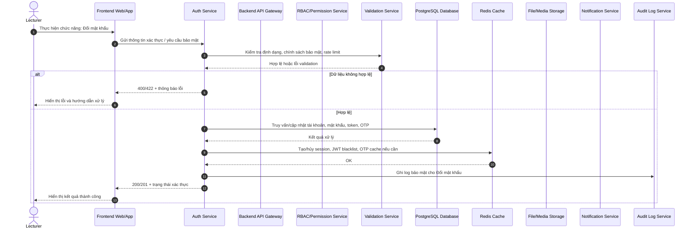

### 3. Xác thực 2 lớp

**Mục tiêu:** Mô tả luồng xử lý chi tiết cho chức năng **Xác thực 2 lớp** của đối tượng **Giảng viên**.

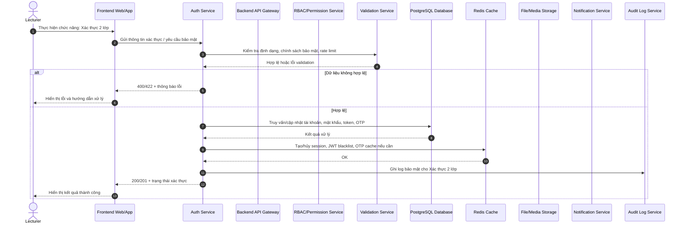

### 4. Quản lý hồ sơ

**Mục tiêu:** Mô tả luồng xử lý chi tiết cho chức năng **Quản lý hồ sơ** của đối tượng **Giảng viên**.

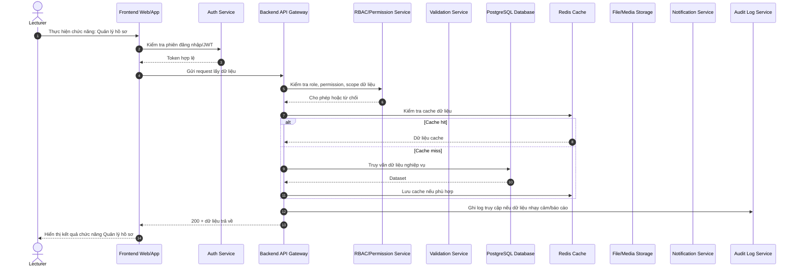

### 5. Cập nhật ảnh đại diện

**Mục tiêu:** Mô tả luồng xử lý chi tiết cho chức năng **Cập nhật ảnh đại diện** của đối tượng **Giảng viên**.


### 6. Xem lịch giảng dạy

**Mục tiêu:** Mô tả luồng xử lý chi tiết cho chức năng **Xem lịch giảng dạy** của đối tượng **Giảng viên**.

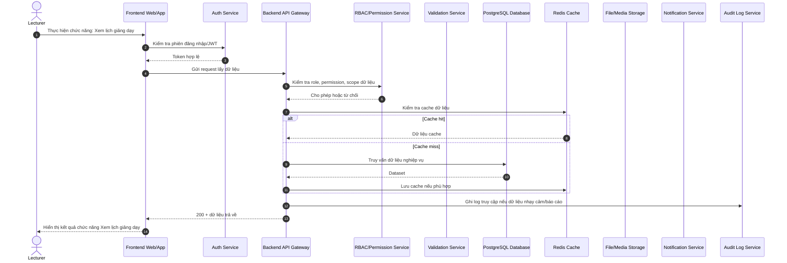

### 7. Cấu hình thông báo

**Mục tiêu:** Mô tả luồng xử lý chi tiết cho chức năng **Cấu hình thông báo** của đối tượng **Giảng viên**.

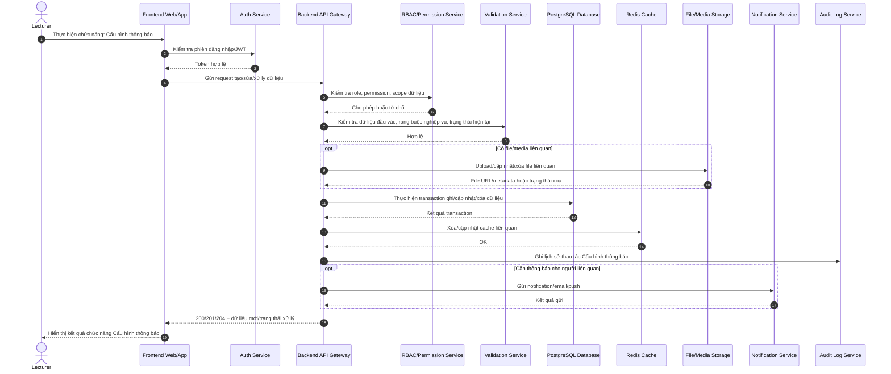

### 8. Xem lịch sử đăng nhập

**Mục tiêu:** Mô tả luồng xử lý chi tiết cho chức năng **Xem lịch sử đăng nhập** của đối tượng **Giảng viên**.

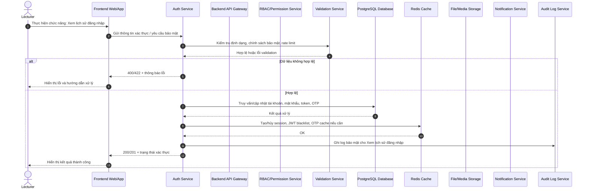

## 2.2. Quản lý lớp học phần

### 9. Xem lớp được phân công

**Mục tiêu:** Mô tả luồng xử lý chi tiết cho chức năng **Xem lớp được phân công** của đối tượng **Giảng viên**.

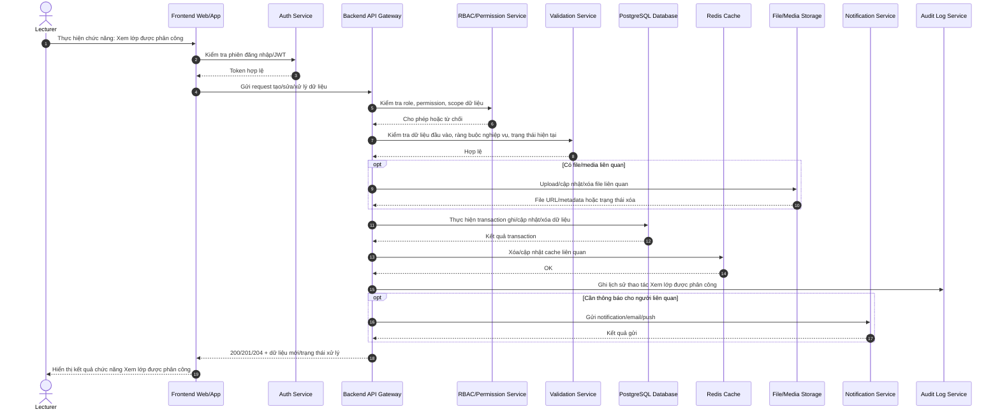

### 10. Xem thông tin lớp

**Mục tiêu:** Mô tả luồng xử lý chi tiết cho chức năng **Xem thông tin lớp** của đối tượng **Giảng viên**.

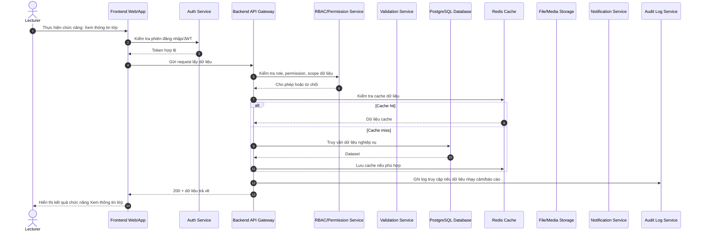

### 11. Cập nhật mô tả lớp

**Mục tiêu:** Mô tả luồng xử lý chi tiết cho chức năng **Cập nhật mô tả lớp** của đối tượng **Giảng viên**.


### 12. Thiết lập đề cương

**Mục tiêu:** Mô tả luồng xử lý chi tiết cho chức năng **Thiết lập đề cương** của đối tượng **Giảng viên**.


### 13. Thiết lập quy định lớp

**Mục tiêu:** Mô tả luồng xử lý chi tiết cho chức năng **Thiết lập quy định lớp** của đối tượng **Giảng viên**.

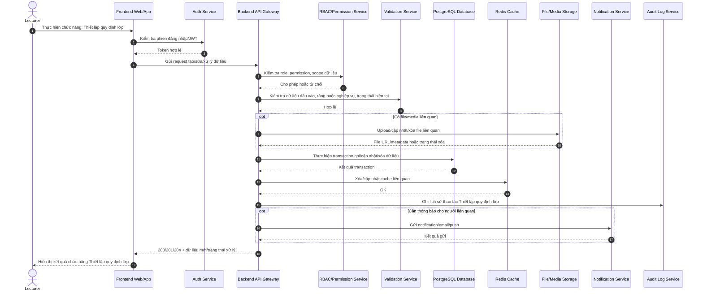

### 14. Ẩn/hiện lớp học

**Mục tiêu:** Mô tả luồng xử lý chi tiết cho chức năng **Ẩn/hiện lớp học** của đối tượng **Giảng viên**.

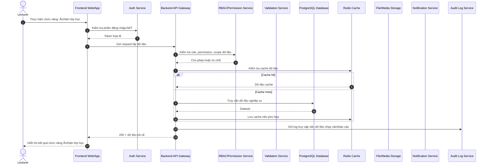

### 15. Sao chép nội dung lớp cũ

**Mục tiêu:** Mô tả luồng xử lý chi tiết cho chức năng **Sao chép nội dung lớp cũ** của đối tượng **Giảng viên**.


### 16. Lưu trữ lớp

**Mục tiêu:** Mô tả luồng xử lý chi tiết cho chức năng **Lưu trữ lớp** của đối tượng **Giảng viên**.

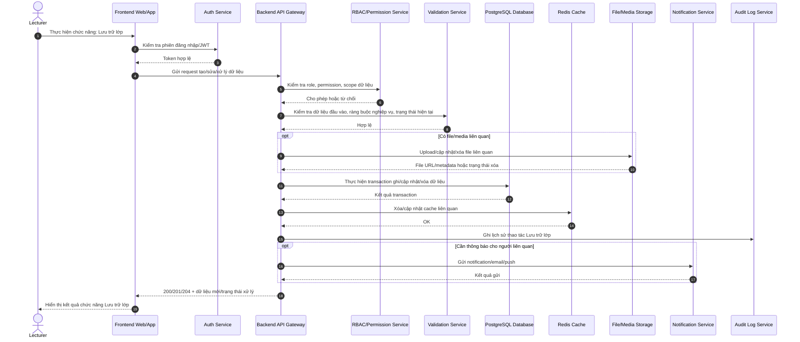

### 17. Xem danh sách sinh viên

**Mục tiêu:** Mô tả luồng xử lý chi tiết cho chức năng **Xem danh sách sinh viên** của đối tượng **Giảng viên**.

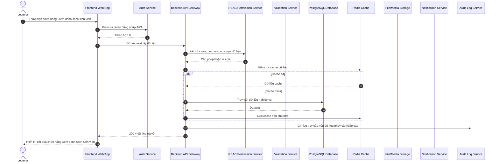

### 18. Xuất danh sách sinh viên

**Mục tiêu:** Mô tả luồng xử lý chi tiết cho chức năng **Xuất danh sách sinh viên** của đối tượng **Giảng viên**.

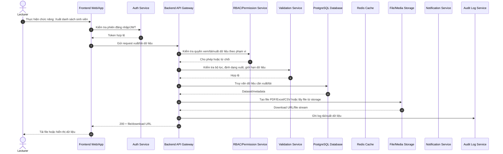

## 2.3. Quản lý nội dung bài giảng

### 19. Tạo chương/chủ đề

**Mục tiêu:** Mô tả luồng xử lý chi tiết cho chức năng **Tạo chương/chủ đề** của đối tượng **Giảng viên**.


### 20. Tạo bài học

**Mục tiêu:** Mô tả luồng xử lý chi tiết cho chức năng **Tạo bài học** của đối tượng **Giảng viên**.

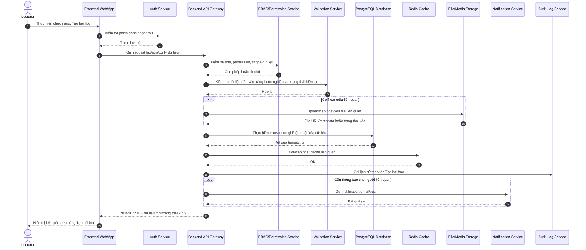

### 21. Soạn nội dung text/HTML

**Mục tiêu:** Mô tả luồng xử lý chi tiết cho chức năng **Soạn nội dung text/HTML** của đối tượng **Giảng viên**.

```mermaid
sequenceDiagram
    autonumber
    actor U as Lecturer
    participant FE as Frontend Web/App
    participant Auth as Auth Service
    participant API as Backend API Gateway
    participant RBAC as RBAC/Permission Service
    participant Val as Validation Service
    participant DB as PostgreSQL Database
    participant Cache as Redis Cache
    participant File as File/Media Storage
    participant Notify as Notification Service
    participant Audit as Audit Log Service
    U->>FE: Thực hiện chức năng: Soạn nội dung text/HTML
    FE->>Auth: Kiểm tra phiên đăng nhập/JWT
    Auth-->>FE: Token hợp lệ
    FE->>API: Gửi request lấy dữ liệu
    API->>RBAC: Kiểm tra role, permission, scope dữ liệu
    RBAC-->>API: Cho phép hoặc từ chối
    API->>Cache: Kiểm tra cache dữ liệu
    alt Cache hit
        Cache-->>API: Dữ liệu cache
    else Cache miss
        API->>DB: Truy vấn dữ liệu nghiệp vụ
        DB-->>API: Dataset
        API->>Cache: Lưu cache nếu phù hợp
    end
    API->>Audit: Ghi log truy cập nếu dữ liệu nhạy cảm/báo cáo
    API-->>FE: 200 + dữ liệu trả về
    FE-->>U: Hiển thị kết quả chức năng Soạn nội dung text/HTML
```

### 22. Upload tài liệu

**Mục tiêu:** Mô tả luồng xử lý chi tiết cho chức năng **Upload tài liệu** của đối tượng **Giảng viên**.

```mermaid
sequenceDiagram
    autonumber
    actor U as Lecturer
    participant FE as Frontend Web/App
    participant Auth as Auth Service
    participant API as Backend API Gateway
    participant RBAC as RBAC/Permission Service
    participant Val as Validation Service
    participant DB as PostgreSQL Database
    participant Cache as Redis Cache
    participant File as File/Media Storage
    participant Notify as Notification Service
    participant Audit as Audit Log Service
    U->>FE: Thực hiện chức năng: Upload tài liệu
    FE->>Auth: Kiểm tra phiên đăng nhập/JWT
    Auth-->>FE: Token hợp lệ
    FE->>API: Gửi request kèm metadata/file/link/text
    API->>RBAC: Kiểm tra quyền nộp trong lớp học phần/nhóm
    RBAC-->>API: Cho phép hoặc từ chối
    API->>Val: Kiểm tra deadline, định dạng file, dung lượng, số lần nộp
    Val-->>API: Hợp lệ
    opt Có file đính kèm
        API->>File: Upload file lên storage
        File-->>API: File URL, checksum, metadata
    end
    API->>DB: Tạo/cập nhật bản ghi bài nộp, trạng thái, thời gian nộp
    DB-->>API: Submission ID/trạng thái
    API->>Audit: Ghi log nộp bài và metadata quan trọng
    API->>Notify: Thông báo cho giảng viên/sinh viên nếu cần
    API-->>FE: 200/201 + trạng thái bài nộp
    FE-->>U: Hiển thị xác nhận hoàn tất Upload tài liệu
```

### 23. Upload video

**Mục tiêu:** Mô tả luồng xử lý chi tiết cho chức năng **Upload video** của đối tượng **Giảng viên**.

```mermaid
sequenceDiagram
    autonumber
    actor U as Lecturer
    participant FE as Frontend Web/App
    participant Auth as Auth Service
    participant API as Backend API Gateway
    participant RBAC as RBAC/Permission Service
    participant Val as Validation Service
    participant DB as PostgreSQL Database
    participant Cache as Redis Cache
    participant File as File/Media Storage
    participant Notify as Notification Service
    participant Audit as Audit Log Service
    U->>FE: Thực hiện chức năng: Upload video
    FE->>Auth: Kiểm tra phiên đăng nhập/JWT
    Auth-->>FE: Token hợp lệ
    FE->>API: Gửi request kèm metadata/file/link/text
    API->>RBAC: Kiểm tra quyền nộp trong lớp học phần/nhóm
    RBAC-->>API: Cho phép hoặc từ chối
    API->>Val: Kiểm tra deadline, định dạng file, dung lượng, số lần nộp
    Val-->>API: Hợp lệ
    opt Có file đính kèm
        API->>File: Upload file lên storage
        File-->>API: File URL, checksum, metadata
    end
    API->>DB: Tạo/cập nhật bản ghi bài nộp, trạng thái, thời gian nộp
    DB-->>API: Submission ID/trạng thái
    API->>Audit: Ghi log nộp bài và metadata quan trọng
    API->>Notify: Thông báo cho giảng viên/sinh viên nếu cần
    API-->>FE: 200/201 + trạng thái bài nộp
    FE-->>U: Hiển thị xác nhận hoàn tất Upload video
```

### 24. Nhúng video

**Mục tiêu:** Mô tả luồng xử lý chi tiết cho chức năng **Nhúng video** của đối tượng **Giảng viên**.

```mermaid
sequenceDiagram
    autonumber
    actor U as Lecturer
    participant FE as Frontend Web/App
    participant Auth as Auth Service
    participant API as Backend API Gateway
    participant RBAC as RBAC/Permission Service
    participant Val as Validation Service
    participant DB as PostgreSQL Database
    participant Cache as Redis Cache
    participant File as File/Media Storage
    participant Notify as Notification Service
    participant Audit as Audit Log Service
    U->>FE: Thực hiện chức năng: Nhúng video
    FE->>Auth: Kiểm tra phiên đăng nhập/JWT
    Auth-->>FE: Token hợp lệ
    FE->>API: Gửi request lấy dữ liệu
    API->>RBAC: Kiểm tra role, permission, scope dữ liệu
    RBAC-->>API: Cho phép hoặc từ chối
    API->>Cache: Kiểm tra cache dữ liệu
    alt Cache hit
        Cache-->>API: Dữ liệu cache
    else Cache miss
        API->>DB: Truy vấn dữ liệu nghiệp vụ
        DB-->>API: Dataset
        API->>Cache: Lưu cache nếu phù hợp
    end
    API->>Audit: Ghi log truy cập nếu dữ liệu nhạy cảm/báo cáo
    API-->>FE: 200 + dữ liệu trả về
    FE-->>U: Hiển thị kết quả chức năng Nhúng video
```

### 25. Thêm link tham khảo

**Mục tiêu:** Mô tả luồng xử lý chi tiết cho chức năng **Thêm link tham khảo** của đối tượng **Giảng viên**.

```mermaid
sequenceDiagram
    autonumber
    actor U as Lecturer
    participant FE as Frontend Web/App
    participant Auth as Auth Service
    participant API as Backend API Gateway
    participant RBAC as RBAC/Permission Service
    participant Val as Validation Service
    participant DB as PostgreSQL Database
    participant Cache as Redis Cache
    participant File as File/Media Storage
    participant Notify as Notification Service
    participant Audit as Audit Log Service
    U->>FE: Thực hiện chức năng: Thêm link tham khảo
    FE->>Auth: Kiểm tra phiên đăng nhập/JWT
    Auth-->>FE: Token hợp lệ
    FE->>API: Gửi request lấy dữ liệu
    API->>RBAC: Kiểm tra role, permission, scope dữ liệu
    RBAC-->>API: Cho phép hoặc từ chối
    API->>Cache: Kiểm tra cache dữ liệu
    alt Cache hit
        Cache-->>API: Dữ liệu cache
    else Cache miss
        API->>DB: Truy vấn dữ liệu nghiệp vụ
        DB-->>API: Dataset
        API->>Cache: Lưu cache nếu phù hợp
    end
    API->>Audit: Ghi log truy cập nếu dữ liệu nhạy cảm/báo cáo
    API-->>FE: 200 + dữ liệu trả về
    FE-->>U: Hiển thị kết quả chức năng Thêm link tham khảo
```

### 26. Tạo bài đọc

**Mục tiêu:** Mô tả luồng xử lý chi tiết cho chức năng **Tạo bài đọc** của đối tượng **Giảng viên**.

```mermaid
sequenceDiagram
    autonumber
    actor U as Lecturer
    participant FE as Frontend Web/App
    participant Auth as Auth Service
    participant API as Backend API Gateway
    participant RBAC as RBAC/Permission Service
    participant Val as Validation Service
    participant DB as PostgreSQL Database
    participant Cache as Redis Cache
    participant File as File/Media Storage
    participant Notify as Notification Service
    participant Audit as Audit Log Service
    U->>FE: Thực hiện chức năng: Tạo bài đọc
    FE->>Auth: Kiểm tra phiên đăng nhập/JWT
    Auth-->>FE: Token hợp lệ
    FE->>API: Gửi request tạo/sửa/xử lý dữ liệu
    API->>RBAC: Kiểm tra role, permission, scope dữ liệu
    RBAC-->>API: Cho phép hoặc từ chối
    API->>Val: Kiểm tra dữ liệu đầu vào, ràng buộc nghiệp vụ, trạng thái hiện tại
    Val-->>API: Hợp lệ
    opt Có file/media liên quan
        API->>File: Upload/cập nhật/xóa file liên quan
        File-->>API: File URL/metadata hoặc trạng thái xóa
    end
    API->>DB: Thực hiện transaction ghi/cập nhật/xóa dữ liệu
    DB-->>API: Kết quả transaction
    API->>Cache: Xóa/cập nhật cache liên quan
    Cache-->>API: OK
    API->>Audit: Ghi lịch sử thao tác Tạo bài đọc
    opt Cần thông báo cho người liên quan
        API->>Notify: Gửi notification/email/push
        Notify-->>API: Kết quả gửi
    end
    API-->>FE: 200/201/204 + dữ liệu mới/trạng thái xử lý
    FE-->>U: Hiển thị kết quả chức năng Tạo bài đọc
```

### 27. Sắp xếp bài học

**Mục tiêu:** Mô tả luồng xử lý chi tiết cho chức năng **Sắp xếp bài học** của đối tượng **Giảng viên**.

```mermaid
sequenceDiagram
    autonumber
    actor U as Lecturer
    participant FE as Frontend Web/App
    participant Auth as Auth Service
    participant API as Backend API Gateway
    participant RBAC as RBAC/Permission Service
    participant Val as Validation Service
    participant DB as PostgreSQL Database
    participant Cache as Redis Cache
    participant File as File/Media Storage
    participant Notify as Notification Service
    participant Audit as Audit Log Service
    U->>FE: Thực hiện chức năng: Sắp xếp bài học
    FE->>Auth: Kiểm tra phiên đăng nhập/JWT
    Auth-->>FE: Token hợp lệ
    FE->>API: Gửi request lấy dữ liệu
    API->>RBAC: Kiểm tra role, permission, scope dữ liệu
    RBAC-->>API: Cho phép hoặc từ chối
    API->>Cache: Kiểm tra cache dữ liệu
    alt Cache hit
        Cache-->>API: Dữ liệu cache
    else Cache miss
        API->>DB: Truy vấn dữ liệu nghiệp vụ
        DB-->>API: Dataset
        API->>Cache: Lưu cache nếu phù hợp
    end
    API->>Audit: Ghi log truy cập nếu dữ liệu nhạy cảm/báo cáo
    API-->>FE: 200 + dữ liệu trả về
    FE-->>U: Hiển thị kết quả chức năng Sắp xếp bài học
```

### 28. Ẩn/hiện bài học

**Mục tiêu:** Mô tả luồng xử lý chi tiết cho chức năng **Ẩn/hiện bài học** của đối tượng **Giảng viên**.

```mermaid
sequenceDiagram
    autonumber
    actor U as Lecturer
    participant FE as Frontend Web/App
    participant Auth as Auth Service
    participant API as Backend API Gateway
    participant RBAC as RBAC/Permission Service
    participant Val as Validation Service
    participant DB as PostgreSQL Database
    participant Cache as Redis Cache
    participant File as File/Media Storage
    participant Notify as Notification Service
    participant Audit as Audit Log Service
    U->>FE: Thực hiện chức năng: Ẩn/hiện bài học
    FE->>Auth: Kiểm tra phiên đăng nhập/JWT
    Auth-->>FE: Token hợp lệ
    FE->>API: Gửi request lấy dữ liệu
    API->>RBAC: Kiểm tra role, permission, scope dữ liệu
    RBAC-->>API: Cho phép hoặc từ chối
    API->>Cache: Kiểm tra cache dữ liệu
    alt Cache hit
        Cache-->>API: Dữ liệu cache
    else Cache miss
        API->>DB: Truy vấn dữ liệu nghiệp vụ
        DB-->>API: Dataset
        API->>Cache: Lưu cache nếu phù hợp
    end
    API->>Audit: Ghi log truy cập nếu dữ liệu nhạy cảm/báo cáo
    API-->>FE: 200 + dữ liệu trả về
    FE-->>U: Hiển thị kết quả chức năng Ẩn/hiện bài học
```

### 29. Hẹn giờ công bố

**Mục tiêu:** Mô tả luồng xử lý chi tiết cho chức năng **Hẹn giờ công bố** của đối tượng **Giảng viên**.

```mermaid
sequenceDiagram
    autonumber
    actor U as Lecturer
    participant FE as Frontend Web/App
    participant Auth as Auth Service
    participant API as Backend API Gateway
    participant RBAC as RBAC/Permission Service
    participant Val as Validation Service
    participant DB as PostgreSQL Database
    participant Cache as Redis Cache
    participant File as File/Media Storage
    participant Notify as Notification Service
    participant Audit as Audit Log Service
    U->>FE: Thực hiện chức năng: Hẹn giờ công bố
    FE->>Auth: Kiểm tra phiên đăng nhập/JWT
    Auth-->>FE: Token hợp lệ
    FE->>API: Gửi request tạo/sửa/xử lý dữ liệu
    API->>RBAC: Kiểm tra role, permission, scope dữ liệu
    RBAC-->>API: Cho phép hoặc từ chối
    API->>Val: Kiểm tra dữ liệu đầu vào, ràng buộc nghiệp vụ, trạng thái hiện tại
    Val-->>API: Hợp lệ
    opt Có file/media liên quan
        API->>File: Upload/cập nhật/xóa file liên quan
        File-->>API: File URL/metadata hoặc trạng thái xóa
    end
    API->>DB: Thực hiện transaction ghi/cập nhật/xóa dữ liệu
    DB-->>API: Kết quả transaction
    API->>Cache: Xóa/cập nhật cache liên quan
    Cache-->>API: OK
    API->>Audit: Ghi lịch sử thao tác Hẹn giờ công bố
    opt Cần thông báo cho người liên quan
        API->>Notify: Gửi notification/email/push
        Notify-->>API: Kết quả gửi
    end
    API-->>FE: 200/201/204 + dữ liệu mới/trạng thái xử lý
    FE-->>U: Hiển thị kết quả chức năng Hẹn giờ công bố
```

### 30. Mở bài theo điều kiện

**Mục tiêu:** Mô tả luồng xử lý chi tiết cho chức năng **Mở bài theo điều kiện** của đối tượng **Giảng viên**.

```mermaid
sequenceDiagram
    autonumber
    actor U as Lecturer
    participant FE as Frontend Web/App
    participant Auth as Auth Service
    participant API as Backend API Gateway
    participant RBAC as RBAC/Permission Service
    participant Val as Validation Service
    participant DB as PostgreSQL Database
    participant Cache as Redis Cache
    participant File as File/Media Storage
    participant Notify as Notification Service
    participant Audit as Audit Log Service
    U->>FE: Thực hiện chức năng: Mở bài theo điều kiện
    FE->>Auth: Kiểm tra phiên đăng nhập/JWT
    Auth-->>FE: Token hợp lệ
    FE->>API: Gửi request tạo/sửa/xử lý dữ liệu
    API->>RBAC: Kiểm tra role, permission, scope dữ liệu
    RBAC-->>API: Cho phép hoặc từ chối
    API->>Val: Kiểm tra dữ liệu đầu vào, ràng buộc nghiệp vụ, trạng thái hiện tại
    Val-->>API: Hợp lệ
    opt Có file/media liên quan
        API->>File: Upload/cập nhật/xóa file liên quan
        File-->>API: File URL/metadata hoặc trạng thái xóa
    end
    API->>DB: Thực hiện transaction ghi/cập nhật/xóa dữ liệu
    DB-->>API: Kết quả transaction
    API->>Cache: Xóa/cập nhật cache liên quan
    Cache-->>API: OK
    API->>Audit: Ghi lịch sử thao tác Mở bài theo điều kiện
    opt Cần thông báo cho người liên quan
        API->>Notify: Gửi notification/email/push
        Notify-->>API: Kết quả gửi
    end
    API-->>FE: 200/201/204 + dữ liệu mới/trạng thái xử lý
    FE-->>U: Hiển thị kết quả chức năng Mở bài theo điều kiện
```

### 31. Cập nhật tài liệu

**Mục tiêu:** Mô tả luồng xử lý chi tiết cho chức năng **Cập nhật tài liệu** của đối tượng **Giảng viên**.

```mermaid
sequenceDiagram
    autonumber
    actor U as Lecturer
    participant FE as Frontend Web/App
    participant Auth as Auth Service
    participant API as Backend API Gateway
    participant RBAC as RBAC/Permission Service
    participant Val as Validation Service
    participant DB as PostgreSQL Database
    participant Cache as Redis Cache
    participant File as File/Media Storage
    participant Notify as Notification Service
    participant Audit as Audit Log Service
    U->>FE: Thực hiện chức năng: Cập nhật tài liệu
    FE->>Auth: Kiểm tra phiên đăng nhập/JWT
    Auth-->>FE: Token hợp lệ
    FE->>API: Gửi request tạo/sửa/xử lý dữ liệu
    API->>RBAC: Kiểm tra role, permission, scope dữ liệu
    RBAC-->>API: Cho phép hoặc từ chối
    API->>Val: Kiểm tra dữ liệu đầu vào, ràng buộc nghiệp vụ, trạng thái hiện tại
    Val-->>API: Hợp lệ
    opt Có file/media liên quan
        API->>File: Upload/cập nhật/xóa file liên quan
        File-->>API: File URL/metadata hoặc trạng thái xóa
    end
    API->>DB: Thực hiện transaction ghi/cập nhật/xóa dữ liệu
    DB-->>API: Kết quả transaction
    API->>Cache: Xóa/cập nhật cache liên quan
    Cache-->>API: OK
    API->>Audit: Ghi lịch sử thao tác Cập nhật tài liệu
    opt Cần thông báo cho người liên quan
        API->>Notify: Gửi notification/email/push
        Notify-->>API: Kết quả gửi
    end
    API-->>FE: 200/201/204 + dữ liệu mới/trạng thái xử lý
    FE-->>U: Hiển thị kết quả chức năng Cập nhật tài liệu
```

### 32. Xóa tài liệu

**Mục tiêu:** Mô tả luồng xử lý chi tiết cho chức năng **Xóa tài liệu** của đối tượng **Giảng viên**.

```mermaid
sequenceDiagram
    autonumber
    actor U as Lecturer
    participant FE as Frontend Web/App
    participant Auth as Auth Service
    participant API as Backend API Gateway
    participant RBAC as RBAC/Permission Service
    participant Val as Validation Service
    participant DB as PostgreSQL Database
    participant Cache as Redis Cache
    participant File as File/Media Storage
    participant Notify as Notification Service
    participant Audit as Audit Log Service
    U->>FE: Thực hiện chức năng: Xóa tài liệu
    FE->>Auth: Kiểm tra phiên đăng nhập/JWT
    Auth-->>FE: Token hợp lệ
    FE->>API: Gửi request tạo/sửa/xử lý dữ liệu
    API->>RBAC: Kiểm tra role, permission, scope dữ liệu
    RBAC-->>API: Cho phép hoặc từ chối
    API->>Val: Kiểm tra dữ liệu đầu vào, ràng buộc nghiệp vụ, trạng thái hiện tại
    Val-->>API: Hợp lệ
    opt Có file/media liên quan
        API->>File: Upload/cập nhật/xóa file liên quan
        File-->>API: File URL/metadata hoặc trạng thái xóa
    end
    API->>DB: Thực hiện transaction ghi/cập nhật/xóa dữ liệu
    DB-->>API: Kết quả transaction
    API->>Cache: Xóa/cập nhật cache liên quan
    Cache-->>API: OK
    API->>Audit: Ghi lịch sử thao tác Xóa tài liệu
    opt Cần thông báo cho người liên quan
        API->>Notify: Gửi notification/email/push
        Notify-->>API: Kết quả gửi
    end
    API-->>FE: 200/201/204 + dữ liệu mới/trạng thái xử lý
    FE-->>U: Hiển thị kết quả chức năng Xóa tài liệu
```

### 33. Theo dõi lượt xem

**Mục tiêu:** Mô tả luồng xử lý chi tiết cho chức năng **Theo dõi lượt xem** của đối tượng **Giảng viên**.

```mermaid
sequenceDiagram
    autonumber
    actor U as Lecturer
    participant FE as Frontend Web/App
    participant Auth as Auth Service
    participant API as Backend API Gateway
    participant RBAC as RBAC/Permission Service
    participant Val as Validation Service
    participant DB as PostgreSQL Database
    participant Cache as Redis Cache
    participant File as File/Media Storage
    participant Notify as Notification Service
    participant Audit as Audit Log Service
    U->>FE: Thực hiện chức năng: Theo dõi lượt xem
    FE->>Auth: Kiểm tra phiên đăng nhập/JWT
    Auth-->>FE: Token hợp lệ
    FE->>API: Gửi request lấy dữ liệu
    API->>RBAC: Kiểm tra role, permission, scope dữ liệu
    RBAC-->>API: Cho phép hoặc từ chối
    API->>Cache: Kiểm tra cache dữ liệu
    alt Cache hit
        Cache-->>API: Dữ liệu cache
    else Cache miss
        API->>DB: Truy vấn dữ liệu nghiệp vụ
        DB-->>API: Dataset
        API->>Cache: Lưu cache nếu phù hợp
    end
    API->>Audit: Ghi log truy cập nếu dữ liệu nhạy cảm/báo cáo
    API-->>FE: 200 + dữ liệu trả về
    FE-->>U: Hiển thị kết quả chức năng Theo dõi lượt xem
```

### 34. Ghim nội dung quan trọng

**Mục tiêu:** Mô tả luồng xử lý chi tiết cho chức năng **Ghim nội dung quan trọng** của đối tượng **Giảng viên**.

```mermaid
sequenceDiagram
    autonumber
    actor U as Lecturer
    participant FE as Frontend Web/App
    participant Auth as Auth Service
    participant API as Backend API Gateway
    participant RBAC as RBAC/Permission Service
    participant Val as Validation Service
    participant DB as PostgreSQL Database
    participant Cache as Redis Cache
    participant File as File/Media Storage
    participant Notify as Notification Service
    participant Audit as Audit Log Service
    U->>FE: Thực hiện chức năng: Ghim nội dung quan trọng
    FE->>Auth: Kiểm tra phiên đăng nhập/JWT
    Auth-->>FE: Token hợp lệ
    FE->>API: Gửi request lấy dữ liệu
    API->>RBAC: Kiểm tra role, permission, scope dữ liệu
    RBAC-->>API: Cho phép hoặc từ chối
    API->>Cache: Kiểm tra cache dữ liệu
    alt Cache hit
        Cache-->>API: Dữ liệu cache
    else Cache miss
        API->>DB: Truy vấn dữ liệu nghiệp vụ
        DB-->>API: Dataset
        API->>Cache: Lưu cache nếu phù hợp
    end
    API->>Audit: Ghi log truy cập nếu dữ liệu nhạy cảm/báo cáo
    API-->>FE: 200 + dữ liệu trả về
    FE-->>U: Hiển thị kết quả chức năng Ghim nội dung quan trọng
```

### 35. Tạo nội dung SCORM/xAPI

**Mục tiêu:** Mô tả luồng xử lý chi tiết cho chức năng **Tạo nội dung SCORM/xAPI** của đối tượng **Giảng viên**.

```mermaid
sequenceDiagram
    autonumber
    actor U as Lecturer
    participant FE as Frontend Web/App
    participant Auth as Auth Service
    participant API as Backend API Gateway
    participant RBAC as RBAC/Permission Service
    participant Val as Validation Service
    participant DB as PostgreSQL Database
    participant Cache as Redis Cache
    participant File as File/Media Storage
    participant Notify as Notification Service
    participant Audit as Audit Log Service
    U->>FE: Thực hiện chức năng: Tạo nội dung SCORM/xAPI
    FE->>Auth: Kiểm tra phiên đăng nhập/JWT
    Auth-->>FE: Token hợp lệ
    FE->>API: Gửi request tạo/sửa/xử lý dữ liệu
    API->>RBAC: Kiểm tra role, permission, scope dữ liệu
    RBAC-->>API: Cho phép hoặc từ chối
    API->>Val: Kiểm tra dữ liệu đầu vào, ràng buộc nghiệp vụ, trạng thái hiện tại
    Val-->>API: Hợp lệ
    opt Có file/media liên quan
        API->>File: Upload/cập nhật/xóa file liên quan
        File-->>API: File URL/metadata hoặc trạng thái xóa
    end
    API->>DB: Thực hiện transaction ghi/cập nhật/xóa dữ liệu
    DB-->>API: Kết quả transaction
    API->>Cache: Xóa/cập nhật cache liên quan
    Cache-->>API: OK
    API->>Audit: Ghi lịch sử thao tác Tạo nội dung SCORM/xAPI
    opt Cần thông báo cho người liên quan
        API->>Notify: Gửi notification/email/push
        Notify-->>API: Kết quả gửi
    end
    API-->>FE: 200/201/204 + dữ liệu mới/trạng thái xử lý
    FE-->>U: Hiển thị kết quả chức năng Tạo nội dung SCORM/xAPI
```

## 2.4. Quản lý sinh viên

### 36. Xem danh sách sinh viên

**Mục tiêu:** Mô tả luồng xử lý chi tiết cho chức năng **Xem danh sách sinh viên** của đối tượng **Giảng viên**.

```mermaid
sequenceDiagram
    autonumber
    actor U as Lecturer
    participant FE as Frontend Web/App
    participant Auth as Auth Service
    participant API as Backend API Gateway
    participant RBAC as RBAC/Permission Service
    participant Val as Validation Service
    participant DB as PostgreSQL Database
    participant Cache as Redis Cache
    participant File as File/Media Storage
    participant Notify as Notification Service
    participant Audit as Audit Log Service
    U->>FE: Thực hiện chức năng: Xem danh sách sinh viên
    FE->>Auth: Kiểm tra phiên đăng nhập/JWT
    Auth-->>FE: Token hợp lệ
    FE->>API: Gửi request lấy dữ liệu
    API->>RBAC: Kiểm tra role, permission, scope dữ liệu
    RBAC-->>API: Cho phép hoặc từ chối
    API->>Cache: Kiểm tra cache dữ liệu
    alt Cache hit
        Cache-->>API: Dữ liệu cache
    else Cache miss
        API->>DB: Truy vấn dữ liệu nghiệp vụ
        DB-->>API: Dataset
        API->>Cache: Lưu cache nếu phù hợp
    end
    API->>Audit: Ghi log truy cập nếu dữ liệu nhạy cảm/báo cáo
    API-->>FE: 200 + dữ liệu trả về
    FE-->>U: Hiển thị kết quả chức năng Xem danh sách sinh viên
```

### 37. Tìm kiếm sinh viên

**Mục tiêu:** Mô tả luồng xử lý chi tiết cho chức năng **Tìm kiếm sinh viên** của đối tượng **Giảng viên**.

```mermaid
sequenceDiagram
    autonumber
    actor U as Lecturer
    participant FE as Frontend Web/App
    participant Auth as Auth Service
    participant API as Backend API Gateway
    participant RBAC as RBAC/Permission Service
    participant Val as Validation Service
    participant DB as PostgreSQL Database
    participant Cache as Redis Cache
    participant File as File/Media Storage
    participant Notify as Notification Service
    participant Audit as Audit Log Service
    U->>FE: Thực hiện chức năng: Tìm kiếm sinh viên
    FE->>Auth: Kiểm tra phiên đăng nhập/JWT
    Auth-->>FE: Token hợp lệ
    FE->>API: Gửi request lấy dữ liệu
    API->>RBAC: Kiểm tra role, permission, scope dữ liệu
    RBAC-->>API: Cho phép hoặc từ chối
    API->>Cache: Kiểm tra cache dữ liệu
    alt Cache hit
        Cache-->>API: Dữ liệu cache
    else Cache miss
        API->>DB: Truy vấn dữ liệu nghiệp vụ
        DB-->>API: Dataset
        API->>Cache: Lưu cache nếu phù hợp
    end
    API->>Audit: Ghi log truy cập nếu dữ liệu nhạy cảm/báo cáo
    API-->>FE: 200 + dữ liệu trả về
    FE-->>U: Hiển thị kết quả chức năng Tìm kiếm sinh viên
```

### 38. Lọc sinh viên

**Mục tiêu:** Mô tả luồng xử lý chi tiết cho chức năng **Lọc sinh viên** của đối tượng **Giảng viên**.

```mermaid
sequenceDiagram
    autonumber
    actor U as Lecturer
    participant FE as Frontend Web/App
    participant Auth as Auth Service
    participant API as Backend API Gateway
    participant RBAC as RBAC/Permission Service
    participant Val as Validation Service
    participant DB as PostgreSQL Database
    participant Cache as Redis Cache
    participant File as File/Media Storage
    participant Notify as Notification Service
    participant Audit as Audit Log Service
    U->>FE: Thực hiện chức năng: Lọc sinh viên
    FE->>Auth: Kiểm tra phiên đăng nhập/JWT
    Auth-->>FE: Token hợp lệ
    FE->>API: Gửi request lấy dữ liệu
    API->>RBAC: Kiểm tra role, permission, scope dữ liệu
    RBAC-->>API: Cho phép hoặc từ chối
    API->>Cache: Kiểm tra cache dữ liệu
    alt Cache hit
        Cache-->>API: Dữ liệu cache
    else Cache miss
        API->>DB: Truy vấn dữ liệu nghiệp vụ
        DB-->>API: Dataset
        API->>Cache: Lưu cache nếu phù hợp
    end
    API->>Audit: Ghi log truy cập nếu dữ liệu nhạy cảm/báo cáo
    API-->>FE: 200 + dữ liệu trả về
    FE-->>U: Hiển thị kết quả chức năng Lọc sinh viên
```

### 39. Xem hồ sơ học tập

**Mục tiêu:** Mô tả luồng xử lý chi tiết cho chức năng **Xem hồ sơ học tập** của đối tượng **Giảng viên**.

```mermaid
sequenceDiagram
    autonumber
    actor U as Lecturer
    participant FE as Frontend Web/App
    participant Auth as Auth Service
    participant API as Backend API Gateway
    participant RBAC as RBAC/Permission Service
    participant Val as Validation Service
    participant DB as PostgreSQL Database
    participant Cache as Redis Cache
    participant File as File/Media Storage
    participant Notify as Notification Service
    participant Audit as Audit Log Service
    U->>FE: Thực hiện chức năng: Xem hồ sơ học tập
    FE->>Auth: Kiểm tra phiên đăng nhập/JWT
    Auth-->>FE: Token hợp lệ
    FE->>API: Gửi request lấy dữ liệu
    API->>RBAC: Kiểm tra role, permission, scope dữ liệu
    RBAC-->>API: Cho phép hoặc từ chối
    API->>Cache: Kiểm tra cache dữ liệu
    alt Cache hit
        Cache-->>API: Dữ liệu cache
    else Cache miss
        API->>DB: Truy vấn dữ liệu nghiệp vụ
        DB-->>API: Dataset
        API->>Cache: Lưu cache nếu phù hợp
    end
    API->>Audit: Ghi log truy cập nếu dữ liệu nhạy cảm/báo cáo
    API-->>FE: 200 + dữ liệu trả về
    FE-->>U: Hiển thị kết quả chức năng Xem hồ sơ học tập
```

### 40. Xem lịch sử hoạt động

**Mục tiêu:** Mô tả luồng xử lý chi tiết cho chức năng **Xem lịch sử hoạt động** của đối tượng **Giảng viên**.

```mermaid
sequenceDiagram
    autonumber
    actor U as Lecturer
    participant FE as Frontend Web/App
    participant Auth as Auth Service
    participant API as Backend API Gateway
    participant RBAC as RBAC/Permission Service
    participant Val as Validation Service
    participant DB as PostgreSQL Database
    participant Cache as Redis Cache
    participant File as File/Media Storage
    participant Notify as Notification Service
    participant Audit as Audit Log Service
    U->>FE: Thực hiện chức năng: Xem lịch sử hoạt động
    FE->>Auth: Kiểm tra phiên đăng nhập/JWT
    Auth-->>FE: Token hợp lệ
    FE->>API: Gửi request lấy dữ liệu
    API->>RBAC: Kiểm tra role, permission, scope dữ liệu
    RBAC-->>API: Cho phép hoặc từ chối
    API->>Cache: Kiểm tra cache dữ liệu
    alt Cache hit
        Cache-->>API: Dữ liệu cache
    else Cache miss
        API->>DB: Truy vấn dữ liệu nghiệp vụ
        DB-->>API: Dataset
        API->>Cache: Lưu cache nếu phù hợp
    end
    API->>Audit: Ghi log truy cập nếu dữ liệu nhạy cảm/báo cáo
    API-->>FE: 200 + dữ liệu trả về
    FE-->>U: Hiển thị kết quả chức năng Xem lịch sử hoạt động
```

### 41. Gửi thông báo cá nhân

**Mục tiêu:** Mô tả luồng xử lý chi tiết cho chức năng **Gửi thông báo cá nhân** của đối tượng **Giảng viên**.

```mermaid
sequenceDiagram
    autonumber
    actor U as Lecturer
    participant FE as Frontend Web/App
    participant Auth as Auth Service
    participant API as Backend API Gateway
    participant RBAC as RBAC/Permission Service
    participant Val as Validation Service
    participant DB as PostgreSQL Database
    participant Cache as Redis Cache
    participant File as File/Media Storage
    participant Notify as Notification Service
    participant Audit as Audit Log Service
    U->>FE: Thực hiện chức năng: Gửi thông báo cá nhân
    FE->>Auth: Kiểm tra phiên đăng nhập/JWT
    Auth-->>FE: Token hợp lệ
    FE->>API: Gửi nội dung, người nhận, phạm vi gửi
    API->>RBAC: Kiểm tra quyền gửi theo vai trò/phạm vi dữ liệu
    RBAC-->>API: Cho phép hoặc từ chối
    API->>Val: Kiểm tra nội dung, danh sách người nhận, template, spam/rate limit
    Val-->>API: Hợp lệ
    API->>DB: Lưu thông báo/tin nhắn/yêu cầu liên hệ
    DB-->>API: Message/Notification ID
    API->>Notify: Phân phối qua web/email/push theo cấu hình người nhận
    Notify-->>API: Kết quả gửi
    API->>Audit: Ghi log gửi thông báo/tin nhắn
    API-->>FE: 200/201 + trạng thái gửi
    FE-->>U: Hiển thị trạng thái hoàn tất Gửi thông báo cá nhân
```

### 42. Gửi thông báo cả lớp

**Mục tiêu:** Mô tả luồng xử lý chi tiết cho chức năng **Gửi thông báo cả lớp** của đối tượng **Giảng viên**.

```mermaid
sequenceDiagram
    autonumber
    actor U as Lecturer
    participant FE as Frontend Web/App
    participant Auth as Auth Service
    participant API as Backend API Gateway
    participant RBAC as RBAC/Permission Service
    participant Val as Validation Service
    participant DB as PostgreSQL Database
    participant Cache as Redis Cache
    participant File as File/Media Storage
    participant Notify as Notification Service
    participant Audit as Audit Log Service
    U->>FE: Thực hiện chức năng: Gửi thông báo cả lớp
    FE->>Auth: Kiểm tra phiên đăng nhập/JWT
    Auth-->>FE: Token hợp lệ
    FE->>API: Gửi nội dung, người nhận, phạm vi gửi
    API->>RBAC: Kiểm tra quyền gửi theo vai trò/phạm vi dữ liệu
    RBAC-->>API: Cho phép hoặc từ chối
    API->>Val: Kiểm tra nội dung, danh sách người nhận, template, spam/rate limit
    Val-->>API: Hợp lệ
    API->>DB: Lưu thông báo/tin nhắn/yêu cầu liên hệ
    DB-->>API: Message/Notification ID
    API->>Notify: Phân phối qua web/email/push theo cấu hình người nhận
    Notify-->>API: Kết quả gửi
    API->>Audit: Ghi log gửi thông báo/tin nhắn
    API-->>FE: 200/201 + trạng thái gửi
    FE-->>U: Hiển thị trạng thái hoàn tất Gửi thông báo cả lớp
```

### 43. Chia nhóm sinh viên

**Mục tiêu:** Mô tả luồng xử lý chi tiết cho chức năng **Chia nhóm sinh viên** của đối tượng **Giảng viên**.

```mermaid
sequenceDiagram
    autonumber
    actor U as Lecturer
    participant FE as Frontend Web/App
    participant Auth as Auth Service
    participant API as Backend API Gateway
    participant RBAC as RBAC/Permission Service
    participant Val as Validation Service
    participant DB as PostgreSQL Database
    participant Cache as Redis Cache
    participant File as File/Media Storage
    participant Notify as Notification Service
    participant Audit as Audit Log Service
    U->>FE: Thực hiện chức năng: Chia nhóm sinh viên
    FE->>Auth: Kiểm tra phiên đăng nhập/JWT
    Auth-->>FE: Token hợp lệ
    FE->>API: Gửi request lấy dữ liệu
    API->>RBAC: Kiểm tra role, permission, scope dữ liệu
    RBAC-->>API: Cho phép hoặc từ chối
    API->>Cache: Kiểm tra cache dữ liệu
    alt Cache hit
        Cache-->>API: Dữ liệu cache
    else Cache miss
        API->>DB: Truy vấn dữ liệu nghiệp vụ
        DB-->>API: Dataset
        API->>Cache: Lưu cache nếu phù hợp
    end
    API->>Audit: Ghi log truy cập nếu dữ liệu nhạy cảm/báo cáo
    API-->>FE: 200 + dữ liệu trả về
    FE-->>U: Hiển thị kết quả chức năng Chia nhóm sinh viên
```

### 44. Gán trưởng nhóm

**Mục tiêu:** Mô tả luồng xử lý chi tiết cho chức năng **Gán trưởng nhóm** của đối tượng **Giảng viên**.

```mermaid
sequenceDiagram
    autonumber
    actor U as Lecturer
    participant FE as Frontend Web/App
    participant Auth as Auth Service
    participant API as Backend API Gateway
    participant RBAC as RBAC/Permission Service
    participant Val as Validation Service
    participant DB as PostgreSQL Database
    participant Cache as Redis Cache
    participant File as File/Media Storage
    participant Notify as Notification Service
    participant Audit as Audit Log Service
    U->>FE: Thực hiện chức năng: Gán trưởng nhóm
    FE->>Auth: Kiểm tra phiên đăng nhập/JWT
    Auth-->>FE: Token hợp lệ
    FE->>API: Gửi request tạo/sửa/xử lý dữ liệu
    API->>RBAC: Kiểm tra role, permission, scope dữ liệu
    RBAC-->>API: Cho phép hoặc từ chối
    API->>Val: Kiểm tra dữ liệu đầu vào, ràng buộc nghiệp vụ, trạng thái hiện tại
    Val-->>API: Hợp lệ
    opt Có file/media liên quan
        API->>File: Upload/cập nhật/xóa file liên quan
        File-->>API: File URL/metadata hoặc trạng thái xóa
    end
    API->>DB: Thực hiện transaction ghi/cập nhật/xóa dữ liệu
    DB-->>API: Kết quả transaction
    API->>Cache: Xóa/cập nhật cache liên quan
    Cache-->>API: OK
    API->>Audit: Ghi lịch sử thao tác Gán trưởng nhóm
    opt Cần thông báo cho người liên quan
        API->>Notify: Gửi notification/email/push
        Notify-->>API: Kết quả gửi
    end
    API-->>FE: 200/201/204 + dữ liệu mới/trạng thái xử lý
    FE-->>U: Hiển thị kết quả chức năng Gán trưởng nhóm
```

### 45. Theo dõi sinh viên yếu

**Mục tiêu:** Mô tả luồng xử lý chi tiết cho chức năng **Theo dõi sinh viên yếu** của đối tượng **Giảng viên**.

```mermaid
sequenceDiagram
    autonumber
    actor U as Lecturer
    participant FE as Frontend Web/App
    participant Auth as Auth Service
    participant API as Backend API Gateway
    participant RBAC as RBAC/Permission Service
    participant Val as Validation Service
    participant DB as PostgreSQL Database
    participant Cache as Redis Cache
    participant File as File/Media Storage
    participant Notify as Notification Service
    participant Audit as Audit Log Service
    U->>FE: Thực hiện chức năng: Theo dõi sinh viên yếu
    FE->>Auth: Kiểm tra phiên đăng nhập/JWT
    Auth-->>FE: Token hợp lệ
    FE->>API: Gửi request lấy dữ liệu
    API->>RBAC: Kiểm tra role, permission, scope dữ liệu
    RBAC-->>API: Cho phép hoặc từ chối
    API->>Cache: Kiểm tra cache dữ liệu
    alt Cache hit
        Cache-->>API: Dữ liệu cache
    else Cache miss
        API->>DB: Truy vấn dữ liệu nghiệp vụ
        DB-->>API: Dataset
        API->>Cache: Lưu cache nếu phù hợp
    end
    API->>Audit: Ghi log truy cập nếu dữ liệu nhạy cảm/báo cáo
    API-->>FE: 200 + dữ liệu trả về
    FE-->>U: Hiển thị kết quả chức năng Theo dõi sinh viên yếu
```

### 46. Xuất báo cáo sinh viên

**Mục tiêu:** Mô tả luồng xử lý chi tiết cho chức năng **Xuất báo cáo sinh viên** của đối tượng **Giảng viên**.

```mermaid
sequenceDiagram
    autonumber
    actor U as Lecturer
    participant FE as Frontend Web/App
    participant Auth as Auth Service
    participant API as Backend API Gateway
    participant RBAC as RBAC/Permission Service
    participant Val as Validation Service
    participant DB as PostgreSQL Database
    participant Cache as Redis Cache
    participant File as File/Media Storage
    participant Notify as Notification Service
    participant Audit as Audit Log Service
    U->>FE: Thực hiện chức năng: Xuất báo cáo sinh viên
    FE->>Auth: Kiểm tra phiên đăng nhập/JWT
    Auth-->>FE: Token hợp lệ
    FE->>API: Gửi request xuất/tải dữ liệu
    API->>RBAC: Kiểm tra quyền xem/tải/xuất dữ liệu theo phạm vi
    RBAC-->>API: Cho phép hoặc từ chối
    API->>Val: Kiểm tra bộ lọc, định dạng xuất, giới hạn dữ liệu
    Val-->>API: Hợp lệ
    API->>DB: Truy vấn dữ liệu cần xuất/tải
    DB-->>API: Dataset/metadata
    API->>File: Tạo file PDF/Excel/CSV hoặc lấy file từ storage
    File-->>API: Download URL/file stream
    API->>Audit: Ghi log tải/xuất dữ liệu
    API-->>FE: 200 + file/download URL
    FE-->>U: Tải file hoặc hiển thị dữ liệu
```

## 2.5. Bài tập

### 47. Tạo bài tập

**Mục tiêu:** Mô tả luồng xử lý chi tiết cho chức năng **Tạo bài tập** của đối tượng **Giảng viên**.

```mermaid
sequenceDiagram
    autonumber
    actor U as Lecturer
    participant FE as Frontend Web/App
    participant Auth as Auth Service
    participant API as Backend API Gateway
    participant RBAC as RBAC/Permission Service
    participant Val as Validation Service
    participant DB as PostgreSQL Database
    participant Cache as Redis Cache
    participant File as File/Media Storage
    participant Notify as Notification Service
    participant Audit as Audit Log Service
    U->>FE: Thực hiện chức năng: Tạo bài tập
    FE->>Auth: Kiểm tra phiên đăng nhập/JWT
    Auth-->>FE: Token hợp lệ
    FE->>API: Gửi request tạo/sửa/xử lý dữ liệu
    API->>RBAC: Kiểm tra role, permission, scope dữ liệu
    RBAC-->>API: Cho phép hoặc từ chối
    API->>Val: Kiểm tra dữ liệu đầu vào, ràng buộc nghiệp vụ, trạng thái hiện tại
    Val-->>API: Hợp lệ
    opt Có file/media liên quan
        API->>File: Upload/cập nhật/xóa file liên quan
        File-->>API: File URL/metadata hoặc trạng thái xóa
    end
    API->>DB: Thực hiện transaction ghi/cập nhật/xóa dữ liệu
    DB-->>API: Kết quả transaction
    API->>Cache: Xóa/cập nhật cache liên quan
    Cache-->>API: OK
    API->>Audit: Ghi lịch sử thao tác Tạo bài tập
    opt Cần thông báo cho người liên quan
        API->>Notify: Gửi notification/email/push
        Notify-->>API: Kết quả gửi
    end
    API-->>FE: 200/201/204 + dữ liệu mới/trạng thái xử lý
    FE-->>U: Hiển thị kết quả chức năng Tạo bài tập
```

### 48. Soạn yêu cầu bài tập

**Mục tiêu:** Mô tả luồng xử lý chi tiết cho chức năng **Soạn yêu cầu bài tập** của đối tượng **Giảng viên**.

```mermaid
sequenceDiagram
    autonumber
    actor U as Lecturer
    participant FE as Frontend Web/App
    participant Auth as Auth Service
    participant API as Backend API Gateway
    participant RBAC as RBAC/Permission Service
    participant Val as Validation Service
    participant DB as PostgreSQL Database
    participant Cache as Redis Cache
    participant File as File/Media Storage
    participant Notify as Notification Service
    participant Audit as Audit Log Service
    U->>FE: Thực hiện chức năng: Soạn yêu cầu bài tập
    FE->>Auth: Kiểm tra phiên đăng nhập/JWT
    Auth-->>FE: Token hợp lệ
    FE->>API: Gửi request lấy dữ liệu
    API->>RBAC: Kiểm tra role, permission, scope dữ liệu
    RBAC-->>API: Cho phép hoặc từ chối
    API->>Cache: Kiểm tra cache dữ liệu
    alt Cache hit
        Cache-->>API: Dữ liệu cache
    else Cache miss
        API->>DB: Truy vấn dữ liệu nghiệp vụ
        DB-->>API: Dataset
        API->>Cache: Lưu cache nếu phù hợp
    end
    API->>Audit: Ghi log truy cập nếu dữ liệu nhạy cảm/báo cáo
    API-->>FE: 200 + dữ liệu trả về
    FE-->>U: Hiển thị kết quả chức năng Soạn yêu cầu bài tập
```

### 49. Đính kèm đề bài

**Mục tiêu:** Mô tả luồng xử lý chi tiết cho chức năng **Đính kèm đề bài** của đối tượng **Giảng viên**.

```mermaid
sequenceDiagram
    autonumber
    actor U as Lecturer
    participant FE as Frontend Web/App
    participant Auth as Auth Service
    participant API as Backend API Gateway
    participant RBAC as RBAC/Permission Service
    participant Val as Validation Service
    participant DB as PostgreSQL Database
    participant Cache as Redis Cache
    participant File as File/Media Storage
    participant Notify as Notification Service
    participant Audit as Audit Log Service
    U->>FE: Thực hiện chức năng: Đính kèm đề bài
    FE->>Auth: Kiểm tra phiên đăng nhập/JWT
    Auth-->>FE: Token hợp lệ
    FE->>API: Gửi request tạo/sửa/xử lý dữ liệu
    API->>RBAC: Kiểm tra role, permission, scope dữ liệu
    RBAC-->>API: Cho phép hoặc từ chối
    API->>Val: Kiểm tra dữ liệu đầu vào, ràng buộc nghiệp vụ, trạng thái hiện tại
    Val-->>API: Hợp lệ
    opt Có file/media liên quan
        API->>File: Upload/cập nhật/xóa file liên quan
        File-->>API: File URL/metadata hoặc trạng thái xóa
    end
    API->>DB: Thực hiện transaction ghi/cập nhật/xóa dữ liệu
    DB-->>API: Kết quả transaction
    API->>Cache: Xóa/cập nhật cache liên quan
    Cache-->>API: OK
    API->>Audit: Ghi lịch sử thao tác Đính kèm đề bài
    opt Cần thông báo cho người liên quan
        API->>Notify: Gửi notification/email/push
        Notify-->>API: Kết quả gửi
    end
    API-->>FE: 200/201/204 + dữ liệu mới/trạng thái xử lý
    FE-->>U: Hiển thị kết quả chức năng Đính kèm đề bài
```

### 50. Cấu hình điểm tối đa

**Mục tiêu:** Mô tả luồng xử lý chi tiết cho chức năng **Cấu hình điểm tối đa** của đối tượng **Giảng viên**.

```mermaid
sequenceDiagram
    autonumber
    actor U as Lecturer
    participant FE as Frontend Web/App
    participant Auth as Auth Service
    participant API as Backend API Gateway
    participant RBAC as RBAC/Permission Service
    participant Val as Validation Service
    participant DB as PostgreSQL Database
    participant Cache as Redis Cache
    participant File as File/Media Storage
    participant Notify as Notification Service
    participant Audit as Audit Log Service
    U->>FE: Thực hiện chức năng: Cấu hình điểm tối đa
    FE->>Auth: Kiểm tra phiên đăng nhập/JWT
    Auth-->>FE: Token hợp lệ
    FE->>API: Gửi request tạo/sửa/xử lý dữ liệu
    API->>RBAC: Kiểm tra role, permission, scope dữ liệu
    RBAC-->>API: Cho phép hoặc từ chối
    API->>Val: Kiểm tra dữ liệu đầu vào, ràng buộc nghiệp vụ, trạng thái hiện tại
    Val-->>API: Hợp lệ
    opt Có file/media liên quan
        API->>File: Upload/cập nhật/xóa file liên quan
        File-->>API: File URL/metadata hoặc trạng thái xóa
    end
    API->>DB: Thực hiện transaction ghi/cập nhật/xóa dữ liệu
    DB-->>API: Kết quả transaction
    API->>Cache: Xóa/cập nhật cache liên quan
    Cache-->>API: OK
    API->>Audit: Ghi lịch sử thao tác Cấu hình điểm tối đa
    opt Cần thông báo cho người liên quan
        API->>Notify: Gửi notification/email/push
        Notify-->>API: Kết quả gửi
    end
    API-->>FE: 200/201/204 + dữ liệu mới/trạng thái xử lý
    FE-->>U: Hiển thị kết quả chức năng Cấu hình điểm tối đa
```

### 51. Cấu hình deadline

**Mục tiêu:** Mô tả luồng xử lý chi tiết cho chức năng **Cấu hình deadline** của đối tượng **Giảng viên**.

```mermaid
sequenceDiagram
    autonumber
    actor U as Lecturer
    participant FE as Frontend Web/App
    participant Auth as Auth Service
    participant API as Backend API Gateway
    participant RBAC as RBAC/Permission Service
    participant Val as Validation Service
    participant DB as PostgreSQL Database
    participant Cache as Redis Cache
    participant File as File/Media Storage
    participant Notify as Notification Service
    participant Audit as Audit Log Service
    U->>FE: Thực hiện chức năng: Cấu hình deadline
    FE->>Auth: Kiểm tra phiên đăng nhập/JWT
    Auth-->>FE: Token hợp lệ
    FE->>API: Gửi request tạo/sửa/xử lý dữ liệu
    API->>RBAC: Kiểm tra role, permission, scope dữ liệu
    RBAC-->>API: Cho phép hoặc từ chối
    API->>Val: Kiểm tra dữ liệu đầu vào, ràng buộc nghiệp vụ, trạng thái hiện tại
    Val-->>API: Hợp lệ
    opt Có file/media liên quan
        API->>File: Upload/cập nhật/xóa file liên quan
        File-->>API: File URL/metadata hoặc trạng thái xóa
    end
    API->>DB: Thực hiện transaction ghi/cập nhật/xóa dữ liệu
    DB-->>API: Kết quả transaction
    API->>Cache: Xóa/cập nhật cache liên quan
    Cache-->>API: OK
    API->>Audit: Ghi lịch sử thao tác Cấu hình deadline
    opt Cần thông báo cho người liên quan
        API->>Notify: Gửi notification/email/push
        Notify-->>API: Kết quả gửi
    end
    API-->>FE: 200/201/204 + dữ liệu mới/trạng thái xử lý
    FE-->>U: Hiển thị kết quả chức năng Cấu hình deadline
```

### 52. Cho phép nộp muộn

**Mục tiêu:** Mô tả luồng xử lý chi tiết cho chức năng **Cho phép nộp muộn** của đối tượng **Giảng viên**.

```mermaid
sequenceDiagram
    autonumber
    actor U as Lecturer
    participant FE as Frontend Web/App
    participant Auth as Auth Service
    participant API as Backend API Gateway
    participant RBAC as RBAC/Permission Service
    participant Val as Validation Service
    participant DB as PostgreSQL Database
    participant Cache as Redis Cache
    participant File as File/Media Storage
    participant Notify as Notification Service
    participant Audit as Audit Log Service
    U->>FE: Thực hiện chức năng: Cho phép nộp muộn
    FE->>Auth: Kiểm tra phiên đăng nhập/JWT
    Auth-->>FE: Token hợp lệ
    FE->>API: Gửi request lấy dữ liệu
    API->>RBAC: Kiểm tra role, permission, scope dữ liệu
    RBAC-->>API: Cho phép hoặc từ chối
    API->>Cache: Kiểm tra cache dữ liệu
    alt Cache hit
        Cache-->>API: Dữ liệu cache
    else Cache miss
        API->>DB: Truy vấn dữ liệu nghiệp vụ
        DB-->>API: Dataset
        API->>Cache: Lưu cache nếu phù hợp
    end
    API->>Audit: Ghi log truy cập nếu dữ liệu nhạy cảm/báo cáo
    API-->>FE: 200 + dữ liệu trả về
    FE-->>U: Hiển thị kết quả chức năng Cho phép nộp muộn
```

### 53. Cấu hình số lần nộp

**Mục tiêu:** Mô tả luồng xử lý chi tiết cho chức năng **Cấu hình số lần nộp** của đối tượng **Giảng viên**.

```mermaid
sequenceDiagram
    autonumber
    actor U as Lecturer
    participant FE as Frontend Web/App
    participant Auth as Auth Service
    participant API as Backend API Gateway
    participant RBAC as RBAC/Permission Service
    participant Val as Validation Service
    participant DB as PostgreSQL Database
    participant Cache as Redis Cache
    participant File as File/Media Storage
    participant Notify as Notification Service
    participant Audit as Audit Log Service
    U->>FE: Thực hiện chức năng: Cấu hình số lần nộp
    FE->>Auth: Kiểm tra phiên đăng nhập/JWT
    Auth-->>FE: Token hợp lệ
    FE->>API: Gửi request tạo/sửa/xử lý dữ liệu
    API->>RBAC: Kiểm tra role, permission, scope dữ liệu
    RBAC-->>API: Cho phép hoặc từ chối
    API->>Val: Kiểm tra dữ liệu đầu vào, ràng buộc nghiệp vụ, trạng thái hiện tại
    Val-->>API: Hợp lệ
    opt Có file/media liên quan
        API->>File: Upload/cập nhật/xóa file liên quan
        File-->>API: File URL/metadata hoặc trạng thái xóa
    end
    API->>DB: Thực hiện transaction ghi/cập nhật/xóa dữ liệu
    DB-->>API: Kết quả transaction
    API->>Cache: Xóa/cập nhật cache liên quan
    Cache-->>API: OK
    API->>Audit: Ghi lịch sử thao tác Cấu hình số lần nộp
    opt Cần thông báo cho người liên quan
        API->>Notify: Gửi notification/email/push
        Notify-->>API: Kết quả gửi
    end
    API-->>FE: 200/201/204 + dữ liệu mới/trạng thái xử lý
    FE-->>U: Hiển thị kết quả chức năng Cấu hình số lần nộp
```

### 54. Cấu hình loại nộp

**Mục tiêu:** Mô tả luồng xử lý chi tiết cho chức năng **Cấu hình loại nộp** của đối tượng **Giảng viên**.

```mermaid
sequenceDiagram
    autonumber
    actor U as Lecturer
    participant FE as Frontend Web/App
    participant Auth as Auth Service
    participant API as Backend API Gateway
    participant RBAC as RBAC/Permission Service
    participant Val as Validation Service
    participant DB as PostgreSQL Database
    participant Cache as Redis Cache
    participant File as File/Media Storage
    participant Notify as Notification Service
    participant Audit as Audit Log Service
    U->>FE: Thực hiện chức năng: Cấu hình loại nộp
    FE->>Auth: Kiểm tra phiên đăng nhập/JWT
    Auth-->>FE: Token hợp lệ
    FE->>API: Gửi request tạo/sửa/xử lý dữ liệu
    API->>RBAC: Kiểm tra role, permission, scope dữ liệu
    RBAC-->>API: Cho phép hoặc từ chối
    API->>Val: Kiểm tra dữ liệu đầu vào, ràng buộc nghiệp vụ, trạng thái hiện tại
    Val-->>API: Hợp lệ
    opt Có file/media liên quan
        API->>File: Upload/cập nhật/xóa file liên quan
        File-->>API: File URL/metadata hoặc trạng thái xóa
    end
    API->>DB: Thực hiện transaction ghi/cập nhật/xóa dữ liệu
    DB-->>API: Kết quả transaction
    API->>Cache: Xóa/cập nhật cache liên quan
    Cache-->>API: OK
    API->>Audit: Ghi lịch sử thao tác Cấu hình loại nộp
    opt Cần thông báo cho người liên quan
        API->>Notify: Gửi notification/email/push
        Notify-->>API: Kết quả gửi
    end
    API-->>FE: 200/201/204 + dữ liệu mới/trạng thái xử lý
    FE-->>U: Hiển thị kết quả chức năng Cấu hình loại nộp
```

### 55. Cấu hình file hợp lệ

**Mục tiêu:** Mô tả luồng xử lý chi tiết cho chức năng **Cấu hình file hợp lệ** của đối tượng **Giảng viên**.

```mermaid
sequenceDiagram
    autonumber
    actor U as Lecturer
    participant FE as Frontend Web/App
    participant Auth as Auth Service
    participant API as Backend API Gateway
    participant RBAC as RBAC/Permission Service
    participant Val as Validation Service
    participant DB as PostgreSQL Database
    participant Cache as Redis Cache
    participant File as File/Media Storage
    participant Notify as Notification Service
    participant Audit as Audit Log Service
    U->>FE: Thực hiện chức năng: Cấu hình file hợp lệ
    FE->>Auth: Kiểm tra phiên đăng nhập/JWT
    Auth-->>FE: Token hợp lệ
    FE->>API: Gửi request tạo/sửa/xử lý dữ liệu
    API->>RBAC: Kiểm tra role, permission, scope dữ liệu
    RBAC-->>API: Cho phép hoặc từ chối
    API->>Val: Kiểm tra dữ liệu đầu vào, ràng buộc nghiệp vụ, trạng thái hiện tại
    Val-->>API: Hợp lệ
    opt Có file/media liên quan
        API->>File: Upload/cập nhật/xóa file liên quan
        File-->>API: File URL/metadata hoặc trạng thái xóa
    end
    API->>DB: Thực hiện transaction ghi/cập nhật/xóa dữ liệu
    DB-->>API: Kết quả transaction
    API->>Cache: Xóa/cập nhật cache liên quan
    Cache-->>API: OK
    API->>Audit: Ghi lịch sử thao tác Cấu hình file hợp lệ
    opt Cần thông báo cho người liên quan
        API->>Notify: Gửi notification/email/push
        Notify-->>API: Kết quả gửi
    end
    API-->>FE: 200/201/204 + dữ liệu mới/trạng thái xử lý
    FE-->>U: Hiển thị kết quả chức năng Cấu hình file hợp lệ
```

### 56. Tạo rubric

**Mục tiêu:** Mô tả luồng xử lý chi tiết cho chức năng **Tạo rubric** của đối tượng **Giảng viên**.

```mermaid
sequenceDiagram
    autonumber
    actor U as Lecturer
    participant FE as Frontend Web/App
    participant Auth as Auth Service
    participant API as Backend API Gateway
    participant RBAC as RBAC/Permission Service
    participant Val as Validation Service
    participant DB as PostgreSQL Database
    participant Cache as Redis Cache
    participant File as File/Media Storage
    participant Notify as Notification Service
    participant Audit as Audit Log Service
    U->>FE: Thực hiện chức năng: Tạo rubric
    FE->>Auth: Kiểm tra phiên đăng nhập/JWT
    Auth-->>FE: Token hợp lệ
    FE->>API: Gửi request tạo/sửa/xử lý dữ liệu
    API->>RBAC: Kiểm tra role, permission, scope dữ liệu
    RBAC-->>API: Cho phép hoặc từ chối
    API->>Val: Kiểm tra dữ liệu đầu vào, ràng buộc nghiệp vụ, trạng thái hiện tại
    Val-->>API: Hợp lệ
    opt Có file/media liên quan
        API->>File: Upload/cập nhật/xóa file liên quan
        File-->>API: File URL/metadata hoặc trạng thái xóa
    end
    API->>DB: Thực hiện transaction ghi/cập nhật/xóa dữ liệu
    DB-->>API: Kết quả transaction
    API->>Cache: Xóa/cập nhật cache liên quan
    Cache-->>API: OK
    API->>Audit: Ghi lịch sử thao tác Tạo rubric
    opt Cần thông báo cho người liên quan
        API->>Notify: Gửi notification/email/push
        Notify-->>API: Kết quả gửi
    end
    API-->>FE: 200/201/204 + dữ liệu mới/trạng thái xử lý
    FE-->>U: Hiển thị kết quả chức năng Tạo rubric
```

### 57. Giao bài theo nhóm

**Mục tiêu:** Mô tả luồng xử lý chi tiết cho chức năng **Giao bài theo nhóm** của đối tượng **Giảng viên**.

```mermaid
sequenceDiagram
    autonumber
    actor U as Lecturer
    participant FE as Frontend Web/App
    participant Auth as Auth Service
    participant API as Backend API Gateway
    participant RBAC as RBAC/Permission Service
    participant Val as Validation Service
    participant DB as PostgreSQL Database
    participant Cache as Redis Cache
    participant File as File/Media Storage
    participant Notify as Notification Service
    participant Audit as Audit Log Service
    U->>FE: Thực hiện chức năng: Giao bài theo nhóm
    FE->>Auth: Kiểm tra phiên đăng nhập/JWT
    Auth-->>FE: Token hợp lệ
    FE->>API: Gửi request lấy dữ liệu
    API->>RBAC: Kiểm tra role, permission, scope dữ liệu
    RBAC-->>API: Cho phép hoặc từ chối
    API->>Cache: Kiểm tra cache dữ liệu
    alt Cache hit
        Cache-->>API: Dữ liệu cache
    else Cache miss
        API->>DB: Truy vấn dữ liệu nghiệp vụ
        DB-->>API: Dataset
        API->>Cache: Lưu cache nếu phù hợp
    end
    API->>Audit: Ghi log truy cập nếu dữ liệu nhạy cảm/báo cáo
    API-->>FE: 200 + dữ liệu trả về
    FE-->>U: Hiển thị kết quả chức năng Giao bài theo nhóm
```

### 58. Giao bài theo cá nhân

**Mục tiêu:** Mô tả luồng xử lý chi tiết cho chức năng **Giao bài theo cá nhân** của đối tượng **Giảng viên**.

```mermaid
sequenceDiagram
    autonumber
    actor U as Lecturer
    participant FE as Frontend Web/App
    participant Auth as Auth Service
    participant API as Backend API Gateway
    participant RBAC as RBAC/Permission Service
    participant Val as Validation Service
    participant DB as PostgreSQL Database
    participant Cache as Redis Cache
    participant File as File/Media Storage
    participant Notify as Notification Service
    participant Audit as Audit Log Service
    U->>FE: Thực hiện chức năng: Giao bài theo cá nhân
    FE->>Auth: Kiểm tra phiên đăng nhập/JWT
    Auth-->>FE: Token hợp lệ
    FE->>API: Gửi request lấy dữ liệu
    API->>RBAC: Kiểm tra role, permission, scope dữ liệu
    RBAC-->>API: Cho phép hoặc từ chối
    API->>Cache: Kiểm tra cache dữ liệu
    alt Cache hit
        Cache-->>API: Dữ liệu cache
    else Cache miss
        API->>DB: Truy vấn dữ liệu nghiệp vụ
        DB-->>API: Dataset
        API->>Cache: Lưu cache nếu phù hợp
    end
    API->>Audit: Ghi log truy cập nếu dữ liệu nhạy cảm/báo cáo
    API-->>FE: 200 + dữ liệu trả về
    FE-->>U: Hiển thị kết quả chức năng Giao bài theo cá nhân
```

### 59. Gia hạn deadline

**Mục tiêu:** Mô tả luồng xử lý chi tiết cho chức năng **Gia hạn deadline** của đối tượng **Giảng viên**.

```mermaid
sequenceDiagram
    autonumber
    actor U as Lecturer
    participant FE as Frontend Web/App
    participant Auth as Auth Service
    participant API as Backend API Gateway
    participant RBAC as RBAC/Permission Service
    participant Val as Validation Service
    participant DB as PostgreSQL Database
    participant Cache as Redis Cache
    participant File as File/Media Storage
    participant Notify as Notification Service
    participant Audit as Audit Log Service
    U->>FE: Thực hiện chức năng: Gia hạn deadline
    FE->>Auth: Kiểm tra phiên đăng nhập/JWT
    Auth-->>FE: Token hợp lệ
    FE->>API: Gửi request tạo/sửa/xử lý dữ liệu
    API->>RBAC: Kiểm tra role, permission, scope dữ liệu
    RBAC-->>API: Cho phép hoặc từ chối
    API->>Val: Kiểm tra dữ liệu đầu vào, ràng buộc nghiệp vụ, trạng thái hiện tại
    Val-->>API: Hợp lệ
    opt Có file/media liên quan
        API->>File: Upload/cập nhật/xóa file liên quan
        File-->>API: File URL/metadata hoặc trạng thái xóa
    end
    API->>DB: Thực hiện transaction ghi/cập nhật/xóa dữ liệu
    DB-->>API: Kết quả transaction
    API->>Cache: Xóa/cập nhật cache liên quan
    Cache-->>API: OK
    API->>Audit: Ghi lịch sử thao tác Gia hạn deadline
    opt Cần thông báo cho người liên quan
        API->>Notify: Gửi notification/email/push
        Notify-->>API: Kết quả gửi
    end
    API-->>FE: 200/201/204 + dữ liệu mới/trạng thái xử lý
    FE-->>U: Hiển thị kết quả chức năng Gia hạn deadline
```

### 60. Xem danh sách bài nộp

**Mục tiêu:** Mô tả luồng xử lý chi tiết cho chức năng **Xem danh sách bài nộp** của đối tượng **Giảng viên**.

```mermaid
sequenceDiagram
    autonumber
    actor U as Lecturer
    participant FE as Frontend Web/App
    participant Auth as Auth Service
    participant API as Backend API Gateway
    participant RBAC as RBAC/Permission Service
    participant Val as Validation Service
    participant DB as PostgreSQL Database
    participant Cache as Redis Cache
    participant File as File/Media Storage
    participant Notify as Notification Service
    participant Audit as Audit Log Service
    U->>FE: Thực hiện chức năng: Xem danh sách bài nộp
    FE->>Auth: Kiểm tra phiên đăng nhập/JWT
    Auth-->>FE: Token hợp lệ
    FE->>API: Gửi request lấy dữ liệu
    API->>RBAC: Kiểm tra role, permission, scope dữ liệu
    RBAC-->>API: Cho phép hoặc từ chối
    API->>Cache: Kiểm tra cache dữ liệu
    alt Cache hit
        Cache-->>API: Dữ liệu cache
    else Cache miss
        API->>DB: Truy vấn dữ liệu nghiệp vụ
        DB-->>API: Dataset
        API->>Cache: Lưu cache nếu phù hợp
    end
    API->>Audit: Ghi log truy cập nếu dữ liệu nhạy cảm/báo cáo
    API-->>FE: 200 + dữ liệu trả về
    FE-->>U: Hiển thị kết quả chức năng Xem danh sách bài nộp
```

### 61. Tải bài nộp

**Mục tiêu:** Mô tả luồng xử lý chi tiết cho chức năng **Tải bài nộp** của đối tượng **Giảng viên**.

```mermaid
sequenceDiagram
    autonumber
    actor U as Lecturer
    participant FE as Frontend Web/App
    participant Auth as Auth Service
    participant API as Backend API Gateway
    participant RBAC as RBAC/Permission Service
    participant Val as Validation Service
    participant DB as PostgreSQL Database
    participant Cache as Redis Cache
    participant File as File/Media Storage
    participant Notify as Notification Service
    participant Audit as Audit Log Service
    U->>FE: Thực hiện chức năng: Tải bài nộp
    FE->>Auth: Kiểm tra phiên đăng nhập/JWT
    Auth-->>FE: Token hợp lệ
    FE->>API: Gửi request xuất/tải dữ liệu
    API->>RBAC: Kiểm tra quyền xem/tải/xuất dữ liệu theo phạm vi
    RBAC-->>API: Cho phép hoặc từ chối
    API->>Val: Kiểm tra bộ lọc, định dạng xuất, giới hạn dữ liệu
    Val-->>API: Hợp lệ
    API->>DB: Truy vấn dữ liệu cần xuất/tải
    DB-->>API: Dataset/metadata
    API->>File: Tạo file PDF/Excel/CSV hoặc lấy file từ storage
    File-->>API: Download URL/file stream
    API->>Audit: Ghi log tải/xuất dữ liệu
    API-->>FE: 200 + file/download URL
    FE-->>U: Tải file hoặc hiển thị dữ liệu
```

### 62. Chấm bài

**Mục tiêu:** Mô tả luồng xử lý chi tiết cho chức năng **Chấm bài** của đối tượng **Giảng viên**.

```mermaid
sequenceDiagram
    autonumber
    actor U as Lecturer
    participant FE as Frontend Web/App
    participant Auth as Auth Service
    participant API as Backend API Gateway
    participant RBAC as RBAC/Permission Service
    participant Val as Validation Service
    participant DB as PostgreSQL Database
    participant Cache as Redis Cache
    participant File as File/Media Storage
    participant Notify as Notification Service
    participant Audit as Audit Log Service
    U->>FE: Thực hiện chức năng: Chấm bài
    FE->>Auth: Kiểm tra phiên đăng nhập/JWT
    Auth-->>FE: Token hợp lệ
    FE->>API: Gửi request tạo/sửa/xử lý dữ liệu
    API->>RBAC: Kiểm tra role, permission, scope dữ liệu
    RBAC-->>API: Cho phép hoặc từ chối
    API->>Val: Kiểm tra dữ liệu đầu vào, ràng buộc nghiệp vụ, trạng thái hiện tại
    Val-->>API: Hợp lệ
    opt Có file/media liên quan
        API->>File: Upload/cập nhật/xóa file liên quan
        File-->>API: File URL/metadata hoặc trạng thái xóa
    end
    API->>DB: Thực hiện transaction ghi/cập nhật/xóa dữ liệu
    DB-->>API: Kết quả transaction
    API->>Cache: Xóa/cập nhật cache liên quan
    Cache-->>API: OK
    API->>Audit: Ghi lịch sử thao tác Chấm bài
    opt Cần thông báo cho người liên quan
        API->>Notify: Gửi notification/email/push
        Notify-->>API: Kết quả gửi
    end
    API-->>FE: 200/201/204 + dữ liệu mới/trạng thái xử lý
    FE-->>U: Hiển thị kết quả chức năng Chấm bài
```

### 63. Chấm bằng rubric

**Mục tiêu:** Mô tả luồng xử lý chi tiết cho chức năng **Chấm bằng rubric** của đối tượng **Giảng viên**.

```mermaid
sequenceDiagram
    autonumber
    actor U as Lecturer
    participant FE as Frontend Web/App
    participant Auth as Auth Service
    participant API as Backend API Gateway
    participant RBAC as RBAC/Permission Service
    participant Val as Validation Service
    participant DB as PostgreSQL Database
    participant Cache as Redis Cache
    participant File as File/Media Storage
    participant Notify as Notification Service
    participant Audit as Audit Log Service
    U->>FE: Thực hiện chức năng: Chấm bằng rubric
    FE->>Auth: Kiểm tra phiên đăng nhập/JWT
    Auth-->>FE: Token hợp lệ
    FE->>API: Gửi request tạo/sửa/xử lý dữ liệu
    API->>RBAC: Kiểm tra role, permission, scope dữ liệu
    RBAC-->>API: Cho phép hoặc từ chối
    API->>Val: Kiểm tra dữ liệu đầu vào, ràng buộc nghiệp vụ, trạng thái hiện tại
    Val-->>API: Hợp lệ
    opt Có file/media liên quan
        API->>File: Upload/cập nhật/xóa file liên quan
        File-->>API: File URL/metadata hoặc trạng thái xóa
    end
    API->>DB: Thực hiện transaction ghi/cập nhật/xóa dữ liệu
    DB-->>API: Kết quả transaction
    API->>Cache: Xóa/cập nhật cache liên quan
    Cache-->>API: OK
    API->>Audit: Ghi lịch sử thao tác Chấm bằng rubric
    opt Cần thông báo cho người liên quan
        API->>Notify: Gửi notification/email/push
        Notify-->>API: Kết quả gửi
    end
    API-->>FE: 200/201/204 + dữ liệu mới/trạng thái xử lý
    FE-->>U: Hiển thị kết quả chức năng Chấm bằng rubric
```

### 64. Nhận xét bài làm

**Mục tiêu:** Mô tả luồng xử lý chi tiết cho chức năng **Nhận xét bài làm** của đối tượng **Giảng viên**.

```mermaid
sequenceDiagram
    autonumber
    actor U as Lecturer
    participant FE as Frontend Web/App
    participant Auth as Auth Service
    participant API as Backend API Gateway
    participant RBAC as RBAC/Permission Service
    participant Val as Validation Service
    participant DB as PostgreSQL Database
    participant Cache as Redis Cache
    participant File as File/Media Storage
    participant Notify as Notification Service
    participant Audit as Audit Log Service
    U->>FE: Thực hiện chức năng: Nhận xét bài làm
    FE->>Auth: Kiểm tra phiên đăng nhập/JWT
    Auth-->>FE: Token hợp lệ
    FE->>API: Gửi request lấy dữ liệu
    API->>RBAC: Kiểm tra role, permission, scope dữ liệu
    RBAC-->>API: Cho phép hoặc từ chối
    API->>Cache: Kiểm tra cache dữ liệu
    alt Cache hit
        Cache-->>API: Dữ liệu cache
    else Cache miss
        API->>DB: Truy vấn dữ liệu nghiệp vụ
        DB-->>API: Dataset
        API->>Cache: Lưu cache nếu phù hợp
    end
    API->>Audit: Ghi log truy cập nếu dữ liệu nhạy cảm/báo cáo
    API-->>FE: 200 + dữ liệu trả về
    FE-->>U: Hiển thị kết quả chức năng Nhận xét bài làm
```

### 65. Đính kèm file phản hồi

**Mục tiêu:** Mô tả luồng xử lý chi tiết cho chức năng **Đính kèm file phản hồi** của đối tượng **Giảng viên**.

```mermaid
sequenceDiagram
    autonumber
    actor U as Lecturer
    participant FE as Frontend Web/App
    participant Auth as Auth Service
    participant API as Backend API Gateway
    participant RBAC as RBAC/Permission Service
    participant Val as Validation Service
    participant DB as PostgreSQL Database
    participant Cache as Redis Cache
    participant File as File/Media Storage
    participant Notify as Notification Service
    participant Audit as Audit Log Service
    U->>FE: Thực hiện chức năng: Đính kèm file phản hồi
    FE->>Auth: Kiểm tra phiên đăng nhập/JWT
    Auth-->>FE: Token hợp lệ
    FE->>API: Gửi request tạo/sửa/xử lý dữ liệu
    API->>RBAC: Kiểm tra role, permission, scope dữ liệu
    RBAC-->>API: Cho phép hoặc từ chối
    API->>Val: Kiểm tra dữ liệu đầu vào, ràng buộc nghiệp vụ, trạng thái hiện tại
    Val-->>API: Hợp lệ
    opt Có file/media liên quan
        API->>File: Upload/cập nhật/xóa file liên quan
        File-->>API: File URL/metadata hoặc trạng thái xóa
    end
    API->>DB: Thực hiện transaction ghi/cập nhật/xóa dữ liệu
    DB-->>API: Kết quả transaction
    API->>Cache: Xóa/cập nhật cache liên quan
    Cache-->>API: OK
    API->>Audit: Ghi lịch sử thao tác Đính kèm file phản hồi
    opt Cần thông báo cho người liên quan
        API->>Notify: Gửi notification/email/push
        Notify-->>API: Kết quả gửi
    end
    API-->>FE: 200/201/204 + dữ liệu mới/trạng thái xử lý
    FE-->>U: Hiển thị kết quả chức năng Đính kèm file phản hồi
```

### 66. Trả bài cho sinh viên

**Mục tiêu:** Mô tả luồng xử lý chi tiết cho chức năng **Trả bài cho sinh viên** của đối tượng **Giảng viên**.

```mermaid
sequenceDiagram
    autonumber
    actor U as Lecturer
    participant FE as Frontend Web/App
    participant Auth as Auth Service
    participant API as Backend API Gateway
    participant RBAC as RBAC/Permission Service
    participant Val as Validation Service
    participant DB as PostgreSQL Database
    participant Cache as Redis Cache
    participant File as File/Media Storage
    participant Notify as Notification Service
    participant Audit as Audit Log Service
    U->>FE: Thực hiện chức năng: Trả bài cho sinh viên
    FE->>Auth: Kiểm tra phiên đăng nhập/JWT
    Auth-->>FE: Token hợp lệ
    FE->>API: Gửi request tạo/sửa/xử lý dữ liệu
    API->>RBAC: Kiểm tra role, permission, scope dữ liệu
    RBAC-->>API: Cho phép hoặc từ chối
    API->>Val: Kiểm tra dữ liệu đầu vào, ràng buộc nghiệp vụ, trạng thái hiện tại
    Val-->>API: Hợp lệ
    opt Có file/media liên quan
        API->>File: Upload/cập nhật/xóa file liên quan
        File-->>API: File URL/metadata hoặc trạng thái xóa
    end
    API->>DB: Thực hiện transaction ghi/cập nhật/xóa dữ liệu
    DB-->>API: Kết quả transaction
    API->>Cache: Xóa/cập nhật cache liên quan
    Cache-->>API: OK
    API->>Audit: Ghi lịch sử thao tác Trả bài cho sinh viên
    opt Cần thông báo cho người liên quan
        API->>Notify: Gửi notification/email/push
        Notify-->>API: Kết quả gửi
    end
    API-->>FE: 200/201/204 + dữ liệu mới/trạng thái xử lý
    FE-->>U: Hiển thị kết quả chức năng Trả bài cho sinh viên
```

### 67. Chấm hàng loạt

**Mục tiêu:** Mô tả luồng xử lý chi tiết cho chức năng **Chấm hàng loạt** của đối tượng **Giảng viên**.

```mermaid
sequenceDiagram
    autonumber
    actor U as Lecturer
    participant FE as Frontend Web/App
    participant Auth as Auth Service
    participant API as Backend API Gateway
    participant RBAC as RBAC/Permission Service
    participant Val as Validation Service
    participant DB as PostgreSQL Database
    participant Cache as Redis Cache
    participant File as File/Media Storage
    participant Notify as Notification Service
    participant Audit as Audit Log Service
    U->>FE: Thực hiện chức năng: Chấm hàng loạt
    FE->>Auth: Kiểm tra phiên đăng nhập/JWT
    Auth-->>FE: Token hợp lệ
    FE->>API: Gửi request tạo/sửa/xử lý dữ liệu
    API->>RBAC: Kiểm tra role, permission, scope dữ liệu
    RBAC-->>API: Cho phép hoặc từ chối
    API->>Val: Kiểm tra dữ liệu đầu vào, ràng buộc nghiệp vụ, trạng thái hiện tại
    Val-->>API: Hợp lệ
    opt Có file/media liên quan
        API->>File: Upload/cập nhật/xóa file liên quan
        File-->>API: File URL/metadata hoặc trạng thái xóa
    end
    API->>DB: Thực hiện transaction ghi/cập nhật/xóa dữ liệu
    DB-->>API: Kết quả transaction
    API->>Cache: Xóa/cập nhật cache liên quan
    Cache-->>API: OK
    API->>Audit: Ghi lịch sử thao tác Chấm hàng loạt
    opt Cần thông báo cho người liên quan
        API->>Notify: Gửi notification/email/push
        Notify-->>API: Kết quả gửi
    end
    API-->>FE: 200/201/204 + dữ liệu mới/trạng thái xử lý
    FE-->>U: Hiển thị kết quả chức năng Chấm hàng loạt
```

### 68. Kiểm tra đạo văn

**Mục tiêu:** Mô tả luồng xử lý chi tiết cho chức năng **Kiểm tra đạo văn** của đối tượng **Giảng viên**.

```mermaid
sequenceDiagram
    autonumber
    actor U as Lecturer
    participant FE as Frontend Web/App
    participant Auth as Auth Service
    participant API as Backend API Gateway
    participant RBAC as RBAC/Permission Service
    participant Val as Validation Service
    participant DB as PostgreSQL Database
    participant Cache as Redis Cache
    participant File as File/Media Storage
    participant Notify as Notification Service
    participant Audit as Audit Log Service
    U->>FE: Thực hiện chức năng: Kiểm tra đạo văn
    FE->>Auth: Kiểm tra phiên đăng nhập/JWT
    Auth-->>FE: Token hợp lệ
    FE->>API: Gửi request lấy dữ liệu
    API->>RBAC: Kiểm tra role, permission, scope dữ liệu
    RBAC-->>API: Cho phép hoặc từ chối
    API->>Cache: Kiểm tra cache dữ liệu
    alt Cache hit
        Cache-->>API: Dữ liệu cache
    else Cache miss
        API->>DB: Truy vấn dữ liệu nghiệp vụ
        DB-->>API: Dataset
        API->>Cache: Lưu cache nếu phù hợp
    end
    API->>Audit: Ghi log truy cập nếu dữ liệu nhạy cảm/báo cáo
    API-->>FE: 200 + dữ liệu trả về
    FE-->>U: Hiển thị kết quả chức năng Kiểm tra đạo văn
```

### 69. Xuất thống kê bài tập

**Mục tiêu:** Mô tả luồng xử lý chi tiết cho chức năng **Xuất thống kê bài tập** của đối tượng **Giảng viên**.

```mermaid
sequenceDiagram
    autonumber
    actor U as Lecturer
    participant FE as Frontend Web/App
    participant Auth as Auth Service
    participant API as Backend API Gateway
    participant RBAC as RBAC/Permission Service
    participant Val as Validation Service
    participant DB as PostgreSQL Database
    participant Cache as Redis Cache
    participant File as File/Media Storage
    participant Notify as Notification Service
    participant Audit as Audit Log Service
    U->>FE: Thực hiện chức năng: Xuất thống kê bài tập
    FE->>Auth: Kiểm tra phiên đăng nhập/JWT
    Auth-->>FE: Token hợp lệ
    FE->>API: Gửi request xuất/tải dữ liệu
    API->>RBAC: Kiểm tra quyền xem/tải/xuất dữ liệu theo phạm vi
    RBAC-->>API: Cho phép hoặc từ chối
    API->>Val: Kiểm tra bộ lọc, định dạng xuất, giới hạn dữ liệu
    Val-->>API: Hợp lệ
    API->>DB: Truy vấn dữ liệu cần xuất/tải
    DB-->>API: Dataset/metadata
    API->>File: Tạo file PDF/Excel/CSV hoặc lấy file từ storage
    File-->>API: Download URL/file stream
    API->>Audit: Ghi log tải/xuất dữ liệu
    API-->>FE: 200 + file/download URL
    FE-->>U: Tải file hoặc hiển thị dữ liệu
```

## 2.6. Quiz / kiểm tra / thi

### 70. Tạo quiz

**Mục tiêu:** Mô tả luồng xử lý chi tiết cho chức năng **Tạo quiz** của đối tượng **Giảng viên**.

```mermaid
sequenceDiagram
    autonumber
    actor U as Lecturer
    participant FE as Frontend Web/App
    participant Auth as Auth Service
    participant API as Backend API Gateway
    participant RBAC as RBAC/Permission Service
    participant Val as Validation Service
    participant DB as PostgreSQL Database
    participant Cache as Redis Cache
    participant File as File/Media Storage
    participant Notify as Notification Service
    participant Audit as Audit Log Service
    U->>FE: Thực hiện chức năng: Tạo quiz
    FE->>Auth: Kiểm tra phiên đăng nhập/JWT
    Auth-->>FE: Token hợp lệ
    FE->>API: Gửi request tạo/sửa/xử lý dữ liệu
    API->>RBAC: Kiểm tra role, permission, scope dữ liệu
    RBAC-->>API: Cho phép hoặc từ chối
    API->>Val: Kiểm tra dữ liệu đầu vào, ràng buộc nghiệp vụ, trạng thái hiện tại
    Val-->>API: Hợp lệ
    opt Có file/media liên quan
        API->>File: Upload/cập nhật/xóa file liên quan
        File-->>API: File URL/metadata hoặc trạng thái xóa
    end
    API->>DB: Thực hiện transaction ghi/cập nhật/xóa dữ liệu
    DB-->>API: Kết quả transaction
    API->>Cache: Xóa/cập nhật cache liên quan
    Cache-->>API: OK
    API->>Audit: Ghi lịch sử thao tác Tạo quiz
    opt Cần thông báo cho người liên quan
        API->>Notify: Gửi notification/email/push
        Notify-->>API: Kết quả gửi
    end
    API-->>FE: 200/201/204 + dữ liệu mới/trạng thái xử lý
    FE-->>U: Hiển thị kết quả chức năng Tạo quiz
```

### 71. Tạo bài thi

**Mục tiêu:** Mô tả luồng xử lý chi tiết cho chức năng **Tạo bài thi** của đối tượng **Giảng viên**.

```mermaid
sequenceDiagram
    autonumber
    actor U as Lecturer
    participant FE as Frontend Web/App
    participant Auth as Auth Service
    participant API as Backend API Gateway
    participant RBAC as RBAC/Permission Service
    participant Val as Validation Service
    participant DB as PostgreSQL Database
    participant Cache as Redis Cache
    participant File as File/Media Storage
    participant Notify as Notification Service
    participant Audit as Audit Log Service
    U->>FE: Thực hiện chức năng: Tạo bài thi
    FE->>Auth: Kiểm tra phiên đăng nhập/JWT
    Auth-->>FE: Token hợp lệ
    FE->>API: Gửi request tạo/sửa/xử lý dữ liệu
    API->>RBAC: Kiểm tra role, permission, scope dữ liệu
    RBAC-->>API: Cho phép hoặc từ chối
    API->>Val: Kiểm tra dữ liệu đầu vào, ràng buộc nghiệp vụ, trạng thái hiện tại
    Val-->>API: Hợp lệ
    opt Có file/media liên quan
        API->>File: Upload/cập nhật/xóa file liên quan
        File-->>API: File URL/metadata hoặc trạng thái xóa
    end
    API->>DB: Thực hiện transaction ghi/cập nhật/xóa dữ liệu
    DB-->>API: Kết quả transaction
    API->>Cache: Xóa/cập nhật cache liên quan
    Cache-->>API: OK
    API->>Audit: Ghi lịch sử thao tác Tạo bài thi
    opt Cần thông báo cho người liên quan
        API->>Notify: Gửi notification/email/push
        Notify-->>API: Kết quả gửi
    end
    API-->>FE: 200/201/204 + dữ liệu mới/trạng thái xử lý
    FE-->>U: Hiển thị kết quả chức năng Tạo bài thi
```

### 72. Tạo câu hỏi trắc nghiệm

**Mục tiêu:** Mô tả luồng xử lý chi tiết cho chức năng **Tạo câu hỏi trắc nghiệm** của đối tượng **Giảng viên**.

```mermaid
sequenceDiagram
    autonumber
    actor U as Lecturer
    participant FE as Frontend Web/App
    participant Auth as Auth Service
    participant API as Backend API Gateway
    participant RBAC as RBAC/Permission Service
    participant Val as Validation Service
    participant DB as PostgreSQL Database
    participant Cache as Redis Cache
    participant File as File/Media Storage
    participant Notify as Notification Service
    participant Audit as Audit Log Service
    U->>FE: Thực hiện chức năng: Tạo câu hỏi trắc nghiệm
    FE->>Auth: Kiểm tra phiên đăng nhập/JWT
    Auth-->>FE: Token hợp lệ
    FE->>API: Gửi request tạo/sửa/xử lý dữ liệu
    API->>RBAC: Kiểm tra role, permission, scope dữ liệu
    RBAC-->>API: Cho phép hoặc từ chối
    API->>Val: Kiểm tra dữ liệu đầu vào, ràng buộc nghiệp vụ, trạng thái hiện tại
    Val-->>API: Hợp lệ
    opt Có file/media liên quan
        API->>File: Upload/cập nhật/xóa file liên quan
        File-->>API: File URL/metadata hoặc trạng thái xóa
    end
    API->>DB: Thực hiện transaction ghi/cập nhật/xóa dữ liệu
    DB-->>API: Kết quả transaction
    API->>Cache: Xóa/cập nhật cache liên quan
    Cache-->>API: OK
    API->>Audit: Ghi lịch sử thao tác Tạo câu hỏi trắc nghiệm
    opt Cần thông báo cho người liên quan
        API->>Notify: Gửi notification/email/push
        Notify-->>API: Kết quả gửi
    end
    API-->>FE: 200/201/204 + dữ liệu mới/trạng thái xử lý
    FE-->>U: Hiển thị kết quả chức năng Tạo câu hỏi trắc nghiệm
```

### 73. Tạo câu đúng/sai

**Mục tiêu:** Mô tả luồng xử lý chi tiết cho chức năng **Tạo câu đúng/sai** của đối tượng **Giảng viên**.

```mermaid
sequenceDiagram
    autonumber
    actor U as Lecturer
    participant FE as Frontend Web/App
    participant Auth as Auth Service
    participant API as Backend API Gateway
    participant RBAC as RBAC/Permission Service
    participant Val as Validation Service
    participant DB as PostgreSQL Database
    participant Cache as Redis Cache
    participant File as File/Media Storage
    participant Notify as Notification Service
    participant Audit as Audit Log Service
    U->>FE: Thực hiện chức năng: Tạo câu đúng/sai
    FE->>Auth: Kiểm tra phiên đăng nhập/JWT
    Auth-->>FE: Token hợp lệ
    FE->>API: Gửi request tạo/sửa/xử lý dữ liệu
    API->>RBAC: Kiểm tra role, permission, scope dữ liệu
    RBAC-->>API: Cho phép hoặc từ chối
    API->>Val: Kiểm tra dữ liệu đầu vào, ràng buộc nghiệp vụ, trạng thái hiện tại
    Val-->>API: Hợp lệ
    opt Có file/media liên quan
        API->>File: Upload/cập nhật/xóa file liên quan
        File-->>API: File URL/metadata hoặc trạng thái xóa
    end
    API->>DB: Thực hiện transaction ghi/cập nhật/xóa dữ liệu
    DB-->>API: Kết quả transaction
    API->>Cache: Xóa/cập nhật cache liên quan
    Cache-->>API: OK
    API->>Audit: Ghi lịch sử thao tác Tạo câu đúng/sai
    opt Cần thông báo cho người liên quan
        API->>Notify: Gửi notification/email/push
        Notify-->>API: Kết quả gửi
    end
    API-->>FE: 200/201/204 + dữ liệu mới/trạng thái xử lý
    FE-->>U: Hiển thị kết quả chức năng Tạo câu đúng/sai
```

### 74. Tạo câu điền khuyết

**Mục tiêu:** Mô tả luồng xử lý chi tiết cho chức năng **Tạo câu điền khuyết** của đối tượng **Giảng viên**.

```mermaid
sequenceDiagram
    autonumber
    actor U as Lecturer
    participant FE as Frontend Web/App
    participant Auth as Auth Service
    participant API as Backend API Gateway
    participant RBAC as RBAC/Permission Service
    participant Val as Validation Service
    participant DB as PostgreSQL Database
    participant Cache as Redis Cache
    participant File as File/Media Storage
    participant Notify as Notification Service
    participant Audit as Audit Log Service
    U->>FE: Thực hiện chức năng: Tạo câu điền khuyết
    FE->>Auth: Kiểm tra phiên đăng nhập/JWT
    Auth-->>FE: Token hợp lệ
    FE->>API: Gửi request tạo/sửa/xử lý dữ liệu
    API->>RBAC: Kiểm tra role, permission, scope dữ liệu
    RBAC-->>API: Cho phép hoặc từ chối
    API->>Val: Kiểm tra dữ liệu đầu vào, ràng buộc nghiệp vụ, trạng thái hiện tại
    Val-->>API: Hợp lệ
    opt Có file/media liên quan
        API->>File: Upload/cập nhật/xóa file liên quan
        File-->>API: File URL/metadata hoặc trạng thái xóa
    end
    API->>DB: Thực hiện transaction ghi/cập nhật/xóa dữ liệu
    DB-->>API: Kết quả transaction
    API->>Cache: Xóa/cập nhật cache liên quan
    Cache-->>API: OK
    API->>Audit: Ghi lịch sử thao tác Tạo câu điền khuyết
    opt Cần thông báo cho người liên quan
        API->>Notify: Gửi notification/email/push
        Notify-->>API: Kết quả gửi
    end
    API-->>FE: 200/201/204 + dữ liệu mới/trạng thái xử lý
    FE-->>U: Hiển thị kết quả chức năng Tạo câu điền khuyết
```

### 75. Tạo câu ghép đôi

**Mục tiêu:** Mô tả luồng xử lý chi tiết cho chức năng **Tạo câu ghép đôi** của đối tượng **Giảng viên**.

```mermaid
sequenceDiagram
    autonumber
    actor U as Lecturer
    participant FE as Frontend Web/App
    participant Auth as Auth Service
    participant API as Backend API Gateway
    participant RBAC as RBAC/Permission Service
    participant Val as Validation Service
    participant DB as PostgreSQL Database
    participant Cache as Redis Cache
    participant File as File/Media Storage
    participant Notify as Notification Service
    participant Audit as Audit Log Service
    U->>FE: Thực hiện chức năng: Tạo câu ghép đôi
    FE->>Auth: Kiểm tra phiên đăng nhập/JWT
    Auth-->>FE: Token hợp lệ
    FE->>API: Gửi request tạo/sửa/xử lý dữ liệu
    API->>RBAC: Kiểm tra role, permission, scope dữ liệu
    RBAC-->>API: Cho phép hoặc từ chối
    API->>Val: Kiểm tra dữ liệu đầu vào, ràng buộc nghiệp vụ, trạng thái hiện tại
    Val-->>API: Hợp lệ
    opt Có file/media liên quan
        API->>File: Upload/cập nhật/xóa file liên quan
        File-->>API: File URL/metadata hoặc trạng thái xóa
    end
    API->>DB: Thực hiện transaction ghi/cập nhật/xóa dữ liệu
    DB-->>API: Kết quả transaction
    API->>Cache: Xóa/cập nhật cache liên quan
    Cache-->>API: OK
    API->>Audit: Ghi lịch sử thao tác Tạo câu ghép đôi
    opt Cần thông báo cho người liên quan
        API->>Notify: Gửi notification/email/push
        Notify-->>API: Kết quả gửi
    end
    API-->>FE: 200/201/204 + dữ liệu mới/trạng thái xử lý
    FE-->>U: Hiển thị kết quả chức năng Tạo câu ghép đôi
```

### 76. Tạo câu sắp xếp

**Mục tiêu:** Mô tả luồng xử lý chi tiết cho chức năng **Tạo câu sắp xếp** của đối tượng **Giảng viên**.

```mermaid
sequenceDiagram
    autonumber
    actor U as Lecturer
    participant FE as Frontend Web/App
    participant Auth as Auth Service
    participant API as Backend API Gateway
    participant RBAC as RBAC/Permission Service
    participant Val as Validation Service
    participant DB as PostgreSQL Database
    participant Cache as Redis Cache
    participant File as File/Media Storage
    participant Notify as Notification Service
    participant Audit as Audit Log Service
    U->>FE: Thực hiện chức năng: Tạo câu sắp xếp
    FE->>Auth: Kiểm tra phiên đăng nhập/JWT
    Auth-->>FE: Token hợp lệ
    FE->>API: Gửi request tạo/sửa/xử lý dữ liệu
    API->>RBAC: Kiểm tra role, permission, scope dữ liệu
    RBAC-->>API: Cho phép hoặc từ chối
    API->>Val: Kiểm tra dữ liệu đầu vào, ràng buộc nghiệp vụ, trạng thái hiện tại
    Val-->>API: Hợp lệ
    opt Có file/media liên quan
        API->>File: Upload/cập nhật/xóa file liên quan
        File-->>API: File URL/metadata hoặc trạng thái xóa
    end
    API->>DB: Thực hiện transaction ghi/cập nhật/xóa dữ liệu
    DB-->>API: Kết quả transaction
    API->>Cache: Xóa/cập nhật cache liên quan
    Cache-->>API: OK
    API->>Audit: Ghi lịch sử thao tác Tạo câu sắp xếp
    opt Cần thông báo cho người liên quan
        API->>Notify: Gửi notification/email/push
        Notify-->>API: Kết quả gửi
    end
    API-->>FE: 200/201/204 + dữ liệu mới/trạng thái xử lý
    FE-->>U: Hiển thị kết quả chức năng Tạo câu sắp xếp
```

### 77. Tạo câu tự luận

**Mục tiêu:** Mô tả luồng xử lý chi tiết cho chức năng **Tạo câu tự luận** của đối tượng **Giảng viên**.

```mermaid
sequenceDiagram
    autonumber
    actor U as Lecturer
    participant FE as Frontend Web/App
    participant Auth as Auth Service
    participant API as Backend API Gateway
    participant RBAC as RBAC/Permission Service
    participant Val as Validation Service
    participant DB as PostgreSQL Database
    participant Cache as Redis Cache
    participant File as File/Media Storage
    participant Notify as Notification Service
    participant Audit as Audit Log Service
    U->>FE: Thực hiện chức năng: Tạo câu tự luận
    FE->>Auth: Kiểm tra phiên đăng nhập/JWT
    Auth-->>FE: Token hợp lệ
    FE->>API: Gửi request tạo/sửa/xử lý dữ liệu
    API->>RBAC: Kiểm tra role, permission, scope dữ liệu
    RBAC-->>API: Cho phép hoặc từ chối
    API->>Val: Kiểm tra dữ liệu đầu vào, ràng buộc nghiệp vụ, trạng thái hiện tại
    Val-->>API: Hợp lệ
    opt Có file/media liên quan
        API->>File: Upload/cập nhật/xóa file liên quan
        File-->>API: File URL/metadata hoặc trạng thái xóa
    end
    API->>DB: Thực hiện transaction ghi/cập nhật/xóa dữ liệu
    DB-->>API: Kết quả transaction
    API->>Cache: Xóa/cập nhật cache liên quan
    Cache-->>API: OK
    API->>Audit: Ghi lịch sử thao tác Tạo câu tự luận
    opt Cần thông báo cho người liên quan
        API->>Notify: Gửi notification/email/push
        Notify-->>API: Kết quả gửi
    end
    API-->>FE: 200/201/204 + dữ liệu mới/trạng thái xử lý
    FE-->>U: Hiển thị kết quả chức năng Tạo câu tự luận
```

### 78. Tạo câu tính toán

**Mục tiêu:** Mô tả luồng xử lý chi tiết cho chức năng **Tạo câu tính toán** của đối tượng **Giảng viên**.

```mermaid
sequenceDiagram
    autonumber
    actor U as Lecturer
    participant FE as Frontend Web/App
    participant Auth as Auth Service
    participant API as Backend API Gateway
    participant RBAC as RBAC/Permission Service
    participant Val as Validation Service
    participant DB as PostgreSQL Database
    participant Cache as Redis Cache
    participant File as File/Media Storage
    participant Notify as Notification Service
    participant Audit as Audit Log Service
    U->>FE: Thực hiện chức năng: Tạo câu tính toán
    FE->>Auth: Kiểm tra phiên đăng nhập/JWT
    Auth-->>FE: Token hợp lệ
    FE->>API: Gửi request tạo/sửa/xử lý dữ liệu
    API->>RBAC: Kiểm tra role, permission, scope dữ liệu
    RBAC-->>API: Cho phép hoặc từ chối
    API->>Val: Kiểm tra dữ liệu đầu vào, ràng buộc nghiệp vụ, trạng thái hiện tại
    Val-->>API: Hợp lệ
    opt Có file/media liên quan
        API->>File: Upload/cập nhật/xóa file liên quan
        File-->>API: File URL/metadata hoặc trạng thái xóa
    end
    API->>DB: Thực hiện transaction ghi/cập nhật/xóa dữ liệu
    DB-->>API: Kết quả transaction
    API->>Cache: Xóa/cập nhật cache liên quan
    Cache-->>API: OK
    API->>Audit: Ghi lịch sử thao tác Tạo câu tính toán
    opt Cần thông báo cho người liên quan
        API->>Notify: Gửi notification/email/push
        Notify-->>API: Kết quả gửi
    end
    API-->>FE: 200/201/204 + dữ liệu mới/trạng thái xử lý
    FE-->>U: Hiển thị kết quả chức năng Tạo câu tính toán
```

### 79. Tạo ngân hàng câu hỏi

**Mục tiêu:** Mô tả luồng xử lý chi tiết cho chức năng **Tạo ngân hàng câu hỏi** của đối tượng **Giảng viên**.

```mermaid
sequenceDiagram
    autonumber
    actor U as Lecturer
    participant FE as Frontend Web/App
    participant Auth as Auth Service
    participant API as Backend API Gateway
    participant RBAC as RBAC/Permission Service
    participant Val as Validation Service
    participant DB as PostgreSQL Database
    participant Cache as Redis Cache
    participant File as File/Media Storage
    participant Notify as Notification Service
    participant Audit as Audit Log Service
    U->>FE: Thực hiện chức năng: Tạo ngân hàng câu hỏi
    FE->>Auth: Kiểm tra phiên đăng nhập/JWT
    Auth-->>FE: Token hợp lệ
    FE->>API: Gửi request tạo/sửa/xử lý dữ liệu
    API->>RBAC: Kiểm tra role, permission, scope dữ liệu
    RBAC-->>API: Cho phép hoặc từ chối
    API->>Val: Kiểm tra dữ liệu đầu vào, ràng buộc nghiệp vụ, trạng thái hiện tại
    Val-->>API: Hợp lệ
    opt Có file/media liên quan
        API->>File: Upload/cập nhật/xóa file liên quan
        File-->>API: File URL/metadata hoặc trạng thái xóa
    end
    API->>DB: Thực hiện transaction ghi/cập nhật/xóa dữ liệu
    DB-->>API: Kết quả transaction
    API->>Cache: Xóa/cập nhật cache liên quan
    Cache-->>API: OK
    API->>Audit: Ghi lịch sử thao tác Tạo ngân hàng câu hỏi
    opt Cần thông báo cho người liên quan
        API->>Notify: Gửi notification/email/push
        Notify-->>API: Kết quả gửi
    end
    API-->>FE: 200/201/204 + dữ liệu mới/trạng thái xử lý
    FE-->>U: Hiển thị kết quả chức năng Tạo ngân hàng câu hỏi
```

### 80. Phân loại câu hỏi

**Mục tiêu:** Mô tả luồng xử lý chi tiết cho chức năng **Phân loại câu hỏi** của đối tượng **Giảng viên**.

```mermaid
sequenceDiagram
    autonumber
    actor U as Lecturer
    participant FE as Frontend Web/App
    participant Auth as Auth Service
    participant API as Backend API Gateway
    participant RBAC as RBAC/Permission Service
    participant Val as Validation Service
    participant DB as PostgreSQL Database
    participant Cache as Redis Cache
    participant File as File/Media Storage
    participant Notify as Notification Service
    participant Audit as Audit Log Service
    U->>FE: Thực hiện chức năng: Phân loại câu hỏi
    FE->>Auth: Kiểm tra phiên đăng nhập/JWT
    Auth-->>FE: Token hợp lệ
    FE->>API: Gửi request tạo/sửa/xử lý dữ liệu
    API->>RBAC: Kiểm tra role, permission, scope dữ liệu
    RBAC-->>API: Cho phép hoặc từ chối
    API->>Val: Kiểm tra dữ liệu đầu vào, ràng buộc nghiệp vụ, trạng thái hiện tại
    Val-->>API: Hợp lệ
    opt Có file/media liên quan
        API->>File: Upload/cập nhật/xóa file liên quan
        File-->>API: File URL/metadata hoặc trạng thái xóa
    end
    API->>DB: Thực hiện transaction ghi/cập nhật/xóa dữ liệu
    DB-->>API: Kết quả transaction
    API->>Cache: Xóa/cập nhật cache liên quan
    Cache-->>API: OK
    API->>Audit: Ghi lịch sử thao tác Phân loại câu hỏi
    opt Cần thông báo cho người liên quan
        API->>Notify: Gửi notification/email/push
        Notify-->>API: Kết quả gửi
    end
    API-->>FE: 200/201/204 + dữ liệu mới/trạng thái xử lý
    FE-->>U: Hiển thị kết quả chức năng Phân loại câu hỏi
```

### 81. Gắn tag câu hỏi

**Mục tiêu:** Mô tả luồng xử lý chi tiết cho chức năng **Gắn tag câu hỏi** của đối tượng **Giảng viên**.

```mermaid
sequenceDiagram
    autonumber
    actor U as Lecturer
    participant FE as Frontend Web/App
    participant Auth as Auth Service
    participant API as Backend API Gateway
    participant RBAC as RBAC/Permission Service
    participant Val as Validation Service
    participant DB as PostgreSQL Database
    participant Cache as Redis Cache
    participant File as File/Media Storage
    participant Notify as Notification Service
    participant Audit as Audit Log Service
    U->>FE: Thực hiện chức năng: Gắn tag câu hỏi
    FE->>Auth: Kiểm tra phiên đăng nhập/JWT
    Auth-->>FE: Token hợp lệ
    FE->>API: Gửi request tạo/sửa/xử lý dữ liệu
    API->>RBAC: Kiểm tra role, permission, scope dữ liệu
    RBAC-->>API: Cho phép hoặc từ chối
    API->>Val: Kiểm tra dữ liệu đầu vào, ràng buộc nghiệp vụ, trạng thái hiện tại
    Val-->>API: Hợp lệ
    opt Có file/media liên quan
        API->>File: Upload/cập nhật/xóa file liên quan
        File-->>API: File URL/metadata hoặc trạng thái xóa
    end
    API->>DB: Thực hiện transaction ghi/cập nhật/xóa dữ liệu
    DB-->>API: Kết quả transaction
    API->>Cache: Xóa/cập nhật cache liên quan
    Cache-->>API: OK
    API->>Audit: Ghi lịch sử thao tác Gắn tag câu hỏi
    opt Cần thông báo cho người liên quan
        API->>Notify: Gửi notification/email/push
        Notify-->>API: Kết quả gửi
    end
    API-->>FE: 200/201/204 + dữ liệu mới/trạng thái xử lý
    FE-->>U: Hiển thị kết quả chức năng Gắn tag câu hỏi
```

### 82. Import câu hỏi

**Mục tiêu:** Mô tả luồng xử lý chi tiết cho chức năng **Import câu hỏi** của đối tượng **Giảng viên**.

```mermaid
sequenceDiagram
    autonumber
    actor U as Lecturer
    participant FE as Frontend Web/App
    participant Auth as Auth Service
    participant API as Backend API Gateway
    participant RBAC as RBAC/Permission Service
    participant Val as Validation Service
    participant DB as PostgreSQL Database
    participant Cache as Redis Cache
    participant File as File/Media Storage
    participant Notify as Notification Service
    participant Audit as Audit Log Service
    U->>FE: Thực hiện chức năng: Import câu hỏi
    FE->>Auth: Kiểm tra phiên đăng nhập/JWT
    Auth-->>FE: Token hợp lệ
    FE->>API: Gửi request tạo/sửa/xử lý dữ liệu
    API->>RBAC: Kiểm tra role, permission, scope dữ liệu
    RBAC-->>API: Cho phép hoặc từ chối
    API->>Val: Kiểm tra dữ liệu đầu vào, ràng buộc nghiệp vụ, trạng thái hiện tại
    Val-->>API: Hợp lệ
    opt Có file/media liên quan
        API->>File: Upload/cập nhật/xóa file liên quan
        File-->>API: File URL/metadata hoặc trạng thái xóa
    end
    API->>DB: Thực hiện transaction ghi/cập nhật/xóa dữ liệu
    DB-->>API: Kết quả transaction
    API->>Cache: Xóa/cập nhật cache liên quan
    Cache-->>API: OK
    API->>Audit: Ghi lịch sử thao tác Import câu hỏi
    opt Cần thông báo cho người liên quan
        API->>Notify: Gửi notification/email/push
        Notify-->>API: Kết quả gửi
    end
    API-->>FE: 200/201/204 + dữ liệu mới/trạng thái xử lý
    FE-->>U: Hiển thị kết quả chức năng Import câu hỏi
```

### 83. Export câu hỏi

**Mục tiêu:** Mô tả luồng xử lý chi tiết cho chức năng **Export câu hỏi** của đối tượng **Giảng viên**.

```mermaid
sequenceDiagram
    autonumber
    actor U as Lecturer
    participant FE as Frontend Web/App
    participant Auth as Auth Service
    participant API as Backend API Gateway
    participant RBAC as RBAC/Permission Service
    participant Val as Validation Service
    participant DB as PostgreSQL Database
    participant Cache as Redis Cache
    participant File as File/Media Storage
    participant Notify as Notification Service
    participant Audit as Audit Log Service
    U->>FE: Thực hiện chức năng: Export câu hỏi
    FE->>Auth: Kiểm tra phiên đăng nhập/JWT
    Auth-->>FE: Token hợp lệ
    FE->>API: Gửi request xuất/tải dữ liệu
    API->>RBAC: Kiểm tra quyền xem/tải/xuất dữ liệu theo phạm vi
    RBAC-->>API: Cho phép hoặc từ chối
    API->>Val: Kiểm tra bộ lọc, định dạng xuất, giới hạn dữ liệu
    Val-->>API: Hợp lệ
    API->>DB: Truy vấn dữ liệu cần xuất/tải
    DB-->>API: Dataset/metadata
    API->>File: Tạo file PDF/Excel/CSV hoặc lấy file từ storage
    File-->>API: Download URL/file stream
    API->>Audit: Ghi log tải/xuất dữ liệu
    API-->>FE: 200 + file/download URL
    FE-->>U: Tải file hoặc hiển thị dữ liệu
```

### 84. Sinh đề ngẫu nhiên

**Mục tiêu:** Mô tả luồng xử lý chi tiết cho chức năng **Sinh đề ngẫu nhiên** của đối tượng **Giảng viên**.

```mermaid
sequenceDiagram
    autonumber
    actor U as Lecturer
    participant FE as Frontend Web/App
    participant Auth as Auth Service
    participant API as Backend API Gateway
    participant RBAC as RBAC/Permission Service
    participant Val as Validation Service
    participant DB as PostgreSQL Database
    participant Cache as Redis Cache
    participant File as File/Media Storage
    participant Notify as Notification Service
    participant Audit as Audit Log Service
    U->>FE: Thực hiện chức năng: Sinh đề ngẫu nhiên
    FE->>Auth: Kiểm tra phiên đăng nhập/JWT
    Auth-->>FE: Token hợp lệ
    FE->>API: Gửi request tạo/sửa/xử lý dữ liệu
    API->>RBAC: Kiểm tra role, permission, scope dữ liệu
    RBAC-->>API: Cho phép hoặc từ chối
    API->>Val: Kiểm tra dữ liệu đầu vào, ràng buộc nghiệp vụ, trạng thái hiện tại
    Val-->>API: Hợp lệ
    opt Có file/media liên quan
        API->>File: Upload/cập nhật/xóa file liên quan
        File-->>API: File URL/metadata hoặc trạng thái xóa
    end
    API->>DB: Thực hiện transaction ghi/cập nhật/xóa dữ liệu
    DB-->>API: Kết quả transaction
    API->>Cache: Xóa/cập nhật cache liên quan
    Cache-->>API: OK
    API->>Audit: Ghi lịch sử thao tác Sinh đề ngẫu nhiên
    opt Cần thông báo cho người liên quan
        API->>Notify: Gửi notification/email/push
        Notify-->>API: Kết quả gửi
    end
    API-->>FE: 200/201/204 + dữ liệu mới/trạng thái xử lý
    FE-->>U: Hiển thị kết quả chức năng Sinh đề ngẫu nhiên
```

### 85. Trộn câu hỏi

**Mục tiêu:** Mô tả luồng xử lý chi tiết cho chức năng **Trộn câu hỏi** của đối tượng **Giảng viên**.

```mermaid
sequenceDiagram
    autonumber
    actor U as Lecturer
    participant FE as Frontend Web/App
    participant Auth as Auth Service
    participant API as Backend API Gateway
    participant RBAC as RBAC/Permission Service
    participant Val as Validation Service
    participant DB as PostgreSQL Database
    participant Cache as Redis Cache
    participant File as File/Media Storage
    participant Notify as Notification Service
    participant Audit as Audit Log Service
    U->>FE: Thực hiện chức năng: Trộn câu hỏi
    FE->>Auth: Kiểm tra phiên đăng nhập/JWT
    Auth-->>FE: Token hợp lệ
    FE->>API: Gửi request tạo/sửa/xử lý dữ liệu
    API->>RBAC: Kiểm tra role, permission, scope dữ liệu
    RBAC-->>API: Cho phép hoặc từ chối
    API->>Val: Kiểm tra dữ liệu đầu vào, ràng buộc nghiệp vụ, trạng thái hiện tại
    Val-->>API: Hợp lệ
    opt Có file/media liên quan
        API->>File: Upload/cập nhật/xóa file liên quan
        File-->>API: File URL/metadata hoặc trạng thái xóa
    end
    API->>DB: Thực hiện transaction ghi/cập nhật/xóa dữ liệu
    DB-->>API: Kết quả transaction
    API->>Cache: Xóa/cập nhật cache liên quan
    Cache-->>API: OK
    API->>Audit: Ghi lịch sử thao tác Trộn câu hỏi
    opt Cần thông báo cho người liên quan
        API->>Notify: Gửi notification/email/push
        Notify-->>API: Kết quả gửi
    end
    API-->>FE: 200/201/204 + dữ liệu mới/trạng thái xử lý
    FE-->>U: Hiển thị kết quả chức năng Trộn câu hỏi
```

### 86. Trộn đáp án

**Mục tiêu:** Mô tả luồng xử lý chi tiết cho chức năng **Trộn đáp án** của đối tượng **Giảng viên**.

```mermaid
sequenceDiagram
    autonumber
    actor U as Lecturer
    participant FE as Frontend Web/App
    participant Auth as Auth Service
    participant API as Backend API Gateway
    participant RBAC as RBAC/Permission Service
    participant Val as Validation Service
    participant DB as PostgreSQL Database
    participant Cache as Redis Cache
    participant File as File/Media Storage
    participant Notify as Notification Service
    participant Audit as Audit Log Service
    U->>FE: Thực hiện chức năng: Trộn đáp án
    FE->>Auth: Kiểm tra phiên đăng nhập/JWT
    Auth-->>FE: Token hợp lệ
    FE->>API: Gửi request tạo/sửa/xử lý dữ liệu
    API->>RBAC: Kiểm tra role, permission, scope dữ liệu
    RBAC-->>API: Cho phép hoặc từ chối
    API->>Val: Kiểm tra dữ liệu đầu vào, ràng buộc nghiệp vụ, trạng thái hiện tại
    Val-->>API: Hợp lệ
    opt Có file/media liên quan
        API->>File: Upload/cập nhật/xóa file liên quan
        File-->>API: File URL/metadata hoặc trạng thái xóa
    end
    API->>DB: Thực hiện transaction ghi/cập nhật/xóa dữ liệu
    DB-->>API: Kết quả transaction
    API->>Cache: Xóa/cập nhật cache liên quan
    Cache-->>API: OK
    API->>Audit: Ghi lịch sử thao tác Trộn đáp án
    opt Cần thông báo cho người liên quan
        API->>Notify: Gửi notification/email/push
        Notify-->>API: Kết quả gửi
    end
    API-->>FE: 200/201/204 + dữ liệu mới/trạng thái xử lý
    FE-->>U: Hiển thị kết quả chức năng Trộn đáp án
```

### 87. Cấu hình thời gian làm bài

**Mục tiêu:** Mô tả luồng xử lý chi tiết cho chức năng **Cấu hình thời gian làm bài** của đối tượng **Giảng viên**.

```mermaid
sequenceDiagram
    autonumber
    actor U as Lecturer
    participant FE as Frontend Web/App
    participant Auth as Auth Service
    participant API as Backend API Gateway
    participant RBAC as RBAC/Permission Service
    participant Val as Validation Service
    participant DB as PostgreSQL Database
    participant Cache as Redis Cache
    participant File as File/Media Storage
    participant Notify as Notification Service
    participant Audit as Audit Log Service
    U->>FE: Thực hiện chức năng: Cấu hình thời gian làm bài
    FE->>Auth: Kiểm tra phiên đăng nhập/JWT
    Auth-->>FE: Token hợp lệ
    FE->>API: Gửi request bài thi/quiz
    API->>RBAC: Kiểm tra quyền truy cập bài thi, lớp học phần, thời gian mở bài
    RBAC-->>API: Cho phép hoặc từ chối
    API->>Val: Kiểm tra attempt, thời gian, số lần làm, trạng thái bài
    Val-->>API: Hợp lệ
    API->>DB: Lấy/cập nhật attempt, câu hỏi, đáp án, thời gian làm bài
    DB-->>API: Dữ liệu attempt
    API->>Cache: Lưu trạng thái tạm thời/countdown/proctoring event nếu cần
    Cache-->>API: OK
    opt Có file tự luận/minh chứng
        API->>File: Lưu file đính kèm
        File-->>API: File URL/metadata
        API->>DB: Ghi metadata file vào attempt
    end
    API->>Audit: Ghi log làm bài, IP, thiết bị, hành vi quan trọng
    alt Hoàn tất/nộp bài
        API->>DB: Chấm tự động câu khách quan và lưu điểm tạm
        API->>Notify: Gửi thông báo nộp bài/kết quả nếu được phép
    end
    API-->>FE: 200 + dữ liệu/kết quả/trạng thái attempt
    FE-->>U: Hiển thị kết quả chức năng Cấu hình thời gian làm bài
```

### 88. Cấu hình thời gian mở/đóng

**Mục tiêu:** Mô tả luồng xử lý chi tiết cho chức năng **Cấu hình thời gian mở/đóng** của đối tượng **Giảng viên**.

```mermaid
sequenceDiagram
    autonumber
    actor U as Lecturer
    participant FE as Frontend Web/App
    participant Auth as Auth Service
    participant API as Backend API Gateway
    participant RBAC as RBAC/Permission Service
    participant Val as Validation Service
    participant DB as PostgreSQL Database
    participant Cache as Redis Cache
    participant File as File/Media Storage
    participant Notify as Notification Service
    participant Audit as Audit Log Service
    U->>FE: Thực hiện chức năng: Cấu hình thời gian mở/đóng
    FE->>Auth: Kiểm tra phiên đăng nhập/JWT
    Auth-->>FE: Token hợp lệ
    FE->>API: Gửi request tạo/sửa/xử lý dữ liệu
    API->>RBAC: Kiểm tra role, permission, scope dữ liệu
    RBAC-->>API: Cho phép hoặc từ chối
    API->>Val: Kiểm tra dữ liệu đầu vào, ràng buộc nghiệp vụ, trạng thái hiện tại
    Val-->>API: Hợp lệ
    opt Có file/media liên quan
        API->>File: Upload/cập nhật/xóa file liên quan
        File-->>API: File URL/metadata hoặc trạng thái xóa
    end
    API->>DB: Thực hiện transaction ghi/cập nhật/xóa dữ liệu
    DB-->>API: Kết quả transaction
    API->>Cache: Xóa/cập nhật cache liên quan
    Cache-->>API: OK
    API->>Audit: Ghi lịch sử thao tác Cấu hình thời gian mở/đóng
    opt Cần thông báo cho người liên quan
        API->>Notify: Gửi notification/email/push
        Notify-->>API: Kết quả gửi
    end
    API-->>FE: 200/201/204 + dữ liệu mới/trạng thái xử lý
    FE-->>U: Hiển thị kết quả chức năng Cấu hình thời gian mở/đóng
```

### 89. Cấu hình số lần làm

**Mục tiêu:** Mô tả luồng xử lý chi tiết cho chức năng **Cấu hình số lần làm** của đối tượng **Giảng viên**.

```mermaid
sequenceDiagram
    autonumber
    actor U as Lecturer
    participant FE as Frontend Web/App
    participant Auth as Auth Service
    participant API as Backend API Gateway
    participant RBAC as RBAC/Permission Service
    participant Val as Validation Service
    participant DB as PostgreSQL Database
    participant Cache as Redis Cache
    participant File as File/Media Storage
    participant Notify as Notification Service
    participant Audit as Audit Log Service
    U->>FE: Thực hiện chức năng: Cấu hình số lần làm
    FE->>Auth: Kiểm tra phiên đăng nhập/JWT
    Auth-->>FE: Token hợp lệ
    FE->>API: Gửi request tạo/sửa/xử lý dữ liệu
    API->>RBAC: Kiểm tra role, permission, scope dữ liệu
    RBAC-->>API: Cho phép hoặc từ chối
    API->>Val: Kiểm tra dữ liệu đầu vào, ràng buộc nghiệp vụ, trạng thái hiện tại
    Val-->>API: Hợp lệ
    opt Có file/media liên quan
        API->>File: Upload/cập nhật/xóa file liên quan
        File-->>API: File URL/metadata hoặc trạng thái xóa
    end
    API->>DB: Thực hiện transaction ghi/cập nhật/xóa dữ liệu
    DB-->>API: Kết quả transaction
    API->>Cache: Xóa/cập nhật cache liên quan
    Cache-->>API: OK
    API->>Audit: Ghi lịch sử thao tác Cấu hình số lần làm
    opt Cần thông báo cho người liên quan
        API->>Notify: Gửi notification/email/push
        Notify-->>API: Kết quả gửi
    end
    API-->>FE: 200/201/204 + dữ liệu mới/trạng thái xử lý
    FE-->>U: Hiển thị kết quả chức năng Cấu hình số lần làm
```

### 90. Cấu hình cách lấy điểm

**Mục tiêu:** Mô tả luồng xử lý chi tiết cho chức năng **Cấu hình cách lấy điểm** của đối tượng **Giảng viên**.

```mermaid
sequenceDiagram
    autonumber
    actor U as Lecturer
    participant FE as Frontend Web/App
    participant Auth as Auth Service
    participant API as Backend API Gateway
    participant RBAC as RBAC/Permission Service
    participant Val as Validation Service
    participant DB as PostgreSQL Database
    participant Cache as Redis Cache
    participant File as File/Media Storage
    participant Notify as Notification Service
    participant Audit as Audit Log Service
    U->>FE: Thực hiện chức năng: Cấu hình cách lấy điểm
    FE->>Auth: Kiểm tra phiên đăng nhập/JWT
    Auth-->>FE: Token hợp lệ
    FE->>API: Gửi request tạo/sửa/xử lý dữ liệu
    API->>RBAC: Kiểm tra role, permission, scope dữ liệu
    RBAC-->>API: Cho phép hoặc từ chối
    API->>Val: Kiểm tra dữ liệu đầu vào, ràng buộc nghiệp vụ, trạng thái hiện tại
    Val-->>API: Hợp lệ
    opt Có file/media liên quan
        API->>File: Upload/cập nhật/xóa file liên quan
        File-->>API: File URL/metadata hoặc trạng thái xóa
    end
    API->>DB: Thực hiện transaction ghi/cập nhật/xóa dữ liệu
    DB-->>API: Kết quả transaction
    API->>Cache: Xóa/cập nhật cache liên quan
    Cache-->>API: OK
    API->>Audit: Ghi lịch sử thao tác Cấu hình cách lấy điểm
    opt Cần thông báo cho người liên quan
        API->>Notify: Gửi notification/email/push
        Notify-->>API: Kết quả gửi
    end
    API-->>FE: 200/201/204 + dữ liệu mới/trạng thái xử lý
    FE-->>U: Hiển thị kết quả chức năng Cấu hình cách lấy điểm
```

### 91. Cấu hình hiển thị kết quả

**Mục tiêu:** Mô tả luồng xử lý chi tiết cho chức năng **Cấu hình hiển thị kết quả** của đối tượng **Giảng viên**.

```mermaid
sequenceDiagram
    autonumber
    actor U as Lecturer
    participant FE as Frontend Web/App
    participant Auth as Auth Service
    participant API as Backend API Gateway
    participant RBAC as RBAC/Permission Service
    participant Val as Validation Service
    participant DB as PostgreSQL Database
    participant Cache as Redis Cache
    participant File as File/Media Storage
    participant Notify as Notification Service
    participant Audit as Audit Log Service
    U->>FE: Thực hiện chức năng: Cấu hình hiển thị kết quả
    FE->>Auth: Kiểm tra phiên đăng nhập/JWT
    Auth-->>FE: Token hợp lệ
    FE->>API: Gửi request tạo/sửa/xử lý dữ liệu
    API->>RBAC: Kiểm tra role, permission, scope dữ liệu
    RBAC-->>API: Cho phép hoặc từ chối
    API->>Val: Kiểm tra dữ liệu đầu vào, ràng buộc nghiệp vụ, trạng thái hiện tại
    Val-->>API: Hợp lệ
    opt Có file/media liên quan
        API->>File: Upload/cập nhật/xóa file liên quan
        File-->>API: File URL/metadata hoặc trạng thái xóa
    end
    API->>DB: Thực hiện transaction ghi/cập nhật/xóa dữ liệu
    DB-->>API: Kết quả transaction
    API->>Cache: Xóa/cập nhật cache liên quan
    Cache-->>API: OK
    API->>Audit: Ghi lịch sử thao tác Cấu hình hiển thị kết quả
    opt Cần thông báo cho người liên quan
        API->>Notify: Gửi notification/email/push
        Notify-->>API: Kết quả gửi
    end
    API-->>FE: 200/201/204 + dữ liệu mới/trạng thái xử lý
    FE-->>U: Hiển thị kết quả chức năng Cấu hình hiển thị kết quả
```

### 92. Tự động chấm

**Mục tiêu:** Mô tả luồng xử lý chi tiết cho chức năng **Tự động chấm** của đối tượng **Giảng viên**.

```mermaid
sequenceDiagram
    autonumber
    actor U as Lecturer
    participant FE as Frontend Web/App
    participant Auth as Auth Service
    participant API as Backend API Gateway
    participant RBAC as RBAC/Permission Service
    participant Val as Validation Service
    participant DB as PostgreSQL Database
    participant Cache as Redis Cache
    participant File as File/Media Storage
    participant Notify as Notification Service
    participant Audit as Audit Log Service
    U->>FE: Thực hiện chức năng: Tự động chấm
    FE->>Auth: Kiểm tra phiên đăng nhập/JWT
    Auth-->>FE: Token hợp lệ
    FE->>API: Gửi request tạo/sửa/xử lý dữ liệu
    API->>RBAC: Kiểm tra role, permission, scope dữ liệu
    RBAC-->>API: Cho phép hoặc từ chối
    API->>Val: Kiểm tra dữ liệu đầu vào, ràng buộc nghiệp vụ, trạng thái hiện tại
    Val-->>API: Hợp lệ
    opt Có file/media liên quan
        API->>File: Upload/cập nhật/xóa file liên quan
        File-->>API: File URL/metadata hoặc trạng thái xóa
    end
    API->>DB: Thực hiện transaction ghi/cập nhật/xóa dữ liệu
    DB-->>API: Kết quả transaction
    API->>Cache: Xóa/cập nhật cache liên quan
    Cache-->>API: OK
    API->>Audit: Ghi lịch sử thao tác Tự động chấm
    opt Cần thông báo cho người liên quan
        API->>Notify: Gửi notification/email/push
        Notify-->>API: Kết quả gửi
    end
    API-->>FE: 200/201/204 + dữ liệu mới/trạng thái xử lý
    FE-->>U: Hiển thị kết quả chức năng Tự động chấm
```

### 93. Chấm tự luận

**Mục tiêu:** Mô tả luồng xử lý chi tiết cho chức năng **Chấm tự luận** của đối tượng **Giảng viên**.

```mermaid
sequenceDiagram
    autonumber
    actor U as Lecturer
    participant FE as Frontend Web/App
    participant Auth as Auth Service
    participant API as Backend API Gateway
    participant RBAC as RBAC/Permission Service
    participant Val as Validation Service
    participant DB as PostgreSQL Database
    participant Cache as Redis Cache
    participant File as File/Media Storage
    participant Notify as Notification Service
    participant Audit as Audit Log Service
    U->>FE: Thực hiện chức năng: Chấm tự luận
    FE->>Auth: Kiểm tra phiên đăng nhập/JWT
    Auth-->>FE: Token hợp lệ
    FE->>API: Gửi request tạo/sửa/xử lý dữ liệu
    API->>RBAC: Kiểm tra role, permission, scope dữ liệu
    RBAC-->>API: Cho phép hoặc từ chối
    API->>Val: Kiểm tra dữ liệu đầu vào, ràng buộc nghiệp vụ, trạng thái hiện tại
    Val-->>API: Hợp lệ
    opt Có file/media liên quan
        API->>File: Upload/cập nhật/xóa file liên quan
        File-->>API: File URL/metadata hoặc trạng thái xóa
    end
    API->>DB: Thực hiện transaction ghi/cập nhật/xóa dữ liệu
    DB-->>API: Kết quả transaction
    API->>Cache: Xóa/cập nhật cache liên quan
    Cache-->>API: OK
    API->>Audit: Ghi lịch sử thao tác Chấm tự luận
    opt Cần thông báo cho người liên quan
        API->>Notify: Gửi notification/email/push
        Notify-->>API: Kết quả gửi
    end
    API-->>FE: 200/201/204 + dữ liệu mới/trạng thái xử lý
    FE-->>U: Hiển thị kết quả chức năng Chấm tự luận
```

### 94. Xem log làm bài

**Mục tiêu:** Mô tả luồng xử lý chi tiết cho chức năng **Xem log làm bài** của đối tượng **Giảng viên**.

```mermaid
sequenceDiagram
    autonumber
    actor U as Lecturer
    participant FE as Frontend Web/App
    participant Auth as Auth Service
    participant API as Backend API Gateway
    participant RBAC as RBAC/Permission Service
    participant Val as Validation Service
    participant DB as PostgreSQL Database
    participant Cache as Redis Cache
    participant File as File/Media Storage
    participant Notify as Notification Service
    participant Audit as Audit Log Service
    U->>FE: Thực hiện chức năng: Xem log làm bài
    FE->>Auth: Kiểm tra phiên đăng nhập/JWT
    Auth-->>FE: Token hợp lệ
    FE->>API: Gửi request bài thi/quiz
    API->>RBAC: Kiểm tra quyền truy cập bài thi, lớp học phần, thời gian mở bài
    RBAC-->>API: Cho phép hoặc từ chối
    API->>Val: Kiểm tra attempt, thời gian, số lần làm, trạng thái bài
    Val-->>API: Hợp lệ
    API->>DB: Lấy/cập nhật attempt, câu hỏi, đáp án, thời gian làm bài
    DB-->>API: Dữ liệu attempt
    API->>Cache: Lưu trạng thái tạm thời/countdown/proctoring event nếu cần
    Cache-->>API: OK
    opt Có file tự luận/minh chứng
        API->>File: Lưu file đính kèm
        File-->>API: File URL/metadata
        API->>DB: Ghi metadata file vào attempt
    end
    API->>Audit: Ghi log làm bài, IP, thiết bị, hành vi quan trọng
    alt Hoàn tất/nộp bài
        API->>DB: Chấm tự động câu khách quan và lưu điểm tạm
        API->>Notify: Gửi thông báo nộp bài/kết quả nếu được phép
    end
    API-->>FE: 200 + dữ liệu/kết quả/trạng thái attempt
    FE-->>U: Hiển thị kết quả chức năng Xem log làm bài
```

### 95. Xử lý sự cố bài thi

**Mục tiêu:** Mô tả luồng xử lý chi tiết cho chức năng **Xử lý sự cố bài thi** của đối tượng **Giảng viên**.

```mermaid
sequenceDiagram
    autonumber
    actor U as Lecturer
    participant FE as Frontend Web/App
    participant Auth as Auth Service
    participant API as Backend API Gateway
    participant RBAC as RBAC/Permission Service
    participant Val as Validation Service
    participant DB as PostgreSQL Database
    participant Cache as Redis Cache
    participant File as File/Media Storage
    participant Notify as Notification Service
    participant Audit as Audit Log Service
    U->>FE: Thực hiện chức năng: Xử lý sự cố bài thi
    FE->>Auth: Kiểm tra phiên đăng nhập/JWT
    Auth-->>FE: Token hợp lệ
    FE->>API: Gửi request tạo/sửa/xử lý dữ liệu
    API->>RBAC: Kiểm tra role, permission, scope dữ liệu
    RBAC-->>API: Cho phép hoặc từ chối
    API->>Val: Kiểm tra dữ liệu đầu vào, ràng buộc nghiệp vụ, trạng thái hiện tại
    Val-->>API: Hợp lệ
    opt Có file/media liên quan
        API->>File: Upload/cập nhật/xóa file liên quan
        File-->>API: File URL/metadata hoặc trạng thái xóa
    end
    API->>DB: Thực hiện transaction ghi/cập nhật/xóa dữ liệu
    DB-->>API: Kết quả transaction
    API->>Cache: Xóa/cập nhật cache liên quan
    Cache-->>API: OK
    API->>Audit: Ghi lịch sử thao tác Xử lý sự cố bài thi
    opt Cần thông báo cho người liên quan
        API->>Notify: Gửi notification/email/push
        Notify-->>API: Kết quả gửi
    end
    API-->>FE: 200/201/204 + dữ liệu mới/trạng thái xử lý
    FE-->>U: Hiển thị kết quả chức năng Xử lý sự cố bài thi
```

### 96. Phân tích câu hỏi

**Mục tiêu:** Mô tả luồng xử lý chi tiết cho chức năng **Phân tích câu hỏi** của đối tượng **Giảng viên**.

```mermaid
sequenceDiagram
    autonumber
    actor U as Lecturer
    participant FE as Frontend Web/App
    participant Auth as Auth Service
    participant API as Backend API Gateway
    participant RBAC as RBAC/Permission Service
    participant Val as Validation Service
    participant DB as PostgreSQL Database
    participant Cache as Redis Cache
    participant File as File/Media Storage
    participant Notify as Notification Service
    participant Audit as Audit Log Service
    U->>FE: Thực hiện chức năng: Phân tích câu hỏi
    FE->>Auth: Kiểm tra phiên đăng nhập/JWT
    Auth-->>FE: Token hợp lệ
    FE->>API: Gửi request lấy dữ liệu
    API->>RBAC: Kiểm tra role, permission, scope dữ liệu
    RBAC-->>API: Cho phép hoặc từ chối
    API->>Cache: Kiểm tra cache dữ liệu
    alt Cache hit
        Cache-->>API: Dữ liệu cache
    else Cache miss
        API->>DB: Truy vấn dữ liệu nghiệp vụ
        DB-->>API: Dataset
        API->>Cache: Lưu cache nếu phù hợp
    end
    API->>Audit: Ghi log truy cập nếu dữ liệu nhạy cảm/báo cáo
    API-->>FE: 200 + dữ liệu trả về
    FE-->>U: Hiển thị kết quả chức năng Phân tích câu hỏi
```

### 97. Xuất kết quả quiz

**Mục tiêu:** Mô tả luồng xử lý chi tiết cho chức năng **Xuất kết quả quiz** của đối tượng **Giảng viên**.

```mermaid
sequenceDiagram
    autonumber
    actor U as Lecturer
    participant FE as Frontend Web/App
    participant Auth as Auth Service
    participant API as Backend API Gateway
    participant RBAC as RBAC/Permission Service
    participant Val as Validation Service
    participant DB as PostgreSQL Database
    participant Cache as Redis Cache
    participant File as File/Media Storage
    participant Notify as Notification Service
    participant Audit as Audit Log Service
    U->>FE: Thực hiện chức năng: Xuất kết quả quiz
    FE->>Auth: Kiểm tra phiên đăng nhập/JWT
    Auth-->>FE: Token hợp lệ
    FE->>API: Gửi request xuất/tải dữ liệu
    API->>RBAC: Kiểm tra quyền xem/tải/xuất dữ liệu theo phạm vi
    RBAC-->>API: Cho phép hoặc từ chối
    API->>Val: Kiểm tra bộ lọc, định dạng xuất, giới hạn dữ liệu
    Val-->>API: Hợp lệ
    API->>DB: Truy vấn dữ liệu cần xuất/tải
    DB-->>API: Dataset/metadata
    API->>File: Tạo file PDF/Excel/CSV hoặc lấy file từ storage
    File-->>API: Download URL/file stream
    API->>Audit: Ghi log tải/xuất dữ liệu
    API-->>FE: 200 + file/download URL
    FE-->>U: Tải file hoặc hiển thị dữ liệu
```

## 2.7. Quản lý điểm

### 98. Tạo cột điểm

**Mục tiêu:** Mô tả luồng xử lý chi tiết cho chức năng **Tạo cột điểm** của đối tượng **Giảng viên**.

```mermaid
sequenceDiagram
    autonumber
    actor U as Lecturer
    participant FE as Frontend Web/App
    participant Auth as Auth Service
    participant API as Backend API Gateway
    participant RBAC as RBAC/Permission Service
    participant Val as Validation Service
    participant DB as PostgreSQL Database
    participant Cache as Redis Cache
    participant File as File/Media Storage
    participant Notify as Notification Service
    participant Audit as Audit Log Service
    U->>FE: Thực hiện chức năng: Tạo cột điểm
    FE->>Auth: Kiểm tra phiên đăng nhập/JWT
    Auth-->>FE: Token hợp lệ
    FE->>API: Gửi request tạo/sửa/xử lý dữ liệu
    API->>RBAC: Kiểm tra role, permission, scope dữ liệu
    RBAC-->>API: Cho phép hoặc từ chối
    API->>Val: Kiểm tra dữ liệu đầu vào, ràng buộc nghiệp vụ, trạng thái hiện tại
    Val-->>API: Hợp lệ
    opt Có file/media liên quan
        API->>File: Upload/cập nhật/xóa file liên quan
        File-->>API: File URL/metadata hoặc trạng thái xóa
    end
    API->>DB: Thực hiện transaction ghi/cập nhật/xóa dữ liệu
    DB-->>API: Kết quả transaction
    API->>Cache: Xóa/cập nhật cache liên quan
    Cache-->>API: OK
    API->>Audit: Ghi lịch sử thao tác Tạo cột điểm
    opt Cần thông báo cho người liên quan
        API->>Notify: Gửi notification/email/push
        Notify-->>API: Kết quả gửi
    end
    API-->>FE: 200/201/204 + dữ liệu mới/trạng thái xử lý
    FE-->>U: Hiển thị kết quả chức năng Tạo cột điểm
```

### 99. Cấu hình trọng số

**Mục tiêu:** Mô tả luồng xử lý chi tiết cho chức năng **Cấu hình trọng số** của đối tượng **Giảng viên**.

```mermaid
sequenceDiagram
    autonumber
    actor U as Lecturer
    participant FE as Frontend Web/App
    participant Auth as Auth Service
    participant API as Backend API Gateway
    participant RBAC as RBAC/Permission Service
    participant Val as Validation Service
    participant DB as PostgreSQL Database
    participant Cache as Redis Cache
    participant File as File/Media Storage
    participant Notify as Notification Service
    participant Audit as Audit Log Service
    U->>FE: Thực hiện chức năng: Cấu hình trọng số
    FE->>Auth: Kiểm tra phiên đăng nhập/JWT
    Auth-->>FE: Token hợp lệ
    FE->>API: Gửi request tạo/sửa/xử lý dữ liệu
    API->>RBAC: Kiểm tra role, permission, scope dữ liệu
    RBAC-->>API: Cho phép hoặc từ chối
    API->>Val: Kiểm tra dữ liệu đầu vào, ràng buộc nghiệp vụ, trạng thái hiện tại
    Val-->>API: Hợp lệ
    opt Có file/media liên quan
        API->>File: Upload/cập nhật/xóa file liên quan
        File-->>API: File URL/metadata hoặc trạng thái xóa
    end
    API->>DB: Thực hiện transaction ghi/cập nhật/xóa dữ liệu
    DB-->>API: Kết quả transaction
    API->>Cache: Xóa/cập nhật cache liên quan
    Cache-->>API: OK
    API->>Audit: Ghi lịch sử thao tác Cấu hình trọng số
    opt Cần thông báo cho người liên quan
        API->>Notify: Gửi notification/email/push
        Notify-->>API: Kết quả gửi
    end
    API-->>FE: 200/201/204 + dữ liệu mới/trạng thái xử lý
    FE-->>U: Hiển thị kết quả chức năng Cấu hình trọng số
```

### 100. Nhập điểm thủ công

**Mục tiêu:** Mô tả luồng xử lý chi tiết cho chức năng **Nhập điểm thủ công** của đối tượng **Giảng viên**.

```mermaid
sequenceDiagram
    autonumber
    actor U as Lecturer
    participant FE as Frontend Web/App
    participant Auth as Auth Service
    participant API as Backend API Gateway
    participant RBAC as RBAC/Permission Service
    participant Val as Validation Service
    participant DB as PostgreSQL Database
    participant Cache as Redis Cache
    participant File as File/Media Storage
    participant Notify as Notification Service
    participant Audit as Audit Log Service
    U->>FE: Thực hiện chức năng: Nhập điểm thủ công
    FE->>Auth: Kiểm tra phiên đăng nhập/JWT
    Auth-->>FE: Token hợp lệ
    FE->>API: Gửi request tạo/sửa/xử lý dữ liệu
    API->>RBAC: Kiểm tra role, permission, scope dữ liệu
    RBAC-->>API: Cho phép hoặc từ chối
    API->>Val: Kiểm tra dữ liệu đầu vào, ràng buộc nghiệp vụ, trạng thái hiện tại
    Val-->>API: Hợp lệ
    opt Có file/media liên quan
        API->>File: Upload/cập nhật/xóa file liên quan
        File-->>API: File URL/metadata hoặc trạng thái xóa
    end
    API->>DB: Thực hiện transaction ghi/cập nhật/xóa dữ liệu
    DB-->>API: Kết quả transaction
    API->>Cache: Xóa/cập nhật cache liên quan
    Cache-->>API: OK
    API->>Audit: Ghi lịch sử thao tác Nhập điểm thủ công
    opt Cần thông báo cho người liên quan
        API->>Notify: Gửi notification/email/push
        Notify-->>API: Kết quả gửi
    end
    API-->>FE: 200/201/204 + dữ liệu mới/trạng thái xử lý
    FE-->>U: Hiển thị kết quả chức năng Nhập điểm thủ công
```

### 101. Import điểm

**Mục tiêu:** Mô tả luồng xử lý chi tiết cho chức năng **Import điểm** của đối tượng **Giảng viên**.

```mermaid
sequenceDiagram
    autonumber
    actor U as Lecturer
    participant FE as Frontend Web/App
    participant Auth as Auth Service
    participant API as Backend API Gateway
    participant RBAC as RBAC/Permission Service
    participant Val as Validation Service
    participant DB as PostgreSQL Database
    participant Cache as Redis Cache
    participant File as File/Media Storage
    participant Notify as Notification Service
    participant Audit as Audit Log Service
    U->>FE: Thực hiện chức năng: Import điểm
    FE->>Auth: Kiểm tra phiên đăng nhập/JWT
    Auth-->>FE: Token hợp lệ
    FE->>API: Gửi request tạo/sửa/xử lý dữ liệu
    API->>RBAC: Kiểm tra role, permission, scope dữ liệu
    RBAC-->>API: Cho phép hoặc từ chối
    API->>Val: Kiểm tra dữ liệu đầu vào, ràng buộc nghiệp vụ, trạng thái hiện tại
    Val-->>API: Hợp lệ
    opt Có file/media liên quan
        API->>File: Upload/cập nhật/xóa file liên quan
        File-->>API: File URL/metadata hoặc trạng thái xóa
    end
    API->>DB: Thực hiện transaction ghi/cập nhật/xóa dữ liệu
    DB-->>API: Kết quả transaction
    API->>Cache: Xóa/cập nhật cache liên quan
    Cache-->>API: OK
    API->>Audit: Ghi lịch sử thao tác Import điểm
    opt Cần thông báo cho người liên quan
        API->>Notify: Gửi notification/email/push
        Notify-->>API: Kết quả gửi
    end
    API-->>FE: 200/201/204 + dữ liệu mới/trạng thái xử lý
    FE-->>U: Hiển thị kết quả chức năng Import điểm
```

### 102. Xuất bảng điểm

**Mục tiêu:** Mô tả luồng xử lý chi tiết cho chức năng **Xuất bảng điểm** của đối tượng **Giảng viên**.

```mermaid
sequenceDiagram
    autonumber
    actor U as Lecturer
    participant FE as Frontend Web/App
    participant Auth as Auth Service
    participant API as Backend API Gateway
    participant RBAC as RBAC/Permission Service
    participant Val as Validation Service
    participant DB as PostgreSQL Database
    participant Cache as Redis Cache
    participant File as File/Media Storage
    participant Notify as Notification Service
    participant Audit as Audit Log Service
    U->>FE: Thực hiện chức năng: Xuất bảng điểm
    FE->>Auth: Kiểm tra phiên đăng nhập/JWT
    Auth-->>FE: Token hợp lệ
    FE->>API: Gửi request xuất/tải dữ liệu
    API->>RBAC: Kiểm tra quyền xem/tải/xuất dữ liệu theo phạm vi
    RBAC-->>API: Cho phép hoặc từ chối
    API->>Val: Kiểm tra bộ lọc, định dạng xuất, giới hạn dữ liệu
    Val-->>API: Hợp lệ
    API->>DB: Truy vấn dữ liệu cần xuất/tải
    DB-->>API: Dataset/metadata
    API->>File: Tạo file PDF/Excel/CSV hoặc lấy file từ storage
    File-->>API: Download URL/file stream
    API->>Audit: Ghi log tải/xuất dữ liệu
    API-->>FE: 200 + file/download URL
    FE-->>U: Tải file hoặc hiển thị dữ liệu
```

### 103. Công bố điểm

**Mục tiêu:** Mô tả luồng xử lý chi tiết cho chức năng **Công bố điểm** của đối tượng **Giảng viên**.

```mermaid
sequenceDiagram
    autonumber
    actor U as Lecturer
    participant FE as Frontend Web/App
    participant Auth as Auth Service
    participant API as Backend API Gateway
    participant RBAC as RBAC/Permission Service
    participant Val as Validation Service
    participant DB as PostgreSQL Database
    participant Cache as Redis Cache
    participant File as File/Media Storage
    participant Notify as Notification Service
    participant Audit as Audit Log Service
    U->>FE: Thực hiện chức năng: Công bố điểm
    FE->>Auth: Kiểm tra phiên đăng nhập/JWT
    Auth-->>FE: Token hợp lệ
    FE->>API: Gửi request tạo/sửa/xử lý dữ liệu
    API->>RBAC: Kiểm tra role, permission, scope dữ liệu
    RBAC-->>API: Cho phép hoặc từ chối
    API->>Val: Kiểm tra dữ liệu đầu vào, ràng buộc nghiệp vụ, trạng thái hiện tại
    Val-->>API: Hợp lệ
    opt Có file/media liên quan
        API->>File: Upload/cập nhật/xóa file liên quan
        File-->>API: File URL/metadata hoặc trạng thái xóa
    end
    API->>DB: Thực hiện transaction ghi/cập nhật/xóa dữ liệu
    DB-->>API: Kết quả transaction
    API->>Cache: Xóa/cập nhật cache liên quan
    Cache-->>API: OK
    API->>Audit: Ghi lịch sử thao tác Công bố điểm
    opt Cần thông báo cho người liên quan
        API->>Notify: Gửi notification/email/push
        Notify-->>API: Kết quả gửi
    end
    API-->>FE: 200/201/204 + dữ liệu mới/trạng thái xử lý
    FE-->>U: Hiển thị kết quả chức năng Công bố điểm
```

### 104. Ẩn điểm

**Mục tiêu:** Mô tả luồng xử lý chi tiết cho chức năng **Ẩn điểm** của đối tượng **Giảng viên**.

```mermaid
sequenceDiagram
    autonumber
    actor U as Lecturer
    participant FE as Frontend Web/App
    participant Auth as Auth Service
    participant API as Backend API Gateway
    participant RBAC as RBAC/Permission Service
    participant Val as Validation Service
    participant DB as PostgreSQL Database
    participant Cache as Redis Cache
    participant File as File/Media Storage
    participant Notify as Notification Service
    participant Audit as Audit Log Service
    U->>FE: Thực hiện chức năng: Ẩn điểm
    FE->>Auth: Kiểm tra phiên đăng nhập/JWT
    Auth-->>FE: Token hợp lệ
    FE->>API: Gửi request tạo/sửa/xử lý dữ liệu
    API->>RBAC: Kiểm tra role, permission, scope dữ liệu
    RBAC-->>API: Cho phép hoặc từ chối
    API->>Val: Kiểm tra dữ liệu đầu vào, ràng buộc nghiệp vụ, trạng thái hiện tại
    Val-->>API: Hợp lệ
    opt Có file/media liên quan
        API->>File: Upload/cập nhật/xóa file liên quan
        File-->>API: File URL/metadata hoặc trạng thái xóa
    end
    API->>DB: Thực hiện transaction ghi/cập nhật/xóa dữ liệu
    DB-->>API: Kết quả transaction
    API->>Cache: Xóa/cập nhật cache liên quan
    Cache-->>API: OK
    API->>Audit: Ghi lịch sử thao tác Ẩn điểm
    opt Cần thông báo cho người liên quan
        API->>Notify: Gửi notification/email/push
        Notify-->>API: Kết quả gửi
    end
    API-->>FE: 200/201/204 + dữ liệu mới/trạng thái xử lý
    FE-->>U: Hiển thị kết quả chức năng Ẩn điểm
```

### 105. Sửa điểm

**Mục tiêu:** Mô tả luồng xử lý chi tiết cho chức năng **Sửa điểm** của đối tượng **Giảng viên**.

```mermaid
sequenceDiagram
    autonumber
    actor U as Lecturer
    participant FE as Frontend Web/App
    participant Auth as Auth Service
    participant API as Backend API Gateway
    participant RBAC as RBAC/Permission Service
    participant Val as Validation Service
    participant DB as PostgreSQL Database
    participant Cache as Redis Cache
    participant File as File/Media Storage
    participant Notify as Notification Service
    participant Audit as Audit Log Service
    U->>FE: Thực hiện chức năng: Sửa điểm
    FE->>Auth: Kiểm tra phiên đăng nhập/JWT
    Auth-->>FE: Token hợp lệ
    FE->>API: Gửi request tạo/sửa/xử lý dữ liệu
    API->>RBAC: Kiểm tra role, permission, scope dữ liệu
    RBAC-->>API: Cho phép hoặc từ chối
    API->>Val: Kiểm tra dữ liệu đầu vào, ràng buộc nghiệp vụ, trạng thái hiện tại
    Val-->>API: Hợp lệ
    opt Có file/media liên quan
        API->>File: Upload/cập nhật/xóa file liên quan
        File-->>API: File URL/metadata hoặc trạng thái xóa
    end
    API->>DB: Thực hiện transaction ghi/cập nhật/xóa dữ liệu
    DB-->>API: Kết quả transaction
    API->>Cache: Xóa/cập nhật cache liên quan
    Cache-->>API: OK
    API->>Audit: Ghi lịch sử thao tác Sửa điểm
    opt Cần thông báo cho người liên quan
        API->>Notify: Gửi notification/email/push
        Notify-->>API: Kết quả gửi
    end
    API-->>FE: 200/201/204 + dữ liệu mới/trạng thái xử lý
    FE-->>U: Hiển thị kết quả chức năng Sửa điểm
```

### 106. Ghi chú điểm

**Mục tiêu:** Mô tả luồng xử lý chi tiết cho chức năng **Ghi chú điểm** của đối tượng **Giảng viên**.

```mermaid
sequenceDiagram
    autonumber
    actor U as Lecturer
    participant FE as Frontend Web/App
    participant Auth as Auth Service
    participant API as Backend API Gateway
    participant RBAC as RBAC/Permission Service
    participant Val as Validation Service
    participant DB as PostgreSQL Database
    participant Cache as Redis Cache
    participant File as File/Media Storage
    participant Notify as Notification Service
    participant Audit as Audit Log Service
    U->>FE: Thực hiện chức năng: Ghi chú điểm
    FE->>Auth: Kiểm tra phiên đăng nhập/JWT
    Auth-->>FE: Token hợp lệ
    FE->>API: Gửi request tạo/sửa/xử lý dữ liệu
    API->>RBAC: Kiểm tra role, permission, scope dữ liệu
    RBAC-->>API: Cho phép hoặc từ chối
    API->>Val: Kiểm tra dữ liệu đầu vào, ràng buộc nghiệp vụ, trạng thái hiện tại
    Val-->>API: Hợp lệ
    opt Có file/media liên quan
        API->>File: Upload/cập nhật/xóa file liên quan
        File-->>API: File URL/metadata hoặc trạng thái xóa
    end
    API->>DB: Thực hiện transaction ghi/cập nhật/xóa dữ liệu
    DB-->>API: Kết quả transaction
    API->>Cache: Xóa/cập nhật cache liên quan
    Cache-->>API: OK
    API->>Audit: Ghi lịch sử thao tác Ghi chú điểm
    opt Cần thông báo cho người liên quan
        API->>Notify: Gửi notification/email/push
        Notify-->>API: Kết quả gửi
    end
    API-->>FE: 200/201/204 + dữ liệu mới/trạng thái xử lý
    FE-->>U: Hiển thị kết quả chức năng Ghi chú điểm
```

### 107. Tính điểm tổng kết

**Mục tiêu:** Mô tả luồng xử lý chi tiết cho chức năng **Tính điểm tổng kết** của đối tượng **Giảng viên**.

```mermaid
sequenceDiagram
    autonumber
    actor U as Lecturer
    participant FE as Frontend Web/App
    participant Auth as Auth Service
    participant API as Backend API Gateway
    participant RBAC as RBAC/Permission Service
    participant Val as Validation Service
    participant DB as PostgreSQL Database
    participant Cache as Redis Cache
    participant File as File/Media Storage
    participant Notify as Notification Service
    participant Audit as Audit Log Service
    U->>FE: Thực hiện chức năng: Tính điểm tổng kết
    FE->>Auth: Kiểm tra phiên đăng nhập/JWT
    Auth-->>FE: Token hợp lệ
    FE->>API: Gửi request lấy dữ liệu
    API->>RBAC: Kiểm tra role, permission, scope dữ liệu
    RBAC-->>API: Cho phép hoặc từ chối
    API->>Cache: Kiểm tra cache dữ liệu
    alt Cache hit
        Cache-->>API: Dữ liệu cache
    else Cache miss
        API->>DB: Truy vấn dữ liệu nghiệp vụ
        DB-->>API: Dataset
        API->>Cache: Lưu cache nếu phù hợp
    end
    API->>Audit: Ghi log truy cập nếu dữ liệu nhạy cảm/báo cáo
    API-->>FE: 200 + dữ liệu trả về
    FE-->>U: Hiển thị kết quả chức năng Tính điểm tổng kết
```

### 108. Làm tròn điểm

**Mục tiêu:** Mô tả luồng xử lý chi tiết cho chức năng **Làm tròn điểm** của đối tượng **Giảng viên**.

```mermaid
sequenceDiagram
    autonumber
    actor U as Lecturer
    participant FE as Frontend Web/App
    participant Auth as Auth Service
    participant API as Backend API Gateway
    participant RBAC as RBAC/Permission Service
    participant Val as Validation Service
    participant DB as PostgreSQL Database
    participant Cache as Redis Cache
    participant File as File/Media Storage
    participant Notify as Notification Service
    participant Audit as Audit Log Service
    U->>FE: Thực hiện chức năng: Làm tròn điểm
    FE->>Auth: Kiểm tra phiên đăng nhập/JWT
    Auth-->>FE: Token hợp lệ
    FE->>API: Gửi request lấy dữ liệu
    API->>RBAC: Kiểm tra role, permission, scope dữ liệu
    RBAC-->>API: Cho phép hoặc từ chối
    API->>Cache: Kiểm tra cache dữ liệu
    alt Cache hit
        Cache-->>API: Dữ liệu cache
    else Cache miss
        API->>DB: Truy vấn dữ liệu nghiệp vụ
        DB-->>API: Dataset
        API->>Cache: Lưu cache nếu phù hợp
    end
    API->>Audit: Ghi log truy cập nếu dữ liệu nhạy cảm/báo cáo
    API-->>FE: 200 + dữ liệu trả về
    FE-->>U: Hiển thị kết quả chức năng Làm tròn điểm
```

### 109. Khóa điểm lớp

**Mục tiêu:** Mô tả luồng xử lý chi tiết cho chức năng **Khóa điểm lớp** của đối tượng **Giảng viên**.

```mermaid
sequenceDiagram
    autonumber
    actor U as Lecturer
    participant FE as Frontend Web/App
    participant Auth as Auth Service
    participant API as Backend API Gateway
    participant RBAC as RBAC/Permission Service
    participant Val as Validation Service
    participant DB as PostgreSQL Database
    participant Cache as Redis Cache
    participant File as File/Media Storage
    participant Notify as Notification Service
    participant Audit as Audit Log Service
    U->>FE: Thực hiện chức năng: Khóa điểm lớp
    FE->>Auth: Kiểm tra phiên đăng nhập/JWT
    Auth-->>FE: Token hợp lệ
    FE->>API: Gửi request tạo/sửa/xử lý dữ liệu
    API->>RBAC: Kiểm tra role, permission, scope dữ liệu
    RBAC-->>API: Cho phép hoặc từ chối
    API->>Val: Kiểm tra dữ liệu đầu vào, ràng buộc nghiệp vụ, trạng thái hiện tại
    Val-->>API: Hợp lệ
    opt Có file/media liên quan
        API->>File: Upload/cập nhật/xóa file liên quan
        File-->>API: File URL/metadata hoặc trạng thái xóa
    end
    API->>DB: Thực hiện transaction ghi/cập nhật/xóa dữ liệu
    DB-->>API: Kết quả transaction
    API->>Cache: Xóa/cập nhật cache liên quan
    Cache-->>API: OK
    API->>Audit: Ghi lịch sử thao tác Khóa điểm lớp
    opt Cần thông báo cho người liên quan
        API->>Notify: Gửi notification/email/push
        Notify-->>API: Kết quả gửi
    end
    API-->>FE: 200/201/204 + dữ liệu mới/trạng thái xử lý
    FE-->>U: Hiển thị kết quả chức năng Khóa điểm lớp
```

### 110. Gửi điểm cho khoa/phòng đào tạo

**Mục tiêu:** Mô tả luồng xử lý chi tiết cho chức năng **Gửi điểm cho khoa/phòng đào tạo** của đối tượng **Giảng viên**.

```mermaid
sequenceDiagram
    autonumber
    actor U as Lecturer
    participant FE as Frontend Web/App
    participant Auth as Auth Service
    participant API as Backend API Gateway
    participant RBAC as RBAC/Permission Service
    participant Val as Validation Service
    participant DB as PostgreSQL Database
    participant Cache as Redis Cache
    participant File as File/Media Storage
    participant Notify as Notification Service
    participant Audit as Audit Log Service
    U->>FE: Thực hiện chức năng: Gửi điểm cho khoa/phòng đào tạo
    FE->>Auth: Kiểm tra phiên đăng nhập/JWT
    Auth-->>FE: Token hợp lệ
    FE->>API: Gửi request tạo/sửa/xử lý dữ liệu
    API->>RBAC: Kiểm tra role, permission, scope dữ liệu
    RBAC-->>API: Cho phép hoặc từ chối
    API->>Val: Kiểm tra dữ liệu đầu vào, ràng buộc nghiệp vụ, trạng thái hiện tại
    Val-->>API: Hợp lệ
    opt Có file/media liên quan
        API->>File: Upload/cập nhật/xóa file liên quan
        File-->>API: File URL/metadata hoặc trạng thái xóa
    end
    API->>DB: Thực hiện transaction ghi/cập nhật/xóa dữ liệu
    DB-->>API: Kết quả transaction
    API->>Cache: Xóa/cập nhật cache liên quan
    Cache-->>API: OK
    API->>Audit: Ghi lịch sử thao tác Gửi điểm cho khoa/phòng đào tạo
    opt Cần thông báo cho người liên quan
        API->>Notify: Gửi notification/email/push
        Notify-->>API: Kết quả gửi
    end
    API-->>FE: 200/201/204 + dữ liệu mới/trạng thái xử lý
    FE-->>U: Hiển thị kết quả chức năng Gửi điểm cho khoa/phòng đào tạo
```

### 111. Xử lý phúc khảo

**Mục tiêu:** Mô tả luồng xử lý chi tiết cho chức năng **Xử lý phúc khảo** của đối tượng **Giảng viên**.

```mermaid
sequenceDiagram
    autonumber
    actor U as Lecturer
    participant FE as Frontend Web/App
    participant Auth as Auth Service
    participant API as Backend API Gateway
    participant RBAC as RBAC/Permission Service
    participant Val as Validation Service
    participant DB as PostgreSQL Database
    participant Cache as Redis Cache
    participant File as File/Media Storage
    participant Notify as Notification Service
    participant Audit as Audit Log Service
    U->>FE: Thực hiện chức năng: Xử lý phúc khảo
    FE->>Auth: Kiểm tra phiên đăng nhập/JWT
    Auth-->>FE: Token hợp lệ
    FE->>API: Gửi request tạo/sửa/xử lý dữ liệu
    API->>RBAC: Kiểm tra role, permission, scope dữ liệu
    RBAC-->>API: Cho phép hoặc từ chối
    API->>Val: Kiểm tra dữ liệu đầu vào, ràng buộc nghiệp vụ, trạng thái hiện tại
    Val-->>API: Hợp lệ
    opt Có file/media liên quan
        API->>File: Upload/cập nhật/xóa file liên quan
        File-->>API: File URL/metadata hoặc trạng thái xóa
    end
    API->>DB: Thực hiện transaction ghi/cập nhật/xóa dữ liệu
    DB-->>API: Kết quả transaction
    API->>Cache: Xóa/cập nhật cache liên quan
    Cache-->>API: OK
    API->>Audit: Ghi lịch sử thao tác Xử lý phúc khảo
    opt Cần thông báo cho người liên quan
        API->>Notify: Gửi notification/email/push
        Notify-->>API: Kết quả gửi
    end
    API-->>FE: 200/201/204 + dữ liệu mới/trạng thái xử lý
    FE-->>U: Hiển thị kết quả chức năng Xử lý phúc khảo
```

### 112. Xem lịch sử sửa điểm

**Mục tiêu:** Mô tả luồng xử lý chi tiết cho chức năng **Xem lịch sử sửa điểm** của đối tượng **Giảng viên**.

```mermaid
sequenceDiagram
    autonumber
    actor U as Lecturer
    participant FE as Frontend Web/App
    participant Auth as Auth Service
    participant API as Backend API Gateway
    participant RBAC as RBAC/Permission Service
    participant Val as Validation Service
    participant DB as PostgreSQL Database
    participant Cache as Redis Cache
    participant File as File/Media Storage
    participant Notify as Notification Service
    participant Audit as Audit Log Service
    U->>FE: Thực hiện chức năng: Xem lịch sử sửa điểm
    FE->>Auth: Kiểm tra phiên đăng nhập/JWT
    Auth-->>FE: Token hợp lệ
    FE->>API: Gửi request tạo/sửa/xử lý dữ liệu
    API->>RBAC: Kiểm tra role, permission, scope dữ liệu
    RBAC-->>API: Cho phép hoặc từ chối
    API->>Val: Kiểm tra dữ liệu đầu vào, ràng buộc nghiệp vụ, trạng thái hiện tại
    Val-->>API: Hợp lệ
    opt Có file/media liên quan
        API->>File: Upload/cập nhật/xóa file liên quan
        File-->>API: File URL/metadata hoặc trạng thái xóa
    end
    API->>DB: Thực hiện transaction ghi/cập nhật/xóa dữ liệu
    DB-->>API: Kết quả transaction
    API->>Cache: Xóa/cập nhật cache liên quan
    Cache-->>API: OK
    API->>Audit: Ghi lịch sử thao tác Xem lịch sử sửa điểm
    opt Cần thông báo cho người liên quan
        API->>Notify: Gửi notification/email/push
        Notify-->>API: Kết quả gửi
    end
    API-->>FE: 200/201/204 + dữ liệu mới/trạng thái xử lý
    FE-->>U: Hiển thị kết quả chức năng Xem lịch sử sửa điểm
```

## 2.8. Điểm danh

### 113. Tạo buổi điểm danh

**Mục tiêu:** Mô tả luồng xử lý chi tiết cho chức năng **Tạo buổi điểm danh** của đối tượng **Giảng viên**.

```mermaid
sequenceDiagram
    autonumber
    actor U as Lecturer
    participant FE as Frontend Web/App
    participant Auth as Auth Service
    participant API as Backend API Gateway
    participant RBAC as RBAC/Permission Service
    participant Val as Validation Service
    participant DB as PostgreSQL Database
    participant Cache as Redis Cache
    participant File as File/Media Storage
    participant Notify as Notification Service
    participant Audit as Audit Log Service
    U->>FE: Thực hiện chức năng: Tạo buổi điểm danh
    FE->>Auth: Kiểm tra phiên đăng nhập/JWT
    Auth-->>FE: Token hợp lệ
    FE->>API: Gửi request tạo/sửa/xử lý dữ liệu
    API->>RBAC: Kiểm tra role, permission, scope dữ liệu
    RBAC-->>API: Cho phép hoặc từ chối
    API->>Val: Kiểm tra dữ liệu đầu vào, ràng buộc nghiệp vụ, trạng thái hiện tại
    Val-->>API: Hợp lệ
    opt Có file/media liên quan
        API->>File: Upload/cập nhật/xóa file liên quan
        File-->>API: File URL/metadata hoặc trạng thái xóa
    end
    API->>DB: Thực hiện transaction ghi/cập nhật/xóa dữ liệu
    DB-->>API: Kết quả transaction
    API->>Cache: Xóa/cập nhật cache liên quan
    Cache-->>API: OK
    API->>Audit: Ghi lịch sử thao tác Tạo buổi điểm danh
    opt Cần thông báo cho người liên quan
        API->>Notify: Gửi notification/email/push
        Notify-->>API: Kết quả gửi
    end
    API-->>FE: 200/201/204 + dữ liệu mới/trạng thái xử lý
    FE-->>U: Hiển thị kết quả chức năng Tạo buổi điểm danh
```

### 114. Điểm danh thủ công

**Mục tiêu:** Mô tả luồng xử lý chi tiết cho chức năng **Điểm danh thủ công** của đối tượng **Giảng viên**.

```mermaid
sequenceDiagram
    autonumber
    actor U as Lecturer
    participant FE as Frontend Web/App
    participant Auth as Auth Service
    participant API as Backend API Gateway
    participant RBAC as RBAC/Permission Service
    participant Val as Validation Service
    participant DB as PostgreSQL Database
    participant Cache as Redis Cache
    participant File as File/Media Storage
    participant Notify as Notification Service
    participant Audit as Audit Log Service
    U->>FE: Thực hiện chức năng: Điểm danh thủ công
    FE->>Auth: Kiểm tra phiên đăng nhập/JWT
    Auth-->>FE: Token hợp lệ
    FE->>API: Gửi request tạo/sửa/xử lý dữ liệu
    API->>RBAC: Kiểm tra role, permission, scope dữ liệu
    RBAC-->>API: Cho phép hoặc từ chối
    API->>Val: Kiểm tra dữ liệu đầu vào, ràng buộc nghiệp vụ, trạng thái hiện tại
    Val-->>API: Hợp lệ
    opt Có file/media liên quan
        API->>File: Upload/cập nhật/xóa file liên quan
        File-->>API: File URL/metadata hoặc trạng thái xóa
    end
    API->>DB: Thực hiện transaction ghi/cập nhật/xóa dữ liệu
    DB-->>API: Kết quả transaction
    API->>Cache: Xóa/cập nhật cache liên quan
    Cache-->>API: OK
    API->>Audit: Ghi lịch sử thao tác Điểm danh thủ công
    opt Cần thông báo cho người liên quan
        API->>Notify: Gửi notification/email/push
        Notify-->>API: Kết quả gửi
    end
    API-->>FE: 200/201/204 + dữ liệu mới/trạng thái xử lý
    FE-->>U: Hiển thị kết quả chức năng Điểm danh thủ công
```

### 115. Điểm danh QR

**Mục tiêu:** Mô tả luồng xử lý chi tiết cho chức năng **Điểm danh QR** của đối tượng **Giảng viên**.

```mermaid
sequenceDiagram
    autonumber
    actor U as Lecturer
    participant FE as Frontend Web/App
    participant Auth as Auth Service
    participant API as Backend API Gateway
    participant RBAC as RBAC/Permission Service
    participant Val as Validation Service
    participant DB as PostgreSQL Database
    participant Cache as Redis Cache
    participant File as File/Media Storage
    participant Notify as Notification Service
    participant Audit as Audit Log Service
    U->>FE: Thực hiện chức năng: Điểm danh QR
    FE->>Auth: Kiểm tra phiên đăng nhập/JWT
    Auth-->>FE: Token hợp lệ
    FE->>API: Gửi request tạo/sửa/xử lý dữ liệu
    API->>RBAC: Kiểm tra role, permission, scope dữ liệu
    RBAC-->>API: Cho phép hoặc từ chối
    API->>Val: Kiểm tra dữ liệu đầu vào, ràng buộc nghiệp vụ, trạng thái hiện tại
    Val-->>API: Hợp lệ
    opt Có file/media liên quan
        API->>File: Upload/cập nhật/xóa file liên quan
        File-->>API: File URL/metadata hoặc trạng thái xóa
    end
    API->>DB: Thực hiện transaction ghi/cập nhật/xóa dữ liệu
    DB-->>API: Kết quả transaction
    API->>Cache: Xóa/cập nhật cache liên quan
    Cache-->>API: OK
    API->>Audit: Ghi lịch sử thao tác Điểm danh QR
    opt Cần thông báo cho người liên quan
        API->>Notify: Gửi notification/email/push
        Notify-->>API: Kết quả gửi
    end
    API-->>FE: 200/201/204 + dữ liệu mới/trạng thái xử lý
    FE-->>U: Hiển thị kết quả chức năng Điểm danh QR
```

### 116. Điểm danh bằng mã lớp

**Mục tiêu:** Mô tả luồng xử lý chi tiết cho chức năng **Điểm danh bằng mã lớp** của đối tượng **Giảng viên**.

```mermaid
sequenceDiagram
    autonumber
    actor U as Lecturer
    participant FE as Frontend Web/App
    participant Auth as Auth Service
    participant API as Backend API Gateway
    participant RBAC as RBAC/Permission Service
    participant Val as Validation Service
    participant DB as PostgreSQL Database
    participant Cache as Redis Cache
    participant File as File/Media Storage
    participant Notify as Notification Service
    participant Audit as Audit Log Service
    U->>FE: Thực hiện chức năng: Điểm danh bằng mã lớp
    FE->>Auth: Kiểm tra phiên đăng nhập/JWT
    Auth-->>FE: Token hợp lệ
    FE->>API: Gửi request tạo/sửa/xử lý dữ liệu
    API->>RBAC: Kiểm tra role, permission, scope dữ liệu
    RBAC-->>API: Cho phép hoặc từ chối
    API->>Val: Kiểm tra dữ liệu đầu vào, ràng buộc nghiệp vụ, trạng thái hiện tại
    Val-->>API: Hợp lệ
    opt Có file/media liên quan
        API->>File: Upload/cập nhật/xóa file liên quan
        File-->>API: File URL/metadata hoặc trạng thái xóa
    end
    API->>DB: Thực hiện transaction ghi/cập nhật/xóa dữ liệu
    DB-->>API: Kết quả transaction
    API->>Cache: Xóa/cập nhật cache liên quan
    Cache-->>API: OK
    API->>Audit: Ghi lịch sử thao tác Điểm danh bằng mã lớp
    opt Cần thông báo cho người liên quan
        API->>Notify: Gửi notification/email/push
        Notify-->>API: Kết quả gửi
    end
    API-->>FE: 200/201/204 + dữ liệu mới/trạng thái xử lý
    FE-->>U: Hiển thị kết quả chức năng Điểm danh bằng mã lớp
```

### 117. Điểm danh online

**Mục tiêu:** Mô tả luồng xử lý chi tiết cho chức năng **Điểm danh online** của đối tượng **Giảng viên**.

```mermaid
sequenceDiagram
    autonumber
    actor U as Lecturer
    participant FE as Frontend Web/App
    participant Auth as Auth Service
    participant API as Backend API Gateway
    participant RBAC as RBAC/Permission Service
    participant Val as Validation Service
    participant DB as PostgreSQL Database
    participant Cache as Redis Cache
    participant File as File/Media Storage
    participant Notify as Notification Service
    participant Audit as Audit Log Service
    U->>FE: Thực hiện chức năng: Điểm danh online
    FE->>Auth: Kiểm tra phiên đăng nhập/JWT
    Auth-->>FE: Token hợp lệ
    FE->>API: Gửi request tạo/sửa/xử lý dữ liệu
    API->>RBAC: Kiểm tra role, permission, scope dữ liệu
    RBAC-->>API: Cho phép hoặc từ chối
    API->>Val: Kiểm tra dữ liệu đầu vào, ràng buộc nghiệp vụ, trạng thái hiện tại
    Val-->>API: Hợp lệ
    opt Có file/media liên quan
        API->>File: Upload/cập nhật/xóa file liên quan
        File-->>API: File URL/metadata hoặc trạng thái xóa
    end
    API->>DB: Thực hiện transaction ghi/cập nhật/xóa dữ liệu
    DB-->>API: Kết quả transaction
    API->>Cache: Xóa/cập nhật cache liên quan
    Cache-->>API: OK
    API->>Audit: Ghi lịch sử thao tác Điểm danh online
    opt Cần thông báo cho người liên quan
        API->>Notify: Gửi notification/email/push
        Notify-->>API: Kết quả gửi
    end
    API-->>FE: 200/201/204 + dữ liệu mới/trạng thái xử lý
    FE-->>U: Hiển thị kết quả chức năng Điểm danh online
```

### 118. Sửa điểm danh

**Mục tiêu:** Mô tả luồng xử lý chi tiết cho chức năng **Sửa điểm danh** của đối tượng **Giảng viên**.

```mermaid
sequenceDiagram
    autonumber
    actor U as Lecturer
    participant FE as Frontend Web/App
    participant Auth as Auth Service
    participant API as Backend API Gateway
    participant RBAC as RBAC/Permission Service
    participant Val as Validation Service
    participant DB as PostgreSQL Database
    participant Cache as Redis Cache
    participant File as File/Media Storage
    participant Notify as Notification Service
    participant Audit as Audit Log Service
    U->>FE: Thực hiện chức năng: Sửa điểm danh
    FE->>Auth: Kiểm tra phiên đăng nhập/JWT
    Auth-->>FE: Token hợp lệ
    FE->>API: Gửi request tạo/sửa/xử lý dữ liệu
    API->>RBAC: Kiểm tra role, permission, scope dữ liệu
    RBAC-->>API: Cho phép hoặc từ chối
    API->>Val: Kiểm tra dữ liệu đầu vào, ràng buộc nghiệp vụ, trạng thái hiện tại
    Val-->>API: Hợp lệ
    opt Có file/media liên quan
        API->>File: Upload/cập nhật/xóa file liên quan
        File-->>API: File URL/metadata hoặc trạng thái xóa
    end
    API->>DB: Thực hiện transaction ghi/cập nhật/xóa dữ liệu
    DB-->>API: Kết quả transaction
    API->>Cache: Xóa/cập nhật cache liên quan
    Cache-->>API: OK
    API->>Audit: Ghi lịch sử thao tác Sửa điểm danh
    opt Cần thông báo cho người liên quan
        API->>Notify: Gửi notification/email/push
        Notify-->>API: Kết quả gửi
    end
    API-->>FE: 200/201/204 + dữ liệu mới/trạng thái xử lý
    FE-->>U: Hiển thị kết quả chức năng Sửa điểm danh
```

### 119. Ghi chú vắng

**Mục tiêu:** Mô tả luồng xử lý chi tiết cho chức năng **Ghi chú vắng** của đối tượng **Giảng viên**.

```mermaid
sequenceDiagram
    autonumber
    actor U as Lecturer
    participant FE as Frontend Web/App
    participant Auth as Auth Service
    participant API as Backend API Gateway
    participant RBAC as RBAC/Permission Service
    participant Val as Validation Service
    participant DB as PostgreSQL Database
    participant Cache as Redis Cache
    participant File as File/Media Storage
    participant Notify as Notification Service
    participant Audit as Audit Log Service
    U->>FE: Thực hiện chức năng: Ghi chú vắng
    FE->>Auth: Kiểm tra phiên đăng nhập/JWT
    Auth-->>FE: Token hợp lệ
    FE->>API: Gửi request tạo/sửa/xử lý dữ liệu
    API->>RBAC: Kiểm tra role, permission, scope dữ liệu
    RBAC-->>API: Cho phép hoặc từ chối
    API->>Val: Kiểm tra dữ liệu đầu vào, ràng buộc nghiệp vụ, trạng thái hiện tại
    Val-->>API: Hợp lệ
    opt Có file/media liên quan
        API->>File: Upload/cập nhật/xóa file liên quan
        File-->>API: File URL/metadata hoặc trạng thái xóa
    end
    API->>DB: Thực hiện transaction ghi/cập nhật/xóa dữ liệu
    DB-->>API: Kết quả transaction
    API->>Cache: Xóa/cập nhật cache liên quan
    Cache-->>API: OK
    API->>Audit: Ghi lịch sử thao tác Ghi chú vắng
    opt Cần thông báo cho người liên quan
        API->>Notify: Gửi notification/email/push
        Notify-->>API: Kết quả gửi
    end
    API-->>FE: 200/201/204 + dữ liệu mới/trạng thái xử lý
    FE-->>U: Hiển thị kết quả chức năng Ghi chú vắng
```

### 120. Xem thống kê chuyên cần

**Mục tiêu:** Mô tả luồng xử lý chi tiết cho chức năng **Xem thống kê chuyên cần** của đối tượng **Giảng viên**.

```mermaid
sequenceDiagram
    autonumber
    actor U as Lecturer
    participant FE as Frontend Web/App
    participant Auth as Auth Service
    participant API as Backend API Gateway
    participant RBAC as RBAC/Permission Service
    participant Val as Validation Service
    participant DB as PostgreSQL Database
    participant Cache as Redis Cache
    participant File as File/Media Storage
    participant Notify as Notification Service
    participant Audit as Audit Log Service
    U->>FE: Thực hiện chức năng: Xem thống kê chuyên cần
    FE->>Auth: Kiểm tra phiên đăng nhập/JWT
    Auth-->>FE: Token hợp lệ
    FE->>API: Gửi request lấy dữ liệu
    API->>RBAC: Kiểm tra role, permission, scope dữ liệu
    RBAC-->>API: Cho phép hoặc từ chối
    API->>Cache: Kiểm tra cache dữ liệu
    alt Cache hit
        Cache-->>API: Dữ liệu cache
    else Cache miss
        API->>DB: Truy vấn dữ liệu nghiệp vụ
        DB-->>API: Dataset
        API->>Cache: Lưu cache nếu phù hợp
    end
    API->>Audit: Ghi log truy cập nếu dữ liệu nhạy cảm/báo cáo
    API-->>FE: 200 + dữ liệu trả về
    FE-->>U: Hiển thị kết quả chức năng Xem thống kê chuyên cần
```

### 121. Cảnh báo sinh viên vắng nhiều

**Mục tiêu:** Mô tả luồng xử lý chi tiết cho chức năng **Cảnh báo sinh viên vắng nhiều** của đối tượng **Giảng viên**.

```mermaid
sequenceDiagram
    autonumber
    actor U as Lecturer
    participant FE as Frontend Web/App
    participant Auth as Auth Service
    participant API as Backend API Gateway
    participant RBAC as RBAC/Permission Service
    participant Val as Validation Service
    participant DB as PostgreSQL Database
    participant Cache as Redis Cache
    participant File as File/Media Storage
    participant Notify as Notification Service
    participant Audit as Audit Log Service
    U->>FE: Thực hiện chức năng: Cảnh báo sinh viên vắng nhiều
    FE->>Auth: Kiểm tra phiên đăng nhập/JWT
    Auth-->>FE: Token hợp lệ
    FE->>API: Gửi request lấy dữ liệu
    API->>RBAC: Kiểm tra role, permission, scope dữ liệu
    RBAC-->>API: Cho phép hoặc từ chối
    API->>Cache: Kiểm tra cache dữ liệu
    alt Cache hit
        Cache-->>API: Dữ liệu cache
    else Cache miss
        API->>DB: Truy vấn dữ liệu nghiệp vụ
        DB-->>API: Dataset
        API->>Cache: Lưu cache nếu phù hợp
    end
    API->>Audit: Ghi log truy cập nếu dữ liệu nhạy cảm/báo cáo
    API-->>FE: 200 + dữ liệu trả về
    FE-->>U: Hiển thị kết quả chức năng Cảnh báo sinh viên vắng nhiều
```

### 122. Xuất báo cáo điểm danh

**Mục tiêu:** Mô tả luồng xử lý chi tiết cho chức năng **Xuất báo cáo điểm danh** của đối tượng **Giảng viên**.

```mermaid
sequenceDiagram
    autonumber
    actor U as Lecturer
    participant FE as Frontend Web/App
    participant Auth as Auth Service
    participant API as Backend API Gateway
    participant RBAC as RBAC/Permission Service
    participant Val as Validation Service
    participant DB as PostgreSQL Database
    participant Cache as Redis Cache
    participant File as File/Media Storage
    participant Notify as Notification Service
    participant Audit as Audit Log Service
    U->>FE: Thực hiện chức năng: Xuất báo cáo điểm danh
    FE->>Auth: Kiểm tra phiên đăng nhập/JWT
    Auth-->>FE: Token hợp lệ
    FE->>API: Gửi request tạo/sửa/xử lý dữ liệu
    API->>RBAC: Kiểm tra role, permission, scope dữ liệu
    RBAC-->>API: Cho phép hoặc từ chối
    API->>Val: Kiểm tra dữ liệu đầu vào, ràng buộc nghiệp vụ, trạng thái hiện tại
    Val-->>API: Hợp lệ
    opt Có file/media liên quan
        API->>File: Upload/cập nhật/xóa file liên quan
        File-->>API: File URL/metadata hoặc trạng thái xóa
    end
    API->>DB: Thực hiện transaction ghi/cập nhật/xóa dữ liệu
    DB-->>API: Kết quả transaction
    API->>Cache: Xóa/cập nhật cache liên quan
    Cache-->>API: OK
    API->>Audit: Ghi lịch sử thao tác Xuất báo cáo điểm danh
    opt Cần thông báo cho người liên quan
        API->>Notify: Gửi notification/email/push
        Notify-->>API: Kết quả gửi
    end
    API-->>FE: 200/201/204 + dữ liệu mới/trạng thái xử lý
    FE-->>U: Hiển thị kết quả chức năng Xuất báo cáo điểm danh
```

## 2.9. Lớp học trực tuyến

### 123. Tạo buổi học online

**Mục tiêu:** Mô tả luồng xử lý chi tiết cho chức năng **Tạo buổi học online** của đối tượng **Giảng viên**.

```mermaid
sequenceDiagram
    autonumber
    actor U as Lecturer
    participant FE as Frontend Web/App
    participant Auth as Auth Service
    participant API as Backend API Gateway
    participant RBAC as RBAC/Permission Service
    participant Val as Validation Service
    participant DB as PostgreSQL Database
    participant Cache as Redis Cache
    participant File as File/Media Storage
    participant Notify as Notification Service
    participant Audit as Audit Log Service
    U->>FE: Thực hiện chức năng: Tạo buổi học online
    FE->>Auth: Kiểm tra phiên đăng nhập/JWT
    Auth-->>FE: Token hợp lệ
    FE->>API: Gửi request tạo/sửa/xử lý dữ liệu
    API->>RBAC: Kiểm tra role, permission, scope dữ liệu
    RBAC-->>API: Cho phép hoặc từ chối
    API->>Val: Kiểm tra dữ liệu đầu vào, ràng buộc nghiệp vụ, trạng thái hiện tại
    Val-->>API: Hợp lệ
    opt Có file/media liên quan
        API->>File: Upload/cập nhật/xóa file liên quan
        File-->>API: File URL/metadata hoặc trạng thái xóa
    end
    API->>DB: Thực hiện transaction ghi/cập nhật/xóa dữ liệu
    DB-->>API: Kết quả transaction
    API->>Cache: Xóa/cập nhật cache liên quan
    Cache-->>API: OK
    API->>Audit: Ghi lịch sử thao tác Tạo buổi học online
    opt Cần thông báo cho người liên quan
        API->>Notify: Gửi notification/email/push
        Notify-->>API: Kết quả gửi
    end
    API-->>FE: 200/201/204 + dữ liệu mới/trạng thái xử lý
    FE-->>U: Hiển thị kết quả chức năng Tạo buổi học online
```

### 124. Hẹn lịch buổi học

**Mục tiêu:** Mô tả luồng xử lý chi tiết cho chức năng **Hẹn lịch buổi học** của đối tượng **Giảng viên**.

```mermaid
sequenceDiagram
    autonumber
    actor U as Lecturer
    participant FE as Frontend Web/App
    participant Auth as Auth Service
    participant API as Backend API Gateway
    participant RBAC as RBAC/Permission Service
    participant Val as Validation Service
    participant DB as PostgreSQL Database
    participant Cache as Redis Cache
    participant File as File/Media Storage
    participant Notify as Notification Service
    participant Audit as Audit Log Service
    U->>FE: Thực hiện chức năng: Hẹn lịch buổi học
    FE->>Auth: Kiểm tra phiên đăng nhập/JWT
    Auth-->>FE: Token hợp lệ
    FE->>API: Gửi request lấy dữ liệu
    API->>RBAC: Kiểm tra role, permission, scope dữ liệu
    RBAC-->>API: Cho phép hoặc từ chối
    API->>Cache: Kiểm tra cache dữ liệu
    alt Cache hit
        Cache-->>API: Dữ liệu cache
    else Cache miss
        API->>DB: Truy vấn dữ liệu nghiệp vụ
        DB-->>API: Dataset
        API->>Cache: Lưu cache nếu phù hợp
    end
    API->>Audit: Ghi log truy cập nếu dữ liệu nhạy cảm/báo cáo
    API-->>FE: 200 + dữ liệu trả về
    FE-->>U: Hiển thị kết quả chức năng Hẹn lịch buổi học
```

### 125. Gửi link tự động

**Mục tiêu:** Mô tả luồng xử lý chi tiết cho chức năng **Gửi link tự động** của đối tượng **Giảng viên**.

```mermaid
sequenceDiagram
    autonumber
    actor U as Lecturer
    participant FE as Frontend Web/App
    participant Auth as Auth Service
    participant API as Backend API Gateway
    participant RBAC as RBAC/Permission Service
    participant Val as Validation Service
    participant DB as PostgreSQL Database
    participant Cache as Redis Cache
    participant File as File/Media Storage
    participant Notify as Notification Service
    participant Audit as Audit Log Service
    U->>FE: Thực hiện chức năng: Gửi link tự động
    FE->>Auth: Kiểm tra phiên đăng nhập/JWT
    Auth-->>FE: Token hợp lệ
    FE->>API: Gửi request lấy dữ liệu
    API->>RBAC: Kiểm tra role, permission, scope dữ liệu
    RBAC-->>API: Cho phép hoặc từ chối
    API->>Cache: Kiểm tra cache dữ liệu
    alt Cache hit
        Cache-->>API: Dữ liệu cache
    else Cache miss
        API->>DB: Truy vấn dữ liệu nghiệp vụ
        DB-->>API: Dataset
        API->>Cache: Lưu cache nếu phù hợp
    end
    API->>Audit: Ghi log truy cập nếu dữ liệu nhạy cảm/báo cáo
    API-->>FE: 200 + dữ liệu trả về
    FE-->>U: Hiển thị kết quả chức năng Gửi link tự động
```

### 126. Cập nhật link học

**Mục tiêu:** Mô tả luồng xử lý chi tiết cho chức năng **Cập nhật link học** của đối tượng **Giảng viên**.

```mermaid
sequenceDiagram
    autonumber
    actor U as Lecturer
    participant FE as Frontend Web/App
    participant Auth as Auth Service
    participant API as Backend API Gateway
    participant RBAC as RBAC/Permission Service
    participant Val as Validation Service
    participant DB as PostgreSQL Database
    participant Cache as Redis Cache
    participant File as File/Media Storage
    participant Notify as Notification Service
    participant Audit as Audit Log Service
    U->>FE: Thực hiện chức năng: Cập nhật link học
    FE->>Auth: Kiểm tra phiên đăng nhập/JWT
    Auth-->>FE: Token hợp lệ
    FE->>API: Gửi request tạo/sửa/xử lý dữ liệu
    API->>RBAC: Kiểm tra role, permission, scope dữ liệu
    RBAC-->>API: Cho phép hoặc từ chối
    API->>Val: Kiểm tra dữ liệu đầu vào, ràng buộc nghiệp vụ, trạng thái hiện tại
    Val-->>API: Hợp lệ
    opt Có file/media liên quan
        API->>File: Upload/cập nhật/xóa file liên quan
        File-->>API: File URL/metadata hoặc trạng thái xóa
    end
    API->>DB: Thực hiện transaction ghi/cập nhật/xóa dữ liệu
    DB-->>API: Kết quả transaction
    API->>Cache: Xóa/cập nhật cache liên quan
    Cache-->>API: OK
    API->>Audit: Ghi lịch sử thao tác Cập nhật link học
    opt Cần thông báo cho người liên quan
        API->>Notify: Gửi notification/email/push
        Notify-->>API: Kết quả gửi
    end
    API-->>FE: 200/201/204 + dữ liệu mới/trạng thái xử lý
    FE-->>U: Hiển thị kết quả chức năng Cập nhật link học
```

### 127. Upload bản ghi

**Mục tiêu:** Mô tả luồng xử lý chi tiết cho chức năng **Upload bản ghi** của đối tượng **Giảng viên**.

```mermaid
sequenceDiagram
    autonumber
    actor U as Lecturer
    participant FE as Frontend Web/App
    participant Auth as Auth Service
    participant API as Backend API Gateway
    participant RBAC as RBAC/Permission Service
    participant Val as Validation Service
    participant DB as PostgreSQL Database
    participant Cache as Redis Cache
    participant File as File/Media Storage
    participant Notify as Notification Service
    participant Audit as Audit Log Service
    U->>FE: Thực hiện chức năng: Upload bản ghi
    FE->>Auth: Kiểm tra phiên đăng nhập/JWT
    Auth-->>FE: Token hợp lệ
    FE->>API: Gửi request kèm metadata/file/link/text
    API->>RBAC: Kiểm tra quyền nộp trong lớp học phần/nhóm
    RBAC-->>API: Cho phép hoặc từ chối
    API->>Val: Kiểm tra deadline, định dạng file, dung lượng, số lần nộp
    Val-->>API: Hợp lệ
    opt Có file đính kèm
        API->>File: Upload file lên storage
        File-->>API: File URL, checksum, metadata
    end
    API->>DB: Tạo/cập nhật bản ghi bài nộp, trạng thái, thời gian nộp
    DB-->>API: Submission ID/trạng thái
    API->>Audit: Ghi log nộp bài và metadata quan trọng
    API->>Notify: Thông báo cho giảng viên/sinh viên nếu cần
    API-->>FE: 200/201 + trạng thái bài nộp
    FE-->>U: Hiển thị xác nhận hoàn tất Upload bản ghi
```

### 128. Gắn tài liệu buổi học

**Mục tiêu:** Mô tả luồng xử lý chi tiết cho chức năng **Gắn tài liệu buổi học** của đối tượng **Giảng viên**.

```mermaid
sequenceDiagram
    autonumber
    actor U as Lecturer
    participant FE as Frontend Web/App
    participant Auth as Auth Service
    participant API as Backend API Gateway
    participant RBAC as RBAC/Permission Service
    participant Val as Validation Service
    participant DB as PostgreSQL Database
    participant Cache as Redis Cache
    participant File as File/Media Storage
    participant Notify as Notification Service
    participant Audit as Audit Log Service
    U->>FE: Thực hiện chức năng: Gắn tài liệu buổi học
    FE->>Auth: Kiểm tra phiên đăng nhập/JWT
    Auth-->>FE: Token hợp lệ
    FE->>API: Gửi request tạo/sửa/xử lý dữ liệu
    API->>RBAC: Kiểm tra role, permission, scope dữ liệu
    RBAC-->>API: Cho phép hoặc từ chối
    API->>Val: Kiểm tra dữ liệu đầu vào, ràng buộc nghiệp vụ, trạng thái hiện tại
    Val-->>API: Hợp lệ
    opt Có file/media liên quan
        API->>File: Upload/cập nhật/xóa file liên quan
        File-->>API: File URL/metadata hoặc trạng thái xóa
    end
    API->>DB: Thực hiện transaction ghi/cập nhật/xóa dữ liệu
    DB-->>API: Kết quả transaction
    API->>Cache: Xóa/cập nhật cache liên quan
    Cache-->>API: OK
    API->>Audit: Ghi lịch sử thao tác Gắn tài liệu buổi học
    opt Cần thông báo cho người liên quan
        API->>Notify: Gửi notification/email/push
        Notify-->>API: Kết quả gửi
    end
    API-->>FE: 200/201/204 + dữ liệu mới/trạng thái xử lý
    FE-->>U: Hiển thị kết quả chức năng Gắn tài liệu buổi học
```

### 129. Theo dõi tham gia

**Mục tiêu:** Mô tả luồng xử lý chi tiết cho chức năng **Theo dõi tham gia** của đối tượng **Giảng viên**.

```mermaid
sequenceDiagram
    autonumber
    actor U as Lecturer
    participant FE as Frontend Web/App
    participant Auth as Auth Service
    participant API as Backend API Gateway
    participant RBAC as RBAC/Permission Service
    participant Val as Validation Service
    participant DB as PostgreSQL Database
    participant Cache as Redis Cache
    participant File as File/Media Storage
    participant Notify as Notification Service
    participant Audit as Audit Log Service
    U->>FE: Thực hiện chức năng: Theo dõi tham gia
    FE->>Auth: Kiểm tra phiên đăng nhập/JWT
    Auth-->>FE: Token hợp lệ
    FE->>API: Gửi request lấy dữ liệu
    API->>RBAC: Kiểm tra role, permission, scope dữ liệu
    RBAC-->>API: Cho phép hoặc từ chối
    API->>Cache: Kiểm tra cache dữ liệu
    alt Cache hit
        Cache-->>API: Dữ liệu cache
    else Cache miss
        API->>DB: Truy vấn dữ liệu nghiệp vụ
        DB-->>API: Dataset
        API->>Cache: Lưu cache nếu phù hợp
    end
    API->>Audit: Ghi log truy cập nếu dữ liệu nhạy cảm/báo cáo
    API-->>FE: 200 + dữ liệu trả về
    FE-->>U: Hiển thị kết quả chức năng Theo dõi tham gia
```

### 130. Điểm danh tự động

**Mục tiêu:** Mô tả luồng xử lý chi tiết cho chức năng **Điểm danh tự động** của đối tượng **Giảng viên**.

```mermaid
sequenceDiagram
    autonumber
    actor U as Lecturer
    participant FE as Frontend Web/App
    participant Auth as Auth Service
    participant API as Backend API Gateway
    participant RBAC as RBAC/Permission Service
    participant Val as Validation Service
    participant DB as PostgreSQL Database
    participant Cache as Redis Cache
    participant File as File/Media Storage
    participant Notify as Notification Service
    participant Audit as Audit Log Service
    U->>FE: Thực hiện chức năng: Điểm danh tự động
    FE->>Auth: Kiểm tra phiên đăng nhập/JWT
    Auth-->>FE: Token hợp lệ
    FE->>API: Gửi request tạo/sửa/xử lý dữ liệu
    API->>RBAC: Kiểm tra role, permission, scope dữ liệu
    RBAC-->>API: Cho phép hoặc từ chối
    API->>Val: Kiểm tra dữ liệu đầu vào, ràng buộc nghiệp vụ, trạng thái hiện tại
    Val-->>API: Hợp lệ
    opt Có file/media liên quan
        API->>File: Upload/cập nhật/xóa file liên quan
        File-->>API: File URL/metadata hoặc trạng thái xóa
    end
    API->>DB: Thực hiện transaction ghi/cập nhật/xóa dữ liệu
    DB-->>API: Kết quả transaction
    API->>Cache: Xóa/cập nhật cache liên quan
    Cache-->>API: OK
    API->>Audit: Ghi lịch sử thao tác Điểm danh tự động
    opt Cần thông báo cho người liên quan
        API->>Notify: Gửi notification/email/push
        Notify-->>API: Kết quả gửi
    end
    API-->>FE: 200/201/204 + dữ liệu mới/trạng thái xử lý
    FE-->>U: Hiển thị kết quả chức năng Điểm danh tự động
```

### 131. Chia nhóm học online

**Mục tiêu:** Mô tả luồng xử lý chi tiết cho chức năng **Chia nhóm học online** của đối tượng **Giảng viên**.

```mermaid
sequenceDiagram
    autonumber
    actor U as Lecturer
    participant FE as Frontend Web/App
    participant Auth as Auth Service
    participant API as Backend API Gateway
    participant RBAC as RBAC/Permission Service
    participant Val as Validation Service
    participant DB as PostgreSQL Database
    participant Cache as Redis Cache
    participant File as File/Media Storage
    participant Notify as Notification Service
    participant Audit as Audit Log Service
    U->>FE: Thực hiện chức năng: Chia nhóm học online
    FE->>Auth: Kiểm tra phiên đăng nhập/JWT
    Auth-->>FE: Token hợp lệ
    FE->>API: Gửi request lấy dữ liệu
    API->>RBAC: Kiểm tra role, permission, scope dữ liệu
    RBAC-->>API: Cho phép hoặc từ chối
    API->>Cache: Kiểm tra cache dữ liệu
    alt Cache hit
        Cache-->>API: Dữ liệu cache
    else Cache miss
        API->>DB: Truy vấn dữ liệu nghiệp vụ
        DB-->>API: Dataset
        API->>Cache: Lưu cache nếu phù hợp
    end
    API->>Audit: Ghi log truy cập nếu dữ liệu nhạy cảm/báo cáo
    API-->>FE: 200 + dữ liệu trả về
    FE-->>U: Hiển thị kết quả chức năng Chia nhóm học online
```

### 132. Quản lý chat/Q&A

**Mục tiêu:** Mô tả luồng xử lý chi tiết cho chức năng **Quản lý chat/Q&A** của đối tượng **Giảng viên**.

```mermaid
sequenceDiagram
    autonumber
    actor U as Lecturer
    participant FE as Frontend Web/App
    participant Auth as Auth Service
    participant API as Backend API Gateway
    participant RBAC as RBAC/Permission Service
    participant Val as Validation Service
    participant DB as PostgreSQL Database
    participant Cache as Redis Cache
    participant File as File/Media Storage
    participant Notify as Notification Service
    participant Audit as Audit Log Service
    U->>FE: Thực hiện chức năng: Quản lý chat/Q&A
    FE->>Auth: Kiểm tra phiên đăng nhập/JWT
    Auth-->>FE: Token hợp lệ
    FE->>API: Gửi request lấy dữ liệu
    API->>RBAC: Kiểm tra role, permission, scope dữ liệu
    RBAC-->>API: Cho phép hoặc từ chối
    API->>Cache: Kiểm tra cache dữ liệu
    alt Cache hit
        Cache-->>API: Dữ liệu cache
    else Cache miss
        API->>DB: Truy vấn dữ liệu nghiệp vụ
        DB-->>API: Dataset
        API->>Cache: Lưu cache nếu phù hợp
    end
    API->>Audit: Ghi log truy cập nếu dữ liệu nhạy cảm/báo cáo
    API-->>FE: 200 + dữ liệu trả về
    FE-->>U: Hiển thị kết quả chức năng Quản lý chat/Q&A
```

## 2.10. Diễn đàn & giao tiếp

### 133. Tạo diễn đàn môn học

**Mục tiêu:** Mô tả luồng xử lý chi tiết cho chức năng **Tạo diễn đàn môn học** của đối tượng **Giảng viên**.

```mermaid
sequenceDiagram
    autonumber
    actor U as Lecturer
    participant FE as Frontend Web/App
    participant Auth as Auth Service
    participant API as Backend API Gateway
    participant RBAC as RBAC/Permission Service
    participant Val as Validation Service
    participant DB as PostgreSQL Database
    participant Cache as Redis Cache
    participant File as File/Media Storage
    participant Notify as Notification Service
    participant Audit as Audit Log Service
    U->>FE: Thực hiện chức năng: Tạo diễn đàn môn học
    FE->>Auth: Kiểm tra phiên đăng nhập/JWT
    Auth-->>FE: Token hợp lệ
    FE->>API: Gửi request tạo/sửa/xử lý dữ liệu
    API->>RBAC: Kiểm tra role, permission, scope dữ liệu
    RBAC-->>API: Cho phép hoặc từ chối
    API->>Val: Kiểm tra dữ liệu đầu vào, ràng buộc nghiệp vụ, trạng thái hiện tại
    Val-->>API: Hợp lệ
    opt Có file/media liên quan
        API->>File: Upload/cập nhật/xóa file liên quan
        File-->>API: File URL/metadata hoặc trạng thái xóa
    end
    API->>DB: Thực hiện transaction ghi/cập nhật/xóa dữ liệu
    DB-->>API: Kết quả transaction
    API->>Cache: Xóa/cập nhật cache liên quan
    Cache-->>API: OK
    API->>Audit: Ghi lịch sử thao tác Tạo diễn đàn môn học
    opt Cần thông báo cho người liên quan
        API->>Notify: Gửi notification/email/push
        Notify-->>API: Kết quả gửi
    end
    API-->>FE: 200/201/204 + dữ liệu mới/trạng thái xử lý
    FE-->>U: Hiển thị kết quả chức năng Tạo diễn đàn môn học
```

### 134. Tạo chủ đề thảo luận

**Mục tiêu:** Mô tả luồng xử lý chi tiết cho chức năng **Tạo chủ đề thảo luận** của đối tượng **Giảng viên**.

```mermaid
sequenceDiagram
    autonumber
    actor U as Lecturer
    participant FE as Frontend Web/App
    participant Auth as Auth Service
    participant API as Backend API Gateway
    participant RBAC as RBAC/Permission Service
    participant Val as Validation Service
    participant DB as PostgreSQL Database
    participant Cache as Redis Cache
    participant File as File/Media Storage
    participant Notify as Notification Service
    participant Audit as Audit Log Service
    U->>FE: Thực hiện chức năng: Tạo chủ đề thảo luận
    FE->>Auth: Kiểm tra phiên đăng nhập/JWT
    Auth-->>FE: Token hợp lệ
    FE->>API: Gửi request tạo/sửa/xử lý dữ liệu
    API->>RBAC: Kiểm tra role, permission, scope dữ liệu
    RBAC-->>API: Cho phép hoặc từ chối
    API->>Val: Kiểm tra dữ liệu đầu vào, ràng buộc nghiệp vụ, trạng thái hiện tại
    Val-->>API: Hợp lệ
    opt Có file/media liên quan
        API->>File: Upload/cập nhật/xóa file liên quan
        File-->>API: File URL/metadata hoặc trạng thái xóa
    end
    API->>DB: Thực hiện transaction ghi/cập nhật/xóa dữ liệu
    DB-->>API: Kết quả transaction
    API->>Cache: Xóa/cập nhật cache liên quan
    Cache-->>API: OK
    API->>Audit: Ghi lịch sử thao tác Tạo chủ đề thảo luận
    opt Cần thông báo cho người liên quan
        API->>Notify: Gửi notification/email/push
        Notify-->>API: Kết quả gửi
    end
    API-->>FE: 200/201/204 + dữ liệu mới/trạng thái xử lý
    FE-->>U: Hiển thị kết quả chức năng Tạo chủ đề thảo luận
```

### 135. Trả lời câu hỏi

**Mục tiêu:** Mô tả luồng xử lý chi tiết cho chức năng **Trả lời câu hỏi** của đối tượng **Giảng viên**.

```mermaid
sequenceDiagram
    autonumber
    actor U as Lecturer
    participant FE as Frontend Web/App
    participant Auth as Auth Service
    participant API as Backend API Gateway
    participant RBAC as RBAC/Permission Service
    participant Val as Validation Service
    participant DB as PostgreSQL Database
    participant Cache as Redis Cache
    participant File as File/Media Storage
    participant Notify as Notification Service
    participant Audit as Audit Log Service
    U->>FE: Thực hiện chức năng: Trả lời câu hỏi
    FE->>Auth: Kiểm tra phiên đăng nhập/JWT
    Auth-->>FE: Token hợp lệ
    FE->>API: Gửi request lấy dữ liệu
    API->>RBAC: Kiểm tra role, permission, scope dữ liệu
    RBAC-->>API: Cho phép hoặc từ chối
    API->>Cache: Kiểm tra cache dữ liệu
    alt Cache hit
        Cache-->>API: Dữ liệu cache
    else Cache miss
        API->>DB: Truy vấn dữ liệu nghiệp vụ
        DB-->>API: Dataset
        API->>Cache: Lưu cache nếu phù hợp
    end
    API->>Audit: Ghi log truy cập nếu dữ liệu nhạy cảm/báo cáo
    API-->>FE: 200 + dữ liệu trả về
    FE-->>U: Hiển thị kết quả chức năng Trả lời câu hỏi
```

### 136. Ghim bài quan trọng

**Mục tiêu:** Mô tả luồng xử lý chi tiết cho chức năng **Ghim bài quan trọng** của đối tượng **Giảng viên**.

```mermaid
sequenceDiagram
    autonumber
    actor U as Lecturer
    participant FE as Frontend Web/App
    participant Auth as Auth Service
    participant API as Backend API Gateway
    participant RBAC as RBAC/Permission Service
    participant Val as Validation Service
    participant DB as PostgreSQL Database
    participant Cache as Redis Cache
    participant File as File/Media Storage
    participant Notify as Notification Service
    participant Audit as Audit Log Service
    U->>FE: Thực hiện chức năng: Ghim bài quan trọng
    FE->>Auth: Kiểm tra phiên đăng nhập/JWT
    Auth-->>FE: Token hợp lệ
    FE->>API: Gửi request lấy dữ liệu
    API->>RBAC: Kiểm tra role, permission, scope dữ liệu
    RBAC-->>API: Cho phép hoặc từ chối
    API->>Cache: Kiểm tra cache dữ liệu
    alt Cache hit
        Cache-->>API: Dữ liệu cache
    else Cache miss
        API->>DB: Truy vấn dữ liệu nghiệp vụ
        DB-->>API: Dataset
        API->>Cache: Lưu cache nếu phù hợp
    end
    API->>Audit: Ghi log truy cập nếu dữ liệu nhạy cảm/báo cáo
    API-->>FE: 200 + dữ liệu trả về
    FE-->>U: Hiển thị kết quả chức năng Ghim bài quan trọng
```

### 137. Khóa chủ đề

**Mục tiêu:** Mô tả luồng xử lý chi tiết cho chức năng **Khóa chủ đề** của đối tượng **Giảng viên**.

```mermaid
sequenceDiagram
    autonumber
    actor U as Lecturer
    participant FE as Frontend Web/App
    participant Auth as Auth Service
    participant API as Backend API Gateway
    participant RBAC as RBAC/Permission Service
    participant Val as Validation Service
    participant DB as PostgreSQL Database
    participant Cache as Redis Cache
    participant File as File/Media Storage
    participant Notify as Notification Service
    participant Audit as Audit Log Service
    U->>FE: Thực hiện chức năng: Khóa chủ đề
    FE->>Auth: Kiểm tra phiên đăng nhập/JWT
    Auth-->>FE: Token hợp lệ
    FE->>API: Gửi request tạo/sửa/xử lý dữ liệu
    API->>RBAC: Kiểm tra role, permission, scope dữ liệu
    RBAC-->>API: Cho phép hoặc từ chối
    API->>Val: Kiểm tra dữ liệu đầu vào, ràng buộc nghiệp vụ, trạng thái hiện tại
    Val-->>API: Hợp lệ
    opt Có file/media liên quan
        API->>File: Upload/cập nhật/xóa file liên quan
        File-->>API: File URL/metadata hoặc trạng thái xóa
    end
    API->>DB: Thực hiện transaction ghi/cập nhật/xóa dữ liệu
    DB-->>API: Kết quả transaction
    API->>Cache: Xóa/cập nhật cache liên quan
    Cache-->>API: OK
    API->>Audit: Ghi lịch sử thao tác Khóa chủ đề
    opt Cần thông báo cho người liên quan
        API->>Notify: Gửi notification/email/push
        Notify-->>API: Kết quả gửi
    end
    API-->>FE: 200/201/204 + dữ liệu mới/trạng thái xử lý
    FE-->>U: Hiển thị kết quả chức năng Khóa chủ đề
```

### 138. Xóa bài vi phạm

**Mục tiêu:** Mô tả luồng xử lý chi tiết cho chức năng **Xóa bài vi phạm** của đối tượng **Giảng viên**.

```mermaid
sequenceDiagram
    autonumber
    actor U as Lecturer
    participant FE as Frontend Web/App
    participant Auth as Auth Service
    participant API as Backend API Gateway
    participant RBAC as RBAC/Permission Service
    participant Val as Validation Service
    participant DB as PostgreSQL Database
    participant Cache as Redis Cache
    participant File as File/Media Storage
    participant Notify as Notification Service
    participant Audit as Audit Log Service
    U->>FE: Thực hiện chức năng: Xóa bài vi phạm
    FE->>Auth: Kiểm tra phiên đăng nhập/JWT
    Auth-->>FE: Token hợp lệ
    FE->>API: Gửi request tạo/sửa/xử lý dữ liệu
    API->>RBAC: Kiểm tra role, permission, scope dữ liệu
    RBAC-->>API: Cho phép hoặc từ chối
    API->>Val: Kiểm tra dữ liệu đầu vào, ràng buộc nghiệp vụ, trạng thái hiện tại
    Val-->>API: Hợp lệ
    opt Có file/media liên quan
        API->>File: Upload/cập nhật/xóa file liên quan
        File-->>API: File URL/metadata hoặc trạng thái xóa
    end
    API->>DB: Thực hiện transaction ghi/cập nhật/xóa dữ liệu
    DB-->>API: Kết quả transaction
    API->>Cache: Xóa/cập nhật cache liên quan
    Cache-->>API: OK
    API->>Audit: Ghi lịch sử thao tác Xóa bài vi phạm
    opt Cần thông báo cho người liên quan
        API->>Notify: Gửi notification/email/push
        Notify-->>API: Kết quả gửi
    end
    API-->>FE: 200/201/204 + dữ liệu mới/trạng thái xử lý
    FE-->>U: Hiển thị kết quả chức năng Xóa bài vi phạm
```

### 139. Duyệt bài viết

**Mục tiêu:** Mô tả luồng xử lý chi tiết cho chức năng **Duyệt bài viết** của đối tượng **Giảng viên**.

```mermaid
sequenceDiagram
    autonumber
    actor U as Lecturer
    participant FE as Frontend Web/App
    participant Auth as Auth Service
    participant API as Backend API Gateway
    participant RBAC as RBAC/Permission Service
    participant Val as Validation Service
    participant DB as PostgreSQL Database
    participant Cache as Redis Cache
    participant File as File/Media Storage
    participant Notify as Notification Service
    participant Audit as Audit Log Service
    U->>FE: Thực hiện chức năng: Duyệt bài viết
    FE->>Auth: Kiểm tra phiên đăng nhập/JWT
    Auth-->>FE: Token hợp lệ
    FE->>API: Gửi request tạo/sửa/xử lý dữ liệu
    API->>RBAC: Kiểm tra role, permission, scope dữ liệu
    RBAC-->>API: Cho phép hoặc từ chối
    API->>Val: Kiểm tra dữ liệu đầu vào, ràng buộc nghiệp vụ, trạng thái hiện tại
    Val-->>API: Hợp lệ
    opt Có file/media liên quan
        API->>File: Upload/cập nhật/xóa file liên quan
        File-->>API: File URL/metadata hoặc trạng thái xóa
    end
    API->>DB: Thực hiện transaction ghi/cập nhật/xóa dữ liệu
    DB-->>API: Kết quả transaction
    API->>Cache: Xóa/cập nhật cache liên quan
    Cache-->>API: OK
    API->>Audit: Ghi lịch sử thao tác Duyệt bài viết
    opt Cần thông báo cho người liên quan
        API->>Notify: Gửi notification/email/push
        Notify-->>API: Kết quả gửi
    end
    API-->>FE: 200/201/204 + dữ liệu mới/trạng thái xử lý
    FE-->>U: Hiển thị kết quả chức năng Duyệt bài viết
```

### 140. Nhắn tin sinh viên

**Mục tiêu:** Mô tả luồng xử lý chi tiết cho chức năng **Nhắn tin sinh viên** của đối tượng **Giảng viên**.

```mermaid
sequenceDiagram
    autonumber
    actor U as Lecturer
    participant FE as Frontend Web/App
    participant Auth as Auth Service
    participant API as Backend API Gateway
    participant RBAC as RBAC/Permission Service
    participant Val as Validation Service
    participant DB as PostgreSQL Database
    participant Cache as Redis Cache
    participant File as File/Media Storage
    participant Notify as Notification Service
    participant Audit as Audit Log Service
    U->>FE: Thực hiện chức năng: Nhắn tin sinh viên
    FE->>Auth: Kiểm tra phiên đăng nhập/JWT
    Auth-->>FE: Token hợp lệ
    FE->>API: Gửi nội dung, người nhận, phạm vi gửi
    API->>RBAC: Kiểm tra quyền gửi theo vai trò/phạm vi dữ liệu
    RBAC-->>API: Cho phép hoặc từ chối
    API->>Val: Kiểm tra nội dung, danh sách người nhận, template, spam/rate limit
    Val-->>API: Hợp lệ
    API->>DB: Lưu thông báo/tin nhắn/yêu cầu liên hệ
    DB-->>API: Message/Notification ID
    API->>Notify: Phân phối qua web/email/push theo cấu hình người nhận
    Notify-->>API: Kết quả gửi
    API->>Audit: Ghi log gửi thông báo/tin nhắn
    API-->>FE: 200/201 + trạng thái gửi
    FE-->>U: Hiển thị trạng thái hoàn tất Nhắn tin sinh viên
```

### 141. Gửi email lớp

**Mục tiêu:** Mô tả luồng xử lý chi tiết cho chức năng **Gửi email lớp** của đối tượng **Giảng viên**.

```mermaid
sequenceDiagram
    autonumber
    actor U as Lecturer
    participant FE as Frontend Web/App
    participant Auth as Auth Service
    participant API as Backend API Gateway
    participant RBAC as RBAC/Permission Service
    participant Val as Validation Service
    participant DB as PostgreSQL Database
    participant Cache as Redis Cache
    participant File as File/Media Storage
    participant Notify as Notification Service
    participant Audit as Audit Log Service
    U->>FE: Thực hiện chức năng: Gửi email lớp
    FE->>Auth: Kiểm tra phiên đăng nhập/JWT
    Auth-->>FE: Token hợp lệ
    FE->>API: Gửi nội dung, người nhận, phạm vi gửi
    API->>RBAC: Kiểm tra quyền gửi theo vai trò/phạm vi dữ liệu
    RBAC-->>API: Cho phép hoặc từ chối
    API->>Val: Kiểm tra nội dung, danh sách người nhận, template, spam/rate limit
    Val-->>API: Hợp lệ
    API->>DB: Lưu thông báo/tin nhắn/yêu cầu liên hệ
    DB-->>API: Message/Notification ID
    API->>Notify: Phân phối qua web/email/push theo cấu hình người nhận
    Notify-->>API: Kết quả gửi
    API->>Audit: Ghi log gửi thông báo/tin nhắn
    API-->>FE: 200/201 + trạng thái gửi
    FE-->>U: Hiển thị trạng thái hoàn tất Gửi email lớp
```

### 142. Tạo khảo sát nhanh

**Mục tiêu:** Mô tả luồng xử lý chi tiết cho chức năng **Tạo khảo sát nhanh** của đối tượng **Giảng viên**.

```mermaid
sequenceDiagram
    autonumber
    actor U as Lecturer
    participant FE as Frontend Web/App
    participant Auth as Auth Service
    participant API as Backend API Gateway
    participant RBAC as RBAC/Permission Service
    participant Val as Validation Service
    participant DB as PostgreSQL Database
    participant Cache as Redis Cache
    participant File as File/Media Storage
    participant Notify as Notification Service
    participant Audit as Audit Log Service
    U->>FE: Thực hiện chức năng: Tạo khảo sát nhanh
    FE->>Auth: Kiểm tra phiên đăng nhập/JWT
    Auth-->>FE: Token hợp lệ
    FE->>API: Gửi request tạo/sửa/xử lý dữ liệu
    API->>RBAC: Kiểm tra role, permission, scope dữ liệu
    RBAC-->>API: Cho phép hoặc từ chối
    API->>Val: Kiểm tra dữ liệu đầu vào, ràng buộc nghiệp vụ, trạng thái hiện tại
    Val-->>API: Hợp lệ
    opt Có file/media liên quan
        API->>File: Upload/cập nhật/xóa file liên quan
        File-->>API: File URL/metadata hoặc trạng thái xóa
    end
    API->>DB: Thực hiện transaction ghi/cập nhật/xóa dữ liệu
    DB-->>API: Kết quả transaction
    API->>Cache: Xóa/cập nhật cache liên quan
    Cache-->>API: OK
    API->>Audit: Ghi lịch sử thao tác Tạo khảo sát nhanh
    opt Cần thông báo cho người liên quan
        API->>Notify: Gửi notification/email/push
        Notify-->>API: Kết quả gửi
    end
    API-->>FE: 200/201/204 + dữ liệu mới/trạng thái xử lý
    FE-->>U: Hiển thị kết quả chức năng Tạo khảo sát nhanh
```

### 143. Tạo form phản hồi

**Mục tiêu:** Mô tả luồng xử lý chi tiết cho chức năng **Tạo form phản hồi** của đối tượng **Giảng viên**.

```mermaid
sequenceDiagram
    autonumber
    actor U as Lecturer
    participant FE as Frontend Web/App
    participant Auth as Auth Service
    participant API as Backend API Gateway
    participant RBAC as RBAC/Permission Service
    participant Val as Validation Service
    participant DB as PostgreSQL Database
    participant Cache as Redis Cache
    participant File as File/Media Storage
    participant Notify as Notification Service
    participant Audit as Audit Log Service
    U->>FE: Thực hiện chức năng: Tạo form phản hồi
    FE->>Auth: Kiểm tra phiên đăng nhập/JWT
    Auth-->>FE: Token hợp lệ
    FE->>API: Gửi request tạo/sửa/xử lý dữ liệu
    API->>RBAC: Kiểm tra role, permission, scope dữ liệu
    RBAC-->>API: Cho phép hoặc từ chối
    API->>Val: Kiểm tra dữ liệu đầu vào, ràng buộc nghiệp vụ, trạng thái hiện tại
    Val-->>API: Hợp lệ
    opt Có file/media liên quan
        API->>File: Upload/cập nhật/xóa file liên quan
        File-->>API: File URL/metadata hoặc trạng thái xóa
    end
    API->>DB: Thực hiện transaction ghi/cập nhật/xóa dữ liệu
    DB-->>API: Kết quả transaction
    API->>Cache: Xóa/cập nhật cache liên quan
    Cache-->>API: OK
    API->>Audit: Ghi lịch sử thao tác Tạo form phản hồi
    opt Cần thông báo cho người liên quan
        API->>Notify: Gửi notification/email/push
        Notify-->>API: Kết quả gửi
    end
    API-->>FE: 200/201/204 + dữ liệu mới/trạng thái xử lý
    FE-->>U: Hiển thị kết quả chức năng Tạo form phản hồi
```

## 2.11. Báo cáo & phân tích

### 144. Xem dashboard lớp

**Mục tiêu:** Mô tả luồng xử lý chi tiết cho chức năng **Xem dashboard lớp** của đối tượng **Giảng viên**.

```mermaid
sequenceDiagram
    autonumber
    actor U as Lecturer
    participant FE as Frontend Web/App
    participant Auth as Auth Service
    participant API as Backend API Gateway
    participant RBAC as RBAC/Permission Service
    participant Val as Validation Service
    participant DB as PostgreSQL Database
    participant Cache as Redis Cache
    participant File as File/Media Storage
    participant Notify as Notification Service
    participant Audit as Audit Log Service
    U->>FE: Thực hiện chức năng: Xem dashboard lớp
    FE->>Auth: Kiểm tra phiên đăng nhập/JWT
    Auth-->>FE: Token hợp lệ
    FE->>API: Gửi request lấy dữ liệu
    API->>RBAC: Kiểm tra role, permission, scope dữ liệu
    RBAC-->>API: Cho phép hoặc từ chối
    API->>Cache: Kiểm tra cache dữ liệu
    alt Cache hit
        Cache-->>API: Dữ liệu cache
    else Cache miss
        API->>DB: Truy vấn dữ liệu nghiệp vụ
        DB-->>API: Dataset
        API->>Cache: Lưu cache nếu phù hợp
    end
    API->>Audit: Ghi log truy cập nếu dữ liệu nhạy cảm/báo cáo
    API-->>FE: 200 + dữ liệu trả về
    FE-->>U: Hiển thị kết quả chức năng Xem dashboard lớp
```

### 145. Báo cáo tiến độ học tập

**Mục tiêu:** Mô tả luồng xử lý chi tiết cho chức năng **Báo cáo tiến độ học tập** của đối tượng **Giảng viên**.

```mermaid
sequenceDiagram
    autonumber
    actor U as Lecturer
    participant FE as Frontend Web/App
    participant Auth as Auth Service
    participant API as Backend API Gateway
    participant RBAC as RBAC/Permission Service
    participant Val as Validation Service
    participant DB as PostgreSQL Database
    participant Cache as Redis Cache
    participant File as File/Media Storage
    participant Notify as Notification Service
    participant Audit as Audit Log Service
    U->>FE: Thực hiện chức năng: Báo cáo tiến độ học tập
    FE->>Auth: Kiểm tra phiên đăng nhập/JWT
    Auth-->>FE: Token hợp lệ
    FE->>API: Gửi request lấy dữ liệu
    API->>RBAC: Kiểm tra role, permission, scope dữ liệu
    RBAC-->>API: Cho phép hoặc từ chối
    API->>Cache: Kiểm tra cache dữ liệu
    alt Cache hit
        Cache-->>API: Dữ liệu cache
    else Cache miss
        API->>DB: Truy vấn dữ liệu nghiệp vụ
        DB-->>API: Dataset
        API->>Cache: Lưu cache nếu phù hợp
    end
    API->>Audit: Ghi log truy cập nếu dữ liệu nhạy cảm/báo cáo
    API-->>FE: 200 + dữ liệu trả về
    FE-->>U: Hiển thị kết quả chức năng Báo cáo tiến độ học tập
```

### 146. Báo cáo lượt xem bài giảng

**Mục tiêu:** Mô tả luồng xử lý chi tiết cho chức năng **Báo cáo lượt xem bài giảng** của đối tượng **Giảng viên**.

```mermaid
sequenceDiagram
    autonumber
    actor U as Lecturer
    participant FE as Frontend Web/App
    participant Auth as Auth Service
    participant API as Backend API Gateway
    participant RBAC as RBAC/Permission Service
    participant Val as Validation Service
    participant DB as PostgreSQL Database
    participant Cache as Redis Cache
    participant File as File/Media Storage
    participant Notify as Notification Service
    participant Audit as Audit Log Service
    U->>FE: Thực hiện chức năng: Báo cáo lượt xem bài giảng
    FE->>Auth: Kiểm tra phiên đăng nhập/JWT
    Auth-->>FE: Token hợp lệ
    FE->>API: Gửi request lấy dữ liệu
    API->>RBAC: Kiểm tra role, permission, scope dữ liệu
    RBAC-->>API: Cho phép hoặc từ chối
    API->>Cache: Kiểm tra cache dữ liệu
    alt Cache hit
        Cache-->>API: Dữ liệu cache
    else Cache miss
        API->>DB: Truy vấn dữ liệu nghiệp vụ
        DB-->>API: Dataset
        API->>Cache: Lưu cache nếu phù hợp
    end
    API->>Audit: Ghi log truy cập nếu dữ liệu nhạy cảm/báo cáo
    API-->>FE: 200 + dữ liệu trả về
    FE-->>U: Hiển thị kết quả chức năng Báo cáo lượt xem bài giảng
```

### 147. Báo cáo bài tập

**Mục tiêu:** Mô tả luồng xử lý chi tiết cho chức năng **Báo cáo bài tập** của đối tượng **Giảng viên**.

```mermaid
sequenceDiagram
    autonumber
    actor U as Lecturer
    participant FE as Frontend Web/App
    participant Auth as Auth Service
    participant API as Backend API Gateway
    participant RBAC as RBAC/Permission Service
    participant Val as Validation Service
    participant DB as PostgreSQL Database
    participant Cache as Redis Cache
    participant File as File/Media Storage
    participant Notify as Notification Service
    participant Audit as Audit Log Service
    U->>FE: Thực hiện chức năng: Báo cáo bài tập
    FE->>Auth: Kiểm tra phiên đăng nhập/JWT
    Auth-->>FE: Token hợp lệ
    FE->>API: Gửi request lấy dữ liệu
    API->>RBAC: Kiểm tra role, permission, scope dữ liệu
    RBAC-->>API: Cho phép hoặc từ chối
    API->>Cache: Kiểm tra cache dữ liệu
    alt Cache hit
        Cache-->>API: Dữ liệu cache
    else Cache miss
        API->>DB: Truy vấn dữ liệu nghiệp vụ
        DB-->>API: Dataset
        API->>Cache: Lưu cache nếu phù hợp
    end
    API->>Audit: Ghi log truy cập nếu dữ liệu nhạy cảm/báo cáo
    API-->>FE: 200 + dữ liệu trả về
    FE-->>U: Hiển thị kết quả chức năng Báo cáo bài tập
```

### 148. Báo cáo điểm

**Mục tiêu:** Mô tả luồng xử lý chi tiết cho chức năng **Báo cáo điểm** của đối tượng **Giảng viên**.

```mermaid
sequenceDiagram
    autonumber
    actor U as Lecturer
    participant FE as Frontend Web/App
    participant Auth as Auth Service
    participant API as Backend API Gateway
    participant RBAC as RBAC/Permission Service
    participant Val as Validation Service
    participant DB as PostgreSQL Database
    participant Cache as Redis Cache
    participant File as File/Media Storage
    participant Notify as Notification Service
    participant Audit as Audit Log Service
    U->>FE: Thực hiện chức năng: Báo cáo điểm
    FE->>Auth: Kiểm tra phiên đăng nhập/JWT
    Auth-->>FE: Token hợp lệ
    FE->>API: Gửi request lấy dữ liệu
    API->>RBAC: Kiểm tra role, permission, scope dữ liệu
    RBAC-->>API: Cho phép hoặc từ chối
    API->>Cache: Kiểm tra cache dữ liệu
    alt Cache hit
        Cache-->>API: Dữ liệu cache
    else Cache miss
        API->>DB: Truy vấn dữ liệu nghiệp vụ
        DB-->>API: Dataset
        API->>Cache: Lưu cache nếu phù hợp
    end
    API->>Audit: Ghi log truy cập nếu dữ liệu nhạy cảm/báo cáo
    API-->>FE: 200 + dữ liệu trả về
    FE-->>U: Hiển thị kết quả chức năng Báo cáo điểm
```

### 149. Báo cáo quiz

**Mục tiêu:** Mô tả luồng xử lý chi tiết cho chức năng **Báo cáo quiz** của đối tượng **Giảng viên**.

```mermaid
sequenceDiagram
    autonumber
    actor U as Lecturer
    participant FE as Frontend Web/App
    participant Auth as Auth Service
    participant API as Backend API Gateway
    participant RBAC as RBAC/Permission Service
    participant Val as Validation Service
    participant DB as PostgreSQL Database
    participant Cache as Redis Cache
    participant File as File/Media Storage
    participant Notify as Notification Service
    participant Audit as Audit Log Service
    U->>FE: Thực hiện chức năng: Báo cáo quiz
    FE->>Auth: Kiểm tra phiên đăng nhập/JWT
    Auth-->>FE: Token hợp lệ
    FE->>API: Gửi request lấy dữ liệu
    API->>RBAC: Kiểm tra role, permission, scope dữ liệu
    RBAC-->>API: Cho phép hoặc từ chối
    API->>Cache: Kiểm tra cache dữ liệu
    alt Cache hit
        Cache-->>API: Dữ liệu cache
    else Cache miss
        API->>DB: Truy vấn dữ liệu nghiệp vụ
        DB-->>API: Dataset
        API->>Cache: Lưu cache nếu phù hợp
    end
    API->>Audit: Ghi log truy cập nếu dữ liệu nhạy cảm/báo cáo
    API-->>FE: 200 + dữ liệu trả về
    FE-->>U: Hiển thị kết quả chức năng Báo cáo quiz
```

### 150. Báo cáo chuyên cần

**Mục tiêu:** Mô tả luồng xử lý chi tiết cho chức năng **Báo cáo chuyên cần** của đối tượng **Giảng viên**.

```mermaid
sequenceDiagram
    autonumber
    actor U as Lecturer
    participant FE as Frontend Web/App
    participant Auth as Auth Service
    participant API as Backend API Gateway
    participant RBAC as RBAC/Permission Service
    participant Val as Validation Service
    participant DB as PostgreSQL Database
    participant Cache as Redis Cache
    participant File as File/Media Storage
    participant Notify as Notification Service
    participant Audit as Audit Log Service
    U->>FE: Thực hiện chức năng: Báo cáo chuyên cần
    FE->>Auth: Kiểm tra phiên đăng nhập/JWT
    Auth-->>FE: Token hợp lệ
    FE->>API: Gửi request lấy dữ liệu
    API->>RBAC: Kiểm tra role, permission, scope dữ liệu
    RBAC-->>API: Cho phép hoặc từ chối
    API->>Cache: Kiểm tra cache dữ liệu
    alt Cache hit
        Cache-->>API: Dữ liệu cache
    else Cache miss
        API->>DB: Truy vấn dữ liệu nghiệp vụ
        DB-->>API: Dataset
        API->>Cache: Lưu cache nếu phù hợp
    end
    API->>Audit: Ghi log truy cập nếu dữ liệu nhạy cảm/báo cáo
    API-->>FE: 200 + dữ liệu trả về
    FE-->>U: Hiển thị kết quả chức năng Báo cáo chuyên cần
```

### 151. Báo cáo sinh viên rủi ro

**Mục tiêu:** Mô tả luồng xử lý chi tiết cho chức năng **Báo cáo sinh viên rủi ro** của đối tượng **Giảng viên**.

```mermaid
sequenceDiagram
    autonumber
    actor U as Lecturer
    participant FE as Frontend Web/App
    participant Auth as Auth Service
    participant API as Backend API Gateway
    participant RBAC as RBAC/Permission Service
    participant Val as Validation Service
    participant DB as PostgreSQL Database
    participant Cache as Redis Cache
    participant File as File/Media Storage
    participant Notify as Notification Service
    participant Audit as Audit Log Service
    U->>FE: Thực hiện chức năng: Báo cáo sinh viên rủi ro
    FE->>Auth: Kiểm tra phiên đăng nhập/JWT
    Auth-->>FE: Token hợp lệ
    FE->>API: Gửi request lấy dữ liệu
    API->>RBAC: Kiểm tra role, permission, scope dữ liệu
    RBAC-->>API: Cho phép hoặc từ chối
    API->>Cache: Kiểm tra cache dữ liệu
    alt Cache hit
        Cache-->>API: Dữ liệu cache
    else Cache miss
        API->>DB: Truy vấn dữ liệu nghiệp vụ
        DB-->>API: Dataset
        API->>Cache: Lưu cache nếu phù hợp
    end
    API->>Audit: Ghi log truy cập nếu dữ liệu nhạy cảm/báo cáo
    API-->>FE: 200 + dữ liệu trả về
    FE-->>U: Hiển thị kết quả chức năng Báo cáo sinh viên rủi ro
```

### 152. So sánh nhóm/lớp

**Mục tiêu:** Mô tả luồng xử lý chi tiết cho chức năng **So sánh nhóm/lớp** của đối tượng **Giảng viên**.

```mermaid
sequenceDiagram
    autonumber
    actor U as Lecturer
    participant FE as Frontend Web/App
    participant Auth as Auth Service
    participant API as Backend API Gateway
    participant RBAC as RBAC/Permission Service
    participant Val as Validation Service
    participant DB as PostgreSQL Database
    participant Cache as Redis Cache
    participant File as File/Media Storage
    participant Notify as Notification Service
    participant Audit as Audit Log Service
    U->>FE: Thực hiện chức năng: So sánh nhóm/lớp
    FE->>Auth: Kiểm tra phiên đăng nhập/JWT
    Auth-->>FE: Token hợp lệ
    FE->>API: Gửi request lấy dữ liệu
    API->>RBAC: Kiểm tra role, permission, scope dữ liệu
    RBAC-->>API: Cho phép hoặc từ chối
    API->>Cache: Kiểm tra cache dữ liệu
    alt Cache hit
        Cache-->>API: Dữ liệu cache
    else Cache miss
        API->>DB: Truy vấn dữ liệu nghiệp vụ
        DB-->>API: Dataset
        API->>Cache: Lưu cache nếu phù hợp
    end
    API->>Audit: Ghi log truy cập nếu dữ liệu nhạy cảm/báo cáo
    API-->>FE: 200 + dữ liệu trả về
    FE-->>U: Hiển thị kết quả chức năng So sánh nhóm/lớp
```

### 153. Xuất báo cáo

**Mục tiêu:** Mô tả luồng xử lý chi tiết cho chức năng **Xuất báo cáo** của đối tượng **Giảng viên**.

```mermaid
sequenceDiagram
    autonumber
    actor U as Lecturer
    participant FE as Frontend Web/App
    participant Auth as Auth Service
    participant API as Backend API Gateway
    participant RBAC as RBAC/Permission Service
    participant Val as Validation Service
    participant DB as PostgreSQL Database
    participant Cache as Redis Cache
    participant File as File/Media Storage
    participant Notify as Notification Service
    participant Audit as Audit Log Service
    U->>FE: Thực hiện chức năng: Xuất báo cáo
    FE->>Auth: Kiểm tra phiên đăng nhập/JWT
    Auth-->>FE: Token hợp lệ
    FE->>API: Gửi request xuất/tải dữ liệu
    API->>RBAC: Kiểm tra quyền xem/tải/xuất dữ liệu theo phạm vi
    RBAC-->>API: Cho phép hoặc từ chối
    API->>Val: Kiểm tra bộ lọc, định dạng xuất, giới hạn dữ liệu
    Val-->>API: Hợp lệ
    API->>DB: Truy vấn dữ liệu cần xuất/tải
    DB-->>API: Dataset/metadata
    API->>File: Tạo file PDF/Excel/CSV hoặc lấy file từ storage
    File-->>API: Download URL/file stream
    API->>Audit: Ghi log tải/xuất dữ liệu
    API-->>FE: 200 + file/download URL
    FE-->>U: Tải file hoặc hiển thị dữ liệu
```
