# 03_SEQUENCE_DIAGRAMS_ADMIN_FUNCTION_LEVEL.md — Sequence Diagram cấp từng chức năng cho Quản trị viên hệ thống

**Phiên bản bổ sung:** 3.0  
**Ngày:** 2026-04-29  
**Mục đích:** Bổ sung Mermaid Sequence Diagram riêng cho từng chức năng đã liệt kê trong bộ tài liệu Sequence Diagrams hiện tại.

## 0. Quy ước

- Mỗi chức năng có một sơ đồ `mermaid sequenceDiagram` riêng.
- Sơ đồ dùng chung kiến trúc: Frontend Web/App → Auth Service → Backend API Gateway → RBAC/Permission Service → Validation Service → PostgreSQL/Redis/File Storage/Notification/Audit.
- Các bước có thể được tinh chỉnh khi triển khai API thực tế, nhưng đã bao phủ đầy đủ luồng xử lý nghiệp vụ chính cho từng chức năng.

## 1. Bảng bao phủ

Tổng số chức năng có Sequence Diagram riêng: **190**.

| STT | Nhóm chức năng | Chức năng |
|---:|---|---|
| 1 | 3.1. Dashboard hệ thống | Xem tổng số người dùng |
| 2 | 3.1. Dashboard hệ thống | Xem tổng số khóa học |
| 3 | 3.1. Dashboard hệ thống | Xem tổng số lớp học phần |
| 4 | 3.1. Dashboard hệ thống | Xem lượt đăng nhập |
| 5 | 3.1. Dashboard hệ thống | Xem hoạt động hệ thống |
| 6 | 3.1. Dashboard hệ thống | Xem dung lượng lưu trữ |
| 7 | 3.1. Dashboard hệ thống | Xem cảnh báo hệ thống |
| 8 | 3.1. Dashboard hệ thống | Xem thống kê nhanh |
| 9 | 3.1. Dashboard hệ thống | Theo dõi hiệu năng |
| 10 | 3.2. Quản lý người dùng | Tạo tài khoản |
| 11 | 3.2. Quản lý người dùng | Sửa tài khoản |
| 12 | 3.2. Quản lý người dùng | Xóa tài khoản |
| 13 | 3.2. Quản lý người dùng | Khóa tài khoản |
| 14 | 3.2. Quản lý người dùng | Mở khóa tài khoản |
| 15 | 3.2. Quản lý người dùng | Reset mật khẩu |
| 16 | 3.2. Quản lý người dùng | Bắt buộc đổi mật khẩu |
| 17 | 3.2. Quản lý người dùng | Import người dùng |
| 18 | 3.2. Quản lý người dùng | Export người dùng |
| 19 | 3.2. Quản lý người dùng | Tìm kiếm người dùng |
| 20 | 3.2. Quản lý người dùng | Lọc người dùng |
| 21 | 3.2. Quản lý người dùng | Xem hồ sơ người dùng |
| 22 | 3.2. Quản lý người dùng | Xem lịch sử đăng nhập |
| 23 | 3.2. Quản lý người dùng | Xem hoạt động người dùng |
| 24 | 3.2. Quản lý người dùng | Gán người dùng vào khoa/lớp |
| 25 | 3.2. Quản lý người dùng | Đồng bộ người dùng |
| 26 | 3.2. Quản lý người dùng | Quản lý avatar |
| 27 | 3.3. Vai trò & phân quyền | Tạo vai trò |
| 28 | 3.3. Vai trò & phân quyền | Sửa vai trò |
| 29 | 3.3. Vai trò & phân quyền | Xóa vai trò |
| 30 | 3.3. Vai trò & phân quyền | Gán vai trò |
| 31 | 3.3. Vai trò & phân quyền | Thu hồi vai trò |
| 32 | 3.3. Vai trò & phân quyền | Tạo quyền chức năng |
| 33 | 3.3. Vai trò & phân quyền | Cấu hình CRUD |
| 34 | 3.3. Vai trò & phân quyền | Phân quyền theo dữ liệu |
| 35 | 3.3. Vai trò & phân quyền | Phân quyền menu |
| 36 | 3.3. Vai trò & phân quyền | Phân quyền báo cáo |
| 37 | 3.3. Vai trò & phân quyền | Phân quyền nội dung |
| 38 | 3.3. Vai trò & phân quyền | Xem ma trận quyền |
| 39 | 3.3. Vai trò & phân quyền | Sao chép quyền |
| 40 | 3.3. Vai trò & phân quyền | Audit thay đổi quyền |
| 41 | 3.4. Quản lý tổ chức trường học | Quản lý cơ sở/campus |
| 42 | 3.4. Quản lý tổ chức trường học | Quản lý khoa |
| 43 | 3.4. Quản lý tổ chức trường học | Quản lý bộ môn |
| 44 | 3.4. Quản lý tổ chức trường học | Quản lý phòng ban |
| 45 | 3.4. Quản lý tổ chức trường học | Quản lý ngành học |
| 46 | 3.4. Quản lý tổ chức trường học | Quản lý chuyên ngành |
| 47 | 3.4. Quản lý tổ chức trường học | Quản lý lớp hành chính |
| 48 | 3.4. Quản lý tổ chức trường học | Quản lý niên khóa |
| 49 | 3.4. Quản lý tổ chức trường học | Gán trưởng khoa |
| 50 | 3.4. Quản lý tổ chức trường học | Gán trưởng bộ môn |
| 51 | 3.4. Quản lý tổ chức trường học | Gán nhân sự phòng đào tạo |
| 52 | 3.4. Quản lý tổ chức trường học | Import cơ cấu tổ chức |
| 53 | 3.4. Quản lý tổ chức trường học | Export cơ cấu tổ chức |
| 54 | 3.5. Năm học, học kỳ, lịch đào tạo | Tạo năm học |
| 55 | 3.5. Năm học, học kỳ, lịch đào tạo | Tạo học kỳ |
| 56 | 3.5. Năm học, học kỳ, lịch đào tạo | Thiết lập thời gian học kỳ |
| 57 | 3.5. Năm học, học kỳ, lịch đào tạo | Thiết lập tuần học |
| 58 | 3.5. Năm học, học kỳ, lịch đào tạo | Quản lý đợt đăng ký học |
| 59 | 3.5. Năm học, học kỳ, lịch đào tạo | Quản lý đợt thi |
| 60 | 3.5. Năm học, học kỳ, lịch đào tạo | Quản lý lịch nghỉ |
| 61 | 3.5. Năm học, học kỳ, lịch đào tạo | Khóa học kỳ |
| 62 | 3.5. Năm học, học kỳ, lịch đào tạo | Mở lại học kỳ |
| 63 | 3.5. Năm học, học kỳ, lịch đào tạo | Sao chép cấu hình học kỳ |
| 64 | 3.6. Môn học & lớp học phần | Tạo môn học |
| 65 | 3.6. Môn học & lớp học phần | Sửa môn học |
| 66 | 3.6. Môn học & lớp học phần | Xóa/ẩn môn học |
| 67 | 3.6. Môn học & lớp học phần | Quản lý môn tiên quyết |
| 68 | 3.6. Môn học & lớp học phần | Quản lý chương trình đào tạo |
| 69 | 3.6. Môn học & lớp học phần | Tạo lớp học phần |
| 70 | 3.6. Môn học & lớp học phần | Gán giảng viên |
| 71 | 3.6. Môn học & lớp học phần | Gán trợ giảng |
| 72 | 3.6. Môn học & lớp học phần | Ghi danh sinh viên |
| 73 | 3.6. Môn học & lớp học phần | Chuyển lớp |
| 74 | 3.6. Môn học & lớp học phần | Hủy ghi danh |
| 75 | 3.6. Môn học & lớp học phần | Giới hạn sĩ số |
| 76 | 3.6. Môn học & lớp học phần | Mở/đóng lớp |
| 77 | 3.6. Môn học & lớp học phần | Sao chép lớp |
| 78 | 3.6. Môn học & lớp học phần | Lưu trữ lớp cũ |
| 79 | 3.7. Quản lý nội dung LMS | Xem toàn bộ khóa học |
| 80 | 3.7. Quản lý nội dung LMS | Duyệt khóa học |
| 81 | 3.7. Quản lý nội dung LMS | Khóa/mở khóa học |
| 82 | 3.7. Quản lý nội dung LMS | Duyệt bài giảng |
| 83 | 3.7. Quản lý nội dung LMS | Xóa nội dung vi phạm |
| 84 | 3.7. Quản lý nội dung LMS | Quản lý thư viện tài liệu |
| 85 | 3.7. Quản lý nội dung LMS | Quản lý loại file |
| 86 | 3.7. Quản lý nội dung LMS | Quản lý dung lượng upload |
| 87 | 3.7. Quản lý nội dung LMS | Quản lý video |
| 88 | 3.7. Quản lý nội dung LMS | Theo dõi lượt xem tài liệu |
| 89 | 3.7. Quản lý nội dung LMS | Quản lý SCORM/xAPI |
| 90 | 3.7. Quản lý nội dung LMS | Kiểm duyệt bình luận |
| 91 | 3.8. Bài tập, quiz, thi | Xem toàn bộ bài tập |
| 92 | 3.8. Bài tập, quiz, thi | Xem trạng thái nộp bài |
| 93 | 3.8. Bài tập, quiz, thi | Cấu hình loại bài nộp |
| 94 | 3.8. Bài tập, quiz, thi | Quản lý ngân hàng câu hỏi |
| 95 | 3.8. Bài tập, quiz, thi | Quản lý danh mục câu hỏi |
| 96 | 3.8. Bài tập, quiz, thi | Import câu hỏi |
| 97 | 3.8. Bài tập, quiz, thi | Export câu hỏi |
| 98 | 3.8. Bài tập, quiz, thi | Duyệt đề thi |
| 99 | 3.8. Bài tập, quiz, thi | Khóa đề thi |
| 100 | 3.8. Bài tập, quiz, thi | Cấu hình thi online |
| 101 | 3.8. Bài tập, quiz, thi | Quản lý chống gian lận |
| 102 | 3.8. Bài tập, quiz, thi | Xem log làm bài |
| 103 | 3.8. Bài tập, quiz, thi | Xử lý sự cố thi |
| 104 | 3.8. Bài tập, quiz, thi | Quản lý phúc khảo |
| 105 | 3.9. Điểm số | Cấu hình thang điểm |
| 106 | 3.9. Điểm số | Cấu hình trọng số |
| 107 | 3.9. Điểm số | Cấu hình công thức điểm |
| 108 | 3.9. Điểm số | Cấu hình làm tròn |
| 109 | 3.9. Điểm số | Xem bảng điểm toàn hệ thống |
| 110 | 3.9. Điểm số | Import điểm |
| 111 | 3.9. Điểm số | Export điểm |
| 112 | 3.9. Điểm số | Khóa bảng điểm |
| 113 | 3.9. Điểm số | Mở khóa bảng điểm |
| 114 | 3.9. Điểm số | Theo dõi lịch sử sửa điểm |
| 115 | 3.9. Điểm số | Duyệt điểm cuối kỳ |
| 116 | 3.9. Điểm số | Đồng bộ điểm |
| 117 | 3.10. Điểm danh | Cấu hình điểm danh |
| 118 | 3.10. Điểm danh | Cấu hình QR |
| 119 | 3.10. Điểm danh | Cấu hình mã điểm danh |
| 120 | 3.10. Điểm danh | Cho phép điểm danh thủ công |
| 121 | 3.10. Điểm danh | Điểm danh online |
| 122 | 3.10. Điểm danh | Xem báo cáo chuyên cần |
| 123 | 3.10. Điểm danh | Cảnh báo vắng nhiều |
| 124 | 3.10. Điểm danh | Export điểm danh |
| 125 | 3.11. Thông báo & truyền thông | Gửi thông báo toàn hệ thống |
| 126 | 3.11. Thông báo & truyền thông | Gửi theo vai trò |
| 127 | 3.11. Thông báo & truyền thông | Gửi theo khoa/lớp |
| 128 | 3.11. Thông báo & truyền thông | Tạo banner trang chủ |
| 129 | 3.11. Thông báo & truyền thông | Quản lý tin tức |
| 130 | 3.11. Thông báo & truyền thông | Gửi email hàng loạt |
| 131 | 3.11. Thông báo & truyền thông | Gửi push notification |
| 132 | 3.11. Thông báo & truyền thông | Lên lịch thông báo |
| 133 | 3.11. Thông báo & truyền thông | Quản lý mẫu email |
| 134 | 3.11. Thông báo & truyền thông | Xem lịch sử gửi |
| 135 | 3.12. Diễn đàn, phản hồi, khảo sát | Quản lý diễn đàn |
| 136 | 3.12. Diễn đàn, phản hồi, khảo sát | Duyệt bài viết |
| 137 | 3.12. Diễn đàn, phản hồi, khảo sát | Xóa/ẩn bài viết |
| 138 | 3.12. Diễn đàn, phản hồi, khảo sát | Quản lý bình luận |
| 139 | 3.12. Diễn đàn, phản hồi, khảo sát | Xử lý báo cáo vi phạm |
| 140 | 3.12. Diễn đàn, phản hồi, khảo sát | Quản lý tin nhắn |
| 141 | 3.12. Diễn đàn, phản hồi, khảo sát | Tạo khảo sát toàn trường |
| 142 | 3.12. Diễn đàn, phản hồi, khảo sát | Xem kết quả khảo sát |
| 143 | 3.12. Diễn đàn, phản hồi, khảo sát | Quản lý đánh giá khóa học |
| 144 | 3.12. Diễn đàn, phản hồi, khảo sát | Quản lý đánh giá giảng viên |
| 145 | 3.13. Tích hợp hệ thống | Cấu hình SSO |
| 146 | 3.13. Tích hợp hệ thống | Cấu hình SMTP |
| 147 | 3.13. Tích hợp hệ thống | Tích hợp Zoom |
| 148 | 3.13. Tích hợp hệ thống | Tích hợp Google Meet |
| 149 | 3.13. Tích hợp hệ thống | Tích hợp Microsoft Teams |
| 150 | 3.13. Tích hợp hệ thống | Tích hợp SIS |
| 151 | 3.13. Tích hợp hệ thống | Tích hợp thư viện số |
| 152 | 3.13. Tích hợp hệ thống | Tích hợp Turnitin |
| 153 | 3.13. Tích hợp hệ thống | Tích hợp cloud storage |
| 154 | 3.13. Tích hợp hệ thống | Quản lý API key |
| 155 | 3.13. Tích hợp hệ thống | Webhook |
| 156 | 3.13. Tích hợp hệ thống | Log tích hợp |
| 157 | 3.14. Bảo mật | Cấu hình chính sách mật khẩu |
| 158 | 3.14. Bảo mật | Bật/tắt 2FA |
| 159 | 3.14. Bảo mật | Quản lý session |
| 160 | 3.14. Bảo mật | Đăng xuất toàn bộ thiết bị |
| 161 | 3.14. Bảo mật | IP whitelist/blacklist |
| 162 | 3.14. Bảo mật | Captcha |
| 163 | 3.14. Bảo mật | Audit log |
| 164 | 3.14. Bảo mật | Phát hiện đăng nhập bất thường |
| 165 | 3.14. Bảo mật | Quản lý thiết bị đăng nhập |
| 166 | 3.14. Bảo mật | Phân quyền truy cập file |
| 167 | 3.14. Bảo mật | Mã hóa dữ liệu nhạy cảm |
| 168 | 3.14. Bảo mật | Chính sách lưu log |
| 169 | 3.15. Sao lưu & vận hành | Backup database |
| 170 | 3.15. Sao lưu & vận hành | Backup file upload |
| 171 | 3.15. Sao lưu & vận hành | Restore dữ liệu |
| 172 | 3.15. Sao lưu & vận hành | Quản lý lịch backup |
| 173 | 3.15. Sao lưu & vận hành | Quản lý log lỗi |
| 174 | 3.15. Sao lưu & vận hành | Theo dõi server |
| 175 | 3.15. Sao lưu & vận hành | Theo dõi queue |
| 176 | 3.15. Sao lưu & vận hành | Dọn dữ liệu rác |
| 177 | 3.15. Sao lưu & vận hành | Maintenance mode |
| 178 | 3.15. Sao lưu & vận hành | Cấu hình cache |
| 179 | 3.15. Sao lưu & vận hành | Quản lý phiên bản hệ thống |
| 180 | 3.16. Báo cáo & phân tích | Báo cáo người dùng |
| 181 | 3.16. Báo cáo & phân tích | Báo cáo khóa học |
| 182 | 3.16. Báo cáo & phân tích | Báo cáo giảng viên |
| 183 | 3.16. Báo cáo & phân tích | Báo cáo sinh viên |
| 184 | 3.16. Báo cáo & phân tích | Báo cáo khoa |
| 185 | 3.16. Báo cáo & phân tích | Báo cáo bài tập |
| 186 | 3.16. Báo cáo & phân tích | Báo cáo bài thi |
| 187 | 3.16. Báo cáo & phân tích | Báo cáo truy cập |
| 188 | 3.16. Báo cáo & phân tích | Báo cáo dung lượng |
| 189 | 3.16. Báo cáo & phân tích | Dashboard BI |
| 190 | 3.16. Báo cáo & phân tích | Export báo cáo |

---

## 3.1. Dashboard hệ thống

### 1. Xem tổng số người dùng

**Mục tiêu:** Mô tả luồng xử lý chi tiết cho chức năng **Xem tổng số người dùng** của đối tượng **Quản trị viên hệ thống**.

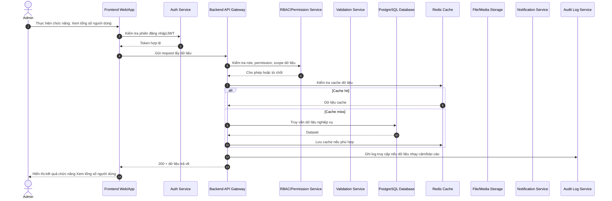

### 2. Xem tổng số khóa học

**Mục tiêu:** Mô tả luồng xử lý chi tiết cho chức năng **Xem tổng số khóa học** của đối tượng **Quản trị viên hệ thống**.


### 3. Xem tổng số lớp học phần

**Mục tiêu:** Mô tả luồng xử lý chi tiết cho chức năng **Xem tổng số lớp học phần** của đối tượng **Quản trị viên hệ thống**.

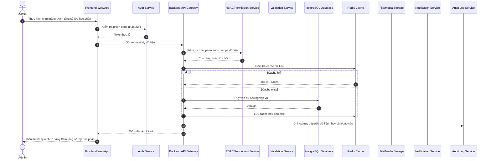

### 4. Xem lượt đăng nhập

**Mục tiêu:** Mô tả luồng xử lý chi tiết cho chức năng **Xem lượt đăng nhập** của đối tượng **Quản trị viên hệ thống**.

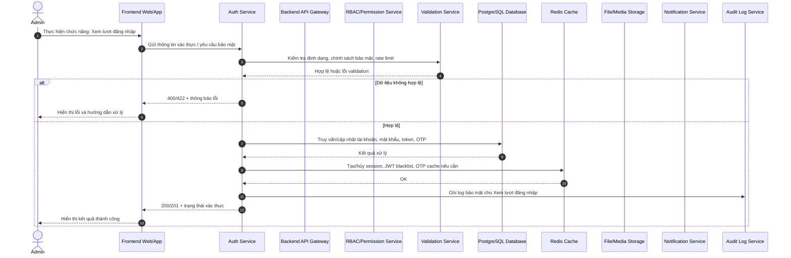

### 5. Xem hoạt động hệ thống

**Mục tiêu:** Mô tả luồng xử lý chi tiết cho chức năng **Xem hoạt động hệ thống** của đối tượng **Quản trị viên hệ thống**.


### 6. Xem dung lượng lưu trữ

**Mục tiêu:** Mô tả luồng xử lý chi tiết cho chức năng **Xem dung lượng lưu trữ** của đối tượng **Quản trị viên hệ thống**.


### 7. Xem cảnh báo hệ thống

**Mục tiêu:** Mô tả luồng xử lý chi tiết cho chức năng **Xem cảnh báo hệ thống** của đối tượng **Quản trị viên hệ thống**.

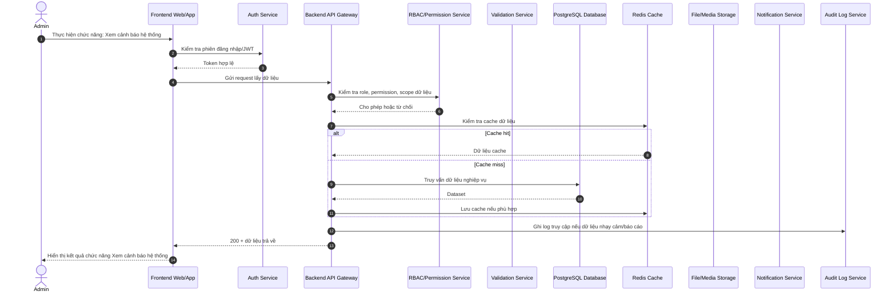

### 8. Xem thống kê nhanh

**Mục tiêu:** Mô tả luồng xử lý chi tiết cho chức năng **Xem thống kê nhanh** của đối tượng **Quản trị viên hệ thống**.

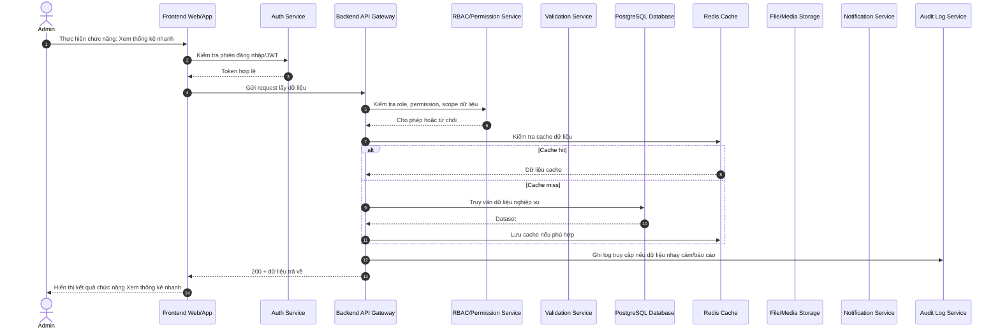

### 9. Theo dõi hiệu năng

**Mục tiêu:** Mô tả luồng xử lý chi tiết cho chức năng **Theo dõi hiệu năng** của đối tượng **Quản trị viên hệ thống**.

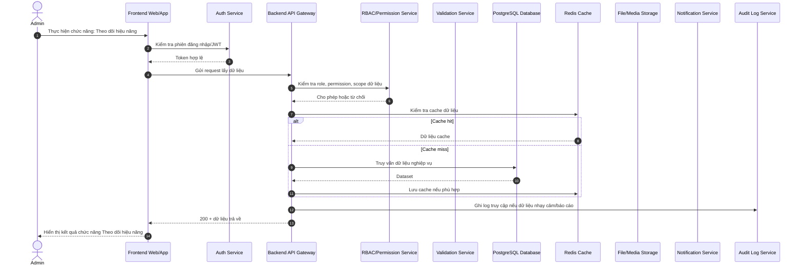

## 3.2. Quản lý người dùng

### 10. Tạo tài khoản

**Mục tiêu:** Mô tả luồng xử lý chi tiết cho chức năng **Tạo tài khoản** của đối tượng **Quản trị viên hệ thống**.


### 11. Sửa tài khoản

**Mục tiêu:** Mô tả luồng xử lý chi tiết cho chức năng **Sửa tài khoản** của đối tượng **Quản trị viên hệ thống**.

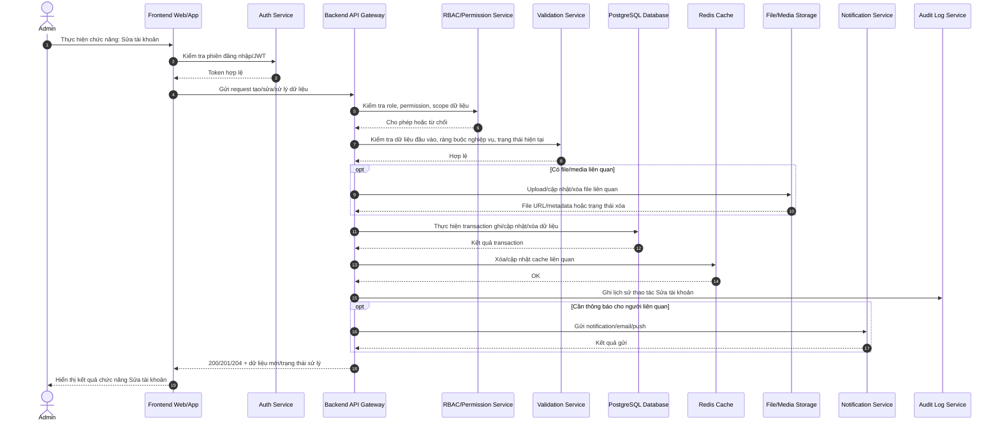

### 12. Xóa tài khoản

**Mục tiêu:** Mô tả luồng xử lý chi tiết cho chức năng **Xóa tài khoản** của đối tượng **Quản trị viên hệ thống**.

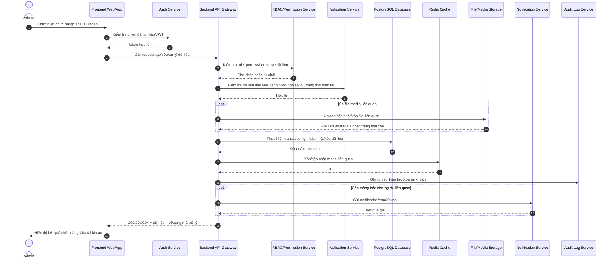

### 13. Khóa tài khoản

**Mục tiêu:** Mô tả luồng xử lý chi tiết cho chức năng **Khóa tài khoản** của đối tượng **Quản trị viên hệ thống**.

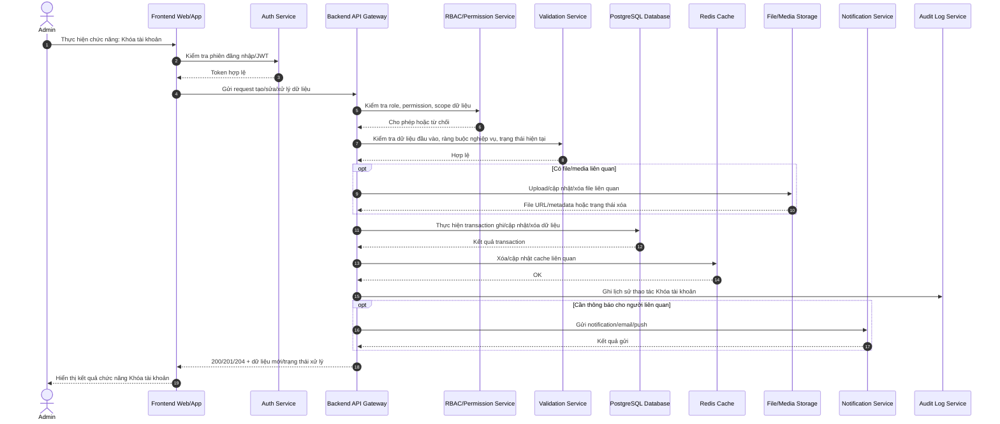

### 14. Mở khóa tài khoản

**Mục tiêu:** Mô tả luồng xử lý chi tiết cho chức năng **Mở khóa tài khoản** của đối tượng **Quản trị viên hệ thống**.


### 15. Reset mật khẩu

**Mục tiêu:** Mô tả luồng xử lý chi tiết cho chức năng **Reset mật khẩu** của đối tượng **Quản trị viên hệ thống**.


### 16. Bắt buộc đổi mật khẩu

**Mục tiêu:** Mô tả luồng xử lý chi tiết cho chức năng **Bắt buộc đổi mật khẩu** của đối tượng **Quản trị viên hệ thống**.

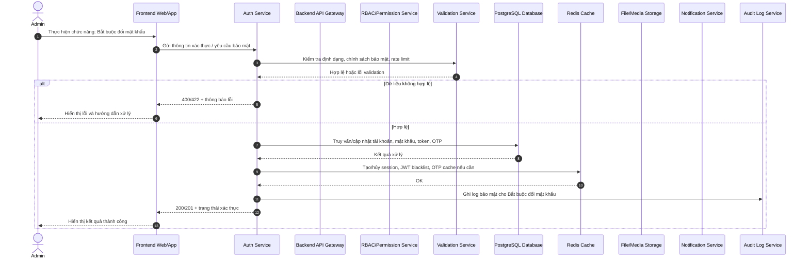

### 17. Import người dùng

**Mục tiêu:** Mô tả luồng xử lý chi tiết cho chức năng **Import người dùng** của đối tượng **Quản trị viên hệ thống**.

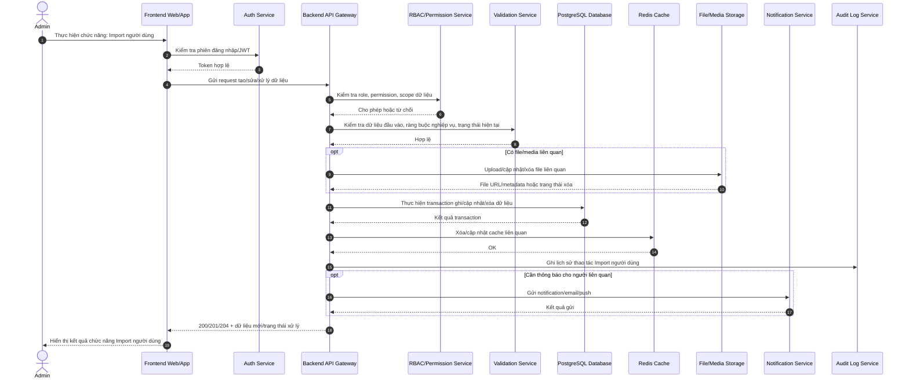

### 18. Export người dùng

**Mục tiêu:** Mô tả luồng xử lý chi tiết cho chức năng **Export người dùng** của đối tượng **Quản trị viên hệ thống**.

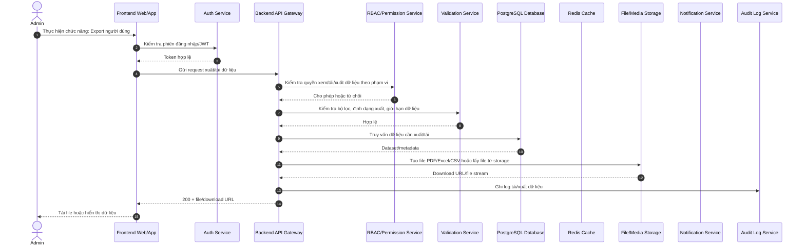

### 19. Tìm kiếm người dùng

**Mục tiêu:** Mô tả luồng xử lý chi tiết cho chức năng **Tìm kiếm người dùng** của đối tượng **Quản trị viên hệ thống**.

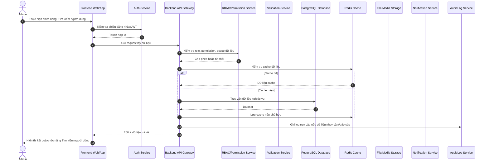

### 20. Lọc người dùng

**Mục tiêu:** Mô tả luồng xử lý chi tiết cho chức năng **Lọc người dùng** của đối tượng **Quản trị viên hệ thống**.

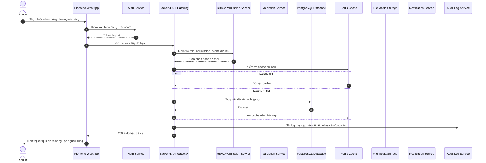

### 21. Xem hồ sơ người dùng

**Mục tiêu:** Mô tả luồng xử lý chi tiết cho chức năng **Xem hồ sơ người dùng** của đối tượng **Quản trị viên hệ thống**.

```mermaid
sequenceDiagram
    autonumber
    actor U as Admin
    participant FE as Frontend Web/App
    participant Auth as Auth Service
    participant API as Backend API Gateway
    participant RBAC as RBAC/Permission Service
    participant Val as Validation Service
    participant DB as PostgreSQL Database
    participant Cache as Redis Cache
    participant File as File/Media Storage
    participant Notify as Notification Service
    participant Audit as Audit Log Service
    U->>FE: Thực hiện chức năng: Xem hồ sơ người dùng
    FE->>Auth: Kiểm tra phiên đăng nhập/JWT
    Auth-->>FE: Token hợp lệ
    FE->>API: Gửi request lấy dữ liệu
    API->>RBAC: Kiểm tra role, permission, scope dữ liệu
    RBAC-->>API: Cho phép hoặc từ chối
    API->>Cache: Kiểm tra cache dữ liệu
    alt Cache hit
        Cache-->>API: Dữ liệu cache
    else Cache miss
        API->>DB: Truy vấn dữ liệu nghiệp vụ
        DB-->>API: Dataset
        API->>Cache: Lưu cache nếu phù hợp
    end
    API->>Audit: Ghi log truy cập nếu dữ liệu nhạy cảm/báo cáo
    API-->>FE: 200 + dữ liệu trả về
    FE-->>U: Hiển thị kết quả chức năng Xem hồ sơ người dùng
```

### 22. Xem lịch sử đăng nhập

**Mục tiêu:** Mô tả luồng xử lý chi tiết cho chức năng **Xem lịch sử đăng nhập** của đối tượng **Quản trị viên hệ thống**.

```mermaid
sequenceDiagram
    autonumber
    actor U as Admin
    participant FE as Frontend Web/App
    participant Auth as Auth Service
    participant API as Backend API Gateway
    participant RBAC as RBAC/Permission Service
    participant Val as Validation Service
    participant DB as PostgreSQL Database
    participant Cache as Redis Cache
    participant File as File/Media Storage
    participant Notify as Notification Service
    participant Audit as Audit Log Service
    U->>FE: Thực hiện chức năng: Xem lịch sử đăng nhập
    FE->>Auth: Gửi thông tin xác thực / yêu cầu bảo mật
    Auth->>Val: Kiểm tra định dạng, chính sách bảo mật, rate limit
    Val-->>Auth: Hợp lệ hoặc lỗi validation
    alt Dữ liệu không hợp lệ
        Auth-->>FE: 400/422 + thông báo lỗi
        FE-->>U: Hiển thị lỗi và hướng dẫn xử lý
    else Hợp lệ
        Auth->>DB: Truy vấn/cập nhật tài khoản, mật khẩu, token, OTP
        DB-->>Auth: Kết quả xử lý
        Auth->>Cache: Tạo/hủy session, JWT blacklist, OTP cache nếu cần
        Cache-->>Auth: OK
        Auth->>Audit: Ghi log bảo mật cho Xem lịch sử đăng nhập
        Auth-->>FE: 200/201 + trạng thái xác thực
        FE-->>U: Hiển thị kết quả thành công
    end
```

### 23. Xem hoạt động người dùng

**Mục tiêu:** Mô tả luồng xử lý chi tiết cho chức năng **Xem hoạt động người dùng** của đối tượng **Quản trị viên hệ thống**.

```mermaid
sequenceDiagram
    autonumber
    actor U as Admin
    participant FE as Frontend Web/App
    participant Auth as Auth Service
    participant API as Backend API Gateway
    participant RBAC as RBAC/Permission Service
    participant Val as Validation Service
    participant DB as PostgreSQL Database
    participant Cache as Redis Cache
    participant File as File/Media Storage
    participant Notify as Notification Service
    participant Audit as Audit Log Service
    U->>FE: Thực hiện chức năng: Xem hoạt động người dùng
    FE->>Auth: Kiểm tra phiên đăng nhập/JWT
    Auth-->>FE: Token hợp lệ
    FE->>API: Gửi request lấy dữ liệu
    API->>RBAC: Kiểm tra role, permission, scope dữ liệu
    RBAC-->>API: Cho phép hoặc từ chối
    API->>Cache: Kiểm tra cache dữ liệu
    alt Cache hit
        Cache-->>API: Dữ liệu cache
    else Cache miss
        API->>DB: Truy vấn dữ liệu nghiệp vụ
        DB-->>API: Dataset
        API->>Cache: Lưu cache nếu phù hợp
    end
    API->>Audit: Ghi log truy cập nếu dữ liệu nhạy cảm/báo cáo
    API-->>FE: 200 + dữ liệu trả về
    FE-->>U: Hiển thị kết quả chức năng Xem hoạt động người dùng
```

### 24. Gán người dùng vào khoa/lớp

**Mục tiêu:** Mô tả luồng xử lý chi tiết cho chức năng **Gán người dùng vào khoa/lớp** của đối tượng **Quản trị viên hệ thống**.

```mermaid
sequenceDiagram
    autonumber
    actor U as Admin
    participant FE as Frontend Web/App
    participant Auth as Auth Service
    participant API as Backend API Gateway
    participant RBAC as RBAC/Permission Service
    participant Val as Validation Service
    participant DB as PostgreSQL Database
    participant Cache as Redis Cache
    participant File as File/Media Storage
    participant Notify as Notification Service
    participant Audit as Audit Log Service
    U->>FE: Thực hiện chức năng: Gán người dùng vào khoa/lớp
    FE->>Auth: Kiểm tra phiên đăng nhập/JWT
    Auth-->>FE: Token hợp lệ
    FE->>API: Gửi request tạo/sửa/xử lý dữ liệu
    API->>RBAC: Kiểm tra role, permission, scope dữ liệu
    RBAC-->>API: Cho phép hoặc từ chối
    API->>Val: Kiểm tra dữ liệu đầu vào, ràng buộc nghiệp vụ, trạng thái hiện tại
    Val-->>API: Hợp lệ
    opt Có file/media liên quan
        API->>File: Upload/cập nhật/xóa file liên quan
        File-->>API: File URL/metadata hoặc trạng thái xóa
    end
    API->>DB: Thực hiện transaction ghi/cập nhật/xóa dữ liệu
    DB-->>API: Kết quả transaction
    API->>Cache: Xóa/cập nhật cache liên quan
    Cache-->>API: OK
    API->>Audit: Ghi lịch sử thao tác Gán người dùng vào khoa/lớp
    opt Cần thông báo cho người liên quan
        API->>Notify: Gửi notification/email/push
        Notify-->>API: Kết quả gửi
    end
    API-->>FE: 200/201/204 + dữ liệu mới/trạng thái xử lý
    FE-->>U: Hiển thị kết quả chức năng Gán người dùng vào khoa/lớp
```

### 25. Đồng bộ người dùng

**Mục tiêu:** Mô tả luồng xử lý chi tiết cho chức năng **Đồng bộ người dùng** của đối tượng **Quản trị viên hệ thống**.

```mermaid
sequenceDiagram
    autonumber
    actor U as Admin
    participant FE as Frontend Web/App
    participant Auth as Auth Service
    participant API as Backend API Gateway
    participant RBAC as RBAC/Permission Service
    participant Val as Validation Service
    participant DB as PostgreSQL Database
    participant Cache as Redis Cache
    participant File as File/Media Storage
    participant Notify as Notification Service
    participant Audit as Audit Log Service
    U->>FE: Thực hiện chức năng: Đồng bộ người dùng
    FE->>Auth: Kiểm tra phiên đăng nhập/JWT
    Auth-->>FE: Token hợp lệ
    FE->>API: Gửi request tạo/sửa/xử lý dữ liệu
    API->>RBAC: Kiểm tra role, permission, scope dữ liệu
    RBAC-->>API: Cho phép hoặc từ chối
    API->>Val: Kiểm tra dữ liệu đầu vào, ràng buộc nghiệp vụ, trạng thái hiện tại
    Val-->>API: Hợp lệ
    opt Có file/media liên quan
        API->>File: Upload/cập nhật/xóa file liên quan
        File-->>API: File URL/metadata hoặc trạng thái xóa
    end
    API->>DB: Thực hiện transaction ghi/cập nhật/xóa dữ liệu
    DB-->>API: Kết quả transaction
    API->>Cache: Xóa/cập nhật cache liên quan
    Cache-->>API: OK
    API->>Audit: Ghi lịch sử thao tác Đồng bộ người dùng
    opt Cần thông báo cho người liên quan
        API->>Notify: Gửi notification/email/push
        Notify-->>API: Kết quả gửi
    end
    API-->>FE: 200/201/204 + dữ liệu mới/trạng thái xử lý
    FE-->>U: Hiển thị kết quả chức năng Đồng bộ người dùng
```

### 26. Quản lý avatar

**Mục tiêu:** Mô tả luồng xử lý chi tiết cho chức năng **Quản lý avatar** của đối tượng **Quản trị viên hệ thống**.

```mermaid
sequenceDiagram
    autonumber
    actor U as Admin
    participant FE as Frontend Web/App
    participant Auth as Auth Service
    participant API as Backend API Gateway
    participant RBAC as RBAC/Permission Service
    participant Val as Validation Service
    participant DB as PostgreSQL Database
    participant Cache as Redis Cache
    participant File as File/Media Storage
    participant Notify as Notification Service
    participant Audit as Audit Log Service
    U->>FE: Thực hiện chức năng: Quản lý avatar
    FE->>Auth: Kiểm tra phiên đăng nhập/JWT
    Auth-->>FE: Token hợp lệ
    FE->>API: Gửi request lấy dữ liệu
    API->>RBAC: Kiểm tra role, permission, scope dữ liệu
    RBAC-->>API: Cho phép hoặc từ chối
    API->>Cache: Kiểm tra cache dữ liệu
    alt Cache hit
        Cache-->>API: Dữ liệu cache
    else Cache miss
        API->>DB: Truy vấn dữ liệu nghiệp vụ
        DB-->>API: Dataset
        API->>Cache: Lưu cache nếu phù hợp
    end
    API->>Audit: Ghi log truy cập nếu dữ liệu nhạy cảm/báo cáo
    API-->>FE: 200 + dữ liệu trả về
    FE-->>U: Hiển thị kết quả chức năng Quản lý avatar
```

## 3.3. Vai trò & phân quyền

### 27. Tạo vai trò

**Mục tiêu:** Mô tả luồng xử lý chi tiết cho chức năng **Tạo vai trò** của đối tượng **Quản trị viên hệ thống**.

```mermaid
sequenceDiagram
    autonumber
    actor U as Admin
    participant FE as Frontend Web/App
    participant Auth as Auth Service
    participant API as Backend API Gateway
    participant RBAC as RBAC/Permission Service
    participant Val as Validation Service
    participant DB as PostgreSQL Database
    participant Cache as Redis Cache
    participant File as File/Media Storage
    participant Notify as Notification Service
    participant Audit as Audit Log Service
    U->>FE: Thực hiện chức năng: Tạo vai trò
    FE->>Auth: Kiểm tra phiên đăng nhập/JWT
    Auth-->>FE: Token hợp lệ
    FE->>API: Gửi request tạo/sửa/xử lý dữ liệu
    API->>RBAC: Kiểm tra role, permission, scope dữ liệu
    RBAC-->>API: Cho phép hoặc từ chối
    API->>Val: Kiểm tra dữ liệu đầu vào, ràng buộc nghiệp vụ, trạng thái hiện tại
    Val-->>API: Hợp lệ
    opt Có file/media liên quan
        API->>File: Upload/cập nhật/xóa file liên quan
        File-->>API: File URL/metadata hoặc trạng thái xóa
    end
    API->>DB: Thực hiện transaction ghi/cập nhật/xóa dữ liệu
    DB-->>API: Kết quả transaction
    API->>Cache: Xóa/cập nhật cache liên quan
    Cache-->>API: OK
    API->>Audit: Ghi lịch sử thao tác Tạo vai trò
    opt Cần thông báo cho người liên quan
        API->>Notify: Gửi notification/email/push
        Notify-->>API: Kết quả gửi
    end
    API-->>FE: 200/201/204 + dữ liệu mới/trạng thái xử lý
    FE-->>U: Hiển thị kết quả chức năng Tạo vai trò
```

### 28. Sửa vai trò

**Mục tiêu:** Mô tả luồng xử lý chi tiết cho chức năng **Sửa vai trò** của đối tượng **Quản trị viên hệ thống**.

```mermaid
sequenceDiagram
    autonumber
    actor U as Admin
    participant FE as Frontend Web/App
    participant Auth as Auth Service
    participant API as Backend API Gateway
    participant RBAC as RBAC/Permission Service
    participant Val as Validation Service
    participant DB as PostgreSQL Database
    participant Cache as Redis Cache
    participant File as File/Media Storage
    participant Notify as Notification Service
    participant Audit as Audit Log Service
    U->>FE: Thực hiện chức năng: Sửa vai trò
    FE->>Auth: Kiểm tra phiên đăng nhập/JWT
    Auth-->>FE: Token hợp lệ
    FE->>API: Gửi request tạo/sửa/xử lý dữ liệu
    API->>RBAC: Kiểm tra role, permission, scope dữ liệu
    RBAC-->>API: Cho phép hoặc từ chối
    API->>Val: Kiểm tra dữ liệu đầu vào, ràng buộc nghiệp vụ, trạng thái hiện tại
    Val-->>API: Hợp lệ
    opt Có file/media liên quan
        API->>File: Upload/cập nhật/xóa file liên quan
        File-->>API: File URL/metadata hoặc trạng thái xóa
    end
    API->>DB: Thực hiện transaction ghi/cập nhật/xóa dữ liệu
    DB-->>API: Kết quả transaction
    API->>Cache: Xóa/cập nhật cache liên quan
    Cache-->>API: OK
    API->>Audit: Ghi lịch sử thao tác Sửa vai trò
    opt Cần thông báo cho người liên quan
        API->>Notify: Gửi notification/email/push
        Notify-->>API: Kết quả gửi
    end
    API-->>FE: 200/201/204 + dữ liệu mới/trạng thái xử lý
    FE-->>U: Hiển thị kết quả chức năng Sửa vai trò
```

### 29. Xóa vai trò

**Mục tiêu:** Mô tả luồng xử lý chi tiết cho chức năng **Xóa vai trò** của đối tượng **Quản trị viên hệ thống**.

```mermaid
sequenceDiagram
    autonumber
    actor U as Admin
    participant FE as Frontend Web/App
    participant Auth as Auth Service
    participant API as Backend API Gateway
    participant RBAC as RBAC/Permission Service
    participant Val as Validation Service
    participant DB as PostgreSQL Database
    participant Cache as Redis Cache
    participant File as File/Media Storage
    participant Notify as Notification Service
    participant Audit as Audit Log Service
    U->>FE: Thực hiện chức năng: Xóa vai trò
    FE->>Auth: Kiểm tra phiên đăng nhập/JWT
    Auth-->>FE: Token hợp lệ
    FE->>API: Gửi request tạo/sửa/xử lý dữ liệu
    API->>RBAC: Kiểm tra role, permission, scope dữ liệu
    RBAC-->>API: Cho phép hoặc từ chối
    API->>Val: Kiểm tra dữ liệu đầu vào, ràng buộc nghiệp vụ, trạng thái hiện tại
    Val-->>API: Hợp lệ
    opt Có file/media liên quan
        API->>File: Upload/cập nhật/xóa file liên quan
        File-->>API: File URL/metadata hoặc trạng thái xóa
    end
    API->>DB: Thực hiện transaction ghi/cập nhật/xóa dữ liệu
    DB-->>API: Kết quả transaction
    API->>Cache: Xóa/cập nhật cache liên quan
    Cache-->>API: OK
    API->>Audit: Ghi lịch sử thao tác Xóa vai trò
    opt Cần thông báo cho người liên quan
        API->>Notify: Gửi notification/email/push
        Notify-->>API: Kết quả gửi
    end
    API-->>FE: 200/201/204 + dữ liệu mới/trạng thái xử lý
    FE-->>U: Hiển thị kết quả chức năng Xóa vai trò
```

### 30. Gán vai trò

**Mục tiêu:** Mô tả luồng xử lý chi tiết cho chức năng **Gán vai trò** của đối tượng **Quản trị viên hệ thống**.

```mermaid
sequenceDiagram
    autonumber
    actor U as Admin
    participant FE as Frontend Web/App
    participant Auth as Auth Service
    participant API as Backend API Gateway
    participant RBAC as RBAC/Permission Service
    participant Val as Validation Service
    participant DB as PostgreSQL Database
    participant Cache as Redis Cache
    participant File as File/Media Storage
    participant Notify as Notification Service
    participant Audit as Audit Log Service
    U->>FE: Thực hiện chức năng: Gán vai trò
    FE->>Auth: Kiểm tra phiên đăng nhập/JWT
    Auth-->>FE: Token hợp lệ
    FE->>API: Gửi request tạo/sửa/xử lý dữ liệu
    API->>RBAC: Kiểm tra role, permission, scope dữ liệu
    RBAC-->>API: Cho phép hoặc từ chối
    API->>Val: Kiểm tra dữ liệu đầu vào, ràng buộc nghiệp vụ, trạng thái hiện tại
    Val-->>API: Hợp lệ
    opt Có file/media liên quan
        API->>File: Upload/cập nhật/xóa file liên quan
        File-->>API: File URL/metadata hoặc trạng thái xóa
    end
    API->>DB: Thực hiện transaction ghi/cập nhật/xóa dữ liệu
    DB-->>API: Kết quả transaction
    API->>Cache: Xóa/cập nhật cache liên quan
    Cache-->>API: OK
    API->>Audit: Ghi lịch sử thao tác Gán vai trò
    opt Cần thông báo cho người liên quan
        API->>Notify: Gửi notification/email/push
        Notify-->>API: Kết quả gửi
    end
    API-->>FE: 200/201/204 + dữ liệu mới/trạng thái xử lý
    FE-->>U: Hiển thị kết quả chức năng Gán vai trò
```

### 31. Thu hồi vai trò

**Mục tiêu:** Mô tả luồng xử lý chi tiết cho chức năng **Thu hồi vai trò** của đối tượng **Quản trị viên hệ thống**.

```mermaid
sequenceDiagram
    autonumber
    actor U as Admin
    participant FE as Frontend Web/App
    participant Auth as Auth Service
    participant API as Backend API Gateway
    participant RBAC as RBAC/Permission Service
    participant Val as Validation Service
    participant DB as PostgreSQL Database
    participant Cache as Redis Cache
    participant File as File/Media Storage
    participant Notify as Notification Service
    participant Audit as Audit Log Service
    U->>FE: Thực hiện chức năng: Thu hồi vai trò
    FE->>Auth: Kiểm tra phiên đăng nhập/JWT
    Auth-->>FE: Token hợp lệ
    FE->>API: Gửi request tạo/sửa/xử lý dữ liệu
    API->>RBAC: Kiểm tra role, permission, scope dữ liệu
    RBAC-->>API: Cho phép hoặc từ chối
    API->>Val: Kiểm tra dữ liệu đầu vào, ràng buộc nghiệp vụ, trạng thái hiện tại
    Val-->>API: Hợp lệ
    opt Có file/media liên quan
        API->>File: Upload/cập nhật/xóa file liên quan
        File-->>API: File URL/metadata hoặc trạng thái xóa
    end
    API->>DB: Thực hiện transaction ghi/cập nhật/xóa dữ liệu
    DB-->>API: Kết quả transaction
    API->>Cache: Xóa/cập nhật cache liên quan
    Cache-->>API: OK
    API->>Audit: Ghi lịch sử thao tác Thu hồi vai trò
    opt Cần thông báo cho người liên quan
        API->>Notify: Gửi notification/email/push
        Notify-->>API: Kết quả gửi
    end
    API-->>FE: 200/201/204 + dữ liệu mới/trạng thái xử lý
    FE-->>U: Hiển thị kết quả chức năng Thu hồi vai trò
```

### 32. Tạo quyền chức năng

**Mục tiêu:** Mô tả luồng xử lý chi tiết cho chức năng **Tạo quyền chức năng** của đối tượng **Quản trị viên hệ thống**.

```mermaid
sequenceDiagram
    autonumber
    actor U as Admin
    participant FE as Frontend Web/App
    participant Auth as Auth Service
    participant API as Backend API Gateway
    participant RBAC as RBAC/Permission Service
    participant Val as Validation Service
    participant DB as PostgreSQL Database
    participant Cache as Redis Cache
    participant File as File/Media Storage
    participant Notify as Notification Service
    participant Audit as Audit Log Service
    U->>FE: Thực hiện chức năng: Tạo quyền chức năng
    FE->>Auth: Kiểm tra phiên đăng nhập/JWT
    Auth-->>FE: Token hợp lệ
    FE->>API: Gửi request tạo/sửa/xử lý dữ liệu
    API->>RBAC: Kiểm tra role, permission, scope dữ liệu
    RBAC-->>API: Cho phép hoặc từ chối
    API->>Val: Kiểm tra dữ liệu đầu vào, ràng buộc nghiệp vụ, trạng thái hiện tại
    Val-->>API: Hợp lệ
    opt Có file/media liên quan
        API->>File: Upload/cập nhật/xóa file liên quan
        File-->>API: File URL/metadata hoặc trạng thái xóa
    end
    API->>DB: Thực hiện transaction ghi/cập nhật/xóa dữ liệu
    DB-->>API: Kết quả transaction
    API->>Cache: Xóa/cập nhật cache liên quan
    Cache-->>API: OK
    API->>Audit: Ghi lịch sử thao tác Tạo quyền chức năng
    opt Cần thông báo cho người liên quan
        API->>Notify: Gửi notification/email/push
        Notify-->>API: Kết quả gửi
    end
    API-->>FE: 200/201/204 + dữ liệu mới/trạng thái xử lý
    FE-->>U: Hiển thị kết quả chức năng Tạo quyền chức năng
```

### 33. Cấu hình CRUD

**Mục tiêu:** Mô tả luồng xử lý chi tiết cho chức năng **Cấu hình CRUD** của đối tượng **Quản trị viên hệ thống**.

```mermaid
sequenceDiagram
    autonumber
    actor U as Admin
    participant FE as Frontend Web/App
    participant Auth as Auth Service
    participant API as Backend API Gateway
    participant RBAC as RBAC/Permission Service
    participant Val as Validation Service
    participant DB as PostgreSQL Database
    participant Cache as Redis Cache
    participant File as File/Media Storage
    participant Notify as Notification Service
    participant Audit as Audit Log Service
    U->>FE: Thực hiện chức năng: Cấu hình CRUD
    FE->>Auth: Kiểm tra phiên đăng nhập/JWT
    Auth-->>FE: Token hợp lệ
    FE->>API: Gửi request tạo/sửa/xử lý dữ liệu
    API->>RBAC: Kiểm tra role, permission, scope dữ liệu
    RBAC-->>API: Cho phép hoặc từ chối
    API->>Val: Kiểm tra dữ liệu đầu vào, ràng buộc nghiệp vụ, trạng thái hiện tại
    Val-->>API: Hợp lệ
    opt Có file/media liên quan
        API->>File: Upload/cập nhật/xóa file liên quan
        File-->>API: File URL/metadata hoặc trạng thái xóa
    end
    API->>DB: Thực hiện transaction ghi/cập nhật/xóa dữ liệu
    DB-->>API: Kết quả transaction
    API->>Cache: Xóa/cập nhật cache liên quan
    Cache-->>API: OK
    API->>Audit: Ghi lịch sử thao tác Cấu hình CRUD
    opt Cần thông báo cho người liên quan
        API->>Notify: Gửi notification/email/push
        Notify-->>API: Kết quả gửi
    end
    API-->>FE: 200/201/204 + dữ liệu mới/trạng thái xử lý
    FE-->>U: Hiển thị kết quả chức năng Cấu hình CRUD
```

### 34. Phân quyền theo dữ liệu

**Mục tiêu:** Mô tả luồng xử lý chi tiết cho chức năng **Phân quyền theo dữ liệu** của đối tượng **Quản trị viên hệ thống**.

```mermaid
sequenceDiagram
    autonumber
    actor U as Admin
    participant FE as Frontend Web/App
    participant Auth as Auth Service
    participant API as Backend API Gateway
    participant RBAC as RBAC/Permission Service
    participant Val as Validation Service
    participant DB as PostgreSQL Database
    participant Cache as Redis Cache
    participant File as File/Media Storage
    participant Notify as Notification Service
    participant Audit as Audit Log Service
    U->>FE: Thực hiện chức năng: Phân quyền theo dữ liệu
    FE->>Auth: Kiểm tra phiên đăng nhập/JWT
    Auth-->>FE: Token hợp lệ
    FE->>API: Gửi request lấy dữ liệu
    API->>RBAC: Kiểm tra role, permission, scope dữ liệu
    RBAC-->>API: Cho phép hoặc từ chối
    API->>Cache: Kiểm tra cache dữ liệu
    alt Cache hit
        Cache-->>API: Dữ liệu cache
    else Cache miss
        API->>DB: Truy vấn dữ liệu nghiệp vụ
        DB-->>API: Dataset
        API->>Cache: Lưu cache nếu phù hợp
    end
    API->>Audit: Ghi log truy cập nếu dữ liệu nhạy cảm/báo cáo
    API-->>FE: 200 + dữ liệu trả về
    FE-->>U: Hiển thị kết quả chức năng Phân quyền theo dữ liệu
```

### 35. Phân quyền menu

**Mục tiêu:** Mô tả luồng xử lý chi tiết cho chức năng **Phân quyền menu** của đối tượng **Quản trị viên hệ thống**.

```mermaid
sequenceDiagram
    autonumber
    actor U as Admin
    participant FE as Frontend Web/App
    participant Auth as Auth Service
    participant API as Backend API Gateway
    participant RBAC as RBAC/Permission Service
    participant Val as Validation Service
    participant DB as PostgreSQL Database
    participant Cache as Redis Cache
    participant File as File/Media Storage
    participant Notify as Notification Service
    participant Audit as Audit Log Service
    U->>FE: Thực hiện chức năng: Phân quyền menu
    FE->>Auth: Kiểm tra phiên đăng nhập/JWT
    Auth-->>FE: Token hợp lệ
    FE->>API: Gửi request lấy dữ liệu
    API->>RBAC: Kiểm tra role, permission, scope dữ liệu
    RBAC-->>API: Cho phép hoặc từ chối
    API->>Cache: Kiểm tra cache dữ liệu
    alt Cache hit
        Cache-->>API: Dữ liệu cache
    else Cache miss
        API->>DB: Truy vấn dữ liệu nghiệp vụ
        DB-->>API: Dataset
        API->>Cache: Lưu cache nếu phù hợp
    end
    API->>Audit: Ghi log truy cập nếu dữ liệu nhạy cảm/báo cáo
    API-->>FE: 200 + dữ liệu trả về
    FE-->>U: Hiển thị kết quả chức năng Phân quyền menu
```

### 36. Phân quyền báo cáo

**Mục tiêu:** Mô tả luồng xử lý chi tiết cho chức năng **Phân quyền báo cáo** của đối tượng **Quản trị viên hệ thống**.

```mermaid
sequenceDiagram
    autonumber
    actor U as Admin
    participant FE as Frontend Web/App
    participant Auth as Auth Service
    participant API as Backend API Gateway
    participant RBAC as RBAC/Permission Service
    participant Val as Validation Service
    participant DB as PostgreSQL Database
    participant Cache as Redis Cache
    participant File as File/Media Storage
    participant Notify as Notification Service
    participant Audit as Audit Log Service
    U->>FE: Thực hiện chức năng: Phân quyền báo cáo
    FE->>Auth: Kiểm tra phiên đăng nhập/JWT
    Auth-->>FE: Token hợp lệ
    FE->>API: Gửi request lấy dữ liệu
    API->>RBAC: Kiểm tra role, permission, scope dữ liệu
    RBAC-->>API: Cho phép hoặc từ chối
    API->>Cache: Kiểm tra cache dữ liệu
    alt Cache hit
        Cache-->>API: Dữ liệu cache
    else Cache miss
        API->>DB: Truy vấn dữ liệu nghiệp vụ
        DB-->>API: Dataset
        API->>Cache: Lưu cache nếu phù hợp
    end
    API->>Audit: Ghi log truy cập nếu dữ liệu nhạy cảm/báo cáo
    API-->>FE: 200 + dữ liệu trả về
    FE-->>U: Hiển thị kết quả chức năng Phân quyền báo cáo
```

### 37. Phân quyền nội dung

**Mục tiêu:** Mô tả luồng xử lý chi tiết cho chức năng **Phân quyền nội dung** của đối tượng **Quản trị viên hệ thống**.

```mermaid
sequenceDiagram
    autonumber
    actor U as Admin
    participant FE as Frontend Web/App
    participant Auth as Auth Service
    participant API as Backend API Gateway
    participant RBAC as RBAC/Permission Service
    participant Val as Validation Service
    participant DB as PostgreSQL Database
    participant Cache as Redis Cache
    participant File as File/Media Storage
    participant Notify as Notification Service
    participant Audit as Audit Log Service
    U->>FE: Thực hiện chức năng: Phân quyền nội dung
    FE->>Auth: Kiểm tra phiên đăng nhập/JWT
    Auth-->>FE: Token hợp lệ
    FE->>API: Gửi request lấy dữ liệu
    API->>RBAC: Kiểm tra role, permission, scope dữ liệu
    RBAC-->>API: Cho phép hoặc từ chối
    API->>Cache: Kiểm tra cache dữ liệu
    alt Cache hit
        Cache-->>API: Dữ liệu cache
    else Cache miss
        API->>DB: Truy vấn dữ liệu nghiệp vụ
        DB-->>API: Dataset
        API->>Cache: Lưu cache nếu phù hợp
    end
    API->>Audit: Ghi log truy cập nếu dữ liệu nhạy cảm/báo cáo
    API-->>FE: 200 + dữ liệu trả về
    FE-->>U: Hiển thị kết quả chức năng Phân quyền nội dung
```

### 38. Xem ma trận quyền

**Mục tiêu:** Mô tả luồng xử lý chi tiết cho chức năng **Xem ma trận quyền** của đối tượng **Quản trị viên hệ thống**.

```mermaid
sequenceDiagram
    autonumber
    actor U as Admin
    participant FE as Frontend Web/App
    participant Auth as Auth Service
    participant API as Backend API Gateway
    participant RBAC as RBAC/Permission Service
    participant Val as Validation Service
    participant DB as PostgreSQL Database
    participant Cache as Redis Cache
    participant File as File/Media Storage
    participant Notify as Notification Service
    participant Audit as Audit Log Service
    U->>FE: Thực hiện chức năng: Xem ma trận quyền
    FE->>Auth: Kiểm tra phiên đăng nhập/JWT
    Auth-->>FE: Token hợp lệ
    FE->>API: Gửi request lấy dữ liệu
    API->>RBAC: Kiểm tra role, permission, scope dữ liệu
    RBAC-->>API: Cho phép hoặc từ chối
    API->>Cache: Kiểm tra cache dữ liệu
    alt Cache hit
        Cache-->>API: Dữ liệu cache
    else Cache miss
        API->>DB: Truy vấn dữ liệu nghiệp vụ
        DB-->>API: Dataset
        API->>Cache: Lưu cache nếu phù hợp
    end
    API->>Audit: Ghi log truy cập nếu dữ liệu nhạy cảm/báo cáo
    API-->>FE: 200 + dữ liệu trả về
    FE-->>U: Hiển thị kết quả chức năng Xem ma trận quyền
```

### 39. Sao chép quyền

**Mục tiêu:** Mô tả luồng xử lý chi tiết cho chức năng **Sao chép quyền** của đối tượng **Quản trị viên hệ thống**.

```mermaid
sequenceDiagram
    autonumber
    actor U as Admin
    participant FE as Frontend Web/App
    participant Auth as Auth Service
    participant API as Backend API Gateway
    participant RBAC as RBAC/Permission Service
    participant Val as Validation Service
    participant DB as PostgreSQL Database
    participant Cache as Redis Cache
    participant File as File/Media Storage
    participant Notify as Notification Service
    participant Audit as Audit Log Service
    U->>FE: Thực hiện chức năng: Sao chép quyền
    FE->>Auth: Kiểm tra phiên đăng nhập/JWT
    Auth-->>FE: Token hợp lệ
    FE->>API: Gửi request tạo/sửa/xử lý dữ liệu
    API->>RBAC: Kiểm tra role, permission, scope dữ liệu
    RBAC-->>API: Cho phép hoặc từ chối
    API->>Val: Kiểm tra dữ liệu đầu vào, ràng buộc nghiệp vụ, trạng thái hiện tại
    Val-->>API: Hợp lệ
    opt Có file/media liên quan
        API->>File: Upload/cập nhật/xóa file liên quan
        File-->>API: File URL/metadata hoặc trạng thái xóa
    end
    API->>DB: Thực hiện transaction ghi/cập nhật/xóa dữ liệu
    DB-->>API: Kết quả transaction
    API->>Cache: Xóa/cập nhật cache liên quan
    Cache-->>API: OK
    API->>Audit: Ghi lịch sử thao tác Sao chép quyền
    opt Cần thông báo cho người liên quan
        API->>Notify: Gửi notification/email/push
        Notify-->>API: Kết quả gửi
    end
    API-->>FE: 200/201/204 + dữ liệu mới/trạng thái xử lý
    FE-->>U: Hiển thị kết quả chức năng Sao chép quyền
```

### 40. Audit thay đổi quyền

**Mục tiêu:** Mô tả luồng xử lý chi tiết cho chức năng **Audit thay đổi quyền** của đối tượng **Quản trị viên hệ thống**.

```mermaid
sequenceDiagram
    autonumber
    actor U as Admin
    participant FE as Frontend Web/App
    participant Auth as Auth Service
    participant API as Backend API Gateway
    participant RBAC as RBAC/Permission Service
    participant Val as Validation Service
    participant DB as PostgreSQL Database
    participant Cache as Redis Cache
    participant File as File/Media Storage
    participant Notify as Notification Service
    participant Audit as Audit Log Service
    U->>FE: Thực hiện chức năng: Audit thay đổi quyền
    FE->>Auth: Kiểm tra phiên đăng nhập/JWT
    Auth-->>FE: Token hợp lệ
    FE->>API: Gửi request lấy dữ liệu
    API->>RBAC: Kiểm tra role, permission, scope dữ liệu
    RBAC-->>API: Cho phép hoặc từ chối
    API->>Cache: Kiểm tra cache dữ liệu
    alt Cache hit
        Cache-->>API: Dữ liệu cache
    else Cache miss
        API->>DB: Truy vấn dữ liệu nghiệp vụ
        DB-->>API: Dataset
        API->>Cache: Lưu cache nếu phù hợp
    end
    API->>Audit: Ghi log truy cập nếu dữ liệu nhạy cảm/báo cáo
    API-->>FE: 200 + dữ liệu trả về
    FE-->>U: Hiển thị kết quả chức năng Audit thay đổi quyền
```

## 3.4. Quản lý tổ chức trường học

### 41. Quản lý cơ sở/campus

**Mục tiêu:** Mô tả luồng xử lý chi tiết cho chức năng **Quản lý cơ sở/campus** của đối tượng **Quản trị viên hệ thống**.

```mermaid
sequenceDiagram
    autonumber
    actor U as Admin
    participant FE as Frontend Web/App
    participant Auth as Auth Service
    participant API as Backend API Gateway
    participant RBAC as RBAC/Permission Service
    participant Val as Validation Service
    participant DB as PostgreSQL Database
    participant Cache as Redis Cache
    participant File as File/Media Storage
    participant Notify as Notification Service
    participant Audit as Audit Log Service
    U->>FE: Thực hiện chức năng: Quản lý cơ sở/campus
    FE->>Auth: Kiểm tra phiên đăng nhập/JWT
    Auth-->>FE: Token hợp lệ
    FE->>API: Gửi request lấy dữ liệu
    API->>RBAC: Kiểm tra role, permission, scope dữ liệu
    RBAC-->>API: Cho phép hoặc từ chối
    API->>Cache: Kiểm tra cache dữ liệu
    alt Cache hit
        Cache-->>API: Dữ liệu cache
    else Cache miss
        API->>DB: Truy vấn dữ liệu nghiệp vụ
        DB-->>API: Dataset
        API->>Cache: Lưu cache nếu phù hợp
    end
    API->>Audit: Ghi log truy cập nếu dữ liệu nhạy cảm/báo cáo
    API-->>FE: 200 + dữ liệu trả về
    FE-->>U: Hiển thị kết quả chức năng Quản lý cơ sở/campus
```

### 42. Quản lý khoa

**Mục tiêu:** Mô tả luồng xử lý chi tiết cho chức năng **Quản lý khoa** của đối tượng **Quản trị viên hệ thống**.

```mermaid
sequenceDiagram
    autonumber
    actor U as Admin
    participant FE as Frontend Web/App
    participant Auth as Auth Service
    participant API as Backend API Gateway
    participant RBAC as RBAC/Permission Service
    participant Val as Validation Service
    participant DB as PostgreSQL Database
    participant Cache as Redis Cache
    participant File as File/Media Storage
    participant Notify as Notification Service
    participant Audit as Audit Log Service
    U->>FE: Thực hiện chức năng: Quản lý khoa
    FE->>Auth: Kiểm tra phiên đăng nhập/JWT
    Auth-->>FE: Token hợp lệ
    FE->>API: Gửi request lấy dữ liệu
    API->>RBAC: Kiểm tra role, permission, scope dữ liệu
    RBAC-->>API: Cho phép hoặc từ chối
    API->>Cache: Kiểm tra cache dữ liệu
    alt Cache hit
        Cache-->>API: Dữ liệu cache
    else Cache miss
        API->>DB: Truy vấn dữ liệu nghiệp vụ
        DB-->>API: Dataset
        API->>Cache: Lưu cache nếu phù hợp
    end
    API->>Audit: Ghi log truy cập nếu dữ liệu nhạy cảm/báo cáo
    API-->>FE: 200 + dữ liệu trả về
    FE-->>U: Hiển thị kết quả chức năng Quản lý khoa
```

### 43. Quản lý bộ môn

**Mục tiêu:** Mô tả luồng xử lý chi tiết cho chức năng **Quản lý bộ môn** của đối tượng **Quản trị viên hệ thống**.

```mermaid
sequenceDiagram
    autonumber
    actor U as Admin
    participant FE as Frontend Web/App
    participant Auth as Auth Service
    participant API as Backend API Gateway
    participant RBAC as RBAC/Permission Service
    participant Val as Validation Service
    participant DB as PostgreSQL Database
    participant Cache as Redis Cache
    participant File as File/Media Storage
    participant Notify as Notification Service
    participant Audit as Audit Log Service
    U->>FE: Thực hiện chức năng: Quản lý bộ môn
    FE->>Auth: Kiểm tra phiên đăng nhập/JWT
    Auth-->>FE: Token hợp lệ
    FE->>API: Gửi request lấy dữ liệu
    API->>RBAC: Kiểm tra role, permission, scope dữ liệu
    RBAC-->>API: Cho phép hoặc từ chối
    API->>Cache: Kiểm tra cache dữ liệu
    alt Cache hit
        Cache-->>API: Dữ liệu cache
    else Cache miss
        API->>DB: Truy vấn dữ liệu nghiệp vụ
        DB-->>API: Dataset
        API->>Cache: Lưu cache nếu phù hợp
    end
    API->>Audit: Ghi log truy cập nếu dữ liệu nhạy cảm/báo cáo
    API-->>FE: 200 + dữ liệu trả về
    FE-->>U: Hiển thị kết quả chức năng Quản lý bộ môn
```

### 44. Quản lý phòng ban

**Mục tiêu:** Mô tả luồng xử lý chi tiết cho chức năng **Quản lý phòng ban** của đối tượng **Quản trị viên hệ thống**.

```mermaid
sequenceDiagram
    autonumber
    actor U as Admin
    participant FE as Frontend Web/App
    participant Auth as Auth Service
    participant API as Backend API Gateway
    participant RBAC as RBAC/Permission Service
    participant Val as Validation Service
    participant DB as PostgreSQL Database
    participant Cache as Redis Cache
    participant File as File/Media Storage
    participant Notify as Notification Service
    participant Audit as Audit Log Service
    U->>FE: Thực hiện chức năng: Quản lý phòng ban
    FE->>Auth: Kiểm tra phiên đăng nhập/JWT
    Auth-->>FE: Token hợp lệ
    FE->>API: Gửi request lấy dữ liệu
    API->>RBAC: Kiểm tra role, permission, scope dữ liệu
    RBAC-->>API: Cho phép hoặc từ chối
    API->>Cache: Kiểm tra cache dữ liệu
    alt Cache hit
        Cache-->>API: Dữ liệu cache
    else Cache miss
        API->>DB: Truy vấn dữ liệu nghiệp vụ
        DB-->>API: Dataset
        API->>Cache: Lưu cache nếu phù hợp
    end
    API->>Audit: Ghi log truy cập nếu dữ liệu nhạy cảm/báo cáo
    API-->>FE: 200 + dữ liệu trả về
    FE-->>U: Hiển thị kết quả chức năng Quản lý phòng ban
```

### 45. Quản lý ngành học

**Mục tiêu:** Mô tả luồng xử lý chi tiết cho chức năng **Quản lý ngành học** của đối tượng **Quản trị viên hệ thống**.

```mermaid
sequenceDiagram
    autonumber
    actor U as Admin
    participant FE as Frontend Web/App
    participant Auth as Auth Service
    participant API as Backend API Gateway
    participant RBAC as RBAC/Permission Service
    participant Val as Validation Service
    participant DB as PostgreSQL Database
    participant Cache as Redis Cache
    participant File as File/Media Storage
    participant Notify as Notification Service
    participant Audit as Audit Log Service
    U->>FE: Thực hiện chức năng: Quản lý ngành học
    FE->>Auth: Kiểm tra phiên đăng nhập/JWT
    Auth-->>FE: Token hợp lệ
    FE->>API: Gửi request lấy dữ liệu
    API->>RBAC: Kiểm tra role, permission, scope dữ liệu
    RBAC-->>API: Cho phép hoặc từ chối
    API->>Cache: Kiểm tra cache dữ liệu
    alt Cache hit
        Cache-->>API: Dữ liệu cache
    else Cache miss
        API->>DB: Truy vấn dữ liệu nghiệp vụ
        DB-->>API: Dataset
        API->>Cache: Lưu cache nếu phù hợp
    end
    API->>Audit: Ghi log truy cập nếu dữ liệu nhạy cảm/báo cáo
    API-->>FE: 200 + dữ liệu trả về
    FE-->>U: Hiển thị kết quả chức năng Quản lý ngành học
```

### 46. Quản lý chuyên ngành

**Mục tiêu:** Mô tả luồng xử lý chi tiết cho chức năng **Quản lý chuyên ngành** của đối tượng **Quản trị viên hệ thống**.

```mermaid
sequenceDiagram
    autonumber
    actor U as Admin
    participant FE as Frontend Web/App
    participant Auth as Auth Service
    participant API as Backend API Gateway
    participant RBAC as RBAC/Permission Service
    participant Val as Validation Service
    participant DB as PostgreSQL Database
    participant Cache as Redis Cache
    participant File as File/Media Storage
    participant Notify as Notification Service
    participant Audit as Audit Log Service
    U->>FE: Thực hiện chức năng: Quản lý chuyên ngành
    FE->>Auth: Kiểm tra phiên đăng nhập/JWT
    Auth-->>FE: Token hợp lệ
    FE->>API: Gửi request lấy dữ liệu
    API->>RBAC: Kiểm tra role, permission, scope dữ liệu
    RBAC-->>API: Cho phép hoặc từ chối
    API->>Cache: Kiểm tra cache dữ liệu
    alt Cache hit
        Cache-->>API: Dữ liệu cache
    else Cache miss
        API->>DB: Truy vấn dữ liệu nghiệp vụ
        DB-->>API: Dataset
        API->>Cache: Lưu cache nếu phù hợp
    end
    API->>Audit: Ghi log truy cập nếu dữ liệu nhạy cảm/báo cáo
    API-->>FE: 200 + dữ liệu trả về
    FE-->>U: Hiển thị kết quả chức năng Quản lý chuyên ngành
```

### 47. Quản lý lớp hành chính

**Mục tiêu:** Mô tả luồng xử lý chi tiết cho chức năng **Quản lý lớp hành chính** của đối tượng **Quản trị viên hệ thống**.

```mermaid
sequenceDiagram
    autonumber
    actor U as Admin
    participant FE as Frontend Web/App
    participant Auth as Auth Service
    participant API as Backend API Gateway
    participant RBAC as RBAC/Permission Service
    participant Val as Validation Service
    participant DB as PostgreSQL Database
    participant Cache as Redis Cache
    participant File as File/Media Storage
    participant Notify as Notification Service
    participant Audit as Audit Log Service
    U->>FE: Thực hiện chức năng: Quản lý lớp hành chính
    FE->>Auth: Kiểm tra phiên đăng nhập/JWT
    Auth-->>FE: Token hợp lệ
    FE->>API: Gửi request lấy dữ liệu
    API->>RBAC: Kiểm tra role, permission, scope dữ liệu
    RBAC-->>API: Cho phép hoặc từ chối
    API->>Cache: Kiểm tra cache dữ liệu
    alt Cache hit
        Cache-->>API: Dữ liệu cache
    else Cache miss
        API->>DB: Truy vấn dữ liệu nghiệp vụ
        DB-->>API: Dataset
        API->>Cache: Lưu cache nếu phù hợp
    end
    API->>Audit: Ghi log truy cập nếu dữ liệu nhạy cảm/báo cáo
    API-->>FE: 200 + dữ liệu trả về
    FE-->>U: Hiển thị kết quả chức năng Quản lý lớp hành chính
```

### 48. Quản lý niên khóa

**Mục tiêu:** Mô tả luồng xử lý chi tiết cho chức năng **Quản lý niên khóa** của đối tượng **Quản trị viên hệ thống**.

```mermaid
sequenceDiagram
    autonumber
    actor U as Admin
    participant FE as Frontend Web/App
    participant Auth as Auth Service
    participant API as Backend API Gateway
    participant RBAC as RBAC/Permission Service
    participant Val as Validation Service
    participant DB as PostgreSQL Database
    participant Cache as Redis Cache
    participant File as File/Media Storage
    participant Notify as Notification Service
    participant Audit as Audit Log Service
    U->>FE: Thực hiện chức năng: Quản lý niên khóa
    FE->>Auth: Kiểm tra phiên đăng nhập/JWT
    Auth-->>FE: Token hợp lệ
    FE->>API: Gửi request tạo/sửa/xử lý dữ liệu
    API->>RBAC: Kiểm tra role, permission, scope dữ liệu
    RBAC-->>API: Cho phép hoặc từ chối
    API->>Val: Kiểm tra dữ liệu đầu vào, ràng buộc nghiệp vụ, trạng thái hiện tại
    Val-->>API: Hợp lệ
    opt Có file/media liên quan
        API->>File: Upload/cập nhật/xóa file liên quan
        File-->>API: File URL/metadata hoặc trạng thái xóa
    end
    API->>DB: Thực hiện transaction ghi/cập nhật/xóa dữ liệu
    DB-->>API: Kết quả transaction
    API->>Cache: Xóa/cập nhật cache liên quan
    Cache-->>API: OK
    API->>Audit: Ghi lịch sử thao tác Quản lý niên khóa
    opt Cần thông báo cho người liên quan
        API->>Notify: Gửi notification/email/push
        Notify-->>API: Kết quả gửi
    end
    API-->>FE: 200/201/204 + dữ liệu mới/trạng thái xử lý
    FE-->>U: Hiển thị kết quả chức năng Quản lý niên khóa
```

### 49. Gán trưởng khoa

**Mục tiêu:** Mô tả luồng xử lý chi tiết cho chức năng **Gán trưởng khoa** của đối tượng **Quản trị viên hệ thống**.

```mermaid
sequenceDiagram
    autonumber
    actor U as Admin
    participant FE as Frontend Web/App
    participant Auth as Auth Service
    participant API as Backend API Gateway
    participant RBAC as RBAC/Permission Service
    participant Val as Validation Service
    participant DB as PostgreSQL Database
    participant Cache as Redis Cache
    participant File as File/Media Storage
    participant Notify as Notification Service
    participant Audit as Audit Log Service
    U->>FE: Thực hiện chức năng: Gán trưởng khoa
    FE->>Auth: Kiểm tra phiên đăng nhập/JWT
    Auth-->>FE: Token hợp lệ
    FE->>API: Gửi request tạo/sửa/xử lý dữ liệu
    API->>RBAC: Kiểm tra role, permission, scope dữ liệu
    RBAC-->>API: Cho phép hoặc từ chối
    API->>Val: Kiểm tra dữ liệu đầu vào, ràng buộc nghiệp vụ, trạng thái hiện tại
    Val-->>API: Hợp lệ
    opt Có file/media liên quan
        API->>File: Upload/cập nhật/xóa file liên quan
        File-->>API: File URL/metadata hoặc trạng thái xóa
    end
    API->>DB: Thực hiện transaction ghi/cập nhật/xóa dữ liệu
    DB-->>API: Kết quả transaction
    API->>Cache: Xóa/cập nhật cache liên quan
    Cache-->>API: OK
    API->>Audit: Ghi lịch sử thao tác Gán trưởng khoa
    opt Cần thông báo cho người liên quan
        API->>Notify: Gửi notification/email/push
        Notify-->>API: Kết quả gửi
    end
    API-->>FE: 200/201/204 + dữ liệu mới/trạng thái xử lý
    FE-->>U: Hiển thị kết quả chức năng Gán trưởng khoa
```

### 50. Gán trưởng bộ môn

**Mục tiêu:** Mô tả luồng xử lý chi tiết cho chức năng **Gán trưởng bộ môn** của đối tượng **Quản trị viên hệ thống**.

```mermaid
sequenceDiagram
    autonumber
    actor U as Admin
    participant FE as Frontend Web/App
    participant Auth as Auth Service
    participant API as Backend API Gateway
    participant RBAC as RBAC/Permission Service
    participant Val as Validation Service
    participant DB as PostgreSQL Database
    participant Cache as Redis Cache
    participant File as File/Media Storage
    participant Notify as Notification Service
    participant Audit as Audit Log Service
    U->>FE: Thực hiện chức năng: Gán trưởng bộ môn
    FE->>Auth: Kiểm tra phiên đăng nhập/JWT
    Auth-->>FE: Token hợp lệ
    FE->>API: Gửi request tạo/sửa/xử lý dữ liệu
    API->>RBAC: Kiểm tra role, permission, scope dữ liệu
    RBAC-->>API: Cho phép hoặc từ chối
    API->>Val: Kiểm tra dữ liệu đầu vào, ràng buộc nghiệp vụ, trạng thái hiện tại
    Val-->>API: Hợp lệ
    opt Có file/media liên quan
        API->>File: Upload/cập nhật/xóa file liên quan
        File-->>API: File URL/metadata hoặc trạng thái xóa
    end
    API->>DB: Thực hiện transaction ghi/cập nhật/xóa dữ liệu
    DB-->>API: Kết quả transaction
    API->>Cache: Xóa/cập nhật cache liên quan
    Cache-->>API: OK
    API->>Audit: Ghi lịch sử thao tác Gán trưởng bộ môn
    opt Cần thông báo cho người liên quan
        API->>Notify: Gửi notification/email/push
        Notify-->>API: Kết quả gửi
    end
    API-->>FE: 200/201/204 + dữ liệu mới/trạng thái xử lý
    FE-->>U: Hiển thị kết quả chức năng Gán trưởng bộ môn
```

### 51. Gán nhân sự phòng đào tạo

**Mục tiêu:** Mô tả luồng xử lý chi tiết cho chức năng **Gán nhân sự phòng đào tạo** của đối tượng **Quản trị viên hệ thống**.

```mermaid
sequenceDiagram
    autonumber
    actor U as Admin
    participant FE as Frontend Web/App
    participant Auth as Auth Service
    participant API as Backend API Gateway
    participant RBAC as RBAC/Permission Service
    participant Val as Validation Service
    participant DB as PostgreSQL Database
    participant Cache as Redis Cache
    participant File as File/Media Storage
    participant Notify as Notification Service
    participant Audit as Audit Log Service
    U->>FE: Thực hiện chức năng: Gán nhân sự phòng đào tạo
    FE->>Auth: Kiểm tra phiên đăng nhập/JWT
    Auth-->>FE: Token hợp lệ
    FE->>API: Gửi request tạo/sửa/xử lý dữ liệu
    API->>RBAC: Kiểm tra role, permission, scope dữ liệu
    RBAC-->>API: Cho phép hoặc từ chối
    API->>Val: Kiểm tra dữ liệu đầu vào, ràng buộc nghiệp vụ, trạng thái hiện tại
    Val-->>API: Hợp lệ
    opt Có file/media liên quan
        API->>File: Upload/cập nhật/xóa file liên quan
        File-->>API: File URL/metadata hoặc trạng thái xóa
    end
    API->>DB: Thực hiện transaction ghi/cập nhật/xóa dữ liệu
    DB-->>API: Kết quả transaction
    API->>Cache: Xóa/cập nhật cache liên quan
    Cache-->>API: OK
    API->>Audit: Ghi lịch sử thao tác Gán nhân sự phòng đào tạo
    opt Cần thông báo cho người liên quan
        API->>Notify: Gửi notification/email/push
        Notify-->>API: Kết quả gửi
    end
    API-->>FE: 200/201/204 + dữ liệu mới/trạng thái xử lý
    FE-->>U: Hiển thị kết quả chức năng Gán nhân sự phòng đào tạo
```

### 52. Import cơ cấu tổ chức

**Mục tiêu:** Mô tả luồng xử lý chi tiết cho chức năng **Import cơ cấu tổ chức** của đối tượng **Quản trị viên hệ thống**.

```mermaid
sequenceDiagram
    autonumber
    actor U as Admin
    participant FE as Frontend Web/App
    participant Auth as Auth Service
    participant API as Backend API Gateway
    participant RBAC as RBAC/Permission Service
    participant Val as Validation Service
    participant DB as PostgreSQL Database
    participant Cache as Redis Cache
    participant File as File/Media Storage
    participant Notify as Notification Service
    participant Audit as Audit Log Service
    U->>FE: Thực hiện chức năng: Import cơ cấu tổ chức
    FE->>Auth: Kiểm tra phiên đăng nhập/JWT
    Auth-->>FE: Token hợp lệ
    FE->>API: Gửi request tạo/sửa/xử lý dữ liệu
    API->>RBAC: Kiểm tra role, permission, scope dữ liệu
    RBAC-->>API: Cho phép hoặc từ chối
    API->>Val: Kiểm tra dữ liệu đầu vào, ràng buộc nghiệp vụ, trạng thái hiện tại
    Val-->>API: Hợp lệ
    opt Có file/media liên quan
        API->>File: Upload/cập nhật/xóa file liên quan
        File-->>API: File URL/metadata hoặc trạng thái xóa
    end
    API->>DB: Thực hiện transaction ghi/cập nhật/xóa dữ liệu
    DB-->>API: Kết quả transaction
    API->>Cache: Xóa/cập nhật cache liên quan
    Cache-->>API: OK
    API->>Audit: Ghi lịch sử thao tác Import cơ cấu tổ chức
    opt Cần thông báo cho người liên quan
        API->>Notify: Gửi notification/email/push
        Notify-->>API: Kết quả gửi
    end
    API-->>FE: 200/201/204 + dữ liệu mới/trạng thái xử lý
    FE-->>U: Hiển thị kết quả chức năng Import cơ cấu tổ chức
```

### 53. Export cơ cấu tổ chức

**Mục tiêu:** Mô tả luồng xử lý chi tiết cho chức năng **Export cơ cấu tổ chức** của đối tượng **Quản trị viên hệ thống**.

```mermaid
sequenceDiagram
    autonumber
    actor U as Admin
    participant FE as Frontend Web/App
    participant Auth as Auth Service
    participant API as Backend API Gateway
    participant RBAC as RBAC/Permission Service
    participant Val as Validation Service
    participant DB as PostgreSQL Database
    participant Cache as Redis Cache
    participant File as File/Media Storage
    participant Notify as Notification Service
    participant Audit as Audit Log Service
    U->>FE: Thực hiện chức năng: Export cơ cấu tổ chức
    FE->>Auth: Kiểm tra phiên đăng nhập/JWT
    Auth-->>FE: Token hợp lệ
    FE->>API: Gửi request xuất/tải dữ liệu
    API->>RBAC: Kiểm tra quyền xem/tải/xuất dữ liệu theo phạm vi
    RBAC-->>API: Cho phép hoặc từ chối
    API->>Val: Kiểm tra bộ lọc, định dạng xuất, giới hạn dữ liệu
    Val-->>API: Hợp lệ
    API->>DB: Truy vấn dữ liệu cần xuất/tải
    DB-->>API: Dataset/metadata
    API->>File: Tạo file PDF/Excel/CSV hoặc lấy file từ storage
    File-->>API: Download URL/file stream
    API->>Audit: Ghi log tải/xuất dữ liệu
    API-->>FE: 200 + file/download URL
    FE-->>U: Tải file hoặc hiển thị dữ liệu
```

## 3.5. Năm học, học kỳ, lịch đào tạo

### 54. Tạo năm học

**Mục tiêu:** Mô tả luồng xử lý chi tiết cho chức năng **Tạo năm học** của đối tượng **Quản trị viên hệ thống**.

```mermaid
sequenceDiagram
    autonumber
    actor U as Admin
    participant FE as Frontend Web/App
    participant Auth as Auth Service
    participant API as Backend API Gateway
    participant RBAC as RBAC/Permission Service
    participant Val as Validation Service
    participant DB as PostgreSQL Database
    participant Cache as Redis Cache
    participant File as File/Media Storage
    participant Notify as Notification Service
    participant Audit as Audit Log Service
    U->>FE: Thực hiện chức năng: Tạo năm học
    FE->>Auth: Kiểm tra phiên đăng nhập/JWT
    Auth-->>FE: Token hợp lệ
    FE->>API: Gửi request tạo/sửa/xử lý dữ liệu
    API->>RBAC: Kiểm tra role, permission, scope dữ liệu
    RBAC-->>API: Cho phép hoặc từ chối
    API->>Val: Kiểm tra dữ liệu đầu vào, ràng buộc nghiệp vụ, trạng thái hiện tại
    Val-->>API: Hợp lệ
    opt Có file/media liên quan
        API->>File: Upload/cập nhật/xóa file liên quan
        File-->>API: File URL/metadata hoặc trạng thái xóa
    end
    API->>DB: Thực hiện transaction ghi/cập nhật/xóa dữ liệu
    DB-->>API: Kết quả transaction
    API->>Cache: Xóa/cập nhật cache liên quan
    Cache-->>API: OK
    API->>Audit: Ghi lịch sử thao tác Tạo năm học
    opt Cần thông báo cho người liên quan
        API->>Notify: Gửi notification/email/push
        Notify-->>API: Kết quả gửi
    end
    API-->>FE: 200/201/204 + dữ liệu mới/trạng thái xử lý
    FE-->>U: Hiển thị kết quả chức năng Tạo năm học
```

### 55. Tạo học kỳ

**Mục tiêu:** Mô tả luồng xử lý chi tiết cho chức năng **Tạo học kỳ** của đối tượng **Quản trị viên hệ thống**.

```mermaid
sequenceDiagram
    autonumber
    actor U as Admin
    participant FE as Frontend Web/App
    participant Auth as Auth Service
    participant API as Backend API Gateway
    participant RBAC as RBAC/Permission Service
    participant Val as Validation Service
    participant DB as PostgreSQL Database
    participant Cache as Redis Cache
    participant File as File/Media Storage
    participant Notify as Notification Service
    participant Audit as Audit Log Service
    U->>FE: Thực hiện chức năng: Tạo học kỳ
    FE->>Auth: Kiểm tra phiên đăng nhập/JWT
    Auth-->>FE: Token hợp lệ
    FE->>API: Gửi request tạo/sửa/xử lý dữ liệu
    API->>RBAC: Kiểm tra role, permission, scope dữ liệu
    RBAC-->>API: Cho phép hoặc từ chối
    API->>Val: Kiểm tra dữ liệu đầu vào, ràng buộc nghiệp vụ, trạng thái hiện tại
    Val-->>API: Hợp lệ
    opt Có file/media liên quan
        API->>File: Upload/cập nhật/xóa file liên quan
        File-->>API: File URL/metadata hoặc trạng thái xóa
    end
    API->>DB: Thực hiện transaction ghi/cập nhật/xóa dữ liệu
    DB-->>API: Kết quả transaction
    API->>Cache: Xóa/cập nhật cache liên quan
    Cache-->>API: OK
    API->>Audit: Ghi lịch sử thao tác Tạo học kỳ
    opt Cần thông báo cho người liên quan
        API->>Notify: Gửi notification/email/push
        Notify-->>API: Kết quả gửi
    end
    API-->>FE: 200/201/204 + dữ liệu mới/trạng thái xử lý
    FE-->>U: Hiển thị kết quả chức năng Tạo học kỳ
```

### 56. Thiết lập thời gian học kỳ

**Mục tiêu:** Mô tả luồng xử lý chi tiết cho chức năng **Thiết lập thời gian học kỳ** của đối tượng **Quản trị viên hệ thống**.

```mermaid
sequenceDiagram
    autonumber
    actor U as Admin
    participant FE as Frontend Web/App
    participant Auth as Auth Service
    participant API as Backend API Gateway
    participant RBAC as RBAC/Permission Service
    participant Val as Validation Service
    participant DB as PostgreSQL Database
    participant Cache as Redis Cache
    participant File as File/Media Storage
    participant Notify as Notification Service
    participant Audit as Audit Log Service
    U->>FE: Thực hiện chức năng: Thiết lập thời gian học kỳ
    FE->>Auth: Kiểm tra phiên đăng nhập/JWT
    Auth-->>FE: Token hợp lệ
    FE->>API: Gửi request tạo/sửa/xử lý dữ liệu
    API->>RBAC: Kiểm tra role, permission, scope dữ liệu
    RBAC-->>API: Cho phép hoặc từ chối
    API->>Val: Kiểm tra dữ liệu đầu vào, ràng buộc nghiệp vụ, trạng thái hiện tại
    Val-->>API: Hợp lệ
    opt Có file/media liên quan
        API->>File: Upload/cập nhật/xóa file liên quan
        File-->>API: File URL/metadata hoặc trạng thái xóa
    end
    API->>DB: Thực hiện transaction ghi/cập nhật/xóa dữ liệu
    DB-->>API: Kết quả transaction
    API->>Cache: Xóa/cập nhật cache liên quan
    Cache-->>API: OK
    API->>Audit: Ghi lịch sử thao tác Thiết lập thời gian học kỳ
    opt Cần thông báo cho người liên quan
        API->>Notify: Gửi notification/email/push
        Notify-->>API: Kết quả gửi
    end
    API-->>FE: 200/201/204 + dữ liệu mới/trạng thái xử lý
    FE-->>U: Hiển thị kết quả chức năng Thiết lập thời gian học kỳ
```

### 57. Thiết lập tuần học

**Mục tiêu:** Mô tả luồng xử lý chi tiết cho chức năng **Thiết lập tuần học** của đối tượng **Quản trị viên hệ thống**.

```mermaid
sequenceDiagram
    autonumber
    actor U as Admin
    participant FE as Frontend Web/App
    participant Auth as Auth Service
    participant API as Backend API Gateway
    participant RBAC as RBAC/Permission Service
    participant Val as Validation Service
    participant DB as PostgreSQL Database
    participant Cache as Redis Cache
    participant File as File/Media Storage
    participant Notify as Notification Service
    participant Audit as Audit Log Service
    U->>FE: Thực hiện chức năng: Thiết lập tuần học
    FE->>Auth: Kiểm tra phiên đăng nhập/JWT
    Auth-->>FE: Token hợp lệ
    FE->>API: Gửi request tạo/sửa/xử lý dữ liệu
    API->>RBAC: Kiểm tra role, permission, scope dữ liệu
    RBAC-->>API: Cho phép hoặc từ chối
    API->>Val: Kiểm tra dữ liệu đầu vào, ràng buộc nghiệp vụ, trạng thái hiện tại
    Val-->>API: Hợp lệ
    opt Có file/media liên quan
        API->>File: Upload/cập nhật/xóa file liên quan
        File-->>API: File URL/metadata hoặc trạng thái xóa
    end
    API->>DB: Thực hiện transaction ghi/cập nhật/xóa dữ liệu
    DB-->>API: Kết quả transaction
    API->>Cache: Xóa/cập nhật cache liên quan
    Cache-->>API: OK
    API->>Audit: Ghi lịch sử thao tác Thiết lập tuần học
    opt Cần thông báo cho người liên quan
        API->>Notify: Gửi notification/email/push
        Notify-->>API: Kết quả gửi
    end
    API-->>FE: 200/201/204 + dữ liệu mới/trạng thái xử lý
    FE-->>U: Hiển thị kết quả chức năng Thiết lập tuần học
```

### 58. Quản lý đợt đăng ký học

**Mục tiêu:** Mô tả luồng xử lý chi tiết cho chức năng **Quản lý đợt đăng ký học** của đối tượng **Quản trị viên hệ thống**.

```mermaid
sequenceDiagram
    autonumber
    actor U as Admin
    participant FE as Frontend Web/App
    participant Auth as Auth Service
    participant API as Backend API Gateway
    participant RBAC as RBAC/Permission Service
    participant Val as Validation Service
    participant DB as PostgreSQL Database
    participant Cache as Redis Cache
    participant File as File/Media Storage
    participant Notify as Notification Service
    participant Audit as Audit Log Service
    U->>FE: Thực hiện chức năng: Quản lý đợt đăng ký học
    FE->>Auth: Kiểm tra phiên đăng nhập/JWT
    Auth-->>FE: Token hợp lệ
    FE->>API: Gửi request lấy dữ liệu
    API->>RBAC: Kiểm tra role, permission, scope dữ liệu
    RBAC-->>API: Cho phép hoặc từ chối
    API->>Cache: Kiểm tra cache dữ liệu
    alt Cache hit
        Cache-->>API: Dữ liệu cache
    else Cache miss
        API->>DB: Truy vấn dữ liệu nghiệp vụ
        DB-->>API: Dataset
        API->>Cache: Lưu cache nếu phù hợp
    end
    API->>Audit: Ghi log truy cập nếu dữ liệu nhạy cảm/báo cáo
    API-->>FE: 200 + dữ liệu trả về
    FE-->>U: Hiển thị kết quả chức năng Quản lý đợt đăng ký học
```

### 59. Quản lý đợt thi

**Mục tiêu:** Mô tả luồng xử lý chi tiết cho chức năng **Quản lý đợt thi** của đối tượng **Quản trị viên hệ thống**.

```mermaid
sequenceDiagram
    autonumber
    actor U as Admin
    participant FE as Frontend Web/App
    participant Auth as Auth Service
    participant API as Backend API Gateway
    participant RBAC as RBAC/Permission Service
    participant Val as Validation Service
    participant DB as PostgreSQL Database
    participant Cache as Redis Cache
    participant File as File/Media Storage
    participant Notify as Notification Service
    participant Audit as Audit Log Service
    U->>FE: Thực hiện chức năng: Quản lý đợt thi
    FE->>Auth: Kiểm tra phiên đăng nhập/JWT
    Auth-->>FE: Token hợp lệ
    FE->>API: Gửi request lấy dữ liệu
    API->>RBAC: Kiểm tra role, permission, scope dữ liệu
    RBAC-->>API: Cho phép hoặc từ chối
    API->>Cache: Kiểm tra cache dữ liệu
    alt Cache hit
        Cache-->>API: Dữ liệu cache
    else Cache miss
        API->>DB: Truy vấn dữ liệu nghiệp vụ
        DB-->>API: Dataset
        API->>Cache: Lưu cache nếu phù hợp
    end
    API->>Audit: Ghi log truy cập nếu dữ liệu nhạy cảm/báo cáo
    API-->>FE: 200 + dữ liệu trả về
    FE-->>U: Hiển thị kết quả chức năng Quản lý đợt thi
```

### 60. Quản lý lịch nghỉ

**Mục tiêu:** Mô tả luồng xử lý chi tiết cho chức năng **Quản lý lịch nghỉ** của đối tượng **Quản trị viên hệ thống**.

```mermaid
sequenceDiagram
    autonumber
    actor U as Admin
    participant FE as Frontend Web/App
    participant Auth as Auth Service
    participant API as Backend API Gateway
    participant RBAC as RBAC/Permission Service
    participant Val as Validation Service
    participant DB as PostgreSQL Database
    participant Cache as Redis Cache
    participant File as File/Media Storage
    participant Notify as Notification Service
    participant Audit as Audit Log Service
    U->>FE: Thực hiện chức năng: Quản lý lịch nghỉ
    FE->>Auth: Kiểm tra phiên đăng nhập/JWT
    Auth-->>FE: Token hợp lệ
    FE->>API: Gửi request lấy dữ liệu
    API->>RBAC: Kiểm tra role, permission, scope dữ liệu
    RBAC-->>API: Cho phép hoặc từ chối
    API->>Cache: Kiểm tra cache dữ liệu
    alt Cache hit
        Cache-->>API: Dữ liệu cache
    else Cache miss
        API->>DB: Truy vấn dữ liệu nghiệp vụ
        DB-->>API: Dataset
        API->>Cache: Lưu cache nếu phù hợp
    end
    API->>Audit: Ghi log truy cập nếu dữ liệu nhạy cảm/báo cáo
    API-->>FE: 200 + dữ liệu trả về
    FE-->>U: Hiển thị kết quả chức năng Quản lý lịch nghỉ
```

### 61. Khóa học kỳ

**Mục tiêu:** Mô tả luồng xử lý chi tiết cho chức năng **Khóa học kỳ** của đối tượng **Quản trị viên hệ thống**.

```mermaid
sequenceDiagram
    autonumber
    actor U as Admin
    participant FE as Frontend Web/App
    participant Auth as Auth Service
    participant API as Backend API Gateway
    participant RBAC as RBAC/Permission Service
    participant Val as Validation Service
    participant DB as PostgreSQL Database
    participant Cache as Redis Cache
    participant File as File/Media Storage
    participant Notify as Notification Service
    participant Audit as Audit Log Service
    U->>FE: Thực hiện chức năng: Khóa học kỳ
    FE->>Auth: Kiểm tra phiên đăng nhập/JWT
    Auth-->>FE: Token hợp lệ
    FE->>API: Gửi request tạo/sửa/xử lý dữ liệu
    API->>RBAC: Kiểm tra role, permission, scope dữ liệu
    RBAC-->>API: Cho phép hoặc từ chối
    API->>Val: Kiểm tra dữ liệu đầu vào, ràng buộc nghiệp vụ, trạng thái hiện tại
    Val-->>API: Hợp lệ
    opt Có file/media liên quan
        API->>File: Upload/cập nhật/xóa file liên quan
        File-->>API: File URL/metadata hoặc trạng thái xóa
    end
    API->>DB: Thực hiện transaction ghi/cập nhật/xóa dữ liệu
    DB-->>API: Kết quả transaction
    API->>Cache: Xóa/cập nhật cache liên quan
    Cache-->>API: OK
    API->>Audit: Ghi lịch sử thao tác Khóa học kỳ
    opt Cần thông báo cho người liên quan
        API->>Notify: Gửi notification/email/push
        Notify-->>API: Kết quả gửi
    end
    API-->>FE: 200/201/204 + dữ liệu mới/trạng thái xử lý
    FE-->>U: Hiển thị kết quả chức năng Khóa học kỳ
```

### 62. Mở lại học kỳ

**Mục tiêu:** Mô tả luồng xử lý chi tiết cho chức năng **Mở lại học kỳ** của đối tượng **Quản trị viên hệ thống**.

```mermaid
sequenceDiagram
    autonumber
    actor U as Admin
    participant FE as Frontend Web/App
    participant Auth as Auth Service
    participant API as Backend API Gateway
    participant RBAC as RBAC/Permission Service
    participant Val as Validation Service
    participant DB as PostgreSQL Database
    participant Cache as Redis Cache
    participant File as File/Media Storage
    participant Notify as Notification Service
    participant Audit as Audit Log Service
    U->>FE: Thực hiện chức năng: Mở lại học kỳ
    FE->>Auth: Kiểm tra phiên đăng nhập/JWT
    Auth-->>FE: Token hợp lệ
    FE->>API: Gửi request tạo/sửa/xử lý dữ liệu
    API->>RBAC: Kiểm tra role, permission, scope dữ liệu
    RBAC-->>API: Cho phép hoặc từ chối
    API->>Val: Kiểm tra dữ liệu đầu vào, ràng buộc nghiệp vụ, trạng thái hiện tại
    Val-->>API: Hợp lệ
    opt Có file/media liên quan
        API->>File: Upload/cập nhật/xóa file liên quan
        File-->>API: File URL/metadata hoặc trạng thái xóa
    end
    API->>DB: Thực hiện transaction ghi/cập nhật/xóa dữ liệu
    DB-->>API: Kết quả transaction
    API->>Cache: Xóa/cập nhật cache liên quan
    Cache-->>API: OK
    API->>Audit: Ghi lịch sử thao tác Mở lại học kỳ
    opt Cần thông báo cho người liên quan
        API->>Notify: Gửi notification/email/push
        Notify-->>API: Kết quả gửi
    end
    API-->>FE: 200/201/204 + dữ liệu mới/trạng thái xử lý
    FE-->>U: Hiển thị kết quả chức năng Mở lại học kỳ
```

### 63. Sao chép cấu hình học kỳ

**Mục tiêu:** Mô tả luồng xử lý chi tiết cho chức năng **Sao chép cấu hình học kỳ** của đối tượng **Quản trị viên hệ thống**.

```mermaid
sequenceDiagram
    autonumber
    actor U as Admin
    participant FE as Frontend Web/App
    participant Auth as Auth Service
    participant API as Backend API Gateway
    participant RBAC as RBAC/Permission Service
    participant Val as Validation Service
    participant DB as PostgreSQL Database
    participant Cache as Redis Cache
    participant File as File/Media Storage
    participant Notify as Notification Service
    participant Audit as Audit Log Service
    U->>FE: Thực hiện chức năng: Sao chép cấu hình học kỳ
    FE->>Auth: Kiểm tra phiên đăng nhập/JWT
    Auth-->>FE: Token hợp lệ
    FE->>API: Gửi request tạo/sửa/xử lý dữ liệu
    API->>RBAC: Kiểm tra role, permission, scope dữ liệu
    RBAC-->>API: Cho phép hoặc từ chối
    API->>Val: Kiểm tra dữ liệu đầu vào, ràng buộc nghiệp vụ, trạng thái hiện tại
    Val-->>API: Hợp lệ
    opt Có file/media liên quan
        API->>File: Upload/cập nhật/xóa file liên quan
        File-->>API: File URL/metadata hoặc trạng thái xóa
    end
    API->>DB: Thực hiện transaction ghi/cập nhật/xóa dữ liệu
    DB-->>API: Kết quả transaction
    API->>Cache: Xóa/cập nhật cache liên quan
    Cache-->>API: OK
    API->>Audit: Ghi lịch sử thao tác Sao chép cấu hình học kỳ
    opt Cần thông báo cho người liên quan
        API->>Notify: Gửi notification/email/push
        Notify-->>API: Kết quả gửi
    end
    API-->>FE: 200/201/204 + dữ liệu mới/trạng thái xử lý
    FE-->>U: Hiển thị kết quả chức năng Sao chép cấu hình học kỳ
```

## 3.6. Môn học & lớp học phần

### 64. Tạo môn học

**Mục tiêu:** Mô tả luồng xử lý chi tiết cho chức năng **Tạo môn học** của đối tượng **Quản trị viên hệ thống**.

```mermaid
sequenceDiagram
    autonumber
    actor U as Admin
    participant FE as Frontend Web/App
    participant Auth as Auth Service
    participant API as Backend API Gateway
    participant RBAC as RBAC/Permission Service
    participant Val as Validation Service
    participant DB as PostgreSQL Database
    participant Cache as Redis Cache
    participant File as File/Media Storage
    participant Notify as Notification Service
    participant Audit as Audit Log Service
    U->>FE: Thực hiện chức năng: Tạo môn học
    FE->>Auth: Kiểm tra phiên đăng nhập/JWT
    Auth-->>FE: Token hợp lệ
    FE->>API: Gửi request tạo/sửa/xử lý dữ liệu
    API->>RBAC: Kiểm tra role, permission, scope dữ liệu
    RBAC-->>API: Cho phép hoặc từ chối
    API->>Val: Kiểm tra dữ liệu đầu vào, ràng buộc nghiệp vụ, trạng thái hiện tại
    Val-->>API: Hợp lệ
    opt Có file/media liên quan
        API->>File: Upload/cập nhật/xóa file liên quan
        File-->>API: File URL/metadata hoặc trạng thái xóa
    end
    API->>DB: Thực hiện transaction ghi/cập nhật/xóa dữ liệu
    DB-->>API: Kết quả transaction
    API->>Cache: Xóa/cập nhật cache liên quan
    Cache-->>API: OK
    API->>Audit: Ghi lịch sử thao tác Tạo môn học
    opt Cần thông báo cho người liên quan
        API->>Notify: Gửi notification/email/push
        Notify-->>API: Kết quả gửi
    end
    API-->>FE: 200/201/204 + dữ liệu mới/trạng thái xử lý
    FE-->>U: Hiển thị kết quả chức năng Tạo môn học
```

### 65. Sửa môn học

**Mục tiêu:** Mô tả luồng xử lý chi tiết cho chức năng **Sửa môn học** của đối tượng **Quản trị viên hệ thống**.

```mermaid
sequenceDiagram
    autonumber
    actor U as Admin
    participant FE as Frontend Web/App
    participant Auth as Auth Service
    participant API as Backend API Gateway
    participant RBAC as RBAC/Permission Service
    participant Val as Validation Service
    participant DB as PostgreSQL Database
    participant Cache as Redis Cache
    participant File as File/Media Storage
    participant Notify as Notification Service
    participant Audit as Audit Log Service
    U->>FE: Thực hiện chức năng: Sửa môn học
    FE->>Auth: Kiểm tra phiên đăng nhập/JWT
    Auth-->>FE: Token hợp lệ
    FE->>API: Gửi request tạo/sửa/xử lý dữ liệu
    API->>RBAC: Kiểm tra role, permission, scope dữ liệu
    RBAC-->>API: Cho phép hoặc từ chối
    API->>Val: Kiểm tra dữ liệu đầu vào, ràng buộc nghiệp vụ, trạng thái hiện tại
    Val-->>API: Hợp lệ
    opt Có file/media liên quan
        API->>File: Upload/cập nhật/xóa file liên quan
        File-->>API: File URL/metadata hoặc trạng thái xóa
    end
    API->>DB: Thực hiện transaction ghi/cập nhật/xóa dữ liệu
    DB-->>API: Kết quả transaction
    API->>Cache: Xóa/cập nhật cache liên quan
    Cache-->>API: OK
    API->>Audit: Ghi lịch sử thao tác Sửa môn học
    opt Cần thông báo cho người liên quan
        API->>Notify: Gửi notification/email/push
        Notify-->>API: Kết quả gửi
    end
    API-->>FE: 200/201/204 + dữ liệu mới/trạng thái xử lý
    FE-->>U: Hiển thị kết quả chức năng Sửa môn học
```

### 66. Xóa/ẩn môn học

**Mục tiêu:** Mô tả luồng xử lý chi tiết cho chức năng **Xóa/ẩn môn học** của đối tượng **Quản trị viên hệ thống**.

```mermaid
sequenceDiagram
    autonumber
    actor U as Admin
    participant FE as Frontend Web/App
    participant Auth as Auth Service
    participant API as Backend API Gateway
    participant RBAC as RBAC/Permission Service
    participant Val as Validation Service
    participant DB as PostgreSQL Database
    participant Cache as Redis Cache
    participant File as File/Media Storage
    participant Notify as Notification Service
    participant Audit as Audit Log Service
    U->>FE: Thực hiện chức năng: Xóa/ẩn môn học
    FE->>Auth: Kiểm tra phiên đăng nhập/JWT
    Auth-->>FE: Token hợp lệ
    FE->>API: Gửi request tạo/sửa/xử lý dữ liệu
    API->>RBAC: Kiểm tra role, permission, scope dữ liệu
    RBAC-->>API: Cho phép hoặc từ chối
    API->>Val: Kiểm tra dữ liệu đầu vào, ràng buộc nghiệp vụ, trạng thái hiện tại
    Val-->>API: Hợp lệ
    opt Có file/media liên quan
        API->>File: Upload/cập nhật/xóa file liên quan
        File-->>API: File URL/metadata hoặc trạng thái xóa
    end
    API->>DB: Thực hiện transaction ghi/cập nhật/xóa dữ liệu
    DB-->>API: Kết quả transaction
    API->>Cache: Xóa/cập nhật cache liên quan
    Cache-->>API: OK
    API->>Audit: Ghi lịch sử thao tác Xóa/ẩn môn học
    opt Cần thông báo cho người liên quan
        API->>Notify: Gửi notification/email/push
        Notify-->>API: Kết quả gửi
    end
    API-->>FE: 200/201/204 + dữ liệu mới/trạng thái xử lý
    FE-->>U: Hiển thị kết quả chức năng Xóa/ẩn môn học
```

### 67. Quản lý môn tiên quyết

**Mục tiêu:** Mô tả luồng xử lý chi tiết cho chức năng **Quản lý môn tiên quyết** của đối tượng **Quản trị viên hệ thống**.

```mermaid
sequenceDiagram
    autonumber
    actor U as Admin
    participant FE as Frontend Web/App
    participant Auth as Auth Service
    participant API as Backend API Gateway
    participant RBAC as RBAC/Permission Service
    participant Val as Validation Service
    participant DB as PostgreSQL Database
    participant Cache as Redis Cache
    participant File as File/Media Storage
    participant Notify as Notification Service
    participant Audit as Audit Log Service
    U->>FE: Thực hiện chức năng: Quản lý môn tiên quyết
    FE->>Auth: Kiểm tra phiên đăng nhập/JWT
    Auth-->>FE: Token hợp lệ
    FE->>API: Gửi request lấy dữ liệu
    API->>RBAC: Kiểm tra role, permission, scope dữ liệu
    RBAC-->>API: Cho phép hoặc từ chối
    API->>Cache: Kiểm tra cache dữ liệu
    alt Cache hit
        Cache-->>API: Dữ liệu cache
    else Cache miss
        API->>DB: Truy vấn dữ liệu nghiệp vụ
        DB-->>API: Dataset
        API->>Cache: Lưu cache nếu phù hợp
    end
    API->>Audit: Ghi log truy cập nếu dữ liệu nhạy cảm/báo cáo
    API-->>FE: 200 + dữ liệu trả về
    FE-->>U: Hiển thị kết quả chức năng Quản lý môn tiên quyết
```

### 68. Quản lý chương trình đào tạo

**Mục tiêu:** Mô tả luồng xử lý chi tiết cho chức năng **Quản lý chương trình đào tạo** của đối tượng **Quản trị viên hệ thống**.

```mermaid
sequenceDiagram
    autonumber
    actor U as Admin
    participant FE as Frontend Web/App
    participant Auth as Auth Service
    participant API as Backend API Gateway
    participant RBAC as RBAC/Permission Service
    participant Val as Validation Service
    participant DB as PostgreSQL Database
    participant Cache as Redis Cache
    participant File as File/Media Storage
    participant Notify as Notification Service
    participant Audit as Audit Log Service
    U->>FE: Thực hiện chức năng: Quản lý chương trình đào tạo
    FE->>Auth: Kiểm tra phiên đăng nhập/JWT
    Auth-->>FE: Token hợp lệ
    FE->>API: Gửi request tạo/sửa/xử lý dữ liệu
    API->>RBAC: Kiểm tra role, permission, scope dữ liệu
    RBAC-->>API: Cho phép hoặc từ chối
    API->>Val: Kiểm tra dữ liệu đầu vào, ràng buộc nghiệp vụ, trạng thái hiện tại
    Val-->>API: Hợp lệ
    opt Có file/media liên quan
        API->>File: Upload/cập nhật/xóa file liên quan
        File-->>API: File URL/metadata hoặc trạng thái xóa
    end
    API->>DB: Thực hiện transaction ghi/cập nhật/xóa dữ liệu
    DB-->>API: Kết quả transaction
    API->>Cache: Xóa/cập nhật cache liên quan
    Cache-->>API: OK
    API->>Audit: Ghi lịch sử thao tác Quản lý chương trình đào tạo
    opt Cần thông báo cho người liên quan
        API->>Notify: Gửi notification/email/push
        Notify-->>API: Kết quả gửi
    end
    API-->>FE: 200/201/204 + dữ liệu mới/trạng thái xử lý
    FE-->>U: Hiển thị kết quả chức năng Quản lý chương trình đào tạo
```

### 69. Tạo lớp học phần

**Mục tiêu:** Mô tả luồng xử lý chi tiết cho chức năng **Tạo lớp học phần** của đối tượng **Quản trị viên hệ thống**.

```mermaid
sequenceDiagram
    autonumber
    actor U as Admin
    participant FE as Frontend Web/App
    participant Auth as Auth Service
    participant API as Backend API Gateway
    participant RBAC as RBAC/Permission Service
    participant Val as Validation Service
    participant DB as PostgreSQL Database
    participant Cache as Redis Cache
    participant File as File/Media Storage
    participant Notify as Notification Service
    participant Audit as Audit Log Service
    U->>FE: Thực hiện chức năng: Tạo lớp học phần
    FE->>Auth: Kiểm tra phiên đăng nhập/JWT
    Auth-->>FE: Token hợp lệ
    FE->>API: Gửi request tạo/sửa/xử lý dữ liệu
    API->>RBAC: Kiểm tra role, permission, scope dữ liệu
    RBAC-->>API: Cho phép hoặc từ chối
    API->>Val: Kiểm tra dữ liệu đầu vào, ràng buộc nghiệp vụ, trạng thái hiện tại
    Val-->>API: Hợp lệ
    opt Có file/media liên quan
        API->>File: Upload/cập nhật/xóa file liên quan
        File-->>API: File URL/metadata hoặc trạng thái xóa
    end
    API->>DB: Thực hiện transaction ghi/cập nhật/xóa dữ liệu
    DB-->>API: Kết quả transaction
    API->>Cache: Xóa/cập nhật cache liên quan
    Cache-->>API: OK
    API->>Audit: Ghi lịch sử thao tác Tạo lớp học phần
    opt Cần thông báo cho người liên quan
        API->>Notify: Gửi notification/email/push
        Notify-->>API: Kết quả gửi
    end
    API-->>FE: 200/201/204 + dữ liệu mới/trạng thái xử lý
    FE-->>U: Hiển thị kết quả chức năng Tạo lớp học phần
```

### 70. Gán giảng viên

**Mục tiêu:** Mô tả luồng xử lý chi tiết cho chức năng **Gán giảng viên** của đối tượng **Quản trị viên hệ thống**.

```mermaid
sequenceDiagram
    autonumber
    actor U as Admin
    participant FE as Frontend Web/App
    participant Auth as Auth Service
    participant API as Backend API Gateway
    participant RBAC as RBAC/Permission Service
    participant Val as Validation Service
    participant DB as PostgreSQL Database
    participant Cache as Redis Cache
    participant File as File/Media Storage
    participant Notify as Notification Service
    participant Audit as Audit Log Service
    U->>FE: Thực hiện chức năng: Gán giảng viên
    FE->>Auth: Kiểm tra phiên đăng nhập/JWT
    Auth-->>FE: Token hợp lệ
    FE->>API: Gửi request tạo/sửa/xử lý dữ liệu
    API->>RBAC: Kiểm tra role, permission, scope dữ liệu
    RBAC-->>API: Cho phép hoặc từ chối
    API->>Val: Kiểm tra dữ liệu đầu vào, ràng buộc nghiệp vụ, trạng thái hiện tại
    Val-->>API: Hợp lệ
    opt Có file/media liên quan
        API->>File: Upload/cập nhật/xóa file liên quan
        File-->>API: File URL/metadata hoặc trạng thái xóa
    end
    API->>DB: Thực hiện transaction ghi/cập nhật/xóa dữ liệu
    DB-->>API: Kết quả transaction
    API->>Cache: Xóa/cập nhật cache liên quan
    Cache-->>API: OK
    API->>Audit: Ghi lịch sử thao tác Gán giảng viên
    opt Cần thông báo cho người liên quan
        API->>Notify: Gửi notification/email/push
        Notify-->>API: Kết quả gửi
    end
    API-->>FE: 200/201/204 + dữ liệu mới/trạng thái xử lý
    FE-->>U: Hiển thị kết quả chức năng Gán giảng viên
```

### 71. Gán trợ giảng

**Mục tiêu:** Mô tả luồng xử lý chi tiết cho chức năng **Gán trợ giảng** của đối tượng **Quản trị viên hệ thống**.

```mermaid
sequenceDiagram
    autonumber
    actor U as Admin
    participant FE as Frontend Web/App
    participant Auth as Auth Service
    participant API as Backend API Gateway
    participant RBAC as RBAC/Permission Service
    participant Val as Validation Service
    participant DB as PostgreSQL Database
    participant Cache as Redis Cache
    participant File as File/Media Storage
    participant Notify as Notification Service
    participant Audit as Audit Log Service
    U->>FE: Thực hiện chức năng: Gán trợ giảng
    FE->>Auth: Kiểm tra phiên đăng nhập/JWT
    Auth-->>FE: Token hợp lệ
    FE->>API: Gửi request tạo/sửa/xử lý dữ liệu
    API->>RBAC: Kiểm tra role, permission, scope dữ liệu
    RBAC-->>API: Cho phép hoặc từ chối
    API->>Val: Kiểm tra dữ liệu đầu vào, ràng buộc nghiệp vụ, trạng thái hiện tại
    Val-->>API: Hợp lệ
    opt Có file/media liên quan
        API->>File: Upload/cập nhật/xóa file liên quan
        File-->>API: File URL/metadata hoặc trạng thái xóa
    end
    API->>DB: Thực hiện transaction ghi/cập nhật/xóa dữ liệu
    DB-->>API: Kết quả transaction
    API->>Cache: Xóa/cập nhật cache liên quan
    Cache-->>API: OK
    API->>Audit: Ghi lịch sử thao tác Gán trợ giảng
    opt Cần thông báo cho người liên quan
        API->>Notify: Gửi notification/email/push
        Notify-->>API: Kết quả gửi
    end
    API-->>FE: 200/201/204 + dữ liệu mới/trạng thái xử lý
    FE-->>U: Hiển thị kết quả chức năng Gán trợ giảng
```

### 72. Ghi danh sinh viên

**Mục tiêu:** Mô tả luồng xử lý chi tiết cho chức năng **Ghi danh sinh viên** của đối tượng **Quản trị viên hệ thống**.

```mermaid
sequenceDiagram
    autonumber
    actor U as Admin
    participant FE as Frontend Web/App
    participant Auth as Auth Service
    participant API as Backend API Gateway
    participant RBAC as RBAC/Permission Service
    participant Val as Validation Service
    participant DB as PostgreSQL Database
    participant Cache as Redis Cache
    participant File as File/Media Storage
    participant Notify as Notification Service
    participant Audit as Audit Log Service
    U->>FE: Thực hiện chức năng: Ghi danh sinh viên
    FE->>Auth: Kiểm tra phiên đăng nhập/JWT
    Auth-->>FE: Token hợp lệ
    FE->>API: Gửi request lấy dữ liệu
    API->>RBAC: Kiểm tra role, permission, scope dữ liệu
    RBAC-->>API: Cho phép hoặc từ chối
    API->>Cache: Kiểm tra cache dữ liệu
    alt Cache hit
        Cache-->>API: Dữ liệu cache
    else Cache miss
        API->>DB: Truy vấn dữ liệu nghiệp vụ
        DB-->>API: Dataset
        API->>Cache: Lưu cache nếu phù hợp
    end
    API->>Audit: Ghi log truy cập nếu dữ liệu nhạy cảm/báo cáo
    API-->>FE: 200 + dữ liệu trả về
    FE-->>U: Hiển thị kết quả chức năng Ghi danh sinh viên
```

### 73. Chuyển lớp

**Mục tiêu:** Mô tả luồng xử lý chi tiết cho chức năng **Chuyển lớp** của đối tượng **Quản trị viên hệ thống**.

```mermaid
sequenceDiagram
    autonumber
    actor U as Admin
    participant FE as Frontend Web/App
    participant Auth as Auth Service
    participant API as Backend API Gateway
    participant RBAC as RBAC/Permission Service
    participant Val as Validation Service
    participant DB as PostgreSQL Database
    participant Cache as Redis Cache
    participant File as File/Media Storage
    participant Notify as Notification Service
    participant Audit as Audit Log Service
    U->>FE: Thực hiện chức năng: Chuyển lớp
    FE->>Auth: Kiểm tra phiên đăng nhập/JWT
    Auth-->>FE: Token hợp lệ
    FE->>API: Gửi request tạo/sửa/xử lý dữ liệu
    API->>RBAC: Kiểm tra role, permission, scope dữ liệu
    RBAC-->>API: Cho phép hoặc từ chối
    API->>Val: Kiểm tra dữ liệu đầu vào, ràng buộc nghiệp vụ, trạng thái hiện tại
    Val-->>API: Hợp lệ
    opt Có file/media liên quan
        API->>File: Upload/cập nhật/xóa file liên quan
        File-->>API: File URL/metadata hoặc trạng thái xóa
    end
    API->>DB: Thực hiện transaction ghi/cập nhật/xóa dữ liệu
    DB-->>API: Kết quả transaction
    API->>Cache: Xóa/cập nhật cache liên quan
    Cache-->>API: OK
    API->>Audit: Ghi lịch sử thao tác Chuyển lớp
    opt Cần thông báo cho người liên quan
        API->>Notify: Gửi notification/email/push
        Notify-->>API: Kết quả gửi
    end
    API-->>FE: 200/201/204 + dữ liệu mới/trạng thái xử lý
    FE-->>U: Hiển thị kết quả chức năng Chuyển lớp
```

### 74. Hủy ghi danh

**Mục tiêu:** Mô tả luồng xử lý chi tiết cho chức năng **Hủy ghi danh** của đối tượng **Quản trị viên hệ thống**.

```mermaid
sequenceDiagram
    autonumber
    actor U as Admin
    participant FE as Frontend Web/App
    participant Auth as Auth Service
    participant API as Backend API Gateway
    participant RBAC as RBAC/Permission Service
    participant Val as Validation Service
    participant DB as PostgreSQL Database
    participant Cache as Redis Cache
    participant File as File/Media Storage
    participant Notify as Notification Service
    participant Audit as Audit Log Service
    U->>FE: Thực hiện chức năng: Hủy ghi danh
    FE->>Auth: Kiểm tra phiên đăng nhập/JWT
    Auth-->>FE: Token hợp lệ
    FE->>API: Gửi request tạo/sửa/xử lý dữ liệu
    API->>RBAC: Kiểm tra role, permission, scope dữ liệu
    RBAC-->>API: Cho phép hoặc từ chối
    API->>Val: Kiểm tra dữ liệu đầu vào, ràng buộc nghiệp vụ, trạng thái hiện tại
    Val-->>API: Hợp lệ
    opt Có file/media liên quan
        API->>File: Upload/cập nhật/xóa file liên quan
        File-->>API: File URL/metadata hoặc trạng thái xóa
    end
    API->>DB: Thực hiện transaction ghi/cập nhật/xóa dữ liệu
    DB-->>API: Kết quả transaction
    API->>Cache: Xóa/cập nhật cache liên quan
    Cache-->>API: OK
    API->>Audit: Ghi lịch sử thao tác Hủy ghi danh
    opt Cần thông báo cho người liên quan
        API->>Notify: Gửi notification/email/push
        Notify-->>API: Kết quả gửi
    end
    API-->>FE: 200/201/204 + dữ liệu mới/trạng thái xử lý
    FE-->>U: Hiển thị kết quả chức năng Hủy ghi danh
```

### 75. Giới hạn sĩ số

**Mục tiêu:** Mô tả luồng xử lý chi tiết cho chức năng **Giới hạn sĩ số** của đối tượng **Quản trị viên hệ thống**.

```mermaid
sequenceDiagram
    autonumber
    actor U as Admin
    participant FE as Frontend Web/App
    participant Auth as Auth Service
    participant API as Backend API Gateway
    participant RBAC as RBAC/Permission Service
    participant Val as Validation Service
    participant DB as PostgreSQL Database
    participant Cache as Redis Cache
    participant File as File/Media Storage
    participant Notify as Notification Service
    participant Audit as Audit Log Service
    U->>FE: Thực hiện chức năng: Giới hạn sĩ số
    FE->>Auth: Kiểm tra phiên đăng nhập/JWT
    Auth-->>FE: Token hợp lệ
    FE->>API: Gửi request lấy dữ liệu
    API->>RBAC: Kiểm tra role, permission, scope dữ liệu
    RBAC-->>API: Cho phép hoặc từ chối
    API->>Cache: Kiểm tra cache dữ liệu
    alt Cache hit
        Cache-->>API: Dữ liệu cache
    else Cache miss
        API->>DB: Truy vấn dữ liệu nghiệp vụ
        DB-->>API: Dataset
        API->>Cache: Lưu cache nếu phù hợp
    end
    API->>Audit: Ghi log truy cập nếu dữ liệu nhạy cảm/báo cáo
    API-->>FE: 200 + dữ liệu trả về
    FE-->>U: Hiển thị kết quả chức năng Giới hạn sĩ số
```

### 76. Mở/đóng lớp

**Mục tiêu:** Mô tả luồng xử lý chi tiết cho chức năng **Mở/đóng lớp** của đối tượng **Quản trị viên hệ thống**.

```mermaid
sequenceDiagram
    autonumber
    actor U as Admin
    participant FE as Frontend Web/App
    participant Auth as Auth Service
    participant API as Backend API Gateway
    participant RBAC as RBAC/Permission Service
    participant Val as Validation Service
    participant DB as PostgreSQL Database
    participant Cache as Redis Cache
    participant File as File/Media Storage
    participant Notify as Notification Service
    participant Audit as Audit Log Service
    U->>FE: Thực hiện chức năng: Mở/đóng lớp
    FE->>Auth: Kiểm tra phiên đăng nhập/JWT
    Auth-->>FE: Token hợp lệ
    FE->>API: Gửi request tạo/sửa/xử lý dữ liệu
    API->>RBAC: Kiểm tra role, permission, scope dữ liệu
    RBAC-->>API: Cho phép hoặc từ chối
    API->>Val: Kiểm tra dữ liệu đầu vào, ràng buộc nghiệp vụ, trạng thái hiện tại
    Val-->>API: Hợp lệ
    opt Có file/media liên quan
        API->>File: Upload/cập nhật/xóa file liên quan
        File-->>API: File URL/metadata hoặc trạng thái xóa
    end
    API->>DB: Thực hiện transaction ghi/cập nhật/xóa dữ liệu
    DB-->>API: Kết quả transaction
    API->>Cache: Xóa/cập nhật cache liên quan
    Cache-->>API: OK
    API->>Audit: Ghi lịch sử thao tác Mở/đóng lớp
    opt Cần thông báo cho người liên quan
        API->>Notify: Gửi notification/email/push
        Notify-->>API: Kết quả gửi
    end
    API-->>FE: 200/201/204 + dữ liệu mới/trạng thái xử lý
    FE-->>U: Hiển thị kết quả chức năng Mở/đóng lớp
```

### 77. Sao chép lớp

**Mục tiêu:** Mô tả luồng xử lý chi tiết cho chức năng **Sao chép lớp** của đối tượng **Quản trị viên hệ thống**.

```mermaid
sequenceDiagram
    autonumber
    actor U as Admin
    participant FE as Frontend Web/App
    participant Auth as Auth Service
    participant API as Backend API Gateway
    participant RBAC as RBAC/Permission Service
    participant Val as Validation Service
    participant DB as PostgreSQL Database
    participant Cache as Redis Cache
    participant File as File/Media Storage
    participant Notify as Notification Service
    participant Audit as Audit Log Service
    U->>FE: Thực hiện chức năng: Sao chép lớp
    FE->>Auth: Kiểm tra phiên đăng nhập/JWT
    Auth-->>FE: Token hợp lệ
    FE->>API: Gửi request tạo/sửa/xử lý dữ liệu
    API->>RBAC: Kiểm tra role, permission, scope dữ liệu
    RBAC-->>API: Cho phép hoặc từ chối
    API->>Val: Kiểm tra dữ liệu đầu vào, ràng buộc nghiệp vụ, trạng thái hiện tại
    Val-->>API: Hợp lệ
    opt Có file/media liên quan
        API->>File: Upload/cập nhật/xóa file liên quan
        File-->>API: File URL/metadata hoặc trạng thái xóa
    end
    API->>DB: Thực hiện transaction ghi/cập nhật/xóa dữ liệu
    DB-->>API: Kết quả transaction
    API->>Cache: Xóa/cập nhật cache liên quan
    Cache-->>API: OK
    API->>Audit: Ghi lịch sử thao tác Sao chép lớp
    opt Cần thông báo cho người liên quan
        API->>Notify: Gửi notification/email/push
        Notify-->>API: Kết quả gửi
    end
    API-->>FE: 200/201/204 + dữ liệu mới/trạng thái xử lý
    FE-->>U: Hiển thị kết quả chức năng Sao chép lớp
```

### 78. Lưu trữ lớp cũ

**Mục tiêu:** Mô tả luồng xử lý chi tiết cho chức năng **Lưu trữ lớp cũ** của đối tượng **Quản trị viên hệ thống**.

```mermaid
sequenceDiagram
    autonumber
    actor U as Admin
    participant FE as Frontend Web/App
    participant Auth as Auth Service
    participant API as Backend API Gateway
    participant RBAC as RBAC/Permission Service
    participant Val as Validation Service
    participant DB as PostgreSQL Database
    participant Cache as Redis Cache
    participant File as File/Media Storage
    participant Notify as Notification Service
    participant Audit as Audit Log Service
    U->>FE: Thực hiện chức năng: Lưu trữ lớp cũ
    FE->>Auth: Kiểm tra phiên đăng nhập/JWT
    Auth-->>FE: Token hợp lệ
    FE->>API: Gửi request tạo/sửa/xử lý dữ liệu
    API->>RBAC: Kiểm tra role, permission, scope dữ liệu
    RBAC-->>API: Cho phép hoặc từ chối
    API->>Val: Kiểm tra dữ liệu đầu vào, ràng buộc nghiệp vụ, trạng thái hiện tại
    Val-->>API: Hợp lệ
    opt Có file/media liên quan
        API->>File: Upload/cập nhật/xóa file liên quan
        File-->>API: File URL/metadata hoặc trạng thái xóa
    end
    API->>DB: Thực hiện transaction ghi/cập nhật/xóa dữ liệu
    DB-->>API: Kết quả transaction
    API->>Cache: Xóa/cập nhật cache liên quan
    Cache-->>API: OK
    API->>Audit: Ghi lịch sử thao tác Lưu trữ lớp cũ
    opt Cần thông báo cho người liên quan
        API->>Notify: Gửi notification/email/push
        Notify-->>API: Kết quả gửi
    end
    API-->>FE: 200/201/204 + dữ liệu mới/trạng thái xử lý
    FE-->>U: Hiển thị kết quả chức năng Lưu trữ lớp cũ
```

## 3.7. Quản lý nội dung LMS

### 79. Xem toàn bộ khóa học

**Mục tiêu:** Mô tả luồng xử lý chi tiết cho chức năng **Xem toàn bộ khóa học** của đối tượng **Quản trị viên hệ thống**.

```mermaid
sequenceDiagram
    autonumber
    actor U as Admin
    participant FE as Frontend Web/App
    participant Auth as Auth Service
    participant API as Backend API Gateway
    participant RBAC as RBAC/Permission Service
    participant Val as Validation Service
    participant DB as PostgreSQL Database
    participant Cache as Redis Cache
    participant File as File/Media Storage
    participant Notify as Notification Service
    participant Audit as Audit Log Service
    U->>FE: Thực hiện chức năng: Xem toàn bộ khóa học
    FE->>Auth: Kiểm tra phiên đăng nhập/JWT
    Auth-->>FE: Token hợp lệ
    FE->>API: Gửi request tạo/sửa/xử lý dữ liệu
    API->>RBAC: Kiểm tra role, permission, scope dữ liệu
    RBAC-->>API: Cho phép hoặc từ chối
    API->>Val: Kiểm tra dữ liệu đầu vào, ràng buộc nghiệp vụ, trạng thái hiện tại
    Val-->>API: Hợp lệ
    opt Có file/media liên quan
        API->>File: Upload/cập nhật/xóa file liên quan
        File-->>API: File URL/metadata hoặc trạng thái xóa
    end
    API->>DB: Thực hiện transaction ghi/cập nhật/xóa dữ liệu
    DB-->>API: Kết quả transaction
    API->>Cache: Xóa/cập nhật cache liên quan
    Cache-->>API: OK
    API->>Audit: Ghi lịch sử thao tác Xem toàn bộ khóa học
    opt Cần thông báo cho người liên quan
        API->>Notify: Gửi notification/email/push
        Notify-->>API: Kết quả gửi
    end
    API-->>FE: 200/201/204 + dữ liệu mới/trạng thái xử lý
    FE-->>U: Hiển thị kết quả chức năng Xem toàn bộ khóa học
```

### 80. Duyệt khóa học

**Mục tiêu:** Mô tả luồng xử lý chi tiết cho chức năng **Duyệt khóa học** của đối tượng **Quản trị viên hệ thống**.

```mermaid
sequenceDiagram
    autonumber
    actor U as Admin
    participant FE as Frontend Web/App
    participant Auth as Auth Service
    participant API as Backend API Gateway
    participant RBAC as RBAC/Permission Service
    participant Val as Validation Service
    participant DB as PostgreSQL Database
    participant Cache as Redis Cache
    participant File as File/Media Storage
    participant Notify as Notification Service
    participant Audit as Audit Log Service
    U->>FE: Thực hiện chức năng: Duyệt khóa học
    FE->>Auth: Kiểm tra phiên đăng nhập/JWT
    Auth-->>FE: Token hợp lệ
    FE->>API: Gửi request tạo/sửa/xử lý dữ liệu
    API->>RBAC: Kiểm tra role, permission, scope dữ liệu
    RBAC-->>API: Cho phép hoặc từ chối
    API->>Val: Kiểm tra dữ liệu đầu vào, ràng buộc nghiệp vụ, trạng thái hiện tại
    Val-->>API: Hợp lệ
    opt Có file/media liên quan
        API->>File: Upload/cập nhật/xóa file liên quan
        File-->>API: File URL/metadata hoặc trạng thái xóa
    end
    API->>DB: Thực hiện transaction ghi/cập nhật/xóa dữ liệu
    DB-->>API: Kết quả transaction
    API->>Cache: Xóa/cập nhật cache liên quan
    Cache-->>API: OK
    API->>Audit: Ghi lịch sử thao tác Duyệt khóa học
    opt Cần thông báo cho người liên quan
        API->>Notify: Gửi notification/email/push
        Notify-->>API: Kết quả gửi
    end
    API-->>FE: 200/201/204 + dữ liệu mới/trạng thái xử lý
    FE-->>U: Hiển thị kết quả chức năng Duyệt khóa học
```

### 81. Khóa/mở khóa học

**Mục tiêu:** Mô tả luồng xử lý chi tiết cho chức năng **Khóa/mở khóa học** của đối tượng **Quản trị viên hệ thống**.

```mermaid
sequenceDiagram
    autonumber
    actor U as Admin
    participant FE as Frontend Web/App
    participant Auth as Auth Service
    participant API as Backend API Gateway
    participant RBAC as RBAC/Permission Service
    participant Val as Validation Service
    participant DB as PostgreSQL Database
    participant Cache as Redis Cache
    participant File as File/Media Storage
    participant Notify as Notification Service
    participant Audit as Audit Log Service
    U->>FE: Thực hiện chức năng: Khóa/mở khóa học
    FE->>Auth: Kiểm tra phiên đăng nhập/JWT
    Auth-->>FE: Token hợp lệ
    FE->>API: Gửi request tạo/sửa/xử lý dữ liệu
    API->>RBAC: Kiểm tra role, permission, scope dữ liệu
    RBAC-->>API: Cho phép hoặc từ chối
    API->>Val: Kiểm tra dữ liệu đầu vào, ràng buộc nghiệp vụ, trạng thái hiện tại
    Val-->>API: Hợp lệ
    opt Có file/media liên quan
        API->>File: Upload/cập nhật/xóa file liên quan
        File-->>API: File URL/metadata hoặc trạng thái xóa
    end
    API->>DB: Thực hiện transaction ghi/cập nhật/xóa dữ liệu
    DB-->>API: Kết quả transaction
    API->>Cache: Xóa/cập nhật cache liên quan
    Cache-->>API: OK
    API->>Audit: Ghi lịch sử thao tác Khóa/mở khóa học
    opt Cần thông báo cho người liên quan
        API->>Notify: Gửi notification/email/push
        Notify-->>API: Kết quả gửi
    end
    API-->>FE: 200/201/204 + dữ liệu mới/trạng thái xử lý
    FE-->>U: Hiển thị kết quả chức năng Khóa/mở khóa học
```

### 82. Duyệt bài giảng

**Mục tiêu:** Mô tả luồng xử lý chi tiết cho chức năng **Duyệt bài giảng** của đối tượng **Quản trị viên hệ thống**.

```mermaid
sequenceDiagram
    autonumber
    actor U as Admin
    participant FE as Frontend Web/App
    participant Auth as Auth Service
    participant API as Backend API Gateway
    participant RBAC as RBAC/Permission Service
    participant Val as Validation Service
    participant DB as PostgreSQL Database
    participant Cache as Redis Cache
    participant File as File/Media Storage
    participant Notify as Notification Service
    participant Audit as Audit Log Service
    U->>FE: Thực hiện chức năng: Duyệt bài giảng
    FE->>Auth: Kiểm tra phiên đăng nhập/JWT
    Auth-->>FE: Token hợp lệ
    FE->>API: Gửi request tạo/sửa/xử lý dữ liệu
    API->>RBAC: Kiểm tra role, permission, scope dữ liệu
    RBAC-->>API: Cho phép hoặc từ chối
    API->>Val: Kiểm tra dữ liệu đầu vào, ràng buộc nghiệp vụ, trạng thái hiện tại
    Val-->>API: Hợp lệ
    opt Có file/media liên quan
        API->>File: Upload/cập nhật/xóa file liên quan
        File-->>API: File URL/metadata hoặc trạng thái xóa
    end
    API->>DB: Thực hiện transaction ghi/cập nhật/xóa dữ liệu
    DB-->>API: Kết quả transaction
    API->>Cache: Xóa/cập nhật cache liên quan
    Cache-->>API: OK
    API->>Audit: Ghi lịch sử thao tác Duyệt bài giảng
    opt Cần thông báo cho người liên quan
        API->>Notify: Gửi notification/email/push
        Notify-->>API: Kết quả gửi
    end
    API-->>FE: 200/201/204 + dữ liệu mới/trạng thái xử lý
    FE-->>U: Hiển thị kết quả chức năng Duyệt bài giảng
```

### 83. Xóa nội dung vi phạm

**Mục tiêu:** Mô tả luồng xử lý chi tiết cho chức năng **Xóa nội dung vi phạm** của đối tượng **Quản trị viên hệ thống**.

```mermaid
sequenceDiagram
    autonumber
    actor U as Admin
    participant FE as Frontend Web/App
    participant Auth as Auth Service
    participant API as Backend API Gateway
    participant RBAC as RBAC/Permission Service
    participant Val as Validation Service
    participant DB as PostgreSQL Database
    participant Cache as Redis Cache
    participant File as File/Media Storage
    participant Notify as Notification Service
    participant Audit as Audit Log Service
    U->>FE: Thực hiện chức năng: Xóa nội dung vi phạm
    FE->>Auth: Kiểm tra phiên đăng nhập/JWT
    Auth-->>FE: Token hợp lệ
    FE->>API: Gửi request tạo/sửa/xử lý dữ liệu
    API->>RBAC: Kiểm tra role, permission, scope dữ liệu
    RBAC-->>API: Cho phép hoặc từ chối
    API->>Val: Kiểm tra dữ liệu đầu vào, ràng buộc nghiệp vụ, trạng thái hiện tại
    Val-->>API: Hợp lệ
    opt Có file/media liên quan
        API->>File: Upload/cập nhật/xóa file liên quan
        File-->>API: File URL/metadata hoặc trạng thái xóa
    end
    API->>DB: Thực hiện transaction ghi/cập nhật/xóa dữ liệu
    DB-->>API: Kết quả transaction
    API->>Cache: Xóa/cập nhật cache liên quan
    Cache-->>API: OK
    API->>Audit: Ghi lịch sử thao tác Xóa nội dung vi phạm
    opt Cần thông báo cho người liên quan
        API->>Notify: Gửi notification/email/push
        Notify-->>API: Kết quả gửi
    end
    API-->>FE: 200/201/204 + dữ liệu mới/trạng thái xử lý
    FE-->>U: Hiển thị kết quả chức năng Xóa nội dung vi phạm
```

### 84. Quản lý thư viện tài liệu

**Mục tiêu:** Mô tả luồng xử lý chi tiết cho chức năng **Quản lý thư viện tài liệu** của đối tượng **Quản trị viên hệ thống**.

```mermaid
sequenceDiagram
    autonumber
    actor U as Admin
    participant FE as Frontend Web/App
    participant Auth as Auth Service
    participant API as Backend API Gateway
    participant RBAC as RBAC/Permission Service
    participant Val as Validation Service
    participant DB as PostgreSQL Database
    participant Cache as Redis Cache
    participant File as File/Media Storage
    participant Notify as Notification Service
    participant Audit as Audit Log Service
    U->>FE: Thực hiện chức năng: Quản lý thư viện tài liệu
    FE->>Auth: Kiểm tra phiên đăng nhập/JWT
    Auth-->>FE: Token hợp lệ
    FE->>API: Gửi request lấy dữ liệu
    API->>RBAC: Kiểm tra role, permission, scope dữ liệu
    RBAC-->>API: Cho phép hoặc từ chối
    API->>Cache: Kiểm tra cache dữ liệu
    alt Cache hit
        Cache-->>API: Dữ liệu cache
    else Cache miss
        API->>DB: Truy vấn dữ liệu nghiệp vụ
        DB-->>API: Dataset
        API->>Cache: Lưu cache nếu phù hợp
    end
    API->>Audit: Ghi log truy cập nếu dữ liệu nhạy cảm/báo cáo
    API-->>FE: 200 + dữ liệu trả về
    FE-->>U: Hiển thị kết quả chức năng Quản lý thư viện tài liệu
```

### 85. Quản lý loại file

**Mục tiêu:** Mô tả luồng xử lý chi tiết cho chức năng **Quản lý loại file** của đối tượng **Quản trị viên hệ thống**.

```mermaid
sequenceDiagram
    autonumber
    actor U as Admin
    participant FE as Frontend Web/App
    participant Auth as Auth Service
    participant API as Backend API Gateway
    participant RBAC as RBAC/Permission Service
    participant Val as Validation Service
    participant DB as PostgreSQL Database
    participant Cache as Redis Cache
    participant File as File/Media Storage
    participant Notify as Notification Service
    participant Audit as Audit Log Service
    U->>FE: Thực hiện chức năng: Quản lý loại file
    FE->>Auth: Kiểm tra phiên đăng nhập/JWT
    Auth-->>FE: Token hợp lệ
    FE->>API: Gửi request lấy dữ liệu
    API->>RBAC: Kiểm tra role, permission, scope dữ liệu
    RBAC-->>API: Cho phép hoặc từ chối
    API->>Cache: Kiểm tra cache dữ liệu
    alt Cache hit
        Cache-->>API: Dữ liệu cache
    else Cache miss
        API->>DB: Truy vấn dữ liệu nghiệp vụ
        DB-->>API: Dataset
        API->>Cache: Lưu cache nếu phù hợp
    end
    API->>Audit: Ghi log truy cập nếu dữ liệu nhạy cảm/báo cáo
    API-->>FE: 200 + dữ liệu trả về
    FE-->>U: Hiển thị kết quả chức năng Quản lý loại file
```

### 86. Quản lý dung lượng upload

**Mục tiêu:** Mô tả luồng xử lý chi tiết cho chức năng **Quản lý dung lượng upload** của đối tượng **Quản trị viên hệ thống**.

```mermaid
sequenceDiagram
    autonumber
    actor U as Admin
    participant FE as Frontend Web/App
    participant Auth as Auth Service
    participant API as Backend API Gateway
    participant RBAC as RBAC/Permission Service
    participant Val as Validation Service
    participant DB as PostgreSQL Database
    participant Cache as Redis Cache
    participant File as File/Media Storage
    participant Notify as Notification Service
    participant Audit as Audit Log Service
    U->>FE: Thực hiện chức năng: Quản lý dung lượng upload
    FE->>Auth: Kiểm tra phiên đăng nhập/JWT
    Auth-->>FE: Token hợp lệ
    FE->>API: Gửi request kèm metadata/file/link/text
    API->>RBAC: Kiểm tra quyền nộp trong lớp học phần/nhóm
    RBAC-->>API: Cho phép hoặc từ chối
    API->>Val: Kiểm tra deadline, định dạng file, dung lượng, số lần nộp
    Val-->>API: Hợp lệ
    opt Có file đính kèm
        API->>File: Upload file lên storage
        File-->>API: File URL, checksum, metadata
    end
    API->>DB: Tạo/cập nhật bản ghi bài nộp, trạng thái, thời gian nộp
    DB-->>API: Submission ID/trạng thái
    API->>Audit: Ghi log nộp bài và metadata quan trọng
    API->>Notify: Thông báo cho giảng viên/sinh viên nếu cần
    API-->>FE: 200/201 + trạng thái bài nộp
    FE-->>U: Hiển thị xác nhận hoàn tất Quản lý dung lượng upload
```

### 87. Quản lý video

**Mục tiêu:** Mô tả luồng xử lý chi tiết cho chức năng **Quản lý video** của đối tượng **Quản trị viên hệ thống**.

```mermaid
sequenceDiagram
    autonumber
    actor U as Admin
    participant FE as Frontend Web/App
    participant Auth as Auth Service
    participant API as Backend API Gateway
    participant RBAC as RBAC/Permission Service
    participant Val as Validation Service
    participant DB as PostgreSQL Database
    participant Cache as Redis Cache
    participant File as File/Media Storage
    participant Notify as Notification Service
    participant Audit as Audit Log Service
    U->>FE: Thực hiện chức năng: Quản lý video
    FE->>Auth: Kiểm tra phiên đăng nhập/JWT
    Auth-->>FE: Token hợp lệ
    FE->>API: Gửi request lấy dữ liệu
    API->>RBAC: Kiểm tra role, permission, scope dữ liệu
    RBAC-->>API: Cho phép hoặc từ chối
    API->>Cache: Kiểm tra cache dữ liệu
    alt Cache hit
        Cache-->>API: Dữ liệu cache
    else Cache miss
        API->>DB: Truy vấn dữ liệu nghiệp vụ
        DB-->>API: Dataset
        API->>Cache: Lưu cache nếu phù hợp
    end
    API->>Audit: Ghi log truy cập nếu dữ liệu nhạy cảm/báo cáo
    API-->>FE: 200 + dữ liệu trả về
    FE-->>U: Hiển thị kết quả chức năng Quản lý video
```

### 88. Theo dõi lượt xem tài liệu

**Mục tiêu:** Mô tả luồng xử lý chi tiết cho chức năng **Theo dõi lượt xem tài liệu** của đối tượng **Quản trị viên hệ thống**.

```mermaid
sequenceDiagram
    autonumber
    actor U as Admin
    participant FE as Frontend Web/App
    participant Auth as Auth Service
    participant API as Backend API Gateway
    participant RBAC as RBAC/Permission Service
    participant Val as Validation Service
    participant DB as PostgreSQL Database
    participant Cache as Redis Cache
    participant File as File/Media Storage
    participant Notify as Notification Service
    participant Audit as Audit Log Service
    U->>FE: Thực hiện chức năng: Theo dõi lượt xem tài liệu
    FE->>Auth: Kiểm tra phiên đăng nhập/JWT
    Auth-->>FE: Token hợp lệ
    FE->>API: Gửi request lấy dữ liệu
    API->>RBAC: Kiểm tra role, permission, scope dữ liệu
    RBAC-->>API: Cho phép hoặc từ chối
    API->>Cache: Kiểm tra cache dữ liệu
    alt Cache hit
        Cache-->>API: Dữ liệu cache
    else Cache miss
        API->>DB: Truy vấn dữ liệu nghiệp vụ
        DB-->>API: Dataset
        API->>Cache: Lưu cache nếu phù hợp
    end
    API->>Audit: Ghi log truy cập nếu dữ liệu nhạy cảm/báo cáo
    API-->>FE: 200 + dữ liệu trả về
    FE-->>U: Hiển thị kết quả chức năng Theo dõi lượt xem tài liệu
```

### 89. Quản lý SCORM/xAPI

**Mục tiêu:** Mô tả luồng xử lý chi tiết cho chức năng **Quản lý SCORM/xAPI** của đối tượng **Quản trị viên hệ thống**.

```mermaid
sequenceDiagram
    autonumber
    actor U as Admin
    participant FE as Frontend Web/App
    participant Auth as Auth Service
    participant API as Backend API Gateway
    participant RBAC as RBAC/Permission Service
    participant Val as Validation Service
    participant DB as PostgreSQL Database
    participant Cache as Redis Cache
    participant File as File/Media Storage
    participant Notify as Notification Service
    participant Audit as Audit Log Service
    U->>FE: Thực hiện chức năng: Quản lý SCORM/xAPI
    FE->>Auth: Kiểm tra phiên đăng nhập/JWT
    Auth-->>FE: Token hợp lệ
    FE->>API: Gửi request lấy dữ liệu
    API->>RBAC: Kiểm tra role, permission, scope dữ liệu
    RBAC-->>API: Cho phép hoặc từ chối
    API->>Cache: Kiểm tra cache dữ liệu
    alt Cache hit
        Cache-->>API: Dữ liệu cache
    else Cache miss
        API->>DB: Truy vấn dữ liệu nghiệp vụ
        DB-->>API: Dataset
        API->>Cache: Lưu cache nếu phù hợp
    end
    API->>Audit: Ghi log truy cập nếu dữ liệu nhạy cảm/báo cáo
    API-->>FE: 200 + dữ liệu trả về
    FE-->>U: Hiển thị kết quả chức năng Quản lý SCORM/xAPI
```

### 90. Kiểm duyệt bình luận

**Mục tiêu:** Mô tả luồng xử lý chi tiết cho chức năng **Kiểm duyệt bình luận** của đối tượng **Quản trị viên hệ thống**.

```mermaid
sequenceDiagram
    autonumber
    actor U as Admin
    participant FE as Frontend Web/App
    participant Auth as Auth Service
    participant API as Backend API Gateway
    participant RBAC as RBAC/Permission Service
    participant Val as Validation Service
    participant DB as PostgreSQL Database
    participant Cache as Redis Cache
    participant File as File/Media Storage
    participant Notify as Notification Service
    participant Audit as Audit Log Service
    U->>FE: Thực hiện chức năng: Kiểm duyệt bình luận
    FE->>Auth: Kiểm tra phiên đăng nhập/JWT
    Auth-->>FE: Token hợp lệ
    FE->>API: Gửi request tạo/sửa/xử lý dữ liệu
    API->>RBAC: Kiểm tra role, permission, scope dữ liệu
    RBAC-->>API: Cho phép hoặc từ chối
    API->>Val: Kiểm tra dữ liệu đầu vào, ràng buộc nghiệp vụ, trạng thái hiện tại
    Val-->>API: Hợp lệ
    opt Có file/media liên quan
        API->>File: Upload/cập nhật/xóa file liên quan
        File-->>API: File URL/metadata hoặc trạng thái xóa
    end
    API->>DB: Thực hiện transaction ghi/cập nhật/xóa dữ liệu
    DB-->>API: Kết quả transaction
    API->>Cache: Xóa/cập nhật cache liên quan
    Cache-->>API: OK
    API->>Audit: Ghi lịch sử thao tác Kiểm duyệt bình luận
    opt Cần thông báo cho người liên quan
        API->>Notify: Gửi notification/email/push
        Notify-->>API: Kết quả gửi
    end
    API-->>FE: 200/201/204 + dữ liệu mới/trạng thái xử lý
    FE-->>U: Hiển thị kết quả chức năng Kiểm duyệt bình luận
```

## 3.8. Bài tập, quiz, thi

### 91. Xem toàn bộ bài tập

**Mục tiêu:** Mô tả luồng xử lý chi tiết cho chức năng **Xem toàn bộ bài tập** của đối tượng **Quản trị viên hệ thống**.

```mermaid
sequenceDiagram
    autonumber
    actor U as Admin
    participant FE as Frontend Web/App
    participant Auth as Auth Service
    participant API as Backend API Gateway
    participant RBAC as RBAC/Permission Service
    participant Val as Validation Service
    participant DB as PostgreSQL Database
    participant Cache as Redis Cache
    participant File as File/Media Storage
    participant Notify as Notification Service
    participant Audit as Audit Log Service
    U->>FE: Thực hiện chức năng: Xem toàn bộ bài tập
    FE->>Auth: Kiểm tra phiên đăng nhập/JWT
    Auth-->>FE: Token hợp lệ
    FE->>API: Gửi request lấy dữ liệu
    API->>RBAC: Kiểm tra role, permission, scope dữ liệu
    RBAC-->>API: Cho phép hoặc từ chối
    API->>Cache: Kiểm tra cache dữ liệu
    alt Cache hit
        Cache-->>API: Dữ liệu cache
    else Cache miss
        API->>DB: Truy vấn dữ liệu nghiệp vụ
        DB-->>API: Dataset
        API->>Cache: Lưu cache nếu phù hợp
    end
    API->>Audit: Ghi log truy cập nếu dữ liệu nhạy cảm/báo cáo
    API-->>FE: 200 + dữ liệu trả về
    FE-->>U: Hiển thị kết quả chức năng Xem toàn bộ bài tập
```

### 92. Xem trạng thái nộp bài

**Mục tiêu:** Mô tả luồng xử lý chi tiết cho chức năng **Xem trạng thái nộp bài** của đối tượng **Quản trị viên hệ thống**.

```mermaid
sequenceDiagram
    autonumber
    actor U as Admin
    participant FE as Frontend Web/App
    participant Auth as Auth Service
    participant API as Backend API Gateway
    participant RBAC as RBAC/Permission Service
    participant Val as Validation Service
    participant DB as PostgreSQL Database
    participant Cache as Redis Cache
    participant File as File/Media Storage
    participant Notify as Notification Service
    participant Audit as Audit Log Service
    U->>FE: Thực hiện chức năng: Xem trạng thái nộp bài
    FE->>Auth: Kiểm tra phiên đăng nhập/JWT
    Auth-->>FE: Token hợp lệ
    FE->>API: Gửi request kèm metadata/file/link/text
    API->>RBAC: Kiểm tra quyền nộp trong lớp học phần/nhóm
    RBAC-->>API: Cho phép hoặc từ chối
    API->>Val: Kiểm tra deadline, định dạng file, dung lượng, số lần nộp
    Val-->>API: Hợp lệ
    opt Có file đính kèm
        API->>File: Upload file lên storage
        File-->>API: File URL, checksum, metadata
    end
    API->>DB: Tạo/cập nhật bản ghi bài nộp, trạng thái, thời gian nộp
    DB-->>API: Submission ID/trạng thái
    API->>Audit: Ghi log nộp bài và metadata quan trọng
    API->>Notify: Thông báo cho giảng viên/sinh viên nếu cần
    API-->>FE: 200/201 + trạng thái bài nộp
    FE-->>U: Hiển thị xác nhận hoàn tất Xem trạng thái nộp bài
```

### 93. Cấu hình loại bài nộp

**Mục tiêu:** Mô tả luồng xử lý chi tiết cho chức năng **Cấu hình loại bài nộp** của đối tượng **Quản trị viên hệ thống**.

```mermaid
sequenceDiagram
    autonumber
    actor U as Admin
    participant FE as Frontend Web/App
    participant Auth as Auth Service
    participant API as Backend API Gateway
    participant RBAC as RBAC/Permission Service
    participant Val as Validation Service
    participant DB as PostgreSQL Database
    participant Cache as Redis Cache
    participant File as File/Media Storage
    participant Notify as Notification Service
    participant Audit as Audit Log Service
    U->>FE: Thực hiện chức năng: Cấu hình loại bài nộp
    FE->>Auth: Kiểm tra phiên đăng nhập/JWT
    Auth-->>FE: Token hợp lệ
    FE->>API: Gửi request tạo/sửa/xử lý dữ liệu
    API->>RBAC: Kiểm tra role, permission, scope dữ liệu
    RBAC-->>API: Cho phép hoặc từ chối
    API->>Val: Kiểm tra dữ liệu đầu vào, ràng buộc nghiệp vụ, trạng thái hiện tại
    Val-->>API: Hợp lệ
    opt Có file/media liên quan
        API->>File: Upload/cập nhật/xóa file liên quan
        File-->>API: File URL/metadata hoặc trạng thái xóa
    end
    API->>DB: Thực hiện transaction ghi/cập nhật/xóa dữ liệu
    DB-->>API: Kết quả transaction
    API->>Cache: Xóa/cập nhật cache liên quan
    Cache-->>API: OK
    API->>Audit: Ghi lịch sử thao tác Cấu hình loại bài nộp
    opt Cần thông báo cho người liên quan
        API->>Notify: Gửi notification/email/push
        Notify-->>API: Kết quả gửi
    end
    API-->>FE: 200/201/204 + dữ liệu mới/trạng thái xử lý
    FE-->>U: Hiển thị kết quả chức năng Cấu hình loại bài nộp
```

### 94. Quản lý ngân hàng câu hỏi

**Mục tiêu:** Mô tả luồng xử lý chi tiết cho chức năng **Quản lý ngân hàng câu hỏi** của đối tượng **Quản trị viên hệ thống**.

```mermaid
sequenceDiagram
    autonumber
    actor U as Admin
    participant FE as Frontend Web/App
    participant Auth as Auth Service
    participant API as Backend API Gateway
    participant RBAC as RBAC/Permission Service
    participant Val as Validation Service
    participant DB as PostgreSQL Database
    participant Cache as Redis Cache
    participant File as File/Media Storage
    participant Notify as Notification Service
    participant Audit as Audit Log Service
    U->>FE: Thực hiện chức năng: Quản lý ngân hàng câu hỏi
    FE->>Auth: Kiểm tra phiên đăng nhập/JWT
    Auth-->>FE: Token hợp lệ
    FE->>API: Gửi request lấy dữ liệu
    API->>RBAC: Kiểm tra role, permission, scope dữ liệu
    RBAC-->>API: Cho phép hoặc từ chối
    API->>Cache: Kiểm tra cache dữ liệu
    alt Cache hit
        Cache-->>API: Dữ liệu cache
    else Cache miss
        API->>DB: Truy vấn dữ liệu nghiệp vụ
        DB-->>API: Dataset
        API->>Cache: Lưu cache nếu phù hợp
    end
    API->>Audit: Ghi log truy cập nếu dữ liệu nhạy cảm/báo cáo
    API-->>FE: 200 + dữ liệu trả về
    FE-->>U: Hiển thị kết quả chức năng Quản lý ngân hàng câu hỏi
```

### 95. Quản lý danh mục câu hỏi

**Mục tiêu:** Mô tả luồng xử lý chi tiết cho chức năng **Quản lý danh mục câu hỏi** của đối tượng **Quản trị viên hệ thống**.

```mermaid
sequenceDiagram
    autonumber
    actor U as Admin
    participant FE as Frontend Web/App
    participant Auth as Auth Service
    participant API as Backend API Gateway
    participant RBAC as RBAC/Permission Service
    participant Val as Validation Service
    participant DB as PostgreSQL Database
    participant Cache as Redis Cache
    participant File as File/Media Storage
    participant Notify as Notification Service
    participant Audit as Audit Log Service
    U->>FE: Thực hiện chức năng: Quản lý danh mục câu hỏi
    FE->>Auth: Kiểm tra phiên đăng nhập/JWT
    Auth-->>FE: Token hợp lệ
    FE->>API: Gửi request lấy dữ liệu
    API->>RBAC: Kiểm tra role, permission, scope dữ liệu
    RBAC-->>API: Cho phép hoặc từ chối
    API->>Cache: Kiểm tra cache dữ liệu
    alt Cache hit
        Cache-->>API: Dữ liệu cache
    else Cache miss
        API->>DB: Truy vấn dữ liệu nghiệp vụ
        DB-->>API: Dataset
        API->>Cache: Lưu cache nếu phù hợp
    end
    API->>Audit: Ghi log truy cập nếu dữ liệu nhạy cảm/báo cáo
    API-->>FE: 200 + dữ liệu trả về
    FE-->>U: Hiển thị kết quả chức năng Quản lý danh mục câu hỏi
```

### 96. Import câu hỏi

**Mục tiêu:** Mô tả luồng xử lý chi tiết cho chức năng **Import câu hỏi** của đối tượng **Quản trị viên hệ thống**.

```mermaid
sequenceDiagram
    autonumber
    actor U as Admin
    participant FE as Frontend Web/App
    participant Auth as Auth Service
    participant API as Backend API Gateway
    participant RBAC as RBAC/Permission Service
    participant Val as Validation Service
    participant DB as PostgreSQL Database
    participant Cache as Redis Cache
    participant File as File/Media Storage
    participant Notify as Notification Service
    participant Audit as Audit Log Service
    U->>FE: Thực hiện chức năng: Import câu hỏi
    FE->>Auth: Kiểm tra phiên đăng nhập/JWT
    Auth-->>FE: Token hợp lệ
    FE->>API: Gửi request tạo/sửa/xử lý dữ liệu
    API->>RBAC: Kiểm tra role, permission, scope dữ liệu
    RBAC-->>API: Cho phép hoặc từ chối
    API->>Val: Kiểm tra dữ liệu đầu vào, ràng buộc nghiệp vụ, trạng thái hiện tại
    Val-->>API: Hợp lệ
    opt Có file/media liên quan
        API->>File: Upload/cập nhật/xóa file liên quan
        File-->>API: File URL/metadata hoặc trạng thái xóa
    end
    API->>DB: Thực hiện transaction ghi/cập nhật/xóa dữ liệu
    DB-->>API: Kết quả transaction
    API->>Cache: Xóa/cập nhật cache liên quan
    Cache-->>API: OK
    API->>Audit: Ghi lịch sử thao tác Import câu hỏi
    opt Cần thông báo cho người liên quan
        API->>Notify: Gửi notification/email/push
        Notify-->>API: Kết quả gửi
    end
    API-->>FE: 200/201/204 + dữ liệu mới/trạng thái xử lý
    FE-->>U: Hiển thị kết quả chức năng Import câu hỏi
```

### 97. Export câu hỏi

**Mục tiêu:** Mô tả luồng xử lý chi tiết cho chức năng **Export câu hỏi** của đối tượng **Quản trị viên hệ thống**.

```mermaid
sequenceDiagram
    autonumber
    actor U as Admin
    participant FE as Frontend Web/App
    participant Auth as Auth Service
    participant API as Backend API Gateway
    participant RBAC as RBAC/Permission Service
    participant Val as Validation Service
    participant DB as PostgreSQL Database
    participant Cache as Redis Cache
    participant File as File/Media Storage
    participant Notify as Notification Service
    participant Audit as Audit Log Service
    U->>FE: Thực hiện chức năng: Export câu hỏi
    FE->>Auth: Kiểm tra phiên đăng nhập/JWT
    Auth-->>FE: Token hợp lệ
    FE->>API: Gửi request xuất/tải dữ liệu
    API->>RBAC: Kiểm tra quyền xem/tải/xuất dữ liệu theo phạm vi
    RBAC-->>API: Cho phép hoặc từ chối
    API->>Val: Kiểm tra bộ lọc, định dạng xuất, giới hạn dữ liệu
    Val-->>API: Hợp lệ
    API->>DB: Truy vấn dữ liệu cần xuất/tải
    DB-->>API: Dataset/metadata
    API->>File: Tạo file PDF/Excel/CSV hoặc lấy file từ storage
    File-->>API: Download URL/file stream
    API->>Audit: Ghi log tải/xuất dữ liệu
    API-->>FE: 200 + file/download URL
    FE-->>U: Tải file hoặc hiển thị dữ liệu
```

### 98. Duyệt đề thi

**Mục tiêu:** Mô tả luồng xử lý chi tiết cho chức năng **Duyệt đề thi** của đối tượng **Quản trị viên hệ thống**.

```mermaid
sequenceDiagram
    autonumber
    actor U as Admin
    participant FE as Frontend Web/App
    participant Auth as Auth Service
    participant API as Backend API Gateway
    participant RBAC as RBAC/Permission Service
    participant Val as Validation Service
    participant DB as PostgreSQL Database
    participant Cache as Redis Cache
    participant File as File/Media Storage
    participant Notify as Notification Service
    participant Audit as Audit Log Service
    U->>FE: Thực hiện chức năng: Duyệt đề thi
    FE->>Auth: Kiểm tra phiên đăng nhập/JWT
    Auth-->>FE: Token hợp lệ
    FE->>API: Gửi request tạo/sửa/xử lý dữ liệu
    API->>RBAC: Kiểm tra role, permission, scope dữ liệu
    RBAC-->>API: Cho phép hoặc từ chối
    API->>Val: Kiểm tra dữ liệu đầu vào, ràng buộc nghiệp vụ, trạng thái hiện tại
    Val-->>API: Hợp lệ
    opt Có file/media liên quan
        API->>File: Upload/cập nhật/xóa file liên quan
        File-->>API: File URL/metadata hoặc trạng thái xóa
    end
    API->>DB: Thực hiện transaction ghi/cập nhật/xóa dữ liệu
    DB-->>API: Kết quả transaction
    API->>Cache: Xóa/cập nhật cache liên quan
    Cache-->>API: OK
    API->>Audit: Ghi lịch sử thao tác Duyệt đề thi
    opt Cần thông báo cho người liên quan
        API->>Notify: Gửi notification/email/push
        Notify-->>API: Kết quả gửi
    end
    API-->>FE: 200/201/204 + dữ liệu mới/trạng thái xử lý
    FE-->>U: Hiển thị kết quả chức năng Duyệt đề thi
```

### 99. Khóa đề thi

**Mục tiêu:** Mô tả luồng xử lý chi tiết cho chức năng **Khóa đề thi** của đối tượng **Quản trị viên hệ thống**.

```mermaid
sequenceDiagram
    autonumber
    actor U as Admin
    participant FE as Frontend Web/App
    participant Auth as Auth Service
    participant API as Backend API Gateway
    participant RBAC as RBAC/Permission Service
    participant Val as Validation Service
    participant DB as PostgreSQL Database
    participant Cache as Redis Cache
    participant File as File/Media Storage
    participant Notify as Notification Service
    participant Audit as Audit Log Service
    U->>FE: Thực hiện chức năng: Khóa đề thi
    FE->>Auth: Kiểm tra phiên đăng nhập/JWT
    Auth-->>FE: Token hợp lệ
    FE->>API: Gửi request tạo/sửa/xử lý dữ liệu
    API->>RBAC: Kiểm tra role, permission, scope dữ liệu
    RBAC-->>API: Cho phép hoặc từ chối
    API->>Val: Kiểm tra dữ liệu đầu vào, ràng buộc nghiệp vụ, trạng thái hiện tại
    Val-->>API: Hợp lệ
    opt Có file/media liên quan
        API->>File: Upload/cập nhật/xóa file liên quan
        File-->>API: File URL/metadata hoặc trạng thái xóa
    end
    API->>DB: Thực hiện transaction ghi/cập nhật/xóa dữ liệu
    DB-->>API: Kết quả transaction
    API->>Cache: Xóa/cập nhật cache liên quan
    Cache-->>API: OK
    API->>Audit: Ghi lịch sử thao tác Khóa đề thi
    opt Cần thông báo cho người liên quan
        API->>Notify: Gửi notification/email/push
        Notify-->>API: Kết quả gửi
    end
    API-->>FE: 200/201/204 + dữ liệu mới/trạng thái xử lý
    FE-->>U: Hiển thị kết quả chức năng Khóa đề thi
```

### 100. Cấu hình thi online

**Mục tiêu:** Mô tả luồng xử lý chi tiết cho chức năng **Cấu hình thi online** của đối tượng **Quản trị viên hệ thống**.

```mermaid
sequenceDiagram
    autonumber
    actor U as Admin
    participant FE as Frontend Web/App
    participant Auth as Auth Service
    participant API as Backend API Gateway
    participant RBAC as RBAC/Permission Service
    participant Val as Validation Service
    participant DB as PostgreSQL Database
    participant Cache as Redis Cache
    participant File as File/Media Storage
    participant Notify as Notification Service
    participant Audit as Audit Log Service
    U->>FE: Thực hiện chức năng: Cấu hình thi online
    FE->>Auth: Kiểm tra phiên đăng nhập/JWT
    Auth-->>FE: Token hợp lệ
    FE->>API: Gửi request tạo/sửa/xử lý dữ liệu
    API->>RBAC: Kiểm tra role, permission, scope dữ liệu
    RBAC-->>API: Cho phép hoặc từ chối
    API->>Val: Kiểm tra dữ liệu đầu vào, ràng buộc nghiệp vụ, trạng thái hiện tại
    Val-->>API: Hợp lệ
    opt Có file/media liên quan
        API->>File: Upload/cập nhật/xóa file liên quan
        File-->>API: File URL/metadata hoặc trạng thái xóa
    end
    API->>DB: Thực hiện transaction ghi/cập nhật/xóa dữ liệu
    DB-->>API: Kết quả transaction
    API->>Cache: Xóa/cập nhật cache liên quan
    Cache-->>API: OK
    API->>Audit: Ghi lịch sử thao tác Cấu hình thi online
    opt Cần thông báo cho người liên quan
        API->>Notify: Gửi notification/email/push
        Notify-->>API: Kết quả gửi
    end
    API-->>FE: 200/201/204 + dữ liệu mới/trạng thái xử lý
    FE-->>U: Hiển thị kết quả chức năng Cấu hình thi online
```

### 101. Quản lý chống gian lận

**Mục tiêu:** Mô tả luồng xử lý chi tiết cho chức năng **Quản lý chống gian lận** của đối tượng **Quản trị viên hệ thống**.

```mermaid
sequenceDiagram
    autonumber
    actor U as Admin
    participant FE as Frontend Web/App
    participant Auth as Auth Service
    participant API as Backend API Gateway
    participant RBAC as RBAC/Permission Service
    participant Val as Validation Service
    participant DB as PostgreSQL Database
    participant Cache as Redis Cache
    participant File as File/Media Storage
    participant Notify as Notification Service
    participant Audit as Audit Log Service
    U->>FE: Thực hiện chức năng: Quản lý chống gian lận
    FE->>Auth: Kiểm tra phiên đăng nhập/JWT
    Auth-->>FE: Token hợp lệ
    FE->>API: Gửi request lấy dữ liệu
    API->>RBAC: Kiểm tra role, permission, scope dữ liệu
    RBAC-->>API: Cho phép hoặc từ chối
    API->>Cache: Kiểm tra cache dữ liệu
    alt Cache hit
        Cache-->>API: Dữ liệu cache
    else Cache miss
        API->>DB: Truy vấn dữ liệu nghiệp vụ
        DB-->>API: Dataset
        API->>Cache: Lưu cache nếu phù hợp
    end
    API->>Audit: Ghi log truy cập nếu dữ liệu nhạy cảm/báo cáo
    API-->>FE: 200 + dữ liệu trả về
    FE-->>U: Hiển thị kết quả chức năng Quản lý chống gian lận
```

### 102. Xem log làm bài

**Mục tiêu:** Mô tả luồng xử lý chi tiết cho chức năng **Xem log làm bài** của đối tượng **Quản trị viên hệ thống**.

```mermaid
sequenceDiagram
    autonumber
    actor U as Admin
    participant FE as Frontend Web/App
    participant Auth as Auth Service
    participant API as Backend API Gateway
    participant RBAC as RBAC/Permission Service
    participant Val as Validation Service
    participant DB as PostgreSQL Database
    participant Cache as Redis Cache
    participant File as File/Media Storage
    participant Notify as Notification Service
    participant Audit as Audit Log Service
    U->>FE: Thực hiện chức năng: Xem log làm bài
    FE->>Auth: Kiểm tra phiên đăng nhập/JWT
    Auth-->>FE: Token hợp lệ
    FE->>API: Gửi request bài thi/quiz
    API->>RBAC: Kiểm tra quyền truy cập bài thi, lớp học phần, thời gian mở bài
    RBAC-->>API: Cho phép hoặc từ chối
    API->>Val: Kiểm tra attempt, thời gian, số lần làm, trạng thái bài
    Val-->>API: Hợp lệ
    API->>DB: Lấy/cập nhật attempt, câu hỏi, đáp án, thời gian làm bài
    DB-->>API: Dữ liệu attempt
    API->>Cache: Lưu trạng thái tạm thời/countdown/proctoring event nếu cần
    Cache-->>API: OK
    opt Có file tự luận/minh chứng
        API->>File: Lưu file đính kèm
        File-->>API: File URL/metadata
        API->>DB: Ghi metadata file vào attempt
    end
    API->>Audit: Ghi log làm bài, IP, thiết bị, hành vi quan trọng
    alt Hoàn tất/nộp bài
        API->>DB: Chấm tự động câu khách quan và lưu điểm tạm
        API->>Notify: Gửi thông báo nộp bài/kết quả nếu được phép
    end
    API-->>FE: 200 + dữ liệu/kết quả/trạng thái attempt
    FE-->>U: Hiển thị kết quả chức năng Xem log làm bài
```

### 103. Xử lý sự cố thi

**Mục tiêu:** Mô tả luồng xử lý chi tiết cho chức năng **Xử lý sự cố thi** của đối tượng **Quản trị viên hệ thống**.

```mermaid
sequenceDiagram
    autonumber
    actor U as Admin
    participant FE as Frontend Web/App
    participant Auth as Auth Service
    participant API as Backend API Gateway
    participant RBAC as RBAC/Permission Service
    participant Val as Validation Service
    participant DB as PostgreSQL Database
    participant Cache as Redis Cache
    participant File as File/Media Storage
    participant Notify as Notification Service
    participant Audit as Audit Log Service
    U->>FE: Thực hiện chức năng: Xử lý sự cố thi
    FE->>Auth: Kiểm tra phiên đăng nhập/JWT
    Auth-->>FE: Token hợp lệ
    FE->>API: Gửi request tạo/sửa/xử lý dữ liệu
    API->>RBAC: Kiểm tra role, permission, scope dữ liệu
    RBAC-->>API: Cho phép hoặc từ chối
    API->>Val: Kiểm tra dữ liệu đầu vào, ràng buộc nghiệp vụ, trạng thái hiện tại
    Val-->>API: Hợp lệ
    opt Có file/media liên quan
        API->>File: Upload/cập nhật/xóa file liên quan
        File-->>API: File URL/metadata hoặc trạng thái xóa
    end
    API->>DB: Thực hiện transaction ghi/cập nhật/xóa dữ liệu
    DB-->>API: Kết quả transaction
    API->>Cache: Xóa/cập nhật cache liên quan
    Cache-->>API: OK
    API->>Audit: Ghi lịch sử thao tác Xử lý sự cố thi
    opt Cần thông báo cho người liên quan
        API->>Notify: Gửi notification/email/push
        Notify-->>API: Kết quả gửi
    end
    API-->>FE: 200/201/204 + dữ liệu mới/trạng thái xử lý
    FE-->>U: Hiển thị kết quả chức năng Xử lý sự cố thi
```

### 104. Quản lý phúc khảo

**Mục tiêu:** Mô tả luồng xử lý chi tiết cho chức năng **Quản lý phúc khảo** của đối tượng **Quản trị viên hệ thống**.

```mermaid
sequenceDiagram
    autonumber
    actor U as Admin
    participant FE as Frontend Web/App
    participant Auth as Auth Service
    participant API as Backend API Gateway
    participant RBAC as RBAC/Permission Service
    participant Val as Validation Service
    participant DB as PostgreSQL Database
    participant Cache as Redis Cache
    participant File as File/Media Storage
    participant Notify as Notification Service
    participant Audit as Audit Log Service
    U->>FE: Thực hiện chức năng: Quản lý phúc khảo
    FE->>Auth: Kiểm tra phiên đăng nhập/JWT
    Auth-->>FE: Token hợp lệ
    FE->>API: Gửi request tạo/sửa/xử lý dữ liệu
    API->>RBAC: Kiểm tra role, permission, scope dữ liệu
    RBAC-->>API: Cho phép hoặc từ chối
    API->>Val: Kiểm tra dữ liệu đầu vào, ràng buộc nghiệp vụ, trạng thái hiện tại
    Val-->>API: Hợp lệ
    opt Có file/media liên quan
        API->>File: Upload/cập nhật/xóa file liên quan
        File-->>API: File URL/metadata hoặc trạng thái xóa
    end
    API->>DB: Thực hiện transaction ghi/cập nhật/xóa dữ liệu
    DB-->>API: Kết quả transaction
    API->>Cache: Xóa/cập nhật cache liên quan
    Cache-->>API: OK
    API->>Audit: Ghi lịch sử thao tác Quản lý phúc khảo
    opt Cần thông báo cho người liên quan
        API->>Notify: Gửi notification/email/push
        Notify-->>API: Kết quả gửi
    end
    API-->>FE: 200/201/204 + dữ liệu mới/trạng thái xử lý
    FE-->>U: Hiển thị kết quả chức năng Quản lý phúc khảo
```

## 3.9. Điểm số

### 105. Cấu hình thang điểm

**Mục tiêu:** Mô tả luồng xử lý chi tiết cho chức năng **Cấu hình thang điểm** của đối tượng **Quản trị viên hệ thống**.

```mermaid
sequenceDiagram
    autonumber
    actor U as Admin
    participant FE as Frontend Web/App
    participant Auth as Auth Service
    participant API as Backend API Gateway
    participant RBAC as RBAC/Permission Service
    participant Val as Validation Service
    participant DB as PostgreSQL Database
    participant Cache as Redis Cache
    participant File as File/Media Storage
    participant Notify as Notification Service
    participant Audit as Audit Log Service
    U->>FE: Thực hiện chức năng: Cấu hình thang điểm
    FE->>Auth: Kiểm tra phiên đăng nhập/JWT
    Auth-->>FE: Token hợp lệ
    FE->>API: Gửi request tạo/sửa/xử lý dữ liệu
    API->>RBAC: Kiểm tra role, permission, scope dữ liệu
    RBAC-->>API: Cho phép hoặc từ chối
    API->>Val: Kiểm tra dữ liệu đầu vào, ràng buộc nghiệp vụ, trạng thái hiện tại
    Val-->>API: Hợp lệ
    opt Có file/media liên quan
        API->>File: Upload/cập nhật/xóa file liên quan
        File-->>API: File URL/metadata hoặc trạng thái xóa
    end
    API->>DB: Thực hiện transaction ghi/cập nhật/xóa dữ liệu
    DB-->>API: Kết quả transaction
    API->>Cache: Xóa/cập nhật cache liên quan
    Cache-->>API: OK
    API->>Audit: Ghi lịch sử thao tác Cấu hình thang điểm
    opt Cần thông báo cho người liên quan
        API->>Notify: Gửi notification/email/push
        Notify-->>API: Kết quả gửi
    end
    API-->>FE: 200/201/204 + dữ liệu mới/trạng thái xử lý
    FE-->>U: Hiển thị kết quả chức năng Cấu hình thang điểm
```

### 106. Cấu hình trọng số

**Mục tiêu:** Mô tả luồng xử lý chi tiết cho chức năng **Cấu hình trọng số** của đối tượng **Quản trị viên hệ thống**.

```mermaid
sequenceDiagram
    autonumber
    actor U as Admin
    participant FE as Frontend Web/App
    participant Auth as Auth Service
    participant API as Backend API Gateway
    participant RBAC as RBAC/Permission Service
    participant Val as Validation Service
    participant DB as PostgreSQL Database
    participant Cache as Redis Cache
    participant File as File/Media Storage
    participant Notify as Notification Service
    participant Audit as Audit Log Service
    U->>FE: Thực hiện chức năng: Cấu hình trọng số
    FE->>Auth: Kiểm tra phiên đăng nhập/JWT
    Auth-->>FE: Token hợp lệ
    FE->>API: Gửi request tạo/sửa/xử lý dữ liệu
    API->>RBAC: Kiểm tra role, permission, scope dữ liệu
    RBAC-->>API: Cho phép hoặc từ chối
    API->>Val: Kiểm tra dữ liệu đầu vào, ràng buộc nghiệp vụ, trạng thái hiện tại
    Val-->>API: Hợp lệ
    opt Có file/media liên quan
        API->>File: Upload/cập nhật/xóa file liên quan
        File-->>API: File URL/metadata hoặc trạng thái xóa
    end
    API->>DB: Thực hiện transaction ghi/cập nhật/xóa dữ liệu
    DB-->>API: Kết quả transaction
    API->>Cache: Xóa/cập nhật cache liên quan
    Cache-->>API: OK
    API->>Audit: Ghi lịch sử thao tác Cấu hình trọng số
    opt Cần thông báo cho người liên quan
        API->>Notify: Gửi notification/email/push
        Notify-->>API: Kết quả gửi
    end
    API-->>FE: 200/201/204 + dữ liệu mới/trạng thái xử lý
    FE-->>U: Hiển thị kết quả chức năng Cấu hình trọng số
```

### 107. Cấu hình công thức điểm

**Mục tiêu:** Mô tả luồng xử lý chi tiết cho chức năng **Cấu hình công thức điểm** của đối tượng **Quản trị viên hệ thống**.

```mermaid
sequenceDiagram
    autonumber
    actor U as Admin
    participant FE as Frontend Web/App
    participant Auth as Auth Service
    participant API as Backend API Gateway
    participant RBAC as RBAC/Permission Service
    participant Val as Validation Service
    participant DB as PostgreSQL Database
    participant Cache as Redis Cache
    participant File as File/Media Storage
    participant Notify as Notification Service
    participant Audit as Audit Log Service
    U->>FE: Thực hiện chức năng: Cấu hình công thức điểm
    FE->>Auth: Kiểm tra phiên đăng nhập/JWT
    Auth-->>FE: Token hợp lệ
    FE->>API: Gửi request tạo/sửa/xử lý dữ liệu
    API->>RBAC: Kiểm tra role, permission, scope dữ liệu
    RBAC-->>API: Cho phép hoặc từ chối
    API->>Val: Kiểm tra dữ liệu đầu vào, ràng buộc nghiệp vụ, trạng thái hiện tại
    Val-->>API: Hợp lệ
    opt Có file/media liên quan
        API->>File: Upload/cập nhật/xóa file liên quan
        File-->>API: File URL/metadata hoặc trạng thái xóa
    end
    API->>DB: Thực hiện transaction ghi/cập nhật/xóa dữ liệu
    DB-->>API: Kết quả transaction
    API->>Cache: Xóa/cập nhật cache liên quan
    Cache-->>API: OK
    API->>Audit: Ghi lịch sử thao tác Cấu hình công thức điểm
    opt Cần thông báo cho người liên quan
        API->>Notify: Gửi notification/email/push
        Notify-->>API: Kết quả gửi
    end
    API-->>FE: 200/201/204 + dữ liệu mới/trạng thái xử lý
    FE-->>U: Hiển thị kết quả chức năng Cấu hình công thức điểm
```

### 108. Cấu hình làm tròn

**Mục tiêu:** Mô tả luồng xử lý chi tiết cho chức năng **Cấu hình làm tròn** của đối tượng **Quản trị viên hệ thống**.

```mermaid
sequenceDiagram
    autonumber
    actor U as Admin
    participant FE as Frontend Web/App
    participant Auth as Auth Service
    participant API as Backend API Gateway
    participant RBAC as RBAC/Permission Service
    participant Val as Validation Service
    participant DB as PostgreSQL Database
    participant Cache as Redis Cache
    participant File as File/Media Storage
    participant Notify as Notification Service
    participant Audit as Audit Log Service
    U->>FE: Thực hiện chức năng: Cấu hình làm tròn
    FE->>Auth: Kiểm tra phiên đăng nhập/JWT
    Auth-->>FE: Token hợp lệ
    FE->>API: Gửi request tạo/sửa/xử lý dữ liệu
    API->>RBAC: Kiểm tra role, permission, scope dữ liệu
    RBAC-->>API: Cho phép hoặc từ chối
    API->>Val: Kiểm tra dữ liệu đầu vào, ràng buộc nghiệp vụ, trạng thái hiện tại
    Val-->>API: Hợp lệ
    opt Có file/media liên quan
        API->>File: Upload/cập nhật/xóa file liên quan
        File-->>API: File URL/metadata hoặc trạng thái xóa
    end
    API->>DB: Thực hiện transaction ghi/cập nhật/xóa dữ liệu
    DB-->>API: Kết quả transaction
    API->>Cache: Xóa/cập nhật cache liên quan
    Cache-->>API: OK
    API->>Audit: Ghi lịch sử thao tác Cấu hình làm tròn
    opt Cần thông báo cho người liên quan
        API->>Notify: Gửi notification/email/push
        Notify-->>API: Kết quả gửi
    end
    API-->>FE: 200/201/204 + dữ liệu mới/trạng thái xử lý
    FE-->>U: Hiển thị kết quả chức năng Cấu hình làm tròn
```

### 109. Xem bảng điểm toàn hệ thống

**Mục tiêu:** Mô tả luồng xử lý chi tiết cho chức năng **Xem bảng điểm toàn hệ thống** của đối tượng **Quản trị viên hệ thống**.

```mermaid
sequenceDiagram
    autonumber
    actor U as Admin
    participant FE as Frontend Web/App
    participant Auth as Auth Service
    participant API as Backend API Gateway
    participant RBAC as RBAC/Permission Service
    participant Val as Validation Service
    participant DB as PostgreSQL Database
    participant Cache as Redis Cache
    participant File as File/Media Storage
    participant Notify as Notification Service
    participant Audit as Audit Log Service
    U->>FE: Thực hiện chức năng: Xem bảng điểm toàn hệ thống
    FE->>Auth: Kiểm tra phiên đăng nhập/JWT
    Auth-->>FE: Token hợp lệ
    FE->>API: Gửi request lấy dữ liệu
    API->>RBAC: Kiểm tra role, permission, scope dữ liệu
    RBAC-->>API: Cho phép hoặc từ chối
    API->>Cache: Kiểm tra cache dữ liệu
    alt Cache hit
        Cache-->>API: Dữ liệu cache
    else Cache miss
        API->>DB: Truy vấn dữ liệu nghiệp vụ
        DB-->>API: Dataset
        API->>Cache: Lưu cache nếu phù hợp
    end
    API->>Audit: Ghi log truy cập nếu dữ liệu nhạy cảm/báo cáo
    API-->>FE: 200 + dữ liệu trả về
    FE-->>U: Hiển thị kết quả chức năng Xem bảng điểm toàn hệ thống
```

### 110. Import điểm

**Mục tiêu:** Mô tả luồng xử lý chi tiết cho chức năng **Import điểm** của đối tượng **Quản trị viên hệ thống**.

```mermaid
sequenceDiagram
    autonumber
    actor U as Admin
    participant FE as Frontend Web/App
    participant Auth as Auth Service
    participant API as Backend API Gateway
    participant RBAC as RBAC/Permission Service
    participant Val as Validation Service
    participant DB as PostgreSQL Database
    participant Cache as Redis Cache
    participant File as File/Media Storage
    participant Notify as Notification Service
    participant Audit as Audit Log Service
    U->>FE: Thực hiện chức năng: Import điểm
    FE->>Auth: Kiểm tra phiên đăng nhập/JWT
    Auth-->>FE: Token hợp lệ
    FE->>API: Gửi request tạo/sửa/xử lý dữ liệu
    API->>RBAC: Kiểm tra role, permission, scope dữ liệu
    RBAC-->>API: Cho phép hoặc từ chối
    API->>Val: Kiểm tra dữ liệu đầu vào, ràng buộc nghiệp vụ, trạng thái hiện tại
    Val-->>API: Hợp lệ
    opt Có file/media liên quan
        API->>File: Upload/cập nhật/xóa file liên quan
        File-->>API: File URL/metadata hoặc trạng thái xóa
    end
    API->>DB: Thực hiện transaction ghi/cập nhật/xóa dữ liệu
    DB-->>API: Kết quả transaction
    API->>Cache: Xóa/cập nhật cache liên quan
    Cache-->>API: OK
    API->>Audit: Ghi lịch sử thao tác Import điểm
    opt Cần thông báo cho người liên quan
        API->>Notify: Gửi notification/email/push
        Notify-->>API: Kết quả gửi
    end
    API-->>FE: 200/201/204 + dữ liệu mới/trạng thái xử lý
    FE-->>U: Hiển thị kết quả chức năng Import điểm
```

### 111. Export điểm

**Mục tiêu:** Mô tả luồng xử lý chi tiết cho chức năng **Export điểm** của đối tượng **Quản trị viên hệ thống**.

```mermaid
sequenceDiagram
    autonumber
    actor U as Admin
    participant FE as Frontend Web/App
    participant Auth as Auth Service
    participant API as Backend API Gateway
    participant RBAC as RBAC/Permission Service
    participant Val as Validation Service
    participant DB as PostgreSQL Database
    participant Cache as Redis Cache
    participant File as File/Media Storage
    participant Notify as Notification Service
    participant Audit as Audit Log Service
    U->>FE: Thực hiện chức năng: Export điểm
    FE->>Auth: Kiểm tra phiên đăng nhập/JWT
    Auth-->>FE: Token hợp lệ
    FE->>API: Gửi request xuất/tải dữ liệu
    API->>RBAC: Kiểm tra quyền xem/tải/xuất dữ liệu theo phạm vi
    RBAC-->>API: Cho phép hoặc từ chối
    API->>Val: Kiểm tra bộ lọc, định dạng xuất, giới hạn dữ liệu
    Val-->>API: Hợp lệ
    API->>DB: Truy vấn dữ liệu cần xuất/tải
    DB-->>API: Dataset/metadata
    API->>File: Tạo file PDF/Excel/CSV hoặc lấy file từ storage
    File-->>API: Download URL/file stream
    API->>Audit: Ghi log tải/xuất dữ liệu
    API-->>FE: 200 + file/download URL
    FE-->>U: Tải file hoặc hiển thị dữ liệu
```

### 112. Khóa bảng điểm

**Mục tiêu:** Mô tả luồng xử lý chi tiết cho chức năng **Khóa bảng điểm** của đối tượng **Quản trị viên hệ thống**.

```mermaid
sequenceDiagram
    autonumber
    actor U as Admin
    participant FE as Frontend Web/App
    participant Auth as Auth Service
    participant API as Backend API Gateway
    participant RBAC as RBAC/Permission Service
    participant Val as Validation Service
    participant DB as PostgreSQL Database
    participant Cache as Redis Cache
    participant File as File/Media Storage
    participant Notify as Notification Service
    participant Audit as Audit Log Service
    U->>FE: Thực hiện chức năng: Khóa bảng điểm
    FE->>Auth: Kiểm tra phiên đăng nhập/JWT
    Auth-->>FE: Token hợp lệ
    FE->>API: Gửi request tạo/sửa/xử lý dữ liệu
    API->>RBAC: Kiểm tra role, permission, scope dữ liệu
    RBAC-->>API: Cho phép hoặc từ chối
    API->>Val: Kiểm tra dữ liệu đầu vào, ràng buộc nghiệp vụ, trạng thái hiện tại
    Val-->>API: Hợp lệ
    opt Có file/media liên quan
        API->>File: Upload/cập nhật/xóa file liên quan
        File-->>API: File URL/metadata hoặc trạng thái xóa
    end
    API->>DB: Thực hiện transaction ghi/cập nhật/xóa dữ liệu
    DB-->>API: Kết quả transaction
    API->>Cache: Xóa/cập nhật cache liên quan
    Cache-->>API: OK
    API->>Audit: Ghi lịch sử thao tác Khóa bảng điểm
    opt Cần thông báo cho người liên quan
        API->>Notify: Gửi notification/email/push
        Notify-->>API: Kết quả gửi
    end
    API-->>FE: 200/201/204 + dữ liệu mới/trạng thái xử lý
    FE-->>U: Hiển thị kết quả chức năng Khóa bảng điểm
```

### 113. Mở khóa bảng điểm

**Mục tiêu:** Mô tả luồng xử lý chi tiết cho chức năng **Mở khóa bảng điểm** của đối tượng **Quản trị viên hệ thống**.

```mermaid
sequenceDiagram
    autonumber
    actor U as Admin
    participant FE as Frontend Web/App
    participant Auth as Auth Service
    participant API as Backend API Gateway
    participant RBAC as RBAC/Permission Service
    participant Val as Validation Service
    participant DB as PostgreSQL Database
    participant Cache as Redis Cache
    participant File as File/Media Storage
    participant Notify as Notification Service
    participant Audit as Audit Log Service
    U->>FE: Thực hiện chức năng: Mở khóa bảng điểm
    FE->>Auth: Kiểm tra phiên đăng nhập/JWT
    Auth-->>FE: Token hợp lệ
    FE->>API: Gửi request tạo/sửa/xử lý dữ liệu
    API->>RBAC: Kiểm tra role, permission, scope dữ liệu
    RBAC-->>API: Cho phép hoặc từ chối
    API->>Val: Kiểm tra dữ liệu đầu vào, ràng buộc nghiệp vụ, trạng thái hiện tại
    Val-->>API: Hợp lệ
    opt Có file/media liên quan
        API->>File: Upload/cập nhật/xóa file liên quan
        File-->>API: File URL/metadata hoặc trạng thái xóa
    end
    API->>DB: Thực hiện transaction ghi/cập nhật/xóa dữ liệu
    DB-->>API: Kết quả transaction
    API->>Cache: Xóa/cập nhật cache liên quan
    Cache-->>API: OK
    API->>Audit: Ghi lịch sử thao tác Mở khóa bảng điểm
    opt Cần thông báo cho người liên quan
        API->>Notify: Gửi notification/email/push
        Notify-->>API: Kết quả gửi
    end
    API-->>FE: 200/201/204 + dữ liệu mới/trạng thái xử lý
    FE-->>U: Hiển thị kết quả chức năng Mở khóa bảng điểm
```

### 114. Theo dõi lịch sử sửa điểm

**Mục tiêu:** Mô tả luồng xử lý chi tiết cho chức năng **Theo dõi lịch sử sửa điểm** của đối tượng **Quản trị viên hệ thống**.

```mermaid
sequenceDiagram
    autonumber
    actor U as Admin
    participant FE as Frontend Web/App
    participant Auth as Auth Service
    participant API as Backend API Gateway
    participant RBAC as RBAC/Permission Service
    participant Val as Validation Service
    participant DB as PostgreSQL Database
    participant Cache as Redis Cache
    participant File as File/Media Storage
    participant Notify as Notification Service
    participant Audit as Audit Log Service
    U->>FE: Thực hiện chức năng: Theo dõi lịch sử sửa điểm
    FE->>Auth: Kiểm tra phiên đăng nhập/JWT
    Auth-->>FE: Token hợp lệ
    FE->>API: Gửi request tạo/sửa/xử lý dữ liệu
    API->>RBAC: Kiểm tra role, permission, scope dữ liệu
    RBAC-->>API: Cho phép hoặc từ chối
    API->>Val: Kiểm tra dữ liệu đầu vào, ràng buộc nghiệp vụ, trạng thái hiện tại
    Val-->>API: Hợp lệ
    opt Có file/media liên quan
        API->>File: Upload/cập nhật/xóa file liên quan
        File-->>API: File URL/metadata hoặc trạng thái xóa
    end
    API->>DB: Thực hiện transaction ghi/cập nhật/xóa dữ liệu
    DB-->>API: Kết quả transaction
    API->>Cache: Xóa/cập nhật cache liên quan
    Cache-->>API: OK
    API->>Audit: Ghi lịch sử thao tác Theo dõi lịch sử sửa điểm
    opt Cần thông báo cho người liên quan
        API->>Notify: Gửi notification/email/push
        Notify-->>API: Kết quả gửi
    end
    API-->>FE: 200/201/204 + dữ liệu mới/trạng thái xử lý
    FE-->>U: Hiển thị kết quả chức năng Theo dõi lịch sử sửa điểm
```

### 115. Duyệt điểm cuối kỳ

**Mục tiêu:** Mô tả luồng xử lý chi tiết cho chức năng **Duyệt điểm cuối kỳ** của đối tượng **Quản trị viên hệ thống**.

```mermaid
sequenceDiagram
    autonumber
    actor U as Admin
    participant FE as Frontend Web/App
    participant Auth as Auth Service
    participant API as Backend API Gateway
    participant RBAC as RBAC/Permission Service
    participant Val as Validation Service
    participant DB as PostgreSQL Database
    participant Cache as Redis Cache
    participant File as File/Media Storage
    participant Notify as Notification Service
    participant Audit as Audit Log Service
    U->>FE: Thực hiện chức năng: Duyệt điểm cuối kỳ
    FE->>Auth: Kiểm tra phiên đăng nhập/JWT
    Auth-->>FE: Token hợp lệ
    FE->>API: Gửi request tạo/sửa/xử lý dữ liệu
    API->>RBAC: Kiểm tra role, permission, scope dữ liệu
    RBAC-->>API: Cho phép hoặc từ chối
    API->>Val: Kiểm tra dữ liệu đầu vào, ràng buộc nghiệp vụ, trạng thái hiện tại
    Val-->>API: Hợp lệ
    opt Có file/media liên quan
        API->>File: Upload/cập nhật/xóa file liên quan
        File-->>API: File URL/metadata hoặc trạng thái xóa
    end
    API->>DB: Thực hiện transaction ghi/cập nhật/xóa dữ liệu
    DB-->>API: Kết quả transaction
    API->>Cache: Xóa/cập nhật cache liên quan
    Cache-->>API: OK
    API->>Audit: Ghi lịch sử thao tác Duyệt điểm cuối kỳ
    opt Cần thông báo cho người liên quan
        API->>Notify: Gửi notification/email/push
        Notify-->>API: Kết quả gửi
    end
    API-->>FE: 200/201/204 + dữ liệu mới/trạng thái xử lý
    FE-->>U: Hiển thị kết quả chức năng Duyệt điểm cuối kỳ
```

### 116. Đồng bộ điểm

**Mục tiêu:** Mô tả luồng xử lý chi tiết cho chức năng **Đồng bộ điểm** của đối tượng **Quản trị viên hệ thống**.

```mermaid
sequenceDiagram
    autonumber
    actor U as Admin
    participant FE as Frontend Web/App
    participant Auth as Auth Service
    participant API as Backend API Gateway
    participant RBAC as RBAC/Permission Service
    participant Val as Validation Service
    participant DB as PostgreSQL Database
    participant Cache as Redis Cache
    participant File as File/Media Storage
    participant Notify as Notification Service
    participant Audit as Audit Log Service
    U->>FE: Thực hiện chức năng: Đồng bộ điểm
    FE->>Auth: Kiểm tra phiên đăng nhập/JWT
    Auth-->>FE: Token hợp lệ
    FE->>API: Gửi request tạo/sửa/xử lý dữ liệu
    API->>RBAC: Kiểm tra role, permission, scope dữ liệu
    RBAC-->>API: Cho phép hoặc từ chối
    API->>Val: Kiểm tra dữ liệu đầu vào, ràng buộc nghiệp vụ, trạng thái hiện tại
    Val-->>API: Hợp lệ
    opt Có file/media liên quan
        API->>File: Upload/cập nhật/xóa file liên quan
        File-->>API: File URL/metadata hoặc trạng thái xóa
    end
    API->>DB: Thực hiện transaction ghi/cập nhật/xóa dữ liệu
    DB-->>API: Kết quả transaction
    API->>Cache: Xóa/cập nhật cache liên quan
    Cache-->>API: OK
    API->>Audit: Ghi lịch sử thao tác Đồng bộ điểm
    opt Cần thông báo cho người liên quan
        API->>Notify: Gửi notification/email/push
        Notify-->>API: Kết quả gửi
    end
    API-->>FE: 200/201/204 + dữ liệu mới/trạng thái xử lý
    FE-->>U: Hiển thị kết quả chức năng Đồng bộ điểm
```

## 3.10. Điểm danh

### 117. Cấu hình điểm danh

**Mục tiêu:** Mô tả luồng xử lý chi tiết cho chức năng **Cấu hình điểm danh** của đối tượng **Quản trị viên hệ thống**.

```mermaid
sequenceDiagram
    autonumber
    actor U as Admin
    participant FE as Frontend Web/App
    participant Auth as Auth Service
    participant API as Backend API Gateway
    participant RBAC as RBAC/Permission Service
    participant Val as Validation Service
    participant DB as PostgreSQL Database
    participant Cache as Redis Cache
    participant File as File/Media Storage
    participant Notify as Notification Service
    participant Audit as Audit Log Service
    U->>FE: Thực hiện chức năng: Cấu hình điểm danh
    FE->>Auth: Kiểm tra phiên đăng nhập/JWT
    Auth-->>FE: Token hợp lệ
    FE->>API: Gửi request tạo/sửa/xử lý dữ liệu
    API->>RBAC: Kiểm tra role, permission, scope dữ liệu
    RBAC-->>API: Cho phép hoặc từ chối
    API->>Val: Kiểm tra dữ liệu đầu vào, ràng buộc nghiệp vụ, trạng thái hiện tại
    Val-->>API: Hợp lệ
    opt Có file/media liên quan
        API->>File: Upload/cập nhật/xóa file liên quan
        File-->>API: File URL/metadata hoặc trạng thái xóa
    end
    API->>DB: Thực hiện transaction ghi/cập nhật/xóa dữ liệu
    DB-->>API: Kết quả transaction
    API->>Cache: Xóa/cập nhật cache liên quan
    Cache-->>API: OK
    API->>Audit: Ghi lịch sử thao tác Cấu hình điểm danh
    opt Cần thông báo cho người liên quan
        API->>Notify: Gửi notification/email/push
        Notify-->>API: Kết quả gửi
    end
    API-->>FE: 200/201/204 + dữ liệu mới/trạng thái xử lý
    FE-->>U: Hiển thị kết quả chức năng Cấu hình điểm danh
```

### 118. Cấu hình QR

**Mục tiêu:** Mô tả luồng xử lý chi tiết cho chức năng **Cấu hình QR** của đối tượng **Quản trị viên hệ thống**.

```mermaid
sequenceDiagram
    autonumber
    actor U as Admin
    participant FE as Frontend Web/App
    participant Auth as Auth Service
    participant API as Backend API Gateway
    participant RBAC as RBAC/Permission Service
    participant Val as Validation Service
    participant DB as PostgreSQL Database
    participant Cache as Redis Cache
    participant File as File/Media Storage
    participant Notify as Notification Service
    participant Audit as Audit Log Service
    U->>FE: Thực hiện chức năng: Cấu hình QR
    FE->>Auth: Kiểm tra phiên đăng nhập/JWT
    Auth-->>FE: Token hợp lệ
    FE->>API: Gửi request tạo/sửa/xử lý dữ liệu
    API->>RBAC: Kiểm tra role, permission, scope dữ liệu
    RBAC-->>API: Cho phép hoặc từ chối
    API->>Val: Kiểm tra dữ liệu đầu vào, ràng buộc nghiệp vụ, trạng thái hiện tại
    Val-->>API: Hợp lệ
    opt Có file/media liên quan
        API->>File: Upload/cập nhật/xóa file liên quan
        File-->>API: File URL/metadata hoặc trạng thái xóa
    end
    API->>DB: Thực hiện transaction ghi/cập nhật/xóa dữ liệu
    DB-->>API: Kết quả transaction
    API->>Cache: Xóa/cập nhật cache liên quan
    Cache-->>API: OK
    API->>Audit: Ghi lịch sử thao tác Cấu hình QR
    opt Cần thông báo cho người liên quan
        API->>Notify: Gửi notification/email/push
        Notify-->>API: Kết quả gửi
    end
    API-->>FE: 200/201/204 + dữ liệu mới/trạng thái xử lý
    FE-->>U: Hiển thị kết quả chức năng Cấu hình QR
```

### 119. Cấu hình mã điểm danh

**Mục tiêu:** Mô tả luồng xử lý chi tiết cho chức năng **Cấu hình mã điểm danh** của đối tượng **Quản trị viên hệ thống**.

```mermaid
sequenceDiagram
    autonumber
    actor U as Admin
    participant FE as Frontend Web/App
    participant Auth as Auth Service
    participant API as Backend API Gateway
    participant RBAC as RBAC/Permission Service
    participant Val as Validation Service
    participant DB as PostgreSQL Database
    participant Cache as Redis Cache
    participant File as File/Media Storage
    participant Notify as Notification Service
    participant Audit as Audit Log Service
    U->>FE: Thực hiện chức năng: Cấu hình mã điểm danh
    FE->>Auth: Kiểm tra phiên đăng nhập/JWT
    Auth-->>FE: Token hợp lệ
    FE->>API: Gửi request tạo/sửa/xử lý dữ liệu
    API->>RBAC: Kiểm tra role, permission, scope dữ liệu
    RBAC-->>API: Cho phép hoặc từ chối
    API->>Val: Kiểm tra dữ liệu đầu vào, ràng buộc nghiệp vụ, trạng thái hiện tại
    Val-->>API: Hợp lệ
    opt Có file/media liên quan
        API->>File: Upload/cập nhật/xóa file liên quan
        File-->>API: File URL/metadata hoặc trạng thái xóa
    end
    API->>DB: Thực hiện transaction ghi/cập nhật/xóa dữ liệu
    DB-->>API: Kết quả transaction
    API->>Cache: Xóa/cập nhật cache liên quan
    Cache-->>API: OK
    API->>Audit: Ghi lịch sử thao tác Cấu hình mã điểm danh
    opt Cần thông báo cho người liên quan
        API->>Notify: Gửi notification/email/push
        Notify-->>API: Kết quả gửi
    end
    API-->>FE: 200/201/204 + dữ liệu mới/trạng thái xử lý
    FE-->>U: Hiển thị kết quả chức năng Cấu hình mã điểm danh
```

### 120. Cho phép điểm danh thủ công

**Mục tiêu:** Mô tả luồng xử lý chi tiết cho chức năng **Cho phép điểm danh thủ công** của đối tượng **Quản trị viên hệ thống**.

```mermaid
sequenceDiagram
    autonumber
    actor U as Admin
    participant FE as Frontend Web/App
    participant Auth as Auth Service
    participant API as Backend API Gateway
    participant RBAC as RBAC/Permission Service
    participant Val as Validation Service
    participant DB as PostgreSQL Database
    participant Cache as Redis Cache
    participant File as File/Media Storage
    participant Notify as Notification Service
    participant Audit as Audit Log Service
    U->>FE: Thực hiện chức năng: Cho phép điểm danh thủ công
    FE->>Auth: Kiểm tra phiên đăng nhập/JWT
    Auth-->>FE: Token hợp lệ
    FE->>API: Gửi request tạo/sửa/xử lý dữ liệu
    API->>RBAC: Kiểm tra role, permission, scope dữ liệu
    RBAC-->>API: Cho phép hoặc từ chối
    API->>Val: Kiểm tra dữ liệu đầu vào, ràng buộc nghiệp vụ, trạng thái hiện tại
    Val-->>API: Hợp lệ
    opt Có file/media liên quan
        API->>File: Upload/cập nhật/xóa file liên quan
        File-->>API: File URL/metadata hoặc trạng thái xóa
    end
    API->>DB: Thực hiện transaction ghi/cập nhật/xóa dữ liệu
    DB-->>API: Kết quả transaction
    API->>Cache: Xóa/cập nhật cache liên quan
    Cache-->>API: OK
    API->>Audit: Ghi lịch sử thao tác Cho phép điểm danh thủ công
    opt Cần thông báo cho người liên quan
        API->>Notify: Gửi notification/email/push
        Notify-->>API: Kết quả gửi
    end
    API-->>FE: 200/201/204 + dữ liệu mới/trạng thái xử lý
    FE-->>U: Hiển thị kết quả chức năng Cho phép điểm danh thủ công
```

### 121. Điểm danh online

**Mục tiêu:** Mô tả luồng xử lý chi tiết cho chức năng **Điểm danh online** của đối tượng **Quản trị viên hệ thống**.

```mermaid
sequenceDiagram
    autonumber
    actor U as Admin
    participant FE as Frontend Web/App
    participant Auth as Auth Service
    participant API as Backend API Gateway
    participant RBAC as RBAC/Permission Service
    participant Val as Validation Service
    participant DB as PostgreSQL Database
    participant Cache as Redis Cache
    participant File as File/Media Storage
    participant Notify as Notification Service
    participant Audit as Audit Log Service
    U->>FE: Thực hiện chức năng: Điểm danh online
    FE->>Auth: Kiểm tra phiên đăng nhập/JWT
    Auth-->>FE: Token hợp lệ
    FE->>API: Gửi request tạo/sửa/xử lý dữ liệu
    API->>RBAC: Kiểm tra role, permission, scope dữ liệu
    RBAC-->>API: Cho phép hoặc từ chối
    API->>Val: Kiểm tra dữ liệu đầu vào, ràng buộc nghiệp vụ, trạng thái hiện tại
    Val-->>API: Hợp lệ
    opt Có file/media liên quan
        API->>File: Upload/cập nhật/xóa file liên quan
        File-->>API: File URL/metadata hoặc trạng thái xóa
    end
    API->>DB: Thực hiện transaction ghi/cập nhật/xóa dữ liệu
    DB-->>API: Kết quả transaction
    API->>Cache: Xóa/cập nhật cache liên quan
    Cache-->>API: OK
    API->>Audit: Ghi lịch sử thao tác Điểm danh online
    opt Cần thông báo cho người liên quan
        API->>Notify: Gửi notification/email/push
        Notify-->>API: Kết quả gửi
    end
    API-->>FE: 200/201/204 + dữ liệu mới/trạng thái xử lý
    FE-->>U: Hiển thị kết quả chức năng Điểm danh online
```

### 122. Xem báo cáo chuyên cần

**Mục tiêu:** Mô tả luồng xử lý chi tiết cho chức năng **Xem báo cáo chuyên cần** của đối tượng **Quản trị viên hệ thống**.

```mermaid
sequenceDiagram
    autonumber
    actor U as Admin
    participant FE as Frontend Web/App
    participant Auth as Auth Service
    participant API as Backend API Gateway
    participant RBAC as RBAC/Permission Service
    participant Val as Validation Service
    participant DB as PostgreSQL Database
    participant Cache as Redis Cache
    participant File as File/Media Storage
    participant Notify as Notification Service
    participant Audit as Audit Log Service
    U->>FE: Thực hiện chức năng: Xem báo cáo chuyên cần
    FE->>Auth: Kiểm tra phiên đăng nhập/JWT
    Auth-->>FE: Token hợp lệ
    FE->>API: Gửi request lấy dữ liệu
    API->>RBAC: Kiểm tra role, permission, scope dữ liệu
    RBAC-->>API: Cho phép hoặc từ chối
    API->>Cache: Kiểm tra cache dữ liệu
    alt Cache hit
        Cache-->>API: Dữ liệu cache
    else Cache miss
        API->>DB: Truy vấn dữ liệu nghiệp vụ
        DB-->>API: Dataset
        API->>Cache: Lưu cache nếu phù hợp
    end
    API->>Audit: Ghi log truy cập nếu dữ liệu nhạy cảm/báo cáo
    API-->>FE: 200 + dữ liệu trả về
    FE-->>U: Hiển thị kết quả chức năng Xem báo cáo chuyên cần
```

### 123. Cảnh báo vắng nhiều

**Mục tiêu:** Mô tả luồng xử lý chi tiết cho chức năng **Cảnh báo vắng nhiều** của đối tượng **Quản trị viên hệ thống**.

```mermaid
sequenceDiagram
    autonumber
    actor U as Admin
    participant FE as Frontend Web/App
    participant Auth as Auth Service
    participant API as Backend API Gateway
    participant RBAC as RBAC/Permission Service
    participant Val as Validation Service
    participant DB as PostgreSQL Database
    participant Cache as Redis Cache
    participant File as File/Media Storage
    participant Notify as Notification Service
    participant Audit as Audit Log Service
    U->>FE: Thực hiện chức năng: Cảnh báo vắng nhiều
    FE->>Auth: Kiểm tra phiên đăng nhập/JWT
    Auth-->>FE: Token hợp lệ
    FE->>API: Gửi request lấy dữ liệu
    API->>RBAC: Kiểm tra role, permission, scope dữ liệu
    RBAC-->>API: Cho phép hoặc từ chối
    API->>Cache: Kiểm tra cache dữ liệu
    alt Cache hit
        Cache-->>API: Dữ liệu cache
    else Cache miss
        API->>DB: Truy vấn dữ liệu nghiệp vụ
        DB-->>API: Dataset
        API->>Cache: Lưu cache nếu phù hợp
    end
    API->>Audit: Ghi log truy cập nếu dữ liệu nhạy cảm/báo cáo
    API-->>FE: 200 + dữ liệu trả về
    FE-->>U: Hiển thị kết quả chức năng Cảnh báo vắng nhiều
```

### 124. Export điểm danh

**Mục tiêu:** Mô tả luồng xử lý chi tiết cho chức năng **Export điểm danh** của đối tượng **Quản trị viên hệ thống**.

```mermaid
sequenceDiagram
    autonumber
    actor U as Admin
    participant FE as Frontend Web/App
    participant Auth as Auth Service
    participant API as Backend API Gateway
    participant RBAC as RBAC/Permission Service
    participant Val as Validation Service
    participant DB as PostgreSQL Database
    participant Cache as Redis Cache
    participant File as File/Media Storage
    participant Notify as Notification Service
    participant Audit as Audit Log Service
    U->>FE: Thực hiện chức năng: Export điểm danh
    FE->>Auth: Kiểm tra phiên đăng nhập/JWT
    Auth-->>FE: Token hợp lệ
    FE->>API: Gửi request tạo/sửa/xử lý dữ liệu
    API->>RBAC: Kiểm tra role, permission, scope dữ liệu
    RBAC-->>API: Cho phép hoặc từ chối
    API->>Val: Kiểm tra dữ liệu đầu vào, ràng buộc nghiệp vụ, trạng thái hiện tại
    Val-->>API: Hợp lệ
    opt Có file/media liên quan
        API->>File: Upload/cập nhật/xóa file liên quan
        File-->>API: File URL/metadata hoặc trạng thái xóa
    end
    API->>DB: Thực hiện transaction ghi/cập nhật/xóa dữ liệu
    DB-->>API: Kết quả transaction
    API->>Cache: Xóa/cập nhật cache liên quan
    Cache-->>API: OK
    API->>Audit: Ghi lịch sử thao tác Export điểm danh
    opt Cần thông báo cho người liên quan
        API->>Notify: Gửi notification/email/push
        Notify-->>API: Kết quả gửi
    end
    API-->>FE: 200/201/204 + dữ liệu mới/trạng thái xử lý
    FE-->>U: Hiển thị kết quả chức năng Export điểm danh
```

## 3.11. Thông báo & truyền thông

### 125. Gửi thông báo toàn hệ thống

**Mục tiêu:** Mô tả luồng xử lý chi tiết cho chức năng **Gửi thông báo toàn hệ thống** của đối tượng **Quản trị viên hệ thống**.

```mermaid
sequenceDiagram
    autonumber
    actor U as Admin
    participant FE as Frontend Web/App
    participant Auth as Auth Service
    participant API as Backend API Gateway
    participant RBAC as RBAC/Permission Service
    participant Val as Validation Service
    participant DB as PostgreSQL Database
    participant Cache as Redis Cache
    participant File as File/Media Storage
    participant Notify as Notification Service
    participant Audit as Audit Log Service
    U->>FE: Thực hiện chức năng: Gửi thông báo toàn hệ thống
    FE->>Auth: Kiểm tra phiên đăng nhập/JWT
    Auth-->>FE: Token hợp lệ
    FE->>API: Gửi nội dung, người nhận, phạm vi gửi
    API->>RBAC: Kiểm tra quyền gửi theo vai trò/phạm vi dữ liệu
    RBAC-->>API: Cho phép hoặc từ chối
    API->>Val: Kiểm tra nội dung, danh sách người nhận, template, spam/rate limit
    Val-->>API: Hợp lệ
    API->>DB: Lưu thông báo/tin nhắn/yêu cầu liên hệ
    DB-->>API: Message/Notification ID
    API->>Notify: Phân phối qua web/email/push theo cấu hình người nhận
    Notify-->>API: Kết quả gửi
    API->>Audit: Ghi log gửi thông báo/tin nhắn
    API-->>FE: 200/201 + trạng thái gửi
    FE-->>U: Hiển thị trạng thái hoàn tất Gửi thông báo toàn hệ thống
```

### 126. Gửi theo vai trò

**Mục tiêu:** Mô tả luồng xử lý chi tiết cho chức năng **Gửi theo vai trò** của đối tượng **Quản trị viên hệ thống**.

```mermaid
sequenceDiagram
    autonumber
    actor U as Admin
    participant FE as Frontend Web/App
    participant Auth as Auth Service
    participant API as Backend API Gateway
    participant RBAC as RBAC/Permission Service
    participant Val as Validation Service
    participant DB as PostgreSQL Database
    participant Cache as Redis Cache
    participant File as File/Media Storage
    participant Notify as Notification Service
    participant Audit as Audit Log Service
    U->>FE: Thực hiện chức năng: Gửi theo vai trò
    FE->>Auth: Kiểm tra phiên đăng nhập/JWT
    Auth-->>FE: Token hợp lệ
    FE->>API: Gửi request lấy dữ liệu
    API->>RBAC: Kiểm tra role, permission, scope dữ liệu
    RBAC-->>API: Cho phép hoặc từ chối
    API->>Cache: Kiểm tra cache dữ liệu
    alt Cache hit
        Cache-->>API: Dữ liệu cache
    else Cache miss
        API->>DB: Truy vấn dữ liệu nghiệp vụ
        DB-->>API: Dataset
        API->>Cache: Lưu cache nếu phù hợp
    end
    API->>Audit: Ghi log truy cập nếu dữ liệu nhạy cảm/báo cáo
    API-->>FE: 200 + dữ liệu trả về
    FE-->>U: Hiển thị kết quả chức năng Gửi theo vai trò
```

### 127. Gửi theo khoa/lớp

**Mục tiêu:** Mô tả luồng xử lý chi tiết cho chức năng **Gửi theo khoa/lớp** của đối tượng **Quản trị viên hệ thống**.

```mermaid
sequenceDiagram
    autonumber
    actor U as Admin
    participant FE as Frontend Web/App
    participant Auth as Auth Service
    participant API as Backend API Gateway
    participant RBAC as RBAC/Permission Service
    participant Val as Validation Service
    participant DB as PostgreSQL Database
    participant Cache as Redis Cache
    participant File as File/Media Storage
    participant Notify as Notification Service
    participant Audit as Audit Log Service
    U->>FE: Thực hiện chức năng: Gửi theo khoa/lớp
    FE->>Auth: Kiểm tra phiên đăng nhập/JWT
    Auth-->>FE: Token hợp lệ
    FE->>API: Gửi request lấy dữ liệu
    API->>RBAC: Kiểm tra role, permission, scope dữ liệu
    RBAC-->>API: Cho phép hoặc từ chối
    API->>Cache: Kiểm tra cache dữ liệu
    alt Cache hit
        Cache-->>API: Dữ liệu cache
    else Cache miss
        API->>DB: Truy vấn dữ liệu nghiệp vụ
        DB-->>API: Dataset
        API->>Cache: Lưu cache nếu phù hợp
    end
    API->>Audit: Ghi log truy cập nếu dữ liệu nhạy cảm/báo cáo
    API-->>FE: 200 + dữ liệu trả về
    FE-->>U: Hiển thị kết quả chức năng Gửi theo khoa/lớp
```

### 128. Tạo banner trang chủ

**Mục tiêu:** Mô tả luồng xử lý chi tiết cho chức năng **Tạo banner trang chủ** của đối tượng **Quản trị viên hệ thống**.

```mermaid
sequenceDiagram
    autonumber
    actor U as Admin
    participant FE as Frontend Web/App
    participant Auth as Auth Service
    participant API as Backend API Gateway
    participant RBAC as RBAC/Permission Service
    participant Val as Validation Service
    participant DB as PostgreSQL Database
    participant Cache as Redis Cache
    participant File as File/Media Storage
    participant Notify as Notification Service
    participant Audit as Audit Log Service
    U->>FE: Thực hiện chức năng: Tạo banner trang chủ
    FE->>Auth: Kiểm tra phiên đăng nhập/JWT
    Auth-->>FE: Token hợp lệ
    FE->>API: Gửi request tạo/sửa/xử lý dữ liệu
    API->>RBAC: Kiểm tra role, permission, scope dữ liệu
    RBAC-->>API: Cho phép hoặc từ chối
    API->>Val: Kiểm tra dữ liệu đầu vào, ràng buộc nghiệp vụ, trạng thái hiện tại
    Val-->>API: Hợp lệ
    opt Có file/media liên quan
        API->>File: Upload/cập nhật/xóa file liên quan
        File-->>API: File URL/metadata hoặc trạng thái xóa
    end
    API->>DB: Thực hiện transaction ghi/cập nhật/xóa dữ liệu
    DB-->>API: Kết quả transaction
    API->>Cache: Xóa/cập nhật cache liên quan
    Cache-->>API: OK
    API->>Audit: Ghi lịch sử thao tác Tạo banner trang chủ
    opt Cần thông báo cho người liên quan
        API->>Notify: Gửi notification/email/push
        Notify-->>API: Kết quả gửi
    end
    API-->>FE: 200/201/204 + dữ liệu mới/trạng thái xử lý
    FE-->>U: Hiển thị kết quả chức năng Tạo banner trang chủ
```

### 129. Quản lý tin tức

**Mục tiêu:** Mô tả luồng xử lý chi tiết cho chức năng **Quản lý tin tức** của đối tượng **Quản trị viên hệ thống**.

```mermaid
sequenceDiagram
    autonumber
    actor U as Admin
    participant FE as Frontend Web/App
    participant Auth as Auth Service
    participant API as Backend API Gateway
    participant RBAC as RBAC/Permission Service
    participant Val as Validation Service
    participant DB as PostgreSQL Database
    participant Cache as Redis Cache
    participant File as File/Media Storage
    participant Notify as Notification Service
    participant Audit as Audit Log Service
    U->>FE: Thực hiện chức năng: Quản lý tin tức
    FE->>Auth: Kiểm tra phiên đăng nhập/JWT
    Auth-->>FE: Token hợp lệ
    FE->>API: Gửi request lấy dữ liệu
    API->>RBAC: Kiểm tra role, permission, scope dữ liệu
    RBAC-->>API: Cho phép hoặc từ chối
    API->>Cache: Kiểm tra cache dữ liệu
    alt Cache hit
        Cache-->>API: Dữ liệu cache
    else Cache miss
        API->>DB: Truy vấn dữ liệu nghiệp vụ
        DB-->>API: Dataset
        API->>Cache: Lưu cache nếu phù hợp
    end
    API->>Audit: Ghi log truy cập nếu dữ liệu nhạy cảm/báo cáo
    API-->>FE: 200 + dữ liệu trả về
    FE-->>U: Hiển thị kết quả chức năng Quản lý tin tức
```

### 130. Gửi email hàng loạt

**Mục tiêu:** Mô tả luồng xử lý chi tiết cho chức năng **Gửi email hàng loạt** của đối tượng **Quản trị viên hệ thống**.

```mermaid
sequenceDiagram
    autonumber
    actor U as Admin
    participant FE as Frontend Web/App
    participant Auth as Auth Service
    participant API as Backend API Gateway
    participant RBAC as RBAC/Permission Service
    participant Val as Validation Service
    participant DB as PostgreSQL Database
    participant Cache as Redis Cache
    participant File as File/Media Storage
    participant Notify as Notification Service
    participant Audit as Audit Log Service
    U->>FE: Thực hiện chức năng: Gửi email hàng loạt
    FE->>Auth: Kiểm tra phiên đăng nhập/JWT
    Auth-->>FE: Token hợp lệ
    FE->>API: Gửi nội dung, người nhận, phạm vi gửi
    API->>RBAC: Kiểm tra quyền gửi theo vai trò/phạm vi dữ liệu
    RBAC-->>API: Cho phép hoặc từ chối
    API->>Val: Kiểm tra nội dung, danh sách người nhận, template, spam/rate limit
    Val-->>API: Hợp lệ
    API->>DB: Lưu thông báo/tin nhắn/yêu cầu liên hệ
    DB-->>API: Message/Notification ID
    API->>Notify: Phân phối qua web/email/push theo cấu hình người nhận
    Notify-->>API: Kết quả gửi
    API->>Audit: Ghi log gửi thông báo/tin nhắn
    API-->>FE: 200/201 + trạng thái gửi
    FE-->>U: Hiển thị trạng thái hoàn tất Gửi email hàng loạt
```

### 131. Gửi push notification

**Mục tiêu:** Mô tả luồng xử lý chi tiết cho chức năng **Gửi push notification** của đối tượng **Quản trị viên hệ thống**.

```mermaid
sequenceDiagram
    autonumber
    actor U as Admin
    participant FE as Frontend Web/App
    participant Auth as Auth Service
    participant API as Backend API Gateway
    participant RBAC as RBAC/Permission Service
    participant Val as Validation Service
    participant DB as PostgreSQL Database
    participant Cache as Redis Cache
    participant File as File/Media Storage
    participant Notify as Notification Service
    participant Audit as Audit Log Service
    U->>FE: Thực hiện chức năng: Gửi push notification
    FE->>Auth: Kiểm tra phiên đăng nhập/JWT
    Auth-->>FE: Token hợp lệ
    FE->>API: Gửi request lấy dữ liệu
    API->>RBAC: Kiểm tra role, permission, scope dữ liệu
    RBAC-->>API: Cho phép hoặc từ chối
    API->>Cache: Kiểm tra cache dữ liệu
    alt Cache hit
        Cache-->>API: Dữ liệu cache
    else Cache miss
        API->>DB: Truy vấn dữ liệu nghiệp vụ
        DB-->>API: Dataset
        API->>Cache: Lưu cache nếu phù hợp
    end
    API->>Audit: Ghi log truy cập nếu dữ liệu nhạy cảm/báo cáo
    API-->>FE: 200 + dữ liệu trả về
    FE-->>U: Hiển thị kết quả chức năng Gửi push notification
```

### 132. Lên lịch thông báo

**Mục tiêu:** Mô tả luồng xử lý chi tiết cho chức năng **Lên lịch thông báo** của đối tượng **Quản trị viên hệ thống**.

```mermaid
sequenceDiagram
    autonumber
    actor U as Admin
    participant FE as Frontend Web/App
    participant Auth as Auth Service
    participant API as Backend API Gateway
    participant RBAC as RBAC/Permission Service
    participant Val as Validation Service
    participant DB as PostgreSQL Database
    participant Cache as Redis Cache
    participant File as File/Media Storage
    participant Notify as Notification Service
    participant Audit as Audit Log Service
    U->>FE: Thực hiện chức năng: Lên lịch thông báo
    FE->>Auth: Kiểm tra phiên đăng nhập/JWT
    Auth-->>FE: Token hợp lệ
    FE->>API: Gửi request lấy dữ liệu
    API->>RBAC: Kiểm tra role, permission, scope dữ liệu
    RBAC-->>API: Cho phép hoặc từ chối
    API->>Cache: Kiểm tra cache dữ liệu
    alt Cache hit
        Cache-->>API: Dữ liệu cache
    else Cache miss
        API->>DB: Truy vấn dữ liệu nghiệp vụ
        DB-->>API: Dataset
        API->>Cache: Lưu cache nếu phù hợp
    end
    API->>Audit: Ghi log truy cập nếu dữ liệu nhạy cảm/báo cáo
    API-->>FE: 200 + dữ liệu trả về
    FE-->>U: Hiển thị kết quả chức năng Lên lịch thông báo
```

### 133. Quản lý mẫu email

**Mục tiêu:** Mô tả luồng xử lý chi tiết cho chức năng **Quản lý mẫu email** của đối tượng **Quản trị viên hệ thống**.

```mermaid
sequenceDiagram
    autonumber
    actor U as Admin
    participant FE as Frontend Web/App
    participant Auth as Auth Service
    participant API as Backend API Gateway
    participant RBAC as RBAC/Permission Service
    participant Val as Validation Service
    participant DB as PostgreSQL Database
    participant Cache as Redis Cache
    participant File as File/Media Storage
    participant Notify as Notification Service
    participant Audit as Audit Log Service
    U->>FE: Thực hiện chức năng: Quản lý mẫu email
    FE->>Auth: Kiểm tra phiên đăng nhập/JWT
    Auth-->>FE: Token hợp lệ
    FE->>API: Gửi request lấy dữ liệu
    API->>RBAC: Kiểm tra role, permission, scope dữ liệu
    RBAC-->>API: Cho phép hoặc từ chối
    API->>Cache: Kiểm tra cache dữ liệu
    alt Cache hit
        Cache-->>API: Dữ liệu cache
    else Cache miss
        API->>DB: Truy vấn dữ liệu nghiệp vụ
        DB-->>API: Dataset
        API->>Cache: Lưu cache nếu phù hợp
    end
    API->>Audit: Ghi log truy cập nếu dữ liệu nhạy cảm/báo cáo
    API-->>FE: 200 + dữ liệu trả về
    FE-->>U: Hiển thị kết quả chức năng Quản lý mẫu email
```

### 134. Xem lịch sử gửi

**Mục tiêu:** Mô tả luồng xử lý chi tiết cho chức năng **Xem lịch sử gửi** của đối tượng **Quản trị viên hệ thống**.

```mermaid
sequenceDiagram
    autonumber
    actor U as Admin
    participant FE as Frontend Web/App
    participant Auth as Auth Service
    participant API as Backend API Gateway
    participant RBAC as RBAC/Permission Service
    participant Val as Validation Service
    participant DB as PostgreSQL Database
    participant Cache as Redis Cache
    participant File as File/Media Storage
    participant Notify as Notification Service
    participant Audit as Audit Log Service
    U->>FE: Thực hiện chức năng: Xem lịch sử gửi
    FE->>Auth: Kiểm tra phiên đăng nhập/JWT
    Auth-->>FE: Token hợp lệ
    FE->>API: Gửi request lấy dữ liệu
    API->>RBAC: Kiểm tra role, permission, scope dữ liệu
    RBAC-->>API: Cho phép hoặc từ chối
    API->>Cache: Kiểm tra cache dữ liệu
    alt Cache hit
        Cache-->>API: Dữ liệu cache
    else Cache miss
        API->>DB: Truy vấn dữ liệu nghiệp vụ
        DB-->>API: Dataset
        API->>Cache: Lưu cache nếu phù hợp
    end
    API->>Audit: Ghi log truy cập nếu dữ liệu nhạy cảm/báo cáo
    API-->>FE: 200 + dữ liệu trả về
    FE-->>U: Hiển thị kết quả chức năng Xem lịch sử gửi
```

## 3.12. Diễn đàn, phản hồi, khảo sát

### 135. Quản lý diễn đàn

**Mục tiêu:** Mô tả luồng xử lý chi tiết cho chức năng **Quản lý diễn đàn** của đối tượng **Quản trị viên hệ thống**.

```mermaid
sequenceDiagram
    autonumber
    actor U as Admin
    participant FE as Frontend Web/App
    participant Auth as Auth Service
    participant API as Backend API Gateway
    participant RBAC as RBAC/Permission Service
    participant Val as Validation Service
    participant DB as PostgreSQL Database
    participant Cache as Redis Cache
    participant File as File/Media Storage
    participant Notify as Notification Service
    participant Audit as Audit Log Service
    U->>FE: Thực hiện chức năng: Quản lý diễn đàn
    FE->>Auth: Kiểm tra phiên đăng nhập/JWT
    Auth-->>FE: Token hợp lệ
    FE->>API: Gửi request lấy dữ liệu
    API->>RBAC: Kiểm tra role, permission, scope dữ liệu
    RBAC-->>API: Cho phép hoặc từ chối
    API->>Cache: Kiểm tra cache dữ liệu
    alt Cache hit
        Cache-->>API: Dữ liệu cache
    else Cache miss
        API->>DB: Truy vấn dữ liệu nghiệp vụ
        DB-->>API: Dataset
        API->>Cache: Lưu cache nếu phù hợp
    end
    API->>Audit: Ghi log truy cập nếu dữ liệu nhạy cảm/báo cáo
    API-->>FE: 200 + dữ liệu trả về
    FE-->>U: Hiển thị kết quả chức năng Quản lý diễn đàn
```

### 136. Duyệt bài viết

**Mục tiêu:** Mô tả luồng xử lý chi tiết cho chức năng **Duyệt bài viết** của đối tượng **Quản trị viên hệ thống**.

```mermaid
sequenceDiagram
    autonumber
    actor U as Admin
    participant FE as Frontend Web/App
    participant Auth as Auth Service
    participant API as Backend API Gateway
    participant RBAC as RBAC/Permission Service
    participant Val as Validation Service
    participant DB as PostgreSQL Database
    participant Cache as Redis Cache
    participant File as File/Media Storage
    participant Notify as Notification Service
    participant Audit as Audit Log Service
    U->>FE: Thực hiện chức năng: Duyệt bài viết
    FE->>Auth: Kiểm tra phiên đăng nhập/JWT
    Auth-->>FE: Token hợp lệ
    FE->>API: Gửi request tạo/sửa/xử lý dữ liệu
    API->>RBAC: Kiểm tra role, permission, scope dữ liệu
    RBAC-->>API: Cho phép hoặc từ chối
    API->>Val: Kiểm tra dữ liệu đầu vào, ràng buộc nghiệp vụ, trạng thái hiện tại
    Val-->>API: Hợp lệ
    opt Có file/media liên quan
        API->>File: Upload/cập nhật/xóa file liên quan
        File-->>API: File URL/metadata hoặc trạng thái xóa
    end
    API->>DB: Thực hiện transaction ghi/cập nhật/xóa dữ liệu
    DB-->>API: Kết quả transaction
    API->>Cache: Xóa/cập nhật cache liên quan
    Cache-->>API: OK
    API->>Audit: Ghi lịch sử thao tác Duyệt bài viết
    opt Cần thông báo cho người liên quan
        API->>Notify: Gửi notification/email/push
        Notify-->>API: Kết quả gửi
    end
    API-->>FE: 200/201/204 + dữ liệu mới/trạng thái xử lý
    FE-->>U: Hiển thị kết quả chức năng Duyệt bài viết
```

### 137. Xóa/ẩn bài viết

**Mục tiêu:** Mô tả luồng xử lý chi tiết cho chức năng **Xóa/ẩn bài viết** của đối tượng **Quản trị viên hệ thống**.

```mermaid
sequenceDiagram
    autonumber
    actor U as Admin
    participant FE as Frontend Web/App
    participant Auth as Auth Service
    participant API as Backend API Gateway
    participant RBAC as RBAC/Permission Service
    participant Val as Validation Service
    participant DB as PostgreSQL Database
    participant Cache as Redis Cache
    participant File as File/Media Storage
    participant Notify as Notification Service
    participant Audit as Audit Log Service
    U->>FE: Thực hiện chức năng: Xóa/ẩn bài viết
    FE->>Auth: Kiểm tra phiên đăng nhập/JWT
    Auth-->>FE: Token hợp lệ
    FE->>API: Gửi request tạo/sửa/xử lý dữ liệu
    API->>RBAC: Kiểm tra role, permission, scope dữ liệu
    RBAC-->>API: Cho phép hoặc từ chối
    API->>Val: Kiểm tra dữ liệu đầu vào, ràng buộc nghiệp vụ, trạng thái hiện tại
    Val-->>API: Hợp lệ
    opt Có file/media liên quan
        API->>File: Upload/cập nhật/xóa file liên quan
        File-->>API: File URL/metadata hoặc trạng thái xóa
    end
    API->>DB: Thực hiện transaction ghi/cập nhật/xóa dữ liệu
    DB-->>API: Kết quả transaction
    API->>Cache: Xóa/cập nhật cache liên quan
    Cache-->>API: OK
    API->>Audit: Ghi lịch sử thao tác Xóa/ẩn bài viết
    opt Cần thông báo cho người liên quan
        API->>Notify: Gửi notification/email/push
        Notify-->>API: Kết quả gửi
    end
    API-->>FE: 200/201/204 + dữ liệu mới/trạng thái xử lý
    FE-->>U: Hiển thị kết quả chức năng Xóa/ẩn bài viết
```

### 138. Quản lý bình luận

**Mục tiêu:** Mô tả luồng xử lý chi tiết cho chức năng **Quản lý bình luận** của đối tượng **Quản trị viên hệ thống**.

```mermaid
sequenceDiagram
    autonumber
    actor U as Admin
    participant FE as Frontend Web/App
    participant Auth as Auth Service
    participant API as Backend API Gateway
    participant RBAC as RBAC/Permission Service
    participant Val as Validation Service
    participant DB as PostgreSQL Database
    participant Cache as Redis Cache
    participant File as File/Media Storage
    participant Notify as Notification Service
    participant Audit as Audit Log Service
    U->>FE: Thực hiện chức năng: Quản lý bình luận
    FE->>Auth: Kiểm tra phiên đăng nhập/JWT
    Auth-->>FE: Token hợp lệ
    FE->>API: Gửi request lấy dữ liệu
    API->>RBAC: Kiểm tra role, permission, scope dữ liệu
    RBAC-->>API: Cho phép hoặc từ chối
    API->>Cache: Kiểm tra cache dữ liệu
    alt Cache hit
        Cache-->>API: Dữ liệu cache
    else Cache miss
        API->>DB: Truy vấn dữ liệu nghiệp vụ
        DB-->>API: Dataset
        API->>Cache: Lưu cache nếu phù hợp
    end
    API->>Audit: Ghi log truy cập nếu dữ liệu nhạy cảm/báo cáo
    API-->>FE: 200 + dữ liệu trả về
    FE-->>U: Hiển thị kết quả chức năng Quản lý bình luận
```

### 139. Xử lý báo cáo vi phạm

**Mục tiêu:** Mô tả luồng xử lý chi tiết cho chức năng **Xử lý báo cáo vi phạm** của đối tượng **Quản trị viên hệ thống**.

```mermaid
sequenceDiagram
    autonumber
    actor U as Admin
    participant FE as Frontend Web/App
    participant Auth as Auth Service
    participant API as Backend API Gateway
    participant RBAC as RBAC/Permission Service
    participant Val as Validation Service
    participant DB as PostgreSQL Database
    participant Cache as Redis Cache
    participant File as File/Media Storage
    participant Notify as Notification Service
    participant Audit as Audit Log Service
    U->>FE: Thực hiện chức năng: Xử lý báo cáo vi phạm
    FE->>Auth: Kiểm tra phiên đăng nhập/JWT
    Auth-->>FE: Token hợp lệ
    FE->>API: Gửi request tạo/sửa/xử lý dữ liệu
    API->>RBAC: Kiểm tra role, permission, scope dữ liệu
    RBAC-->>API: Cho phép hoặc từ chối
    API->>Val: Kiểm tra dữ liệu đầu vào, ràng buộc nghiệp vụ, trạng thái hiện tại
    Val-->>API: Hợp lệ
    opt Có file/media liên quan
        API->>File: Upload/cập nhật/xóa file liên quan
        File-->>API: File URL/metadata hoặc trạng thái xóa
    end
    API->>DB: Thực hiện transaction ghi/cập nhật/xóa dữ liệu
    DB-->>API: Kết quả transaction
    API->>Cache: Xóa/cập nhật cache liên quan
    Cache-->>API: OK
    API->>Audit: Ghi lịch sử thao tác Xử lý báo cáo vi phạm
    opt Cần thông báo cho người liên quan
        API->>Notify: Gửi notification/email/push
        Notify-->>API: Kết quả gửi
    end
    API-->>FE: 200/201/204 + dữ liệu mới/trạng thái xử lý
    FE-->>U: Hiển thị kết quả chức năng Xử lý báo cáo vi phạm
```

### 140. Quản lý tin nhắn

**Mục tiêu:** Mô tả luồng xử lý chi tiết cho chức năng **Quản lý tin nhắn** của đối tượng **Quản trị viên hệ thống**.

```mermaid
sequenceDiagram
    autonumber
    actor U as Admin
    participant FE as Frontend Web/App
    participant Auth as Auth Service
    participant API as Backend API Gateway
    participant RBAC as RBAC/Permission Service
    participant Val as Validation Service
    participant DB as PostgreSQL Database
    participant Cache as Redis Cache
    participant File as File/Media Storage
    participant Notify as Notification Service
    participant Audit as Audit Log Service
    U->>FE: Thực hiện chức năng: Quản lý tin nhắn
    FE->>Auth: Kiểm tra phiên đăng nhập/JWT
    Auth-->>FE: Token hợp lệ
    FE->>API: Gửi request lấy dữ liệu
    API->>RBAC: Kiểm tra role, permission, scope dữ liệu
    RBAC-->>API: Cho phép hoặc từ chối
    API->>Cache: Kiểm tra cache dữ liệu
    alt Cache hit
        Cache-->>API: Dữ liệu cache
    else Cache miss
        API->>DB: Truy vấn dữ liệu nghiệp vụ
        DB-->>API: Dataset
        API->>Cache: Lưu cache nếu phù hợp
    end
    API->>Audit: Ghi log truy cập nếu dữ liệu nhạy cảm/báo cáo
    API-->>FE: 200 + dữ liệu trả về
    FE-->>U: Hiển thị kết quả chức năng Quản lý tin nhắn
```

### 141. Tạo khảo sát toàn trường

**Mục tiêu:** Mô tả luồng xử lý chi tiết cho chức năng **Tạo khảo sát toàn trường** của đối tượng **Quản trị viên hệ thống**.

```mermaid
sequenceDiagram
    autonumber
    actor U as Admin
    participant FE as Frontend Web/App
    participant Auth as Auth Service
    participant API as Backend API Gateway
    participant RBAC as RBAC/Permission Service
    participant Val as Validation Service
    participant DB as PostgreSQL Database
    participant Cache as Redis Cache
    participant File as File/Media Storage
    participant Notify as Notification Service
    participant Audit as Audit Log Service
    U->>FE: Thực hiện chức năng: Tạo khảo sát toàn trường
    FE->>Auth: Kiểm tra phiên đăng nhập/JWT
    Auth-->>FE: Token hợp lệ
    FE->>API: Gửi request tạo/sửa/xử lý dữ liệu
    API->>RBAC: Kiểm tra role, permission, scope dữ liệu
    RBAC-->>API: Cho phép hoặc từ chối
    API->>Val: Kiểm tra dữ liệu đầu vào, ràng buộc nghiệp vụ, trạng thái hiện tại
    Val-->>API: Hợp lệ
    opt Có file/media liên quan
        API->>File: Upload/cập nhật/xóa file liên quan
        File-->>API: File URL/metadata hoặc trạng thái xóa
    end
    API->>DB: Thực hiện transaction ghi/cập nhật/xóa dữ liệu
    DB-->>API: Kết quả transaction
    API->>Cache: Xóa/cập nhật cache liên quan
    Cache-->>API: OK
    API->>Audit: Ghi lịch sử thao tác Tạo khảo sát toàn trường
    opt Cần thông báo cho người liên quan
        API->>Notify: Gửi notification/email/push
        Notify-->>API: Kết quả gửi
    end
    API-->>FE: 200/201/204 + dữ liệu mới/trạng thái xử lý
    FE-->>U: Hiển thị kết quả chức năng Tạo khảo sát toàn trường
```

### 142. Xem kết quả khảo sát

**Mục tiêu:** Mô tả luồng xử lý chi tiết cho chức năng **Xem kết quả khảo sát** của đối tượng **Quản trị viên hệ thống**.

```mermaid
sequenceDiagram
    autonumber
    actor U as Admin
    participant FE as Frontend Web/App
    participant Auth as Auth Service
    participant API as Backend API Gateway
    participant RBAC as RBAC/Permission Service
    participant Val as Validation Service
    participant DB as PostgreSQL Database
    participant Cache as Redis Cache
    participant File as File/Media Storage
    participant Notify as Notification Service
    participant Audit as Audit Log Service
    U->>FE: Thực hiện chức năng: Xem kết quả khảo sát
    FE->>Auth: Kiểm tra phiên đăng nhập/JWT
    Auth-->>FE: Token hợp lệ
    FE->>API: Gửi request lấy dữ liệu
    API->>RBAC: Kiểm tra role, permission, scope dữ liệu
    RBAC-->>API: Cho phép hoặc từ chối
    API->>Cache: Kiểm tra cache dữ liệu
    alt Cache hit
        Cache-->>API: Dữ liệu cache
    else Cache miss
        API->>DB: Truy vấn dữ liệu nghiệp vụ
        DB-->>API: Dataset
        API->>Cache: Lưu cache nếu phù hợp
    end
    API->>Audit: Ghi log truy cập nếu dữ liệu nhạy cảm/báo cáo
    API-->>FE: 200 + dữ liệu trả về
    FE-->>U: Hiển thị kết quả chức năng Xem kết quả khảo sát
```

### 143. Quản lý đánh giá khóa học

**Mục tiêu:** Mô tả luồng xử lý chi tiết cho chức năng **Quản lý đánh giá khóa học** của đối tượng **Quản trị viên hệ thống**.

```mermaid
sequenceDiagram
    autonumber
    actor U as Admin
    participant FE as Frontend Web/App
    participant Auth as Auth Service
    participant API as Backend API Gateway
    participant RBAC as RBAC/Permission Service
    participant Val as Validation Service
    participant DB as PostgreSQL Database
    participant Cache as Redis Cache
    participant File as File/Media Storage
    participant Notify as Notification Service
    participant Audit as Audit Log Service
    U->>FE: Thực hiện chức năng: Quản lý đánh giá khóa học
    FE->>Auth: Kiểm tra phiên đăng nhập/JWT
    Auth-->>FE: Token hợp lệ
    FE->>API: Gửi request tạo/sửa/xử lý dữ liệu
    API->>RBAC: Kiểm tra role, permission, scope dữ liệu
    RBAC-->>API: Cho phép hoặc từ chối
    API->>Val: Kiểm tra dữ liệu đầu vào, ràng buộc nghiệp vụ, trạng thái hiện tại
    Val-->>API: Hợp lệ
    opt Có file/media liên quan
        API->>File: Upload/cập nhật/xóa file liên quan
        File-->>API: File URL/metadata hoặc trạng thái xóa
    end
    API->>DB: Thực hiện transaction ghi/cập nhật/xóa dữ liệu
    DB-->>API: Kết quả transaction
    API->>Cache: Xóa/cập nhật cache liên quan
    Cache-->>API: OK
    API->>Audit: Ghi lịch sử thao tác Quản lý đánh giá khóa học
    opt Cần thông báo cho người liên quan
        API->>Notify: Gửi notification/email/push
        Notify-->>API: Kết quả gửi
    end
    API-->>FE: 200/201/204 + dữ liệu mới/trạng thái xử lý
    FE-->>U: Hiển thị kết quả chức năng Quản lý đánh giá khóa học
```

### 144. Quản lý đánh giá giảng viên

**Mục tiêu:** Mô tả luồng xử lý chi tiết cho chức năng **Quản lý đánh giá giảng viên** của đối tượng **Quản trị viên hệ thống**.

```mermaid
sequenceDiagram
    autonumber
    actor U as Admin
    participant FE as Frontend Web/App
    participant Auth as Auth Service
    participant API as Backend API Gateway
    participant RBAC as RBAC/Permission Service
    participant Val as Validation Service
    participant DB as PostgreSQL Database
    participant Cache as Redis Cache
    participant File as File/Media Storage
    participant Notify as Notification Service
    participant Audit as Audit Log Service
    U->>FE: Thực hiện chức năng: Quản lý đánh giá giảng viên
    FE->>Auth: Kiểm tra phiên đăng nhập/JWT
    Auth-->>FE: Token hợp lệ
    FE->>API: Gửi request lấy dữ liệu
    API->>RBAC: Kiểm tra role, permission, scope dữ liệu
    RBAC-->>API: Cho phép hoặc từ chối
    API->>Cache: Kiểm tra cache dữ liệu
    alt Cache hit
        Cache-->>API: Dữ liệu cache
    else Cache miss
        API->>DB: Truy vấn dữ liệu nghiệp vụ
        DB-->>API: Dataset
        API->>Cache: Lưu cache nếu phù hợp
    end
    API->>Audit: Ghi log truy cập nếu dữ liệu nhạy cảm/báo cáo
    API-->>FE: 200 + dữ liệu trả về
    FE-->>U: Hiển thị kết quả chức năng Quản lý đánh giá giảng viên
```

## 3.13. Tích hợp hệ thống

### 145. Cấu hình SSO

**Mục tiêu:** Mô tả luồng xử lý chi tiết cho chức năng **Cấu hình SSO** của đối tượng **Quản trị viên hệ thống**.

```mermaid
sequenceDiagram
    autonumber
    actor U as Admin
    participant FE as Frontend Web/App
    participant Auth as Auth Service
    participant API as Backend API Gateway
    participant RBAC as RBAC/Permission Service
    participant Val as Validation Service
    participant DB as PostgreSQL Database
    participant Cache as Redis Cache
    participant File as File/Media Storage
    participant Notify as Notification Service
    participant Audit as Audit Log Service
    U->>FE: Thực hiện chức năng: Cấu hình SSO
    FE->>Auth: Kiểm tra phiên đăng nhập/JWT
    Auth-->>FE: Token hợp lệ
    FE->>API: Gửi request tạo/sửa/xử lý dữ liệu
    API->>RBAC: Kiểm tra role, permission, scope dữ liệu
    RBAC-->>API: Cho phép hoặc từ chối
    API->>Val: Kiểm tra dữ liệu đầu vào, ràng buộc nghiệp vụ, trạng thái hiện tại
    Val-->>API: Hợp lệ
    opt Có file/media liên quan
        API->>File: Upload/cập nhật/xóa file liên quan
        File-->>API: File URL/metadata hoặc trạng thái xóa
    end
    API->>DB: Thực hiện transaction ghi/cập nhật/xóa dữ liệu
    DB-->>API: Kết quả transaction
    API->>Cache: Xóa/cập nhật cache liên quan
    Cache-->>API: OK
    API->>Audit: Ghi lịch sử thao tác Cấu hình SSO
    opt Cần thông báo cho người liên quan
        API->>Notify: Gửi notification/email/push
        Notify-->>API: Kết quả gửi
    end
    API-->>FE: 200/201/204 + dữ liệu mới/trạng thái xử lý
    FE-->>U: Hiển thị kết quả chức năng Cấu hình SSO
```

### 146. Cấu hình SMTP

**Mục tiêu:** Mô tả luồng xử lý chi tiết cho chức năng **Cấu hình SMTP** của đối tượng **Quản trị viên hệ thống**.

```mermaid
sequenceDiagram
    autonumber
    actor U as Admin
    participant FE as Frontend Web/App
    participant Auth as Auth Service
    participant API as Backend API Gateway
    participant RBAC as RBAC/Permission Service
    participant Val as Validation Service
    participant DB as PostgreSQL Database
    participant Cache as Redis Cache
    participant File as File/Media Storage
    participant Notify as Notification Service
    participant Audit as Audit Log Service
    U->>FE: Thực hiện chức năng: Cấu hình SMTP
    FE->>Auth: Kiểm tra phiên đăng nhập/JWT
    Auth-->>FE: Token hợp lệ
    FE->>API: Gửi request tạo/sửa/xử lý dữ liệu
    API->>RBAC: Kiểm tra role, permission, scope dữ liệu
    RBAC-->>API: Cho phép hoặc từ chối
    API->>Val: Kiểm tra dữ liệu đầu vào, ràng buộc nghiệp vụ, trạng thái hiện tại
    Val-->>API: Hợp lệ
    opt Có file/media liên quan
        API->>File: Upload/cập nhật/xóa file liên quan
        File-->>API: File URL/metadata hoặc trạng thái xóa
    end
    API->>DB: Thực hiện transaction ghi/cập nhật/xóa dữ liệu
    DB-->>API: Kết quả transaction
    API->>Cache: Xóa/cập nhật cache liên quan
    Cache-->>API: OK
    API->>Audit: Ghi lịch sử thao tác Cấu hình SMTP
    opt Cần thông báo cho người liên quan
        API->>Notify: Gửi notification/email/push
        Notify-->>API: Kết quả gửi
    end
    API-->>FE: 200/201/204 + dữ liệu mới/trạng thái xử lý
    FE-->>U: Hiển thị kết quả chức năng Cấu hình SMTP
```

### 147. Tích hợp Zoom

**Mục tiêu:** Mô tả luồng xử lý chi tiết cho chức năng **Tích hợp Zoom** của đối tượng **Quản trị viên hệ thống**.

```mermaid
sequenceDiagram
    autonumber
    actor U as Admin
    participant FE as Frontend Web/App
    participant Auth as Auth Service
    participant API as Backend API Gateway
    participant RBAC as RBAC/Permission Service
    participant Val as Validation Service
    participant DB as PostgreSQL Database
    participant Cache as Redis Cache
    participant File as File/Media Storage
    participant Notify as Notification Service
    participant Audit as Audit Log Service
    U->>FE: Thực hiện chức năng: Tích hợp Zoom
    FE->>Auth: Kiểm tra phiên đăng nhập/JWT
    Auth-->>FE: Token hợp lệ
    FE->>API: Gửi request lấy dữ liệu
    API->>RBAC: Kiểm tra role, permission, scope dữ liệu
    RBAC-->>API: Cho phép hoặc từ chối
    API->>Cache: Kiểm tra cache dữ liệu
    alt Cache hit
        Cache-->>API: Dữ liệu cache
    else Cache miss
        API->>DB: Truy vấn dữ liệu nghiệp vụ
        DB-->>API: Dataset
        API->>Cache: Lưu cache nếu phù hợp
    end
    API->>Audit: Ghi log truy cập nếu dữ liệu nhạy cảm/báo cáo
    API-->>FE: 200 + dữ liệu trả về
    FE-->>U: Hiển thị kết quả chức năng Tích hợp Zoom
```

### 148. Tích hợp Google Meet

**Mục tiêu:** Mô tả luồng xử lý chi tiết cho chức năng **Tích hợp Google Meet** của đối tượng **Quản trị viên hệ thống**.

```mermaid
sequenceDiagram
    autonumber
    actor U as Admin
    participant FE as Frontend Web/App
    participant Auth as Auth Service
    participant API as Backend API Gateway
    participant RBAC as RBAC/Permission Service
    participant Val as Validation Service
    participant DB as PostgreSQL Database
    participant Cache as Redis Cache
    participant File as File/Media Storage
    participant Notify as Notification Service
    participant Audit as Audit Log Service
    U->>FE: Thực hiện chức năng: Tích hợp Google Meet
    FE->>Auth: Kiểm tra phiên đăng nhập/JWT
    Auth-->>FE: Token hợp lệ
    FE->>API: Gửi request lấy dữ liệu
    API->>RBAC: Kiểm tra role, permission, scope dữ liệu
    RBAC-->>API: Cho phép hoặc từ chối
    API->>Cache: Kiểm tra cache dữ liệu
    alt Cache hit
        Cache-->>API: Dữ liệu cache
    else Cache miss
        API->>DB: Truy vấn dữ liệu nghiệp vụ
        DB-->>API: Dataset
        API->>Cache: Lưu cache nếu phù hợp
    end
    API->>Audit: Ghi log truy cập nếu dữ liệu nhạy cảm/báo cáo
    API-->>FE: 200 + dữ liệu trả về
    FE-->>U: Hiển thị kết quả chức năng Tích hợp Google Meet
```

### 149. Tích hợp Microsoft Teams

**Mục tiêu:** Mô tả luồng xử lý chi tiết cho chức năng **Tích hợp Microsoft Teams** của đối tượng **Quản trị viên hệ thống**.

```mermaid
sequenceDiagram
    autonumber
    actor U as Admin
    participant FE as Frontend Web/App
    participant Auth as Auth Service
    participant API as Backend API Gateway
    participant RBAC as RBAC/Permission Service
    participant Val as Validation Service
    participant DB as PostgreSQL Database
    participant Cache as Redis Cache
    participant File as File/Media Storage
    participant Notify as Notification Service
    participant Audit as Audit Log Service
    U->>FE: Thực hiện chức năng: Tích hợp Microsoft Teams
    FE->>Auth: Kiểm tra phiên đăng nhập/JWT
    Auth-->>FE: Token hợp lệ
    FE->>API: Gửi request lấy dữ liệu
    API->>RBAC: Kiểm tra role, permission, scope dữ liệu
    RBAC-->>API: Cho phép hoặc từ chối
    API->>Cache: Kiểm tra cache dữ liệu
    alt Cache hit
        Cache-->>API: Dữ liệu cache
    else Cache miss
        API->>DB: Truy vấn dữ liệu nghiệp vụ
        DB-->>API: Dataset
        API->>Cache: Lưu cache nếu phù hợp
    end
    API->>Audit: Ghi log truy cập nếu dữ liệu nhạy cảm/báo cáo
    API-->>FE: 200 + dữ liệu trả về
    FE-->>U: Hiển thị kết quả chức năng Tích hợp Microsoft Teams
```

### 150. Tích hợp SIS

**Mục tiêu:** Mô tả luồng xử lý chi tiết cho chức năng **Tích hợp SIS** của đối tượng **Quản trị viên hệ thống**.

```mermaid
sequenceDiagram
    autonumber
    actor U as Admin
    participant FE as Frontend Web/App
    participant Auth as Auth Service
    participant API as Backend API Gateway
    participant RBAC as RBAC/Permission Service
    participant Val as Validation Service
    participant DB as PostgreSQL Database
    participant Cache as Redis Cache
    participant File as File/Media Storage
    participant Notify as Notification Service
    participant Audit as Audit Log Service
    U->>FE: Thực hiện chức năng: Tích hợp SIS
    FE->>Auth: Kiểm tra phiên đăng nhập/JWT
    Auth-->>FE: Token hợp lệ
    FE->>API: Gửi request lấy dữ liệu
    API->>RBAC: Kiểm tra role, permission, scope dữ liệu
    RBAC-->>API: Cho phép hoặc từ chối
    API->>Cache: Kiểm tra cache dữ liệu
    alt Cache hit
        Cache-->>API: Dữ liệu cache
    else Cache miss
        API->>DB: Truy vấn dữ liệu nghiệp vụ
        DB-->>API: Dataset
        API->>Cache: Lưu cache nếu phù hợp
    end
    API->>Audit: Ghi log truy cập nếu dữ liệu nhạy cảm/báo cáo
    API-->>FE: 200 + dữ liệu trả về
    FE-->>U: Hiển thị kết quả chức năng Tích hợp SIS
```

### 151. Tích hợp thư viện số

**Mục tiêu:** Mô tả luồng xử lý chi tiết cho chức năng **Tích hợp thư viện số** của đối tượng **Quản trị viên hệ thống**.

```mermaid
sequenceDiagram
    autonumber
    actor U as Admin
    participant FE as Frontend Web/App
    participant Auth as Auth Service
    participant API as Backend API Gateway
    participant RBAC as RBAC/Permission Service
    participant Val as Validation Service
    participant DB as PostgreSQL Database
    participant Cache as Redis Cache
    participant File as File/Media Storage
    participant Notify as Notification Service
    participant Audit as Audit Log Service
    U->>FE: Thực hiện chức năng: Tích hợp thư viện số
    FE->>Auth: Kiểm tra phiên đăng nhập/JWT
    Auth-->>FE: Token hợp lệ
    FE->>API: Gửi request lấy dữ liệu
    API->>RBAC: Kiểm tra role, permission, scope dữ liệu
    RBAC-->>API: Cho phép hoặc từ chối
    API->>Cache: Kiểm tra cache dữ liệu
    alt Cache hit
        Cache-->>API: Dữ liệu cache
    else Cache miss
        API->>DB: Truy vấn dữ liệu nghiệp vụ
        DB-->>API: Dataset
        API->>Cache: Lưu cache nếu phù hợp
    end
    API->>Audit: Ghi log truy cập nếu dữ liệu nhạy cảm/báo cáo
    API-->>FE: 200 + dữ liệu trả về
    FE-->>U: Hiển thị kết quả chức năng Tích hợp thư viện số
```

### 152. Tích hợp Turnitin

**Mục tiêu:** Mô tả luồng xử lý chi tiết cho chức năng **Tích hợp Turnitin** của đối tượng **Quản trị viên hệ thống**.

```mermaid
sequenceDiagram
    autonumber
    actor U as Admin
    participant FE as Frontend Web/App
    participant Auth as Auth Service
    participant API as Backend API Gateway
    participant RBAC as RBAC/Permission Service
    participant Val as Validation Service
    participant DB as PostgreSQL Database
    participant Cache as Redis Cache
    participant File as File/Media Storage
    participant Notify as Notification Service
    participant Audit as Audit Log Service
    U->>FE: Thực hiện chức năng: Tích hợp Turnitin
    FE->>Auth: Kiểm tra phiên đăng nhập/JWT
    Auth-->>FE: Token hợp lệ
    FE->>API: Gửi request lấy dữ liệu
    API->>RBAC: Kiểm tra role, permission, scope dữ liệu
    RBAC-->>API: Cho phép hoặc từ chối
    API->>Cache: Kiểm tra cache dữ liệu
    alt Cache hit
        Cache-->>API: Dữ liệu cache
    else Cache miss
        API->>DB: Truy vấn dữ liệu nghiệp vụ
        DB-->>API: Dataset
        API->>Cache: Lưu cache nếu phù hợp
    end
    API->>Audit: Ghi log truy cập nếu dữ liệu nhạy cảm/báo cáo
    API-->>FE: 200 + dữ liệu trả về
    FE-->>U: Hiển thị kết quả chức năng Tích hợp Turnitin
```

### 153. Tích hợp cloud storage

**Mục tiêu:** Mô tả luồng xử lý chi tiết cho chức năng **Tích hợp cloud storage** của đối tượng **Quản trị viên hệ thống**.

```mermaid
sequenceDiagram
    autonumber
    actor U as Admin
    participant FE as Frontend Web/App
    participant Auth as Auth Service
    participant API as Backend API Gateway
    participant RBAC as RBAC/Permission Service
    participant Val as Validation Service
    participant DB as PostgreSQL Database
    participant Cache as Redis Cache
    participant File as File/Media Storage
    participant Notify as Notification Service
    participant Audit as Audit Log Service
    U->>FE: Thực hiện chức năng: Tích hợp cloud storage
    FE->>Auth: Kiểm tra phiên đăng nhập/JWT
    Auth-->>FE: Token hợp lệ
    FE->>API: Gửi request lấy dữ liệu
    API->>RBAC: Kiểm tra role, permission, scope dữ liệu
    RBAC-->>API: Cho phép hoặc từ chối
    API->>Cache: Kiểm tra cache dữ liệu
    alt Cache hit
        Cache-->>API: Dữ liệu cache
    else Cache miss
        API->>DB: Truy vấn dữ liệu nghiệp vụ
        DB-->>API: Dataset
        API->>Cache: Lưu cache nếu phù hợp
    end
    API->>Audit: Ghi log truy cập nếu dữ liệu nhạy cảm/báo cáo
    API-->>FE: 200 + dữ liệu trả về
    FE-->>U: Hiển thị kết quả chức năng Tích hợp cloud storage
```

### 154. Quản lý API key

**Mục tiêu:** Mô tả luồng xử lý chi tiết cho chức năng **Quản lý API key** của đối tượng **Quản trị viên hệ thống**.

```mermaid
sequenceDiagram
    autonumber
    actor U as Admin
    participant FE as Frontend Web/App
    participant Auth as Auth Service
    participant API as Backend API Gateway
    participant RBAC as RBAC/Permission Service
    participant Val as Validation Service
    participant DB as PostgreSQL Database
    participant Cache as Redis Cache
    participant File as File/Media Storage
    participant Notify as Notification Service
    participant Audit as Audit Log Service
    U->>FE: Thực hiện chức năng: Quản lý API key
    FE->>Auth: Kiểm tra phiên đăng nhập/JWT
    Auth-->>FE: Token hợp lệ
    FE->>API: Gửi request lấy dữ liệu
    API->>RBAC: Kiểm tra role, permission, scope dữ liệu
    RBAC-->>API: Cho phép hoặc từ chối
    API->>Cache: Kiểm tra cache dữ liệu
    alt Cache hit
        Cache-->>API: Dữ liệu cache
    else Cache miss
        API->>DB: Truy vấn dữ liệu nghiệp vụ
        DB-->>API: Dataset
        API->>Cache: Lưu cache nếu phù hợp
    end
    API->>Audit: Ghi log truy cập nếu dữ liệu nhạy cảm/báo cáo
    API-->>FE: 200 + dữ liệu trả về
    FE-->>U: Hiển thị kết quả chức năng Quản lý API key
```

### 155. Webhook

**Mục tiêu:** Mô tả luồng xử lý chi tiết cho chức năng **Webhook** của đối tượng **Quản trị viên hệ thống**.

```mermaid
sequenceDiagram
    autonumber
    actor U as Admin
    participant FE as Frontend Web/App
    participant Auth as Auth Service
    participant API as Backend API Gateway
    participant RBAC as RBAC/Permission Service
    participant Val as Validation Service
    participant DB as PostgreSQL Database
    participant Cache as Redis Cache
    participant File as File/Media Storage
    participant Notify as Notification Service
    participant Audit as Audit Log Service
    U->>FE: Thực hiện chức năng: Webhook
    FE->>Auth: Kiểm tra phiên đăng nhập/JWT
    Auth-->>FE: Token hợp lệ
    FE->>API: Gửi request lấy dữ liệu
    API->>RBAC: Kiểm tra role, permission, scope dữ liệu
    RBAC-->>API: Cho phép hoặc từ chối
    API->>Cache: Kiểm tra cache dữ liệu
    alt Cache hit
        Cache-->>API: Dữ liệu cache
    else Cache miss
        API->>DB: Truy vấn dữ liệu nghiệp vụ
        DB-->>API: Dataset
        API->>Cache: Lưu cache nếu phù hợp
    end
    API->>Audit: Ghi log truy cập nếu dữ liệu nhạy cảm/báo cáo
    API-->>FE: 200 + dữ liệu trả về
    FE-->>U: Hiển thị kết quả chức năng Webhook
```

### 156. Log tích hợp

**Mục tiêu:** Mô tả luồng xử lý chi tiết cho chức năng **Log tích hợp** của đối tượng **Quản trị viên hệ thống**.

```mermaid
sequenceDiagram
    autonumber
    actor U as Admin
    participant FE as Frontend Web/App
    participant Auth as Auth Service
    participant API as Backend API Gateway
    participant RBAC as RBAC/Permission Service
    participant Val as Validation Service
    participant DB as PostgreSQL Database
    participant Cache as Redis Cache
    participant File as File/Media Storage
    participant Notify as Notification Service
    participant Audit as Audit Log Service
    U->>FE: Thực hiện chức năng: Log tích hợp
    FE->>Auth: Kiểm tra phiên đăng nhập/JWT
    Auth-->>FE: Token hợp lệ
    FE->>API: Gửi request lấy dữ liệu
    API->>RBAC: Kiểm tra role, permission, scope dữ liệu
    RBAC-->>API: Cho phép hoặc từ chối
    API->>Cache: Kiểm tra cache dữ liệu
    alt Cache hit
        Cache-->>API: Dữ liệu cache
    else Cache miss
        API->>DB: Truy vấn dữ liệu nghiệp vụ
        DB-->>API: Dataset
        API->>Cache: Lưu cache nếu phù hợp
    end
    API->>Audit: Ghi log truy cập nếu dữ liệu nhạy cảm/báo cáo
    API-->>FE: 200 + dữ liệu trả về
    FE-->>U: Hiển thị kết quả chức năng Log tích hợp
```

## 3.14. Bảo mật

### 157. Cấu hình chính sách mật khẩu

**Mục tiêu:** Mô tả luồng xử lý chi tiết cho chức năng **Cấu hình chính sách mật khẩu** của đối tượng **Quản trị viên hệ thống**.

```mermaid
sequenceDiagram
    autonumber
    actor U as Admin
    participant FE as Frontend Web/App
    participant Auth as Auth Service
    participant API as Backend API Gateway
    participant RBAC as RBAC/Permission Service
    participant Val as Validation Service
    participant DB as PostgreSQL Database
    participant Cache as Redis Cache
    participant File as File/Media Storage
    participant Notify as Notification Service
    participant Audit as Audit Log Service
    U->>FE: Thực hiện chức năng: Cấu hình chính sách mật khẩu
    FE->>Auth: Kiểm tra phiên đăng nhập/JWT
    Auth-->>FE: Token hợp lệ
    FE->>API: Gửi request tạo/sửa/xử lý dữ liệu
    API->>RBAC: Kiểm tra role, permission, scope dữ liệu
    RBAC-->>API: Cho phép hoặc từ chối
    API->>Val: Kiểm tra dữ liệu đầu vào, ràng buộc nghiệp vụ, trạng thái hiện tại
    Val-->>API: Hợp lệ
    opt Có file/media liên quan
        API->>File: Upload/cập nhật/xóa file liên quan
        File-->>API: File URL/metadata hoặc trạng thái xóa
    end
    API->>DB: Thực hiện transaction ghi/cập nhật/xóa dữ liệu
    DB-->>API: Kết quả transaction
    API->>Cache: Xóa/cập nhật cache liên quan
    Cache-->>API: OK
    API->>Audit: Ghi lịch sử thao tác Cấu hình chính sách mật khẩu
    opt Cần thông báo cho người liên quan
        API->>Notify: Gửi notification/email/push
        Notify-->>API: Kết quả gửi
    end
    API-->>FE: 200/201/204 + dữ liệu mới/trạng thái xử lý
    FE-->>U: Hiển thị kết quả chức năng Cấu hình chính sách mật khẩu
```

### 158. Bật/tắt 2FA

**Mục tiêu:** Mô tả luồng xử lý chi tiết cho chức năng **Bật/tắt 2FA** của đối tượng **Quản trị viên hệ thống**.

```mermaid
sequenceDiagram
    autonumber
    actor U as Admin
    participant FE as Frontend Web/App
    participant Auth as Auth Service
    participant API as Backend API Gateway
    participant RBAC as RBAC/Permission Service
    participant Val as Validation Service
    participant DB as PostgreSQL Database
    participant Cache as Redis Cache
    participant File as File/Media Storage
    participant Notify as Notification Service
    participant Audit as Audit Log Service
    U->>FE: Thực hiện chức năng: Bật/tắt 2FA
    FE->>Auth: Kiểm tra phiên đăng nhập/JWT
    Auth-->>FE: Token hợp lệ
    FE->>API: Gửi request tạo/sửa/xử lý dữ liệu
    API->>RBAC: Kiểm tra role, permission, scope dữ liệu
    RBAC-->>API: Cho phép hoặc từ chối
    API->>Val: Kiểm tra dữ liệu đầu vào, ràng buộc nghiệp vụ, trạng thái hiện tại
    Val-->>API: Hợp lệ
    opt Có file/media liên quan
        API->>File: Upload/cập nhật/xóa file liên quan
        File-->>API: File URL/metadata hoặc trạng thái xóa
    end
    API->>DB: Thực hiện transaction ghi/cập nhật/xóa dữ liệu
    DB-->>API: Kết quả transaction
    API->>Cache: Xóa/cập nhật cache liên quan
    Cache-->>API: OK
    API->>Audit: Ghi lịch sử thao tác Bật/tắt 2FA
    opt Cần thông báo cho người liên quan
        API->>Notify: Gửi notification/email/push
        Notify-->>API: Kết quả gửi
    end
    API-->>FE: 200/201/204 + dữ liệu mới/trạng thái xử lý
    FE-->>U: Hiển thị kết quả chức năng Bật/tắt 2FA
```

### 159. Quản lý session

**Mục tiêu:** Mô tả luồng xử lý chi tiết cho chức năng **Quản lý session** của đối tượng **Quản trị viên hệ thống**.

```mermaid
sequenceDiagram
    autonumber
    actor U as Admin
    participant FE as Frontend Web/App
    participant Auth as Auth Service
    participant API as Backend API Gateway
    participant RBAC as RBAC/Permission Service
    participant Val as Validation Service
    participant DB as PostgreSQL Database
    participant Cache as Redis Cache
    participant File as File/Media Storage
    participant Notify as Notification Service
    participant Audit as Audit Log Service
    U->>FE: Thực hiện chức năng: Quản lý session
    FE->>Auth: Kiểm tra phiên đăng nhập/JWT
    Auth-->>FE: Token hợp lệ
    FE->>API: Gửi request lấy dữ liệu
    API->>RBAC: Kiểm tra role, permission, scope dữ liệu
    RBAC-->>API: Cho phép hoặc từ chối
    API->>Cache: Kiểm tra cache dữ liệu
    alt Cache hit
        Cache-->>API: Dữ liệu cache
    else Cache miss
        API->>DB: Truy vấn dữ liệu nghiệp vụ
        DB-->>API: Dataset
        API->>Cache: Lưu cache nếu phù hợp
    end
    API->>Audit: Ghi log truy cập nếu dữ liệu nhạy cảm/báo cáo
    API-->>FE: 200 + dữ liệu trả về
    FE-->>U: Hiển thị kết quả chức năng Quản lý session
```

### 160. Đăng xuất toàn bộ thiết bị

**Mục tiêu:** Mô tả luồng xử lý chi tiết cho chức năng **Đăng xuất toàn bộ thiết bị** của đối tượng **Quản trị viên hệ thống**.

```mermaid
sequenceDiagram
    autonumber
    actor U as Admin
    participant FE as Frontend Web/App
    participant Auth as Auth Service
    participant API as Backend API Gateway
    participant RBAC as RBAC/Permission Service
    participant Val as Validation Service
    participant DB as PostgreSQL Database
    participant Cache as Redis Cache
    participant File as File/Media Storage
    participant Notify as Notification Service
    participant Audit as Audit Log Service
    U->>FE: Thực hiện chức năng: Đăng xuất toàn bộ thiết bị
    FE->>Auth: Gửi thông tin xác thực / yêu cầu bảo mật
    Auth->>Val: Kiểm tra định dạng, chính sách bảo mật, rate limit
    Val-->>Auth: Hợp lệ hoặc lỗi validation
    alt Dữ liệu không hợp lệ
        Auth-->>FE: 400/422 + thông báo lỗi
        FE-->>U: Hiển thị lỗi và hướng dẫn xử lý
    else Hợp lệ
        Auth->>DB: Truy vấn/cập nhật tài khoản, mật khẩu, token, OTP
        DB-->>Auth: Kết quả xử lý
        Auth->>Cache: Tạo/hủy session, JWT blacklist, OTP cache nếu cần
        Cache-->>Auth: OK
        Auth->>Audit: Ghi log bảo mật cho Đăng xuất toàn bộ thiết bị
        Auth-->>FE: 200/201 + trạng thái xác thực
        FE-->>U: Hiển thị kết quả thành công
    end
```

### 161. IP whitelist/blacklist

**Mục tiêu:** Mô tả luồng xử lý chi tiết cho chức năng **IP whitelist/blacklist** của đối tượng **Quản trị viên hệ thống**.

```mermaid
sequenceDiagram
    autonumber
    actor U as Admin
    participant FE as Frontend Web/App
    participant Auth as Auth Service
    participant API as Backend API Gateway
    participant RBAC as RBAC/Permission Service
    participant Val as Validation Service
    participant DB as PostgreSQL Database
    participant Cache as Redis Cache
    participant File as File/Media Storage
    participant Notify as Notification Service
    participant Audit as Audit Log Service
    U->>FE: Thực hiện chức năng: IP whitelist/blacklist
    FE->>Auth: Kiểm tra phiên đăng nhập/JWT
    Auth-->>FE: Token hợp lệ
    FE->>API: Gửi request lấy dữ liệu
    API->>RBAC: Kiểm tra role, permission, scope dữ liệu
    RBAC-->>API: Cho phép hoặc từ chối
    API->>Cache: Kiểm tra cache dữ liệu
    alt Cache hit
        Cache-->>API: Dữ liệu cache
    else Cache miss
        API->>DB: Truy vấn dữ liệu nghiệp vụ
        DB-->>API: Dataset
        API->>Cache: Lưu cache nếu phù hợp
    end
    API->>Audit: Ghi log truy cập nếu dữ liệu nhạy cảm/báo cáo
    API-->>FE: 200 + dữ liệu trả về
    FE-->>U: Hiển thị kết quả chức năng IP whitelist/blacklist
```

### 162. Captcha

**Mục tiêu:** Mô tả luồng xử lý chi tiết cho chức năng **Captcha** của đối tượng **Quản trị viên hệ thống**.

```mermaid
sequenceDiagram
    autonumber
    actor U as Admin
    participant FE as Frontend Web/App
    participant Auth as Auth Service
    participant API as Backend API Gateway
    participant RBAC as RBAC/Permission Service
    participant Val as Validation Service
    participant DB as PostgreSQL Database
    participant Cache as Redis Cache
    participant File as File/Media Storage
    participant Notify as Notification Service
    participant Audit as Audit Log Service
    U->>FE: Thực hiện chức năng: Captcha
    FE->>Auth: Kiểm tra phiên đăng nhập/JWT
    Auth-->>FE: Token hợp lệ
    FE->>API: Gửi request lấy dữ liệu
    API->>RBAC: Kiểm tra role, permission, scope dữ liệu
    RBAC-->>API: Cho phép hoặc từ chối
    API->>Cache: Kiểm tra cache dữ liệu
    alt Cache hit
        Cache-->>API: Dữ liệu cache
    else Cache miss
        API->>DB: Truy vấn dữ liệu nghiệp vụ
        DB-->>API: Dataset
        API->>Cache: Lưu cache nếu phù hợp
    end
    API->>Audit: Ghi log truy cập nếu dữ liệu nhạy cảm/báo cáo
    API-->>FE: 200 + dữ liệu trả về
    FE-->>U: Hiển thị kết quả chức năng Captcha
```

### 163. Audit log

**Mục tiêu:** Mô tả luồng xử lý chi tiết cho chức năng **Audit log** của đối tượng **Quản trị viên hệ thống**.

```mermaid
sequenceDiagram
    autonumber
    actor U as Admin
    participant FE as Frontend Web/App
    participant Auth as Auth Service
    participant API as Backend API Gateway
    participant RBAC as RBAC/Permission Service
    participant Val as Validation Service
    participant DB as PostgreSQL Database
    participant Cache as Redis Cache
    participant File as File/Media Storage
    participant Notify as Notification Service
    participant Audit as Audit Log Service
    U->>FE: Thực hiện chức năng: Audit log
    FE->>Auth: Kiểm tra phiên đăng nhập/JWT
    Auth-->>FE: Token hợp lệ
    FE->>API: Gửi request lấy dữ liệu
    API->>RBAC: Kiểm tra role, permission, scope dữ liệu
    RBAC-->>API: Cho phép hoặc từ chối
    API->>Cache: Kiểm tra cache dữ liệu
    alt Cache hit
        Cache-->>API: Dữ liệu cache
    else Cache miss
        API->>DB: Truy vấn dữ liệu nghiệp vụ
        DB-->>API: Dataset
        API->>Cache: Lưu cache nếu phù hợp
    end
    API->>Audit: Ghi log truy cập nếu dữ liệu nhạy cảm/báo cáo
    API-->>FE: 200 + dữ liệu trả về
    FE-->>U: Hiển thị kết quả chức năng Audit log
```

### 164. Phát hiện đăng nhập bất thường

**Mục tiêu:** Mô tả luồng xử lý chi tiết cho chức năng **Phát hiện đăng nhập bất thường** của đối tượng **Quản trị viên hệ thống**.

```mermaid
sequenceDiagram
    autonumber
    actor U as Admin
    participant FE as Frontend Web/App
    participant Auth as Auth Service
    participant API as Backend API Gateway
    participant RBAC as RBAC/Permission Service
    participant Val as Validation Service
    participant DB as PostgreSQL Database
    participant Cache as Redis Cache
    participant File as File/Media Storage
    participant Notify as Notification Service
    participant Audit as Audit Log Service
    U->>FE: Thực hiện chức năng: Phát hiện đăng nhập bất thường
    FE->>Auth: Gửi thông tin xác thực / yêu cầu bảo mật
    Auth->>Val: Kiểm tra định dạng, chính sách bảo mật, rate limit
    Val-->>Auth: Hợp lệ hoặc lỗi validation
    alt Dữ liệu không hợp lệ
        Auth-->>FE: 400/422 + thông báo lỗi
        FE-->>U: Hiển thị lỗi và hướng dẫn xử lý
    else Hợp lệ
        Auth->>DB: Truy vấn/cập nhật tài khoản, mật khẩu, token, OTP
        DB-->>Auth: Kết quả xử lý
        Auth->>Cache: Tạo/hủy session, JWT blacklist, OTP cache nếu cần
        Cache-->>Auth: OK
        Auth->>Audit: Ghi log bảo mật cho Phát hiện đăng nhập bất thường
        Auth-->>FE: 200/201 + trạng thái xác thực
        FE-->>U: Hiển thị kết quả thành công
    end
```

### 165. Quản lý thiết bị đăng nhập

**Mục tiêu:** Mô tả luồng xử lý chi tiết cho chức năng **Quản lý thiết bị đăng nhập** của đối tượng **Quản trị viên hệ thống**.

```mermaid
sequenceDiagram
    autonumber
    actor U as Admin
    participant FE as Frontend Web/App
    participant Auth as Auth Service
    participant API as Backend API Gateway
    participant RBAC as RBAC/Permission Service
    participant Val as Validation Service
    participant DB as PostgreSQL Database
    participant Cache as Redis Cache
    participant File as File/Media Storage
    participant Notify as Notification Service
    participant Audit as Audit Log Service
    U->>FE: Thực hiện chức năng: Quản lý thiết bị đăng nhập
    FE->>Auth: Gửi thông tin xác thực / yêu cầu bảo mật
    Auth->>Val: Kiểm tra định dạng, chính sách bảo mật, rate limit
    Val-->>Auth: Hợp lệ hoặc lỗi validation
    alt Dữ liệu không hợp lệ
        Auth-->>FE: 400/422 + thông báo lỗi
        FE-->>U: Hiển thị lỗi và hướng dẫn xử lý
    else Hợp lệ
        Auth->>DB: Truy vấn/cập nhật tài khoản, mật khẩu, token, OTP
        DB-->>Auth: Kết quả xử lý
        Auth->>Cache: Tạo/hủy session, JWT blacklist, OTP cache nếu cần
        Cache-->>Auth: OK
        Auth->>Audit: Ghi log bảo mật cho Quản lý thiết bị đăng nhập
        Auth-->>FE: 200/201 + trạng thái xác thực
        FE-->>U: Hiển thị kết quả thành công
    end
```

### 166. Phân quyền truy cập file

**Mục tiêu:** Mô tả luồng xử lý chi tiết cho chức năng **Phân quyền truy cập file** của đối tượng **Quản trị viên hệ thống**.

```mermaid
sequenceDiagram
    autonumber
    actor U as Admin
    participant FE as Frontend Web/App
    participant Auth as Auth Service
    participant API as Backend API Gateway
    participant RBAC as RBAC/Permission Service
    participant Val as Validation Service
    participant DB as PostgreSQL Database
    participant Cache as Redis Cache
    participant File as File/Media Storage
    participant Notify as Notification Service
    participant Audit as Audit Log Service
    U->>FE: Thực hiện chức năng: Phân quyền truy cập file
    FE->>Auth: Kiểm tra phiên đăng nhập/JWT
    Auth-->>FE: Token hợp lệ
    FE->>API: Gửi request lấy dữ liệu
    API->>RBAC: Kiểm tra role, permission, scope dữ liệu
    RBAC-->>API: Cho phép hoặc từ chối
    API->>Cache: Kiểm tra cache dữ liệu
    alt Cache hit
        Cache-->>API: Dữ liệu cache
    else Cache miss
        API->>DB: Truy vấn dữ liệu nghiệp vụ
        DB-->>API: Dataset
        API->>Cache: Lưu cache nếu phù hợp
    end
    API->>Audit: Ghi log truy cập nếu dữ liệu nhạy cảm/báo cáo
    API-->>FE: 200 + dữ liệu trả về
    FE-->>U: Hiển thị kết quả chức năng Phân quyền truy cập file
```

### 167. Mã hóa dữ liệu nhạy cảm

**Mục tiêu:** Mô tả luồng xử lý chi tiết cho chức năng **Mã hóa dữ liệu nhạy cảm** của đối tượng **Quản trị viên hệ thống**.

```mermaid
sequenceDiagram
    autonumber
    actor U as Admin
    participant FE as Frontend Web/App
    participant Auth as Auth Service
    participant API as Backend API Gateway
    participant RBAC as RBAC/Permission Service
    participant Val as Validation Service
    participant DB as PostgreSQL Database
    participant Cache as Redis Cache
    participant File as File/Media Storage
    participant Notify as Notification Service
    participant Audit as Audit Log Service
    U->>FE: Thực hiện chức năng: Mã hóa dữ liệu nhạy cảm
    FE->>Auth: Kiểm tra phiên đăng nhập/JWT
    Auth-->>FE: Token hợp lệ
    FE->>API: Gửi request lấy dữ liệu
    API->>RBAC: Kiểm tra role, permission, scope dữ liệu
    RBAC-->>API: Cho phép hoặc từ chối
    API->>Cache: Kiểm tra cache dữ liệu
    alt Cache hit
        Cache-->>API: Dữ liệu cache
    else Cache miss
        API->>DB: Truy vấn dữ liệu nghiệp vụ
        DB-->>API: Dataset
        API->>Cache: Lưu cache nếu phù hợp
    end
    API->>Audit: Ghi log truy cập nếu dữ liệu nhạy cảm/báo cáo
    API-->>FE: 200 + dữ liệu trả về
    FE-->>U: Hiển thị kết quả chức năng Mã hóa dữ liệu nhạy cảm
```

### 168. Chính sách lưu log

**Mục tiêu:** Mô tả luồng xử lý chi tiết cho chức năng **Chính sách lưu log** của đối tượng **Quản trị viên hệ thống**.

```mermaid
sequenceDiagram
    autonumber
    actor U as Admin
    participant FE as Frontend Web/App
    participant Auth as Auth Service
    participant API as Backend API Gateway
    participant RBAC as RBAC/Permission Service
    participant Val as Validation Service
    participant DB as PostgreSQL Database
    participant Cache as Redis Cache
    participant File as File/Media Storage
    participant Notify as Notification Service
    participant Audit as Audit Log Service
    U->>FE: Thực hiện chức năng: Chính sách lưu log
    FE->>Auth: Kiểm tra phiên đăng nhập/JWT
    Auth-->>FE: Token hợp lệ
    FE->>API: Gửi request lấy dữ liệu
    API->>RBAC: Kiểm tra role, permission, scope dữ liệu
    RBAC-->>API: Cho phép hoặc từ chối
    API->>Cache: Kiểm tra cache dữ liệu
    alt Cache hit
        Cache-->>API: Dữ liệu cache
    else Cache miss
        API->>DB: Truy vấn dữ liệu nghiệp vụ
        DB-->>API: Dataset
        API->>Cache: Lưu cache nếu phù hợp
    end
    API->>Audit: Ghi log truy cập nếu dữ liệu nhạy cảm/báo cáo
    API-->>FE: 200 + dữ liệu trả về
    FE-->>U: Hiển thị kết quả chức năng Chính sách lưu log
```

## 3.15. Sao lưu & vận hành

### 169. Backup database

**Mục tiêu:** Mô tả luồng xử lý chi tiết cho chức năng **Backup database** của đối tượng **Quản trị viên hệ thống**.

```mermaid
sequenceDiagram
    autonumber
    actor U as Admin
    participant FE as Frontend Web/App
    participant Auth as Auth Service
    participant API as Backend API Gateway
    participant RBAC as RBAC/Permission Service
    participant Val as Validation Service
    participant DB as PostgreSQL Database
    participant Cache as Redis Cache
    participant File as File/Media Storage
    participant Notify as Notification Service
    participant Audit as Audit Log Service
    U->>FE: Thực hiện chức năng: Backup database
    FE->>Auth: Kiểm tra phiên đăng nhập/JWT
    Auth-->>FE: Token hợp lệ
    FE->>API: Gửi request tạo/sửa/xử lý dữ liệu
    API->>RBAC: Kiểm tra role, permission, scope dữ liệu
    RBAC-->>API: Cho phép hoặc từ chối
    API->>Val: Kiểm tra dữ liệu đầu vào, ràng buộc nghiệp vụ, trạng thái hiện tại
    Val-->>API: Hợp lệ
    opt Có file/media liên quan
        API->>File: Upload/cập nhật/xóa file liên quan
        File-->>API: File URL/metadata hoặc trạng thái xóa
    end
    API->>DB: Thực hiện transaction ghi/cập nhật/xóa dữ liệu
    DB-->>API: Kết quả transaction
    API->>Cache: Xóa/cập nhật cache liên quan
    Cache-->>API: OK
    API->>Audit: Ghi lịch sử thao tác Backup database
    opt Cần thông báo cho người liên quan
        API->>Notify: Gửi notification/email/push
        Notify-->>API: Kết quả gửi
    end
    API-->>FE: 200/201/204 + dữ liệu mới/trạng thái xử lý
    FE-->>U: Hiển thị kết quả chức năng Backup database
```

### 170. Backup file upload

**Mục tiêu:** Mô tả luồng xử lý chi tiết cho chức năng **Backup file upload** của đối tượng **Quản trị viên hệ thống**.

```mermaid
sequenceDiagram
    autonumber
    actor U as Admin
    participant FE as Frontend Web/App
    participant Auth as Auth Service
    participant API as Backend API Gateway
    participant RBAC as RBAC/Permission Service
    participant Val as Validation Service
    participant DB as PostgreSQL Database
    participant Cache as Redis Cache
    participant File as File/Media Storage
    participant Notify as Notification Service
    participant Audit as Audit Log Service
    U->>FE: Thực hiện chức năng: Backup file upload
    FE->>Auth: Kiểm tra phiên đăng nhập/JWT
    Auth-->>FE: Token hợp lệ
    FE->>API: Gửi request kèm metadata/file/link/text
    API->>RBAC: Kiểm tra quyền nộp trong lớp học phần/nhóm
    RBAC-->>API: Cho phép hoặc từ chối
    API->>Val: Kiểm tra deadline, định dạng file, dung lượng, số lần nộp
    Val-->>API: Hợp lệ
    opt Có file đính kèm
        API->>File: Upload file lên storage
        File-->>API: File URL, checksum, metadata
    end
    API->>DB: Tạo/cập nhật bản ghi bài nộp, trạng thái, thời gian nộp
    DB-->>API: Submission ID/trạng thái
    API->>Audit: Ghi log nộp bài và metadata quan trọng
    API->>Notify: Thông báo cho giảng viên/sinh viên nếu cần
    API-->>FE: 200/201 + trạng thái bài nộp
    FE-->>U: Hiển thị xác nhận hoàn tất Backup file upload
```

### 171. Restore dữ liệu

**Mục tiêu:** Mô tả luồng xử lý chi tiết cho chức năng **Restore dữ liệu** của đối tượng **Quản trị viên hệ thống**.

```mermaid
sequenceDiagram
    autonumber
    actor U as Admin
    participant FE as Frontend Web/App
    participant Auth as Auth Service
    participant API as Backend API Gateway
    participant RBAC as RBAC/Permission Service
    participant Val as Validation Service
    participant DB as PostgreSQL Database
    participant Cache as Redis Cache
    participant File as File/Media Storage
    participant Notify as Notification Service
    participant Audit as Audit Log Service
    U->>FE: Thực hiện chức năng: Restore dữ liệu
    FE->>Auth: Kiểm tra phiên đăng nhập/JWT
    Auth-->>FE: Token hợp lệ
    FE->>API: Gửi request tạo/sửa/xử lý dữ liệu
    API->>RBAC: Kiểm tra role, permission, scope dữ liệu
    RBAC-->>API: Cho phép hoặc từ chối
    API->>Val: Kiểm tra dữ liệu đầu vào, ràng buộc nghiệp vụ, trạng thái hiện tại
    Val-->>API: Hợp lệ
    opt Có file/media liên quan
        API->>File: Upload/cập nhật/xóa file liên quan
        File-->>API: File URL/metadata hoặc trạng thái xóa
    end
    API->>DB: Thực hiện transaction ghi/cập nhật/xóa dữ liệu
    DB-->>API: Kết quả transaction
    API->>Cache: Xóa/cập nhật cache liên quan
    Cache-->>API: OK
    API->>Audit: Ghi lịch sử thao tác Restore dữ liệu
    opt Cần thông báo cho người liên quan
        API->>Notify: Gửi notification/email/push
        Notify-->>API: Kết quả gửi
    end
    API-->>FE: 200/201/204 + dữ liệu mới/trạng thái xử lý
    FE-->>U: Hiển thị kết quả chức năng Restore dữ liệu
```

### 172. Quản lý lịch backup

**Mục tiêu:** Mô tả luồng xử lý chi tiết cho chức năng **Quản lý lịch backup** của đối tượng **Quản trị viên hệ thống**.

```mermaid
sequenceDiagram
    autonumber
    actor U as Admin
    participant FE as Frontend Web/App
    participant Auth as Auth Service
    participant API as Backend API Gateway
    participant RBAC as RBAC/Permission Service
    participant Val as Validation Service
    participant DB as PostgreSQL Database
    participant Cache as Redis Cache
    participant File as File/Media Storage
    participant Notify as Notification Service
    participant Audit as Audit Log Service
    U->>FE: Thực hiện chức năng: Quản lý lịch backup
    FE->>Auth: Kiểm tra phiên đăng nhập/JWT
    Auth-->>FE: Token hợp lệ
    FE->>API: Gửi request tạo/sửa/xử lý dữ liệu
    API->>RBAC: Kiểm tra role, permission, scope dữ liệu
    RBAC-->>API: Cho phép hoặc từ chối
    API->>Val: Kiểm tra dữ liệu đầu vào, ràng buộc nghiệp vụ, trạng thái hiện tại
    Val-->>API: Hợp lệ
    opt Có file/media liên quan
        API->>File: Upload/cập nhật/xóa file liên quan
        File-->>API: File URL/metadata hoặc trạng thái xóa
    end
    API->>DB: Thực hiện transaction ghi/cập nhật/xóa dữ liệu
    DB-->>API: Kết quả transaction
    API->>Cache: Xóa/cập nhật cache liên quan
    Cache-->>API: OK
    API->>Audit: Ghi lịch sử thao tác Quản lý lịch backup
    opt Cần thông báo cho người liên quan
        API->>Notify: Gửi notification/email/push
        Notify-->>API: Kết quả gửi
    end
    API-->>FE: 200/201/204 + dữ liệu mới/trạng thái xử lý
    FE-->>U: Hiển thị kết quả chức năng Quản lý lịch backup
```

### 173. Quản lý log lỗi

**Mục tiêu:** Mô tả luồng xử lý chi tiết cho chức năng **Quản lý log lỗi** của đối tượng **Quản trị viên hệ thống**.

```mermaid
sequenceDiagram
    autonumber
    actor U as Admin
    participant FE as Frontend Web/App
    participant Auth as Auth Service
    participant API as Backend API Gateway
    participant RBAC as RBAC/Permission Service
    participant Val as Validation Service
    participant DB as PostgreSQL Database
    participant Cache as Redis Cache
    participant File as File/Media Storage
    participant Notify as Notification Service
    participant Audit as Audit Log Service
    U->>FE: Thực hiện chức năng: Quản lý log lỗi
    FE->>Auth: Kiểm tra phiên đăng nhập/JWT
    Auth-->>FE: Token hợp lệ
    FE->>API: Gửi request lấy dữ liệu
    API->>RBAC: Kiểm tra role, permission, scope dữ liệu
    RBAC-->>API: Cho phép hoặc từ chối
    API->>Cache: Kiểm tra cache dữ liệu
    alt Cache hit
        Cache-->>API: Dữ liệu cache
    else Cache miss
        API->>DB: Truy vấn dữ liệu nghiệp vụ
        DB-->>API: Dataset
        API->>Cache: Lưu cache nếu phù hợp
    end
    API->>Audit: Ghi log truy cập nếu dữ liệu nhạy cảm/báo cáo
    API-->>FE: 200 + dữ liệu trả về
    FE-->>U: Hiển thị kết quả chức năng Quản lý log lỗi
```

### 174. Theo dõi server

**Mục tiêu:** Mô tả luồng xử lý chi tiết cho chức năng **Theo dõi server** của đối tượng **Quản trị viên hệ thống**.

```mermaid
sequenceDiagram
    autonumber
    actor U as Admin
    participant FE as Frontend Web/App
    participant Auth as Auth Service
    participant API as Backend API Gateway
    participant RBAC as RBAC/Permission Service
    participant Val as Validation Service
    participant DB as PostgreSQL Database
    participant Cache as Redis Cache
    participant File as File/Media Storage
    participant Notify as Notification Service
    participant Audit as Audit Log Service
    U->>FE: Thực hiện chức năng: Theo dõi server
    FE->>Auth: Kiểm tra phiên đăng nhập/JWT
    Auth-->>FE: Token hợp lệ
    FE->>API: Gửi request lấy dữ liệu
    API->>RBAC: Kiểm tra role, permission, scope dữ liệu
    RBAC-->>API: Cho phép hoặc từ chối
    API->>Cache: Kiểm tra cache dữ liệu
    alt Cache hit
        Cache-->>API: Dữ liệu cache
    else Cache miss
        API->>DB: Truy vấn dữ liệu nghiệp vụ
        DB-->>API: Dataset
        API->>Cache: Lưu cache nếu phù hợp
    end
    API->>Audit: Ghi log truy cập nếu dữ liệu nhạy cảm/báo cáo
    API-->>FE: 200 + dữ liệu trả về
    FE-->>U: Hiển thị kết quả chức năng Theo dõi server
```

### 175. Theo dõi queue

**Mục tiêu:** Mô tả luồng xử lý chi tiết cho chức năng **Theo dõi queue** của đối tượng **Quản trị viên hệ thống**.

```mermaid
sequenceDiagram
    autonumber
    actor U as Admin
    participant FE as Frontend Web/App
    participant Auth as Auth Service
    participant API as Backend API Gateway
    participant RBAC as RBAC/Permission Service
    participant Val as Validation Service
    participant DB as PostgreSQL Database
    participant Cache as Redis Cache
    participant File as File/Media Storage
    participant Notify as Notification Service
    participant Audit as Audit Log Service
    U->>FE: Thực hiện chức năng: Theo dõi queue
    FE->>Auth: Kiểm tra phiên đăng nhập/JWT
    Auth-->>FE: Token hợp lệ
    FE->>API: Gửi request lấy dữ liệu
    API->>RBAC: Kiểm tra role, permission, scope dữ liệu
    RBAC-->>API: Cho phép hoặc từ chối
    API->>Cache: Kiểm tra cache dữ liệu
    alt Cache hit
        Cache-->>API: Dữ liệu cache
    else Cache miss
        API->>DB: Truy vấn dữ liệu nghiệp vụ
        DB-->>API: Dataset
        API->>Cache: Lưu cache nếu phù hợp
    end
    API->>Audit: Ghi log truy cập nếu dữ liệu nhạy cảm/báo cáo
    API-->>FE: 200 + dữ liệu trả về
    FE-->>U: Hiển thị kết quả chức năng Theo dõi queue
```

### 176. Dọn dữ liệu rác

**Mục tiêu:** Mô tả luồng xử lý chi tiết cho chức năng **Dọn dữ liệu rác** của đối tượng **Quản trị viên hệ thống**.

```mermaid
sequenceDiagram
    autonumber
    actor U as Admin
    participant FE as Frontend Web/App
    participant Auth as Auth Service
    participant API as Backend API Gateway
    participant RBAC as RBAC/Permission Service
    participant Val as Validation Service
    participant DB as PostgreSQL Database
    participant Cache as Redis Cache
    participant File as File/Media Storage
    participant Notify as Notification Service
    participant Audit as Audit Log Service
    U->>FE: Thực hiện chức năng: Dọn dữ liệu rác
    FE->>Auth: Kiểm tra phiên đăng nhập/JWT
    Auth-->>FE: Token hợp lệ
    FE->>API: Gửi request tạo/sửa/xử lý dữ liệu
    API->>RBAC: Kiểm tra role, permission, scope dữ liệu
    RBAC-->>API: Cho phép hoặc từ chối
    API->>Val: Kiểm tra dữ liệu đầu vào, ràng buộc nghiệp vụ, trạng thái hiện tại
    Val-->>API: Hợp lệ
    opt Có file/media liên quan
        API->>File: Upload/cập nhật/xóa file liên quan
        File-->>API: File URL/metadata hoặc trạng thái xóa
    end
    API->>DB: Thực hiện transaction ghi/cập nhật/xóa dữ liệu
    DB-->>API: Kết quả transaction
    API->>Cache: Xóa/cập nhật cache liên quan
    Cache-->>API: OK
    API->>Audit: Ghi lịch sử thao tác Dọn dữ liệu rác
    opt Cần thông báo cho người liên quan
        API->>Notify: Gửi notification/email/push
        Notify-->>API: Kết quả gửi
    end
    API-->>FE: 200/201/204 + dữ liệu mới/trạng thái xử lý
    FE-->>U: Hiển thị kết quả chức năng Dọn dữ liệu rác
```

### 177. Maintenance mode

**Mục tiêu:** Mô tả luồng xử lý chi tiết cho chức năng **Maintenance mode** của đối tượng **Quản trị viên hệ thống**.

```mermaid
sequenceDiagram
    autonumber
    actor U as Admin
    participant FE as Frontend Web/App
    participant Auth as Auth Service
    participant API as Backend API Gateway
    participant RBAC as RBAC/Permission Service
    participant Val as Validation Service
    participant DB as PostgreSQL Database
    participant Cache as Redis Cache
    participant File as File/Media Storage
    participant Notify as Notification Service
    participant Audit as Audit Log Service
    U->>FE: Thực hiện chức năng: Maintenance mode
    FE->>Auth: Kiểm tra phiên đăng nhập/JWT
    Auth-->>FE: Token hợp lệ
    FE->>API: Gửi request lấy dữ liệu
    API->>RBAC: Kiểm tra role, permission, scope dữ liệu
    RBAC-->>API: Cho phép hoặc từ chối
    API->>Cache: Kiểm tra cache dữ liệu
    alt Cache hit
        Cache-->>API: Dữ liệu cache
    else Cache miss
        API->>DB: Truy vấn dữ liệu nghiệp vụ
        DB-->>API: Dataset
        API->>Cache: Lưu cache nếu phù hợp
    end
    API->>Audit: Ghi log truy cập nếu dữ liệu nhạy cảm/báo cáo
    API-->>FE: 200 + dữ liệu trả về
    FE-->>U: Hiển thị kết quả chức năng Maintenance mode
```

### 178. Cấu hình cache

**Mục tiêu:** Mô tả luồng xử lý chi tiết cho chức năng **Cấu hình cache** của đối tượng **Quản trị viên hệ thống**.

```mermaid
sequenceDiagram
    autonumber
    actor U as Admin
    participant FE as Frontend Web/App
    participant Auth as Auth Service
    participant API as Backend API Gateway
    participant RBAC as RBAC/Permission Service
    participant Val as Validation Service
    participant DB as PostgreSQL Database
    participant Cache as Redis Cache
    participant File as File/Media Storage
    participant Notify as Notification Service
    participant Audit as Audit Log Service
    U->>FE: Thực hiện chức năng: Cấu hình cache
    FE->>Auth: Kiểm tra phiên đăng nhập/JWT
    Auth-->>FE: Token hợp lệ
    FE->>API: Gửi request tạo/sửa/xử lý dữ liệu
    API->>RBAC: Kiểm tra role, permission, scope dữ liệu
    RBAC-->>API: Cho phép hoặc từ chối
    API->>Val: Kiểm tra dữ liệu đầu vào, ràng buộc nghiệp vụ, trạng thái hiện tại
    Val-->>API: Hợp lệ
    opt Có file/media liên quan
        API->>File: Upload/cập nhật/xóa file liên quan
        File-->>API: File URL/metadata hoặc trạng thái xóa
    end
    API->>DB: Thực hiện transaction ghi/cập nhật/xóa dữ liệu
    DB-->>API: Kết quả transaction
    API->>Cache: Xóa/cập nhật cache liên quan
    Cache-->>API: OK
    API->>Audit: Ghi lịch sử thao tác Cấu hình cache
    opt Cần thông báo cho người liên quan
        API->>Notify: Gửi notification/email/push
        Notify-->>API: Kết quả gửi
    end
    API-->>FE: 200/201/204 + dữ liệu mới/trạng thái xử lý
    FE-->>U: Hiển thị kết quả chức năng Cấu hình cache
```

### 179. Quản lý phiên bản hệ thống

**Mục tiêu:** Mô tả luồng xử lý chi tiết cho chức năng **Quản lý phiên bản hệ thống** của đối tượng **Quản trị viên hệ thống**.

```mermaid
sequenceDiagram
    autonumber
    actor U as Admin
    participant FE as Frontend Web/App
    participant Auth as Auth Service
    participant API as Backend API Gateway
    participant RBAC as RBAC/Permission Service
    participant Val as Validation Service
    participant DB as PostgreSQL Database
    participant Cache as Redis Cache
    participant File as File/Media Storage
    participant Notify as Notification Service
    participant Audit as Audit Log Service
    U->>FE: Thực hiện chức năng: Quản lý phiên bản hệ thống
    FE->>Auth: Kiểm tra phiên đăng nhập/JWT
    Auth-->>FE: Token hợp lệ
    FE->>API: Gửi request lấy dữ liệu
    API->>RBAC: Kiểm tra role, permission, scope dữ liệu
    RBAC-->>API: Cho phép hoặc từ chối
    API->>Cache: Kiểm tra cache dữ liệu
    alt Cache hit
        Cache-->>API: Dữ liệu cache
    else Cache miss
        API->>DB: Truy vấn dữ liệu nghiệp vụ
        DB-->>API: Dataset
        API->>Cache: Lưu cache nếu phù hợp
    end
    API->>Audit: Ghi log truy cập nếu dữ liệu nhạy cảm/báo cáo
    API-->>FE: 200 + dữ liệu trả về
    FE-->>U: Hiển thị kết quả chức năng Quản lý phiên bản hệ thống
```

## 3.16. Báo cáo & phân tích

### 180. Báo cáo người dùng

**Mục tiêu:** Mô tả luồng xử lý chi tiết cho chức năng **Báo cáo người dùng** của đối tượng **Quản trị viên hệ thống**.

```mermaid
sequenceDiagram
    autonumber
    actor U as Admin
    participant FE as Frontend Web/App
    participant Auth as Auth Service
    participant API as Backend API Gateway
    participant RBAC as RBAC/Permission Service
    participant Val as Validation Service
    participant DB as PostgreSQL Database
    participant Cache as Redis Cache
    participant File as File/Media Storage
    participant Notify as Notification Service
    participant Audit as Audit Log Service
    U->>FE: Thực hiện chức năng: Báo cáo người dùng
    FE->>Auth: Kiểm tra phiên đăng nhập/JWT
    Auth-->>FE: Token hợp lệ
    FE->>API: Gửi request lấy dữ liệu
    API->>RBAC: Kiểm tra role, permission, scope dữ liệu
    RBAC-->>API: Cho phép hoặc từ chối
    API->>Cache: Kiểm tra cache dữ liệu
    alt Cache hit
        Cache-->>API: Dữ liệu cache
    else Cache miss
        API->>DB: Truy vấn dữ liệu nghiệp vụ
        DB-->>API: Dataset
        API->>Cache: Lưu cache nếu phù hợp
    end
    API->>Audit: Ghi log truy cập nếu dữ liệu nhạy cảm/báo cáo
    API-->>FE: 200 + dữ liệu trả về
    FE-->>U: Hiển thị kết quả chức năng Báo cáo người dùng
```

### 181. Báo cáo khóa học

**Mục tiêu:** Mô tả luồng xử lý chi tiết cho chức năng **Báo cáo khóa học** của đối tượng **Quản trị viên hệ thống**.

```mermaid
sequenceDiagram
    autonumber
    actor U as Admin
    participant FE as Frontend Web/App
    participant Auth as Auth Service
    participant API as Backend API Gateway
    participant RBAC as RBAC/Permission Service
    participant Val as Validation Service
    participant DB as PostgreSQL Database
    participant Cache as Redis Cache
    participant File as File/Media Storage
    participant Notify as Notification Service
    participant Audit as Audit Log Service
    U->>FE: Thực hiện chức năng: Báo cáo khóa học
    FE->>Auth: Kiểm tra phiên đăng nhập/JWT
    Auth-->>FE: Token hợp lệ
    FE->>API: Gửi request tạo/sửa/xử lý dữ liệu
    API->>RBAC: Kiểm tra role, permission, scope dữ liệu
    RBAC-->>API: Cho phép hoặc từ chối
    API->>Val: Kiểm tra dữ liệu đầu vào, ràng buộc nghiệp vụ, trạng thái hiện tại
    Val-->>API: Hợp lệ
    opt Có file/media liên quan
        API->>File: Upload/cập nhật/xóa file liên quan
        File-->>API: File URL/metadata hoặc trạng thái xóa
    end
    API->>DB: Thực hiện transaction ghi/cập nhật/xóa dữ liệu
    DB-->>API: Kết quả transaction
    API->>Cache: Xóa/cập nhật cache liên quan
    Cache-->>API: OK
    API->>Audit: Ghi lịch sử thao tác Báo cáo khóa học
    opt Cần thông báo cho người liên quan
        API->>Notify: Gửi notification/email/push
        Notify-->>API: Kết quả gửi
    end
    API-->>FE: 200/201/204 + dữ liệu mới/trạng thái xử lý
    FE-->>U: Hiển thị kết quả chức năng Báo cáo khóa học
```

### 182. Báo cáo giảng viên

**Mục tiêu:** Mô tả luồng xử lý chi tiết cho chức năng **Báo cáo giảng viên** của đối tượng **Quản trị viên hệ thống**.

```mermaid
sequenceDiagram
    autonumber
    actor U as Admin
    participant FE as Frontend Web/App
    participant Auth as Auth Service
    participant API as Backend API Gateway
    participant RBAC as RBAC/Permission Service
    participant Val as Validation Service
    participant DB as PostgreSQL Database
    participant Cache as Redis Cache
    participant File as File/Media Storage
    participant Notify as Notification Service
    participant Audit as Audit Log Service
    U->>FE: Thực hiện chức năng: Báo cáo giảng viên
    FE->>Auth: Kiểm tra phiên đăng nhập/JWT
    Auth-->>FE: Token hợp lệ
    FE->>API: Gửi request lấy dữ liệu
    API->>RBAC: Kiểm tra role, permission, scope dữ liệu
    RBAC-->>API: Cho phép hoặc từ chối
    API->>Cache: Kiểm tra cache dữ liệu
    alt Cache hit
        Cache-->>API: Dữ liệu cache
    else Cache miss
        API->>DB: Truy vấn dữ liệu nghiệp vụ
        DB-->>API: Dataset
        API->>Cache: Lưu cache nếu phù hợp
    end
    API->>Audit: Ghi log truy cập nếu dữ liệu nhạy cảm/báo cáo
    API-->>FE: 200 + dữ liệu trả về
    FE-->>U: Hiển thị kết quả chức năng Báo cáo giảng viên
```

### 183. Báo cáo sinh viên

**Mục tiêu:** Mô tả luồng xử lý chi tiết cho chức năng **Báo cáo sinh viên** của đối tượng **Quản trị viên hệ thống**.

```mermaid
sequenceDiagram
    autonumber
    actor U as Admin
    participant FE as Frontend Web/App
    participant Auth as Auth Service
    participant API as Backend API Gateway
    participant RBAC as RBAC/Permission Service
    participant Val as Validation Service
    participant DB as PostgreSQL Database
    participant Cache as Redis Cache
    participant File as File/Media Storage
    participant Notify as Notification Service
    participant Audit as Audit Log Service
    U->>FE: Thực hiện chức năng: Báo cáo sinh viên
    FE->>Auth: Kiểm tra phiên đăng nhập/JWT
    Auth-->>FE: Token hợp lệ
    FE->>API: Gửi request lấy dữ liệu
    API->>RBAC: Kiểm tra role, permission, scope dữ liệu
    RBAC-->>API: Cho phép hoặc từ chối
    API->>Cache: Kiểm tra cache dữ liệu
    alt Cache hit
        Cache-->>API: Dữ liệu cache
    else Cache miss
        API->>DB: Truy vấn dữ liệu nghiệp vụ
        DB-->>API: Dataset
        API->>Cache: Lưu cache nếu phù hợp
    end
    API->>Audit: Ghi log truy cập nếu dữ liệu nhạy cảm/báo cáo
    API-->>FE: 200 + dữ liệu trả về
    FE-->>U: Hiển thị kết quả chức năng Báo cáo sinh viên
```

### 184. Báo cáo khoa

**Mục tiêu:** Mô tả luồng xử lý chi tiết cho chức năng **Báo cáo khoa** của đối tượng **Quản trị viên hệ thống**.

```mermaid
sequenceDiagram
    autonumber
    actor U as Admin
    participant FE as Frontend Web/App
    participant Auth as Auth Service
    participant API as Backend API Gateway
    participant RBAC as RBAC/Permission Service
    participant Val as Validation Service
    participant DB as PostgreSQL Database
    participant Cache as Redis Cache
    participant File as File/Media Storage
    participant Notify as Notification Service
    participant Audit as Audit Log Service
    U->>FE: Thực hiện chức năng: Báo cáo khoa
    FE->>Auth: Kiểm tra phiên đăng nhập/JWT
    Auth-->>FE: Token hợp lệ
    FE->>API: Gửi request lấy dữ liệu
    API->>RBAC: Kiểm tra role, permission, scope dữ liệu
    RBAC-->>API: Cho phép hoặc từ chối
    API->>Cache: Kiểm tra cache dữ liệu
    alt Cache hit
        Cache-->>API: Dữ liệu cache
    else Cache miss
        API->>DB: Truy vấn dữ liệu nghiệp vụ
        DB-->>API: Dataset
        API->>Cache: Lưu cache nếu phù hợp
    end
    API->>Audit: Ghi log truy cập nếu dữ liệu nhạy cảm/báo cáo
    API-->>FE: 200 + dữ liệu trả về
    FE-->>U: Hiển thị kết quả chức năng Báo cáo khoa
```

### 185. Báo cáo bài tập

**Mục tiêu:** Mô tả luồng xử lý chi tiết cho chức năng **Báo cáo bài tập** của đối tượng **Quản trị viên hệ thống**.

```mermaid
sequenceDiagram
    autonumber
    actor U as Admin
    participant FE as Frontend Web/App
    participant Auth as Auth Service
    participant API as Backend API Gateway
    participant RBAC as RBAC/Permission Service
    participant Val as Validation Service
    participant DB as PostgreSQL Database
    participant Cache as Redis Cache
    participant File as File/Media Storage
    participant Notify as Notification Service
    participant Audit as Audit Log Service
    U->>FE: Thực hiện chức năng: Báo cáo bài tập
    FE->>Auth: Kiểm tra phiên đăng nhập/JWT
    Auth-->>FE: Token hợp lệ
    FE->>API: Gửi request lấy dữ liệu
    API->>RBAC: Kiểm tra role, permission, scope dữ liệu
    RBAC-->>API: Cho phép hoặc từ chối
    API->>Cache: Kiểm tra cache dữ liệu
    alt Cache hit
        Cache-->>API: Dữ liệu cache
    else Cache miss
        API->>DB: Truy vấn dữ liệu nghiệp vụ
        DB-->>API: Dataset
        API->>Cache: Lưu cache nếu phù hợp
    end
    API->>Audit: Ghi log truy cập nếu dữ liệu nhạy cảm/báo cáo
    API-->>FE: 200 + dữ liệu trả về
    FE-->>U: Hiển thị kết quả chức năng Báo cáo bài tập
```

### 186. Báo cáo bài thi

**Mục tiêu:** Mô tả luồng xử lý chi tiết cho chức năng **Báo cáo bài thi** của đối tượng **Quản trị viên hệ thống**.

```mermaid
sequenceDiagram
    autonumber
    actor U as Admin
    participant FE as Frontend Web/App
    participant Auth as Auth Service
    participant API as Backend API Gateway
    participant RBAC as RBAC/Permission Service
    participant Val as Validation Service
    participant DB as PostgreSQL Database
    participant Cache as Redis Cache
    participant File as File/Media Storage
    participant Notify as Notification Service
    participant Audit as Audit Log Service
    U->>FE: Thực hiện chức năng: Báo cáo bài thi
    FE->>Auth: Kiểm tra phiên đăng nhập/JWT
    Auth-->>FE: Token hợp lệ
    FE->>API: Gửi request lấy dữ liệu
    API->>RBAC: Kiểm tra role, permission, scope dữ liệu
    RBAC-->>API: Cho phép hoặc từ chối
    API->>Cache: Kiểm tra cache dữ liệu
    alt Cache hit
        Cache-->>API: Dữ liệu cache
    else Cache miss
        API->>DB: Truy vấn dữ liệu nghiệp vụ
        DB-->>API: Dataset
        API->>Cache: Lưu cache nếu phù hợp
    end
    API->>Audit: Ghi log truy cập nếu dữ liệu nhạy cảm/báo cáo
    API-->>FE: 200 + dữ liệu trả về
    FE-->>U: Hiển thị kết quả chức năng Báo cáo bài thi
```

### 187. Báo cáo truy cập

**Mục tiêu:** Mô tả luồng xử lý chi tiết cho chức năng **Báo cáo truy cập** của đối tượng **Quản trị viên hệ thống**.

```mermaid
sequenceDiagram
    autonumber
    actor U as Admin
    participant FE as Frontend Web/App
    participant Auth as Auth Service
    participant API as Backend API Gateway
    participant RBAC as RBAC/Permission Service
    participant Val as Validation Service
    participant DB as PostgreSQL Database
    participant Cache as Redis Cache
    participant File as File/Media Storage
    participant Notify as Notification Service
    participant Audit as Audit Log Service
    U->>FE: Thực hiện chức năng: Báo cáo truy cập
    FE->>Auth: Kiểm tra phiên đăng nhập/JWT
    Auth-->>FE: Token hợp lệ
    FE->>API: Gửi request lấy dữ liệu
    API->>RBAC: Kiểm tra role, permission, scope dữ liệu
    RBAC-->>API: Cho phép hoặc từ chối
    API->>Cache: Kiểm tra cache dữ liệu
    alt Cache hit
        Cache-->>API: Dữ liệu cache
    else Cache miss
        API->>DB: Truy vấn dữ liệu nghiệp vụ
        DB-->>API: Dataset
        API->>Cache: Lưu cache nếu phù hợp
    end
    API->>Audit: Ghi log truy cập nếu dữ liệu nhạy cảm/báo cáo
    API-->>FE: 200 + dữ liệu trả về
    FE-->>U: Hiển thị kết quả chức năng Báo cáo truy cập
```

### 188. Báo cáo dung lượng

**Mục tiêu:** Mô tả luồng xử lý chi tiết cho chức năng **Báo cáo dung lượng** của đối tượng **Quản trị viên hệ thống**.

```mermaid
sequenceDiagram
    autonumber
    actor U as Admin
    participant FE as Frontend Web/App
    participant Auth as Auth Service
    participant API as Backend API Gateway
    participant RBAC as RBAC/Permission Service
    participant Val as Validation Service
    participant DB as PostgreSQL Database
    participant Cache as Redis Cache
    participant File as File/Media Storage
    participant Notify as Notification Service
    participant Audit as Audit Log Service
    U->>FE: Thực hiện chức năng: Báo cáo dung lượng
    FE->>Auth: Kiểm tra phiên đăng nhập/JWT
    Auth-->>FE: Token hợp lệ
    FE->>API: Gửi request lấy dữ liệu
    API->>RBAC: Kiểm tra role, permission, scope dữ liệu
    RBAC-->>API: Cho phép hoặc từ chối
    API->>Cache: Kiểm tra cache dữ liệu
    alt Cache hit
        Cache-->>API: Dữ liệu cache
    else Cache miss
        API->>DB: Truy vấn dữ liệu nghiệp vụ
        DB-->>API: Dataset
        API->>Cache: Lưu cache nếu phù hợp
    end
    API->>Audit: Ghi log truy cập nếu dữ liệu nhạy cảm/báo cáo
    API-->>FE: 200 + dữ liệu trả về
    FE-->>U: Hiển thị kết quả chức năng Báo cáo dung lượng
```

### 189. Dashboard BI

**Mục tiêu:** Mô tả luồng xử lý chi tiết cho chức năng **Dashboard BI** của đối tượng **Quản trị viên hệ thống**.

```mermaid
sequenceDiagram
    autonumber
    actor U as Admin
    participant FE as Frontend Web/App
    participant Auth as Auth Service
    participant API as Backend API Gateway
    participant RBAC as RBAC/Permission Service
    participant Val as Validation Service
    participant DB as PostgreSQL Database
    participant Cache as Redis Cache
    participant File as File/Media Storage
    participant Notify as Notification Service
    participant Audit as Audit Log Service
    U->>FE: Thực hiện chức năng: Dashboard BI
    FE->>Auth: Kiểm tra phiên đăng nhập/JWT
    Auth-->>FE: Token hợp lệ
    FE->>API: Gửi request lấy dữ liệu
    API->>RBAC: Kiểm tra role, permission, scope dữ liệu
    RBAC-->>API: Cho phép hoặc từ chối
    API->>Cache: Kiểm tra cache dữ liệu
    alt Cache hit
        Cache-->>API: Dữ liệu cache
    else Cache miss
        API->>DB: Truy vấn dữ liệu nghiệp vụ
        DB-->>API: Dataset
        API->>Cache: Lưu cache nếu phù hợp
    end
    API->>Audit: Ghi log truy cập nếu dữ liệu nhạy cảm/báo cáo
    API-->>FE: 200 + dữ liệu trả về
    FE-->>U: Hiển thị kết quả chức năng Dashboard BI
```

### 190. Export báo cáo

**Mục tiêu:** Mô tả luồng xử lý chi tiết cho chức năng **Export báo cáo** của đối tượng **Quản trị viên hệ thống**.

```mermaid
sequenceDiagram
    autonumber
    actor U as Admin
    participant FE as Frontend Web/App
    participant Auth as Auth Service
    participant API as Backend API Gateway
    participant RBAC as RBAC/Permission Service
    participant Val as Validation Service
    participant DB as PostgreSQL Database
    participant Cache as Redis Cache
    participant File as File/Media Storage
    participant Notify as Notification Service
    participant Audit as Audit Log Service
    U->>FE: Thực hiện chức năng: Export báo cáo
    FE->>Auth: Kiểm tra phiên đăng nhập/JWT
    Auth-->>FE: Token hợp lệ
    FE->>API: Gửi request xuất/tải dữ liệu
    API->>RBAC: Kiểm tra quyền xem/tải/xuất dữ liệu theo phạm vi
    RBAC-->>API: Cho phép hoặc từ chối
    API->>Val: Kiểm tra bộ lọc, định dạng xuất, giới hạn dữ liệu
    Val-->>API: Hợp lệ
    API->>DB: Truy vấn dữ liệu cần xuất/tải
    DB-->>API: Dataset/metadata
    API->>File: Tạo file PDF/Excel/CSV hoặc lấy file từ storage
    File-->>API: Download URL/file stream
    API->>Audit: Ghi log tải/xuất dữ liệu
    API-->>FE: 200 + file/download URL
    FE-->>U: Tải file hoặc hiển thị dữ liệu
```
