# 04_SEQUENCE_DIAGRAMS_ACADEMIC_STAFF_FUNCTION_LEVEL.md — Sequence Diagram cấp từng chức năng cho Khoa/Bộ môn/Phòng đào tạo

**Phiên bản bổ sung:** 3.0  
**Ngày:** 2026-04-29  
**Mục đích:** Bổ sung Mermaid Sequence Diagram riêng cho từng chức năng đã liệt kê trong bộ tài liệu Sequence Diagrams hiện tại.

## 0. Quy ước

- Mỗi chức năng có một sơ đồ `mermaid sequenceDiagram` riêng.
- Sơ đồ dùng chung kiến trúc: Frontend Web/App → Auth Service → Backend API Gateway → RBAC/Permission Service → Validation Service → PostgreSQL/Redis/File Storage/Notification/Audit.
- Các bước có thể được tinh chỉnh khi triển khai API thực tế, nhưng đã bao phủ đầy đủ luồng xử lý nghiệp vụ chính cho từng chức năng.

## 1. Bảng bao phủ

Tổng số chức năng có Sequence Diagram riêng: **123**.

| STT | Nhóm chức năng | Chức năng |
|---:|---|---|
| 1 | 4.1. Dashboard đào tạo | Xem tổng quan khoa/bộ môn |
| 2 | 4.1. Dashboard đào tạo | Xem lớp đang mở |
| 3 | 4.1. Dashboard đào tạo | Xem tiến độ giảng dạy |
| 4 | 4.1. Dashboard đào tạo | Xem tỷ lệ hoàn thành học phần |
| 5 | 4.1. Dashboard đào tạo | Xem lớp có rủi ro |
| 6 | 4.1. Dashboard đào tạo | Xem thống kê học vụ |
| 7 | 4.1. Dashboard đào tạo | Xem cảnh báo sinh viên |
| 8 | 4.1. Dashboard đào tạo | Xem cảnh báo giảng viên |
| 9 | 4.2. Chương trình đào tạo | Quản lý ngành học |
| 10 | 4.2. Chương trình đào tạo | Quản lý chuyên ngành |
| 11 | 4.2. Chương trình đào tạo | Quản lý khung chương trình |
| 12 | 4.2. Chương trình đào tạo | Quản lý môn bắt buộc |
| 13 | 4.2. Chương trình đào tạo | Quản lý môn tự chọn |
| 14 | 4.2. Chương trình đào tạo | Quản lý môn tiên quyết |
| 15 | 4.2. Chương trình đào tạo | Quản lý chuẩn đầu ra |
| 16 | 4.2. Chương trình đào tạo | Mapping CLO-PLO |
| 17 | 4.2. Chương trình đào tạo | Cập nhật đề cương chuẩn |
| 18 | 4.2. Chương trình đào tạo | Duyệt đề cương môn học |
| 19 | 4.2. Chương trình đào tạo | Theo dõi thay đổi CTĐT |
| 20 | 4.3. Quản lý môn học | Đề xuất tạo môn học |
| 21 | 4.3. Quản lý môn học | Cập nhật thông tin môn |
| 22 | 4.3. Quản lý môn học | Quản lý môn theo bộ môn |
| 23 | 4.3. Quản lý môn học | Quản lý tài liệu chuẩn |
| 24 | 4.3. Quản lý môn học | Quản lý rubric chuẩn |
| 25 | 4.3. Quản lý môn học | Quản lý trọng số chuẩn |
| 26 | 4.3. Quản lý môn học | Xem lịch sử thay đổi môn |
| 27 | 4.3. Quản lý môn học | Đề xuất ngừng môn |
| 28 | 4.4. Lớp học phần | Tạo/đề xuất lớp học phần |
| 29 | 4.4. Lớp học phần | Mở lớp học phần |
| 30 | 4.4. Lớp học phần | Đóng/hủy lớp |
| 31 | 4.4. Lớp học phần | Gán giảng viên |
| 32 | 4.4. Lớp học phần | Gán trợ giảng |
| 33 | 4.4. Lớp học phần | Quản lý sĩ số |
| 34 | 4.4. Lớp học phần | Ghi danh sinh viên |
| 35 | 4.4. Lớp học phần | Chuyển lớp học phần |
| 36 | 4.4. Lớp học phần | Tách lớp |
| 37 | 4.4. Lớp học phần | Gộp lớp |
| 38 | 4.4. Lớp học phần | Theo dõi trạng thái lớp |
| 39 | 4.4. Lớp học phần | Lưu trữ lớp |
| 40 | 4.5. Quản lý giảng viên | Xem danh sách giảng viên |
| 41 | 4.5. Quản lý giảng viên | Phân công giảng dạy |
| 42 | 4.5. Quản lý giảng viên | Quản lý tải giảng dạy |
| 43 | 4.5. Quản lý giảng viên | Theo dõi hoạt động giảng viên |
| 44 | 4.5. Quản lý giảng viên | Theo dõi tiến độ lên nội dung |
| 45 | 4.5. Quản lý giảng viên | Cảnh báo chậm chấm bài |
| 46 | 4.5. Quản lý giảng viên | Xem đánh giá giảng viên |
| 47 | 4.5. Quản lý giảng viên | Xuất báo cáo giảng viên |
| 48 | 4.5. Quản lý giảng viên | Theo dõi lịch giảng dạy |
| 49 | 4.6. Quản lý sinh viên | Xem danh sách sinh viên |
| 50 | 4.6. Quản lý sinh viên | Xem hồ sơ học tập |
| 51 | 4.6. Quản lý sinh viên | Theo dõi sinh viên yếu |
| 52 | 4.6. Quản lý sinh viên | Theo dõi sinh viên chưa hoàn thành |
| 53 | 4.6. Quản lý sinh viên | Theo dõi sinh viên ít tương tác |
| 54 | 4.6. Quản lý sinh viên | Gửi cảnh báo học vụ |
| 55 | 4.6. Quản lý sinh viên | Chuyển thông tin cho cố vấn |
| 56 | 4.6. Quản lý sinh viên | Xuất danh sách sinh viên |
| 57 | 4.6. Quản lý sinh viên | Theo dõi ghi danh |
| 58 | 4.6. Quản lý sinh viên | Theo dõi nợ môn |
| 59 | 4.7. Theo dõi giảng dạy & học tập | Theo dõi tiến độ từng lớp |
| 60 | 4.7. Theo dõi giảng dạy & học tập | Kiểm tra nội dung đã công bố |
| 61 | 4.7. Theo dõi giảng dạy & học tập | Theo dõi lượt xem bài giảng |
| 62 | 4.7. Theo dõi giảng dạy & học tập | Theo dõi tỷ lệ nộp bài |
| 63 | 4.7. Theo dõi giảng dạy & học tập | Theo dõi điểm trung bình lớp |
| 64 | 4.7. Theo dõi giảng dạy & học tập | Theo dõi chuyên cần |
| 65 | 4.7. Theo dõi giảng dạy & học tập | Cảnh báo lớp rủi ro |
| 66 | 4.7. Theo dõi giảng dạy & học tập | So sánh các lớp cùng môn |
| 67 | 4.7. Theo dõi giảng dạy & học tập | Kiểm tra chất lượng nội dung |
| 68 | 4.8. Khảo thí & bài thi | Lập kế hoạch thi |
| 69 | 4.8. Khảo thí & bài thi | Quản lý lịch thi |
| 70 | 4.8. Khảo thí & bài thi | Duyệt đề thi |
| 71 | 4.8. Khảo thí & bài thi | Quản lý ngân hàng câu hỏi cấp khoa |
| 72 | 4.8. Khảo thí & bài thi | Phân quyền người ra đề |
| 73 | 4.8. Khảo thí & bài thi | Phân công coi thi online |
| 74 | 4.8. Khảo thí & bài thi | Theo dõi bài thi đang diễn ra |
| 75 | 4.8. Khảo thí & bài thi | Xử lý sự cố thi |
| 76 | 4.8. Khảo thí & bài thi | Duyệt điểm thi |
| 77 | 4.8. Khảo thí & bài thi | Quản lý phúc khảo |
| 78 | 4.8. Khảo thí & bài thi | Xuất báo cáo khảo thí |
| 79 | 4.9. Điểm & kết quả học tập | Xem bảng điểm theo lớp |
| 80 | 4.9. Điểm & kết quả học tập | Xem điểm theo môn |
| 81 | 4.9. Điểm & kết quả học tập | Kiểm tra điểm bất thường |
| 82 | 4.9. Điểm & kết quả học tập | Duyệt điểm cuối kỳ |
| 83 | 4.9. Điểm & kết quả học tập | Khóa điểm |
| 84 | 4.9. Điểm & kết quả học tập | Mở điểm theo yêu cầu |
| 85 | 4.9. Điểm & kết quả học tập | Xuất bảng điểm |
| 86 | 4.9. Điểm & kết quả học tập | Đồng bộ điểm sang hệ thống đào tạo |
| 87 | 4.9. Điểm & kết quả học tập | Theo dõi tỷ lệ đạt/rớt |
| 88 | 4.9. Điểm & kết quả học tập | Phân tích phổ điểm |
| 89 | 4.9. Điểm & kết quả học tập | Theo dõi GPA/CPA |
| 90 | 4.10. Điểm danh & chuyên cần | Xem điểm danh toàn khoa |
| 91 | 4.10. Điểm danh & chuyên cần | Theo dõi sinh viên vắng nhiều |
| 92 | 4.10. Điểm danh & chuyên cần | Duyệt lý do vắng |
| 93 | 4.10. Điểm danh & chuyên cần | Xuất báo cáo chuyên cần |
| 94 | 4.10. Điểm danh & chuyên cần | Gửi cảnh báo chuyên cần |
| 95 | 4.10. Điểm danh & chuyên cần | So sánh chuyên cần giữa lớp |
| 96 | 4.10. Điểm danh & chuyên cần | Theo dõi lớp có tỷ lệ vắng cao |
| 97 | 4.11. Thông báo đào tạo | Gửi thông báo theo khoa |
| 98 | 4.11. Thông báo đào tạo | Gửi thông báo theo lớp |
| 99 | 4.11. Thông báo đào tạo | Gửi lịch thi |
| 100 | 4.11. Thông báo đào tạo | Gửi nhắc deadline |
| 101 | 4.11. Thông báo đào tạo | Đăng tin khoa |
| 102 | 4.11. Thông báo đào tạo | Quản lý mẫu thông báo |
| 103 | 4.11. Thông báo đào tạo | Xem lịch sử gửi |
| 104 | 4.11. Thông báo đào tạo | Gửi thông báo cho cố vấn |
| 105 | 4.12. Khảo sát & đánh giá chất lượng | Tạo khảo sát môn học |
| 106 | 4.12. Khảo sát & đánh giá chất lượng | Tạo khảo sát giảng viên |
| 107 | 4.12. Khảo sát & đánh giá chất lượng | Tạo khảo sát CTĐT |
| 108 | 4.12. Khảo sát & đánh giá chất lượng | Xem kết quả khảo sát |
| 109 | 4.12. Khảo sát & đánh giá chất lượng | Ẩn danh phản hồi |
| 110 | 4.12. Khảo sát & đánh giá chất lượng | Xuất kết quả khảo sát |
| 111 | 4.12. Khảo sát & đánh giá chất lượng | Theo dõi cải tiến chất lượng |
| 112 | 4.12. Khảo sát & đánh giá chất lượng | So sánh đánh giá giữa lớp/môn |
| 113 | 4.13. Báo cáo đào tạo | Báo cáo lớp học phần |
| 114 | 4.13. Báo cáo đào tạo | Báo cáo môn học |
| 115 | 4.13. Báo cáo đào tạo | Báo cáo giảng viên |
| 116 | 4.13. Báo cáo đào tạo | Báo cáo sinh viên |
| 117 | 4.13. Báo cáo đào tạo | Báo cáo chuyên cần |
| 118 | 4.13. Báo cáo đào tạo | Báo cáo bài tập |
| 119 | 4.13. Báo cáo đào tạo | Báo cáo khảo thí |
| 120 | 4.13. Báo cáo đào tạo | Báo cáo chất lượng đào tạo |
| 121 | 4.13. Báo cáo đào tạo | Báo cáo nợ môn |
| 122 | 4.13. Báo cáo đào tạo | Báo cáo cảnh báo học vụ |
| 123 | 4.13. Báo cáo đào tạo | Export báo cáo |

---

## 4.1. Dashboard đào tạo

### 1. Xem tổng quan khoa/bộ môn

**Mục tiêu:** Mô tả luồng xử lý chi tiết cho chức năng **Xem tổng quan khoa/bộ môn** của đối tượng **Khoa/Bộ môn/Phòng đào tạo**.

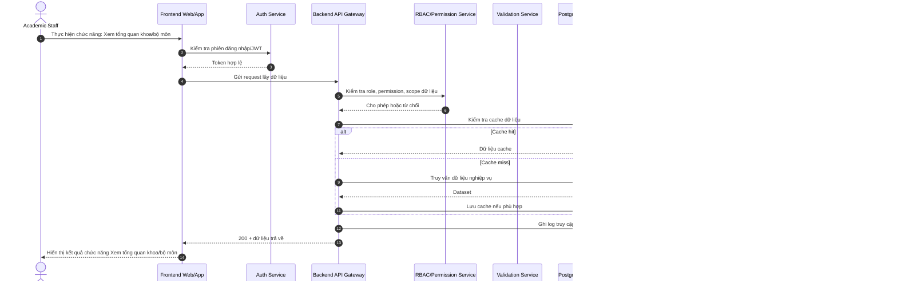

### 2. Xem lớp đang mở

**Mục tiêu:** Mô tả luồng xử lý chi tiết cho chức năng **Xem lớp đang mở** của đối tượng **Khoa/Bộ môn/Phòng đào tạo**.


### 3. Xem tiến độ giảng dạy

**Mục tiêu:** Mô tả luồng xử lý chi tiết cho chức năng **Xem tiến độ giảng dạy** của đối tượng **Khoa/Bộ môn/Phòng đào tạo**.


### 4. Xem tỷ lệ hoàn thành học phần

**Mục tiêu:** Mô tả luồng xử lý chi tiết cho chức năng **Xem tỷ lệ hoàn thành học phần** của đối tượng **Khoa/Bộ môn/Phòng đào tạo**.

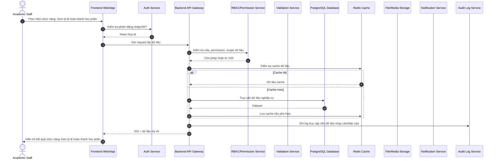

### 5. Xem lớp có rủi ro

**Mục tiêu:** Mô tả luồng xử lý chi tiết cho chức năng **Xem lớp có rủi ro** của đối tượng **Khoa/Bộ môn/Phòng đào tạo**.

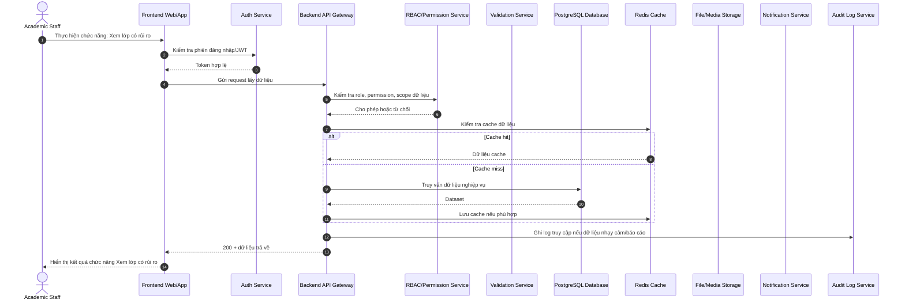

### 6. Xem thống kê học vụ

**Mục tiêu:** Mô tả luồng xử lý chi tiết cho chức năng **Xem thống kê học vụ** của đối tượng **Khoa/Bộ môn/Phòng đào tạo**.


### 7. Xem cảnh báo sinh viên

**Mục tiêu:** Mô tả luồng xử lý chi tiết cho chức năng **Xem cảnh báo sinh viên** của đối tượng **Khoa/Bộ môn/Phòng đào tạo**.

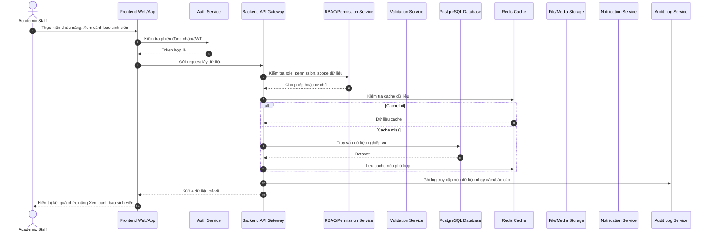

### 8. Xem cảnh báo giảng viên

**Mục tiêu:** Mô tả luồng xử lý chi tiết cho chức năng **Xem cảnh báo giảng viên** của đối tượng **Khoa/Bộ môn/Phòng đào tạo**.

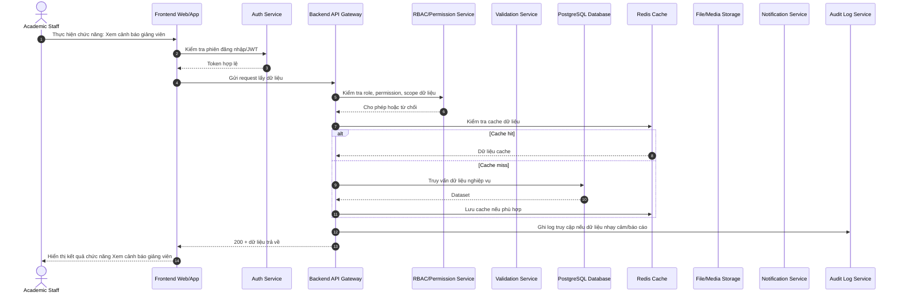

## 4.2. Chương trình đào tạo

### 9. Quản lý ngành học

**Mục tiêu:** Mô tả luồng xử lý chi tiết cho chức năng **Quản lý ngành học** của đối tượng **Khoa/Bộ môn/Phòng đào tạo**.


### 10. Quản lý chuyên ngành

**Mục tiêu:** Mô tả luồng xử lý chi tiết cho chức năng **Quản lý chuyên ngành** của đối tượng **Khoa/Bộ môn/Phòng đào tạo**.

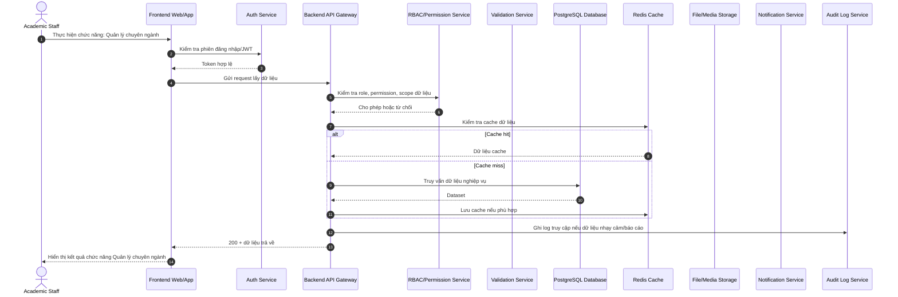

### 11. Quản lý khung chương trình

**Mục tiêu:** Mô tả luồng xử lý chi tiết cho chức năng **Quản lý khung chương trình** của đối tượng **Khoa/Bộ môn/Phòng đào tạo**.

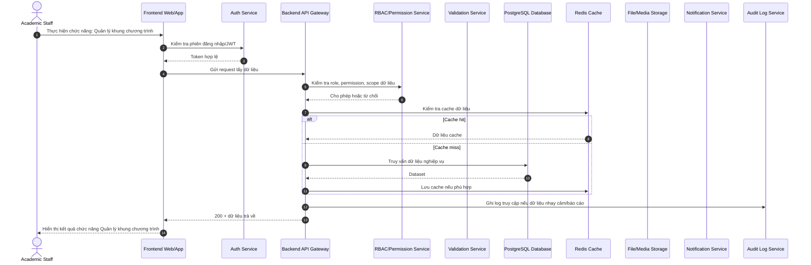

### 12. Quản lý môn bắt buộc

**Mục tiêu:** Mô tả luồng xử lý chi tiết cho chức năng **Quản lý môn bắt buộc** của đối tượng **Khoa/Bộ môn/Phòng đào tạo**.

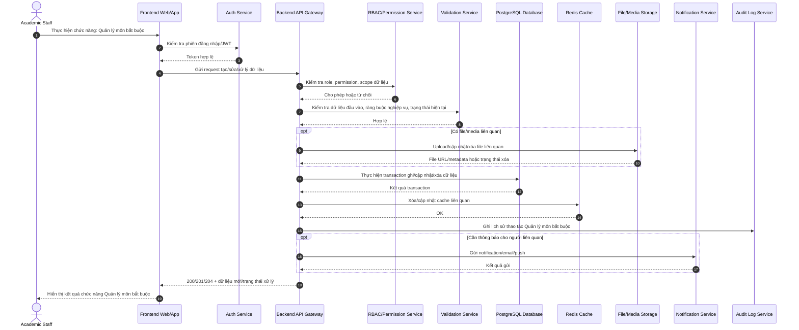

### 13. Quản lý môn tự chọn

**Mục tiêu:** Mô tả luồng xử lý chi tiết cho chức năng **Quản lý môn tự chọn** của đối tượng **Khoa/Bộ môn/Phòng đào tạo**.


### 14. Quản lý môn tiên quyết

**Mục tiêu:** Mô tả luồng xử lý chi tiết cho chức năng **Quản lý môn tiên quyết** của đối tượng **Khoa/Bộ môn/Phòng đào tạo**.

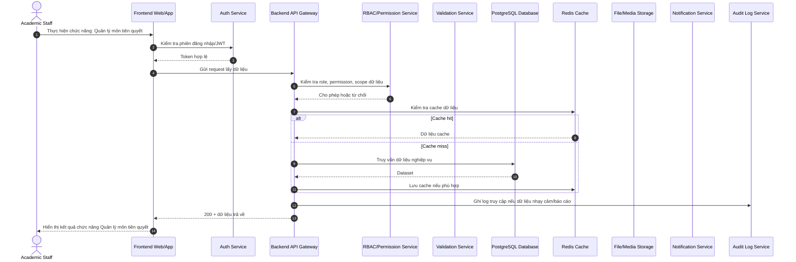

### 15. Quản lý chuẩn đầu ra

**Mục tiêu:** Mô tả luồng xử lý chi tiết cho chức năng **Quản lý chuẩn đầu ra** của đối tượng **Khoa/Bộ môn/Phòng đào tạo**.

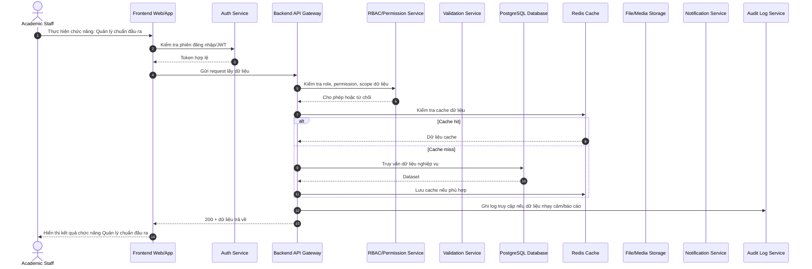

### 16. Mapping CLO-PLO

**Mục tiêu:** Mô tả luồng xử lý chi tiết cho chức năng **Mapping CLO-PLO** của đối tượng **Khoa/Bộ môn/Phòng đào tạo**.

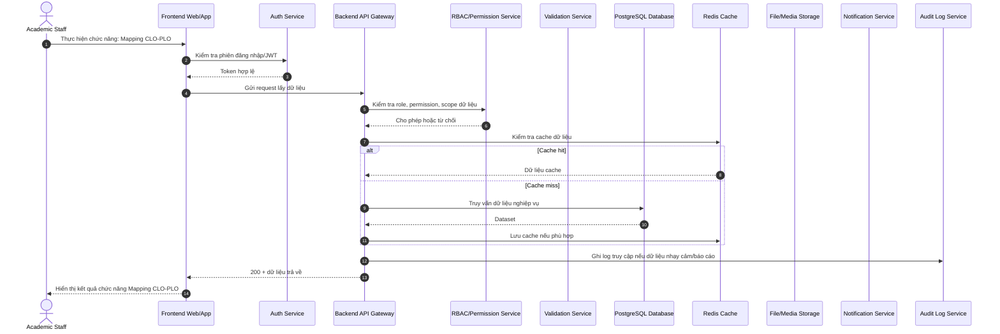

### 17. Cập nhật đề cương chuẩn

**Mục tiêu:** Mô tả luồng xử lý chi tiết cho chức năng **Cập nhật đề cương chuẩn** của đối tượng **Khoa/Bộ môn/Phòng đào tạo**.

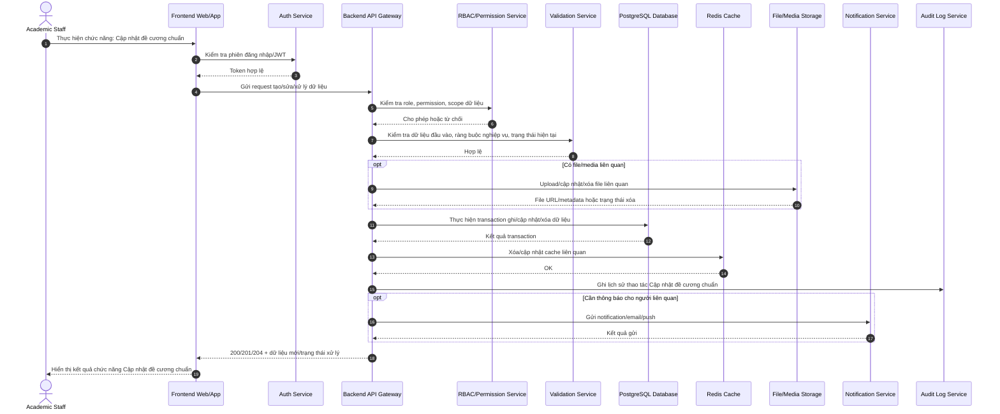

### 18. Duyệt đề cương môn học

**Mục tiêu:** Mô tả luồng xử lý chi tiết cho chức năng **Duyệt đề cương môn học** của đối tượng **Khoa/Bộ môn/Phòng đào tạo**.

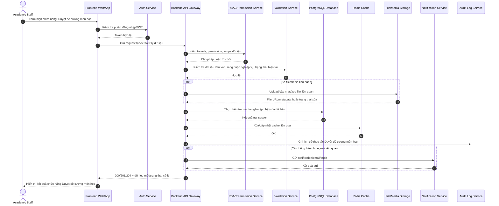

### 19. Theo dõi thay đổi CTĐT

**Mục tiêu:** Mô tả luồng xử lý chi tiết cho chức năng **Theo dõi thay đổi CTĐT** của đối tượng **Khoa/Bộ môn/Phòng đào tạo**.

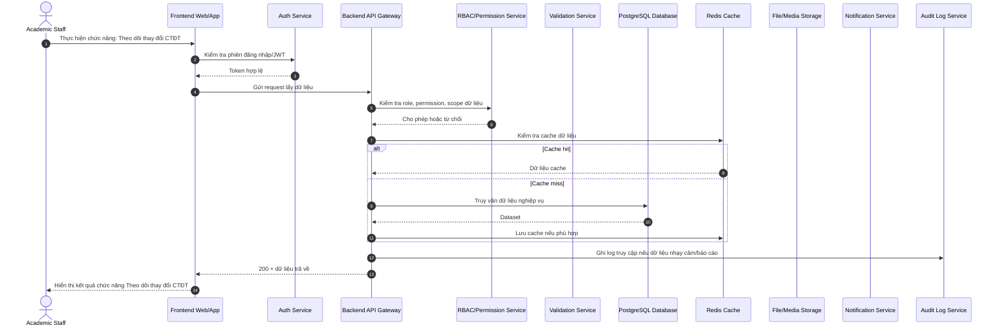

## 4.3. Quản lý môn học

### 20. Đề xuất tạo môn học

**Mục tiêu:** Mô tả luồng xử lý chi tiết cho chức năng **Đề xuất tạo môn học** của đối tượng **Khoa/Bộ môn/Phòng đào tạo**.

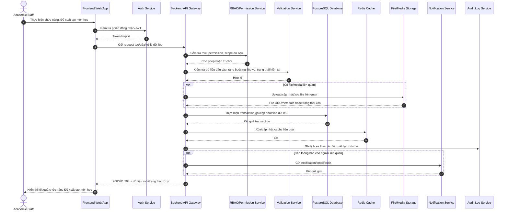

### 21. Cập nhật thông tin môn

**Mục tiêu:** Mô tả luồng xử lý chi tiết cho chức năng **Cập nhật thông tin môn** của đối tượng **Khoa/Bộ môn/Phòng đào tạo**.

```mermaid
sequenceDiagram
    autonumber
    actor U as Academic Staff
    participant FE as Frontend Web/App
    participant Auth as Auth Service
    participant API as Backend API Gateway
    participant RBAC as RBAC/Permission Service
    participant Val as Validation Service
    participant DB as PostgreSQL Database
    participant Cache as Redis Cache
    participant File as File/Media Storage
    participant Notify as Notification Service
    participant Audit as Audit Log Service
    U->>FE: Thực hiện chức năng: Cập nhật thông tin môn
    FE->>Auth: Kiểm tra phiên đăng nhập/JWT
    Auth-->>FE: Token hợp lệ
    FE->>API: Gửi request tạo/sửa/xử lý dữ liệu
    API->>RBAC: Kiểm tra role, permission, scope dữ liệu
    RBAC-->>API: Cho phép hoặc từ chối
    API->>Val: Kiểm tra dữ liệu đầu vào, ràng buộc nghiệp vụ, trạng thái hiện tại
    Val-->>API: Hợp lệ
    opt Có file/media liên quan
        API->>File: Upload/cập nhật/xóa file liên quan
        File-->>API: File URL/metadata hoặc trạng thái xóa
    end
    API->>DB: Thực hiện transaction ghi/cập nhật/xóa dữ liệu
    DB-->>API: Kết quả transaction
    API->>Cache: Xóa/cập nhật cache liên quan
    Cache-->>API: OK
    API->>Audit: Ghi lịch sử thao tác Cập nhật thông tin môn
    opt Cần thông báo cho người liên quan
        API->>Notify: Gửi notification/email/push
        Notify-->>API: Kết quả gửi
    end
    API-->>FE: 200/201/204 + dữ liệu mới/trạng thái xử lý
    FE-->>U: Hiển thị kết quả chức năng Cập nhật thông tin môn
```

### 22. Quản lý môn theo bộ môn

**Mục tiêu:** Mô tả luồng xử lý chi tiết cho chức năng **Quản lý môn theo bộ môn** của đối tượng **Khoa/Bộ môn/Phòng đào tạo**.

```mermaid
sequenceDiagram
    autonumber
    actor U as Academic Staff
    participant FE as Frontend Web/App
    participant Auth as Auth Service
    participant API as Backend API Gateway
    participant RBAC as RBAC/Permission Service
    participant Val as Validation Service
    participant DB as PostgreSQL Database
    participant Cache as Redis Cache
    participant File as File/Media Storage
    participant Notify as Notification Service
    participant Audit as Audit Log Service
    U->>FE: Thực hiện chức năng: Quản lý môn theo bộ môn
    FE->>Auth: Kiểm tra phiên đăng nhập/JWT
    Auth-->>FE: Token hợp lệ
    FE->>API: Gửi request lấy dữ liệu
    API->>RBAC: Kiểm tra role, permission, scope dữ liệu
    RBAC-->>API: Cho phép hoặc từ chối
    API->>Cache: Kiểm tra cache dữ liệu
    alt Cache hit
        Cache-->>API: Dữ liệu cache
    else Cache miss
        API->>DB: Truy vấn dữ liệu nghiệp vụ
        DB-->>API: Dataset
        API->>Cache: Lưu cache nếu phù hợp
    end
    API->>Audit: Ghi log truy cập nếu dữ liệu nhạy cảm/báo cáo
    API-->>FE: 200 + dữ liệu trả về
    FE-->>U: Hiển thị kết quả chức năng Quản lý môn theo bộ môn
```

### 23. Quản lý tài liệu chuẩn

**Mục tiêu:** Mô tả luồng xử lý chi tiết cho chức năng **Quản lý tài liệu chuẩn** của đối tượng **Khoa/Bộ môn/Phòng đào tạo**.

```mermaid
sequenceDiagram
    autonumber
    actor U as Academic Staff
    participant FE as Frontend Web/App
    participant Auth as Auth Service
    participant API as Backend API Gateway
    participant RBAC as RBAC/Permission Service
    participant Val as Validation Service
    participant DB as PostgreSQL Database
    participant Cache as Redis Cache
    participant File as File/Media Storage
    participant Notify as Notification Service
    participant Audit as Audit Log Service
    U->>FE: Thực hiện chức năng: Quản lý tài liệu chuẩn
    FE->>Auth: Kiểm tra phiên đăng nhập/JWT
    Auth-->>FE: Token hợp lệ
    FE->>API: Gửi request lấy dữ liệu
    API->>RBAC: Kiểm tra role, permission, scope dữ liệu
    RBAC-->>API: Cho phép hoặc từ chối
    API->>Cache: Kiểm tra cache dữ liệu
    alt Cache hit
        Cache-->>API: Dữ liệu cache
    else Cache miss
        API->>DB: Truy vấn dữ liệu nghiệp vụ
        DB-->>API: Dataset
        API->>Cache: Lưu cache nếu phù hợp
    end
    API->>Audit: Ghi log truy cập nếu dữ liệu nhạy cảm/báo cáo
    API-->>FE: 200 + dữ liệu trả về
    FE-->>U: Hiển thị kết quả chức năng Quản lý tài liệu chuẩn
```

### 24. Quản lý rubric chuẩn

**Mục tiêu:** Mô tả luồng xử lý chi tiết cho chức năng **Quản lý rubric chuẩn** của đối tượng **Khoa/Bộ môn/Phòng đào tạo**.

```mermaid
sequenceDiagram
    autonumber
    actor U as Academic Staff
    participant FE as Frontend Web/App
    participant Auth as Auth Service
    participant API as Backend API Gateway
    participant RBAC as RBAC/Permission Service
    participant Val as Validation Service
    participant DB as PostgreSQL Database
    participant Cache as Redis Cache
    participant File as File/Media Storage
    participant Notify as Notification Service
    participant Audit as Audit Log Service
    U->>FE: Thực hiện chức năng: Quản lý rubric chuẩn
    FE->>Auth: Kiểm tra phiên đăng nhập/JWT
    Auth-->>FE: Token hợp lệ
    FE->>API: Gửi request lấy dữ liệu
    API->>RBAC: Kiểm tra role, permission, scope dữ liệu
    RBAC-->>API: Cho phép hoặc từ chối
    API->>Cache: Kiểm tra cache dữ liệu
    alt Cache hit
        Cache-->>API: Dữ liệu cache
    else Cache miss
        API->>DB: Truy vấn dữ liệu nghiệp vụ
        DB-->>API: Dataset
        API->>Cache: Lưu cache nếu phù hợp
    end
    API->>Audit: Ghi log truy cập nếu dữ liệu nhạy cảm/báo cáo
    API-->>FE: 200 + dữ liệu trả về
    FE-->>U: Hiển thị kết quả chức năng Quản lý rubric chuẩn
```

### 25. Quản lý trọng số chuẩn

**Mục tiêu:** Mô tả luồng xử lý chi tiết cho chức năng **Quản lý trọng số chuẩn** của đối tượng **Khoa/Bộ môn/Phòng đào tạo**.

```mermaid
sequenceDiagram
    autonumber
    actor U as Academic Staff
    participant FE as Frontend Web/App
    participant Auth as Auth Service
    participant API as Backend API Gateway
    participant RBAC as RBAC/Permission Service
    participant Val as Validation Service
    participant DB as PostgreSQL Database
    participant Cache as Redis Cache
    participant File as File/Media Storage
    participant Notify as Notification Service
    participant Audit as Audit Log Service
    U->>FE: Thực hiện chức năng: Quản lý trọng số chuẩn
    FE->>Auth: Kiểm tra phiên đăng nhập/JWT
    Auth-->>FE: Token hợp lệ
    FE->>API: Gửi request lấy dữ liệu
    API->>RBAC: Kiểm tra role, permission, scope dữ liệu
    RBAC-->>API: Cho phép hoặc từ chối
    API->>Cache: Kiểm tra cache dữ liệu
    alt Cache hit
        Cache-->>API: Dữ liệu cache
    else Cache miss
        API->>DB: Truy vấn dữ liệu nghiệp vụ
        DB-->>API: Dataset
        API->>Cache: Lưu cache nếu phù hợp
    end
    API->>Audit: Ghi log truy cập nếu dữ liệu nhạy cảm/báo cáo
    API-->>FE: 200 + dữ liệu trả về
    FE-->>U: Hiển thị kết quả chức năng Quản lý trọng số chuẩn
```

### 26. Xem lịch sử thay đổi môn

**Mục tiêu:** Mô tả luồng xử lý chi tiết cho chức năng **Xem lịch sử thay đổi môn** của đối tượng **Khoa/Bộ môn/Phòng đào tạo**.

```mermaid
sequenceDiagram
    autonumber
    actor U as Academic Staff
    participant FE as Frontend Web/App
    participant Auth as Auth Service
    participant API as Backend API Gateway
    participant RBAC as RBAC/Permission Service
    participant Val as Validation Service
    participant DB as PostgreSQL Database
    participant Cache as Redis Cache
    participant File as File/Media Storage
    participant Notify as Notification Service
    participant Audit as Audit Log Service
    U->>FE: Thực hiện chức năng: Xem lịch sử thay đổi môn
    FE->>Auth: Kiểm tra phiên đăng nhập/JWT
    Auth-->>FE: Token hợp lệ
    FE->>API: Gửi request lấy dữ liệu
    API->>RBAC: Kiểm tra role, permission, scope dữ liệu
    RBAC-->>API: Cho phép hoặc từ chối
    API->>Cache: Kiểm tra cache dữ liệu
    alt Cache hit
        Cache-->>API: Dữ liệu cache
    else Cache miss
        API->>DB: Truy vấn dữ liệu nghiệp vụ
        DB-->>API: Dataset
        API->>Cache: Lưu cache nếu phù hợp
    end
    API->>Audit: Ghi log truy cập nếu dữ liệu nhạy cảm/báo cáo
    API-->>FE: 200 + dữ liệu trả về
    FE-->>U: Hiển thị kết quả chức năng Xem lịch sử thay đổi môn
```

### 27. Đề xuất ngừng môn

**Mục tiêu:** Mô tả luồng xử lý chi tiết cho chức năng **Đề xuất ngừng môn** của đối tượng **Khoa/Bộ môn/Phòng đào tạo**.

```mermaid
sequenceDiagram
    autonumber
    actor U as Academic Staff
    participant FE as Frontend Web/App
    participant Auth as Auth Service
    participant API as Backend API Gateway
    participant RBAC as RBAC/Permission Service
    participant Val as Validation Service
    participant DB as PostgreSQL Database
    participant Cache as Redis Cache
    participant File as File/Media Storage
    participant Notify as Notification Service
    participant Audit as Audit Log Service
    U->>FE: Thực hiện chức năng: Đề xuất ngừng môn
    FE->>Auth: Kiểm tra phiên đăng nhập/JWT
    Auth-->>FE: Token hợp lệ
    FE->>API: Gửi request tạo/sửa/xử lý dữ liệu
    API->>RBAC: Kiểm tra role, permission, scope dữ liệu
    RBAC-->>API: Cho phép hoặc từ chối
    API->>Val: Kiểm tra dữ liệu đầu vào, ràng buộc nghiệp vụ, trạng thái hiện tại
    Val-->>API: Hợp lệ
    opt Có file/media liên quan
        API->>File: Upload/cập nhật/xóa file liên quan
        File-->>API: File URL/metadata hoặc trạng thái xóa
    end
    API->>DB: Thực hiện transaction ghi/cập nhật/xóa dữ liệu
    DB-->>API: Kết quả transaction
    API->>Cache: Xóa/cập nhật cache liên quan
    Cache-->>API: OK
    API->>Audit: Ghi lịch sử thao tác Đề xuất ngừng môn
    opt Cần thông báo cho người liên quan
        API->>Notify: Gửi notification/email/push
        Notify-->>API: Kết quả gửi
    end
    API-->>FE: 200/201/204 + dữ liệu mới/trạng thái xử lý
    FE-->>U: Hiển thị kết quả chức năng Đề xuất ngừng môn
```

## 4.4. Lớp học phần

### 28. Tạo/đề xuất lớp học phần

**Mục tiêu:** Mô tả luồng xử lý chi tiết cho chức năng **Tạo/đề xuất lớp học phần** của đối tượng **Khoa/Bộ môn/Phòng đào tạo**.

```mermaid
sequenceDiagram
    autonumber
    actor U as Academic Staff
    participant FE as Frontend Web/App
    participant Auth as Auth Service
    participant API as Backend API Gateway
    participant RBAC as RBAC/Permission Service
    participant Val as Validation Service
    participant DB as PostgreSQL Database
    participant Cache as Redis Cache
    participant File as File/Media Storage
    participant Notify as Notification Service
    participant Audit as Audit Log Service
    U->>FE: Thực hiện chức năng: Tạo/đề xuất lớp học phần
    FE->>Auth: Kiểm tra phiên đăng nhập/JWT
    Auth-->>FE: Token hợp lệ
    FE->>API: Gửi request tạo/sửa/xử lý dữ liệu
    API->>RBAC: Kiểm tra role, permission, scope dữ liệu
    RBAC-->>API: Cho phép hoặc từ chối
    API->>Val: Kiểm tra dữ liệu đầu vào, ràng buộc nghiệp vụ, trạng thái hiện tại
    Val-->>API: Hợp lệ
    opt Có file/media liên quan
        API->>File: Upload/cập nhật/xóa file liên quan
        File-->>API: File URL/metadata hoặc trạng thái xóa
    end
    API->>DB: Thực hiện transaction ghi/cập nhật/xóa dữ liệu
    DB-->>API: Kết quả transaction
    API->>Cache: Xóa/cập nhật cache liên quan
    Cache-->>API: OK
    API->>Audit: Ghi lịch sử thao tác Tạo/đề xuất lớp học phần
    opt Cần thông báo cho người liên quan
        API->>Notify: Gửi notification/email/push
        Notify-->>API: Kết quả gửi
    end
    API-->>FE: 200/201/204 + dữ liệu mới/trạng thái xử lý
    FE-->>U: Hiển thị kết quả chức năng Tạo/đề xuất lớp học phần
```

### 29. Mở lớp học phần

**Mục tiêu:** Mô tả luồng xử lý chi tiết cho chức năng **Mở lớp học phần** của đối tượng **Khoa/Bộ môn/Phòng đào tạo**.

```mermaid
sequenceDiagram
    autonumber
    actor U as Academic Staff
    participant FE as Frontend Web/App
    participant Auth as Auth Service
    participant API as Backend API Gateway
    participant RBAC as RBAC/Permission Service
    participant Val as Validation Service
    participant DB as PostgreSQL Database
    participant Cache as Redis Cache
    participant File as File/Media Storage
    participant Notify as Notification Service
    participant Audit as Audit Log Service
    U->>FE: Thực hiện chức năng: Mở lớp học phần
    FE->>Auth: Kiểm tra phiên đăng nhập/JWT
    Auth-->>FE: Token hợp lệ
    FE->>API: Gửi request tạo/sửa/xử lý dữ liệu
    API->>RBAC: Kiểm tra role, permission, scope dữ liệu
    RBAC-->>API: Cho phép hoặc từ chối
    API->>Val: Kiểm tra dữ liệu đầu vào, ràng buộc nghiệp vụ, trạng thái hiện tại
    Val-->>API: Hợp lệ
    opt Có file/media liên quan
        API->>File: Upload/cập nhật/xóa file liên quan
        File-->>API: File URL/metadata hoặc trạng thái xóa
    end
    API->>DB: Thực hiện transaction ghi/cập nhật/xóa dữ liệu
    DB-->>API: Kết quả transaction
    API->>Cache: Xóa/cập nhật cache liên quan
    Cache-->>API: OK
    API->>Audit: Ghi lịch sử thao tác Mở lớp học phần
    opt Cần thông báo cho người liên quan
        API->>Notify: Gửi notification/email/push
        Notify-->>API: Kết quả gửi
    end
    API-->>FE: 200/201/204 + dữ liệu mới/trạng thái xử lý
    FE-->>U: Hiển thị kết quả chức năng Mở lớp học phần
```

### 30. Đóng/hủy lớp

**Mục tiêu:** Mô tả luồng xử lý chi tiết cho chức năng **Đóng/hủy lớp** của đối tượng **Khoa/Bộ môn/Phòng đào tạo**.

```mermaid
sequenceDiagram
    autonumber
    actor U as Academic Staff
    participant FE as Frontend Web/App
    participant Auth as Auth Service
    participant API as Backend API Gateway
    participant RBAC as RBAC/Permission Service
    participant Val as Validation Service
    participant DB as PostgreSQL Database
    participant Cache as Redis Cache
    participant File as File/Media Storage
    participant Notify as Notification Service
    participant Audit as Audit Log Service
    U->>FE: Thực hiện chức năng: Đóng/hủy lớp
    FE->>Auth: Kiểm tra phiên đăng nhập/JWT
    Auth-->>FE: Token hợp lệ
    FE->>API: Gửi request tạo/sửa/xử lý dữ liệu
    API->>RBAC: Kiểm tra role, permission, scope dữ liệu
    RBAC-->>API: Cho phép hoặc từ chối
    API->>Val: Kiểm tra dữ liệu đầu vào, ràng buộc nghiệp vụ, trạng thái hiện tại
    Val-->>API: Hợp lệ
    opt Có file/media liên quan
        API->>File: Upload/cập nhật/xóa file liên quan
        File-->>API: File URL/metadata hoặc trạng thái xóa
    end
    API->>DB: Thực hiện transaction ghi/cập nhật/xóa dữ liệu
    DB-->>API: Kết quả transaction
    API->>Cache: Xóa/cập nhật cache liên quan
    Cache-->>API: OK
    API->>Audit: Ghi lịch sử thao tác Đóng/hủy lớp
    opt Cần thông báo cho người liên quan
        API->>Notify: Gửi notification/email/push
        Notify-->>API: Kết quả gửi
    end
    API-->>FE: 200/201/204 + dữ liệu mới/trạng thái xử lý
    FE-->>U: Hiển thị kết quả chức năng Đóng/hủy lớp
```

### 31. Gán giảng viên

**Mục tiêu:** Mô tả luồng xử lý chi tiết cho chức năng **Gán giảng viên** của đối tượng **Khoa/Bộ môn/Phòng đào tạo**.

```mermaid
sequenceDiagram
    autonumber
    actor U as Academic Staff
    participant FE as Frontend Web/App
    participant Auth as Auth Service
    participant API as Backend API Gateway
    participant RBAC as RBAC/Permission Service
    participant Val as Validation Service
    participant DB as PostgreSQL Database
    participant Cache as Redis Cache
    participant File as File/Media Storage
    participant Notify as Notification Service
    participant Audit as Audit Log Service
    U->>FE: Thực hiện chức năng: Gán giảng viên
    FE->>Auth: Kiểm tra phiên đăng nhập/JWT
    Auth-->>FE: Token hợp lệ
    FE->>API: Gửi request tạo/sửa/xử lý dữ liệu
    API->>RBAC: Kiểm tra role, permission, scope dữ liệu
    RBAC-->>API: Cho phép hoặc từ chối
    API->>Val: Kiểm tra dữ liệu đầu vào, ràng buộc nghiệp vụ, trạng thái hiện tại
    Val-->>API: Hợp lệ
    opt Có file/media liên quan
        API->>File: Upload/cập nhật/xóa file liên quan
        File-->>API: File URL/metadata hoặc trạng thái xóa
    end
    API->>DB: Thực hiện transaction ghi/cập nhật/xóa dữ liệu
    DB-->>API: Kết quả transaction
    API->>Cache: Xóa/cập nhật cache liên quan
    Cache-->>API: OK
    API->>Audit: Ghi lịch sử thao tác Gán giảng viên
    opt Cần thông báo cho người liên quan
        API->>Notify: Gửi notification/email/push
        Notify-->>API: Kết quả gửi
    end
    API-->>FE: 200/201/204 + dữ liệu mới/trạng thái xử lý
    FE-->>U: Hiển thị kết quả chức năng Gán giảng viên
```

### 32. Gán trợ giảng

**Mục tiêu:** Mô tả luồng xử lý chi tiết cho chức năng **Gán trợ giảng** của đối tượng **Khoa/Bộ môn/Phòng đào tạo**.

```mermaid
sequenceDiagram
    autonumber
    actor U as Academic Staff
    participant FE as Frontend Web/App
    participant Auth as Auth Service
    participant API as Backend API Gateway
    participant RBAC as RBAC/Permission Service
    participant Val as Validation Service
    participant DB as PostgreSQL Database
    participant Cache as Redis Cache
    participant File as File/Media Storage
    participant Notify as Notification Service
    participant Audit as Audit Log Service
    U->>FE: Thực hiện chức năng: Gán trợ giảng
    FE->>Auth: Kiểm tra phiên đăng nhập/JWT
    Auth-->>FE: Token hợp lệ
    FE->>API: Gửi request tạo/sửa/xử lý dữ liệu
    API->>RBAC: Kiểm tra role, permission, scope dữ liệu
    RBAC-->>API: Cho phép hoặc từ chối
    API->>Val: Kiểm tra dữ liệu đầu vào, ràng buộc nghiệp vụ, trạng thái hiện tại
    Val-->>API: Hợp lệ
    opt Có file/media liên quan
        API->>File: Upload/cập nhật/xóa file liên quan
        File-->>API: File URL/metadata hoặc trạng thái xóa
    end
    API->>DB: Thực hiện transaction ghi/cập nhật/xóa dữ liệu
    DB-->>API: Kết quả transaction
    API->>Cache: Xóa/cập nhật cache liên quan
    Cache-->>API: OK
    API->>Audit: Ghi lịch sử thao tác Gán trợ giảng
    opt Cần thông báo cho người liên quan
        API->>Notify: Gửi notification/email/push
        Notify-->>API: Kết quả gửi
    end
    API-->>FE: 200/201/204 + dữ liệu mới/trạng thái xử lý
    FE-->>U: Hiển thị kết quả chức năng Gán trợ giảng
```

### 33. Quản lý sĩ số

**Mục tiêu:** Mô tả luồng xử lý chi tiết cho chức năng **Quản lý sĩ số** của đối tượng **Khoa/Bộ môn/Phòng đào tạo**.

```mermaid
sequenceDiagram
    autonumber
    actor U as Academic Staff
    participant FE as Frontend Web/App
    participant Auth as Auth Service
    participant API as Backend API Gateway
    participant RBAC as RBAC/Permission Service
    participant Val as Validation Service
    participant DB as PostgreSQL Database
    participant Cache as Redis Cache
    participant File as File/Media Storage
    participant Notify as Notification Service
    participant Audit as Audit Log Service
    U->>FE: Thực hiện chức năng: Quản lý sĩ số
    FE->>Auth: Kiểm tra phiên đăng nhập/JWT
    Auth-->>FE: Token hợp lệ
    FE->>API: Gửi request lấy dữ liệu
    API->>RBAC: Kiểm tra role, permission, scope dữ liệu
    RBAC-->>API: Cho phép hoặc từ chối
    API->>Cache: Kiểm tra cache dữ liệu
    alt Cache hit
        Cache-->>API: Dữ liệu cache
    else Cache miss
        API->>DB: Truy vấn dữ liệu nghiệp vụ
        DB-->>API: Dataset
        API->>Cache: Lưu cache nếu phù hợp
    end
    API->>Audit: Ghi log truy cập nếu dữ liệu nhạy cảm/báo cáo
    API-->>FE: 200 + dữ liệu trả về
    FE-->>U: Hiển thị kết quả chức năng Quản lý sĩ số
```

### 34. Ghi danh sinh viên

**Mục tiêu:** Mô tả luồng xử lý chi tiết cho chức năng **Ghi danh sinh viên** của đối tượng **Khoa/Bộ môn/Phòng đào tạo**.

```mermaid
sequenceDiagram
    autonumber
    actor U as Academic Staff
    participant FE as Frontend Web/App
    participant Auth as Auth Service
    participant API as Backend API Gateway
    participant RBAC as RBAC/Permission Service
    participant Val as Validation Service
    participant DB as PostgreSQL Database
    participant Cache as Redis Cache
    participant File as File/Media Storage
    participant Notify as Notification Service
    participant Audit as Audit Log Service
    U->>FE: Thực hiện chức năng: Ghi danh sinh viên
    FE->>Auth: Kiểm tra phiên đăng nhập/JWT
    Auth-->>FE: Token hợp lệ
    FE->>API: Gửi request lấy dữ liệu
    API->>RBAC: Kiểm tra role, permission, scope dữ liệu
    RBAC-->>API: Cho phép hoặc từ chối
    API->>Cache: Kiểm tra cache dữ liệu
    alt Cache hit
        Cache-->>API: Dữ liệu cache
    else Cache miss
        API->>DB: Truy vấn dữ liệu nghiệp vụ
        DB-->>API: Dataset
        API->>Cache: Lưu cache nếu phù hợp
    end
    API->>Audit: Ghi log truy cập nếu dữ liệu nhạy cảm/báo cáo
    API-->>FE: 200 + dữ liệu trả về
    FE-->>U: Hiển thị kết quả chức năng Ghi danh sinh viên
```

### 35. Chuyển lớp học phần

**Mục tiêu:** Mô tả luồng xử lý chi tiết cho chức năng **Chuyển lớp học phần** của đối tượng **Khoa/Bộ môn/Phòng đào tạo**.

```mermaid
sequenceDiagram
    autonumber
    actor U as Academic Staff
    participant FE as Frontend Web/App
    participant Auth as Auth Service
    participant API as Backend API Gateway
    participant RBAC as RBAC/Permission Service
    participant Val as Validation Service
    participant DB as PostgreSQL Database
    participant Cache as Redis Cache
    participant File as File/Media Storage
    participant Notify as Notification Service
    participant Audit as Audit Log Service
    U->>FE: Thực hiện chức năng: Chuyển lớp học phần
    FE->>Auth: Kiểm tra phiên đăng nhập/JWT
    Auth-->>FE: Token hợp lệ
    FE->>API: Gửi request tạo/sửa/xử lý dữ liệu
    API->>RBAC: Kiểm tra role, permission, scope dữ liệu
    RBAC-->>API: Cho phép hoặc từ chối
    API->>Val: Kiểm tra dữ liệu đầu vào, ràng buộc nghiệp vụ, trạng thái hiện tại
    Val-->>API: Hợp lệ
    opt Có file/media liên quan
        API->>File: Upload/cập nhật/xóa file liên quan
        File-->>API: File URL/metadata hoặc trạng thái xóa
    end
    API->>DB: Thực hiện transaction ghi/cập nhật/xóa dữ liệu
    DB-->>API: Kết quả transaction
    API->>Cache: Xóa/cập nhật cache liên quan
    Cache-->>API: OK
    API->>Audit: Ghi lịch sử thao tác Chuyển lớp học phần
    opt Cần thông báo cho người liên quan
        API->>Notify: Gửi notification/email/push
        Notify-->>API: Kết quả gửi
    end
    API-->>FE: 200/201/204 + dữ liệu mới/trạng thái xử lý
    FE-->>U: Hiển thị kết quả chức năng Chuyển lớp học phần
```

### 36. Tách lớp

**Mục tiêu:** Mô tả luồng xử lý chi tiết cho chức năng **Tách lớp** của đối tượng **Khoa/Bộ môn/Phòng đào tạo**.

```mermaid
sequenceDiagram
    autonumber
    actor U as Academic Staff
    participant FE as Frontend Web/App
    participant Auth as Auth Service
    participant API as Backend API Gateway
    participant RBAC as RBAC/Permission Service
    participant Val as Validation Service
    participant DB as PostgreSQL Database
    participant Cache as Redis Cache
    participant File as File/Media Storage
    participant Notify as Notification Service
    participant Audit as Audit Log Service
    U->>FE: Thực hiện chức năng: Tách lớp
    FE->>Auth: Kiểm tra phiên đăng nhập/JWT
    Auth-->>FE: Token hợp lệ
    FE->>API: Gửi request lấy dữ liệu
    API->>RBAC: Kiểm tra role, permission, scope dữ liệu
    RBAC-->>API: Cho phép hoặc từ chối
    API->>Cache: Kiểm tra cache dữ liệu
    alt Cache hit
        Cache-->>API: Dữ liệu cache
    else Cache miss
        API->>DB: Truy vấn dữ liệu nghiệp vụ
        DB-->>API: Dataset
        API->>Cache: Lưu cache nếu phù hợp
    end
    API->>Audit: Ghi log truy cập nếu dữ liệu nhạy cảm/báo cáo
    API-->>FE: 200 + dữ liệu trả về
    FE-->>U: Hiển thị kết quả chức năng Tách lớp
```

### 37. Gộp lớp

**Mục tiêu:** Mô tả luồng xử lý chi tiết cho chức năng **Gộp lớp** của đối tượng **Khoa/Bộ môn/Phòng đào tạo**.

```mermaid
sequenceDiagram
    autonumber
    actor U as Academic Staff
    participant FE as Frontend Web/App
    participant Auth as Auth Service
    participant API as Backend API Gateway
    participant RBAC as RBAC/Permission Service
    participant Val as Validation Service
    participant DB as PostgreSQL Database
    participant Cache as Redis Cache
    participant File as File/Media Storage
    participant Notify as Notification Service
    participant Audit as Audit Log Service
    U->>FE: Thực hiện chức năng: Gộp lớp
    FE->>Auth: Kiểm tra phiên đăng nhập/JWT
    Auth-->>FE: Token hợp lệ
    FE->>API: Gửi request lấy dữ liệu
    API->>RBAC: Kiểm tra role, permission, scope dữ liệu
    RBAC-->>API: Cho phép hoặc từ chối
    API->>Cache: Kiểm tra cache dữ liệu
    alt Cache hit
        Cache-->>API: Dữ liệu cache
    else Cache miss
        API->>DB: Truy vấn dữ liệu nghiệp vụ
        DB-->>API: Dataset
        API->>Cache: Lưu cache nếu phù hợp
    end
    API->>Audit: Ghi log truy cập nếu dữ liệu nhạy cảm/báo cáo
    API-->>FE: 200 + dữ liệu trả về
    FE-->>U: Hiển thị kết quả chức năng Gộp lớp
```

### 38. Theo dõi trạng thái lớp

**Mục tiêu:** Mô tả luồng xử lý chi tiết cho chức năng **Theo dõi trạng thái lớp** của đối tượng **Khoa/Bộ môn/Phòng đào tạo**.

```mermaid
sequenceDiagram
    autonumber
    actor U as Academic Staff
    participant FE as Frontend Web/App
    participant Auth as Auth Service
    participant API as Backend API Gateway
    participant RBAC as RBAC/Permission Service
    participant Val as Validation Service
    participant DB as PostgreSQL Database
    participant Cache as Redis Cache
    participant File as File/Media Storage
    participant Notify as Notification Service
    participant Audit as Audit Log Service
    U->>FE: Thực hiện chức năng: Theo dõi trạng thái lớp
    FE->>Auth: Kiểm tra phiên đăng nhập/JWT
    Auth-->>FE: Token hợp lệ
    FE->>API: Gửi request lấy dữ liệu
    API->>RBAC: Kiểm tra role, permission, scope dữ liệu
    RBAC-->>API: Cho phép hoặc từ chối
    API->>Cache: Kiểm tra cache dữ liệu
    alt Cache hit
        Cache-->>API: Dữ liệu cache
    else Cache miss
        API->>DB: Truy vấn dữ liệu nghiệp vụ
        DB-->>API: Dataset
        API->>Cache: Lưu cache nếu phù hợp
    end
    API->>Audit: Ghi log truy cập nếu dữ liệu nhạy cảm/báo cáo
    API-->>FE: 200 + dữ liệu trả về
    FE-->>U: Hiển thị kết quả chức năng Theo dõi trạng thái lớp
```

### 39. Lưu trữ lớp

**Mục tiêu:** Mô tả luồng xử lý chi tiết cho chức năng **Lưu trữ lớp** của đối tượng **Khoa/Bộ môn/Phòng đào tạo**.

```mermaid
sequenceDiagram
    autonumber
    actor U as Academic Staff
    participant FE as Frontend Web/App
    participant Auth as Auth Service
    participant API as Backend API Gateway
    participant RBAC as RBAC/Permission Service
    participant Val as Validation Service
    participant DB as PostgreSQL Database
    participant Cache as Redis Cache
    participant File as File/Media Storage
    participant Notify as Notification Service
    participant Audit as Audit Log Service
    U->>FE: Thực hiện chức năng: Lưu trữ lớp
    FE->>Auth: Kiểm tra phiên đăng nhập/JWT
    Auth-->>FE: Token hợp lệ
    FE->>API: Gửi request tạo/sửa/xử lý dữ liệu
    API->>RBAC: Kiểm tra role, permission, scope dữ liệu
    RBAC-->>API: Cho phép hoặc từ chối
    API->>Val: Kiểm tra dữ liệu đầu vào, ràng buộc nghiệp vụ, trạng thái hiện tại
    Val-->>API: Hợp lệ
    opt Có file/media liên quan
        API->>File: Upload/cập nhật/xóa file liên quan
        File-->>API: File URL/metadata hoặc trạng thái xóa
    end
    API->>DB: Thực hiện transaction ghi/cập nhật/xóa dữ liệu
    DB-->>API: Kết quả transaction
    API->>Cache: Xóa/cập nhật cache liên quan
    Cache-->>API: OK
    API->>Audit: Ghi lịch sử thao tác Lưu trữ lớp
    opt Cần thông báo cho người liên quan
        API->>Notify: Gửi notification/email/push
        Notify-->>API: Kết quả gửi
    end
    API-->>FE: 200/201/204 + dữ liệu mới/trạng thái xử lý
    FE-->>U: Hiển thị kết quả chức năng Lưu trữ lớp
```

## 4.5. Quản lý giảng viên

### 40. Xem danh sách giảng viên

**Mục tiêu:** Mô tả luồng xử lý chi tiết cho chức năng **Xem danh sách giảng viên** của đối tượng **Khoa/Bộ môn/Phòng đào tạo**.

```mermaid
sequenceDiagram
    autonumber
    actor U as Academic Staff
    participant FE as Frontend Web/App
    participant Auth as Auth Service
    participant API as Backend API Gateway
    participant RBAC as RBAC/Permission Service
    participant Val as Validation Service
    participant DB as PostgreSQL Database
    participant Cache as Redis Cache
    participant File as File/Media Storage
    participant Notify as Notification Service
    participant Audit as Audit Log Service
    U->>FE: Thực hiện chức năng: Xem danh sách giảng viên
    FE->>Auth: Kiểm tra phiên đăng nhập/JWT
    Auth-->>FE: Token hợp lệ
    FE->>API: Gửi request lấy dữ liệu
    API->>RBAC: Kiểm tra role, permission, scope dữ liệu
    RBAC-->>API: Cho phép hoặc từ chối
    API->>Cache: Kiểm tra cache dữ liệu
    alt Cache hit
        Cache-->>API: Dữ liệu cache
    else Cache miss
        API->>DB: Truy vấn dữ liệu nghiệp vụ
        DB-->>API: Dataset
        API->>Cache: Lưu cache nếu phù hợp
    end
    API->>Audit: Ghi log truy cập nếu dữ liệu nhạy cảm/báo cáo
    API-->>FE: 200 + dữ liệu trả về
    FE-->>U: Hiển thị kết quả chức năng Xem danh sách giảng viên
```

### 41. Phân công giảng dạy

**Mục tiêu:** Mô tả luồng xử lý chi tiết cho chức năng **Phân công giảng dạy** của đối tượng **Khoa/Bộ môn/Phòng đào tạo**.

```mermaid
sequenceDiagram
    autonumber
    actor U as Academic Staff
    participant FE as Frontend Web/App
    participant Auth as Auth Service
    participant API as Backend API Gateway
    participant RBAC as RBAC/Permission Service
    participant Val as Validation Service
    participant DB as PostgreSQL Database
    participant Cache as Redis Cache
    participant File as File/Media Storage
    participant Notify as Notification Service
    participant Audit as Audit Log Service
    U->>FE: Thực hiện chức năng: Phân công giảng dạy
    FE->>Auth: Kiểm tra phiên đăng nhập/JWT
    Auth-->>FE: Token hợp lệ
    FE->>API: Gửi request tạo/sửa/xử lý dữ liệu
    API->>RBAC: Kiểm tra role, permission, scope dữ liệu
    RBAC-->>API: Cho phép hoặc từ chối
    API->>Val: Kiểm tra dữ liệu đầu vào, ràng buộc nghiệp vụ, trạng thái hiện tại
    Val-->>API: Hợp lệ
    opt Có file/media liên quan
        API->>File: Upload/cập nhật/xóa file liên quan
        File-->>API: File URL/metadata hoặc trạng thái xóa
    end
    API->>DB: Thực hiện transaction ghi/cập nhật/xóa dữ liệu
    DB-->>API: Kết quả transaction
    API->>Cache: Xóa/cập nhật cache liên quan
    Cache-->>API: OK
    API->>Audit: Ghi lịch sử thao tác Phân công giảng dạy
    opt Cần thông báo cho người liên quan
        API->>Notify: Gửi notification/email/push
        Notify-->>API: Kết quả gửi
    end
    API-->>FE: 200/201/204 + dữ liệu mới/trạng thái xử lý
    FE-->>U: Hiển thị kết quả chức năng Phân công giảng dạy
```

### 42. Quản lý tải giảng dạy

**Mục tiêu:** Mô tả luồng xử lý chi tiết cho chức năng **Quản lý tải giảng dạy** của đối tượng **Khoa/Bộ môn/Phòng đào tạo**.

```mermaid
sequenceDiagram
    autonumber
    actor U as Academic Staff
    participant FE as Frontend Web/App
    participant Auth as Auth Service
    participant API as Backend API Gateway
    participant RBAC as RBAC/Permission Service
    participant Val as Validation Service
    participant DB as PostgreSQL Database
    participant Cache as Redis Cache
    participant File as File/Media Storage
    participant Notify as Notification Service
    participant Audit as Audit Log Service
    U->>FE: Thực hiện chức năng: Quản lý tải giảng dạy
    FE->>Auth: Kiểm tra phiên đăng nhập/JWT
    Auth-->>FE: Token hợp lệ
    FE->>API: Gửi request xuất/tải dữ liệu
    API->>RBAC: Kiểm tra quyền xem/tải/xuất dữ liệu theo phạm vi
    RBAC-->>API: Cho phép hoặc từ chối
    API->>Val: Kiểm tra bộ lọc, định dạng xuất, giới hạn dữ liệu
    Val-->>API: Hợp lệ
    API->>DB: Truy vấn dữ liệu cần xuất/tải
    DB-->>API: Dataset/metadata
    API->>File: Tạo file PDF/Excel/CSV hoặc lấy file từ storage
    File-->>API: Download URL/file stream
    API->>Audit: Ghi log tải/xuất dữ liệu
    API-->>FE: 200 + file/download URL
    FE-->>U: Tải file hoặc hiển thị dữ liệu
```

### 43. Theo dõi hoạt động giảng viên

**Mục tiêu:** Mô tả luồng xử lý chi tiết cho chức năng **Theo dõi hoạt động giảng viên** của đối tượng **Khoa/Bộ môn/Phòng đào tạo**.

```mermaid
sequenceDiagram
    autonumber
    actor U as Academic Staff
    participant FE as Frontend Web/App
    participant Auth as Auth Service
    participant API as Backend API Gateway
    participant RBAC as RBAC/Permission Service
    participant Val as Validation Service
    participant DB as PostgreSQL Database
    participant Cache as Redis Cache
    participant File as File/Media Storage
    participant Notify as Notification Service
    participant Audit as Audit Log Service
    U->>FE: Thực hiện chức năng: Theo dõi hoạt động giảng viên
    FE->>Auth: Kiểm tra phiên đăng nhập/JWT
    Auth-->>FE: Token hợp lệ
    FE->>API: Gửi request lấy dữ liệu
    API->>RBAC: Kiểm tra role, permission, scope dữ liệu
    RBAC-->>API: Cho phép hoặc từ chối
    API->>Cache: Kiểm tra cache dữ liệu
    alt Cache hit
        Cache-->>API: Dữ liệu cache
    else Cache miss
        API->>DB: Truy vấn dữ liệu nghiệp vụ
        DB-->>API: Dataset
        API->>Cache: Lưu cache nếu phù hợp
    end
    API->>Audit: Ghi log truy cập nếu dữ liệu nhạy cảm/báo cáo
    API-->>FE: 200 + dữ liệu trả về
    FE-->>U: Hiển thị kết quả chức năng Theo dõi hoạt động giảng viên
```

### 44. Theo dõi tiến độ lên nội dung

**Mục tiêu:** Mô tả luồng xử lý chi tiết cho chức năng **Theo dõi tiến độ lên nội dung** của đối tượng **Khoa/Bộ môn/Phòng đào tạo**.

```mermaid
sequenceDiagram
    autonumber
    actor U as Academic Staff
    participant FE as Frontend Web/App
    participant Auth as Auth Service
    participant API as Backend API Gateway
    participant RBAC as RBAC/Permission Service
    participant Val as Validation Service
    participant DB as PostgreSQL Database
    participant Cache as Redis Cache
    participant File as File/Media Storage
    participant Notify as Notification Service
    participant Audit as Audit Log Service
    U->>FE: Thực hiện chức năng: Theo dõi tiến độ lên nội dung
    FE->>Auth: Kiểm tra phiên đăng nhập/JWT
    Auth-->>FE: Token hợp lệ
    FE->>API: Gửi request lấy dữ liệu
    API->>RBAC: Kiểm tra role, permission, scope dữ liệu
    RBAC-->>API: Cho phép hoặc từ chối
    API->>Cache: Kiểm tra cache dữ liệu
    alt Cache hit
        Cache-->>API: Dữ liệu cache
    else Cache miss
        API->>DB: Truy vấn dữ liệu nghiệp vụ
        DB-->>API: Dataset
        API->>Cache: Lưu cache nếu phù hợp
    end
    API->>Audit: Ghi log truy cập nếu dữ liệu nhạy cảm/báo cáo
    API-->>FE: 200 + dữ liệu trả về
    FE-->>U: Hiển thị kết quả chức năng Theo dõi tiến độ lên nội dung
```

### 45. Cảnh báo chậm chấm bài

**Mục tiêu:** Mô tả luồng xử lý chi tiết cho chức năng **Cảnh báo chậm chấm bài** của đối tượng **Khoa/Bộ môn/Phòng đào tạo**.

```mermaid
sequenceDiagram
    autonumber
    actor U as Academic Staff
    participant FE as Frontend Web/App
    participant Auth as Auth Service
    participant API as Backend API Gateway
    participant RBAC as RBAC/Permission Service
    participant Val as Validation Service
    participant DB as PostgreSQL Database
    participant Cache as Redis Cache
    participant File as File/Media Storage
    participant Notify as Notification Service
    participant Audit as Audit Log Service
    U->>FE: Thực hiện chức năng: Cảnh báo chậm chấm bài
    FE->>Auth: Kiểm tra phiên đăng nhập/JWT
    Auth-->>FE: Token hợp lệ
    FE->>API: Gửi request tạo/sửa/xử lý dữ liệu
    API->>RBAC: Kiểm tra role, permission, scope dữ liệu
    RBAC-->>API: Cho phép hoặc từ chối
    API->>Val: Kiểm tra dữ liệu đầu vào, ràng buộc nghiệp vụ, trạng thái hiện tại
    Val-->>API: Hợp lệ
    opt Có file/media liên quan
        API->>File: Upload/cập nhật/xóa file liên quan
        File-->>API: File URL/metadata hoặc trạng thái xóa
    end
    API->>DB: Thực hiện transaction ghi/cập nhật/xóa dữ liệu
    DB-->>API: Kết quả transaction
    API->>Cache: Xóa/cập nhật cache liên quan
    Cache-->>API: OK
    API->>Audit: Ghi lịch sử thao tác Cảnh báo chậm chấm bài
    opt Cần thông báo cho người liên quan
        API->>Notify: Gửi notification/email/push
        Notify-->>API: Kết quả gửi
    end
    API-->>FE: 200/201/204 + dữ liệu mới/trạng thái xử lý
    FE-->>U: Hiển thị kết quả chức năng Cảnh báo chậm chấm bài
```

### 46. Xem đánh giá giảng viên

**Mục tiêu:** Mô tả luồng xử lý chi tiết cho chức năng **Xem đánh giá giảng viên** của đối tượng **Khoa/Bộ môn/Phòng đào tạo**.

```mermaid
sequenceDiagram
    autonumber
    actor U as Academic Staff
    participant FE as Frontend Web/App
    participant Auth as Auth Service
    participant API as Backend API Gateway
    participant RBAC as RBAC/Permission Service
    participant Val as Validation Service
    participant DB as PostgreSQL Database
    participant Cache as Redis Cache
    participant File as File/Media Storage
    participant Notify as Notification Service
    participant Audit as Audit Log Service
    U->>FE: Thực hiện chức năng: Xem đánh giá giảng viên
    FE->>Auth: Kiểm tra phiên đăng nhập/JWT
    Auth-->>FE: Token hợp lệ
    FE->>API: Gửi request lấy dữ liệu
    API->>RBAC: Kiểm tra role, permission, scope dữ liệu
    RBAC-->>API: Cho phép hoặc từ chối
    API->>Cache: Kiểm tra cache dữ liệu
    alt Cache hit
        Cache-->>API: Dữ liệu cache
    else Cache miss
        API->>DB: Truy vấn dữ liệu nghiệp vụ
        DB-->>API: Dataset
        API->>Cache: Lưu cache nếu phù hợp
    end
    API->>Audit: Ghi log truy cập nếu dữ liệu nhạy cảm/báo cáo
    API-->>FE: 200 + dữ liệu trả về
    FE-->>U: Hiển thị kết quả chức năng Xem đánh giá giảng viên
```

### 47. Xuất báo cáo giảng viên

**Mục tiêu:** Mô tả luồng xử lý chi tiết cho chức năng **Xuất báo cáo giảng viên** của đối tượng **Khoa/Bộ môn/Phòng đào tạo**.

```mermaid
sequenceDiagram
    autonumber
    actor U as Academic Staff
    participant FE as Frontend Web/App
    participant Auth as Auth Service
    participant API as Backend API Gateway
    participant RBAC as RBAC/Permission Service
    participant Val as Validation Service
    participant DB as PostgreSQL Database
    participant Cache as Redis Cache
    participant File as File/Media Storage
    participant Notify as Notification Service
    participant Audit as Audit Log Service
    U->>FE: Thực hiện chức năng: Xuất báo cáo giảng viên
    FE->>Auth: Kiểm tra phiên đăng nhập/JWT
    Auth-->>FE: Token hợp lệ
    FE->>API: Gửi request xuất/tải dữ liệu
    API->>RBAC: Kiểm tra quyền xem/tải/xuất dữ liệu theo phạm vi
    RBAC-->>API: Cho phép hoặc từ chối
    API->>Val: Kiểm tra bộ lọc, định dạng xuất, giới hạn dữ liệu
    Val-->>API: Hợp lệ
    API->>DB: Truy vấn dữ liệu cần xuất/tải
    DB-->>API: Dataset/metadata
    API->>File: Tạo file PDF/Excel/CSV hoặc lấy file từ storage
    File-->>API: Download URL/file stream
    API->>Audit: Ghi log tải/xuất dữ liệu
    API-->>FE: 200 + file/download URL
    FE-->>U: Tải file hoặc hiển thị dữ liệu
```

### 48. Theo dõi lịch giảng dạy

**Mục tiêu:** Mô tả luồng xử lý chi tiết cho chức năng **Theo dõi lịch giảng dạy** của đối tượng **Khoa/Bộ môn/Phòng đào tạo**.

```mermaid
sequenceDiagram
    autonumber
    actor U as Academic Staff
    participant FE as Frontend Web/App
    participant Auth as Auth Service
    participant API as Backend API Gateway
    participant RBAC as RBAC/Permission Service
    participant Val as Validation Service
    participant DB as PostgreSQL Database
    participant Cache as Redis Cache
    participant File as File/Media Storage
    participant Notify as Notification Service
    participant Audit as Audit Log Service
    U->>FE: Thực hiện chức năng: Theo dõi lịch giảng dạy
    FE->>Auth: Kiểm tra phiên đăng nhập/JWT
    Auth-->>FE: Token hợp lệ
    FE->>API: Gửi request lấy dữ liệu
    API->>RBAC: Kiểm tra role, permission, scope dữ liệu
    RBAC-->>API: Cho phép hoặc từ chối
    API->>Cache: Kiểm tra cache dữ liệu
    alt Cache hit
        Cache-->>API: Dữ liệu cache
    else Cache miss
        API->>DB: Truy vấn dữ liệu nghiệp vụ
        DB-->>API: Dataset
        API->>Cache: Lưu cache nếu phù hợp
    end
    API->>Audit: Ghi log truy cập nếu dữ liệu nhạy cảm/báo cáo
    API-->>FE: 200 + dữ liệu trả về
    FE-->>U: Hiển thị kết quả chức năng Theo dõi lịch giảng dạy
```

## 4.6. Quản lý sinh viên

### 49. Xem danh sách sinh viên

**Mục tiêu:** Mô tả luồng xử lý chi tiết cho chức năng **Xem danh sách sinh viên** của đối tượng **Khoa/Bộ môn/Phòng đào tạo**.

```mermaid
sequenceDiagram
    autonumber
    actor U as Academic Staff
    participant FE as Frontend Web/App
    participant Auth as Auth Service
    participant API as Backend API Gateway
    participant RBAC as RBAC/Permission Service
    participant Val as Validation Service
    participant DB as PostgreSQL Database
    participant Cache as Redis Cache
    participant File as File/Media Storage
    participant Notify as Notification Service
    participant Audit as Audit Log Service
    U->>FE: Thực hiện chức năng: Xem danh sách sinh viên
    FE->>Auth: Kiểm tra phiên đăng nhập/JWT
    Auth-->>FE: Token hợp lệ
    FE->>API: Gửi request lấy dữ liệu
    API->>RBAC: Kiểm tra role, permission, scope dữ liệu
    RBAC-->>API: Cho phép hoặc từ chối
    API->>Cache: Kiểm tra cache dữ liệu
    alt Cache hit
        Cache-->>API: Dữ liệu cache
    else Cache miss
        API->>DB: Truy vấn dữ liệu nghiệp vụ
        DB-->>API: Dataset
        API->>Cache: Lưu cache nếu phù hợp
    end
    API->>Audit: Ghi log truy cập nếu dữ liệu nhạy cảm/báo cáo
    API-->>FE: 200 + dữ liệu trả về
    FE-->>U: Hiển thị kết quả chức năng Xem danh sách sinh viên
```

### 50. Xem hồ sơ học tập

**Mục tiêu:** Mô tả luồng xử lý chi tiết cho chức năng **Xem hồ sơ học tập** của đối tượng **Khoa/Bộ môn/Phòng đào tạo**.

```mermaid
sequenceDiagram
    autonumber
    actor U as Academic Staff
    participant FE as Frontend Web/App
    participant Auth as Auth Service
    participant API as Backend API Gateway
    participant RBAC as RBAC/Permission Service
    participant Val as Validation Service
    participant DB as PostgreSQL Database
    participant Cache as Redis Cache
    participant File as File/Media Storage
    participant Notify as Notification Service
    participant Audit as Audit Log Service
    U->>FE: Thực hiện chức năng: Xem hồ sơ học tập
    FE->>Auth: Kiểm tra phiên đăng nhập/JWT
    Auth-->>FE: Token hợp lệ
    FE->>API: Gửi request lấy dữ liệu
    API->>RBAC: Kiểm tra role, permission, scope dữ liệu
    RBAC-->>API: Cho phép hoặc từ chối
    API->>Cache: Kiểm tra cache dữ liệu
    alt Cache hit
        Cache-->>API: Dữ liệu cache
    else Cache miss
        API->>DB: Truy vấn dữ liệu nghiệp vụ
        DB-->>API: Dataset
        API->>Cache: Lưu cache nếu phù hợp
    end
    API->>Audit: Ghi log truy cập nếu dữ liệu nhạy cảm/báo cáo
    API-->>FE: 200 + dữ liệu trả về
    FE-->>U: Hiển thị kết quả chức năng Xem hồ sơ học tập
```

### 51. Theo dõi sinh viên yếu

**Mục tiêu:** Mô tả luồng xử lý chi tiết cho chức năng **Theo dõi sinh viên yếu** của đối tượng **Khoa/Bộ môn/Phòng đào tạo**.

```mermaid
sequenceDiagram
    autonumber
    actor U as Academic Staff
    participant FE as Frontend Web/App
    participant Auth as Auth Service
    participant API as Backend API Gateway
    participant RBAC as RBAC/Permission Service
    participant Val as Validation Service
    participant DB as PostgreSQL Database
    participant Cache as Redis Cache
    participant File as File/Media Storage
    participant Notify as Notification Service
    participant Audit as Audit Log Service
    U->>FE: Thực hiện chức năng: Theo dõi sinh viên yếu
    FE->>Auth: Kiểm tra phiên đăng nhập/JWT
    Auth-->>FE: Token hợp lệ
    FE->>API: Gửi request lấy dữ liệu
    API->>RBAC: Kiểm tra role, permission, scope dữ liệu
    RBAC-->>API: Cho phép hoặc từ chối
    API->>Cache: Kiểm tra cache dữ liệu
    alt Cache hit
        Cache-->>API: Dữ liệu cache
    else Cache miss
        API->>DB: Truy vấn dữ liệu nghiệp vụ
        DB-->>API: Dataset
        API->>Cache: Lưu cache nếu phù hợp
    end
    API->>Audit: Ghi log truy cập nếu dữ liệu nhạy cảm/báo cáo
    API-->>FE: 200 + dữ liệu trả về
    FE-->>U: Hiển thị kết quả chức năng Theo dõi sinh viên yếu
```

### 52. Theo dõi sinh viên chưa hoàn thành

**Mục tiêu:** Mô tả luồng xử lý chi tiết cho chức năng **Theo dõi sinh viên chưa hoàn thành** của đối tượng **Khoa/Bộ môn/Phòng đào tạo**.

```mermaid
sequenceDiagram
    autonumber
    actor U as Academic Staff
    participant FE as Frontend Web/App
    participant Auth as Auth Service
    participant API as Backend API Gateway
    participant RBAC as RBAC/Permission Service
    participant Val as Validation Service
    participant DB as PostgreSQL Database
    participant Cache as Redis Cache
    participant File as File/Media Storage
    participant Notify as Notification Service
    participant Audit as Audit Log Service
    U->>FE: Thực hiện chức năng: Theo dõi sinh viên chưa hoàn thành
    FE->>Auth: Kiểm tra phiên đăng nhập/JWT
    Auth-->>FE: Token hợp lệ
    FE->>API: Gửi request lấy dữ liệu
    API->>RBAC: Kiểm tra role, permission, scope dữ liệu
    RBAC-->>API: Cho phép hoặc từ chối
    API->>Cache: Kiểm tra cache dữ liệu
    alt Cache hit
        Cache-->>API: Dữ liệu cache
    else Cache miss
        API->>DB: Truy vấn dữ liệu nghiệp vụ
        DB-->>API: Dataset
        API->>Cache: Lưu cache nếu phù hợp
    end
    API->>Audit: Ghi log truy cập nếu dữ liệu nhạy cảm/báo cáo
    API-->>FE: 200 + dữ liệu trả về
    FE-->>U: Hiển thị kết quả chức năng Theo dõi sinh viên chưa hoàn thành
```

### 53. Theo dõi sinh viên ít tương tác

**Mục tiêu:** Mô tả luồng xử lý chi tiết cho chức năng **Theo dõi sinh viên ít tương tác** của đối tượng **Khoa/Bộ môn/Phòng đào tạo**.

```mermaid
sequenceDiagram
    autonumber
    actor U as Academic Staff
    participant FE as Frontend Web/App
    participant Auth as Auth Service
    participant API as Backend API Gateway
    participant RBAC as RBAC/Permission Service
    participant Val as Validation Service
    participant DB as PostgreSQL Database
    participant Cache as Redis Cache
    participant File as File/Media Storage
    participant Notify as Notification Service
    participant Audit as Audit Log Service
    U->>FE: Thực hiện chức năng: Theo dõi sinh viên ít tương tác
    FE->>Auth: Kiểm tra phiên đăng nhập/JWT
    Auth-->>FE: Token hợp lệ
    FE->>API: Gửi request lấy dữ liệu
    API->>RBAC: Kiểm tra role, permission, scope dữ liệu
    RBAC-->>API: Cho phép hoặc từ chối
    API->>Cache: Kiểm tra cache dữ liệu
    alt Cache hit
        Cache-->>API: Dữ liệu cache
    else Cache miss
        API->>DB: Truy vấn dữ liệu nghiệp vụ
        DB-->>API: Dataset
        API->>Cache: Lưu cache nếu phù hợp
    end
    API->>Audit: Ghi log truy cập nếu dữ liệu nhạy cảm/báo cáo
    API-->>FE: 200 + dữ liệu trả về
    FE-->>U: Hiển thị kết quả chức năng Theo dõi sinh viên ít tương tác
```

### 54. Gửi cảnh báo học vụ

**Mục tiêu:** Mô tả luồng xử lý chi tiết cho chức năng **Gửi cảnh báo học vụ** của đối tượng **Khoa/Bộ môn/Phòng đào tạo**.

```mermaid
sequenceDiagram
    autonumber
    actor U as Academic Staff
    participant FE as Frontend Web/App
    participant Auth as Auth Service
    participant API as Backend API Gateway
    participant RBAC as RBAC/Permission Service
    participant Val as Validation Service
    participant DB as PostgreSQL Database
    participant Cache as Redis Cache
    participant File as File/Media Storage
    participant Notify as Notification Service
    participant Audit as Audit Log Service
    U->>FE: Thực hiện chức năng: Gửi cảnh báo học vụ
    FE->>Auth: Kiểm tra phiên đăng nhập/JWT
    Auth-->>FE: Token hợp lệ
    FE->>API: Gửi nội dung, người nhận, phạm vi gửi
    API->>RBAC: Kiểm tra quyền gửi theo vai trò/phạm vi dữ liệu
    RBAC-->>API: Cho phép hoặc từ chối
    API->>Val: Kiểm tra nội dung, danh sách người nhận, template, spam/rate limit
    Val-->>API: Hợp lệ
    API->>DB: Lưu thông báo/tin nhắn/yêu cầu liên hệ
    DB-->>API: Message/Notification ID
    API->>Notify: Phân phối qua web/email/push theo cấu hình người nhận
    Notify-->>API: Kết quả gửi
    API->>Audit: Ghi log gửi thông báo/tin nhắn
    API-->>FE: 200/201 + trạng thái gửi
    FE-->>U: Hiển thị trạng thái hoàn tất Gửi cảnh báo học vụ
```

### 55. Chuyển thông tin cho cố vấn

**Mục tiêu:** Mô tả luồng xử lý chi tiết cho chức năng **Chuyển thông tin cho cố vấn** của đối tượng **Khoa/Bộ môn/Phòng đào tạo**.

```mermaid
sequenceDiagram
    autonumber
    actor U as Academic Staff
    participant FE as Frontend Web/App
    participant Auth as Auth Service
    participant API as Backend API Gateway
    participant RBAC as RBAC/Permission Service
    participant Val as Validation Service
    participant DB as PostgreSQL Database
    participant Cache as Redis Cache
    participant File as File/Media Storage
    participant Notify as Notification Service
    participant Audit as Audit Log Service
    U->>FE: Thực hiện chức năng: Chuyển thông tin cho cố vấn
    FE->>Auth: Kiểm tra phiên đăng nhập/JWT
    Auth-->>FE: Token hợp lệ
    FE->>API: Gửi request tạo/sửa/xử lý dữ liệu
    API->>RBAC: Kiểm tra role, permission, scope dữ liệu
    RBAC-->>API: Cho phép hoặc từ chối
    API->>Val: Kiểm tra dữ liệu đầu vào, ràng buộc nghiệp vụ, trạng thái hiện tại
    Val-->>API: Hợp lệ
    opt Có file/media liên quan
        API->>File: Upload/cập nhật/xóa file liên quan
        File-->>API: File URL/metadata hoặc trạng thái xóa
    end
    API->>DB: Thực hiện transaction ghi/cập nhật/xóa dữ liệu
    DB-->>API: Kết quả transaction
    API->>Cache: Xóa/cập nhật cache liên quan
    Cache-->>API: OK
    API->>Audit: Ghi lịch sử thao tác Chuyển thông tin cho cố vấn
    opt Cần thông báo cho người liên quan
        API->>Notify: Gửi notification/email/push
        Notify-->>API: Kết quả gửi
    end
    API-->>FE: 200/201/204 + dữ liệu mới/trạng thái xử lý
    FE-->>U: Hiển thị kết quả chức năng Chuyển thông tin cho cố vấn
```

### 56. Xuất danh sách sinh viên

**Mục tiêu:** Mô tả luồng xử lý chi tiết cho chức năng **Xuất danh sách sinh viên** của đối tượng **Khoa/Bộ môn/Phòng đào tạo**.

```mermaid
sequenceDiagram
    autonumber
    actor U as Academic Staff
    participant FE as Frontend Web/App
    participant Auth as Auth Service
    participant API as Backend API Gateway
    participant RBAC as RBAC/Permission Service
    participant Val as Validation Service
    participant DB as PostgreSQL Database
    participant Cache as Redis Cache
    participant File as File/Media Storage
    participant Notify as Notification Service
    participant Audit as Audit Log Service
    U->>FE: Thực hiện chức năng: Xuất danh sách sinh viên
    FE->>Auth: Kiểm tra phiên đăng nhập/JWT
    Auth-->>FE: Token hợp lệ
    FE->>API: Gửi request xuất/tải dữ liệu
    API->>RBAC: Kiểm tra quyền xem/tải/xuất dữ liệu theo phạm vi
    RBAC-->>API: Cho phép hoặc từ chối
    API->>Val: Kiểm tra bộ lọc, định dạng xuất, giới hạn dữ liệu
    Val-->>API: Hợp lệ
    API->>DB: Truy vấn dữ liệu cần xuất/tải
    DB-->>API: Dataset/metadata
    API->>File: Tạo file PDF/Excel/CSV hoặc lấy file từ storage
    File-->>API: Download URL/file stream
    API->>Audit: Ghi log tải/xuất dữ liệu
    API-->>FE: 200 + file/download URL
    FE-->>U: Tải file hoặc hiển thị dữ liệu
```

### 57. Theo dõi ghi danh

**Mục tiêu:** Mô tả luồng xử lý chi tiết cho chức năng **Theo dõi ghi danh** của đối tượng **Khoa/Bộ môn/Phòng đào tạo**.

```mermaid
sequenceDiagram
    autonumber
    actor U as Academic Staff
    participant FE as Frontend Web/App
    participant Auth as Auth Service
    participant API as Backend API Gateway
    participant RBAC as RBAC/Permission Service
    participant Val as Validation Service
    participant DB as PostgreSQL Database
    participant Cache as Redis Cache
    participant File as File/Media Storage
    participant Notify as Notification Service
    participant Audit as Audit Log Service
    U->>FE: Thực hiện chức năng: Theo dõi ghi danh
    FE->>Auth: Kiểm tra phiên đăng nhập/JWT
    Auth-->>FE: Token hợp lệ
    FE->>API: Gửi request lấy dữ liệu
    API->>RBAC: Kiểm tra role, permission, scope dữ liệu
    RBAC-->>API: Cho phép hoặc từ chối
    API->>Cache: Kiểm tra cache dữ liệu
    alt Cache hit
        Cache-->>API: Dữ liệu cache
    else Cache miss
        API->>DB: Truy vấn dữ liệu nghiệp vụ
        DB-->>API: Dataset
        API->>Cache: Lưu cache nếu phù hợp
    end
    API->>Audit: Ghi log truy cập nếu dữ liệu nhạy cảm/báo cáo
    API-->>FE: 200 + dữ liệu trả về
    FE-->>U: Hiển thị kết quả chức năng Theo dõi ghi danh
```

### 58. Theo dõi nợ môn

**Mục tiêu:** Mô tả luồng xử lý chi tiết cho chức năng **Theo dõi nợ môn** của đối tượng **Khoa/Bộ môn/Phòng đào tạo**.

```mermaid
sequenceDiagram
    autonumber
    actor U as Academic Staff
    participant FE as Frontend Web/App
    participant Auth as Auth Service
    participant API as Backend API Gateway
    participant RBAC as RBAC/Permission Service
    participant Val as Validation Service
    participant DB as PostgreSQL Database
    participant Cache as Redis Cache
    participant File as File/Media Storage
    participant Notify as Notification Service
    participant Audit as Audit Log Service
    U->>FE: Thực hiện chức năng: Theo dõi nợ môn
    FE->>Auth: Kiểm tra phiên đăng nhập/JWT
    Auth-->>FE: Token hợp lệ
    FE->>API: Gửi request lấy dữ liệu
    API->>RBAC: Kiểm tra role, permission, scope dữ liệu
    RBAC-->>API: Cho phép hoặc từ chối
    API->>Cache: Kiểm tra cache dữ liệu
    alt Cache hit
        Cache-->>API: Dữ liệu cache
    else Cache miss
        API->>DB: Truy vấn dữ liệu nghiệp vụ
        DB-->>API: Dataset
        API->>Cache: Lưu cache nếu phù hợp
    end
    API->>Audit: Ghi log truy cập nếu dữ liệu nhạy cảm/báo cáo
    API-->>FE: 200 + dữ liệu trả về
    FE-->>U: Hiển thị kết quả chức năng Theo dõi nợ môn
```

## 4.7. Theo dõi giảng dạy & học tập

### 59. Theo dõi tiến độ từng lớp

**Mục tiêu:** Mô tả luồng xử lý chi tiết cho chức năng **Theo dõi tiến độ từng lớp** của đối tượng **Khoa/Bộ môn/Phòng đào tạo**.

```mermaid
sequenceDiagram
    autonumber
    actor U as Academic Staff
    participant FE as Frontend Web/App
    participant Auth as Auth Service
    participant API as Backend API Gateway
    participant RBAC as RBAC/Permission Service
    participant Val as Validation Service
    participant DB as PostgreSQL Database
    participant Cache as Redis Cache
    participant File as File/Media Storage
    participant Notify as Notification Service
    participant Audit as Audit Log Service
    U->>FE: Thực hiện chức năng: Theo dõi tiến độ từng lớp
    FE->>Auth: Kiểm tra phiên đăng nhập/JWT
    Auth-->>FE: Token hợp lệ
    FE->>API: Gửi request lấy dữ liệu
    API->>RBAC: Kiểm tra role, permission, scope dữ liệu
    RBAC-->>API: Cho phép hoặc từ chối
    API->>Cache: Kiểm tra cache dữ liệu
    alt Cache hit
        Cache-->>API: Dữ liệu cache
    else Cache miss
        API->>DB: Truy vấn dữ liệu nghiệp vụ
        DB-->>API: Dataset
        API->>Cache: Lưu cache nếu phù hợp
    end
    API->>Audit: Ghi log truy cập nếu dữ liệu nhạy cảm/báo cáo
    API-->>FE: 200 + dữ liệu trả về
    FE-->>U: Hiển thị kết quả chức năng Theo dõi tiến độ từng lớp
```

### 60. Kiểm tra nội dung đã công bố

**Mục tiêu:** Mô tả luồng xử lý chi tiết cho chức năng **Kiểm tra nội dung đã công bố** của đối tượng **Khoa/Bộ môn/Phòng đào tạo**.

```mermaid
sequenceDiagram
    autonumber
    actor U as Academic Staff
    participant FE as Frontend Web/App
    participant Auth as Auth Service
    participant API as Backend API Gateway
    participant RBAC as RBAC/Permission Service
    participant Val as Validation Service
    participant DB as PostgreSQL Database
    participant Cache as Redis Cache
    participant File as File/Media Storage
    participant Notify as Notification Service
    participant Audit as Audit Log Service
    U->>FE: Thực hiện chức năng: Kiểm tra nội dung đã công bố
    FE->>Auth: Kiểm tra phiên đăng nhập/JWT
    Auth-->>FE: Token hợp lệ
    FE->>API: Gửi request tạo/sửa/xử lý dữ liệu
    API->>RBAC: Kiểm tra role, permission, scope dữ liệu
    RBAC-->>API: Cho phép hoặc từ chối
    API->>Val: Kiểm tra dữ liệu đầu vào, ràng buộc nghiệp vụ, trạng thái hiện tại
    Val-->>API: Hợp lệ
    opt Có file/media liên quan
        API->>File: Upload/cập nhật/xóa file liên quan
        File-->>API: File URL/metadata hoặc trạng thái xóa
    end
    API->>DB: Thực hiện transaction ghi/cập nhật/xóa dữ liệu
    DB-->>API: Kết quả transaction
    API->>Cache: Xóa/cập nhật cache liên quan
    Cache-->>API: OK
    API->>Audit: Ghi lịch sử thao tác Kiểm tra nội dung đã công bố
    opt Cần thông báo cho người liên quan
        API->>Notify: Gửi notification/email/push
        Notify-->>API: Kết quả gửi
    end
    API-->>FE: 200/201/204 + dữ liệu mới/trạng thái xử lý
    FE-->>U: Hiển thị kết quả chức năng Kiểm tra nội dung đã công bố
```

### 61. Theo dõi lượt xem bài giảng

**Mục tiêu:** Mô tả luồng xử lý chi tiết cho chức năng **Theo dõi lượt xem bài giảng** của đối tượng **Khoa/Bộ môn/Phòng đào tạo**.

```mermaid
sequenceDiagram
    autonumber
    actor U as Academic Staff
    participant FE as Frontend Web/App
    participant Auth as Auth Service
    participant API as Backend API Gateway
    participant RBAC as RBAC/Permission Service
    participant Val as Validation Service
    participant DB as PostgreSQL Database
    participant Cache as Redis Cache
    participant File as File/Media Storage
    participant Notify as Notification Service
    participant Audit as Audit Log Service
    U->>FE: Thực hiện chức năng: Theo dõi lượt xem bài giảng
    FE->>Auth: Kiểm tra phiên đăng nhập/JWT
    Auth-->>FE: Token hợp lệ
    FE->>API: Gửi request lấy dữ liệu
    API->>RBAC: Kiểm tra role, permission, scope dữ liệu
    RBAC-->>API: Cho phép hoặc từ chối
    API->>Cache: Kiểm tra cache dữ liệu
    alt Cache hit
        Cache-->>API: Dữ liệu cache
    else Cache miss
        API->>DB: Truy vấn dữ liệu nghiệp vụ
        DB-->>API: Dataset
        API->>Cache: Lưu cache nếu phù hợp
    end
    API->>Audit: Ghi log truy cập nếu dữ liệu nhạy cảm/báo cáo
    API-->>FE: 200 + dữ liệu trả về
    FE-->>U: Hiển thị kết quả chức năng Theo dõi lượt xem bài giảng
```

### 62. Theo dõi tỷ lệ nộp bài

**Mục tiêu:** Mô tả luồng xử lý chi tiết cho chức năng **Theo dõi tỷ lệ nộp bài** của đối tượng **Khoa/Bộ môn/Phòng đào tạo**.

```mermaid
sequenceDiagram
    autonumber
    actor U as Academic Staff
    participant FE as Frontend Web/App
    participant Auth as Auth Service
    participant API as Backend API Gateway
    participant RBAC as RBAC/Permission Service
    participant Val as Validation Service
    participant DB as PostgreSQL Database
    participant Cache as Redis Cache
    participant File as File/Media Storage
    participant Notify as Notification Service
    participant Audit as Audit Log Service
    U->>FE: Thực hiện chức năng: Theo dõi tỷ lệ nộp bài
    FE->>Auth: Kiểm tra phiên đăng nhập/JWT
    Auth-->>FE: Token hợp lệ
    FE->>API: Gửi request kèm metadata/file/link/text
    API->>RBAC: Kiểm tra quyền nộp trong lớp học phần/nhóm
    RBAC-->>API: Cho phép hoặc từ chối
    API->>Val: Kiểm tra deadline, định dạng file, dung lượng, số lần nộp
    Val-->>API: Hợp lệ
    opt Có file đính kèm
        API->>File: Upload file lên storage
        File-->>API: File URL, checksum, metadata
    end
    API->>DB: Tạo/cập nhật bản ghi bài nộp, trạng thái, thời gian nộp
    DB-->>API: Submission ID/trạng thái
    API->>Audit: Ghi log nộp bài và metadata quan trọng
    API->>Notify: Thông báo cho giảng viên/sinh viên nếu cần
    API-->>FE: 200/201 + trạng thái bài nộp
    FE-->>U: Hiển thị xác nhận hoàn tất Theo dõi tỷ lệ nộp bài
```

### 63. Theo dõi điểm trung bình lớp

**Mục tiêu:** Mô tả luồng xử lý chi tiết cho chức năng **Theo dõi điểm trung bình lớp** của đối tượng **Khoa/Bộ môn/Phòng đào tạo**.

```mermaid
sequenceDiagram
    autonumber
    actor U as Academic Staff
    participant FE as Frontend Web/App
    participant Auth as Auth Service
    participant API as Backend API Gateway
    participant RBAC as RBAC/Permission Service
    participant Val as Validation Service
    participant DB as PostgreSQL Database
    participant Cache as Redis Cache
    participant File as File/Media Storage
    participant Notify as Notification Service
    participant Audit as Audit Log Service
    U->>FE: Thực hiện chức năng: Theo dõi điểm trung bình lớp
    FE->>Auth: Kiểm tra phiên đăng nhập/JWT
    Auth-->>FE: Token hợp lệ
    FE->>API: Gửi request lấy dữ liệu
    API->>RBAC: Kiểm tra role, permission, scope dữ liệu
    RBAC-->>API: Cho phép hoặc từ chối
    API->>Cache: Kiểm tra cache dữ liệu
    alt Cache hit
        Cache-->>API: Dữ liệu cache
    else Cache miss
        API->>DB: Truy vấn dữ liệu nghiệp vụ
        DB-->>API: Dataset
        API->>Cache: Lưu cache nếu phù hợp
    end
    API->>Audit: Ghi log truy cập nếu dữ liệu nhạy cảm/báo cáo
    API-->>FE: 200 + dữ liệu trả về
    FE-->>U: Hiển thị kết quả chức năng Theo dõi điểm trung bình lớp
```

### 64. Theo dõi chuyên cần

**Mục tiêu:** Mô tả luồng xử lý chi tiết cho chức năng **Theo dõi chuyên cần** của đối tượng **Khoa/Bộ môn/Phòng đào tạo**.

```mermaid
sequenceDiagram
    autonumber
    actor U as Academic Staff
    participant FE as Frontend Web/App
    participant Auth as Auth Service
    participant API as Backend API Gateway
    participant RBAC as RBAC/Permission Service
    participant Val as Validation Service
    participant DB as PostgreSQL Database
    participant Cache as Redis Cache
    participant File as File/Media Storage
    participant Notify as Notification Service
    participant Audit as Audit Log Service
    U->>FE: Thực hiện chức năng: Theo dõi chuyên cần
    FE->>Auth: Kiểm tra phiên đăng nhập/JWT
    Auth-->>FE: Token hợp lệ
    FE->>API: Gửi request lấy dữ liệu
    API->>RBAC: Kiểm tra role, permission, scope dữ liệu
    RBAC-->>API: Cho phép hoặc từ chối
    API->>Cache: Kiểm tra cache dữ liệu
    alt Cache hit
        Cache-->>API: Dữ liệu cache
    else Cache miss
        API->>DB: Truy vấn dữ liệu nghiệp vụ
        DB-->>API: Dataset
        API->>Cache: Lưu cache nếu phù hợp
    end
    API->>Audit: Ghi log truy cập nếu dữ liệu nhạy cảm/báo cáo
    API-->>FE: 200 + dữ liệu trả về
    FE-->>U: Hiển thị kết quả chức năng Theo dõi chuyên cần
```

### 65. Cảnh báo lớp rủi ro

**Mục tiêu:** Mô tả luồng xử lý chi tiết cho chức năng **Cảnh báo lớp rủi ro** của đối tượng **Khoa/Bộ môn/Phòng đào tạo**.

```mermaid
sequenceDiagram
    autonumber
    actor U as Academic Staff
    participant FE as Frontend Web/App
    participant Auth as Auth Service
    participant API as Backend API Gateway
    participant RBAC as RBAC/Permission Service
    participant Val as Validation Service
    participant DB as PostgreSQL Database
    participant Cache as Redis Cache
    participant File as File/Media Storage
    participant Notify as Notification Service
    participant Audit as Audit Log Service
    U->>FE: Thực hiện chức năng: Cảnh báo lớp rủi ro
    FE->>Auth: Kiểm tra phiên đăng nhập/JWT
    Auth-->>FE: Token hợp lệ
    FE->>API: Gửi request lấy dữ liệu
    API->>RBAC: Kiểm tra role, permission, scope dữ liệu
    RBAC-->>API: Cho phép hoặc từ chối
    API->>Cache: Kiểm tra cache dữ liệu
    alt Cache hit
        Cache-->>API: Dữ liệu cache
    else Cache miss
        API->>DB: Truy vấn dữ liệu nghiệp vụ
        DB-->>API: Dataset
        API->>Cache: Lưu cache nếu phù hợp
    end
    API->>Audit: Ghi log truy cập nếu dữ liệu nhạy cảm/báo cáo
    API-->>FE: 200 + dữ liệu trả về
    FE-->>U: Hiển thị kết quả chức năng Cảnh báo lớp rủi ro
```

### 66. So sánh các lớp cùng môn

**Mục tiêu:** Mô tả luồng xử lý chi tiết cho chức năng **So sánh các lớp cùng môn** của đối tượng **Khoa/Bộ môn/Phòng đào tạo**.

```mermaid
sequenceDiagram
    autonumber
    actor U as Academic Staff
    participant FE as Frontend Web/App
    participant Auth as Auth Service
    participant API as Backend API Gateway
    participant RBAC as RBAC/Permission Service
    participant Val as Validation Service
    participant DB as PostgreSQL Database
    participant Cache as Redis Cache
    participant File as File/Media Storage
    participant Notify as Notification Service
    participant Audit as Audit Log Service
    U->>FE: Thực hiện chức năng: So sánh các lớp cùng môn
    FE->>Auth: Kiểm tra phiên đăng nhập/JWT
    Auth-->>FE: Token hợp lệ
    FE->>API: Gửi request lấy dữ liệu
    API->>RBAC: Kiểm tra role, permission, scope dữ liệu
    RBAC-->>API: Cho phép hoặc từ chối
    API->>Cache: Kiểm tra cache dữ liệu
    alt Cache hit
        Cache-->>API: Dữ liệu cache
    else Cache miss
        API->>DB: Truy vấn dữ liệu nghiệp vụ
        DB-->>API: Dataset
        API->>Cache: Lưu cache nếu phù hợp
    end
    API->>Audit: Ghi log truy cập nếu dữ liệu nhạy cảm/báo cáo
    API-->>FE: 200 + dữ liệu trả về
    FE-->>U: Hiển thị kết quả chức năng So sánh các lớp cùng môn
```

### 67. Kiểm tra chất lượng nội dung

**Mục tiêu:** Mô tả luồng xử lý chi tiết cho chức năng **Kiểm tra chất lượng nội dung** của đối tượng **Khoa/Bộ môn/Phòng đào tạo**.

```mermaid
sequenceDiagram
    autonumber
    actor U as Academic Staff
    participant FE as Frontend Web/App
    participant Auth as Auth Service
    participant API as Backend API Gateway
    participant RBAC as RBAC/Permission Service
    participant Val as Validation Service
    participant DB as PostgreSQL Database
    participant Cache as Redis Cache
    participant File as File/Media Storage
    participant Notify as Notification Service
    participant Audit as Audit Log Service
    U->>FE: Thực hiện chức năng: Kiểm tra chất lượng nội dung
    FE->>Auth: Kiểm tra phiên đăng nhập/JWT
    Auth-->>FE: Token hợp lệ
    FE->>API: Gửi request lấy dữ liệu
    API->>RBAC: Kiểm tra role, permission, scope dữ liệu
    RBAC-->>API: Cho phép hoặc từ chối
    API->>Cache: Kiểm tra cache dữ liệu
    alt Cache hit
        Cache-->>API: Dữ liệu cache
    else Cache miss
        API->>DB: Truy vấn dữ liệu nghiệp vụ
        DB-->>API: Dataset
        API->>Cache: Lưu cache nếu phù hợp
    end
    API->>Audit: Ghi log truy cập nếu dữ liệu nhạy cảm/báo cáo
    API-->>FE: 200 + dữ liệu trả về
    FE-->>U: Hiển thị kết quả chức năng Kiểm tra chất lượng nội dung
```

## 4.8. Khảo thí & bài thi

### 68. Lập kế hoạch thi

**Mục tiêu:** Mô tả luồng xử lý chi tiết cho chức năng **Lập kế hoạch thi** của đối tượng **Khoa/Bộ môn/Phòng đào tạo**.

```mermaid
sequenceDiagram
    autonumber
    actor U as Academic Staff
    participant FE as Frontend Web/App
    participant Auth as Auth Service
    participant API as Backend API Gateway
    participant RBAC as RBAC/Permission Service
    participant Val as Validation Service
    participant DB as PostgreSQL Database
    participant Cache as Redis Cache
    participant File as File/Media Storage
    participant Notify as Notification Service
    participant Audit as Audit Log Service
    U->>FE: Thực hiện chức năng: Lập kế hoạch thi
    FE->>Auth: Kiểm tra phiên đăng nhập/JWT
    Auth-->>FE: Token hợp lệ
    FE->>API: Gửi request lấy dữ liệu
    API->>RBAC: Kiểm tra role, permission, scope dữ liệu
    RBAC-->>API: Cho phép hoặc từ chối
    API->>Cache: Kiểm tra cache dữ liệu
    alt Cache hit
        Cache-->>API: Dữ liệu cache
    else Cache miss
        API->>DB: Truy vấn dữ liệu nghiệp vụ
        DB-->>API: Dataset
        API->>Cache: Lưu cache nếu phù hợp
    end
    API->>Audit: Ghi log truy cập nếu dữ liệu nhạy cảm/báo cáo
    API-->>FE: 200 + dữ liệu trả về
    FE-->>U: Hiển thị kết quả chức năng Lập kế hoạch thi
```

### 69. Quản lý lịch thi

**Mục tiêu:** Mô tả luồng xử lý chi tiết cho chức năng **Quản lý lịch thi** của đối tượng **Khoa/Bộ môn/Phòng đào tạo**.

```mermaid
sequenceDiagram
    autonumber
    actor U as Academic Staff
    participant FE as Frontend Web/App
    participant Auth as Auth Service
    participant API as Backend API Gateway
    participant RBAC as RBAC/Permission Service
    participant Val as Validation Service
    participant DB as PostgreSQL Database
    participant Cache as Redis Cache
    participant File as File/Media Storage
    participant Notify as Notification Service
    participant Audit as Audit Log Service
    U->>FE: Thực hiện chức năng: Quản lý lịch thi
    FE->>Auth: Kiểm tra phiên đăng nhập/JWT
    Auth-->>FE: Token hợp lệ
    FE->>API: Gửi request lấy dữ liệu
    API->>RBAC: Kiểm tra role, permission, scope dữ liệu
    RBAC-->>API: Cho phép hoặc từ chối
    API->>Cache: Kiểm tra cache dữ liệu
    alt Cache hit
        Cache-->>API: Dữ liệu cache
    else Cache miss
        API->>DB: Truy vấn dữ liệu nghiệp vụ
        DB-->>API: Dataset
        API->>Cache: Lưu cache nếu phù hợp
    end
    API->>Audit: Ghi log truy cập nếu dữ liệu nhạy cảm/báo cáo
    API-->>FE: 200 + dữ liệu trả về
    FE-->>U: Hiển thị kết quả chức năng Quản lý lịch thi
```

### 70. Duyệt đề thi

**Mục tiêu:** Mô tả luồng xử lý chi tiết cho chức năng **Duyệt đề thi** của đối tượng **Khoa/Bộ môn/Phòng đào tạo**.

```mermaid
sequenceDiagram
    autonumber
    actor U as Academic Staff
    participant FE as Frontend Web/App
    participant Auth as Auth Service
    participant API as Backend API Gateway
    participant RBAC as RBAC/Permission Service
    participant Val as Validation Service
    participant DB as PostgreSQL Database
    participant Cache as Redis Cache
    participant File as File/Media Storage
    participant Notify as Notification Service
    participant Audit as Audit Log Service
    U->>FE: Thực hiện chức năng: Duyệt đề thi
    FE->>Auth: Kiểm tra phiên đăng nhập/JWT
    Auth-->>FE: Token hợp lệ
    FE->>API: Gửi request tạo/sửa/xử lý dữ liệu
    API->>RBAC: Kiểm tra role, permission, scope dữ liệu
    RBAC-->>API: Cho phép hoặc từ chối
    API->>Val: Kiểm tra dữ liệu đầu vào, ràng buộc nghiệp vụ, trạng thái hiện tại
    Val-->>API: Hợp lệ
    opt Có file/media liên quan
        API->>File: Upload/cập nhật/xóa file liên quan
        File-->>API: File URL/metadata hoặc trạng thái xóa
    end
    API->>DB: Thực hiện transaction ghi/cập nhật/xóa dữ liệu
    DB-->>API: Kết quả transaction
    API->>Cache: Xóa/cập nhật cache liên quan
    Cache-->>API: OK
    API->>Audit: Ghi lịch sử thao tác Duyệt đề thi
    opt Cần thông báo cho người liên quan
        API->>Notify: Gửi notification/email/push
        Notify-->>API: Kết quả gửi
    end
    API-->>FE: 200/201/204 + dữ liệu mới/trạng thái xử lý
    FE-->>U: Hiển thị kết quả chức năng Duyệt đề thi
```

### 71. Quản lý ngân hàng câu hỏi cấp khoa

**Mục tiêu:** Mô tả luồng xử lý chi tiết cho chức năng **Quản lý ngân hàng câu hỏi cấp khoa** của đối tượng **Khoa/Bộ môn/Phòng đào tạo**.

```mermaid
sequenceDiagram
    autonumber
    actor U as Academic Staff
    participant FE as Frontend Web/App
    participant Auth as Auth Service
    participant API as Backend API Gateway
    participant RBAC as RBAC/Permission Service
    participant Val as Validation Service
    participant DB as PostgreSQL Database
    participant Cache as Redis Cache
    participant File as File/Media Storage
    participant Notify as Notification Service
    participant Audit as Audit Log Service
    U->>FE: Thực hiện chức năng: Quản lý ngân hàng câu hỏi cấp khoa
    FE->>Auth: Kiểm tra phiên đăng nhập/JWT
    Auth-->>FE: Token hợp lệ
    FE->>API: Gửi request lấy dữ liệu
    API->>RBAC: Kiểm tra role, permission, scope dữ liệu
    RBAC-->>API: Cho phép hoặc từ chối
    API->>Cache: Kiểm tra cache dữ liệu
    alt Cache hit
        Cache-->>API: Dữ liệu cache
    else Cache miss
        API->>DB: Truy vấn dữ liệu nghiệp vụ
        DB-->>API: Dataset
        API->>Cache: Lưu cache nếu phù hợp
    end
    API->>Audit: Ghi log truy cập nếu dữ liệu nhạy cảm/báo cáo
    API-->>FE: 200 + dữ liệu trả về
    FE-->>U: Hiển thị kết quả chức năng Quản lý ngân hàng câu hỏi cấp khoa
```

### 72. Phân quyền người ra đề

**Mục tiêu:** Mô tả luồng xử lý chi tiết cho chức năng **Phân quyền người ra đề** của đối tượng **Khoa/Bộ môn/Phòng đào tạo**.

```mermaid
sequenceDiagram
    autonumber
    actor U as Academic Staff
    participant FE as Frontend Web/App
    participant Auth as Auth Service
    participant API as Backend API Gateway
    participant RBAC as RBAC/Permission Service
    participant Val as Validation Service
    participant DB as PostgreSQL Database
    participant Cache as Redis Cache
    participant File as File/Media Storage
    participant Notify as Notification Service
    participant Audit as Audit Log Service
    U->>FE: Thực hiện chức năng: Phân quyền người ra đề
    FE->>Auth: Kiểm tra phiên đăng nhập/JWT
    Auth-->>FE: Token hợp lệ
    FE->>API: Gửi request lấy dữ liệu
    API->>RBAC: Kiểm tra role, permission, scope dữ liệu
    RBAC-->>API: Cho phép hoặc từ chối
    API->>Cache: Kiểm tra cache dữ liệu
    alt Cache hit
        Cache-->>API: Dữ liệu cache
    else Cache miss
        API->>DB: Truy vấn dữ liệu nghiệp vụ
        DB-->>API: Dataset
        API->>Cache: Lưu cache nếu phù hợp
    end
    API->>Audit: Ghi log truy cập nếu dữ liệu nhạy cảm/báo cáo
    API-->>FE: 200 + dữ liệu trả về
    FE-->>U: Hiển thị kết quả chức năng Phân quyền người ra đề
```

### 73. Phân công coi thi online

**Mục tiêu:** Mô tả luồng xử lý chi tiết cho chức năng **Phân công coi thi online** của đối tượng **Khoa/Bộ môn/Phòng đào tạo**.

```mermaid
sequenceDiagram
    autonumber
    actor U as Academic Staff
    participant FE as Frontend Web/App
    participant Auth as Auth Service
    participant API as Backend API Gateway
    participant RBAC as RBAC/Permission Service
    participant Val as Validation Service
    participant DB as PostgreSQL Database
    participant Cache as Redis Cache
    participant File as File/Media Storage
    participant Notify as Notification Service
    participant Audit as Audit Log Service
    U->>FE: Thực hiện chức năng: Phân công coi thi online
    FE->>Auth: Kiểm tra phiên đăng nhập/JWT
    Auth-->>FE: Token hợp lệ
    FE->>API: Gửi request tạo/sửa/xử lý dữ liệu
    API->>RBAC: Kiểm tra role, permission, scope dữ liệu
    RBAC-->>API: Cho phép hoặc từ chối
    API->>Val: Kiểm tra dữ liệu đầu vào, ràng buộc nghiệp vụ, trạng thái hiện tại
    Val-->>API: Hợp lệ
    opt Có file/media liên quan
        API->>File: Upload/cập nhật/xóa file liên quan
        File-->>API: File URL/metadata hoặc trạng thái xóa
    end
    API->>DB: Thực hiện transaction ghi/cập nhật/xóa dữ liệu
    DB-->>API: Kết quả transaction
    API->>Cache: Xóa/cập nhật cache liên quan
    Cache-->>API: OK
    API->>Audit: Ghi lịch sử thao tác Phân công coi thi online
    opt Cần thông báo cho người liên quan
        API->>Notify: Gửi notification/email/push
        Notify-->>API: Kết quả gửi
    end
    API-->>FE: 200/201/204 + dữ liệu mới/trạng thái xử lý
    FE-->>U: Hiển thị kết quả chức năng Phân công coi thi online
```

### 74. Theo dõi bài thi đang diễn ra

**Mục tiêu:** Mô tả luồng xử lý chi tiết cho chức năng **Theo dõi bài thi đang diễn ra** của đối tượng **Khoa/Bộ môn/Phòng đào tạo**.

```mermaid
sequenceDiagram
    autonumber
    actor U as Academic Staff
    participant FE as Frontend Web/App
    participant Auth as Auth Service
    participant API as Backend API Gateway
    participant RBAC as RBAC/Permission Service
    participant Val as Validation Service
    participant DB as PostgreSQL Database
    participant Cache as Redis Cache
    participant File as File/Media Storage
    participant Notify as Notification Service
    participant Audit as Audit Log Service
    U->>FE: Thực hiện chức năng: Theo dõi bài thi đang diễn ra
    FE->>Auth: Kiểm tra phiên đăng nhập/JWT
    Auth-->>FE: Token hợp lệ
    FE->>API: Gửi request lấy dữ liệu
    API->>RBAC: Kiểm tra role, permission, scope dữ liệu
    RBAC-->>API: Cho phép hoặc từ chối
    API->>Cache: Kiểm tra cache dữ liệu
    alt Cache hit
        Cache-->>API: Dữ liệu cache
    else Cache miss
        API->>DB: Truy vấn dữ liệu nghiệp vụ
        DB-->>API: Dataset
        API->>Cache: Lưu cache nếu phù hợp
    end
    API->>Audit: Ghi log truy cập nếu dữ liệu nhạy cảm/báo cáo
    API-->>FE: 200 + dữ liệu trả về
    FE-->>U: Hiển thị kết quả chức năng Theo dõi bài thi đang diễn ra
```

### 75. Xử lý sự cố thi

**Mục tiêu:** Mô tả luồng xử lý chi tiết cho chức năng **Xử lý sự cố thi** của đối tượng **Khoa/Bộ môn/Phòng đào tạo**.

```mermaid
sequenceDiagram
    autonumber
    actor U as Academic Staff
    participant FE as Frontend Web/App
    participant Auth as Auth Service
    participant API as Backend API Gateway
    participant RBAC as RBAC/Permission Service
    participant Val as Validation Service
    participant DB as PostgreSQL Database
    participant Cache as Redis Cache
    participant File as File/Media Storage
    participant Notify as Notification Service
    participant Audit as Audit Log Service
    U->>FE: Thực hiện chức năng: Xử lý sự cố thi
    FE->>Auth: Kiểm tra phiên đăng nhập/JWT
    Auth-->>FE: Token hợp lệ
    FE->>API: Gửi request tạo/sửa/xử lý dữ liệu
    API->>RBAC: Kiểm tra role, permission, scope dữ liệu
    RBAC-->>API: Cho phép hoặc từ chối
    API->>Val: Kiểm tra dữ liệu đầu vào, ràng buộc nghiệp vụ, trạng thái hiện tại
    Val-->>API: Hợp lệ
    opt Có file/media liên quan
        API->>File: Upload/cập nhật/xóa file liên quan
        File-->>API: File URL/metadata hoặc trạng thái xóa
    end
    API->>DB: Thực hiện transaction ghi/cập nhật/xóa dữ liệu
    DB-->>API: Kết quả transaction
    API->>Cache: Xóa/cập nhật cache liên quan
    Cache-->>API: OK
    API->>Audit: Ghi lịch sử thao tác Xử lý sự cố thi
    opt Cần thông báo cho người liên quan
        API->>Notify: Gửi notification/email/push
        Notify-->>API: Kết quả gửi
    end
    API-->>FE: 200/201/204 + dữ liệu mới/trạng thái xử lý
    FE-->>U: Hiển thị kết quả chức năng Xử lý sự cố thi
```

### 76. Duyệt điểm thi

**Mục tiêu:** Mô tả luồng xử lý chi tiết cho chức năng **Duyệt điểm thi** của đối tượng **Khoa/Bộ môn/Phòng đào tạo**.

```mermaid
sequenceDiagram
    autonumber
    actor U as Academic Staff
    participant FE as Frontend Web/App
    participant Auth as Auth Service
    participant API as Backend API Gateway
    participant RBAC as RBAC/Permission Service
    participant Val as Validation Service
    participant DB as PostgreSQL Database
    participant Cache as Redis Cache
    participant File as File/Media Storage
    participant Notify as Notification Service
    participant Audit as Audit Log Service
    U->>FE: Thực hiện chức năng: Duyệt điểm thi
    FE->>Auth: Kiểm tra phiên đăng nhập/JWT
    Auth-->>FE: Token hợp lệ
    FE->>API: Gửi request tạo/sửa/xử lý dữ liệu
    API->>RBAC: Kiểm tra role, permission, scope dữ liệu
    RBAC-->>API: Cho phép hoặc từ chối
    API->>Val: Kiểm tra dữ liệu đầu vào, ràng buộc nghiệp vụ, trạng thái hiện tại
    Val-->>API: Hợp lệ
    opt Có file/media liên quan
        API->>File: Upload/cập nhật/xóa file liên quan
        File-->>API: File URL/metadata hoặc trạng thái xóa
    end
    API->>DB: Thực hiện transaction ghi/cập nhật/xóa dữ liệu
    DB-->>API: Kết quả transaction
    API->>Cache: Xóa/cập nhật cache liên quan
    Cache-->>API: OK
    API->>Audit: Ghi lịch sử thao tác Duyệt điểm thi
    opt Cần thông báo cho người liên quan
        API->>Notify: Gửi notification/email/push
        Notify-->>API: Kết quả gửi
    end
    API-->>FE: 200/201/204 + dữ liệu mới/trạng thái xử lý
    FE-->>U: Hiển thị kết quả chức năng Duyệt điểm thi
```

### 77. Quản lý phúc khảo

**Mục tiêu:** Mô tả luồng xử lý chi tiết cho chức năng **Quản lý phúc khảo** của đối tượng **Khoa/Bộ môn/Phòng đào tạo**.

```mermaid
sequenceDiagram
    autonumber
    actor U as Academic Staff
    participant FE as Frontend Web/App
    participant Auth as Auth Service
    participant API as Backend API Gateway
    participant RBAC as RBAC/Permission Service
    participant Val as Validation Service
    participant DB as PostgreSQL Database
    participant Cache as Redis Cache
    participant File as File/Media Storage
    participant Notify as Notification Service
    participant Audit as Audit Log Service
    U->>FE: Thực hiện chức năng: Quản lý phúc khảo
    FE->>Auth: Kiểm tra phiên đăng nhập/JWT
    Auth-->>FE: Token hợp lệ
    FE->>API: Gửi request tạo/sửa/xử lý dữ liệu
    API->>RBAC: Kiểm tra role, permission, scope dữ liệu
    RBAC-->>API: Cho phép hoặc từ chối
    API->>Val: Kiểm tra dữ liệu đầu vào, ràng buộc nghiệp vụ, trạng thái hiện tại
    Val-->>API: Hợp lệ
    opt Có file/media liên quan
        API->>File: Upload/cập nhật/xóa file liên quan
        File-->>API: File URL/metadata hoặc trạng thái xóa
    end
    API->>DB: Thực hiện transaction ghi/cập nhật/xóa dữ liệu
    DB-->>API: Kết quả transaction
    API->>Cache: Xóa/cập nhật cache liên quan
    Cache-->>API: OK
    API->>Audit: Ghi lịch sử thao tác Quản lý phúc khảo
    opt Cần thông báo cho người liên quan
        API->>Notify: Gửi notification/email/push
        Notify-->>API: Kết quả gửi
    end
    API-->>FE: 200/201/204 + dữ liệu mới/trạng thái xử lý
    FE-->>U: Hiển thị kết quả chức năng Quản lý phúc khảo
```

### 78. Xuất báo cáo khảo thí

**Mục tiêu:** Mô tả luồng xử lý chi tiết cho chức năng **Xuất báo cáo khảo thí** của đối tượng **Khoa/Bộ môn/Phòng đào tạo**.

```mermaid
sequenceDiagram
    autonumber
    actor U as Academic Staff
    participant FE as Frontend Web/App
    participant Auth as Auth Service
    participant API as Backend API Gateway
    participant RBAC as RBAC/Permission Service
    participant Val as Validation Service
    participant DB as PostgreSQL Database
    participant Cache as Redis Cache
    participant File as File/Media Storage
    participant Notify as Notification Service
    participant Audit as Audit Log Service
    U->>FE: Thực hiện chức năng: Xuất báo cáo khảo thí
    FE->>Auth: Kiểm tra phiên đăng nhập/JWT
    Auth-->>FE: Token hợp lệ
    FE->>API: Gửi request xuất/tải dữ liệu
    API->>RBAC: Kiểm tra quyền xem/tải/xuất dữ liệu theo phạm vi
    RBAC-->>API: Cho phép hoặc từ chối
    API->>Val: Kiểm tra bộ lọc, định dạng xuất, giới hạn dữ liệu
    Val-->>API: Hợp lệ
    API->>DB: Truy vấn dữ liệu cần xuất/tải
    DB-->>API: Dataset/metadata
    API->>File: Tạo file PDF/Excel/CSV hoặc lấy file từ storage
    File-->>API: Download URL/file stream
    API->>Audit: Ghi log tải/xuất dữ liệu
    API-->>FE: 200 + file/download URL
    FE-->>U: Tải file hoặc hiển thị dữ liệu
```

## 4.9. Điểm & kết quả học tập

### 79. Xem bảng điểm theo lớp

**Mục tiêu:** Mô tả luồng xử lý chi tiết cho chức năng **Xem bảng điểm theo lớp** của đối tượng **Khoa/Bộ môn/Phòng đào tạo**.

```mermaid
sequenceDiagram
    autonumber
    actor U as Academic Staff
    participant FE as Frontend Web/App
    participant Auth as Auth Service
    participant API as Backend API Gateway
    participant RBAC as RBAC/Permission Service
    participant Val as Validation Service
    participant DB as PostgreSQL Database
    participant Cache as Redis Cache
    participant File as File/Media Storage
    participant Notify as Notification Service
    participant Audit as Audit Log Service
    U->>FE: Thực hiện chức năng: Xem bảng điểm theo lớp
    FE->>Auth: Kiểm tra phiên đăng nhập/JWT
    Auth-->>FE: Token hợp lệ
    FE->>API: Gửi request lấy dữ liệu
    API->>RBAC: Kiểm tra role, permission, scope dữ liệu
    RBAC-->>API: Cho phép hoặc từ chối
    API->>Cache: Kiểm tra cache dữ liệu
    alt Cache hit
        Cache-->>API: Dữ liệu cache
    else Cache miss
        API->>DB: Truy vấn dữ liệu nghiệp vụ
        DB-->>API: Dataset
        API->>Cache: Lưu cache nếu phù hợp
    end
    API->>Audit: Ghi log truy cập nếu dữ liệu nhạy cảm/báo cáo
    API-->>FE: 200 + dữ liệu trả về
    FE-->>U: Hiển thị kết quả chức năng Xem bảng điểm theo lớp
```

### 80. Xem điểm theo môn

**Mục tiêu:** Mô tả luồng xử lý chi tiết cho chức năng **Xem điểm theo môn** của đối tượng **Khoa/Bộ môn/Phòng đào tạo**.

```mermaid
sequenceDiagram
    autonumber
    actor U as Academic Staff
    participant FE as Frontend Web/App
    participant Auth as Auth Service
    participant API as Backend API Gateway
    participant RBAC as RBAC/Permission Service
    participant Val as Validation Service
    participant DB as PostgreSQL Database
    participant Cache as Redis Cache
    participant File as File/Media Storage
    participant Notify as Notification Service
    participant Audit as Audit Log Service
    U->>FE: Thực hiện chức năng: Xem điểm theo môn
    FE->>Auth: Kiểm tra phiên đăng nhập/JWT
    Auth-->>FE: Token hợp lệ
    FE->>API: Gửi request lấy dữ liệu
    API->>RBAC: Kiểm tra role, permission, scope dữ liệu
    RBAC-->>API: Cho phép hoặc từ chối
    API->>Cache: Kiểm tra cache dữ liệu
    alt Cache hit
        Cache-->>API: Dữ liệu cache
    else Cache miss
        API->>DB: Truy vấn dữ liệu nghiệp vụ
        DB-->>API: Dataset
        API->>Cache: Lưu cache nếu phù hợp
    end
    API->>Audit: Ghi log truy cập nếu dữ liệu nhạy cảm/báo cáo
    API-->>FE: 200 + dữ liệu trả về
    FE-->>U: Hiển thị kết quả chức năng Xem điểm theo môn
```

### 81. Kiểm tra điểm bất thường

**Mục tiêu:** Mô tả luồng xử lý chi tiết cho chức năng **Kiểm tra điểm bất thường** của đối tượng **Khoa/Bộ môn/Phòng đào tạo**.

```mermaid
sequenceDiagram
    autonumber
    actor U as Academic Staff
    participant FE as Frontend Web/App
    participant Auth as Auth Service
    participant API as Backend API Gateway
    participant RBAC as RBAC/Permission Service
    participant Val as Validation Service
    participant DB as PostgreSQL Database
    participant Cache as Redis Cache
    participant File as File/Media Storage
    participant Notify as Notification Service
    participant Audit as Audit Log Service
    U->>FE: Thực hiện chức năng: Kiểm tra điểm bất thường
    FE->>Auth: Kiểm tra phiên đăng nhập/JWT
    Auth-->>FE: Token hợp lệ
    FE->>API: Gửi request lấy dữ liệu
    API->>RBAC: Kiểm tra role, permission, scope dữ liệu
    RBAC-->>API: Cho phép hoặc từ chối
    API->>Cache: Kiểm tra cache dữ liệu
    alt Cache hit
        Cache-->>API: Dữ liệu cache
    else Cache miss
        API->>DB: Truy vấn dữ liệu nghiệp vụ
        DB-->>API: Dataset
        API->>Cache: Lưu cache nếu phù hợp
    end
    API->>Audit: Ghi log truy cập nếu dữ liệu nhạy cảm/báo cáo
    API-->>FE: 200 + dữ liệu trả về
    FE-->>U: Hiển thị kết quả chức năng Kiểm tra điểm bất thường
```

### 82. Duyệt điểm cuối kỳ

**Mục tiêu:** Mô tả luồng xử lý chi tiết cho chức năng **Duyệt điểm cuối kỳ** của đối tượng **Khoa/Bộ môn/Phòng đào tạo**.

```mermaid
sequenceDiagram
    autonumber
    actor U as Academic Staff
    participant FE as Frontend Web/App
    participant Auth as Auth Service
    participant API as Backend API Gateway
    participant RBAC as RBAC/Permission Service
    participant Val as Validation Service
    participant DB as PostgreSQL Database
    participant Cache as Redis Cache
    participant File as File/Media Storage
    participant Notify as Notification Service
    participant Audit as Audit Log Service
    U->>FE: Thực hiện chức năng: Duyệt điểm cuối kỳ
    FE->>Auth: Kiểm tra phiên đăng nhập/JWT
    Auth-->>FE: Token hợp lệ
    FE->>API: Gửi request tạo/sửa/xử lý dữ liệu
    API->>RBAC: Kiểm tra role, permission, scope dữ liệu
    RBAC-->>API: Cho phép hoặc từ chối
    API->>Val: Kiểm tra dữ liệu đầu vào, ràng buộc nghiệp vụ, trạng thái hiện tại
    Val-->>API: Hợp lệ
    opt Có file/media liên quan
        API->>File: Upload/cập nhật/xóa file liên quan
        File-->>API: File URL/metadata hoặc trạng thái xóa
    end
    API->>DB: Thực hiện transaction ghi/cập nhật/xóa dữ liệu
    DB-->>API: Kết quả transaction
    API->>Cache: Xóa/cập nhật cache liên quan
    Cache-->>API: OK
    API->>Audit: Ghi lịch sử thao tác Duyệt điểm cuối kỳ
    opt Cần thông báo cho người liên quan
        API->>Notify: Gửi notification/email/push
        Notify-->>API: Kết quả gửi
    end
    API-->>FE: 200/201/204 + dữ liệu mới/trạng thái xử lý
    FE-->>U: Hiển thị kết quả chức năng Duyệt điểm cuối kỳ
```

### 83. Khóa điểm

**Mục tiêu:** Mô tả luồng xử lý chi tiết cho chức năng **Khóa điểm** của đối tượng **Khoa/Bộ môn/Phòng đào tạo**.

```mermaid
sequenceDiagram
    autonumber
    actor U as Academic Staff
    participant FE as Frontend Web/App
    participant Auth as Auth Service
    participant API as Backend API Gateway
    participant RBAC as RBAC/Permission Service
    participant Val as Validation Service
    participant DB as PostgreSQL Database
    participant Cache as Redis Cache
    participant File as File/Media Storage
    participant Notify as Notification Service
    participant Audit as Audit Log Service
    U->>FE: Thực hiện chức năng: Khóa điểm
    FE->>Auth: Kiểm tra phiên đăng nhập/JWT
    Auth-->>FE: Token hợp lệ
    FE->>API: Gửi request tạo/sửa/xử lý dữ liệu
    API->>RBAC: Kiểm tra role, permission, scope dữ liệu
    RBAC-->>API: Cho phép hoặc từ chối
    API->>Val: Kiểm tra dữ liệu đầu vào, ràng buộc nghiệp vụ, trạng thái hiện tại
    Val-->>API: Hợp lệ
    opt Có file/media liên quan
        API->>File: Upload/cập nhật/xóa file liên quan
        File-->>API: File URL/metadata hoặc trạng thái xóa
    end
    API->>DB: Thực hiện transaction ghi/cập nhật/xóa dữ liệu
    DB-->>API: Kết quả transaction
    API->>Cache: Xóa/cập nhật cache liên quan
    Cache-->>API: OK
    API->>Audit: Ghi lịch sử thao tác Khóa điểm
    opt Cần thông báo cho người liên quan
        API->>Notify: Gửi notification/email/push
        Notify-->>API: Kết quả gửi
    end
    API-->>FE: 200/201/204 + dữ liệu mới/trạng thái xử lý
    FE-->>U: Hiển thị kết quả chức năng Khóa điểm
```

### 84. Mở điểm theo yêu cầu

**Mục tiêu:** Mô tả luồng xử lý chi tiết cho chức năng **Mở điểm theo yêu cầu** của đối tượng **Khoa/Bộ môn/Phòng đào tạo**.

```mermaid
sequenceDiagram
    autonumber
    actor U as Academic Staff
    participant FE as Frontend Web/App
    participant Auth as Auth Service
    participant API as Backend API Gateway
    participant RBAC as RBAC/Permission Service
    participant Val as Validation Service
    participant DB as PostgreSQL Database
    participant Cache as Redis Cache
    participant File as File/Media Storage
    participant Notify as Notification Service
    participant Audit as Audit Log Service
    U->>FE: Thực hiện chức năng: Mở điểm theo yêu cầu
    FE->>Auth: Kiểm tra phiên đăng nhập/JWT
    Auth-->>FE: Token hợp lệ
    FE->>API: Gửi request tạo/sửa/xử lý dữ liệu
    API->>RBAC: Kiểm tra role, permission, scope dữ liệu
    RBAC-->>API: Cho phép hoặc từ chối
    API->>Val: Kiểm tra dữ liệu đầu vào, ràng buộc nghiệp vụ, trạng thái hiện tại
    Val-->>API: Hợp lệ
    opt Có file/media liên quan
        API->>File: Upload/cập nhật/xóa file liên quan
        File-->>API: File URL/metadata hoặc trạng thái xóa
    end
    API->>DB: Thực hiện transaction ghi/cập nhật/xóa dữ liệu
    DB-->>API: Kết quả transaction
    API->>Cache: Xóa/cập nhật cache liên quan
    Cache-->>API: OK
    API->>Audit: Ghi lịch sử thao tác Mở điểm theo yêu cầu
    opt Cần thông báo cho người liên quan
        API->>Notify: Gửi notification/email/push
        Notify-->>API: Kết quả gửi
    end
    API-->>FE: 200/201/204 + dữ liệu mới/trạng thái xử lý
    FE-->>U: Hiển thị kết quả chức năng Mở điểm theo yêu cầu
```

### 85. Xuất bảng điểm

**Mục tiêu:** Mô tả luồng xử lý chi tiết cho chức năng **Xuất bảng điểm** của đối tượng **Khoa/Bộ môn/Phòng đào tạo**.

```mermaid
sequenceDiagram
    autonumber
    actor U as Academic Staff
    participant FE as Frontend Web/App
    participant Auth as Auth Service
    participant API as Backend API Gateway
    participant RBAC as RBAC/Permission Service
    participant Val as Validation Service
    participant DB as PostgreSQL Database
    participant Cache as Redis Cache
    participant File as File/Media Storage
    participant Notify as Notification Service
    participant Audit as Audit Log Service
    U->>FE: Thực hiện chức năng: Xuất bảng điểm
    FE->>Auth: Kiểm tra phiên đăng nhập/JWT
    Auth-->>FE: Token hợp lệ
    FE->>API: Gửi request xuất/tải dữ liệu
    API->>RBAC: Kiểm tra quyền xem/tải/xuất dữ liệu theo phạm vi
    RBAC-->>API: Cho phép hoặc từ chối
    API->>Val: Kiểm tra bộ lọc, định dạng xuất, giới hạn dữ liệu
    Val-->>API: Hợp lệ
    API->>DB: Truy vấn dữ liệu cần xuất/tải
    DB-->>API: Dataset/metadata
    API->>File: Tạo file PDF/Excel/CSV hoặc lấy file từ storage
    File-->>API: Download URL/file stream
    API->>Audit: Ghi log tải/xuất dữ liệu
    API-->>FE: 200 + file/download URL
    FE-->>U: Tải file hoặc hiển thị dữ liệu
```

### 86. Đồng bộ điểm sang hệ thống đào tạo

**Mục tiêu:** Mô tả luồng xử lý chi tiết cho chức năng **Đồng bộ điểm sang hệ thống đào tạo** của đối tượng **Khoa/Bộ môn/Phòng đào tạo**.

```mermaid
sequenceDiagram
    autonumber
    actor U as Academic Staff
    participant FE as Frontend Web/App
    participant Auth as Auth Service
    participant API as Backend API Gateway
    participant RBAC as RBAC/Permission Service
    participant Val as Validation Service
    participant DB as PostgreSQL Database
    participant Cache as Redis Cache
    participant File as File/Media Storage
    participant Notify as Notification Service
    participant Audit as Audit Log Service
    U->>FE: Thực hiện chức năng: Đồng bộ điểm sang hệ thống đào tạo
    FE->>Auth: Kiểm tra phiên đăng nhập/JWT
    Auth-->>FE: Token hợp lệ
    FE->>API: Gửi request tạo/sửa/xử lý dữ liệu
    API->>RBAC: Kiểm tra role, permission, scope dữ liệu
    RBAC-->>API: Cho phép hoặc từ chối
    API->>Val: Kiểm tra dữ liệu đầu vào, ràng buộc nghiệp vụ, trạng thái hiện tại
    Val-->>API: Hợp lệ
    opt Có file/media liên quan
        API->>File: Upload/cập nhật/xóa file liên quan
        File-->>API: File URL/metadata hoặc trạng thái xóa
    end
    API->>DB: Thực hiện transaction ghi/cập nhật/xóa dữ liệu
    DB-->>API: Kết quả transaction
    API->>Cache: Xóa/cập nhật cache liên quan
    Cache-->>API: OK
    API->>Audit: Ghi lịch sử thao tác Đồng bộ điểm sang hệ thống đào tạo
    opt Cần thông báo cho người liên quan
        API->>Notify: Gửi notification/email/push
        Notify-->>API: Kết quả gửi
    end
    API-->>FE: 200/201/204 + dữ liệu mới/trạng thái xử lý
    FE-->>U: Hiển thị kết quả chức năng Đồng bộ điểm sang hệ thống đào tạo
```

### 87. Theo dõi tỷ lệ đạt/rớt

**Mục tiêu:** Mô tả luồng xử lý chi tiết cho chức năng **Theo dõi tỷ lệ đạt/rớt** của đối tượng **Khoa/Bộ môn/Phòng đào tạo**.

```mermaid
sequenceDiagram
    autonumber
    actor U as Academic Staff
    participant FE as Frontend Web/App
    participant Auth as Auth Service
    participant API as Backend API Gateway
    participant RBAC as RBAC/Permission Service
    participant Val as Validation Service
    participant DB as PostgreSQL Database
    participant Cache as Redis Cache
    participant File as File/Media Storage
    participant Notify as Notification Service
    participant Audit as Audit Log Service
    U->>FE: Thực hiện chức năng: Theo dõi tỷ lệ đạt/rớt
    FE->>Auth: Kiểm tra phiên đăng nhập/JWT
    Auth-->>FE: Token hợp lệ
    FE->>API: Gửi request lấy dữ liệu
    API->>RBAC: Kiểm tra role, permission, scope dữ liệu
    RBAC-->>API: Cho phép hoặc từ chối
    API->>Cache: Kiểm tra cache dữ liệu
    alt Cache hit
        Cache-->>API: Dữ liệu cache
    else Cache miss
        API->>DB: Truy vấn dữ liệu nghiệp vụ
        DB-->>API: Dataset
        API->>Cache: Lưu cache nếu phù hợp
    end
    API->>Audit: Ghi log truy cập nếu dữ liệu nhạy cảm/báo cáo
    API-->>FE: 200 + dữ liệu trả về
    FE-->>U: Hiển thị kết quả chức năng Theo dõi tỷ lệ đạt/rớt
```

### 88. Phân tích phổ điểm

**Mục tiêu:** Mô tả luồng xử lý chi tiết cho chức năng **Phân tích phổ điểm** của đối tượng **Khoa/Bộ môn/Phòng đào tạo**.

```mermaid
sequenceDiagram
    autonumber
    actor U as Academic Staff
    participant FE as Frontend Web/App
    participant Auth as Auth Service
    participant API as Backend API Gateway
    participant RBAC as RBAC/Permission Service
    participant Val as Validation Service
    participant DB as PostgreSQL Database
    participant Cache as Redis Cache
    participant File as File/Media Storage
    participant Notify as Notification Service
    participant Audit as Audit Log Service
    U->>FE: Thực hiện chức năng: Phân tích phổ điểm
    FE->>Auth: Kiểm tra phiên đăng nhập/JWT
    Auth-->>FE: Token hợp lệ
    FE->>API: Gửi request lấy dữ liệu
    API->>RBAC: Kiểm tra role, permission, scope dữ liệu
    RBAC-->>API: Cho phép hoặc từ chối
    API->>Cache: Kiểm tra cache dữ liệu
    alt Cache hit
        Cache-->>API: Dữ liệu cache
    else Cache miss
        API->>DB: Truy vấn dữ liệu nghiệp vụ
        DB-->>API: Dataset
        API->>Cache: Lưu cache nếu phù hợp
    end
    API->>Audit: Ghi log truy cập nếu dữ liệu nhạy cảm/báo cáo
    API-->>FE: 200 + dữ liệu trả về
    FE-->>U: Hiển thị kết quả chức năng Phân tích phổ điểm
```

### 89. Theo dõi GPA/CPA

**Mục tiêu:** Mô tả luồng xử lý chi tiết cho chức năng **Theo dõi GPA/CPA** của đối tượng **Khoa/Bộ môn/Phòng đào tạo**.

```mermaid
sequenceDiagram
    autonumber
    actor U as Academic Staff
    participant FE as Frontend Web/App
    participant Auth as Auth Service
    participant API as Backend API Gateway
    participant RBAC as RBAC/Permission Service
    participant Val as Validation Service
    participant DB as PostgreSQL Database
    participant Cache as Redis Cache
    participant File as File/Media Storage
    participant Notify as Notification Service
    participant Audit as Audit Log Service
    U->>FE: Thực hiện chức năng: Theo dõi GPA/CPA
    FE->>Auth: Kiểm tra phiên đăng nhập/JWT
    Auth-->>FE: Token hợp lệ
    FE->>API: Gửi request lấy dữ liệu
    API->>RBAC: Kiểm tra role, permission, scope dữ liệu
    RBAC-->>API: Cho phép hoặc từ chối
    API->>Cache: Kiểm tra cache dữ liệu
    alt Cache hit
        Cache-->>API: Dữ liệu cache
    else Cache miss
        API->>DB: Truy vấn dữ liệu nghiệp vụ
        DB-->>API: Dataset
        API->>Cache: Lưu cache nếu phù hợp
    end
    API->>Audit: Ghi log truy cập nếu dữ liệu nhạy cảm/báo cáo
    API-->>FE: 200 + dữ liệu trả về
    FE-->>U: Hiển thị kết quả chức năng Theo dõi GPA/CPA
```

## 4.10. Điểm danh & chuyên cần

### 90. Xem điểm danh toàn khoa

**Mục tiêu:** Mô tả luồng xử lý chi tiết cho chức năng **Xem điểm danh toàn khoa** của đối tượng **Khoa/Bộ môn/Phòng đào tạo**.

```mermaid
sequenceDiagram
    autonumber
    actor U as Academic Staff
    participant FE as Frontend Web/App
    participant Auth as Auth Service
    participant API as Backend API Gateway
    participant RBAC as RBAC/Permission Service
    participant Val as Validation Service
    participant DB as PostgreSQL Database
    participant Cache as Redis Cache
    participant File as File/Media Storage
    participant Notify as Notification Service
    participant Audit as Audit Log Service
    U->>FE: Thực hiện chức năng: Xem điểm danh toàn khoa
    FE->>Auth: Kiểm tra phiên đăng nhập/JWT
    Auth-->>FE: Token hợp lệ
    FE->>API: Gửi request tạo/sửa/xử lý dữ liệu
    API->>RBAC: Kiểm tra role, permission, scope dữ liệu
    RBAC-->>API: Cho phép hoặc từ chối
    API->>Val: Kiểm tra dữ liệu đầu vào, ràng buộc nghiệp vụ, trạng thái hiện tại
    Val-->>API: Hợp lệ
    opt Có file/media liên quan
        API->>File: Upload/cập nhật/xóa file liên quan
        File-->>API: File URL/metadata hoặc trạng thái xóa
    end
    API->>DB: Thực hiện transaction ghi/cập nhật/xóa dữ liệu
    DB-->>API: Kết quả transaction
    API->>Cache: Xóa/cập nhật cache liên quan
    Cache-->>API: OK
    API->>Audit: Ghi lịch sử thao tác Xem điểm danh toàn khoa
    opt Cần thông báo cho người liên quan
        API->>Notify: Gửi notification/email/push
        Notify-->>API: Kết quả gửi
    end
    API-->>FE: 200/201/204 + dữ liệu mới/trạng thái xử lý
    FE-->>U: Hiển thị kết quả chức năng Xem điểm danh toàn khoa
```

### 91. Theo dõi sinh viên vắng nhiều

**Mục tiêu:** Mô tả luồng xử lý chi tiết cho chức năng **Theo dõi sinh viên vắng nhiều** của đối tượng **Khoa/Bộ môn/Phòng đào tạo**.

```mermaid
sequenceDiagram
    autonumber
    actor U as Academic Staff
    participant FE as Frontend Web/App
    participant Auth as Auth Service
    participant API as Backend API Gateway
    participant RBAC as RBAC/Permission Service
    participant Val as Validation Service
    participant DB as PostgreSQL Database
    participant Cache as Redis Cache
    participant File as File/Media Storage
    participant Notify as Notification Service
    participant Audit as Audit Log Service
    U->>FE: Thực hiện chức năng: Theo dõi sinh viên vắng nhiều
    FE->>Auth: Kiểm tra phiên đăng nhập/JWT
    Auth-->>FE: Token hợp lệ
    FE->>API: Gửi request lấy dữ liệu
    API->>RBAC: Kiểm tra role, permission, scope dữ liệu
    RBAC-->>API: Cho phép hoặc từ chối
    API->>Cache: Kiểm tra cache dữ liệu
    alt Cache hit
        Cache-->>API: Dữ liệu cache
    else Cache miss
        API->>DB: Truy vấn dữ liệu nghiệp vụ
        DB-->>API: Dataset
        API->>Cache: Lưu cache nếu phù hợp
    end
    API->>Audit: Ghi log truy cập nếu dữ liệu nhạy cảm/báo cáo
    API-->>FE: 200 + dữ liệu trả về
    FE-->>U: Hiển thị kết quả chức năng Theo dõi sinh viên vắng nhiều
```

### 92. Duyệt lý do vắng

**Mục tiêu:** Mô tả luồng xử lý chi tiết cho chức năng **Duyệt lý do vắng** của đối tượng **Khoa/Bộ môn/Phòng đào tạo**.

```mermaid
sequenceDiagram
    autonumber
    actor U as Academic Staff
    participant FE as Frontend Web/App
    participant Auth as Auth Service
    participant API as Backend API Gateway
    participant RBAC as RBAC/Permission Service
    participant Val as Validation Service
    participant DB as PostgreSQL Database
    participant Cache as Redis Cache
    participant File as File/Media Storage
    participant Notify as Notification Service
    participant Audit as Audit Log Service
    U->>FE: Thực hiện chức năng: Duyệt lý do vắng
    FE->>Auth: Kiểm tra phiên đăng nhập/JWT
    Auth-->>FE: Token hợp lệ
    FE->>API: Gửi request tạo/sửa/xử lý dữ liệu
    API->>RBAC: Kiểm tra role, permission, scope dữ liệu
    RBAC-->>API: Cho phép hoặc từ chối
    API->>Val: Kiểm tra dữ liệu đầu vào, ràng buộc nghiệp vụ, trạng thái hiện tại
    Val-->>API: Hợp lệ
    opt Có file/media liên quan
        API->>File: Upload/cập nhật/xóa file liên quan
        File-->>API: File URL/metadata hoặc trạng thái xóa
    end
    API->>DB: Thực hiện transaction ghi/cập nhật/xóa dữ liệu
    DB-->>API: Kết quả transaction
    API->>Cache: Xóa/cập nhật cache liên quan
    Cache-->>API: OK
    API->>Audit: Ghi lịch sử thao tác Duyệt lý do vắng
    opt Cần thông báo cho người liên quan
        API->>Notify: Gửi notification/email/push
        Notify-->>API: Kết quả gửi
    end
    API-->>FE: 200/201/204 + dữ liệu mới/trạng thái xử lý
    FE-->>U: Hiển thị kết quả chức năng Duyệt lý do vắng
```

### 93. Xuất báo cáo chuyên cần

**Mục tiêu:** Mô tả luồng xử lý chi tiết cho chức năng **Xuất báo cáo chuyên cần** của đối tượng **Khoa/Bộ môn/Phòng đào tạo**.

```mermaid
sequenceDiagram
    autonumber
    actor U as Academic Staff
    participant FE as Frontend Web/App
    participant Auth as Auth Service
    participant API as Backend API Gateway
    participant RBAC as RBAC/Permission Service
    participant Val as Validation Service
    participant DB as PostgreSQL Database
    participant Cache as Redis Cache
    participant File as File/Media Storage
    participant Notify as Notification Service
    participant Audit as Audit Log Service
    U->>FE: Thực hiện chức năng: Xuất báo cáo chuyên cần
    FE->>Auth: Kiểm tra phiên đăng nhập/JWT
    Auth-->>FE: Token hợp lệ
    FE->>API: Gửi request xuất/tải dữ liệu
    API->>RBAC: Kiểm tra quyền xem/tải/xuất dữ liệu theo phạm vi
    RBAC-->>API: Cho phép hoặc từ chối
    API->>Val: Kiểm tra bộ lọc, định dạng xuất, giới hạn dữ liệu
    Val-->>API: Hợp lệ
    API->>DB: Truy vấn dữ liệu cần xuất/tải
    DB-->>API: Dataset/metadata
    API->>File: Tạo file PDF/Excel/CSV hoặc lấy file từ storage
    File-->>API: Download URL/file stream
    API->>Audit: Ghi log tải/xuất dữ liệu
    API-->>FE: 200 + file/download URL
    FE-->>U: Tải file hoặc hiển thị dữ liệu
```

### 94. Gửi cảnh báo chuyên cần

**Mục tiêu:** Mô tả luồng xử lý chi tiết cho chức năng **Gửi cảnh báo chuyên cần** của đối tượng **Khoa/Bộ môn/Phòng đào tạo**.

```mermaid
sequenceDiagram
    autonumber
    actor U as Academic Staff
    participant FE as Frontend Web/App
    participant Auth as Auth Service
    participant API as Backend API Gateway
    participant RBAC as RBAC/Permission Service
    participant Val as Validation Service
    participant DB as PostgreSQL Database
    participant Cache as Redis Cache
    participant File as File/Media Storage
    participant Notify as Notification Service
    participant Audit as Audit Log Service
    U->>FE: Thực hiện chức năng: Gửi cảnh báo chuyên cần
    FE->>Auth: Kiểm tra phiên đăng nhập/JWT
    Auth-->>FE: Token hợp lệ
    FE->>API: Gửi nội dung, người nhận, phạm vi gửi
    API->>RBAC: Kiểm tra quyền gửi theo vai trò/phạm vi dữ liệu
    RBAC-->>API: Cho phép hoặc từ chối
    API->>Val: Kiểm tra nội dung, danh sách người nhận, template, spam/rate limit
    Val-->>API: Hợp lệ
    API->>DB: Lưu thông báo/tin nhắn/yêu cầu liên hệ
    DB-->>API: Message/Notification ID
    API->>Notify: Phân phối qua web/email/push theo cấu hình người nhận
    Notify-->>API: Kết quả gửi
    API->>Audit: Ghi log gửi thông báo/tin nhắn
    API-->>FE: 200/201 + trạng thái gửi
    FE-->>U: Hiển thị trạng thái hoàn tất Gửi cảnh báo chuyên cần
```

### 95. So sánh chuyên cần giữa lớp

**Mục tiêu:** Mô tả luồng xử lý chi tiết cho chức năng **So sánh chuyên cần giữa lớp** của đối tượng **Khoa/Bộ môn/Phòng đào tạo**.

```mermaid
sequenceDiagram
    autonumber
    actor U as Academic Staff
    participant FE as Frontend Web/App
    participant Auth as Auth Service
    participant API as Backend API Gateway
    participant RBAC as RBAC/Permission Service
    participant Val as Validation Service
    participant DB as PostgreSQL Database
    participant Cache as Redis Cache
    participant File as File/Media Storage
    participant Notify as Notification Service
    participant Audit as Audit Log Service
    U->>FE: Thực hiện chức năng: So sánh chuyên cần giữa lớp
    FE->>Auth: Kiểm tra phiên đăng nhập/JWT
    Auth-->>FE: Token hợp lệ
    FE->>API: Gửi request lấy dữ liệu
    API->>RBAC: Kiểm tra role, permission, scope dữ liệu
    RBAC-->>API: Cho phép hoặc từ chối
    API->>Cache: Kiểm tra cache dữ liệu
    alt Cache hit
        Cache-->>API: Dữ liệu cache
    else Cache miss
        API->>DB: Truy vấn dữ liệu nghiệp vụ
        DB-->>API: Dataset
        API->>Cache: Lưu cache nếu phù hợp
    end
    API->>Audit: Ghi log truy cập nếu dữ liệu nhạy cảm/báo cáo
    API-->>FE: 200 + dữ liệu trả về
    FE-->>U: Hiển thị kết quả chức năng So sánh chuyên cần giữa lớp
```

### 96. Theo dõi lớp có tỷ lệ vắng cao

**Mục tiêu:** Mô tả luồng xử lý chi tiết cho chức năng **Theo dõi lớp có tỷ lệ vắng cao** của đối tượng **Khoa/Bộ môn/Phòng đào tạo**.

```mermaid
sequenceDiagram
    autonumber
    actor U as Academic Staff
    participant FE as Frontend Web/App
    participant Auth as Auth Service
    participant API as Backend API Gateway
    participant RBAC as RBAC/Permission Service
    participant Val as Validation Service
    participant DB as PostgreSQL Database
    participant Cache as Redis Cache
    participant File as File/Media Storage
    participant Notify as Notification Service
    participant Audit as Audit Log Service
    U->>FE: Thực hiện chức năng: Theo dõi lớp có tỷ lệ vắng cao
    FE->>Auth: Kiểm tra phiên đăng nhập/JWT
    Auth-->>FE: Token hợp lệ
    FE->>API: Gửi request lấy dữ liệu
    API->>RBAC: Kiểm tra role, permission, scope dữ liệu
    RBAC-->>API: Cho phép hoặc từ chối
    API->>Cache: Kiểm tra cache dữ liệu
    alt Cache hit
        Cache-->>API: Dữ liệu cache
    else Cache miss
        API->>DB: Truy vấn dữ liệu nghiệp vụ
        DB-->>API: Dataset
        API->>Cache: Lưu cache nếu phù hợp
    end
    API->>Audit: Ghi log truy cập nếu dữ liệu nhạy cảm/báo cáo
    API-->>FE: 200 + dữ liệu trả về
    FE-->>U: Hiển thị kết quả chức năng Theo dõi lớp có tỷ lệ vắng cao
```

## 4.11. Thông báo đào tạo

### 97. Gửi thông báo theo khoa

**Mục tiêu:** Mô tả luồng xử lý chi tiết cho chức năng **Gửi thông báo theo khoa** của đối tượng **Khoa/Bộ môn/Phòng đào tạo**.

```mermaid
sequenceDiagram
    autonumber
    actor U as Academic Staff
    participant FE as Frontend Web/App
    participant Auth as Auth Service
    participant API as Backend API Gateway
    participant RBAC as RBAC/Permission Service
    participant Val as Validation Service
    participant DB as PostgreSQL Database
    participant Cache as Redis Cache
    participant File as File/Media Storage
    participant Notify as Notification Service
    participant Audit as Audit Log Service
    U->>FE: Thực hiện chức năng: Gửi thông báo theo khoa
    FE->>Auth: Kiểm tra phiên đăng nhập/JWT
    Auth-->>FE: Token hợp lệ
    FE->>API: Gửi nội dung, người nhận, phạm vi gửi
    API->>RBAC: Kiểm tra quyền gửi theo vai trò/phạm vi dữ liệu
    RBAC-->>API: Cho phép hoặc từ chối
    API->>Val: Kiểm tra nội dung, danh sách người nhận, template, spam/rate limit
    Val-->>API: Hợp lệ
    API->>DB: Lưu thông báo/tin nhắn/yêu cầu liên hệ
    DB-->>API: Message/Notification ID
    API->>Notify: Phân phối qua web/email/push theo cấu hình người nhận
    Notify-->>API: Kết quả gửi
    API->>Audit: Ghi log gửi thông báo/tin nhắn
    API-->>FE: 200/201 + trạng thái gửi
    FE-->>U: Hiển thị trạng thái hoàn tất Gửi thông báo theo khoa
```

### 98. Gửi thông báo theo lớp

**Mục tiêu:** Mô tả luồng xử lý chi tiết cho chức năng **Gửi thông báo theo lớp** của đối tượng **Khoa/Bộ môn/Phòng đào tạo**.

```mermaid
sequenceDiagram
    autonumber
    actor U as Academic Staff
    participant FE as Frontend Web/App
    participant Auth as Auth Service
    participant API as Backend API Gateway
    participant RBAC as RBAC/Permission Service
    participant Val as Validation Service
    participant DB as PostgreSQL Database
    participant Cache as Redis Cache
    participant File as File/Media Storage
    participant Notify as Notification Service
    participant Audit as Audit Log Service
    U->>FE: Thực hiện chức năng: Gửi thông báo theo lớp
    FE->>Auth: Kiểm tra phiên đăng nhập/JWT
    Auth-->>FE: Token hợp lệ
    FE->>API: Gửi nội dung, người nhận, phạm vi gửi
    API->>RBAC: Kiểm tra quyền gửi theo vai trò/phạm vi dữ liệu
    RBAC-->>API: Cho phép hoặc từ chối
    API->>Val: Kiểm tra nội dung, danh sách người nhận, template, spam/rate limit
    Val-->>API: Hợp lệ
    API->>DB: Lưu thông báo/tin nhắn/yêu cầu liên hệ
    DB-->>API: Message/Notification ID
    API->>Notify: Phân phối qua web/email/push theo cấu hình người nhận
    Notify-->>API: Kết quả gửi
    API->>Audit: Ghi log gửi thông báo/tin nhắn
    API-->>FE: 200/201 + trạng thái gửi
    FE-->>U: Hiển thị trạng thái hoàn tất Gửi thông báo theo lớp
```

### 99. Gửi lịch thi

**Mục tiêu:** Mô tả luồng xử lý chi tiết cho chức năng **Gửi lịch thi** của đối tượng **Khoa/Bộ môn/Phòng đào tạo**.

```mermaid
sequenceDiagram
    autonumber
    actor U as Academic Staff
    participant FE as Frontend Web/App
    participant Auth as Auth Service
    participant API as Backend API Gateway
    participant RBAC as RBAC/Permission Service
    participant Val as Validation Service
    participant DB as PostgreSQL Database
    participant Cache as Redis Cache
    participant File as File/Media Storage
    participant Notify as Notification Service
    participant Audit as Audit Log Service
    U->>FE: Thực hiện chức năng: Gửi lịch thi
    FE->>Auth: Kiểm tra phiên đăng nhập/JWT
    Auth-->>FE: Token hợp lệ
    FE->>API: Gửi request lấy dữ liệu
    API->>RBAC: Kiểm tra role, permission, scope dữ liệu
    RBAC-->>API: Cho phép hoặc từ chối
    API->>Cache: Kiểm tra cache dữ liệu
    alt Cache hit
        Cache-->>API: Dữ liệu cache
    else Cache miss
        API->>DB: Truy vấn dữ liệu nghiệp vụ
        DB-->>API: Dataset
        API->>Cache: Lưu cache nếu phù hợp
    end
    API->>Audit: Ghi log truy cập nếu dữ liệu nhạy cảm/báo cáo
    API-->>FE: 200 + dữ liệu trả về
    FE-->>U: Hiển thị kết quả chức năng Gửi lịch thi
```

### 100. Gửi nhắc deadline

**Mục tiêu:** Mô tả luồng xử lý chi tiết cho chức năng **Gửi nhắc deadline** của đối tượng **Khoa/Bộ môn/Phòng đào tạo**.

```mermaid
sequenceDiagram
    autonumber
    actor U as Academic Staff
    participant FE as Frontend Web/App
    participant Auth as Auth Service
    participant API as Backend API Gateway
    participant RBAC as RBAC/Permission Service
    participant Val as Validation Service
    participant DB as PostgreSQL Database
    participant Cache as Redis Cache
    participant File as File/Media Storage
    participant Notify as Notification Service
    participant Audit as Audit Log Service
    U->>FE: Thực hiện chức năng: Gửi nhắc deadline
    FE->>Auth: Kiểm tra phiên đăng nhập/JWT
    Auth-->>FE: Token hợp lệ
    FE->>API: Gửi nội dung, người nhận, phạm vi gửi
    API->>RBAC: Kiểm tra quyền gửi theo vai trò/phạm vi dữ liệu
    RBAC-->>API: Cho phép hoặc từ chối
    API->>Val: Kiểm tra nội dung, danh sách người nhận, template, spam/rate limit
    Val-->>API: Hợp lệ
    API->>DB: Lưu thông báo/tin nhắn/yêu cầu liên hệ
    DB-->>API: Message/Notification ID
    API->>Notify: Phân phối qua web/email/push theo cấu hình người nhận
    Notify-->>API: Kết quả gửi
    API->>Audit: Ghi log gửi thông báo/tin nhắn
    API-->>FE: 200/201 + trạng thái gửi
    FE-->>U: Hiển thị trạng thái hoàn tất Gửi nhắc deadline
```

### 101. Đăng tin khoa

**Mục tiêu:** Mô tả luồng xử lý chi tiết cho chức năng **Đăng tin khoa** của đối tượng **Khoa/Bộ môn/Phòng đào tạo**.

```mermaid
sequenceDiagram
    autonumber
    actor U as Academic Staff
    participant FE as Frontend Web/App
    participant Auth as Auth Service
    participant API as Backend API Gateway
    participant RBAC as RBAC/Permission Service
    participant Val as Validation Service
    participant DB as PostgreSQL Database
    participant Cache as Redis Cache
    participant File as File/Media Storage
    participant Notify as Notification Service
    participant Audit as Audit Log Service
    U->>FE: Thực hiện chức năng: Đăng tin khoa
    FE->>Auth: Kiểm tra phiên đăng nhập/JWT
    Auth-->>FE: Token hợp lệ
    FE->>API: Gửi request lấy dữ liệu
    API->>RBAC: Kiểm tra role, permission, scope dữ liệu
    RBAC-->>API: Cho phép hoặc từ chối
    API->>Cache: Kiểm tra cache dữ liệu
    alt Cache hit
        Cache-->>API: Dữ liệu cache
    else Cache miss
        API->>DB: Truy vấn dữ liệu nghiệp vụ
        DB-->>API: Dataset
        API->>Cache: Lưu cache nếu phù hợp
    end
    API->>Audit: Ghi log truy cập nếu dữ liệu nhạy cảm/báo cáo
    API-->>FE: 200 + dữ liệu trả về
    FE-->>U: Hiển thị kết quả chức năng Đăng tin khoa
```

### 102. Quản lý mẫu thông báo

**Mục tiêu:** Mô tả luồng xử lý chi tiết cho chức năng **Quản lý mẫu thông báo** của đối tượng **Khoa/Bộ môn/Phòng đào tạo**.

```mermaid
sequenceDiagram
    autonumber
    actor U as Academic Staff
    participant FE as Frontend Web/App
    participant Auth as Auth Service
    participant API as Backend API Gateway
    participant RBAC as RBAC/Permission Service
    participant Val as Validation Service
    participant DB as PostgreSQL Database
    participant Cache as Redis Cache
    participant File as File/Media Storage
    participant Notify as Notification Service
    participant Audit as Audit Log Service
    U->>FE: Thực hiện chức năng: Quản lý mẫu thông báo
    FE->>Auth: Kiểm tra phiên đăng nhập/JWT
    Auth-->>FE: Token hợp lệ
    FE->>API: Gửi request lấy dữ liệu
    API->>RBAC: Kiểm tra role, permission, scope dữ liệu
    RBAC-->>API: Cho phép hoặc từ chối
    API->>Cache: Kiểm tra cache dữ liệu
    alt Cache hit
        Cache-->>API: Dữ liệu cache
    else Cache miss
        API->>DB: Truy vấn dữ liệu nghiệp vụ
        DB-->>API: Dataset
        API->>Cache: Lưu cache nếu phù hợp
    end
    API->>Audit: Ghi log truy cập nếu dữ liệu nhạy cảm/báo cáo
    API-->>FE: 200 + dữ liệu trả về
    FE-->>U: Hiển thị kết quả chức năng Quản lý mẫu thông báo
```

### 103. Xem lịch sử gửi

**Mục tiêu:** Mô tả luồng xử lý chi tiết cho chức năng **Xem lịch sử gửi** của đối tượng **Khoa/Bộ môn/Phòng đào tạo**.

```mermaid
sequenceDiagram
    autonumber
    actor U as Academic Staff
    participant FE as Frontend Web/App
    participant Auth as Auth Service
    participant API as Backend API Gateway
    participant RBAC as RBAC/Permission Service
    participant Val as Validation Service
    participant DB as PostgreSQL Database
    participant Cache as Redis Cache
    participant File as File/Media Storage
    participant Notify as Notification Service
    participant Audit as Audit Log Service
    U->>FE: Thực hiện chức năng: Xem lịch sử gửi
    FE->>Auth: Kiểm tra phiên đăng nhập/JWT
    Auth-->>FE: Token hợp lệ
    FE->>API: Gửi request lấy dữ liệu
    API->>RBAC: Kiểm tra role, permission, scope dữ liệu
    RBAC-->>API: Cho phép hoặc từ chối
    API->>Cache: Kiểm tra cache dữ liệu
    alt Cache hit
        Cache-->>API: Dữ liệu cache
    else Cache miss
        API->>DB: Truy vấn dữ liệu nghiệp vụ
        DB-->>API: Dataset
        API->>Cache: Lưu cache nếu phù hợp
    end
    API->>Audit: Ghi log truy cập nếu dữ liệu nhạy cảm/báo cáo
    API-->>FE: 200 + dữ liệu trả về
    FE-->>U: Hiển thị kết quả chức năng Xem lịch sử gửi
```

### 104. Gửi thông báo cho cố vấn

**Mục tiêu:** Mô tả luồng xử lý chi tiết cho chức năng **Gửi thông báo cho cố vấn** của đối tượng **Khoa/Bộ môn/Phòng đào tạo**.

```mermaid
sequenceDiagram
    autonumber
    actor U as Academic Staff
    participant FE as Frontend Web/App
    participant Auth as Auth Service
    participant API as Backend API Gateway
    participant RBAC as RBAC/Permission Service
    participant Val as Validation Service
    participant DB as PostgreSQL Database
    participant Cache as Redis Cache
    participant File as File/Media Storage
    participant Notify as Notification Service
    participant Audit as Audit Log Service
    U->>FE: Thực hiện chức năng: Gửi thông báo cho cố vấn
    FE->>Auth: Kiểm tra phiên đăng nhập/JWT
    Auth-->>FE: Token hợp lệ
    FE->>API: Gửi nội dung, người nhận, phạm vi gửi
    API->>RBAC: Kiểm tra quyền gửi theo vai trò/phạm vi dữ liệu
    RBAC-->>API: Cho phép hoặc từ chối
    API->>Val: Kiểm tra nội dung, danh sách người nhận, template, spam/rate limit
    Val-->>API: Hợp lệ
    API->>DB: Lưu thông báo/tin nhắn/yêu cầu liên hệ
    DB-->>API: Message/Notification ID
    API->>Notify: Phân phối qua web/email/push theo cấu hình người nhận
    Notify-->>API: Kết quả gửi
    API->>Audit: Ghi log gửi thông báo/tin nhắn
    API-->>FE: 200/201 + trạng thái gửi
    FE-->>U: Hiển thị trạng thái hoàn tất Gửi thông báo cho cố vấn
```

## 4.12. Khảo sát & đánh giá chất lượng

### 105. Tạo khảo sát môn học

**Mục tiêu:** Mô tả luồng xử lý chi tiết cho chức năng **Tạo khảo sát môn học** của đối tượng **Khoa/Bộ môn/Phòng đào tạo**.

```mermaid
sequenceDiagram
    autonumber
    actor U as Academic Staff
    participant FE as Frontend Web/App
    participant Auth as Auth Service
    participant API as Backend API Gateway
    participant RBAC as RBAC/Permission Service
    participant Val as Validation Service
    participant DB as PostgreSQL Database
    participant Cache as Redis Cache
    participant File as File/Media Storage
    participant Notify as Notification Service
    participant Audit as Audit Log Service
    U->>FE: Thực hiện chức năng: Tạo khảo sát môn học
    FE->>Auth: Kiểm tra phiên đăng nhập/JWT
    Auth-->>FE: Token hợp lệ
    FE->>API: Gửi request tạo/sửa/xử lý dữ liệu
    API->>RBAC: Kiểm tra role, permission, scope dữ liệu
    RBAC-->>API: Cho phép hoặc từ chối
    API->>Val: Kiểm tra dữ liệu đầu vào, ràng buộc nghiệp vụ, trạng thái hiện tại
    Val-->>API: Hợp lệ
    opt Có file/media liên quan
        API->>File: Upload/cập nhật/xóa file liên quan
        File-->>API: File URL/metadata hoặc trạng thái xóa
    end
    API->>DB: Thực hiện transaction ghi/cập nhật/xóa dữ liệu
    DB-->>API: Kết quả transaction
    API->>Cache: Xóa/cập nhật cache liên quan
    Cache-->>API: OK
    API->>Audit: Ghi lịch sử thao tác Tạo khảo sát môn học
    opt Cần thông báo cho người liên quan
        API->>Notify: Gửi notification/email/push
        Notify-->>API: Kết quả gửi
    end
    API-->>FE: 200/201/204 + dữ liệu mới/trạng thái xử lý
    FE-->>U: Hiển thị kết quả chức năng Tạo khảo sát môn học
```

### 106. Tạo khảo sát giảng viên

**Mục tiêu:** Mô tả luồng xử lý chi tiết cho chức năng **Tạo khảo sát giảng viên** của đối tượng **Khoa/Bộ môn/Phòng đào tạo**.

```mermaid
sequenceDiagram
    autonumber
    actor U as Academic Staff
    participant FE as Frontend Web/App
    participant Auth as Auth Service
    participant API as Backend API Gateway
    participant RBAC as RBAC/Permission Service
    participant Val as Validation Service
    participant DB as PostgreSQL Database
    participant Cache as Redis Cache
    participant File as File/Media Storage
    participant Notify as Notification Service
    participant Audit as Audit Log Service
    U->>FE: Thực hiện chức năng: Tạo khảo sát giảng viên
    FE->>Auth: Kiểm tra phiên đăng nhập/JWT
    Auth-->>FE: Token hợp lệ
    FE->>API: Gửi request tạo/sửa/xử lý dữ liệu
    API->>RBAC: Kiểm tra role, permission, scope dữ liệu
    RBAC-->>API: Cho phép hoặc từ chối
    API->>Val: Kiểm tra dữ liệu đầu vào, ràng buộc nghiệp vụ, trạng thái hiện tại
    Val-->>API: Hợp lệ
    opt Có file/media liên quan
        API->>File: Upload/cập nhật/xóa file liên quan
        File-->>API: File URL/metadata hoặc trạng thái xóa
    end
    API->>DB: Thực hiện transaction ghi/cập nhật/xóa dữ liệu
    DB-->>API: Kết quả transaction
    API->>Cache: Xóa/cập nhật cache liên quan
    Cache-->>API: OK
    API->>Audit: Ghi lịch sử thao tác Tạo khảo sát giảng viên
    opt Cần thông báo cho người liên quan
        API->>Notify: Gửi notification/email/push
        Notify-->>API: Kết quả gửi
    end
    API-->>FE: 200/201/204 + dữ liệu mới/trạng thái xử lý
    FE-->>U: Hiển thị kết quả chức năng Tạo khảo sát giảng viên
```

### 107. Tạo khảo sát CTĐT

**Mục tiêu:** Mô tả luồng xử lý chi tiết cho chức năng **Tạo khảo sát CTĐT** của đối tượng **Khoa/Bộ môn/Phòng đào tạo**.

```mermaid
sequenceDiagram
    autonumber
    actor U as Academic Staff
    participant FE as Frontend Web/App
    participant Auth as Auth Service
    participant API as Backend API Gateway
    participant RBAC as RBAC/Permission Service
    participant Val as Validation Service
    participant DB as PostgreSQL Database
    participant Cache as Redis Cache
    participant File as File/Media Storage
    participant Notify as Notification Service
    participant Audit as Audit Log Service
    U->>FE: Thực hiện chức năng: Tạo khảo sát CTĐT
    FE->>Auth: Kiểm tra phiên đăng nhập/JWT
    Auth-->>FE: Token hợp lệ
    FE->>API: Gửi request tạo/sửa/xử lý dữ liệu
    API->>RBAC: Kiểm tra role, permission, scope dữ liệu
    RBAC-->>API: Cho phép hoặc từ chối
    API->>Val: Kiểm tra dữ liệu đầu vào, ràng buộc nghiệp vụ, trạng thái hiện tại
    Val-->>API: Hợp lệ
    opt Có file/media liên quan
        API->>File: Upload/cập nhật/xóa file liên quan
        File-->>API: File URL/metadata hoặc trạng thái xóa
    end
    API->>DB: Thực hiện transaction ghi/cập nhật/xóa dữ liệu
    DB-->>API: Kết quả transaction
    API->>Cache: Xóa/cập nhật cache liên quan
    Cache-->>API: OK
    API->>Audit: Ghi lịch sử thao tác Tạo khảo sát CTĐT
    opt Cần thông báo cho người liên quan
        API->>Notify: Gửi notification/email/push
        Notify-->>API: Kết quả gửi
    end
    API-->>FE: 200/201/204 + dữ liệu mới/trạng thái xử lý
    FE-->>U: Hiển thị kết quả chức năng Tạo khảo sát CTĐT
```

### 108. Xem kết quả khảo sát

**Mục tiêu:** Mô tả luồng xử lý chi tiết cho chức năng **Xem kết quả khảo sát** của đối tượng **Khoa/Bộ môn/Phòng đào tạo**.

```mermaid
sequenceDiagram
    autonumber
    actor U as Academic Staff
    participant FE as Frontend Web/App
    participant Auth as Auth Service
    participant API as Backend API Gateway
    participant RBAC as RBAC/Permission Service
    participant Val as Validation Service
    participant DB as PostgreSQL Database
    participant Cache as Redis Cache
    participant File as File/Media Storage
    participant Notify as Notification Service
    participant Audit as Audit Log Service
    U->>FE: Thực hiện chức năng: Xem kết quả khảo sát
    FE->>Auth: Kiểm tra phiên đăng nhập/JWT
    Auth-->>FE: Token hợp lệ
    FE->>API: Gửi request lấy dữ liệu
    API->>RBAC: Kiểm tra role, permission, scope dữ liệu
    RBAC-->>API: Cho phép hoặc từ chối
    API->>Cache: Kiểm tra cache dữ liệu
    alt Cache hit
        Cache-->>API: Dữ liệu cache
    else Cache miss
        API->>DB: Truy vấn dữ liệu nghiệp vụ
        DB-->>API: Dataset
        API->>Cache: Lưu cache nếu phù hợp
    end
    API->>Audit: Ghi log truy cập nếu dữ liệu nhạy cảm/báo cáo
    API-->>FE: 200 + dữ liệu trả về
    FE-->>U: Hiển thị kết quả chức năng Xem kết quả khảo sát
```

### 109. Ẩn danh phản hồi

**Mục tiêu:** Mô tả luồng xử lý chi tiết cho chức năng **Ẩn danh phản hồi** của đối tượng **Khoa/Bộ môn/Phòng đào tạo**.

```mermaid
sequenceDiagram
    autonumber
    actor U as Academic Staff
    participant FE as Frontend Web/App
    participant Auth as Auth Service
    participant API as Backend API Gateway
    participant RBAC as RBAC/Permission Service
    participant Val as Validation Service
    participant DB as PostgreSQL Database
    participant Cache as Redis Cache
    participant File as File/Media Storage
    participant Notify as Notification Service
    participant Audit as Audit Log Service
    U->>FE: Thực hiện chức năng: Ẩn danh phản hồi
    FE->>Auth: Kiểm tra phiên đăng nhập/JWT
    Auth-->>FE: Token hợp lệ
    FE->>API: Gửi request lấy dữ liệu
    API->>RBAC: Kiểm tra role, permission, scope dữ liệu
    RBAC-->>API: Cho phép hoặc từ chối
    API->>Cache: Kiểm tra cache dữ liệu
    alt Cache hit
        Cache-->>API: Dữ liệu cache
    else Cache miss
        API->>DB: Truy vấn dữ liệu nghiệp vụ
        DB-->>API: Dataset
        API->>Cache: Lưu cache nếu phù hợp
    end
    API->>Audit: Ghi log truy cập nếu dữ liệu nhạy cảm/báo cáo
    API-->>FE: 200 + dữ liệu trả về
    FE-->>U: Hiển thị kết quả chức năng Ẩn danh phản hồi
```

### 110. Xuất kết quả khảo sát

**Mục tiêu:** Mô tả luồng xử lý chi tiết cho chức năng **Xuất kết quả khảo sát** của đối tượng **Khoa/Bộ môn/Phòng đào tạo**.

```mermaid
sequenceDiagram
    autonumber
    actor U as Academic Staff
    participant FE as Frontend Web/App
    participant Auth as Auth Service
    participant API as Backend API Gateway
    participant RBAC as RBAC/Permission Service
    participant Val as Validation Service
    participant DB as PostgreSQL Database
    participant Cache as Redis Cache
    participant File as File/Media Storage
    participant Notify as Notification Service
    participant Audit as Audit Log Service
    U->>FE: Thực hiện chức năng: Xuất kết quả khảo sát
    FE->>Auth: Kiểm tra phiên đăng nhập/JWT
    Auth-->>FE: Token hợp lệ
    FE->>API: Gửi request xuất/tải dữ liệu
    API->>RBAC: Kiểm tra quyền xem/tải/xuất dữ liệu theo phạm vi
    RBAC-->>API: Cho phép hoặc từ chối
    API->>Val: Kiểm tra bộ lọc, định dạng xuất, giới hạn dữ liệu
    Val-->>API: Hợp lệ
    API->>DB: Truy vấn dữ liệu cần xuất/tải
    DB-->>API: Dataset/metadata
    API->>File: Tạo file PDF/Excel/CSV hoặc lấy file từ storage
    File-->>API: Download URL/file stream
    API->>Audit: Ghi log tải/xuất dữ liệu
    API-->>FE: 200 + file/download URL
    FE-->>U: Tải file hoặc hiển thị dữ liệu
```

### 111. Theo dõi cải tiến chất lượng

**Mục tiêu:** Mô tả luồng xử lý chi tiết cho chức năng **Theo dõi cải tiến chất lượng** của đối tượng **Khoa/Bộ môn/Phòng đào tạo**.

```mermaid
sequenceDiagram
    autonumber
    actor U as Academic Staff
    participant FE as Frontend Web/App
    participant Auth as Auth Service
    participant API as Backend API Gateway
    participant RBAC as RBAC/Permission Service
    participant Val as Validation Service
    participant DB as PostgreSQL Database
    participant Cache as Redis Cache
    participant File as File/Media Storage
    participant Notify as Notification Service
    participant Audit as Audit Log Service
    U->>FE: Thực hiện chức năng: Theo dõi cải tiến chất lượng
    FE->>Auth: Kiểm tra phiên đăng nhập/JWT
    Auth-->>FE: Token hợp lệ
    FE->>API: Gửi request lấy dữ liệu
    API->>RBAC: Kiểm tra role, permission, scope dữ liệu
    RBAC-->>API: Cho phép hoặc từ chối
    API->>Cache: Kiểm tra cache dữ liệu
    alt Cache hit
        Cache-->>API: Dữ liệu cache
    else Cache miss
        API->>DB: Truy vấn dữ liệu nghiệp vụ
        DB-->>API: Dataset
        API->>Cache: Lưu cache nếu phù hợp
    end
    API->>Audit: Ghi log truy cập nếu dữ liệu nhạy cảm/báo cáo
    API-->>FE: 200 + dữ liệu trả về
    FE-->>U: Hiển thị kết quả chức năng Theo dõi cải tiến chất lượng
```

### 112. So sánh đánh giá giữa lớp/môn

**Mục tiêu:** Mô tả luồng xử lý chi tiết cho chức năng **So sánh đánh giá giữa lớp/môn** của đối tượng **Khoa/Bộ môn/Phòng đào tạo**.

```mermaid
sequenceDiagram
    autonumber
    actor U as Academic Staff
    participant FE as Frontend Web/App
    participant Auth as Auth Service
    participant API as Backend API Gateway
    participant RBAC as RBAC/Permission Service
    participant Val as Validation Service
    participant DB as PostgreSQL Database
    participant Cache as Redis Cache
    participant File as File/Media Storage
    participant Notify as Notification Service
    participant Audit as Audit Log Service
    U->>FE: Thực hiện chức năng: So sánh đánh giá giữa lớp/môn
    FE->>Auth: Kiểm tra phiên đăng nhập/JWT
    Auth-->>FE: Token hợp lệ
    FE->>API: Gửi request lấy dữ liệu
    API->>RBAC: Kiểm tra role, permission, scope dữ liệu
    RBAC-->>API: Cho phép hoặc từ chối
    API->>Cache: Kiểm tra cache dữ liệu
    alt Cache hit
        Cache-->>API: Dữ liệu cache
    else Cache miss
        API->>DB: Truy vấn dữ liệu nghiệp vụ
        DB-->>API: Dataset
        API->>Cache: Lưu cache nếu phù hợp
    end
    API->>Audit: Ghi log truy cập nếu dữ liệu nhạy cảm/báo cáo
    API-->>FE: 200 + dữ liệu trả về
    FE-->>U: Hiển thị kết quả chức năng So sánh đánh giá giữa lớp/môn
```

## 4.13. Báo cáo đào tạo

### 113. Báo cáo lớp học phần

**Mục tiêu:** Mô tả luồng xử lý chi tiết cho chức năng **Báo cáo lớp học phần** của đối tượng **Khoa/Bộ môn/Phòng đào tạo**.

```mermaid
sequenceDiagram
    autonumber
    actor U as Academic Staff
    participant FE as Frontend Web/App
    participant Auth as Auth Service
    participant API as Backend API Gateway
    participant RBAC as RBAC/Permission Service
    participant Val as Validation Service
    participant DB as PostgreSQL Database
    participant Cache as Redis Cache
    participant File as File/Media Storage
    participant Notify as Notification Service
    participant Audit as Audit Log Service
    U->>FE: Thực hiện chức năng: Báo cáo lớp học phần
    FE->>Auth: Kiểm tra phiên đăng nhập/JWT
    Auth-->>FE: Token hợp lệ
    FE->>API: Gửi request lấy dữ liệu
    API->>RBAC: Kiểm tra role, permission, scope dữ liệu
    RBAC-->>API: Cho phép hoặc từ chối
    API->>Cache: Kiểm tra cache dữ liệu
    alt Cache hit
        Cache-->>API: Dữ liệu cache
    else Cache miss
        API->>DB: Truy vấn dữ liệu nghiệp vụ
        DB-->>API: Dataset
        API->>Cache: Lưu cache nếu phù hợp
    end
    API->>Audit: Ghi log truy cập nếu dữ liệu nhạy cảm/báo cáo
    API-->>FE: 200 + dữ liệu trả về
    FE-->>U: Hiển thị kết quả chức năng Báo cáo lớp học phần
```

### 114. Báo cáo môn học

**Mục tiêu:** Mô tả luồng xử lý chi tiết cho chức năng **Báo cáo môn học** của đối tượng **Khoa/Bộ môn/Phòng đào tạo**.

```mermaid
sequenceDiagram
    autonumber
    actor U as Academic Staff
    participant FE as Frontend Web/App
    participant Auth as Auth Service
    participant API as Backend API Gateway
    participant RBAC as RBAC/Permission Service
    participant Val as Validation Service
    participant DB as PostgreSQL Database
    participant Cache as Redis Cache
    participant File as File/Media Storage
    participant Notify as Notification Service
    participant Audit as Audit Log Service
    U->>FE: Thực hiện chức năng: Báo cáo môn học
    FE->>Auth: Kiểm tra phiên đăng nhập/JWT
    Auth-->>FE: Token hợp lệ
    FE->>API: Gửi request lấy dữ liệu
    API->>RBAC: Kiểm tra role, permission, scope dữ liệu
    RBAC-->>API: Cho phép hoặc từ chối
    API->>Cache: Kiểm tra cache dữ liệu
    alt Cache hit
        Cache-->>API: Dữ liệu cache
    else Cache miss
        API->>DB: Truy vấn dữ liệu nghiệp vụ
        DB-->>API: Dataset
        API->>Cache: Lưu cache nếu phù hợp
    end
    API->>Audit: Ghi log truy cập nếu dữ liệu nhạy cảm/báo cáo
    API-->>FE: 200 + dữ liệu trả về
    FE-->>U: Hiển thị kết quả chức năng Báo cáo môn học
```

### 115. Báo cáo giảng viên

**Mục tiêu:** Mô tả luồng xử lý chi tiết cho chức năng **Báo cáo giảng viên** của đối tượng **Khoa/Bộ môn/Phòng đào tạo**.

```mermaid
sequenceDiagram
    autonumber
    actor U as Academic Staff
    participant FE as Frontend Web/App
    participant Auth as Auth Service
    participant API as Backend API Gateway
    participant RBAC as RBAC/Permission Service
    participant Val as Validation Service
    participant DB as PostgreSQL Database
    participant Cache as Redis Cache
    participant File as File/Media Storage
    participant Notify as Notification Service
    participant Audit as Audit Log Service
    U->>FE: Thực hiện chức năng: Báo cáo giảng viên
    FE->>Auth: Kiểm tra phiên đăng nhập/JWT
    Auth-->>FE: Token hợp lệ
    FE->>API: Gửi request lấy dữ liệu
    API->>RBAC: Kiểm tra role, permission, scope dữ liệu
    RBAC-->>API: Cho phép hoặc từ chối
    API->>Cache: Kiểm tra cache dữ liệu
    alt Cache hit
        Cache-->>API: Dữ liệu cache
    else Cache miss
        API->>DB: Truy vấn dữ liệu nghiệp vụ
        DB-->>API: Dataset
        API->>Cache: Lưu cache nếu phù hợp
    end
    API->>Audit: Ghi log truy cập nếu dữ liệu nhạy cảm/báo cáo
    API-->>FE: 200 + dữ liệu trả về
    FE-->>U: Hiển thị kết quả chức năng Báo cáo giảng viên
```

### 116. Báo cáo sinh viên

**Mục tiêu:** Mô tả luồng xử lý chi tiết cho chức năng **Báo cáo sinh viên** của đối tượng **Khoa/Bộ môn/Phòng đào tạo**.

```mermaid
sequenceDiagram
    autonumber
    actor U as Academic Staff
    participant FE as Frontend Web/App
    participant Auth as Auth Service
    participant API as Backend API Gateway
    participant RBAC as RBAC/Permission Service
    participant Val as Validation Service
    participant DB as PostgreSQL Database
    participant Cache as Redis Cache
    participant File as File/Media Storage
    participant Notify as Notification Service
    participant Audit as Audit Log Service
    U->>FE: Thực hiện chức năng: Báo cáo sinh viên
    FE->>Auth: Kiểm tra phiên đăng nhập/JWT
    Auth-->>FE: Token hợp lệ
    FE->>API: Gửi request lấy dữ liệu
    API->>RBAC: Kiểm tra role, permission, scope dữ liệu
    RBAC-->>API: Cho phép hoặc từ chối
    API->>Cache: Kiểm tra cache dữ liệu
    alt Cache hit
        Cache-->>API: Dữ liệu cache
    else Cache miss
        API->>DB: Truy vấn dữ liệu nghiệp vụ
        DB-->>API: Dataset
        API->>Cache: Lưu cache nếu phù hợp
    end
    API->>Audit: Ghi log truy cập nếu dữ liệu nhạy cảm/báo cáo
    API-->>FE: 200 + dữ liệu trả về
    FE-->>U: Hiển thị kết quả chức năng Báo cáo sinh viên
```

### 117. Báo cáo chuyên cần

**Mục tiêu:** Mô tả luồng xử lý chi tiết cho chức năng **Báo cáo chuyên cần** của đối tượng **Khoa/Bộ môn/Phòng đào tạo**.

```mermaid
sequenceDiagram
    autonumber
    actor U as Academic Staff
    participant FE as Frontend Web/App
    participant Auth as Auth Service
    participant API as Backend API Gateway
    participant RBAC as RBAC/Permission Service
    participant Val as Validation Service
    participant DB as PostgreSQL Database
    participant Cache as Redis Cache
    participant File as File/Media Storage
    participant Notify as Notification Service
    participant Audit as Audit Log Service
    U->>FE: Thực hiện chức năng: Báo cáo chuyên cần
    FE->>Auth: Kiểm tra phiên đăng nhập/JWT
    Auth-->>FE: Token hợp lệ
    FE->>API: Gửi request lấy dữ liệu
    API->>RBAC: Kiểm tra role, permission, scope dữ liệu
    RBAC-->>API: Cho phép hoặc từ chối
    API->>Cache: Kiểm tra cache dữ liệu
    alt Cache hit
        Cache-->>API: Dữ liệu cache
    else Cache miss
        API->>DB: Truy vấn dữ liệu nghiệp vụ
        DB-->>API: Dataset
        API->>Cache: Lưu cache nếu phù hợp
    end
    API->>Audit: Ghi log truy cập nếu dữ liệu nhạy cảm/báo cáo
    API-->>FE: 200 + dữ liệu trả về
    FE-->>U: Hiển thị kết quả chức năng Báo cáo chuyên cần
```

### 118. Báo cáo bài tập

**Mục tiêu:** Mô tả luồng xử lý chi tiết cho chức năng **Báo cáo bài tập** của đối tượng **Khoa/Bộ môn/Phòng đào tạo**.

```mermaid
sequenceDiagram
    autonumber
    actor U as Academic Staff
    participant FE as Frontend Web/App
    participant Auth as Auth Service
    participant API as Backend API Gateway
    participant RBAC as RBAC/Permission Service
    participant Val as Validation Service
    participant DB as PostgreSQL Database
    participant Cache as Redis Cache
    participant File as File/Media Storage
    participant Notify as Notification Service
    participant Audit as Audit Log Service
    U->>FE: Thực hiện chức năng: Báo cáo bài tập
    FE->>Auth: Kiểm tra phiên đăng nhập/JWT
    Auth-->>FE: Token hợp lệ
    FE->>API: Gửi request lấy dữ liệu
    API->>RBAC: Kiểm tra role, permission, scope dữ liệu
    RBAC-->>API: Cho phép hoặc từ chối
    API->>Cache: Kiểm tra cache dữ liệu
    alt Cache hit
        Cache-->>API: Dữ liệu cache
    else Cache miss
        API->>DB: Truy vấn dữ liệu nghiệp vụ
        DB-->>API: Dataset
        API->>Cache: Lưu cache nếu phù hợp
    end
    API->>Audit: Ghi log truy cập nếu dữ liệu nhạy cảm/báo cáo
    API-->>FE: 200 + dữ liệu trả về
    FE-->>U: Hiển thị kết quả chức năng Báo cáo bài tập
```

### 119. Báo cáo khảo thí

**Mục tiêu:** Mô tả luồng xử lý chi tiết cho chức năng **Báo cáo khảo thí** của đối tượng **Khoa/Bộ môn/Phòng đào tạo**.

```mermaid
sequenceDiagram
    autonumber
    actor U as Academic Staff
    participant FE as Frontend Web/App
    participant Auth as Auth Service
    participant API as Backend API Gateway
    participant RBAC as RBAC/Permission Service
    participant Val as Validation Service
    participant DB as PostgreSQL Database
    participant Cache as Redis Cache
    participant File as File/Media Storage
    participant Notify as Notification Service
    participant Audit as Audit Log Service
    U->>FE: Thực hiện chức năng: Báo cáo khảo thí
    FE->>Auth: Kiểm tra phiên đăng nhập/JWT
    Auth-->>FE: Token hợp lệ
    FE->>API: Gửi request lấy dữ liệu
    API->>RBAC: Kiểm tra role, permission, scope dữ liệu
    RBAC-->>API: Cho phép hoặc từ chối
    API->>Cache: Kiểm tra cache dữ liệu
    alt Cache hit
        Cache-->>API: Dữ liệu cache
    else Cache miss
        API->>DB: Truy vấn dữ liệu nghiệp vụ
        DB-->>API: Dataset
        API->>Cache: Lưu cache nếu phù hợp
    end
    API->>Audit: Ghi log truy cập nếu dữ liệu nhạy cảm/báo cáo
    API-->>FE: 200 + dữ liệu trả về
    FE-->>U: Hiển thị kết quả chức năng Báo cáo khảo thí
```

### 120. Báo cáo chất lượng đào tạo

**Mục tiêu:** Mô tả luồng xử lý chi tiết cho chức năng **Báo cáo chất lượng đào tạo** của đối tượng **Khoa/Bộ môn/Phòng đào tạo**.

```mermaid
sequenceDiagram
    autonumber
    actor U as Academic Staff
    participant FE as Frontend Web/App
    participant Auth as Auth Service
    participant API as Backend API Gateway
    participant RBAC as RBAC/Permission Service
    participant Val as Validation Service
    participant DB as PostgreSQL Database
    participant Cache as Redis Cache
    participant File as File/Media Storage
    participant Notify as Notification Service
    participant Audit as Audit Log Service
    U->>FE: Thực hiện chức năng: Báo cáo chất lượng đào tạo
    FE->>Auth: Kiểm tra phiên đăng nhập/JWT
    Auth-->>FE: Token hợp lệ
    FE->>API: Gửi request tạo/sửa/xử lý dữ liệu
    API->>RBAC: Kiểm tra role, permission, scope dữ liệu
    RBAC-->>API: Cho phép hoặc từ chối
    API->>Val: Kiểm tra dữ liệu đầu vào, ràng buộc nghiệp vụ, trạng thái hiện tại
    Val-->>API: Hợp lệ
    opt Có file/media liên quan
        API->>File: Upload/cập nhật/xóa file liên quan
        File-->>API: File URL/metadata hoặc trạng thái xóa
    end
    API->>DB: Thực hiện transaction ghi/cập nhật/xóa dữ liệu
    DB-->>API: Kết quả transaction
    API->>Cache: Xóa/cập nhật cache liên quan
    Cache-->>API: OK
    API->>Audit: Ghi lịch sử thao tác Báo cáo chất lượng đào tạo
    opt Cần thông báo cho người liên quan
        API->>Notify: Gửi notification/email/push
        Notify-->>API: Kết quả gửi
    end
    API-->>FE: 200/201/204 + dữ liệu mới/trạng thái xử lý
    FE-->>U: Hiển thị kết quả chức năng Báo cáo chất lượng đào tạo
```

### 121. Báo cáo nợ môn

**Mục tiêu:** Mô tả luồng xử lý chi tiết cho chức năng **Báo cáo nợ môn** của đối tượng **Khoa/Bộ môn/Phòng đào tạo**.

```mermaid
sequenceDiagram
    autonumber
    actor U as Academic Staff
    participant FE as Frontend Web/App
    participant Auth as Auth Service
    participant API as Backend API Gateway
    participant RBAC as RBAC/Permission Service
    participant Val as Validation Service
    participant DB as PostgreSQL Database
    participant Cache as Redis Cache
    participant File as File/Media Storage
    participant Notify as Notification Service
    participant Audit as Audit Log Service
    U->>FE: Thực hiện chức năng: Báo cáo nợ môn
    FE->>Auth: Kiểm tra phiên đăng nhập/JWT
    Auth-->>FE: Token hợp lệ
    FE->>API: Gửi request lấy dữ liệu
    API->>RBAC: Kiểm tra role, permission, scope dữ liệu
    RBAC-->>API: Cho phép hoặc từ chối
    API->>Cache: Kiểm tra cache dữ liệu
    alt Cache hit
        Cache-->>API: Dữ liệu cache
    else Cache miss
        API->>DB: Truy vấn dữ liệu nghiệp vụ
        DB-->>API: Dataset
        API->>Cache: Lưu cache nếu phù hợp
    end
    API->>Audit: Ghi log truy cập nếu dữ liệu nhạy cảm/báo cáo
    API-->>FE: 200 + dữ liệu trả về
    FE-->>U: Hiển thị kết quả chức năng Báo cáo nợ môn
```

### 122. Báo cáo cảnh báo học vụ

**Mục tiêu:** Mô tả luồng xử lý chi tiết cho chức năng **Báo cáo cảnh báo học vụ** của đối tượng **Khoa/Bộ môn/Phòng đào tạo**.

```mermaid
sequenceDiagram
    autonumber
    actor U as Academic Staff
    participant FE as Frontend Web/App
    participant Auth as Auth Service
    participant API as Backend API Gateway
    participant RBAC as RBAC/Permission Service
    participant Val as Validation Service
    participant DB as PostgreSQL Database
    participant Cache as Redis Cache
    participant File as File/Media Storage
    participant Notify as Notification Service
    participant Audit as Audit Log Service
    U->>FE: Thực hiện chức năng: Báo cáo cảnh báo học vụ
    FE->>Auth: Kiểm tra phiên đăng nhập/JWT
    Auth-->>FE: Token hợp lệ
    FE->>API: Gửi request lấy dữ liệu
    API->>RBAC: Kiểm tra role, permission, scope dữ liệu
    RBAC-->>API: Cho phép hoặc từ chối
    API->>Cache: Kiểm tra cache dữ liệu
    alt Cache hit
        Cache-->>API: Dữ liệu cache
    else Cache miss
        API->>DB: Truy vấn dữ liệu nghiệp vụ
        DB-->>API: Dataset
        API->>Cache: Lưu cache nếu phù hợp
    end
    API->>Audit: Ghi log truy cập nếu dữ liệu nhạy cảm/báo cáo
    API-->>FE: 200 + dữ liệu trả về
    FE-->>U: Hiển thị kết quả chức năng Báo cáo cảnh báo học vụ
```

### 123. Export báo cáo

**Mục tiêu:** Mô tả luồng xử lý chi tiết cho chức năng **Export báo cáo** của đối tượng **Khoa/Bộ môn/Phòng đào tạo**.

```mermaid
sequenceDiagram
    autonumber
    actor U as Academic Staff
    participant FE as Frontend Web/App
    participant Auth as Auth Service
    participant API as Backend API Gateway
    participant RBAC as RBAC/Permission Service
    participant Val as Validation Service
    participant DB as PostgreSQL Database
    participant Cache as Redis Cache
    participant File as File/Media Storage
    participant Notify as Notification Service
    participant Audit as Audit Log Service
    U->>FE: Thực hiện chức năng: Export báo cáo
    FE->>Auth: Kiểm tra phiên đăng nhập/JWT
    Auth-->>FE: Token hợp lệ
    FE->>API: Gửi request xuất/tải dữ liệu
    API->>RBAC: Kiểm tra quyền xem/tải/xuất dữ liệu theo phạm vi
    RBAC-->>API: Cho phép hoặc từ chối
    API->>Val: Kiểm tra bộ lọc, định dạng xuất, giới hạn dữ liệu
    Val-->>API: Hợp lệ
    API->>DB: Truy vấn dữ liệu cần xuất/tải
    DB-->>API: Dataset/metadata
    API->>File: Tạo file PDF/Excel/CSV hoặc lấy file từ storage
    File-->>API: Download URL/file stream
    API->>Audit: Ghi log tải/xuất dữ liệu
    API-->>FE: 200 + file/download URL
    FE-->>U: Tải file hoặc hiển thị dữ liệu
```
