# 05_SEQUENCE_DIAGRAMS_ADVISOR_FUNCTION_LEVEL.md — Sequence Diagram cấp từng chức năng cho Cố vấn học tập

**Phiên bản bổ sung:** 3.0  
**Ngày:** 2026-04-29  
**Mục đích:** Bổ sung Mermaid Sequence Diagram riêng cho từng chức năng đã liệt kê trong bộ tài liệu Sequence Diagrams hiện tại.

## 0. Quy ước

- Mỗi chức năng có một sơ đồ `mermaid sequenceDiagram` riêng.
- Sơ đồ dùng chung kiến trúc: Frontend Web/App → Auth Service → Backend API Gateway → RBAC/Permission Service → Validation Service → PostgreSQL/Redis/File Storage/Notification/Audit.
- Các bước có thể được tinh chỉnh khi triển khai API thực tế, nhưng đã bao phủ đầy đủ luồng xử lý nghiệp vụ chính cho từng chức năng.

## 1. Bảng bao phủ

Tổng số chức năng có Sequence Diagram riêng: **95**.

| STT | Nhóm chức năng | Chức năng |
|---:|---|---|
| 1 | 5.1. Dashboard cố vấn | Xem danh sách sinh viên phụ trách |
| 2 | 5.1. Dashboard cố vấn | Xem tổng quan học tập |
| 3 | 5.1. Dashboard cố vấn | Xem sinh viên rủi ro |
| 4 | 5.1. Dashboard cố vấn | Xem sinh viên chưa nộp bài |
| 5 | 5.1. Dashboard cố vấn | Xem sinh viên ít đăng nhập |
| 6 | 5.1. Dashboard cố vấn | Xem cảnh báo mới |
| 7 | 5.1. Dashboard cố vấn | Xem lịch tư vấn hôm nay |
| 8 | 5.1. Dashboard cố vấn | Xem thống kê lớp cố vấn |
| 9 | 5.2. Hồ sơ sinh viên | Xem hồ sơ cá nhân |
| 10 | 5.2. Hồ sơ sinh viên | Xem hồ sơ học tập |
| 11 | 5.2. Hồ sơ sinh viên | Xem lịch sử học tập |
| 12 | 5.2. Hồ sơ sinh viên | Xem chuyên cần |
| 13 | 5.2. Hồ sơ sinh viên | Xem tiến độ LMS |
| 14 | 5.2. Hồ sơ sinh viên | Xem bài tập chưa nộp |
| 15 | 5.2. Hồ sơ sinh viên | Xem kết quả quiz/thi |
| 16 | 5.2. Hồ sơ sinh viên | Xem ghi chú tư vấn |
| 17 | 5.2. Hồ sơ sinh viên | Cập nhật ghi chú tư vấn |
| 18 | 5.2. Hồ sơ sinh viên | Xem tình trạng nợ môn |
| 19 | 5.2. Hồ sơ sinh viên | Xem cảnh báo học vụ |
| 20 | 5.3. Theo dõi tiến độ học tập | Theo dõi tiến độ theo môn |
| 21 | 5.3. Theo dõi tiến độ học tập | Theo dõi tiến độ theo tuần |
| 22 | 5.3. Theo dõi tiến độ học tập | Theo dõi bài học chưa xem |
| 23 | 5.3. Theo dõi tiến độ học tập | Theo dõi bài tập trễ hạn |
| 24 | 5.3. Theo dõi tiến độ học tập | Theo dõi điểm thấp |
| 25 | 5.3. Theo dõi tiến độ học tập | Theo dõi điểm trung bình |
| 26 | 5.3. Theo dõi tiến độ học tập | Theo dõi môn có nguy cơ rớt |
| 27 | 5.3. Theo dõi tiến độ học tập | So sánh tiến độ với lớp |
| 28 | 5.3. Theo dõi tiến độ học tập | Theo dõi xu hướng học tập |
| 29 | 5.3. Theo dõi tiến độ học tập | Xem biểu đồ tiến bộ |
| 30 | 5.4. Cảnh báo học vụ | Nhận cảnh báo tự động |
| 31 | 5.4. Cảnh báo học vụ | Cấu hình ngưỡng cảnh báo |
| 32 | 5.4. Cảnh báo học vụ | Phân loại mức độ rủi ro |
| 33 | 5.4. Cảnh báo học vụ | Xem lý do cảnh báo |
| 34 | 5.4. Cảnh báo học vụ | Gửi cảnh báo cho sinh viên |
| 35 | 5.4. Cảnh báo học vụ | Gửi cảnh báo cho khoa |
| 36 | 5.4. Cảnh báo học vụ | Gửi cảnh báo cho phụ huynh |
| 37 | 5.4. Cảnh báo học vụ | Theo dõi trạng thái cảnh báo |
| 38 | 5.4. Cảnh báo học vụ | Đóng cảnh báo |
| 39 | 5.4. Cảnh báo học vụ | Lưu lịch sử cảnh báo |
| 40 | 5.4. Cảnh báo học vụ | Gắn nhãn sinh viên rủi ro |
| 41 | 5.5. Tư vấn & hỗ trợ sinh viên | Tạo lịch hẹn tư vấn |
| 42 | 5.5. Tư vấn & hỗ trợ sinh viên | Quản lý lịch tư vấn |
| 43 | 5.5. Tư vấn & hỗ trợ sinh viên | Gửi lời mời tư vấn |
| 44 | 5.5. Tư vấn & hỗ trợ sinh viên | Ghi biên bản tư vấn |
| 45 | 5.5. Tư vấn & hỗ trợ sinh viên | Ghi nhận vấn đề sinh viên |
| 46 | 5.5. Tư vấn & hỗ trợ sinh viên | Đề xuất kế hoạch cải thiện |
| 47 | 5.5. Tư vấn & hỗ trợ sinh viên | Tạo kế hoạch học tập cá nhân |
| 48 | 5.5. Tư vấn & hỗ trợ sinh viên | Theo dõi cam kết sau tư vấn |
| 49 | 5.5. Tư vấn & hỗ trợ sinh viên | Tạo task hỗ trợ |
| 50 | 5.5. Tư vấn & hỗ trợ sinh viên | Gửi tài liệu hỗ trợ |
| 51 | 5.5. Tư vấn & hỗ trợ sinh viên | Chuyển tuyến hỗ trợ |
| 52 | 5.5. Tư vấn & hỗ trợ sinh viên | Theo dõi kết quả sau tư vấn |
| 53 | 5.6. Giao tiếp với sinh viên | Nhắn tin cá nhân |
| 54 | 5.6. Giao tiếp với sinh viên | Gửi email cá nhân |
| 55 | 5.6. Giao tiếp với sinh viên | Gửi thông báo nhóm |
| 56 | 5.6. Giao tiếp với sinh viên | Gửi nhắc deadline |
| 57 | 5.6. Giao tiếp với sinh viên | Tạo nhóm trao đổi |
| 58 | 5.6. Giao tiếp với sinh viên | Theo dõi phản hồi |
| 59 | 5.6. Giao tiếp với sinh viên | Ghim thông báo quan trọng |
| 60 | 5.6. Giao tiếp với sinh viên | Gửi khảo sát nhanh |
| 61 | 5.6. Giao tiếp với sinh viên | Lưu lịch sử trao đổi |
| 62 | 5.7. Theo dõi đăng ký học phần | Xem môn sinh viên đã đăng ký |
| 63 | 5.7. Theo dõi đăng ký học phần | Kiểm tra môn tiên quyết |
| 64 | 5.7. Theo dõi đăng ký học phần | Theo dõi sinh viên thiếu môn |
| 65 | 5.7. Theo dõi đăng ký học phần | Gợi ý kế hoạch học tập |
| 66 | 5.7. Theo dõi đăng ký học phần | Theo dõi môn học lại |
| 67 | 5.7. Theo dõi đăng ký học phần | Theo dõi quá tải tín chỉ |
| 68 | 5.7. Theo dõi đăng ký học phần | Cảnh báo sai lộ trình |
| 69 | 5.7. Theo dõi đăng ký học phần | Gửi nhắc đăng ký học |
| 70 | 5.7. Theo dõi đăng ký học phần | Đề xuất điều chỉnh đăng ký |
| 71 | 5.8. Chuyên cần & kỷ luật học tập | Xem tỷ lệ đi học |
| 72 | 5.8. Chuyên cần & kỷ luật học tập | Xem số buổi vắng |
| 73 | 5.8. Chuyên cần & kỷ luật học tập | Cảnh báo vắng nhiều |
| 74 | 5.8. Chuyên cần & kỷ luật học tập | Liên hệ sinh viên vắng kéo dài |
| 75 | 5.8. Chuyên cần & kỷ luật học tập | Ghi chú lý do vắng |
| 76 | 5.8. Chuyên cần & kỷ luật học tập | Chuyển thông tin cho khoa |
| 77 | 5.8. Chuyên cần & kỷ luật học tập | Theo dõi cải thiện chuyên cần |
| 78 | 5.8. Chuyên cần & kỷ luật học tập | Xem lịch sử vi phạm học tập |
| 79 | 5.9. Phúc khảo, khiếu nại, yêu cầu hỗ trợ | Xem yêu cầu hỗ trợ |
| 80 | 5.9. Phúc khảo, khiếu nại, yêu cầu hỗ trợ | Tiếp nhận khiếu nại điểm |
| 81 | 5.9. Phúc khảo, khiếu nại, yêu cầu hỗ trợ | Theo dõi phúc khảo |
| 82 | 5.9. Phúc khảo, khiếu nại, yêu cầu hỗ trợ | Hỗ trợ vấn đề LMS |
| 83 | 5.9. Phúc khảo, khiếu nại, yêu cầu hỗ trợ | Chuyển yêu cầu |
| 84 | 5.9. Phúc khảo, khiếu nại, yêu cầu hỗ trợ | Theo dõi SLA xử lý |
| 85 | 5.9. Phúc khảo, khiếu nại, yêu cầu hỗ trợ | Lưu lịch sử yêu cầu |
| 86 | 5.9. Phúc khảo, khiếu nại, yêu cầu hỗ trợ | Nhắc bộ phận xử lý |
| 87 | 5.10. Báo cáo cố vấn | Báo cáo sinh viên rủi ro |
| 88 | 5.10. Báo cáo cố vấn | Báo cáo tiến độ lớp cố vấn |
| 89 | 5.10. Báo cáo cố vấn | Báo cáo chuyên cần |
| 90 | 5.10. Báo cáo cố vấn | Báo cáo điểm thấp |
| 91 | 5.10. Báo cáo cố vấn | Báo cáo tư vấn |
| 92 | 5.10. Báo cáo cố vấn | Báo cáo sinh viên chưa tương tác |
| 93 | 5.10. Báo cáo cố vấn | Báo cáo đề xuất hỗ trợ |
| 94 | 5.10. Báo cáo cố vấn | Báo cáo sau can thiệp |
| 95 | 5.10. Báo cáo cố vấn | Export báo cáo |

---

## 5.1. Dashboard cố vấn

### 1. Xem danh sách sinh viên phụ trách

**Mục tiêu:** Mô tả luồng xử lý chi tiết cho chức năng **Xem danh sách sinh viên phụ trách** của đối tượng **Cố vấn học tập**.

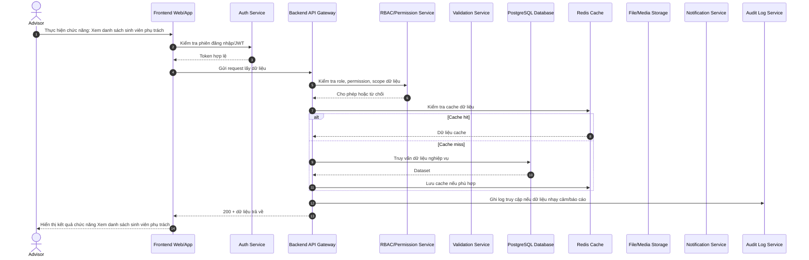

### 2. Xem tổng quan học tập

**Mục tiêu:** Mô tả luồng xử lý chi tiết cho chức năng **Xem tổng quan học tập** của đối tượng **Cố vấn học tập**.

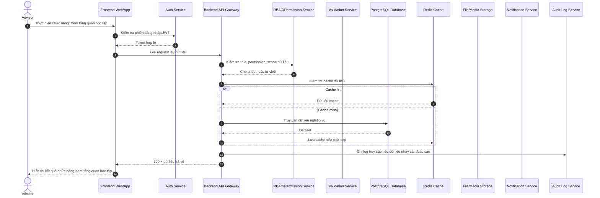

### 3. Xem sinh viên rủi ro

**Mục tiêu:** Mô tả luồng xử lý chi tiết cho chức năng **Xem sinh viên rủi ro** của đối tượng **Cố vấn học tập**.

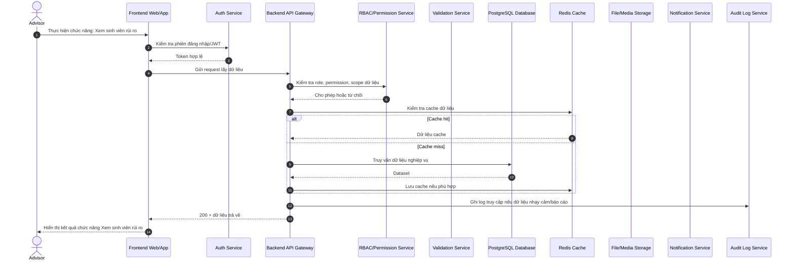

### 4. Xem sinh viên chưa nộp bài

**Mục tiêu:** Mô tả luồng xử lý chi tiết cho chức năng **Xem sinh viên chưa nộp bài** của đối tượng **Cố vấn học tập**.

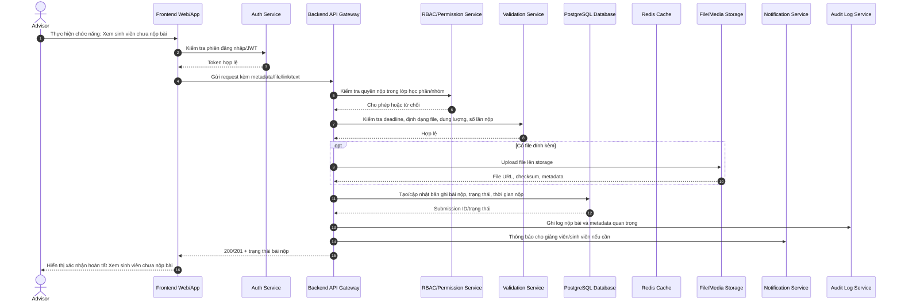

### 5. Xem sinh viên ít đăng nhập

**Mục tiêu:** Mô tả luồng xử lý chi tiết cho chức năng **Xem sinh viên ít đăng nhập** của đối tượng **Cố vấn học tập**.

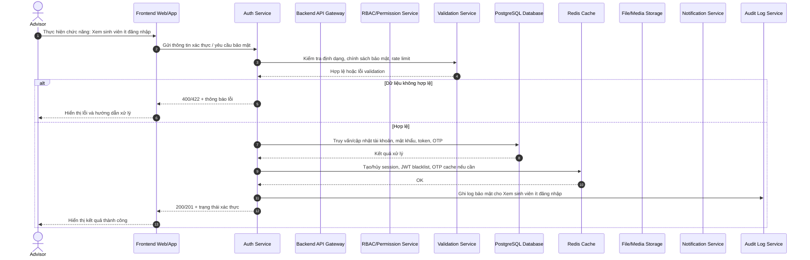

### 6. Xem cảnh báo mới

**Mục tiêu:** Mô tả luồng xử lý chi tiết cho chức năng **Xem cảnh báo mới** của đối tượng **Cố vấn học tập**.

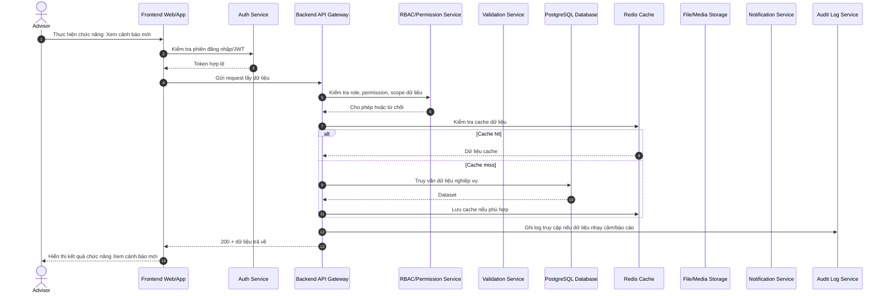

### 7. Xem lịch tư vấn hôm nay

**Mục tiêu:** Mô tả luồng xử lý chi tiết cho chức năng **Xem lịch tư vấn hôm nay** của đối tượng **Cố vấn học tập**.

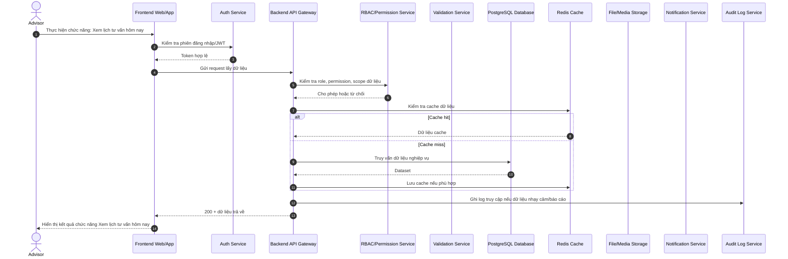

### 8. Xem thống kê lớp cố vấn

**Mục tiêu:** Mô tả luồng xử lý chi tiết cho chức năng **Xem thống kê lớp cố vấn** của đối tượng **Cố vấn học tập**.

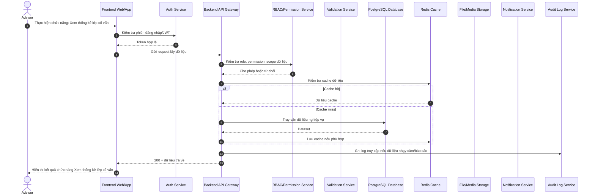

## 5.2. Hồ sơ sinh viên

### 9. Xem hồ sơ cá nhân

**Mục tiêu:** Mô tả luồng xử lý chi tiết cho chức năng **Xem hồ sơ cá nhân** của đối tượng **Cố vấn học tập**.


### 10. Xem hồ sơ học tập

**Mục tiêu:** Mô tả luồng xử lý chi tiết cho chức năng **Xem hồ sơ học tập** của đối tượng **Cố vấn học tập**.

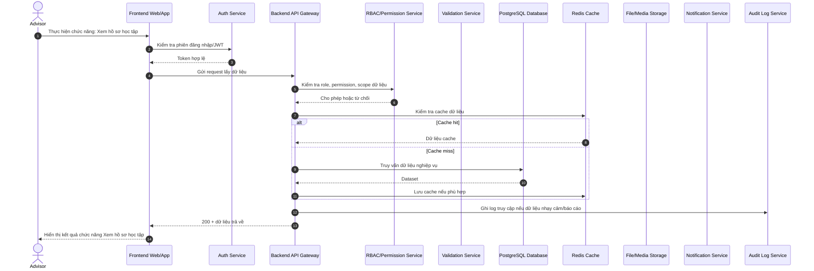

### 11. Xem lịch sử học tập

**Mục tiêu:** Mô tả luồng xử lý chi tiết cho chức năng **Xem lịch sử học tập** của đối tượng **Cố vấn học tập**.


### 12. Xem chuyên cần

**Mục tiêu:** Mô tả luồng xử lý chi tiết cho chức năng **Xem chuyên cần** của đối tượng **Cố vấn học tập**.

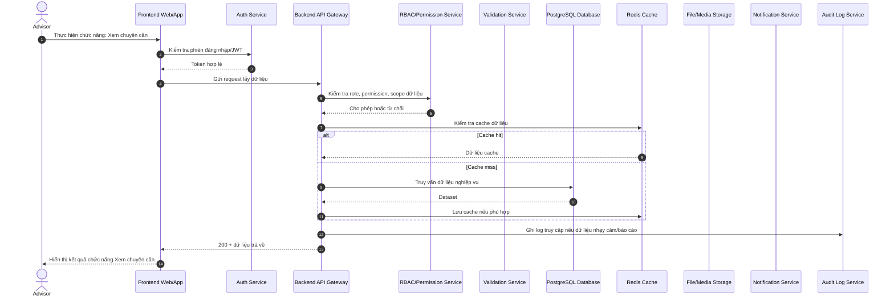

### 13. Xem tiến độ LMS

**Mục tiêu:** Mô tả luồng xử lý chi tiết cho chức năng **Xem tiến độ LMS** của đối tượng **Cố vấn học tập**.

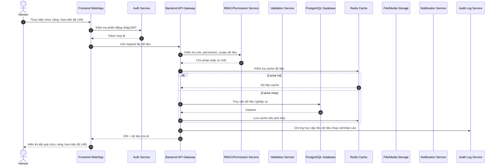

### 14. Xem bài tập chưa nộp

**Mục tiêu:** Mô tả luồng xử lý chi tiết cho chức năng **Xem bài tập chưa nộp** của đối tượng **Cố vấn học tập**.

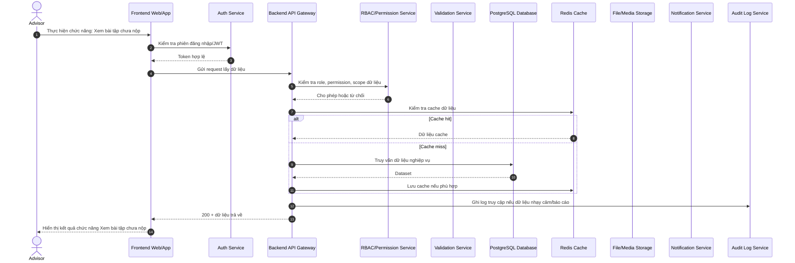

### 15. Xem kết quả quiz/thi

**Mục tiêu:** Mô tả luồng xử lý chi tiết cho chức năng **Xem kết quả quiz/thi** của đối tượng **Cố vấn học tập**.

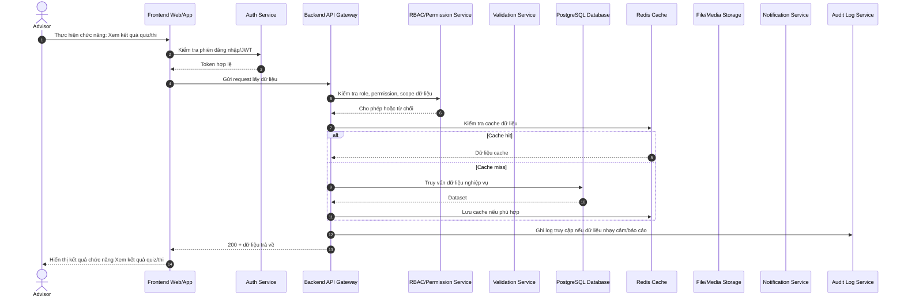

### 16. Xem ghi chú tư vấn

**Mục tiêu:** Mô tả luồng xử lý chi tiết cho chức năng **Xem ghi chú tư vấn** của đối tượng **Cố vấn học tập**.


### 17. Cập nhật ghi chú tư vấn

**Mục tiêu:** Mô tả luồng xử lý chi tiết cho chức năng **Cập nhật ghi chú tư vấn** của đối tượng **Cố vấn học tập**.

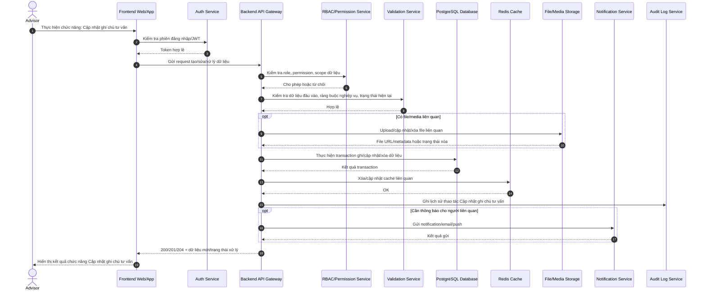

### 18. Xem tình trạng nợ môn

**Mục tiêu:** Mô tả luồng xử lý chi tiết cho chức năng **Xem tình trạng nợ môn** của đối tượng **Cố vấn học tập**.


### 19. Xem cảnh báo học vụ

**Mục tiêu:** Mô tả luồng xử lý chi tiết cho chức năng **Xem cảnh báo học vụ** của đối tượng **Cố vấn học tập**.

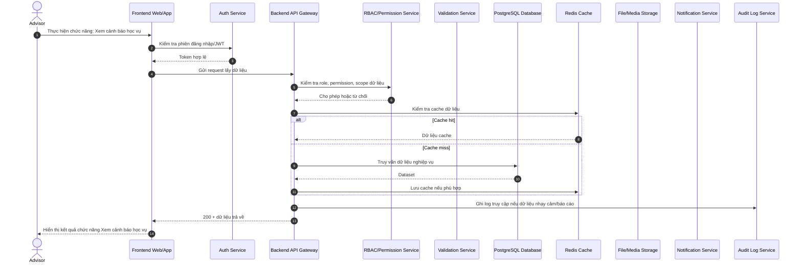

## 5.3. Theo dõi tiến độ học tập

### 20. Theo dõi tiến độ theo môn

**Mục tiêu:** Mô tả luồng xử lý chi tiết cho chức năng **Theo dõi tiến độ theo môn** của đối tượng **Cố vấn học tập**.


### 21. Theo dõi tiến độ theo tuần

**Mục tiêu:** Mô tả luồng xử lý chi tiết cho chức năng **Theo dõi tiến độ theo tuần** của đối tượng **Cố vấn học tập**.

```mermaid
sequenceDiagram
    autonumber
    actor U as Advisor
    participant FE as Frontend Web/App
    participant Auth as Auth Service
    participant API as Backend API Gateway
    participant RBAC as RBAC/Permission Service
    participant Val as Validation Service
    participant DB as PostgreSQL Database
    participant Cache as Redis Cache
    participant File as File/Media Storage
    participant Notify as Notification Service
    participant Audit as Audit Log Service
    U->>FE: Thực hiện chức năng: Theo dõi tiến độ theo tuần
    FE->>Auth: Kiểm tra phiên đăng nhập/JWT
    Auth-->>FE: Token hợp lệ
    FE->>API: Gửi request lấy dữ liệu
    API->>RBAC: Kiểm tra role, permission, scope dữ liệu
    RBAC-->>API: Cho phép hoặc từ chối
    API->>Cache: Kiểm tra cache dữ liệu
    alt Cache hit
        Cache-->>API: Dữ liệu cache
    else Cache miss
        API->>DB: Truy vấn dữ liệu nghiệp vụ
        DB-->>API: Dataset
        API->>Cache: Lưu cache nếu phù hợp
    end
    API->>Audit: Ghi log truy cập nếu dữ liệu nhạy cảm/báo cáo
    API-->>FE: 200 + dữ liệu trả về
    FE-->>U: Hiển thị kết quả chức năng Theo dõi tiến độ theo tuần
```

### 22. Theo dõi bài học chưa xem

**Mục tiêu:** Mô tả luồng xử lý chi tiết cho chức năng **Theo dõi bài học chưa xem** của đối tượng **Cố vấn học tập**.

```mermaid
sequenceDiagram
    autonumber
    actor U as Advisor
    participant FE as Frontend Web/App
    participant Auth as Auth Service
    participant API as Backend API Gateway
    participant RBAC as RBAC/Permission Service
    participant Val as Validation Service
    participant DB as PostgreSQL Database
    participant Cache as Redis Cache
    participant File as File/Media Storage
    participant Notify as Notification Service
    participant Audit as Audit Log Service
    U->>FE: Thực hiện chức năng: Theo dõi bài học chưa xem
    FE->>Auth: Kiểm tra phiên đăng nhập/JWT
    Auth-->>FE: Token hợp lệ
    FE->>API: Gửi request lấy dữ liệu
    API->>RBAC: Kiểm tra role, permission, scope dữ liệu
    RBAC-->>API: Cho phép hoặc từ chối
    API->>Cache: Kiểm tra cache dữ liệu
    alt Cache hit
        Cache-->>API: Dữ liệu cache
    else Cache miss
        API->>DB: Truy vấn dữ liệu nghiệp vụ
        DB-->>API: Dataset
        API->>Cache: Lưu cache nếu phù hợp
    end
    API->>Audit: Ghi log truy cập nếu dữ liệu nhạy cảm/báo cáo
    API-->>FE: 200 + dữ liệu trả về
    FE-->>U: Hiển thị kết quả chức năng Theo dõi bài học chưa xem
```

### 23. Theo dõi bài tập trễ hạn

**Mục tiêu:** Mô tả luồng xử lý chi tiết cho chức năng **Theo dõi bài tập trễ hạn** của đối tượng **Cố vấn học tập**.

```mermaid
sequenceDiagram
    autonumber
    actor U as Advisor
    participant FE as Frontend Web/App
    participant Auth as Auth Service
    participant API as Backend API Gateway
    participant RBAC as RBAC/Permission Service
    participant Val as Validation Service
    participant DB as PostgreSQL Database
    participant Cache as Redis Cache
    participant File as File/Media Storage
    participant Notify as Notification Service
    participant Audit as Audit Log Service
    U->>FE: Thực hiện chức năng: Theo dõi bài tập trễ hạn
    FE->>Auth: Kiểm tra phiên đăng nhập/JWT
    Auth-->>FE: Token hợp lệ
    FE->>API: Gửi request lấy dữ liệu
    API->>RBAC: Kiểm tra role, permission, scope dữ liệu
    RBAC-->>API: Cho phép hoặc từ chối
    API->>Cache: Kiểm tra cache dữ liệu
    alt Cache hit
        Cache-->>API: Dữ liệu cache
    else Cache miss
        API->>DB: Truy vấn dữ liệu nghiệp vụ
        DB-->>API: Dataset
        API->>Cache: Lưu cache nếu phù hợp
    end
    API->>Audit: Ghi log truy cập nếu dữ liệu nhạy cảm/báo cáo
    API-->>FE: 200 + dữ liệu trả về
    FE-->>U: Hiển thị kết quả chức năng Theo dõi bài tập trễ hạn
```

### 24. Theo dõi điểm thấp

**Mục tiêu:** Mô tả luồng xử lý chi tiết cho chức năng **Theo dõi điểm thấp** của đối tượng **Cố vấn học tập**.

```mermaid
sequenceDiagram
    autonumber
    actor U as Advisor
    participant FE as Frontend Web/App
    participant Auth as Auth Service
    participant API as Backend API Gateway
    participant RBAC as RBAC/Permission Service
    participant Val as Validation Service
    participant DB as PostgreSQL Database
    participant Cache as Redis Cache
    participant File as File/Media Storage
    participant Notify as Notification Service
    participant Audit as Audit Log Service
    U->>FE: Thực hiện chức năng: Theo dõi điểm thấp
    FE->>Auth: Kiểm tra phiên đăng nhập/JWT
    Auth-->>FE: Token hợp lệ
    FE->>API: Gửi request lấy dữ liệu
    API->>RBAC: Kiểm tra role, permission, scope dữ liệu
    RBAC-->>API: Cho phép hoặc từ chối
    API->>Cache: Kiểm tra cache dữ liệu
    alt Cache hit
        Cache-->>API: Dữ liệu cache
    else Cache miss
        API->>DB: Truy vấn dữ liệu nghiệp vụ
        DB-->>API: Dataset
        API->>Cache: Lưu cache nếu phù hợp
    end
    API->>Audit: Ghi log truy cập nếu dữ liệu nhạy cảm/báo cáo
    API-->>FE: 200 + dữ liệu trả về
    FE-->>U: Hiển thị kết quả chức năng Theo dõi điểm thấp
```

### 25. Theo dõi điểm trung bình

**Mục tiêu:** Mô tả luồng xử lý chi tiết cho chức năng **Theo dõi điểm trung bình** của đối tượng **Cố vấn học tập**.

```mermaid
sequenceDiagram
    autonumber
    actor U as Advisor
    participant FE as Frontend Web/App
    participant Auth as Auth Service
    participant API as Backend API Gateway
    participant RBAC as RBAC/Permission Service
    participant Val as Validation Service
    participant DB as PostgreSQL Database
    participant Cache as Redis Cache
    participant File as File/Media Storage
    participant Notify as Notification Service
    participant Audit as Audit Log Service
    U->>FE: Thực hiện chức năng: Theo dõi điểm trung bình
    FE->>Auth: Kiểm tra phiên đăng nhập/JWT
    Auth-->>FE: Token hợp lệ
    FE->>API: Gửi request lấy dữ liệu
    API->>RBAC: Kiểm tra role, permission, scope dữ liệu
    RBAC-->>API: Cho phép hoặc từ chối
    API->>Cache: Kiểm tra cache dữ liệu
    alt Cache hit
        Cache-->>API: Dữ liệu cache
    else Cache miss
        API->>DB: Truy vấn dữ liệu nghiệp vụ
        DB-->>API: Dataset
        API->>Cache: Lưu cache nếu phù hợp
    end
    API->>Audit: Ghi log truy cập nếu dữ liệu nhạy cảm/báo cáo
    API-->>FE: 200 + dữ liệu trả về
    FE-->>U: Hiển thị kết quả chức năng Theo dõi điểm trung bình
```

### 26. Theo dõi môn có nguy cơ rớt

**Mục tiêu:** Mô tả luồng xử lý chi tiết cho chức năng **Theo dõi môn có nguy cơ rớt** của đối tượng **Cố vấn học tập**.

```mermaid
sequenceDiagram
    autonumber
    actor U as Advisor
    participant FE as Frontend Web/App
    participant Auth as Auth Service
    participant API as Backend API Gateway
    participant RBAC as RBAC/Permission Service
    participant Val as Validation Service
    participant DB as PostgreSQL Database
    participant Cache as Redis Cache
    participant File as File/Media Storage
    participant Notify as Notification Service
    participant Audit as Audit Log Service
    U->>FE: Thực hiện chức năng: Theo dõi môn có nguy cơ rớt
    FE->>Auth: Kiểm tra phiên đăng nhập/JWT
    Auth-->>FE: Token hợp lệ
    FE->>API: Gửi request lấy dữ liệu
    API->>RBAC: Kiểm tra role, permission, scope dữ liệu
    RBAC-->>API: Cho phép hoặc từ chối
    API->>Cache: Kiểm tra cache dữ liệu
    alt Cache hit
        Cache-->>API: Dữ liệu cache
    else Cache miss
        API->>DB: Truy vấn dữ liệu nghiệp vụ
        DB-->>API: Dataset
        API->>Cache: Lưu cache nếu phù hợp
    end
    API->>Audit: Ghi log truy cập nếu dữ liệu nhạy cảm/báo cáo
    API-->>FE: 200 + dữ liệu trả về
    FE-->>U: Hiển thị kết quả chức năng Theo dõi môn có nguy cơ rớt
```

### 27. So sánh tiến độ với lớp

**Mục tiêu:** Mô tả luồng xử lý chi tiết cho chức năng **So sánh tiến độ với lớp** của đối tượng **Cố vấn học tập**.

```mermaid
sequenceDiagram
    autonumber
    actor U as Advisor
    participant FE as Frontend Web/App
    participant Auth as Auth Service
    participant API as Backend API Gateway
    participant RBAC as RBAC/Permission Service
    participant Val as Validation Service
    participant DB as PostgreSQL Database
    participant Cache as Redis Cache
    participant File as File/Media Storage
    participant Notify as Notification Service
    participant Audit as Audit Log Service
    U->>FE: Thực hiện chức năng: So sánh tiến độ với lớp
    FE->>Auth: Kiểm tra phiên đăng nhập/JWT
    Auth-->>FE: Token hợp lệ
    FE->>API: Gửi request lấy dữ liệu
    API->>RBAC: Kiểm tra role, permission, scope dữ liệu
    RBAC-->>API: Cho phép hoặc từ chối
    API->>Cache: Kiểm tra cache dữ liệu
    alt Cache hit
        Cache-->>API: Dữ liệu cache
    else Cache miss
        API->>DB: Truy vấn dữ liệu nghiệp vụ
        DB-->>API: Dataset
        API->>Cache: Lưu cache nếu phù hợp
    end
    API->>Audit: Ghi log truy cập nếu dữ liệu nhạy cảm/báo cáo
    API-->>FE: 200 + dữ liệu trả về
    FE-->>U: Hiển thị kết quả chức năng So sánh tiến độ với lớp
```

### 28. Theo dõi xu hướng học tập

**Mục tiêu:** Mô tả luồng xử lý chi tiết cho chức năng **Theo dõi xu hướng học tập** của đối tượng **Cố vấn học tập**.

```mermaid
sequenceDiagram
    autonumber
    actor U as Advisor
    participant FE as Frontend Web/App
    participant Auth as Auth Service
    participant API as Backend API Gateway
    participant RBAC as RBAC/Permission Service
    participant Val as Validation Service
    participant DB as PostgreSQL Database
    participant Cache as Redis Cache
    participant File as File/Media Storage
    participant Notify as Notification Service
    participant Audit as Audit Log Service
    U->>FE: Thực hiện chức năng: Theo dõi xu hướng học tập
    FE->>Auth: Kiểm tra phiên đăng nhập/JWT
    Auth-->>FE: Token hợp lệ
    FE->>API: Gửi request lấy dữ liệu
    API->>RBAC: Kiểm tra role, permission, scope dữ liệu
    RBAC-->>API: Cho phép hoặc từ chối
    API->>Cache: Kiểm tra cache dữ liệu
    alt Cache hit
        Cache-->>API: Dữ liệu cache
    else Cache miss
        API->>DB: Truy vấn dữ liệu nghiệp vụ
        DB-->>API: Dataset
        API->>Cache: Lưu cache nếu phù hợp
    end
    API->>Audit: Ghi log truy cập nếu dữ liệu nhạy cảm/báo cáo
    API-->>FE: 200 + dữ liệu trả về
    FE-->>U: Hiển thị kết quả chức năng Theo dõi xu hướng học tập
```

### 29. Xem biểu đồ tiến bộ

**Mục tiêu:** Mô tả luồng xử lý chi tiết cho chức năng **Xem biểu đồ tiến bộ** của đối tượng **Cố vấn học tập**.

```mermaid
sequenceDiagram
    autonumber
    actor U as Advisor
    participant FE as Frontend Web/App
    participant Auth as Auth Service
    participant API as Backend API Gateway
    participant RBAC as RBAC/Permission Service
    participant Val as Validation Service
    participant DB as PostgreSQL Database
    participant Cache as Redis Cache
    participant File as File/Media Storage
    participant Notify as Notification Service
    participant Audit as Audit Log Service
    U->>FE: Thực hiện chức năng: Xem biểu đồ tiến bộ
    FE->>Auth: Kiểm tra phiên đăng nhập/JWT
    Auth-->>FE: Token hợp lệ
    FE->>API: Gửi request lấy dữ liệu
    API->>RBAC: Kiểm tra role, permission, scope dữ liệu
    RBAC-->>API: Cho phép hoặc từ chối
    API->>Cache: Kiểm tra cache dữ liệu
    alt Cache hit
        Cache-->>API: Dữ liệu cache
    else Cache miss
        API->>DB: Truy vấn dữ liệu nghiệp vụ
        DB-->>API: Dataset
        API->>Cache: Lưu cache nếu phù hợp
    end
    API->>Audit: Ghi log truy cập nếu dữ liệu nhạy cảm/báo cáo
    API-->>FE: 200 + dữ liệu trả về
    FE-->>U: Hiển thị kết quả chức năng Xem biểu đồ tiến bộ
```

## 5.4. Cảnh báo học vụ

### 30. Nhận cảnh báo tự động

**Mục tiêu:** Mô tả luồng xử lý chi tiết cho chức năng **Nhận cảnh báo tự động** của đối tượng **Cố vấn học tập**.

```mermaid
sequenceDiagram
    autonumber
    actor U as Advisor
    participant FE as Frontend Web/App
    participant Auth as Auth Service
    participant API as Backend API Gateway
    participant RBAC as RBAC/Permission Service
    participant Val as Validation Service
    participant DB as PostgreSQL Database
    participant Cache as Redis Cache
    participant File as File/Media Storage
    participant Notify as Notification Service
    participant Audit as Audit Log Service
    U->>FE: Thực hiện chức năng: Nhận cảnh báo tự động
    FE->>Auth: Kiểm tra phiên đăng nhập/JWT
    Auth-->>FE: Token hợp lệ
    FE->>API: Gửi request lấy dữ liệu
    API->>RBAC: Kiểm tra role, permission, scope dữ liệu
    RBAC-->>API: Cho phép hoặc từ chối
    API->>Cache: Kiểm tra cache dữ liệu
    alt Cache hit
        Cache-->>API: Dữ liệu cache
    else Cache miss
        API->>DB: Truy vấn dữ liệu nghiệp vụ
        DB-->>API: Dataset
        API->>Cache: Lưu cache nếu phù hợp
    end
    API->>Audit: Ghi log truy cập nếu dữ liệu nhạy cảm/báo cáo
    API-->>FE: 200 + dữ liệu trả về
    FE-->>U: Hiển thị kết quả chức năng Nhận cảnh báo tự động
```

### 31. Cấu hình ngưỡng cảnh báo

**Mục tiêu:** Mô tả luồng xử lý chi tiết cho chức năng **Cấu hình ngưỡng cảnh báo** của đối tượng **Cố vấn học tập**.

```mermaid
sequenceDiagram
    autonumber
    actor U as Advisor
    participant FE as Frontend Web/App
    participant Auth as Auth Service
    participant API as Backend API Gateway
    participant RBAC as RBAC/Permission Service
    participant Val as Validation Service
    participant DB as PostgreSQL Database
    participant Cache as Redis Cache
    participant File as File/Media Storage
    participant Notify as Notification Service
    participant Audit as Audit Log Service
    U->>FE: Thực hiện chức năng: Cấu hình ngưỡng cảnh báo
    FE->>Auth: Kiểm tra phiên đăng nhập/JWT
    Auth-->>FE: Token hợp lệ
    FE->>API: Gửi request tạo/sửa/xử lý dữ liệu
    API->>RBAC: Kiểm tra role, permission, scope dữ liệu
    RBAC-->>API: Cho phép hoặc từ chối
    API->>Val: Kiểm tra dữ liệu đầu vào, ràng buộc nghiệp vụ, trạng thái hiện tại
    Val-->>API: Hợp lệ
    opt Có file/media liên quan
        API->>File: Upload/cập nhật/xóa file liên quan
        File-->>API: File URL/metadata hoặc trạng thái xóa
    end
    API->>DB: Thực hiện transaction ghi/cập nhật/xóa dữ liệu
    DB-->>API: Kết quả transaction
    API->>Cache: Xóa/cập nhật cache liên quan
    Cache-->>API: OK
    API->>Audit: Ghi lịch sử thao tác Cấu hình ngưỡng cảnh báo
    opt Cần thông báo cho người liên quan
        API->>Notify: Gửi notification/email/push
        Notify-->>API: Kết quả gửi
    end
    API-->>FE: 200/201/204 + dữ liệu mới/trạng thái xử lý
    FE-->>U: Hiển thị kết quả chức năng Cấu hình ngưỡng cảnh báo
```

### 32. Phân loại mức độ rủi ro

**Mục tiêu:** Mô tả luồng xử lý chi tiết cho chức năng **Phân loại mức độ rủi ro** của đối tượng **Cố vấn học tập**.

```mermaid
sequenceDiagram
    autonumber
    actor U as Advisor
    participant FE as Frontend Web/App
    participant Auth as Auth Service
    participant API as Backend API Gateway
    participant RBAC as RBAC/Permission Service
    participant Val as Validation Service
    participant DB as PostgreSQL Database
    participant Cache as Redis Cache
    participant File as File/Media Storage
    participant Notify as Notification Service
    participant Audit as Audit Log Service
    U->>FE: Thực hiện chức năng: Phân loại mức độ rủi ro
    FE->>Auth: Kiểm tra phiên đăng nhập/JWT
    Auth-->>FE: Token hợp lệ
    FE->>API: Gửi request tạo/sửa/xử lý dữ liệu
    API->>RBAC: Kiểm tra role, permission, scope dữ liệu
    RBAC-->>API: Cho phép hoặc từ chối
    API->>Val: Kiểm tra dữ liệu đầu vào, ràng buộc nghiệp vụ, trạng thái hiện tại
    Val-->>API: Hợp lệ
    opt Có file/media liên quan
        API->>File: Upload/cập nhật/xóa file liên quan
        File-->>API: File URL/metadata hoặc trạng thái xóa
    end
    API->>DB: Thực hiện transaction ghi/cập nhật/xóa dữ liệu
    DB-->>API: Kết quả transaction
    API->>Cache: Xóa/cập nhật cache liên quan
    Cache-->>API: OK
    API->>Audit: Ghi lịch sử thao tác Phân loại mức độ rủi ro
    opt Cần thông báo cho người liên quan
        API->>Notify: Gửi notification/email/push
        Notify-->>API: Kết quả gửi
    end
    API-->>FE: 200/201/204 + dữ liệu mới/trạng thái xử lý
    FE-->>U: Hiển thị kết quả chức năng Phân loại mức độ rủi ro
```

### 33. Xem lý do cảnh báo

**Mục tiêu:** Mô tả luồng xử lý chi tiết cho chức năng **Xem lý do cảnh báo** của đối tượng **Cố vấn học tập**.

```mermaid
sequenceDiagram
    autonumber
    actor U as Advisor
    participant FE as Frontend Web/App
    participant Auth as Auth Service
    participant API as Backend API Gateway
    participant RBAC as RBAC/Permission Service
    participant Val as Validation Service
    participant DB as PostgreSQL Database
    participant Cache as Redis Cache
    participant File as File/Media Storage
    participant Notify as Notification Service
    participant Audit as Audit Log Service
    U->>FE: Thực hiện chức năng: Xem lý do cảnh báo
    FE->>Auth: Kiểm tra phiên đăng nhập/JWT
    Auth-->>FE: Token hợp lệ
    FE->>API: Gửi request lấy dữ liệu
    API->>RBAC: Kiểm tra role, permission, scope dữ liệu
    RBAC-->>API: Cho phép hoặc từ chối
    API->>Cache: Kiểm tra cache dữ liệu
    alt Cache hit
        Cache-->>API: Dữ liệu cache
    else Cache miss
        API->>DB: Truy vấn dữ liệu nghiệp vụ
        DB-->>API: Dataset
        API->>Cache: Lưu cache nếu phù hợp
    end
    API->>Audit: Ghi log truy cập nếu dữ liệu nhạy cảm/báo cáo
    API-->>FE: 200 + dữ liệu trả về
    FE-->>U: Hiển thị kết quả chức năng Xem lý do cảnh báo
```

### 34. Gửi cảnh báo cho sinh viên

**Mục tiêu:** Mô tả luồng xử lý chi tiết cho chức năng **Gửi cảnh báo cho sinh viên** của đối tượng **Cố vấn học tập**.

```mermaid
sequenceDiagram
    autonumber
    actor U as Advisor
    participant FE as Frontend Web/App
    participant Auth as Auth Service
    participant API as Backend API Gateway
    participant RBAC as RBAC/Permission Service
    participant Val as Validation Service
    participant DB as PostgreSQL Database
    participant Cache as Redis Cache
    participant File as File/Media Storage
    participant Notify as Notification Service
    participant Audit as Audit Log Service
    U->>FE: Thực hiện chức năng: Gửi cảnh báo cho sinh viên
    FE->>Auth: Kiểm tra phiên đăng nhập/JWT
    Auth-->>FE: Token hợp lệ
    FE->>API: Gửi nội dung, người nhận, phạm vi gửi
    API->>RBAC: Kiểm tra quyền gửi theo vai trò/phạm vi dữ liệu
    RBAC-->>API: Cho phép hoặc từ chối
    API->>Val: Kiểm tra nội dung, danh sách người nhận, template, spam/rate limit
    Val-->>API: Hợp lệ
    API->>DB: Lưu thông báo/tin nhắn/yêu cầu liên hệ
    DB-->>API: Message/Notification ID
    API->>Notify: Phân phối qua web/email/push theo cấu hình người nhận
    Notify-->>API: Kết quả gửi
    API->>Audit: Ghi log gửi thông báo/tin nhắn
    API-->>FE: 200/201 + trạng thái gửi
    FE-->>U: Hiển thị trạng thái hoàn tất Gửi cảnh báo cho sinh viên
```

### 35. Gửi cảnh báo cho khoa

**Mục tiêu:** Mô tả luồng xử lý chi tiết cho chức năng **Gửi cảnh báo cho khoa** của đối tượng **Cố vấn học tập**.

```mermaid
sequenceDiagram
    autonumber
    actor U as Advisor
    participant FE as Frontend Web/App
    participant Auth as Auth Service
    participant API as Backend API Gateway
    participant RBAC as RBAC/Permission Service
    participant Val as Validation Service
    participant DB as PostgreSQL Database
    participant Cache as Redis Cache
    participant File as File/Media Storage
    participant Notify as Notification Service
    participant Audit as Audit Log Service
    U->>FE: Thực hiện chức năng: Gửi cảnh báo cho khoa
    FE->>Auth: Kiểm tra phiên đăng nhập/JWT
    Auth-->>FE: Token hợp lệ
    FE->>API: Gửi nội dung, người nhận, phạm vi gửi
    API->>RBAC: Kiểm tra quyền gửi theo vai trò/phạm vi dữ liệu
    RBAC-->>API: Cho phép hoặc từ chối
    API->>Val: Kiểm tra nội dung, danh sách người nhận, template, spam/rate limit
    Val-->>API: Hợp lệ
    API->>DB: Lưu thông báo/tin nhắn/yêu cầu liên hệ
    DB-->>API: Message/Notification ID
    API->>Notify: Phân phối qua web/email/push theo cấu hình người nhận
    Notify-->>API: Kết quả gửi
    API->>Audit: Ghi log gửi thông báo/tin nhắn
    API-->>FE: 200/201 + trạng thái gửi
    FE-->>U: Hiển thị trạng thái hoàn tất Gửi cảnh báo cho khoa
```

### 36. Gửi cảnh báo cho phụ huynh

**Mục tiêu:** Mô tả luồng xử lý chi tiết cho chức năng **Gửi cảnh báo cho phụ huynh** của đối tượng **Cố vấn học tập**.

```mermaid
sequenceDiagram
    autonumber
    actor U as Advisor
    participant FE as Frontend Web/App
    participant Auth as Auth Service
    participant API as Backend API Gateway
    participant RBAC as RBAC/Permission Service
    participant Val as Validation Service
    participant DB as PostgreSQL Database
    participant Cache as Redis Cache
    participant File as File/Media Storage
    participant Notify as Notification Service
    participant Audit as Audit Log Service
    U->>FE: Thực hiện chức năng: Gửi cảnh báo cho phụ huynh
    FE->>Auth: Kiểm tra phiên đăng nhập/JWT
    Auth-->>FE: Token hợp lệ
    FE->>API: Gửi nội dung, người nhận, phạm vi gửi
    API->>RBAC: Kiểm tra quyền gửi theo vai trò/phạm vi dữ liệu
    RBAC-->>API: Cho phép hoặc từ chối
    API->>Val: Kiểm tra nội dung, danh sách người nhận, template, spam/rate limit
    Val-->>API: Hợp lệ
    API->>DB: Lưu thông báo/tin nhắn/yêu cầu liên hệ
    DB-->>API: Message/Notification ID
    API->>Notify: Phân phối qua web/email/push theo cấu hình người nhận
    Notify-->>API: Kết quả gửi
    API->>Audit: Ghi log gửi thông báo/tin nhắn
    API-->>FE: 200/201 + trạng thái gửi
    FE-->>U: Hiển thị trạng thái hoàn tất Gửi cảnh báo cho phụ huynh
```

### 37. Theo dõi trạng thái cảnh báo

**Mục tiêu:** Mô tả luồng xử lý chi tiết cho chức năng **Theo dõi trạng thái cảnh báo** của đối tượng **Cố vấn học tập**.

```mermaid
sequenceDiagram
    autonumber
    actor U as Advisor
    participant FE as Frontend Web/App
    participant Auth as Auth Service
    participant API as Backend API Gateway
    participant RBAC as RBAC/Permission Service
    participant Val as Validation Service
    participant DB as PostgreSQL Database
    participant Cache as Redis Cache
    participant File as File/Media Storage
    participant Notify as Notification Service
    participant Audit as Audit Log Service
    U->>FE: Thực hiện chức năng: Theo dõi trạng thái cảnh báo
    FE->>Auth: Kiểm tra phiên đăng nhập/JWT
    Auth-->>FE: Token hợp lệ
    FE->>API: Gửi request lấy dữ liệu
    API->>RBAC: Kiểm tra role, permission, scope dữ liệu
    RBAC-->>API: Cho phép hoặc từ chối
    API->>Cache: Kiểm tra cache dữ liệu
    alt Cache hit
        Cache-->>API: Dữ liệu cache
    else Cache miss
        API->>DB: Truy vấn dữ liệu nghiệp vụ
        DB-->>API: Dataset
        API->>Cache: Lưu cache nếu phù hợp
    end
    API->>Audit: Ghi log truy cập nếu dữ liệu nhạy cảm/báo cáo
    API-->>FE: 200 + dữ liệu trả về
    FE-->>U: Hiển thị kết quả chức năng Theo dõi trạng thái cảnh báo
```

### 38. Đóng cảnh báo

**Mục tiêu:** Mô tả luồng xử lý chi tiết cho chức năng **Đóng cảnh báo** của đối tượng **Cố vấn học tập**.

```mermaid
sequenceDiagram
    autonumber
    actor U as Advisor
    participant FE as Frontend Web/App
    participant Auth as Auth Service
    participant API as Backend API Gateway
    participant RBAC as RBAC/Permission Service
    participant Val as Validation Service
    participant DB as PostgreSQL Database
    participant Cache as Redis Cache
    participant File as File/Media Storage
    participant Notify as Notification Service
    participant Audit as Audit Log Service
    U->>FE: Thực hiện chức năng: Đóng cảnh báo
    FE->>Auth: Kiểm tra phiên đăng nhập/JWT
    Auth-->>FE: Token hợp lệ
    FE->>API: Gửi request tạo/sửa/xử lý dữ liệu
    API->>RBAC: Kiểm tra role, permission, scope dữ liệu
    RBAC-->>API: Cho phép hoặc từ chối
    API->>Val: Kiểm tra dữ liệu đầu vào, ràng buộc nghiệp vụ, trạng thái hiện tại
    Val-->>API: Hợp lệ
    opt Có file/media liên quan
        API->>File: Upload/cập nhật/xóa file liên quan
        File-->>API: File URL/metadata hoặc trạng thái xóa
    end
    API->>DB: Thực hiện transaction ghi/cập nhật/xóa dữ liệu
    DB-->>API: Kết quả transaction
    API->>Cache: Xóa/cập nhật cache liên quan
    Cache-->>API: OK
    API->>Audit: Ghi lịch sử thao tác Đóng cảnh báo
    opt Cần thông báo cho người liên quan
        API->>Notify: Gửi notification/email/push
        Notify-->>API: Kết quả gửi
    end
    API-->>FE: 200/201/204 + dữ liệu mới/trạng thái xử lý
    FE-->>U: Hiển thị kết quả chức năng Đóng cảnh báo
```

### 39. Lưu lịch sử cảnh báo

**Mục tiêu:** Mô tả luồng xử lý chi tiết cho chức năng **Lưu lịch sử cảnh báo** của đối tượng **Cố vấn học tập**.

```mermaid
sequenceDiagram
    autonumber
    actor U as Advisor
    participant FE as Frontend Web/App
    participant Auth as Auth Service
    participant API as Backend API Gateway
    participant RBAC as RBAC/Permission Service
    participant Val as Validation Service
    participant DB as PostgreSQL Database
    participant Cache as Redis Cache
    participant File as File/Media Storage
    participant Notify as Notification Service
    participant Audit as Audit Log Service
    U->>FE: Thực hiện chức năng: Lưu lịch sử cảnh báo
    FE->>Auth: Kiểm tra phiên đăng nhập/JWT
    Auth-->>FE: Token hợp lệ
    FE->>API: Gửi request lấy dữ liệu
    API->>RBAC: Kiểm tra role, permission, scope dữ liệu
    RBAC-->>API: Cho phép hoặc từ chối
    API->>Cache: Kiểm tra cache dữ liệu
    alt Cache hit
        Cache-->>API: Dữ liệu cache
    else Cache miss
        API->>DB: Truy vấn dữ liệu nghiệp vụ
        DB-->>API: Dataset
        API->>Cache: Lưu cache nếu phù hợp
    end
    API->>Audit: Ghi log truy cập nếu dữ liệu nhạy cảm/báo cáo
    API-->>FE: 200 + dữ liệu trả về
    FE-->>U: Hiển thị kết quả chức năng Lưu lịch sử cảnh báo
```

### 40. Gắn nhãn sinh viên rủi ro

**Mục tiêu:** Mô tả luồng xử lý chi tiết cho chức năng **Gắn nhãn sinh viên rủi ro** của đối tượng **Cố vấn học tập**.

```mermaid
sequenceDiagram
    autonumber
    actor U as Advisor
    participant FE as Frontend Web/App
    participant Auth as Auth Service
    participant API as Backend API Gateway
    participant RBAC as RBAC/Permission Service
    participant Val as Validation Service
    participant DB as PostgreSQL Database
    participant Cache as Redis Cache
    participant File as File/Media Storage
    participant Notify as Notification Service
    participant Audit as Audit Log Service
    U->>FE: Thực hiện chức năng: Gắn nhãn sinh viên rủi ro
    FE->>Auth: Kiểm tra phiên đăng nhập/JWT
    Auth-->>FE: Token hợp lệ
    FE->>API: Gửi request tạo/sửa/xử lý dữ liệu
    API->>RBAC: Kiểm tra role, permission, scope dữ liệu
    RBAC-->>API: Cho phép hoặc từ chối
    API->>Val: Kiểm tra dữ liệu đầu vào, ràng buộc nghiệp vụ, trạng thái hiện tại
    Val-->>API: Hợp lệ
    opt Có file/media liên quan
        API->>File: Upload/cập nhật/xóa file liên quan
        File-->>API: File URL/metadata hoặc trạng thái xóa
    end
    API->>DB: Thực hiện transaction ghi/cập nhật/xóa dữ liệu
    DB-->>API: Kết quả transaction
    API->>Cache: Xóa/cập nhật cache liên quan
    Cache-->>API: OK
    API->>Audit: Ghi lịch sử thao tác Gắn nhãn sinh viên rủi ro
    opt Cần thông báo cho người liên quan
        API->>Notify: Gửi notification/email/push
        Notify-->>API: Kết quả gửi
    end
    API-->>FE: 200/201/204 + dữ liệu mới/trạng thái xử lý
    FE-->>U: Hiển thị kết quả chức năng Gắn nhãn sinh viên rủi ro
```

## 5.5. Tư vấn & hỗ trợ sinh viên

### 41. Tạo lịch hẹn tư vấn

**Mục tiêu:** Mô tả luồng xử lý chi tiết cho chức năng **Tạo lịch hẹn tư vấn** của đối tượng **Cố vấn học tập**.

```mermaid
sequenceDiagram
    autonumber
    actor U as Advisor
    participant FE as Frontend Web/App
    participant Auth as Auth Service
    participant API as Backend API Gateway
    participant RBAC as RBAC/Permission Service
    participant Val as Validation Service
    participant DB as PostgreSQL Database
    participant Cache as Redis Cache
    participant File as File/Media Storage
    participant Notify as Notification Service
    participant Audit as Audit Log Service
    U->>FE: Thực hiện chức năng: Tạo lịch hẹn tư vấn
    FE->>Auth: Kiểm tra phiên đăng nhập/JWT
    Auth-->>FE: Token hợp lệ
    FE->>API: Gửi request tạo/sửa/xử lý dữ liệu
    API->>RBAC: Kiểm tra role, permission, scope dữ liệu
    RBAC-->>API: Cho phép hoặc từ chối
    API->>Val: Kiểm tra dữ liệu đầu vào, ràng buộc nghiệp vụ, trạng thái hiện tại
    Val-->>API: Hợp lệ
    opt Có file/media liên quan
        API->>File: Upload/cập nhật/xóa file liên quan
        File-->>API: File URL/metadata hoặc trạng thái xóa
    end
    API->>DB: Thực hiện transaction ghi/cập nhật/xóa dữ liệu
    DB-->>API: Kết quả transaction
    API->>Cache: Xóa/cập nhật cache liên quan
    Cache-->>API: OK
    API->>Audit: Ghi lịch sử thao tác Tạo lịch hẹn tư vấn
    opt Cần thông báo cho người liên quan
        API->>Notify: Gửi notification/email/push
        Notify-->>API: Kết quả gửi
    end
    API-->>FE: 200/201/204 + dữ liệu mới/trạng thái xử lý
    FE-->>U: Hiển thị kết quả chức năng Tạo lịch hẹn tư vấn
```

### 42. Quản lý lịch tư vấn

**Mục tiêu:** Mô tả luồng xử lý chi tiết cho chức năng **Quản lý lịch tư vấn** của đối tượng **Cố vấn học tập**.

```mermaid
sequenceDiagram
    autonumber
    actor U as Advisor
    participant FE as Frontend Web/App
    participant Auth as Auth Service
    participant API as Backend API Gateway
    participant RBAC as RBAC/Permission Service
    participant Val as Validation Service
    participant DB as PostgreSQL Database
    participant Cache as Redis Cache
    participant File as File/Media Storage
    participant Notify as Notification Service
    participant Audit as Audit Log Service
    U->>FE: Thực hiện chức năng: Quản lý lịch tư vấn
    FE->>Auth: Kiểm tra phiên đăng nhập/JWT
    Auth-->>FE: Token hợp lệ
    FE->>API: Gửi request lấy dữ liệu
    API->>RBAC: Kiểm tra role, permission, scope dữ liệu
    RBAC-->>API: Cho phép hoặc từ chối
    API->>Cache: Kiểm tra cache dữ liệu
    alt Cache hit
        Cache-->>API: Dữ liệu cache
    else Cache miss
        API->>DB: Truy vấn dữ liệu nghiệp vụ
        DB-->>API: Dataset
        API->>Cache: Lưu cache nếu phù hợp
    end
    API->>Audit: Ghi log truy cập nếu dữ liệu nhạy cảm/báo cáo
    API-->>FE: 200 + dữ liệu trả về
    FE-->>U: Hiển thị kết quả chức năng Quản lý lịch tư vấn
```

### 43. Gửi lời mời tư vấn

**Mục tiêu:** Mô tả luồng xử lý chi tiết cho chức năng **Gửi lời mời tư vấn** của đối tượng **Cố vấn học tập**.

```mermaid
sequenceDiagram
    autonumber
    actor U as Advisor
    participant FE as Frontend Web/App
    participant Auth as Auth Service
    participant API as Backend API Gateway
    participant RBAC as RBAC/Permission Service
    participant Val as Validation Service
    participant DB as PostgreSQL Database
    participant Cache as Redis Cache
    participant File as File/Media Storage
    participant Notify as Notification Service
    participant Audit as Audit Log Service
    U->>FE: Thực hiện chức năng: Gửi lời mời tư vấn
    FE->>Auth: Kiểm tra phiên đăng nhập/JWT
    Auth-->>FE: Token hợp lệ
    FE->>API: Gửi nội dung, người nhận, phạm vi gửi
    API->>RBAC: Kiểm tra quyền gửi theo vai trò/phạm vi dữ liệu
    RBAC-->>API: Cho phép hoặc từ chối
    API->>Val: Kiểm tra nội dung, danh sách người nhận, template, spam/rate limit
    Val-->>API: Hợp lệ
    API->>DB: Lưu thông báo/tin nhắn/yêu cầu liên hệ
    DB-->>API: Message/Notification ID
    API->>Notify: Phân phối qua web/email/push theo cấu hình người nhận
    Notify-->>API: Kết quả gửi
    API->>Audit: Ghi log gửi thông báo/tin nhắn
    API-->>FE: 200/201 + trạng thái gửi
    FE-->>U: Hiển thị trạng thái hoàn tất Gửi lời mời tư vấn
```

### 44. Ghi biên bản tư vấn

**Mục tiêu:** Mô tả luồng xử lý chi tiết cho chức năng **Ghi biên bản tư vấn** của đối tượng **Cố vấn học tập**.

```mermaid
sequenceDiagram
    autonumber
    actor U as Advisor
    participant FE as Frontend Web/App
    participant Auth as Auth Service
    participant API as Backend API Gateway
    participant RBAC as RBAC/Permission Service
    participant Val as Validation Service
    participant DB as PostgreSQL Database
    participant Cache as Redis Cache
    participant File as File/Media Storage
    participant Notify as Notification Service
    participant Audit as Audit Log Service
    U->>FE: Thực hiện chức năng: Ghi biên bản tư vấn
    FE->>Auth: Kiểm tra phiên đăng nhập/JWT
    Auth-->>FE: Token hợp lệ
    FE->>API: Gửi request lấy dữ liệu
    API->>RBAC: Kiểm tra role, permission, scope dữ liệu
    RBAC-->>API: Cho phép hoặc từ chối
    API->>Cache: Kiểm tra cache dữ liệu
    alt Cache hit
        Cache-->>API: Dữ liệu cache
    else Cache miss
        API->>DB: Truy vấn dữ liệu nghiệp vụ
        DB-->>API: Dataset
        API->>Cache: Lưu cache nếu phù hợp
    end
    API->>Audit: Ghi log truy cập nếu dữ liệu nhạy cảm/báo cáo
    API-->>FE: 200 + dữ liệu trả về
    FE-->>U: Hiển thị kết quả chức năng Ghi biên bản tư vấn
```

### 45. Ghi nhận vấn đề sinh viên

**Mục tiêu:** Mô tả luồng xử lý chi tiết cho chức năng **Ghi nhận vấn đề sinh viên** của đối tượng **Cố vấn học tập**.

```mermaid
sequenceDiagram
    autonumber
    actor U as Advisor
    participant FE as Frontend Web/App
    participant Auth as Auth Service
    participant API as Backend API Gateway
    participant RBAC as RBAC/Permission Service
    participant Val as Validation Service
    participant DB as PostgreSQL Database
    participant Cache as Redis Cache
    participant File as File/Media Storage
    participant Notify as Notification Service
    participant Audit as Audit Log Service
    U->>FE: Thực hiện chức năng: Ghi nhận vấn đề sinh viên
    FE->>Auth: Kiểm tra phiên đăng nhập/JWT
    Auth-->>FE: Token hợp lệ
    FE->>API: Gửi request tạo/sửa/xử lý dữ liệu
    API->>RBAC: Kiểm tra role, permission, scope dữ liệu
    RBAC-->>API: Cho phép hoặc từ chối
    API->>Val: Kiểm tra dữ liệu đầu vào, ràng buộc nghiệp vụ, trạng thái hiện tại
    Val-->>API: Hợp lệ
    opt Có file/media liên quan
        API->>File: Upload/cập nhật/xóa file liên quan
        File-->>API: File URL/metadata hoặc trạng thái xóa
    end
    API->>DB: Thực hiện transaction ghi/cập nhật/xóa dữ liệu
    DB-->>API: Kết quả transaction
    API->>Cache: Xóa/cập nhật cache liên quan
    Cache-->>API: OK
    API->>Audit: Ghi lịch sử thao tác Ghi nhận vấn đề sinh viên
    opt Cần thông báo cho người liên quan
        API->>Notify: Gửi notification/email/push
        Notify-->>API: Kết quả gửi
    end
    API-->>FE: 200/201/204 + dữ liệu mới/trạng thái xử lý
    FE-->>U: Hiển thị kết quả chức năng Ghi nhận vấn đề sinh viên
```

### 46. Đề xuất kế hoạch cải thiện

**Mục tiêu:** Mô tả luồng xử lý chi tiết cho chức năng **Đề xuất kế hoạch cải thiện** của đối tượng **Cố vấn học tập**.

```mermaid
sequenceDiagram
    autonumber
    actor U as Advisor
    participant FE as Frontend Web/App
    participant Auth as Auth Service
    participant API as Backend API Gateway
    participant RBAC as RBAC/Permission Service
    participant Val as Validation Service
    participant DB as PostgreSQL Database
    participant Cache as Redis Cache
    participant File as File/Media Storage
    participant Notify as Notification Service
    participant Audit as Audit Log Service
    U->>FE: Thực hiện chức năng: Đề xuất kế hoạch cải thiện
    FE->>Auth: Kiểm tra phiên đăng nhập/JWT
    Auth-->>FE: Token hợp lệ
    FE->>API: Gửi request tạo/sửa/xử lý dữ liệu
    API->>RBAC: Kiểm tra role, permission, scope dữ liệu
    RBAC-->>API: Cho phép hoặc từ chối
    API->>Val: Kiểm tra dữ liệu đầu vào, ràng buộc nghiệp vụ, trạng thái hiện tại
    Val-->>API: Hợp lệ
    opt Có file/media liên quan
        API->>File: Upload/cập nhật/xóa file liên quan
        File-->>API: File URL/metadata hoặc trạng thái xóa
    end
    API->>DB: Thực hiện transaction ghi/cập nhật/xóa dữ liệu
    DB-->>API: Kết quả transaction
    API->>Cache: Xóa/cập nhật cache liên quan
    Cache-->>API: OK
    API->>Audit: Ghi lịch sử thao tác Đề xuất kế hoạch cải thiện
    opt Cần thông báo cho người liên quan
        API->>Notify: Gửi notification/email/push
        Notify-->>API: Kết quả gửi
    end
    API-->>FE: 200/201/204 + dữ liệu mới/trạng thái xử lý
    FE-->>U: Hiển thị kết quả chức năng Đề xuất kế hoạch cải thiện
```

### 47. Tạo kế hoạch học tập cá nhân

**Mục tiêu:** Mô tả luồng xử lý chi tiết cho chức năng **Tạo kế hoạch học tập cá nhân** của đối tượng **Cố vấn học tập**.

```mermaid
sequenceDiagram
    autonumber
    actor U as Advisor
    participant FE as Frontend Web/App
    participant Auth as Auth Service
    participant API as Backend API Gateway
    participant RBAC as RBAC/Permission Service
    participant Val as Validation Service
    participant DB as PostgreSQL Database
    participant Cache as Redis Cache
    participant File as File/Media Storage
    participant Notify as Notification Service
    participant Audit as Audit Log Service
    U->>FE: Thực hiện chức năng: Tạo kế hoạch học tập cá nhân
    FE->>Auth: Kiểm tra phiên đăng nhập/JWT
    Auth-->>FE: Token hợp lệ
    FE->>API: Gửi request tạo/sửa/xử lý dữ liệu
    API->>RBAC: Kiểm tra role, permission, scope dữ liệu
    RBAC-->>API: Cho phép hoặc từ chối
    API->>Val: Kiểm tra dữ liệu đầu vào, ràng buộc nghiệp vụ, trạng thái hiện tại
    Val-->>API: Hợp lệ
    opt Có file/media liên quan
        API->>File: Upload/cập nhật/xóa file liên quan
        File-->>API: File URL/metadata hoặc trạng thái xóa
    end
    API->>DB: Thực hiện transaction ghi/cập nhật/xóa dữ liệu
    DB-->>API: Kết quả transaction
    API->>Cache: Xóa/cập nhật cache liên quan
    Cache-->>API: OK
    API->>Audit: Ghi lịch sử thao tác Tạo kế hoạch học tập cá nhân
    opt Cần thông báo cho người liên quan
        API->>Notify: Gửi notification/email/push
        Notify-->>API: Kết quả gửi
    end
    API-->>FE: 200/201/204 + dữ liệu mới/trạng thái xử lý
    FE-->>U: Hiển thị kết quả chức năng Tạo kế hoạch học tập cá nhân
```

### 48. Theo dõi cam kết sau tư vấn

**Mục tiêu:** Mô tả luồng xử lý chi tiết cho chức năng **Theo dõi cam kết sau tư vấn** của đối tượng **Cố vấn học tập**.

```mermaid
sequenceDiagram
    autonumber
    actor U as Advisor
    participant FE as Frontend Web/App
    participant Auth as Auth Service
    participant API as Backend API Gateway
    participant RBAC as RBAC/Permission Service
    participant Val as Validation Service
    participant DB as PostgreSQL Database
    participant Cache as Redis Cache
    participant File as File/Media Storage
    participant Notify as Notification Service
    participant Audit as Audit Log Service
    U->>FE: Thực hiện chức năng: Theo dõi cam kết sau tư vấn
    FE->>Auth: Kiểm tra phiên đăng nhập/JWT
    Auth-->>FE: Token hợp lệ
    FE->>API: Gửi request lấy dữ liệu
    API->>RBAC: Kiểm tra role, permission, scope dữ liệu
    RBAC-->>API: Cho phép hoặc từ chối
    API->>Cache: Kiểm tra cache dữ liệu
    alt Cache hit
        Cache-->>API: Dữ liệu cache
    else Cache miss
        API->>DB: Truy vấn dữ liệu nghiệp vụ
        DB-->>API: Dataset
        API->>Cache: Lưu cache nếu phù hợp
    end
    API->>Audit: Ghi log truy cập nếu dữ liệu nhạy cảm/báo cáo
    API-->>FE: 200 + dữ liệu trả về
    FE-->>U: Hiển thị kết quả chức năng Theo dõi cam kết sau tư vấn
```

### 49. Tạo task hỗ trợ

**Mục tiêu:** Mô tả luồng xử lý chi tiết cho chức năng **Tạo task hỗ trợ** của đối tượng **Cố vấn học tập**.

```mermaid
sequenceDiagram
    autonumber
    actor U as Advisor
    participant FE as Frontend Web/App
    participant Auth as Auth Service
    participant API as Backend API Gateway
    participant RBAC as RBAC/Permission Service
    participant Val as Validation Service
    participant DB as PostgreSQL Database
    participant Cache as Redis Cache
    participant File as File/Media Storage
    participant Notify as Notification Service
    participant Audit as Audit Log Service
    U->>FE: Thực hiện chức năng: Tạo task hỗ trợ
    FE->>Auth: Kiểm tra phiên đăng nhập/JWT
    Auth-->>FE: Token hợp lệ
    FE->>API: Gửi request tạo/sửa/xử lý dữ liệu
    API->>RBAC: Kiểm tra role, permission, scope dữ liệu
    RBAC-->>API: Cho phép hoặc từ chối
    API->>Val: Kiểm tra dữ liệu đầu vào, ràng buộc nghiệp vụ, trạng thái hiện tại
    Val-->>API: Hợp lệ
    opt Có file/media liên quan
        API->>File: Upload/cập nhật/xóa file liên quan
        File-->>API: File URL/metadata hoặc trạng thái xóa
    end
    API->>DB: Thực hiện transaction ghi/cập nhật/xóa dữ liệu
    DB-->>API: Kết quả transaction
    API->>Cache: Xóa/cập nhật cache liên quan
    Cache-->>API: OK
    API->>Audit: Ghi lịch sử thao tác Tạo task hỗ trợ
    opt Cần thông báo cho người liên quan
        API->>Notify: Gửi notification/email/push
        Notify-->>API: Kết quả gửi
    end
    API-->>FE: 200/201/204 + dữ liệu mới/trạng thái xử lý
    FE-->>U: Hiển thị kết quả chức năng Tạo task hỗ trợ
```

### 50. Gửi tài liệu hỗ trợ

**Mục tiêu:** Mô tả luồng xử lý chi tiết cho chức năng **Gửi tài liệu hỗ trợ** của đối tượng **Cố vấn học tập**.

```mermaid
sequenceDiagram
    autonumber
    actor U as Advisor
    participant FE as Frontend Web/App
    participant Auth as Auth Service
    participant API as Backend API Gateway
    participant RBAC as RBAC/Permission Service
    participant Val as Validation Service
    participant DB as PostgreSQL Database
    participant Cache as Redis Cache
    participant File as File/Media Storage
    participant Notify as Notification Service
    participant Audit as Audit Log Service
    U->>FE: Thực hiện chức năng: Gửi tài liệu hỗ trợ
    FE->>Auth: Kiểm tra phiên đăng nhập/JWT
    Auth-->>FE: Token hợp lệ
    FE->>API: Gửi request lấy dữ liệu
    API->>RBAC: Kiểm tra role, permission, scope dữ liệu
    RBAC-->>API: Cho phép hoặc từ chối
    API->>Cache: Kiểm tra cache dữ liệu
    alt Cache hit
        Cache-->>API: Dữ liệu cache
    else Cache miss
        API->>DB: Truy vấn dữ liệu nghiệp vụ
        DB-->>API: Dataset
        API->>Cache: Lưu cache nếu phù hợp
    end
    API->>Audit: Ghi log truy cập nếu dữ liệu nhạy cảm/báo cáo
    API-->>FE: 200 + dữ liệu trả về
    FE-->>U: Hiển thị kết quả chức năng Gửi tài liệu hỗ trợ
```

### 51. Chuyển tuyến hỗ trợ

**Mục tiêu:** Mô tả luồng xử lý chi tiết cho chức năng **Chuyển tuyến hỗ trợ** của đối tượng **Cố vấn học tập**.

```mermaid
sequenceDiagram
    autonumber
    actor U as Advisor
    participant FE as Frontend Web/App
    participant Auth as Auth Service
    participant API as Backend API Gateway
    participant RBAC as RBAC/Permission Service
    participant Val as Validation Service
    participant DB as PostgreSQL Database
    participant Cache as Redis Cache
    participant File as File/Media Storage
    participant Notify as Notification Service
    participant Audit as Audit Log Service
    U->>FE: Thực hiện chức năng: Chuyển tuyến hỗ trợ
    FE->>Auth: Kiểm tra phiên đăng nhập/JWT
    Auth-->>FE: Token hợp lệ
    FE->>API: Gửi request tạo/sửa/xử lý dữ liệu
    API->>RBAC: Kiểm tra role, permission, scope dữ liệu
    RBAC-->>API: Cho phép hoặc từ chối
    API->>Val: Kiểm tra dữ liệu đầu vào, ràng buộc nghiệp vụ, trạng thái hiện tại
    Val-->>API: Hợp lệ
    opt Có file/media liên quan
        API->>File: Upload/cập nhật/xóa file liên quan
        File-->>API: File URL/metadata hoặc trạng thái xóa
    end
    API->>DB: Thực hiện transaction ghi/cập nhật/xóa dữ liệu
    DB-->>API: Kết quả transaction
    API->>Cache: Xóa/cập nhật cache liên quan
    Cache-->>API: OK
    API->>Audit: Ghi lịch sử thao tác Chuyển tuyến hỗ trợ
    opt Cần thông báo cho người liên quan
        API->>Notify: Gửi notification/email/push
        Notify-->>API: Kết quả gửi
    end
    API-->>FE: 200/201/204 + dữ liệu mới/trạng thái xử lý
    FE-->>U: Hiển thị kết quả chức năng Chuyển tuyến hỗ trợ
```

### 52. Theo dõi kết quả sau tư vấn

**Mục tiêu:** Mô tả luồng xử lý chi tiết cho chức năng **Theo dõi kết quả sau tư vấn** của đối tượng **Cố vấn học tập**.

```mermaid
sequenceDiagram
    autonumber
    actor U as Advisor
    participant FE as Frontend Web/App
    participant Auth as Auth Service
    participant API as Backend API Gateway
    participant RBAC as RBAC/Permission Service
    participant Val as Validation Service
    participant DB as PostgreSQL Database
    participant Cache as Redis Cache
    participant File as File/Media Storage
    participant Notify as Notification Service
    participant Audit as Audit Log Service
    U->>FE: Thực hiện chức năng: Theo dõi kết quả sau tư vấn
    FE->>Auth: Kiểm tra phiên đăng nhập/JWT
    Auth-->>FE: Token hợp lệ
    FE->>API: Gửi request lấy dữ liệu
    API->>RBAC: Kiểm tra role, permission, scope dữ liệu
    RBAC-->>API: Cho phép hoặc từ chối
    API->>Cache: Kiểm tra cache dữ liệu
    alt Cache hit
        Cache-->>API: Dữ liệu cache
    else Cache miss
        API->>DB: Truy vấn dữ liệu nghiệp vụ
        DB-->>API: Dataset
        API->>Cache: Lưu cache nếu phù hợp
    end
    API->>Audit: Ghi log truy cập nếu dữ liệu nhạy cảm/báo cáo
    API-->>FE: 200 + dữ liệu trả về
    FE-->>U: Hiển thị kết quả chức năng Theo dõi kết quả sau tư vấn
```

## 5.6. Giao tiếp với sinh viên

### 53. Nhắn tin cá nhân

**Mục tiêu:** Mô tả luồng xử lý chi tiết cho chức năng **Nhắn tin cá nhân** của đối tượng **Cố vấn học tập**.

```mermaid
sequenceDiagram
    autonumber
    actor U as Advisor
    participant FE as Frontend Web/App
    participant Auth as Auth Service
    participant API as Backend API Gateway
    participant RBAC as RBAC/Permission Service
    participant Val as Validation Service
    participant DB as PostgreSQL Database
    participant Cache as Redis Cache
    participant File as File/Media Storage
    participant Notify as Notification Service
    participant Audit as Audit Log Service
    U->>FE: Thực hiện chức năng: Nhắn tin cá nhân
    FE->>Auth: Kiểm tra phiên đăng nhập/JWT
    Auth-->>FE: Token hợp lệ
    FE->>API: Gửi nội dung, người nhận, phạm vi gửi
    API->>RBAC: Kiểm tra quyền gửi theo vai trò/phạm vi dữ liệu
    RBAC-->>API: Cho phép hoặc từ chối
    API->>Val: Kiểm tra nội dung, danh sách người nhận, template, spam/rate limit
    Val-->>API: Hợp lệ
    API->>DB: Lưu thông báo/tin nhắn/yêu cầu liên hệ
    DB-->>API: Message/Notification ID
    API->>Notify: Phân phối qua web/email/push theo cấu hình người nhận
    Notify-->>API: Kết quả gửi
    API->>Audit: Ghi log gửi thông báo/tin nhắn
    API-->>FE: 200/201 + trạng thái gửi
    FE-->>U: Hiển thị trạng thái hoàn tất Nhắn tin cá nhân
```

### 54. Gửi email cá nhân

**Mục tiêu:** Mô tả luồng xử lý chi tiết cho chức năng **Gửi email cá nhân** của đối tượng **Cố vấn học tập**.

```mermaid
sequenceDiagram
    autonumber
    actor U as Advisor
    participant FE as Frontend Web/App
    participant Auth as Auth Service
    participant API as Backend API Gateway
    participant RBAC as RBAC/Permission Service
    participant Val as Validation Service
    participant DB as PostgreSQL Database
    participant Cache as Redis Cache
    participant File as File/Media Storage
    participant Notify as Notification Service
    participant Audit as Audit Log Service
    U->>FE: Thực hiện chức năng: Gửi email cá nhân
    FE->>Auth: Kiểm tra phiên đăng nhập/JWT
    Auth-->>FE: Token hợp lệ
    FE->>API: Gửi nội dung, người nhận, phạm vi gửi
    API->>RBAC: Kiểm tra quyền gửi theo vai trò/phạm vi dữ liệu
    RBAC-->>API: Cho phép hoặc từ chối
    API->>Val: Kiểm tra nội dung, danh sách người nhận, template, spam/rate limit
    Val-->>API: Hợp lệ
    API->>DB: Lưu thông báo/tin nhắn/yêu cầu liên hệ
    DB-->>API: Message/Notification ID
    API->>Notify: Phân phối qua web/email/push theo cấu hình người nhận
    Notify-->>API: Kết quả gửi
    API->>Audit: Ghi log gửi thông báo/tin nhắn
    API-->>FE: 200/201 + trạng thái gửi
    FE-->>U: Hiển thị trạng thái hoàn tất Gửi email cá nhân
```

### 55. Gửi thông báo nhóm

**Mục tiêu:** Mô tả luồng xử lý chi tiết cho chức năng **Gửi thông báo nhóm** của đối tượng **Cố vấn học tập**.

```mermaid
sequenceDiagram
    autonumber
    actor U as Advisor
    participant FE as Frontend Web/App
    participant Auth as Auth Service
    participant API as Backend API Gateway
    participant RBAC as RBAC/Permission Service
    participant Val as Validation Service
    participant DB as PostgreSQL Database
    participant Cache as Redis Cache
    participant File as File/Media Storage
    participant Notify as Notification Service
    participant Audit as Audit Log Service
    U->>FE: Thực hiện chức năng: Gửi thông báo nhóm
    FE->>Auth: Kiểm tra phiên đăng nhập/JWT
    Auth-->>FE: Token hợp lệ
    FE->>API: Gửi nội dung, người nhận, phạm vi gửi
    API->>RBAC: Kiểm tra quyền gửi theo vai trò/phạm vi dữ liệu
    RBAC-->>API: Cho phép hoặc từ chối
    API->>Val: Kiểm tra nội dung, danh sách người nhận, template, spam/rate limit
    Val-->>API: Hợp lệ
    API->>DB: Lưu thông báo/tin nhắn/yêu cầu liên hệ
    DB-->>API: Message/Notification ID
    API->>Notify: Phân phối qua web/email/push theo cấu hình người nhận
    Notify-->>API: Kết quả gửi
    API->>Audit: Ghi log gửi thông báo/tin nhắn
    API-->>FE: 200/201 + trạng thái gửi
    FE-->>U: Hiển thị trạng thái hoàn tất Gửi thông báo nhóm
```

### 56. Gửi nhắc deadline

**Mục tiêu:** Mô tả luồng xử lý chi tiết cho chức năng **Gửi nhắc deadline** của đối tượng **Cố vấn học tập**.

```mermaid
sequenceDiagram
    autonumber
    actor U as Advisor
    participant FE as Frontend Web/App
    participant Auth as Auth Service
    participant API as Backend API Gateway
    participant RBAC as RBAC/Permission Service
    participant Val as Validation Service
    participant DB as PostgreSQL Database
    participant Cache as Redis Cache
    participant File as File/Media Storage
    participant Notify as Notification Service
    participant Audit as Audit Log Service
    U->>FE: Thực hiện chức năng: Gửi nhắc deadline
    FE->>Auth: Kiểm tra phiên đăng nhập/JWT
    Auth-->>FE: Token hợp lệ
    FE->>API: Gửi nội dung, người nhận, phạm vi gửi
    API->>RBAC: Kiểm tra quyền gửi theo vai trò/phạm vi dữ liệu
    RBAC-->>API: Cho phép hoặc từ chối
    API->>Val: Kiểm tra nội dung, danh sách người nhận, template, spam/rate limit
    Val-->>API: Hợp lệ
    API->>DB: Lưu thông báo/tin nhắn/yêu cầu liên hệ
    DB-->>API: Message/Notification ID
    API->>Notify: Phân phối qua web/email/push theo cấu hình người nhận
    Notify-->>API: Kết quả gửi
    API->>Audit: Ghi log gửi thông báo/tin nhắn
    API-->>FE: 200/201 + trạng thái gửi
    FE-->>U: Hiển thị trạng thái hoàn tất Gửi nhắc deadline
```

### 57. Tạo nhóm trao đổi

**Mục tiêu:** Mô tả luồng xử lý chi tiết cho chức năng **Tạo nhóm trao đổi** của đối tượng **Cố vấn học tập**.

```mermaid
sequenceDiagram
    autonumber
    actor U as Advisor
    participant FE as Frontend Web/App
    participant Auth as Auth Service
    participant API as Backend API Gateway
    participant RBAC as RBAC/Permission Service
    participant Val as Validation Service
    participant DB as PostgreSQL Database
    participant Cache as Redis Cache
    participant File as File/Media Storage
    participant Notify as Notification Service
    participant Audit as Audit Log Service
    U->>FE: Thực hiện chức năng: Tạo nhóm trao đổi
    FE->>Auth: Kiểm tra phiên đăng nhập/JWT
    Auth-->>FE: Token hợp lệ
    FE->>API: Gửi request tạo/sửa/xử lý dữ liệu
    API->>RBAC: Kiểm tra role, permission, scope dữ liệu
    RBAC-->>API: Cho phép hoặc từ chối
    API->>Val: Kiểm tra dữ liệu đầu vào, ràng buộc nghiệp vụ, trạng thái hiện tại
    Val-->>API: Hợp lệ
    opt Có file/media liên quan
        API->>File: Upload/cập nhật/xóa file liên quan
        File-->>API: File URL/metadata hoặc trạng thái xóa
    end
    API->>DB: Thực hiện transaction ghi/cập nhật/xóa dữ liệu
    DB-->>API: Kết quả transaction
    API->>Cache: Xóa/cập nhật cache liên quan
    Cache-->>API: OK
    API->>Audit: Ghi lịch sử thao tác Tạo nhóm trao đổi
    opt Cần thông báo cho người liên quan
        API->>Notify: Gửi notification/email/push
        Notify-->>API: Kết quả gửi
    end
    API-->>FE: 200/201/204 + dữ liệu mới/trạng thái xử lý
    FE-->>U: Hiển thị kết quả chức năng Tạo nhóm trao đổi
```

### 58. Theo dõi phản hồi

**Mục tiêu:** Mô tả luồng xử lý chi tiết cho chức năng **Theo dõi phản hồi** của đối tượng **Cố vấn học tập**.

```mermaid
sequenceDiagram
    autonumber
    actor U as Advisor
    participant FE as Frontend Web/App
    participant Auth as Auth Service
    participant API as Backend API Gateway
    participant RBAC as RBAC/Permission Service
    participant Val as Validation Service
    participant DB as PostgreSQL Database
    participant Cache as Redis Cache
    participant File as File/Media Storage
    participant Notify as Notification Service
    participant Audit as Audit Log Service
    U->>FE: Thực hiện chức năng: Theo dõi phản hồi
    FE->>Auth: Kiểm tra phiên đăng nhập/JWT
    Auth-->>FE: Token hợp lệ
    FE->>API: Gửi request lấy dữ liệu
    API->>RBAC: Kiểm tra role, permission, scope dữ liệu
    RBAC-->>API: Cho phép hoặc từ chối
    API->>Cache: Kiểm tra cache dữ liệu
    alt Cache hit
        Cache-->>API: Dữ liệu cache
    else Cache miss
        API->>DB: Truy vấn dữ liệu nghiệp vụ
        DB-->>API: Dataset
        API->>Cache: Lưu cache nếu phù hợp
    end
    API->>Audit: Ghi log truy cập nếu dữ liệu nhạy cảm/báo cáo
    API-->>FE: 200 + dữ liệu trả về
    FE-->>U: Hiển thị kết quả chức năng Theo dõi phản hồi
```

### 59. Ghim thông báo quan trọng

**Mục tiêu:** Mô tả luồng xử lý chi tiết cho chức năng **Ghim thông báo quan trọng** của đối tượng **Cố vấn học tập**.

```mermaid
sequenceDiagram
    autonumber
    actor U as Advisor
    participant FE as Frontend Web/App
    participant Auth as Auth Service
    participant API as Backend API Gateway
    participant RBAC as RBAC/Permission Service
    participant Val as Validation Service
    participant DB as PostgreSQL Database
    participant Cache as Redis Cache
    participant File as File/Media Storage
    participant Notify as Notification Service
    participant Audit as Audit Log Service
    U->>FE: Thực hiện chức năng: Ghim thông báo quan trọng
    FE->>Auth: Kiểm tra phiên đăng nhập/JWT
    Auth-->>FE: Token hợp lệ
    FE->>API: Gửi request lấy dữ liệu
    API->>RBAC: Kiểm tra role, permission, scope dữ liệu
    RBAC-->>API: Cho phép hoặc từ chối
    API->>Cache: Kiểm tra cache dữ liệu
    alt Cache hit
        Cache-->>API: Dữ liệu cache
    else Cache miss
        API->>DB: Truy vấn dữ liệu nghiệp vụ
        DB-->>API: Dataset
        API->>Cache: Lưu cache nếu phù hợp
    end
    API->>Audit: Ghi log truy cập nếu dữ liệu nhạy cảm/báo cáo
    API-->>FE: 200 + dữ liệu trả về
    FE-->>U: Hiển thị kết quả chức năng Ghim thông báo quan trọng
```

### 60. Gửi khảo sát nhanh

**Mục tiêu:** Mô tả luồng xử lý chi tiết cho chức năng **Gửi khảo sát nhanh** của đối tượng **Cố vấn học tập**.

```mermaid
sequenceDiagram
    autonumber
    actor U as Advisor
    participant FE as Frontend Web/App
    participant Auth as Auth Service
    participant API as Backend API Gateway
    participant RBAC as RBAC/Permission Service
    participant Val as Validation Service
    participant DB as PostgreSQL Database
    participant Cache as Redis Cache
    participant File as File/Media Storage
    participant Notify as Notification Service
    participant Audit as Audit Log Service
    U->>FE: Thực hiện chức năng: Gửi khảo sát nhanh
    FE->>Auth: Kiểm tra phiên đăng nhập/JWT
    Auth-->>FE: Token hợp lệ
    FE->>API: Gửi request lấy dữ liệu
    API->>RBAC: Kiểm tra role, permission, scope dữ liệu
    RBAC-->>API: Cho phép hoặc từ chối
    API->>Cache: Kiểm tra cache dữ liệu
    alt Cache hit
        Cache-->>API: Dữ liệu cache
    else Cache miss
        API->>DB: Truy vấn dữ liệu nghiệp vụ
        DB-->>API: Dataset
        API->>Cache: Lưu cache nếu phù hợp
    end
    API->>Audit: Ghi log truy cập nếu dữ liệu nhạy cảm/báo cáo
    API-->>FE: 200 + dữ liệu trả về
    FE-->>U: Hiển thị kết quả chức năng Gửi khảo sát nhanh
```

### 61. Lưu lịch sử trao đổi

**Mục tiêu:** Mô tả luồng xử lý chi tiết cho chức năng **Lưu lịch sử trao đổi** của đối tượng **Cố vấn học tập**.

```mermaid
sequenceDiagram
    autonumber
    actor U as Advisor
    participant FE as Frontend Web/App
    participant Auth as Auth Service
    participant API as Backend API Gateway
    participant RBAC as RBAC/Permission Service
    participant Val as Validation Service
    participant DB as PostgreSQL Database
    participant Cache as Redis Cache
    participant File as File/Media Storage
    participant Notify as Notification Service
    participant Audit as Audit Log Service
    U->>FE: Thực hiện chức năng: Lưu lịch sử trao đổi
    FE->>Auth: Kiểm tra phiên đăng nhập/JWT
    Auth-->>FE: Token hợp lệ
    FE->>API: Gửi request lấy dữ liệu
    API->>RBAC: Kiểm tra role, permission, scope dữ liệu
    RBAC-->>API: Cho phép hoặc từ chối
    API->>Cache: Kiểm tra cache dữ liệu
    alt Cache hit
        Cache-->>API: Dữ liệu cache
    else Cache miss
        API->>DB: Truy vấn dữ liệu nghiệp vụ
        DB-->>API: Dataset
        API->>Cache: Lưu cache nếu phù hợp
    end
    API->>Audit: Ghi log truy cập nếu dữ liệu nhạy cảm/báo cáo
    API-->>FE: 200 + dữ liệu trả về
    FE-->>U: Hiển thị kết quả chức năng Lưu lịch sử trao đổi
```

## 5.7. Theo dõi đăng ký học phần

### 62. Xem môn sinh viên đã đăng ký

**Mục tiêu:** Mô tả luồng xử lý chi tiết cho chức năng **Xem môn sinh viên đã đăng ký** của đối tượng **Cố vấn học tập**.

```mermaid
sequenceDiagram
    autonumber
    actor U as Advisor
    participant FE as Frontend Web/App
    participant Auth as Auth Service
    participant API as Backend API Gateway
    participant RBAC as RBAC/Permission Service
    participant Val as Validation Service
    participant DB as PostgreSQL Database
    participant Cache as Redis Cache
    participant File as File/Media Storage
    participant Notify as Notification Service
    participant Audit as Audit Log Service
    U->>FE: Thực hiện chức năng: Xem môn sinh viên đã đăng ký
    FE->>Auth: Kiểm tra phiên đăng nhập/JWT
    Auth-->>FE: Token hợp lệ
    FE->>API: Gửi request lấy dữ liệu
    API->>RBAC: Kiểm tra role, permission, scope dữ liệu
    RBAC-->>API: Cho phép hoặc từ chối
    API->>Cache: Kiểm tra cache dữ liệu
    alt Cache hit
        Cache-->>API: Dữ liệu cache
    else Cache miss
        API->>DB: Truy vấn dữ liệu nghiệp vụ
        DB-->>API: Dataset
        API->>Cache: Lưu cache nếu phù hợp
    end
    API->>Audit: Ghi log truy cập nếu dữ liệu nhạy cảm/báo cáo
    API-->>FE: 200 + dữ liệu trả về
    FE-->>U: Hiển thị kết quả chức năng Xem môn sinh viên đã đăng ký
```

### 63. Kiểm tra môn tiên quyết

**Mục tiêu:** Mô tả luồng xử lý chi tiết cho chức năng **Kiểm tra môn tiên quyết** của đối tượng **Cố vấn học tập**.

```mermaid
sequenceDiagram
    autonumber
    actor U as Advisor
    participant FE as Frontend Web/App
    participant Auth as Auth Service
    participant API as Backend API Gateway
    participant RBAC as RBAC/Permission Service
    participant Val as Validation Service
    participant DB as PostgreSQL Database
    participant Cache as Redis Cache
    participant File as File/Media Storage
    participant Notify as Notification Service
    participant Audit as Audit Log Service
    U->>FE: Thực hiện chức năng: Kiểm tra môn tiên quyết
    FE->>Auth: Kiểm tra phiên đăng nhập/JWT
    Auth-->>FE: Token hợp lệ
    FE->>API: Gửi request lấy dữ liệu
    API->>RBAC: Kiểm tra role, permission, scope dữ liệu
    RBAC-->>API: Cho phép hoặc từ chối
    API->>Cache: Kiểm tra cache dữ liệu
    alt Cache hit
        Cache-->>API: Dữ liệu cache
    else Cache miss
        API->>DB: Truy vấn dữ liệu nghiệp vụ
        DB-->>API: Dataset
        API->>Cache: Lưu cache nếu phù hợp
    end
    API->>Audit: Ghi log truy cập nếu dữ liệu nhạy cảm/báo cáo
    API-->>FE: 200 + dữ liệu trả về
    FE-->>U: Hiển thị kết quả chức năng Kiểm tra môn tiên quyết
```

### 64. Theo dõi sinh viên thiếu môn

**Mục tiêu:** Mô tả luồng xử lý chi tiết cho chức năng **Theo dõi sinh viên thiếu môn** của đối tượng **Cố vấn học tập**.

```mermaid
sequenceDiagram
    autonumber
    actor U as Advisor
    participant FE as Frontend Web/App
    participant Auth as Auth Service
    participant API as Backend API Gateway
    participant RBAC as RBAC/Permission Service
    participant Val as Validation Service
    participant DB as PostgreSQL Database
    participant Cache as Redis Cache
    participant File as File/Media Storage
    participant Notify as Notification Service
    participant Audit as Audit Log Service
    U->>FE: Thực hiện chức năng: Theo dõi sinh viên thiếu môn
    FE->>Auth: Kiểm tra phiên đăng nhập/JWT
    Auth-->>FE: Token hợp lệ
    FE->>API: Gửi request lấy dữ liệu
    API->>RBAC: Kiểm tra role, permission, scope dữ liệu
    RBAC-->>API: Cho phép hoặc từ chối
    API->>Cache: Kiểm tra cache dữ liệu
    alt Cache hit
        Cache-->>API: Dữ liệu cache
    else Cache miss
        API->>DB: Truy vấn dữ liệu nghiệp vụ
        DB-->>API: Dataset
        API->>Cache: Lưu cache nếu phù hợp
    end
    API->>Audit: Ghi log truy cập nếu dữ liệu nhạy cảm/báo cáo
    API-->>FE: 200 + dữ liệu trả về
    FE-->>U: Hiển thị kết quả chức năng Theo dõi sinh viên thiếu môn
```

### 65. Gợi ý kế hoạch học tập

**Mục tiêu:** Mô tả luồng xử lý chi tiết cho chức năng **Gợi ý kế hoạch học tập** của đối tượng **Cố vấn học tập**.

```mermaid
sequenceDiagram
    autonumber
    actor U as Advisor
    participant FE as Frontend Web/App
    participant Auth as Auth Service
    participant API as Backend API Gateway
    participant RBAC as RBAC/Permission Service
    participant Val as Validation Service
    participant DB as PostgreSQL Database
    participant Cache as Redis Cache
    participant File as File/Media Storage
    participant Notify as Notification Service
    participant Audit as Audit Log Service
    U->>FE: Thực hiện chức năng: Gợi ý kế hoạch học tập
    FE->>Auth: Kiểm tra phiên đăng nhập/JWT
    Auth-->>FE: Token hợp lệ
    FE->>API: Gửi request lấy dữ liệu
    API->>RBAC: Kiểm tra role, permission, scope dữ liệu
    RBAC-->>API: Cho phép hoặc từ chối
    API->>Cache: Kiểm tra cache dữ liệu
    alt Cache hit
        Cache-->>API: Dữ liệu cache
    else Cache miss
        API->>DB: Truy vấn dữ liệu nghiệp vụ
        DB-->>API: Dataset
        API->>Cache: Lưu cache nếu phù hợp
    end
    API->>Audit: Ghi log truy cập nếu dữ liệu nhạy cảm/báo cáo
    API-->>FE: 200 + dữ liệu trả về
    FE-->>U: Hiển thị kết quả chức năng Gợi ý kế hoạch học tập
```

### 66. Theo dõi môn học lại

**Mục tiêu:** Mô tả luồng xử lý chi tiết cho chức năng **Theo dõi môn học lại** của đối tượng **Cố vấn học tập**.

```mermaid
sequenceDiagram
    autonumber
    actor U as Advisor
    participant FE as Frontend Web/App
    participant Auth as Auth Service
    participant API as Backend API Gateway
    participant RBAC as RBAC/Permission Service
    participant Val as Validation Service
    participant DB as PostgreSQL Database
    participant Cache as Redis Cache
    participant File as File/Media Storage
    participant Notify as Notification Service
    participant Audit as Audit Log Service
    U->>FE: Thực hiện chức năng: Theo dõi môn học lại
    FE->>Auth: Kiểm tra phiên đăng nhập/JWT
    Auth-->>FE: Token hợp lệ
    FE->>API: Gửi request lấy dữ liệu
    API->>RBAC: Kiểm tra role, permission, scope dữ liệu
    RBAC-->>API: Cho phép hoặc từ chối
    API->>Cache: Kiểm tra cache dữ liệu
    alt Cache hit
        Cache-->>API: Dữ liệu cache
    else Cache miss
        API->>DB: Truy vấn dữ liệu nghiệp vụ
        DB-->>API: Dataset
        API->>Cache: Lưu cache nếu phù hợp
    end
    API->>Audit: Ghi log truy cập nếu dữ liệu nhạy cảm/báo cáo
    API-->>FE: 200 + dữ liệu trả về
    FE-->>U: Hiển thị kết quả chức năng Theo dõi môn học lại
```

### 67. Theo dõi quá tải tín chỉ

**Mục tiêu:** Mô tả luồng xử lý chi tiết cho chức năng **Theo dõi quá tải tín chỉ** của đối tượng **Cố vấn học tập**.

```mermaid
sequenceDiagram
    autonumber
    actor U as Advisor
    participant FE as Frontend Web/App
    participant Auth as Auth Service
    participant API as Backend API Gateway
    participant RBAC as RBAC/Permission Service
    participant Val as Validation Service
    participant DB as PostgreSQL Database
    participant Cache as Redis Cache
    participant File as File/Media Storage
    participant Notify as Notification Service
    participant Audit as Audit Log Service
    U->>FE: Thực hiện chức năng: Theo dõi quá tải tín chỉ
    FE->>Auth: Kiểm tra phiên đăng nhập/JWT
    Auth-->>FE: Token hợp lệ
    FE->>API: Gửi request xuất/tải dữ liệu
    API->>RBAC: Kiểm tra quyền xem/tải/xuất dữ liệu theo phạm vi
    RBAC-->>API: Cho phép hoặc từ chối
    API->>Val: Kiểm tra bộ lọc, định dạng xuất, giới hạn dữ liệu
    Val-->>API: Hợp lệ
    API->>DB: Truy vấn dữ liệu cần xuất/tải
    DB-->>API: Dataset/metadata
    API->>File: Tạo file PDF/Excel/CSV hoặc lấy file từ storage
    File-->>API: Download URL/file stream
    API->>Audit: Ghi log tải/xuất dữ liệu
    API-->>FE: 200 + file/download URL
    FE-->>U: Tải file hoặc hiển thị dữ liệu
```

### 68. Cảnh báo sai lộ trình

**Mục tiêu:** Mô tả luồng xử lý chi tiết cho chức năng **Cảnh báo sai lộ trình** của đối tượng **Cố vấn học tập**.

```mermaid
sequenceDiagram
    autonumber
    actor U as Advisor
    participant FE as Frontend Web/App
    participant Auth as Auth Service
    participant API as Backend API Gateway
    participant RBAC as RBAC/Permission Service
    participant Val as Validation Service
    participant DB as PostgreSQL Database
    participant Cache as Redis Cache
    participant File as File/Media Storage
    participant Notify as Notification Service
    participant Audit as Audit Log Service
    U->>FE: Thực hiện chức năng: Cảnh báo sai lộ trình
    FE->>Auth: Kiểm tra phiên đăng nhập/JWT
    Auth-->>FE: Token hợp lệ
    FE->>API: Gửi request lấy dữ liệu
    API->>RBAC: Kiểm tra role, permission, scope dữ liệu
    RBAC-->>API: Cho phép hoặc từ chối
    API->>Cache: Kiểm tra cache dữ liệu
    alt Cache hit
        Cache-->>API: Dữ liệu cache
    else Cache miss
        API->>DB: Truy vấn dữ liệu nghiệp vụ
        DB-->>API: Dataset
        API->>Cache: Lưu cache nếu phù hợp
    end
    API->>Audit: Ghi log truy cập nếu dữ liệu nhạy cảm/báo cáo
    API-->>FE: 200 + dữ liệu trả về
    FE-->>U: Hiển thị kết quả chức năng Cảnh báo sai lộ trình
```

### 69. Gửi nhắc đăng ký học

**Mục tiêu:** Mô tả luồng xử lý chi tiết cho chức năng **Gửi nhắc đăng ký học** của đối tượng **Cố vấn học tập**.

```mermaid
sequenceDiagram
    autonumber
    actor U as Advisor
    participant FE as Frontend Web/App
    participant Auth as Auth Service
    participant API as Backend API Gateway
    participant RBAC as RBAC/Permission Service
    participant Val as Validation Service
    participant DB as PostgreSQL Database
    participant Cache as Redis Cache
    participant File as File/Media Storage
    participant Notify as Notification Service
    participant Audit as Audit Log Service
    U->>FE: Thực hiện chức năng: Gửi nhắc đăng ký học
    FE->>Auth: Kiểm tra phiên đăng nhập/JWT
    Auth-->>FE: Token hợp lệ
    FE->>API: Gửi nội dung, người nhận, phạm vi gửi
    API->>RBAC: Kiểm tra quyền gửi theo vai trò/phạm vi dữ liệu
    RBAC-->>API: Cho phép hoặc từ chối
    API->>Val: Kiểm tra nội dung, danh sách người nhận, template, spam/rate limit
    Val-->>API: Hợp lệ
    API->>DB: Lưu thông báo/tin nhắn/yêu cầu liên hệ
    DB-->>API: Message/Notification ID
    API->>Notify: Phân phối qua web/email/push theo cấu hình người nhận
    Notify-->>API: Kết quả gửi
    API->>Audit: Ghi log gửi thông báo/tin nhắn
    API-->>FE: 200/201 + trạng thái gửi
    FE-->>U: Hiển thị trạng thái hoàn tất Gửi nhắc đăng ký học
```

### 70. Đề xuất điều chỉnh đăng ký

**Mục tiêu:** Mô tả luồng xử lý chi tiết cho chức năng **Đề xuất điều chỉnh đăng ký** của đối tượng **Cố vấn học tập**.

```mermaid
sequenceDiagram
    autonumber
    actor U as Advisor
    participant FE as Frontend Web/App
    participant Auth as Auth Service
    participant API as Backend API Gateway
    participant RBAC as RBAC/Permission Service
    participant Val as Validation Service
    participant DB as PostgreSQL Database
    participant Cache as Redis Cache
    participant File as File/Media Storage
    participant Notify as Notification Service
    participant Audit as Audit Log Service
    U->>FE: Thực hiện chức năng: Đề xuất điều chỉnh đăng ký
    FE->>Auth: Kiểm tra phiên đăng nhập/JWT
    Auth-->>FE: Token hợp lệ
    FE->>API: Gửi request tạo/sửa/xử lý dữ liệu
    API->>RBAC: Kiểm tra role, permission, scope dữ liệu
    RBAC-->>API: Cho phép hoặc từ chối
    API->>Val: Kiểm tra dữ liệu đầu vào, ràng buộc nghiệp vụ, trạng thái hiện tại
    Val-->>API: Hợp lệ
    opt Có file/media liên quan
        API->>File: Upload/cập nhật/xóa file liên quan
        File-->>API: File URL/metadata hoặc trạng thái xóa
    end
    API->>DB: Thực hiện transaction ghi/cập nhật/xóa dữ liệu
    DB-->>API: Kết quả transaction
    API->>Cache: Xóa/cập nhật cache liên quan
    Cache-->>API: OK
    API->>Audit: Ghi lịch sử thao tác Đề xuất điều chỉnh đăng ký
    opt Cần thông báo cho người liên quan
        API->>Notify: Gửi notification/email/push
        Notify-->>API: Kết quả gửi
    end
    API-->>FE: 200/201/204 + dữ liệu mới/trạng thái xử lý
    FE-->>U: Hiển thị kết quả chức năng Đề xuất điều chỉnh đăng ký
```

## 5.8. Chuyên cần & kỷ luật học tập

### 71. Xem tỷ lệ đi học

**Mục tiêu:** Mô tả luồng xử lý chi tiết cho chức năng **Xem tỷ lệ đi học** của đối tượng **Cố vấn học tập**.

```mermaid
sequenceDiagram
    autonumber
    actor U as Advisor
    participant FE as Frontend Web/App
    participant Auth as Auth Service
    participant API as Backend API Gateway
    participant RBAC as RBAC/Permission Service
    participant Val as Validation Service
    participant DB as PostgreSQL Database
    participant Cache as Redis Cache
    participant File as File/Media Storage
    participant Notify as Notification Service
    participant Audit as Audit Log Service
    U->>FE: Thực hiện chức năng: Xem tỷ lệ đi học
    FE->>Auth: Kiểm tra phiên đăng nhập/JWT
    Auth-->>FE: Token hợp lệ
    FE->>API: Gửi request lấy dữ liệu
    API->>RBAC: Kiểm tra role, permission, scope dữ liệu
    RBAC-->>API: Cho phép hoặc từ chối
    API->>Cache: Kiểm tra cache dữ liệu
    alt Cache hit
        Cache-->>API: Dữ liệu cache
    else Cache miss
        API->>DB: Truy vấn dữ liệu nghiệp vụ
        DB-->>API: Dataset
        API->>Cache: Lưu cache nếu phù hợp
    end
    API->>Audit: Ghi log truy cập nếu dữ liệu nhạy cảm/báo cáo
    API-->>FE: 200 + dữ liệu trả về
    FE-->>U: Hiển thị kết quả chức năng Xem tỷ lệ đi học
```

### 72. Xem số buổi vắng

**Mục tiêu:** Mô tả luồng xử lý chi tiết cho chức năng **Xem số buổi vắng** của đối tượng **Cố vấn học tập**.

```mermaid
sequenceDiagram
    autonumber
    actor U as Advisor
    participant FE as Frontend Web/App
    participant Auth as Auth Service
    participant API as Backend API Gateway
    participant RBAC as RBAC/Permission Service
    participant Val as Validation Service
    participant DB as PostgreSQL Database
    participant Cache as Redis Cache
    participant File as File/Media Storage
    participant Notify as Notification Service
    participant Audit as Audit Log Service
    U->>FE: Thực hiện chức năng: Xem số buổi vắng
    FE->>Auth: Kiểm tra phiên đăng nhập/JWT
    Auth-->>FE: Token hợp lệ
    FE->>API: Gửi request lấy dữ liệu
    API->>RBAC: Kiểm tra role, permission, scope dữ liệu
    RBAC-->>API: Cho phép hoặc từ chối
    API->>Cache: Kiểm tra cache dữ liệu
    alt Cache hit
        Cache-->>API: Dữ liệu cache
    else Cache miss
        API->>DB: Truy vấn dữ liệu nghiệp vụ
        DB-->>API: Dataset
        API->>Cache: Lưu cache nếu phù hợp
    end
    API->>Audit: Ghi log truy cập nếu dữ liệu nhạy cảm/báo cáo
    API-->>FE: 200 + dữ liệu trả về
    FE-->>U: Hiển thị kết quả chức năng Xem số buổi vắng
```

### 73. Cảnh báo vắng nhiều

**Mục tiêu:** Mô tả luồng xử lý chi tiết cho chức năng **Cảnh báo vắng nhiều** của đối tượng **Cố vấn học tập**.

```mermaid
sequenceDiagram
    autonumber
    actor U as Advisor
    participant FE as Frontend Web/App
    participant Auth as Auth Service
    participant API as Backend API Gateway
    participant RBAC as RBAC/Permission Service
    participant Val as Validation Service
    participant DB as PostgreSQL Database
    participant Cache as Redis Cache
    participant File as File/Media Storage
    participant Notify as Notification Service
    participant Audit as Audit Log Service
    U->>FE: Thực hiện chức năng: Cảnh báo vắng nhiều
    FE->>Auth: Kiểm tra phiên đăng nhập/JWT
    Auth-->>FE: Token hợp lệ
    FE->>API: Gửi request lấy dữ liệu
    API->>RBAC: Kiểm tra role, permission, scope dữ liệu
    RBAC-->>API: Cho phép hoặc từ chối
    API->>Cache: Kiểm tra cache dữ liệu
    alt Cache hit
        Cache-->>API: Dữ liệu cache
    else Cache miss
        API->>DB: Truy vấn dữ liệu nghiệp vụ
        DB-->>API: Dataset
        API->>Cache: Lưu cache nếu phù hợp
    end
    API->>Audit: Ghi log truy cập nếu dữ liệu nhạy cảm/báo cáo
    API-->>FE: 200 + dữ liệu trả về
    FE-->>U: Hiển thị kết quả chức năng Cảnh báo vắng nhiều
```

### 74. Liên hệ sinh viên vắng kéo dài

**Mục tiêu:** Mô tả luồng xử lý chi tiết cho chức năng **Liên hệ sinh viên vắng kéo dài** của đối tượng **Cố vấn học tập**.

```mermaid
sequenceDiagram
    autonumber
    actor U as Advisor
    participant FE as Frontend Web/App
    participant Auth as Auth Service
    participant API as Backend API Gateway
    participant RBAC as RBAC/Permission Service
    participant Val as Validation Service
    participant DB as PostgreSQL Database
    participant Cache as Redis Cache
    participant File as File/Media Storage
    participant Notify as Notification Service
    participant Audit as Audit Log Service
    U->>FE: Thực hiện chức năng: Liên hệ sinh viên vắng kéo dài
    FE->>Auth: Kiểm tra phiên đăng nhập/JWT
    Auth-->>FE: Token hợp lệ
    FE->>API: Gửi nội dung, người nhận, phạm vi gửi
    API->>RBAC: Kiểm tra quyền gửi theo vai trò/phạm vi dữ liệu
    RBAC-->>API: Cho phép hoặc từ chối
    API->>Val: Kiểm tra nội dung, danh sách người nhận, template, spam/rate limit
    Val-->>API: Hợp lệ
    API->>DB: Lưu thông báo/tin nhắn/yêu cầu liên hệ
    DB-->>API: Message/Notification ID
    API->>Notify: Phân phối qua web/email/push theo cấu hình người nhận
    Notify-->>API: Kết quả gửi
    API->>Audit: Ghi log gửi thông báo/tin nhắn
    API-->>FE: 200/201 + trạng thái gửi
    FE-->>U: Hiển thị trạng thái hoàn tất Liên hệ sinh viên vắng kéo dài
```

### 75. Ghi chú lý do vắng

**Mục tiêu:** Mô tả luồng xử lý chi tiết cho chức năng **Ghi chú lý do vắng** của đối tượng **Cố vấn học tập**.

```mermaid
sequenceDiagram
    autonumber
    actor U as Advisor
    participant FE as Frontend Web/App
    participant Auth as Auth Service
    participant API as Backend API Gateway
    participant RBAC as RBAC/Permission Service
    participant Val as Validation Service
    participant DB as PostgreSQL Database
    participant Cache as Redis Cache
    participant File as File/Media Storage
    participant Notify as Notification Service
    participant Audit as Audit Log Service
    U->>FE: Thực hiện chức năng: Ghi chú lý do vắng
    FE->>Auth: Kiểm tra phiên đăng nhập/JWT
    Auth-->>FE: Token hợp lệ
    FE->>API: Gửi request tạo/sửa/xử lý dữ liệu
    API->>RBAC: Kiểm tra role, permission, scope dữ liệu
    RBAC-->>API: Cho phép hoặc từ chối
    API->>Val: Kiểm tra dữ liệu đầu vào, ràng buộc nghiệp vụ, trạng thái hiện tại
    Val-->>API: Hợp lệ
    opt Có file/media liên quan
        API->>File: Upload/cập nhật/xóa file liên quan
        File-->>API: File URL/metadata hoặc trạng thái xóa
    end
    API->>DB: Thực hiện transaction ghi/cập nhật/xóa dữ liệu
    DB-->>API: Kết quả transaction
    API->>Cache: Xóa/cập nhật cache liên quan
    Cache-->>API: OK
    API->>Audit: Ghi lịch sử thao tác Ghi chú lý do vắng
    opt Cần thông báo cho người liên quan
        API->>Notify: Gửi notification/email/push
        Notify-->>API: Kết quả gửi
    end
    API-->>FE: 200/201/204 + dữ liệu mới/trạng thái xử lý
    FE-->>U: Hiển thị kết quả chức năng Ghi chú lý do vắng
```

### 76. Chuyển thông tin cho khoa

**Mục tiêu:** Mô tả luồng xử lý chi tiết cho chức năng **Chuyển thông tin cho khoa** của đối tượng **Cố vấn học tập**.

```mermaid
sequenceDiagram
    autonumber
    actor U as Advisor
    participant FE as Frontend Web/App
    participant Auth as Auth Service
    participant API as Backend API Gateway
    participant RBAC as RBAC/Permission Service
    participant Val as Validation Service
    participant DB as PostgreSQL Database
    participant Cache as Redis Cache
    participant File as File/Media Storage
    participant Notify as Notification Service
    participant Audit as Audit Log Service
    U->>FE: Thực hiện chức năng: Chuyển thông tin cho khoa
    FE->>Auth: Kiểm tra phiên đăng nhập/JWT
    Auth-->>FE: Token hợp lệ
    FE->>API: Gửi request tạo/sửa/xử lý dữ liệu
    API->>RBAC: Kiểm tra role, permission, scope dữ liệu
    RBAC-->>API: Cho phép hoặc từ chối
    API->>Val: Kiểm tra dữ liệu đầu vào, ràng buộc nghiệp vụ, trạng thái hiện tại
    Val-->>API: Hợp lệ
    opt Có file/media liên quan
        API->>File: Upload/cập nhật/xóa file liên quan
        File-->>API: File URL/metadata hoặc trạng thái xóa
    end
    API->>DB: Thực hiện transaction ghi/cập nhật/xóa dữ liệu
    DB-->>API: Kết quả transaction
    API->>Cache: Xóa/cập nhật cache liên quan
    Cache-->>API: OK
    API->>Audit: Ghi lịch sử thao tác Chuyển thông tin cho khoa
    opt Cần thông báo cho người liên quan
        API->>Notify: Gửi notification/email/push
        Notify-->>API: Kết quả gửi
    end
    API-->>FE: 200/201/204 + dữ liệu mới/trạng thái xử lý
    FE-->>U: Hiển thị kết quả chức năng Chuyển thông tin cho khoa
```

### 77. Theo dõi cải thiện chuyên cần

**Mục tiêu:** Mô tả luồng xử lý chi tiết cho chức năng **Theo dõi cải thiện chuyên cần** của đối tượng **Cố vấn học tập**.

```mermaid
sequenceDiagram
    autonumber
    actor U as Advisor
    participant FE as Frontend Web/App
    participant Auth as Auth Service
    participant API as Backend API Gateway
    participant RBAC as RBAC/Permission Service
    participant Val as Validation Service
    participant DB as PostgreSQL Database
    participant Cache as Redis Cache
    participant File as File/Media Storage
    participant Notify as Notification Service
    participant Audit as Audit Log Service
    U->>FE: Thực hiện chức năng: Theo dõi cải thiện chuyên cần
    FE->>Auth: Kiểm tra phiên đăng nhập/JWT
    Auth-->>FE: Token hợp lệ
    FE->>API: Gửi request lấy dữ liệu
    API->>RBAC: Kiểm tra role, permission, scope dữ liệu
    RBAC-->>API: Cho phép hoặc từ chối
    API->>Cache: Kiểm tra cache dữ liệu
    alt Cache hit
        Cache-->>API: Dữ liệu cache
    else Cache miss
        API->>DB: Truy vấn dữ liệu nghiệp vụ
        DB-->>API: Dataset
        API->>Cache: Lưu cache nếu phù hợp
    end
    API->>Audit: Ghi log truy cập nếu dữ liệu nhạy cảm/báo cáo
    API-->>FE: 200 + dữ liệu trả về
    FE-->>U: Hiển thị kết quả chức năng Theo dõi cải thiện chuyên cần
```

### 78. Xem lịch sử vi phạm học tập

**Mục tiêu:** Mô tả luồng xử lý chi tiết cho chức năng **Xem lịch sử vi phạm học tập** của đối tượng **Cố vấn học tập**.

```mermaid
sequenceDiagram
    autonumber
    actor U as Advisor
    participant FE as Frontend Web/App
    participant Auth as Auth Service
    participant API as Backend API Gateway
    participant RBAC as RBAC/Permission Service
    participant Val as Validation Service
    participant DB as PostgreSQL Database
    participant Cache as Redis Cache
    participant File as File/Media Storage
    participant Notify as Notification Service
    participant Audit as Audit Log Service
    U->>FE: Thực hiện chức năng: Xem lịch sử vi phạm học tập
    FE->>Auth: Kiểm tra phiên đăng nhập/JWT
    Auth-->>FE: Token hợp lệ
    FE->>API: Gửi request lấy dữ liệu
    API->>RBAC: Kiểm tra role, permission, scope dữ liệu
    RBAC-->>API: Cho phép hoặc từ chối
    API->>Cache: Kiểm tra cache dữ liệu
    alt Cache hit
        Cache-->>API: Dữ liệu cache
    else Cache miss
        API->>DB: Truy vấn dữ liệu nghiệp vụ
        DB-->>API: Dataset
        API->>Cache: Lưu cache nếu phù hợp
    end
    API->>Audit: Ghi log truy cập nếu dữ liệu nhạy cảm/báo cáo
    API-->>FE: 200 + dữ liệu trả về
    FE-->>U: Hiển thị kết quả chức năng Xem lịch sử vi phạm học tập
```

## 5.9. Phúc khảo, khiếu nại, yêu cầu hỗ trợ

### 79. Xem yêu cầu hỗ trợ

**Mục tiêu:** Mô tả luồng xử lý chi tiết cho chức năng **Xem yêu cầu hỗ trợ** của đối tượng **Cố vấn học tập**.

```mermaid
sequenceDiagram
    autonumber
    actor U as Advisor
    participant FE as Frontend Web/App
    participant Auth as Auth Service
    participant API as Backend API Gateway
    participant RBAC as RBAC/Permission Service
    participant Val as Validation Service
    participant DB as PostgreSQL Database
    participant Cache as Redis Cache
    participant File as File/Media Storage
    participant Notify as Notification Service
    participant Audit as Audit Log Service
    U->>FE: Thực hiện chức năng: Xem yêu cầu hỗ trợ
    FE->>Auth: Kiểm tra phiên đăng nhập/JWT
    Auth-->>FE: Token hợp lệ
    FE->>API: Gửi request lấy dữ liệu
    API->>RBAC: Kiểm tra role, permission, scope dữ liệu
    RBAC-->>API: Cho phép hoặc từ chối
    API->>Cache: Kiểm tra cache dữ liệu
    alt Cache hit
        Cache-->>API: Dữ liệu cache
    else Cache miss
        API->>DB: Truy vấn dữ liệu nghiệp vụ
        DB-->>API: Dataset
        API->>Cache: Lưu cache nếu phù hợp
    end
    API->>Audit: Ghi log truy cập nếu dữ liệu nhạy cảm/báo cáo
    API-->>FE: 200 + dữ liệu trả về
    FE-->>U: Hiển thị kết quả chức năng Xem yêu cầu hỗ trợ
```

### 80. Tiếp nhận khiếu nại điểm

**Mục tiêu:** Mô tả luồng xử lý chi tiết cho chức năng **Tiếp nhận khiếu nại điểm** của đối tượng **Cố vấn học tập**.

```mermaid
sequenceDiagram
    autonumber
    actor U as Advisor
    participant FE as Frontend Web/App
    participant Auth as Auth Service
    participant API as Backend API Gateway
    participant RBAC as RBAC/Permission Service
    participant Val as Validation Service
    participant DB as PostgreSQL Database
    participant Cache as Redis Cache
    participant File as File/Media Storage
    participant Notify as Notification Service
    participant Audit as Audit Log Service
    U->>FE: Thực hiện chức năng: Tiếp nhận khiếu nại điểm
    FE->>Auth: Kiểm tra phiên đăng nhập/JWT
    Auth-->>FE: Token hợp lệ
    FE->>API: Gửi request tạo/sửa/xử lý dữ liệu
    API->>RBAC: Kiểm tra role, permission, scope dữ liệu
    RBAC-->>API: Cho phép hoặc từ chối
    API->>Val: Kiểm tra dữ liệu đầu vào, ràng buộc nghiệp vụ, trạng thái hiện tại
    Val-->>API: Hợp lệ
    opt Có file/media liên quan
        API->>File: Upload/cập nhật/xóa file liên quan
        File-->>API: File URL/metadata hoặc trạng thái xóa
    end
    API->>DB: Thực hiện transaction ghi/cập nhật/xóa dữ liệu
    DB-->>API: Kết quả transaction
    API->>Cache: Xóa/cập nhật cache liên quan
    Cache-->>API: OK
    API->>Audit: Ghi lịch sử thao tác Tiếp nhận khiếu nại điểm
    opt Cần thông báo cho người liên quan
        API->>Notify: Gửi notification/email/push
        Notify-->>API: Kết quả gửi
    end
    API-->>FE: 200/201/204 + dữ liệu mới/trạng thái xử lý
    FE-->>U: Hiển thị kết quả chức năng Tiếp nhận khiếu nại điểm
```

### 81. Theo dõi phúc khảo

**Mục tiêu:** Mô tả luồng xử lý chi tiết cho chức năng **Theo dõi phúc khảo** của đối tượng **Cố vấn học tập**.

```mermaid
sequenceDiagram
    autonumber
    actor U as Advisor
    participant FE as Frontend Web/App
    participant Auth as Auth Service
    participant API as Backend API Gateway
    participant RBAC as RBAC/Permission Service
    participant Val as Validation Service
    participant DB as PostgreSQL Database
    participant Cache as Redis Cache
    participant File as File/Media Storage
    participant Notify as Notification Service
    participant Audit as Audit Log Service
    U->>FE: Thực hiện chức năng: Theo dõi phúc khảo
    FE->>Auth: Kiểm tra phiên đăng nhập/JWT
    Auth-->>FE: Token hợp lệ
    FE->>API: Gửi request tạo/sửa/xử lý dữ liệu
    API->>RBAC: Kiểm tra role, permission, scope dữ liệu
    RBAC-->>API: Cho phép hoặc từ chối
    API->>Val: Kiểm tra dữ liệu đầu vào, ràng buộc nghiệp vụ, trạng thái hiện tại
    Val-->>API: Hợp lệ
    opt Có file/media liên quan
        API->>File: Upload/cập nhật/xóa file liên quan
        File-->>API: File URL/metadata hoặc trạng thái xóa
    end
    API->>DB: Thực hiện transaction ghi/cập nhật/xóa dữ liệu
    DB-->>API: Kết quả transaction
    API->>Cache: Xóa/cập nhật cache liên quan
    Cache-->>API: OK
    API->>Audit: Ghi lịch sử thao tác Theo dõi phúc khảo
    opt Cần thông báo cho người liên quan
        API->>Notify: Gửi notification/email/push
        Notify-->>API: Kết quả gửi
    end
    API-->>FE: 200/201/204 + dữ liệu mới/trạng thái xử lý
    FE-->>U: Hiển thị kết quả chức năng Theo dõi phúc khảo
```

### 82. Hỗ trợ vấn đề LMS

**Mục tiêu:** Mô tả luồng xử lý chi tiết cho chức năng **Hỗ trợ vấn đề LMS** của đối tượng **Cố vấn học tập**.

```mermaid
sequenceDiagram
    autonumber
    actor U as Advisor
    participant FE as Frontend Web/App
    participant Auth as Auth Service
    participant API as Backend API Gateway
    participant RBAC as RBAC/Permission Service
    participant Val as Validation Service
    participant DB as PostgreSQL Database
    participant Cache as Redis Cache
    participant File as File/Media Storage
    participant Notify as Notification Service
    participant Audit as Audit Log Service
    U->>FE: Thực hiện chức năng: Hỗ trợ vấn đề LMS
    FE->>Auth: Kiểm tra phiên đăng nhập/JWT
    Auth-->>FE: Token hợp lệ
    FE->>API: Gửi request lấy dữ liệu
    API->>RBAC: Kiểm tra role, permission, scope dữ liệu
    RBAC-->>API: Cho phép hoặc từ chối
    API->>Cache: Kiểm tra cache dữ liệu
    alt Cache hit
        Cache-->>API: Dữ liệu cache
    else Cache miss
        API->>DB: Truy vấn dữ liệu nghiệp vụ
        DB-->>API: Dataset
        API->>Cache: Lưu cache nếu phù hợp
    end
    API->>Audit: Ghi log truy cập nếu dữ liệu nhạy cảm/báo cáo
    API-->>FE: 200 + dữ liệu trả về
    FE-->>U: Hiển thị kết quả chức năng Hỗ trợ vấn đề LMS
```

### 83. Chuyển yêu cầu

**Mục tiêu:** Mô tả luồng xử lý chi tiết cho chức năng **Chuyển yêu cầu** của đối tượng **Cố vấn học tập**.

```mermaid
sequenceDiagram
    autonumber
    actor U as Advisor
    participant FE as Frontend Web/App
    participant Auth as Auth Service
    participant API as Backend API Gateway
    participant RBAC as RBAC/Permission Service
    participant Val as Validation Service
    participant DB as PostgreSQL Database
    participant Cache as Redis Cache
    participant File as File/Media Storage
    participant Notify as Notification Service
    participant Audit as Audit Log Service
    U->>FE: Thực hiện chức năng: Chuyển yêu cầu
    FE->>Auth: Kiểm tra phiên đăng nhập/JWT
    Auth-->>FE: Token hợp lệ
    FE->>API: Gửi request tạo/sửa/xử lý dữ liệu
    API->>RBAC: Kiểm tra role, permission, scope dữ liệu
    RBAC-->>API: Cho phép hoặc từ chối
    API->>Val: Kiểm tra dữ liệu đầu vào, ràng buộc nghiệp vụ, trạng thái hiện tại
    Val-->>API: Hợp lệ
    opt Có file/media liên quan
        API->>File: Upload/cập nhật/xóa file liên quan
        File-->>API: File URL/metadata hoặc trạng thái xóa
    end
    API->>DB: Thực hiện transaction ghi/cập nhật/xóa dữ liệu
    DB-->>API: Kết quả transaction
    API->>Cache: Xóa/cập nhật cache liên quan
    Cache-->>API: OK
    API->>Audit: Ghi lịch sử thao tác Chuyển yêu cầu
    opt Cần thông báo cho người liên quan
        API->>Notify: Gửi notification/email/push
        Notify-->>API: Kết quả gửi
    end
    API-->>FE: 200/201/204 + dữ liệu mới/trạng thái xử lý
    FE-->>U: Hiển thị kết quả chức năng Chuyển yêu cầu
```

### 84. Theo dõi SLA xử lý

**Mục tiêu:** Mô tả luồng xử lý chi tiết cho chức năng **Theo dõi SLA xử lý** của đối tượng **Cố vấn học tập**.

```mermaid
sequenceDiagram
    autonumber
    actor U as Advisor
    participant FE as Frontend Web/App
    participant Auth as Auth Service
    participant API as Backend API Gateway
    participant RBAC as RBAC/Permission Service
    participant Val as Validation Service
    participant DB as PostgreSQL Database
    participant Cache as Redis Cache
    participant File as File/Media Storage
    participant Notify as Notification Service
    participant Audit as Audit Log Service
    U->>FE: Thực hiện chức năng: Theo dõi SLA xử lý
    FE->>Auth: Kiểm tra phiên đăng nhập/JWT
    Auth-->>FE: Token hợp lệ
    FE->>API: Gửi request tạo/sửa/xử lý dữ liệu
    API->>RBAC: Kiểm tra role, permission, scope dữ liệu
    RBAC-->>API: Cho phép hoặc từ chối
    API->>Val: Kiểm tra dữ liệu đầu vào, ràng buộc nghiệp vụ, trạng thái hiện tại
    Val-->>API: Hợp lệ
    opt Có file/media liên quan
        API->>File: Upload/cập nhật/xóa file liên quan
        File-->>API: File URL/metadata hoặc trạng thái xóa
    end
    API->>DB: Thực hiện transaction ghi/cập nhật/xóa dữ liệu
    DB-->>API: Kết quả transaction
    API->>Cache: Xóa/cập nhật cache liên quan
    Cache-->>API: OK
    API->>Audit: Ghi lịch sử thao tác Theo dõi SLA xử lý
    opt Cần thông báo cho người liên quan
        API->>Notify: Gửi notification/email/push
        Notify-->>API: Kết quả gửi
    end
    API-->>FE: 200/201/204 + dữ liệu mới/trạng thái xử lý
    FE-->>U: Hiển thị kết quả chức năng Theo dõi SLA xử lý
```

### 85. Lưu lịch sử yêu cầu

**Mục tiêu:** Mô tả luồng xử lý chi tiết cho chức năng **Lưu lịch sử yêu cầu** của đối tượng **Cố vấn học tập**.

```mermaid
sequenceDiagram
    autonumber
    actor U as Advisor
    participant FE as Frontend Web/App
    participant Auth as Auth Service
    participant API as Backend API Gateway
    participant RBAC as RBAC/Permission Service
    participant Val as Validation Service
    participant DB as PostgreSQL Database
    participant Cache as Redis Cache
    participant File as File/Media Storage
    participant Notify as Notification Service
    participant Audit as Audit Log Service
    U->>FE: Thực hiện chức năng: Lưu lịch sử yêu cầu
    FE->>Auth: Kiểm tra phiên đăng nhập/JWT
    Auth-->>FE: Token hợp lệ
    FE->>API: Gửi request lấy dữ liệu
    API->>RBAC: Kiểm tra role, permission, scope dữ liệu
    RBAC-->>API: Cho phép hoặc từ chối
    API->>Cache: Kiểm tra cache dữ liệu
    alt Cache hit
        Cache-->>API: Dữ liệu cache
    else Cache miss
        API->>DB: Truy vấn dữ liệu nghiệp vụ
        DB-->>API: Dataset
        API->>Cache: Lưu cache nếu phù hợp
    end
    API->>Audit: Ghi log truy cập nếu dữ liệu nhạy cảm/báo cáo
    API-->>FE: 200 + dữ liệu trả về
    FE-->>U: Hiển thị kết quả chức năng Lưu lịch sử yêu cầu
```

### 86. Nhắc bộ phận xử lý

**Mục tiêu:** Mô tả luồng xử lý chi tiết cho chức năng **Nhắc bộ phận xử lý** của đối tượng **Cố vấn học tập**.

```mermaid
sequenceDiagram
    autonumber
    actor U as Advisor
    participant FE as Frontend Web/App
    participant Auth as Auth Service
    participant API as Backend API Gateway
    participant RBAC as RBAC/Permission Service
    participant Val as Validation Service
    participant DB as PostgreSQL Database
    participant Cache as Redis Cache
    participant File as File/Media Storage
    participant Notify as Notification Service
    participant Audit as Audit Log Service
    U->>FE: Thực hiện chức năng: Nhắc bộ phận xử lý
    FE->>Auth: Kiểm tra phiên đăng nhập/JWT
    Auth-->>FE: Token hợp lệ
    FE->>API: Gửi request tạo/sửa/xử lý dữ liệu
    API->>RBAC: Kiểm tra role, permission, scope dữ liệu
    RBAC-->>API: Cho phép hoặc từ chối
    API->>Val: Kiểm tra dữ liệu đầu vào, ràng buộc nghiệp vụ, trạng thái hiện tại
    Val-->>API: Hợp lệ
    opt Có file/media liên quan
        API->>File: Upload/cập nhật/xóa file liên quan
        File-->>API: File URL/metadata hoặc trạng thái xóa
    end
    API->>DB: Thực hiện transaction ghi/cập nhật/xóa dữ liệu
    DB-->>API: Kết quả transaction
    API->>Cache: Xóa/cập nhật cache liên quan
    Cache-->>API: OK
    API->>Audit: Ghi lịch sử thao tác Nhắc bộ phận xử lý
    opt Cần thông báo cho người liên quan
        API->>Notify: Gửi notification/email/push
        Notify-->>API: Kết quả gửi
    end
    API-->>FE: 200/201/204 + dữ liệu mới/trạng thái xử lý
    FE-->>U: Hiển thị kết quả chức năng Nhắc bộ phận xử lý
```

## 5.10. Báo cáo cố vấn

### 87. Báo cáo sinh viên rủi ro

**Mục tiêu:** Mô tả luồng xử lý chi tiết cho chức năng **Báo cáo sinh viên rủi ro** của đối tượng **Cố vấn học tập**.

```mermaid
sequenceDiagram
    autonumber
    actor U as Advisor
    participant FE as Frontend Web/App
    participant Auth as Auth Service
    participant API as Backend API Gateway
    participant RBAC as RBAC/Permission Service
    participant Val as Validation Service
    participant DB as PostgreSQL Database
    participant Cache as Redis Cache
    participant File as File/Media Storage
    participant Notify as Notification Service
    participant Audit as Audit Log Service
    U->>FE: Thực hiện chức năng: Báo cáo sinh viên rủi ro
    FE->>Auth: Kiểm tra phiên đăng nhập/JWT
    Auth-->>FE: Token hợp lệ
    FE->>API: Gửi request lấy dữ liệu
    API->>RBAC: Kiểm tra role, permission, scope dữ liệu
    RBAC-->>API: Cho phép hoặc từ chối
    API->>Cache: Kiểm tra cache dữ liệu
    alt Cache hit
        Cache-->>API: Dữ liệu cache
    else Cache miss
        API->>DB: Truy vấn dữ liệu nghiệp vụ
        DB-->>API: Dataset
        API->>Cache: Lưu cache nếu phù hợp
    end
    API->>Audit: Ghi log truy cập nếu dữ liệu nhạy cảm/báo cáo
    API-->>FE: 200 + dữ liệu trả về
    FE-->>U: Hiển thị kết quả chức năng Báo cáo sinh viên rủi ro
```

### 88. Báo cáo tiến độ lớp cố vấn

**Mục tiêu:** Mô tả luồng xử lý chi tiết cho chức năng **Báo cáo tiến độ lớp cố vấn** của đối tượng **Cố vấn học tập**.

```mermaid
sequenceDiagram
    autonumber
    actor U as Advisor
    participant FE as Frontend Web/App
    participant Auth as Auth Service
    participant API as Backend API Gateway
    participant RBAC as RBAC/Permission Service
    participant Val as Validation Service
    participant DB as PostgreSQL Database
    participant Cache as Redis Cache
    participant File as File/Media Storage
    participant Notify as Notification Service
    participant Audit as Audit Log Service
    U->>FE: Thực hiện chức năng: Báo cáo tiến độ lớp cố vấn
    FE->>Auth: Kiểm tra phiên đăng nhập/JWT
    Auth-->>FE: Token hợp lệ
    FE->>API: Gửi request lấy dữ liệu
    API->>RBAC: Kiểm tra role, permission, scope dữ liệu
    RBAC-->>API: Cho phép hoặc từ chối
    API->>Cache: Kiểm tra cache dữ liệu
    alt Cache hit
        Cache-->>API: Dữ liệu cache
    else Cache miss
        API->>DB: Truy vấn dữ liệu nghiệp vụ
        DB-->>API: Dataset
        API->>Cache: Lưu cache nếu phù hợp
    end
    API->>Audit: Ghi log truy cập nếu dữ liệu nhạy cảm/báo cáo
    API-->>FE: 200 + dữ liệu trả về
    FE-->>U: Hiển thị kết quả chức năng Báo cáo tiến độ lớp cố vấn
```

### 89. Báo cáo chuyên cần

**Mục tiêu:** Mô tả luồng xử lý chi tiết cho chức năng **Báo cáo chuyên cần** của đối tượng **Cố vấn học tập**.

```mermaid
sequenceDiagram
    autonumber
    actor U as Advisor
    participant FE as Frontend Web/App
    participant Auth as Auth Service
    participant API as Backend API Gateway
    participant RBAC as RBAC/Permission Service
    participant Val as Validation Service
    participant DB as PostgreSQL Database
    participant Cache as Redis Cache
    participant File as File/Media Storage
    participant Notify as Notification Service
    participant Audit as Audit Log Service
    U->>FE: Thực hiện chức năng: Báo cáo chuyên cần
    FE->>Auth: Kiểm tra phiên đăng nhập/JWT
    Auth-->>FE: Token hợp lệ
    FE->>API: Gửi request lấy dữ liệu
    API->>RBAC: Kiểm tra role, permission, scope dữ liệu
    RBAC-->>API: Cho phép hoặc từ chối
    API->>Cache: Kiểm tra cache dữ liệu
    alt Cache hit
        Cache-->>API: Dữ liệu cache
    else Cache miss
        API->>DB: Truy vấn dữ liệu nghiệp vụ
        DB-->>API: Dataset
        API->>Cache: Lưu cache nếu phù hợp
    end
    API->>Audit: Ghi log truy cập nếu dữ liệu nhạy cảm/báo cáo
    API-->>FE: 200 + dữ liệu trả về
    FE-->>U: Hiển thị kết quả chức năng Báo cáo chuyên cần
```

### 90. Báo cáo điểm thấp

**Mục tiêu:** Mô tả luồng xử lý chi tiết cho chức năng **Báo cáo điểm thấp** của đối tượng **Cố vấn học tập**.

```mermaid
sequenceDiagram
    autonumber
    actor U as Advisor
    participant FE as Frontend Web/App
    participant Auth as Auth Service
    participant API as Backend API Gateway
    participant RBAC as RBAC/Permission Service
    participant Val as Validation Service
    participant DB as PostgreSQL Database
    participant Cache as Redis Cache
    participant File as File/Media Storage
    participant Notify as Notification Service
    participant Audit as Audit Log Service
    U->>FE: Thực hiện chức năng: Báo cáo điểm thấp
    FE->>Auth: Kiểm tra phiên đăng nhập/JWT
    Auth-->>FE: Token hợp lệ
    FE->>API: Gửi request lấy dữ liệu
    API->>RBAC: Kiểm tra role, permission, scope dữ liệu
    RBAC-->>API: Cho phép hoặc từ chối
    API->>Cache: Kiểm tra cache dữ liệu
    alt Cache hit
        Cache-->>API: Dữ liệu cache
    else Cache miss
        API->>DB: Truy vấn dữ liệu nghiệp vụ
        DB-->>API: Dataset
        API->>Cache: Lưu cache nếu phù hợp
    end
    API->>Audit: Ghi log truy cập nếu dữ liệu nhạy cảm/báo cáo
    API-->>FE: 200 + dữ liệu trả về
    FE-->>U: Hiển thị kết quả chức năng Báo cáo điểm thấp
```

### 91. Báo cáo tư vấn

**Mục tiêu:** Mô tả luồng xử lý chi tiết cho chức năng **Báo cáo tư vấn** của đối tượng **Cố vấn học tập**.

```mermaid
sequenceDiagram
    autonumber
    actor U as Advisor
    participant FE as Frontend Web/App
    participant Auth as Auth Service
    participant API as Backend API Gateway
    participant RBAC as RBAC/Permission Service
    participant Val as Validation Service
    participant DB as PostgreSQL Database
    participant Cache as Redis Cache
    participant File as File/Media Storage
    participant Notify as Notification Service
    participant Audit as Audit Log Service
    U->>FE: Thực hiện chức năng: Báo cáo tư vấn
    FE->>Auth: Kiểm tra phiên đăng nhập/JWT
    Auth-->>FE: Token hợp lệ
    FE->>API: Gửi request lấy dữ liệu
    API->>RBAC: Kiểm tra role, permission, scope dữ liệu
    RBAC-->>API: Cho phép hoặc từ chối
    API->>Cache: Kiểm tra cache dữ liệu
    alt Cache hit
        Cache-->>API: Dữ liệu cache
    else Cache miss
        API->>DB: Truy vấn dữ liệu nghiệp vụ
        DB-->>API: Dataset
        API->>Cache: Lưu cache nếu phù hợp
    end
    API->>Audit: Ghi log truy cập nếu dữ liệu nhạy cảm/báo cáo
    API-->>FE: 200 + dữ liệu trả về
    FE-->>U: Hiển thị kết quả chức năng Báo cáo tư vấn
```

### 92. Báo cáo sinh viên chưa tương tác

**Mục tiêu:** Mô tả luồng xử lý chi tiết cho chức năng **Báo cáo sinh viên chưa tương tác** của đối tượng **Cố vấn học tập**.

```mermaid
sequenceDiagram
    autonumber
    actor U as Advisor
    participant FE as Frontend Web/App
    participant Auth as Auth Service
    participant API as Backend API Gateway
    participant RBAC as RBAC/Permission Service
    participant Val as Validation Service
    participant DB as PostgreSQL Database
    participant Cache as Redis Cache
    participant File as File/Media Storage
    participant Notify as Notification Service
    participant Audit as Audit Log Service
    U->>FE: Thực hiện chức năng: Báo cáo sinh viên chưa tương tác
    FE->>Auth: Kiểm tra phiên đăng nhập/JWT
    Auth-->>FE: Token hợp lệ
    FE->>API: Gửi request lấy dữ liệu
    API->>RBAC: Kiểm tra role, permission, scope dữ liệu
    RBAC-->>API: Cho phép hoặc từ chối
    API->>Cache: Kiểm tra cache dữ liệu
    alt Cache hit
        Cache-->>API: Dữ liệu cache
    else Cache miss
        API->>DB: Truy vấn dữ liệu nghiệp vụ
        DB-->>API: Dataset
        API->>Cache: Lưu cache nếu phù hợp
    end
    API->>Audit: Ghi log truy cập nếu dữ liệu nhạy cảm/báo cáo
    API-->>FE: 200 + dữ liệu trả về
    FE-->>U: Hiển thị kết quả chức năng Báo cáo sinh viên chưa tương tác
```

### 93. Báo cáo đề xuất hỗ trợ

**Mục tiêu:** Mô tả luồng xử lý chi tiết cho chức năng **Báo cáo đề xuất hỗ trợ** của đối tượng **Cố vấn học tập**.

```mermaid
sequenceDiagram
    autonumber
    actor U as Advisor
    participant FE as Frontend Web/App
    participant Auth as Auth Service
    participant API as Backend API Gateway
    participant RBAC as RBAC/Permission Service
    participant Val as Validation Service
    participant DB as PostgreSQL Database
    participant Cache as Redis Cache
    participant File as File/Media Storage
    participant Notify as Notification Service
    participant Audit as Audit Log Service
    U->>FE: Thực hiện chức năng: Báo cáo đề xuất hỗ trợ
    FE->>Auth: Kiểm tra phiên đăng nhập/JWT
    Auth-->>FE: Token hợp lệ
    FE->>API: Gửi request tạo/sửa/xử lý dữ liệu
    API->>RBAC: Kiểm tra role, permission, scope dữ liệu
    RBAC-->>API: Cho phép hoặc từ chối
    API->>Val: Kiểm tra dữ liệu đầu vào, ràng buộc nghiệp vụ, trạng thái hiện tại
    Val-->>API: Hợp lệ
    opt Có file/media liên quan
        API->>File: Upload/cập nhật/xóa file liên quan
        File-->>API: File URL/metadata hoặc trạng thái xóa
    end
    API->>DB: Thực hiện transaction ghi/cập nhật/xóa dữ liệu
    DB-->>API: Kết quả transaction
    API->>Cache: Xóa/cập nhật cache liên quan
    Cache-->>API: OK
    API->>Audit: Ghi lịch sử thao tác Báo cáo đề xuất hỗ trợ
    opt Cần thông báo cho người liên quan
        API->>Notify: Gửi notification/email/push
        Notify-->>API: Kết quả gửi
    end
    API-->>FE: 200/201/204 + dữ liệu mới/trạng thái xử lý
    FE-->>U: Hiển thị kết quả chức năng Báo cáo đề xuất hỗ trợ
```

### 94. Báo cáo sau can thiệp

**Mục tiêu:** Mô tả luồng xử lý chi tiết cho chức năng **Báo cáo sau can thiệp** của đối tượng **Cố vấn học tập**.

```mermaid
sequenceDiagram
    autonumber
    actor U as Advisor
    participant FE as Frontend Web/App
    participant Auth as Auth Service
    participant API as Backend API Gateway
    participant RBAC as RBAC/Permission Service
    participant Val as Validation Service
    participant DB as PostgreSQL Database
    participant Cache as Redis Cache
    participant File as File/Media Storage
    participant Notify as Notification Service
    participant Audit as Audit Log Service
    U->>FE: Thực hiện chức năng: Báo cáo sau can thiệp
    FE->>Auth: Kiểm tra phiên đăng nhập/JWT
    Auth-->>FE: Token hợp lệ
    FE->>API: Gửi request lấy dữ liệu
    API->>RBAC: Kiểm tra role, permission, scope dữ liệu
    RBAC-->>API: Cho phép hoặc từ chối
    API->>Cache: Kiểm tra cache dữ liệu
    alt Cache hit
        Cache-->>API: Dữ liệu cache
    else Cache miss
        API->>DB: Truy vấn dữ liệu nghiệp vụ
        DB-->>API: Dataset
        API->>Cache: Lưu cache nếu phù hợp
    end
    API->>Audit: Ghi log truy cập nếu dữ liệu nhạy cảm/báo cáo
    API-->>FE: 200 + dữ liệu trả về
    FE-->>U: Hiển thị kết quả chức năng Báo cáo sau can thiệp
```

### 95. Export báo cáo

**Mục tiêu:** Mô tả luồng xử lý chi tiết cho chức năng **Export báo cáo** của đối tượng **Cố vấn học tập**.

```mermaid
sequenceDiagram
    autonumber
    actor U as Advisor
    participant FE as Frontend Web/App
    participant Auth as Auth Service
    participant API as Backend API Gateway
    participant RBAC as RBAC/Permission Service
    participant Val as Validation Service
    participant DB as PostgreSQL Database
    participant Cache as Redis Cache
    participant File as File/Media Storage
    participant Notify as Notification Service
    participant Audit as Audit Log Service
    U->>FE: Thực hiện chức năng: Export báo cáo
    FE->>Auth: Kiểm tra phiên đăng nhập/JWT
    Auth-->>FE: Token hợp lệ
    FE->>API: Gửi request xuất/tải dữ liệu
    API->>RBAC: Kiểm tra quyền xem/tải/xuất dữ liệu theo phạm vi
    RBAC-->>API: Cho phép hoặc từ chối
    API->>Val: Kiểm tra bộ lọc, định dạng xuất, giới hạn dữ liệu
    Val-->>API: Hợp lệ
    API->>DB: Truy vấn dữ liệu cần xuất/tải
    DB-->>API: Dataset/metadata
    API->>File: Tạo file PDF/Excel/CSV hoặc lấy file từ storage
    File-->>API: Download URL/file stream
    API->>Audit: Ghi log tải/xuất dữ liệu
    API-->>FE: 200 + file/download URL
    FE-->>U: Tải file hoặc hiển thị dữ liệu
```
